<!--
CO_OP_TRANSLATOR_METADATA:
{
  "original_hash": "86ee5069f27ea3151389d8687c95fac9",
  "translation_date": "2025-11-03T15:40:32+00:00",
  "source_file": "7-bank-project/3-data/README.md",
  "language_code": "ne"
}
-->
# बैंकिङ एप निर्माण भाग ३: डेटा प्राप्त गर्ने र प्रयोग गर्ने विधिहरू

स्टार ट्रेकको एंटरप्राइज कम्प्युटरलाई सम्झनुहोस् - जब कप्तान पिकार्डले जहाजको स्थिति सोध्छन्, जानकारी तुरुन्तै देखिन्छ, सम्पूर्ण इन्टरफेस बन्द भएर पुनः निर्माण नगरी। यो नै हामी यहाँ निर्माण गर्दैछौं, गतिशील डेटा प्राप्त गर्ने प्रविधिको साथ।

अहिले, तपाईंको बैंकिङ एप छापिएको पत्रिकाजस्तै छ - जानकारीमूलक तर स्थिर। हामी यसलाई नासाको मिशन कन्ट्रोलजस्तै बनाउनेछौं, जहाँ डेटा निरन्तर प्रवाह हुन्छ र वास्तविक समयमा अपडेट हुन्छ, प्रयोगकर्ताको कार्यलाई अवरोध नगरी।

तपाईंले सर्वरहरूसँग असिंक्रोनस रूपमा संवाद गर्न, विभिन्न समयमा आउने डेटा व्यवस्थापन गर्न, र कच्चा जानकारीलाई प्रयोगकर्ताहरूका लागि अर्थपूर्ण बनाउने तरिका सिक्नुहुनेछ। यो डेमो र उत्पादन-तयार सफ्टवेयरको बीचको फरक हो।

## ⚡ तपाईंले अर्को ५ मिनेटमा गर्न सक्ने कुरा

**व्यस्त डेभलपरहरूको लागि छिटो सुरु गर्ने मार्ग**

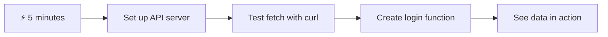

- **मिनेट १-२**: आफ्नो API सर्वर सुरु गर्नुहोस् (`cd api && npm start`) र कनेक्शन परीक्षण गर्नुहोस्
- **मिनेट ३**: `getAccount()` नामक आधारभूत फङ्सन सिर्जना गर्नुहोस् जसले `fetch` प्रयोग गर्छ
- **मिनेट ४**: लगइन फारमलाई `action="javascript:login()"` संग जडान गर्नुहोस्
- **मिनेट ५**: लगइन परीक्षण गर्नुहोस् र कन्सोलमा खाता डेटा देख्नुहोस्

**छिटो परीक्षण कमाण्डहरू**:
```bash
# Verify API is running
curl http://localhost:5000/api

# Test account data fetch
curl http://localhost:5000/api/accounts/test
```

**किन यो महत्त्वपूर्ण छ**: ५ मिनेटमा, तपाईंले असिंक्रोनस डेटा प्राप्त गर्ने जादू देख्नुहुनेछ, जसले प्रत्येक आधुनिक वेब एप्लिकेसनलाई शक्ति दिन्छ। यो नै आधार हो जसले एपहरूलाई उत्तरदायी र जीवित बनाउँछ।

## 🗺️ डेटा-चालित वेब एप्लिकेसनहरूको माध्यमबाट तपाईंको सिकाइ यात्रा

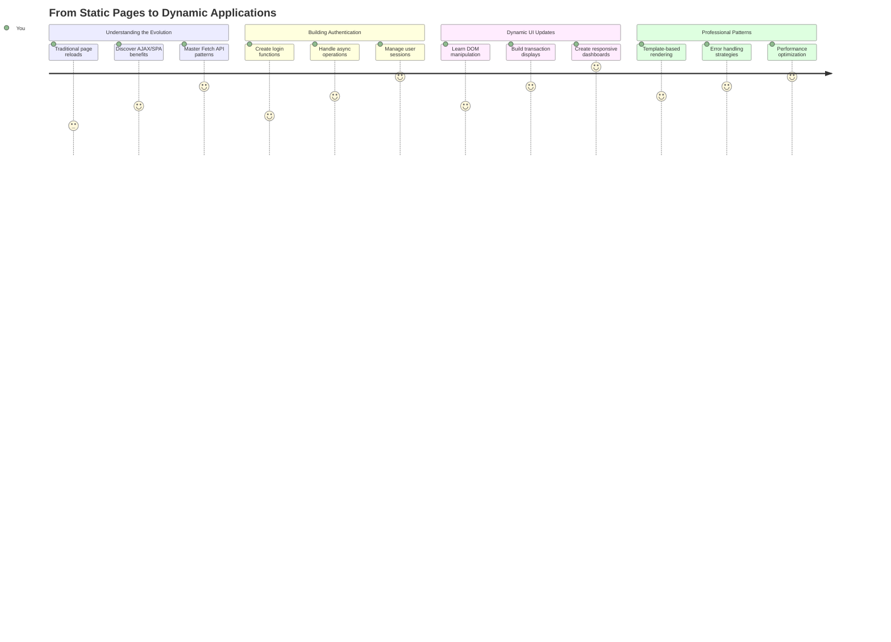

**तपाईंको यात्रा गन्तव्य**: यस पाठको अन्त्यसम्ममा, तपाईंले आधुनिक वेब एप्लिकेसनहरूले कसरी गतिशील रूपमा डेटा प्राप्त, प्रक्रिया, र प्रदर्शन गर्छन् भन्ने बुझ्नुहुनेछ, जसले व्यावसायिक एप्लिकेसनहरूबाट अपेक्षित सहज प्रयोगकर्ता अनुभव सिर्जना गर्छ।

## प्रि-लेक्चर क्विज

[प्रि-लेक्चर क्विज](https://ff-quizzes.netlify.app/web/quiz/45)

### पूर्व-आवश्यकताहरू

डेटा प्राप्त गर्न अघि, यी कम्पोनेन्टहरू तयार गर्नुहोस्:

- **अघिल्लो पाठ**: [लगइन र रजिस्ट्रेसन फारम](../2-forms/README.md) पूरा गर्नुहोस् - हामी यस आधारमा निर्माण गर्नेछौं
- **स्थानीय सर्वर**: [Node.js](https://nodejs.org) स्थापना गर्नुहोस् र [सर्भर API चलाउनुहोस्](../api/README.md) खाता डेटा प्रदान गर्न
- **API कनेक्शन**: यो कमाण्ड प्रयोग गरेर आफ्नो सर्भर कनेक्शन परीक्षण गर्नुहोस्:

```bash
curl http://localhost:5000/api
# Expected response: "Bank API v1.0.0"
```

यो छिटो परीक्षणले सुनिश्चित गर्दछ कि सबै कम्पोनेन्टहरू ठीकसँग संवाद गरिरहेका छन्:
- तपाईंको प्रणालीमा Node.js सही रूपमा चलिरहेको छ भनी प्रमाणित गर्दछ
- तपाईंको API सर्भर सक्रिय र प्रतिक्रिया दिइरहेको छ भनी पुष्टि गर्दछ
- तपाईंको एपले सर्भरमा पुग्न सक्छ भनी प्रमाणित गर्दछ (मिशन अघि रेडियो सम्पर्क जाँच गरेजस्तै)

## 🧠 डेटा व्यवस्थापन इकोसिस्टमको अवलोकन

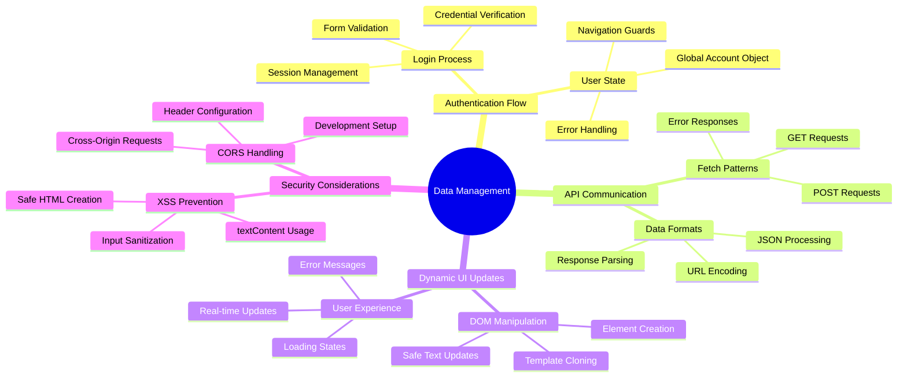

**मुख्य सिद्धान्त**: आधुनिक वेब एप्लिकेसनहरू डेटा समन्वय प्रणाली हुन् - तिनीहरूले प्रयोगकर्ता इन्टरफेस, सर्भर API, र ब्राउजर सुरक्षा मोडेलहरू बीच समन्वय गर्छन् ताकि सहज, उत्तरदायी अनुभव सिर्जना गर्न सकियोस्।

---

## आधुनिक वेब एप्समा डेटा प्राप्त गर्ने तरिका बुझ्दै

वेब एप्लिकेसनहरूले डेटा व्यवस्थापन गर्ने तरिका पछिल्लो दुई दशकमा नाटकीय रूपमा विकसित भएको छ। यो विकास बुझ्दा आधुनिक प्रविधिहरू जस्तै AJAX र Fetch API किन शक्तिशाली छन् र वेब डेभलपरहरूको लागि किन आवश्यक उपकरण बनेका छन् भन्ने कुरा स्पष्ट हुन्छ।

आउनुहोस्, परम्परागत वेबसाइटहरू कसरी काम गर्थे र हामीले आज निर्माण गर्ने गतिशील, उत्तरदायी एप्लिकेसनहरू बीचको भिन्नता अन्वेषण गरौं।

### परम्परागत मल्टि-पेज एप्लिकेसनहरू (MPA)

वेबको सुरुवाती दिनहरूमा, प्रत्येक क्लिक पुरानो टेलिभिजनमा च्यानल परिवर्तन गरेजस्तै थियो - स्क्रिन खाली हुन्थ्यो, अनि नयाँ सामग्रीमा ट्युन गर्न बिस्तारै लाग्थ्यो। यो प्रारम्भिक वेब एप्लिकेसनहरूको वास्तविकता थियो, जहाँ प्रत्येक अन्तरक्रियाले सम्पूर्ण पृष्ठलाई पुनः निर्माण गर्नुपर्थ्यो।

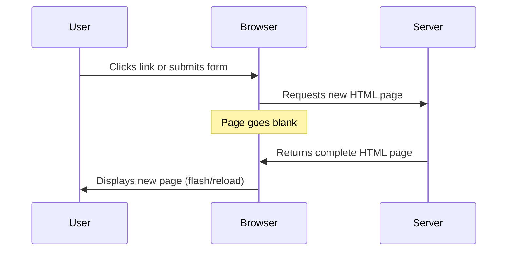

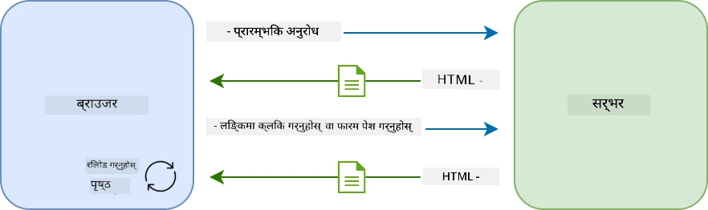

**किन यो विधि असहज लाग्थ्यो:**
- प्रत्येक क्लिकले सम्पूर्ण पृष्ठलाई पुनः निर्माण गर्नुपर्थ्यो
- प्रयोगकर्ताहरूको विचारमा अवरोध आउँथ्यो ती झर्को लाग्ने पृष्ठ फ्ल्यासहरूका कारण
- तपाईंको इन्टरनेट कनेक्शनले बारम्बार हेडर र फुटर डाउनलोड गर्न धेरै काम गर्नुपर्थ्यो
- एपहरू सफ्टवेयर प्रयोग गर्नुभन्दा फाइलिङ क्याबिनेटमा क्लिक गरिरहेको जस्तो लाग्थ्यो

### आधुनिक सिंगल-पेज एप्लिकेसनहरू (SPA)

AJAX (Asynchronous JavaScript and XML) ले यो परिपाटीलाई पूर्ण रूपमा परिवर्तन गर्‍यो। अन्तर्राष्ट्रिय स्पेस स्टेशनको मोड्युलर डिजाइनजस्तै, जहाँ अन्तरिक्ष यात्रीहरूले सम्पूर्ण संरचना पुनः निर्माण नगरी व्यक्तिगत कम्पोनेन्टहरू प्रतिस्थापन गर्न सक्छन्, AJAX ले हामीलाई वेबपृष्ठको विशिष्ट भागहरू पुनः लोड नगरी अपडेट गर्न अनुमति दिन्छ। XML उल्लेख भए पनि, हामी आज प्रायः JSON प्रयोग गर्छौं, तर मुख्य सिद्धान्त उस्तै छ: केवल परिवर्तन भएको भागलाई अपडेट गर्नुहोस्।

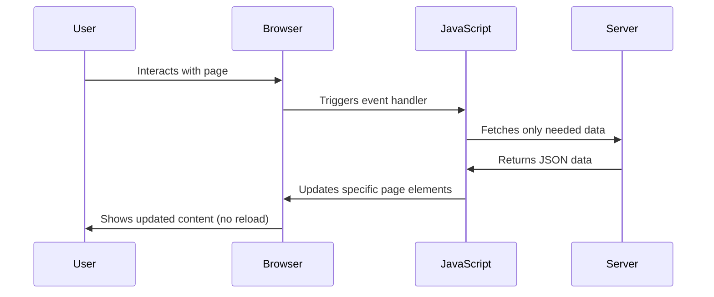

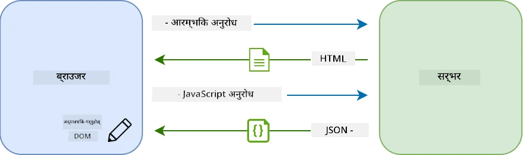

**किन SPA हरू धेरै राम्रो लाग्छन्:**
- केवल वास्तवमा परिवर्तन भएका भागहरू अपडेट हुन्छन् (स्मार्ट, हैन?)
- झट्काहरूको अवरोध छैन - तपाईंका प्रयोगकर्ताहरू आफ्नो प्रवाहमा रहन्छन्
- तारमा कम डेटा यात्रा गर्नुको अर्थ छिटो लोडिङ
- सबै कुरा फोनका एपहरूजस्तै चपल र उत्तरदायी लाग्छ

### आधुनिक Fetch API तर्फको विकास

आधुनिक ब्राउजरहरूले [`Fetch` API](https://developer.mozilla.org/docs/Web/API/Fetch_API) प्रदान गर्छन्, जसले पुरानो [`XMLHttpRequest`](https://developer.mozilla.org/docs/Web/API/XMLHttpRequest/Using_XMLHttpRequest) लाई प्रतिस्थापन गर्छ। टेलिग्राफ चलाउने र इमेल प्रयोग गर्ने बीचको फरकजस्तै, Fetch API ले सफा असिंक्रोनस कोडका लागि प्रॉमिसहरू प्रयोग गर्छ र JSON स्वाभाविक रूपमा ह्यान्डल गर्छ।

| विशेषता | XMLHttpRequest | Fetch API |
|---------|----------------|----------|
| **सिन्ट्याक्स** | जटिल क्यालब्याक-आधारित | सफा प्रॉमिस-आधारित |
| **JSON ह्यान्डलिङ** | म्यानुअल पार्सिङ आवश्यक | बिल्ट-इन `.json()` मेथड |
| **त्रुटि ह्यान्डलिङ** | सीमित त्रुटि जानकारी | व्यापक त्रुटि विवरण |
| **आधुनिक समर्थन** | पुरानो अनुकूलता | ES6+ प्रॉमिस र async/await |

> 💡 **ब्राउजर अनुकूलता**: राम्रो खबर - Fetch API सबै आधुनिक ब्राउजरहरूमा काम गर्छ! यदि तपाईंलाई विशेष संस्करणहरूको बारेमा जिज्ञासा छ भने, [caniuse.com](https://caniuse.com/fetch) मा पूर्ण अनुकूलता कथा छ।
> 
**मुख्य कुरा:**
- क्रोम, फायरफक्स, सफारी, र एजमा राम्रोसँग काम गर्छ (मूलतः जहाँ तपाईंका प्रयोगकर्ताहरू छन्)
- केवल इन्टरनेट एक्सप्लोररलाई अतिरिक्त सहयोग चाहिन्छ (र इमानदारीपूर्वक, अब IE लाई बिदा दिने समय हो)
- हामीले पछि प्रयोग गर्ने सुन्दर async/await ढाँचाहरूको लागि तपाईंलाई पूर्ण रूपमा तयार बनाउँछ

### प्रयोगकर्ता लगइन र डेटा पुनःप्राप्ति कार्यान्वयन गर्दै

अब हामी लगइन प्रणाली कार्यान्वयन गर्नेछौं जसले तपाईंको बैंकिङ एपलाई स्थिर प्रदर्शनबाट कार्यात्मक एप्लिकेसनमा रूपान्तरण गर्छ। जस्तै सुरक्षित सैन्य सुविधाहरूमा प्रयोग गरिने प्रमाणीकरण प्रोटोकलहरू, हामी प्रयोगकर्ताको प्रमाणिकता पुष्टि गर्नेछौं र त्यसपछि तिनीहरूको विशिष्ट डेटा प्रदान गर्नेछौं।

हामी यसलाई क्रमिक रूपमा निर्माण गर्नेछौं, आधारभूत प्रमाणीकरणबाट सुरु गर्दै र त्यसपछि डेटा प्राप्त गर्ने क्षमता थप्दै।

#### चरण १: लगइन फङ्सनको आधार सिर्जना गर्नुहोस्

तपाईंको `app.js` फाइल खोल्नुहोस् र नयाँ `login` फङ्सन थप्नुहोस्। यसले प्रयोगकर्ता प्रमाणीकरण प्रक्रिया ह्यान्डल गर्नेछ:

```javascript
async function login() {
  const loginForm = document.getElementById('loginForm');
  const user = loginForm.user.value;
}
```

**यसलाई टुक्रा-टुक्रामा बुझौं:**
- त्यो `async` कीवर्ड? यसले जाभास्क्रिप्टलाई "हे, यो फङ्सनले पर्खनु पर्ने हुन सक्छ" भन्छ
- हामी पृष्ठबाट हाम्रो फारम समात्दैछौं (केही विशेष छैन, केवल यसको ID द्वारा खोज्दैछौं)
- त्यसपछि हामी प्रयोगकर्ताले टाइप गरेको युजरनेम निकाल्दैछौं
- यहाँ एउटा राम्रो ट्रिक छ: तपाईं कुनै पनि फारम इनपुटलाई यसको `name` एट्रिब्युटद्वारा पहुँच गर्न सक्नुहुन्छ - अतिरिक्त getElementById कलहरूको आवश्यकता छैन!

> 💡 **फारम पहुँच ढाँचा**: प्रत्येक फारम कन्ट्रोललाई यसको नाम (HTML मा `name` एट्रिब्युट प्रयोग गरेर सेट गरिएको) द्वारा फारम एलिमेन्टको प्रोपर्टीको रूपमा पहुँच गर्न सकिन्छ। यसले फारम डेटा प्राप्त गर्न सफा, पढ्न मिल्ने तरिका प्रदान गर्दछ।

#### चरण २: खाता डेटा प्राप्त गर्ने फङ्सन सिर्जना गर्नुहोस्

अब, हामी सर्भरबाट खाता डेटा प्राप्त गर्न समर्पित फङ्सन सिर्जना गर्नेछौं। यो तपाईंको रजिस्ट्रेसन फङ्सनजस्तै ढाँचालाई पछ्याउँछ तर डेटा पुनःप्राप्तिमा केन्द्रित छ:

```javascript
async function getAccount(user) {
  try {
    const response = await fetch('//localhost:5000/api/accounts/' + encodeURIComponent(user));
    return await response.json();
  } catch (error) {
    return { error: error.message || 'Unknown error' };
  }
}
```

**यस कोडले के पूरा गर्छ:**
- **प्रयोग गर्छ** आधुनिक `fetch` API डेटा असिंक्रोनस रूपमा अनुरोध गर्न
- **निर्माण गर्छ** GET अनुरोध URL युजरनेम प्यारामिटरको साथ
- **लागु गर्छ** `encodeURIComponent()` विशेष क्यारेक्टरहरूलाई सुरक्षित रूपमा ह्यान्डल गर्न URL मा
- **रूपान्तरण गर्छ** प्रतिक्रिया JSON ढाँचामा सजिलो डेटा ह्यान्डलिङको लागि
- **ह्यान्डल गर्छ** त्रुटिहरूलाई ग्रेसफुली, क्र्यास नगरी त्रुटि वस्तु फिर्ता गरेर

> ⚠️ **सुरक्षा नोट**: `encodeURIComponent()` फङ्सनले URL मा विशेष क्यारेक्टरहरू ह्यान्डल गर्छ। जस्तै नौसेनाको सञ्चारमा प्रयोग गरिने एन्कोडिङ प्रणाली, यसले तपाईंको सन्देशलाई ठीक त्यस्तै रूपमा सुनिश्चित गर्दछ, जस्तै "#" वा "&" जस्ता क्यारेक्टरहरू गलत व्याख्या हुनबाट रोक्छ।
> 
**किन यो महत्त्वपूर्ण छ:**
- विशेष क्यारेक्टरहरूले URL बिगार्नबाट रोक्छ
- URL म्यानिपुलेसन आक्रमणबाट सुरक्षा प्रदान गर्दछ
- सुनिश्चित गर्दछ कि तपाईंको सर्भरले इच्छित डेटा प्राप्त गर्छ
- सुरक्षित कोडिङ अभ्यासहरू पछ्याउँछ

#### HTTP GET अनुरोधहरू बुझ्दै

तपाईंलाई यो थाहा पाउँदा अचम्म लाग्न सक्छ: जब तपाईंले `fetch` कुनै अतिरिक्त विकल्पहरू बिना प्रयोग गर्नुहुन्छ, यसले स्वतः [`GET`](https://developer.mozilla.org/docs/Web/HTTP/Methods/GET) अनुरोध सिर्जना गर्छ। यो हामीले गरिरहेको कामको लागि उत्तम छ - सर्भरलाई सोध्दै "हे, म यो प्रयोगकर्ताको खाता डेटा देख्न सक्छु?"

GET अनुरोधहरूलाई पुस्तकालयबाट पुस्तक उधारो माग्न जस्तै सोच्नुहोस् - तपाईंले पहिले नै रहेको केही हेर्न अनुरोध गर्दै हुनुहुन्छ। POST अनुरोधहरू (जसलाई हामीले रजिस्ट्रेसनका लागि प्रयोग गर्यौं) नयाँ पुस्तक संग्रहमा थप्न पेश गर्ने जस्तै हो।

| GET अनुरोध | POST अनुरोध |
|-------------|-------------|
| **उद्देश्य** | पहिले नै रहेको डेटा पुनःप्राप्त गर्नुहोस् | सर्भरमा नयाँ डेटा पठाउनुहोस् |
| **प्यारामिटरहरू** | URL पथ/क्वेरी स्ट्रिङमा | अनुरोध बडीमा |
| **क्यासिङ** | ब्राउजरद्वारा क्यास गर्न सकिन्छ | सामान्यतया क्यास गरिँदैन |
| **सुरक्षा** | URL/लॉगमा देखिने | अनुरोध बडीमा लुकेको |

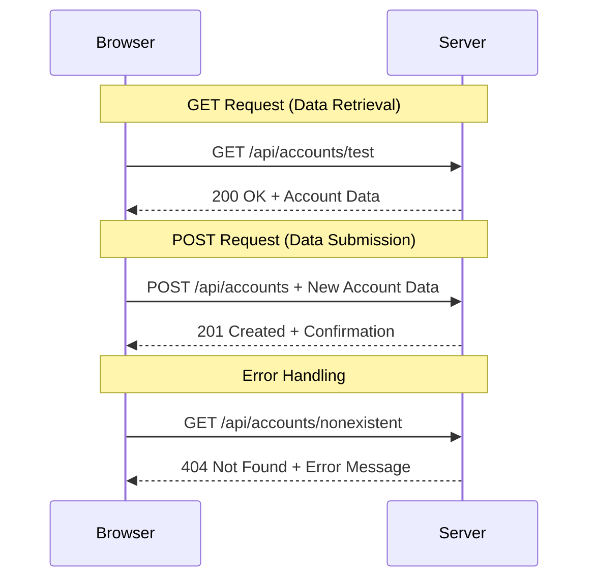

#### चरण ३: सबै कुरा एकसाथ ल्याउँदै

अब सन्तोषजनक भागको लागि - तपाईंको खाता प्राप्त गर्ने फङ्सनलाई लगइन प्रक्रियासँग जडान गरौं। यहीँ सबै कुरा मिलेर आउँछ:

```javascript
async function login() {
  const loginForm = document.getElementById('loginForm');
  const user = loginForm.user.value;
  const data = await getAccount(user);

  if (data.error) {
    return console.log('loginError', data.error);
  }

  account = data;
  navigate('/dashboard');
}
```

यो फङ्सनले स्पष्ट क्रम पछ्याउँछ:
- फारम इनपुटबाट युजरनेम निकाल्नुहोस्
- सर्भरबाट प्रयोगकर्ताको खाता डेटा अनुरोध गर्नुहोस्
- प्रक्रियाको क्रममा हुने कुनै पनि त्रुटिहरू ह्यान्डल गर्नुहोस्
- खाता डेटा भण्डारण गर्नुहोस् र सफलतापछि ड्यासबोर्डमा जानुहोस्

> 🎯 **Async/Await ढाँचा**: किनकि `getAccount` एक असिंक्रोनस फङ्सन हो, हामी `await` कीवर्ड प्रयोग गर्छौं ताकि सर्भरले प्रतिक्रिया दिनसम्म कार्यान्वयन रोकियोस्। यसले कोडलाई परिभाषित नभएको डेटा संग जारी राख्नबाट रोक्छ।

#### चरण ४: तपाईंको डेटा राख्नको लागि स्थान सिर्जना गर्नुहोस्

तपाईंको एपलाई खाता जानकारी लोड भएपछि सम्झनको लागि कुनै स्थान चाहिन्छ। यसलाई तपाईंको एपको छोटो समयको स्मृति जस्तै सोच्नुहोस् - हालको प्रयोगकर्ताको डेटा सजिलै राख्नको लागि ठाउँ। तपाईंको `app.js` फाइलको माथि यो लाइन थप्नुहोस्:

```javascript
// This holds the current user's account data
let account = null;
```

**किन हामीलाई यो चाहिन्छ:**
- खाता डेटा तपाईंको एपको कुनै पनि स्थानबाट पहुँचयोग्य राख्छ
- `null` बाट सुरु गर्नुको अर्थ "अहिलेसम्म कोही पनि लगइन भएको छैन"
- जब कोही सफलतापूर्वक लगइन वा रजिस्टर गर्छ, अपडेट हुन्छ
- सत्यको एकल स्रोतको रूपमा काम गर्छ - को लगइन छ भन्नेमा कुनै भ्रम छैन

#### चरण ५: तपाईंको फारम जडान गर्नुहोस्

अब तपाईंको नयाँ लगइन फङ्सनलाई तपाईंको HTML फारमसँग जडान गरौं। तपाईंको फारम ट्यागलाई यसरी अपडेट गर्नुहोस्:

```html
<form id="loginForm" action="javascript:login()">
  <!-- Your existing form inputs -->
</form>
```

**यो सानो परिवर्तनले के गर्छ:**
- फारमलाई यसको डिफल्ट "सम्पूर्ण पृष्ठ पुनः लोड गर्ने" व्यवहारबाट रोक्छ
- तपाईंको कस्टम जाभास्क्रिप्ट फङ्सनलाई कल गर्छ
- सबै कुरा सहज र सिंगल-पेज-एप-जस्तै राख्छ
- प्रयोगकर्ताहरूले "लगइन" थिच्दा के हुन्छ भन्नेमा तपाईंलाई पूर्ण नियन्त्रण दिन्छ

#### चरण ६: तपाईंको रजिस्ट्रेसन फङ्सनलाई सुधार गर्नुहोस्

संगतताको लागि, तपाईंको `register` फङ्सनलाई पनि खाता डेटा भण्डारण गर्न र ड्यासबोर्डमा जानको लागि अपडेट गर्नुहोस्:

```javascript
// Add these lines at the end of your register function
account = result;
navigate('/dashboard');
```

**यो सुधारले प्रदान गर्छ:**
- **सहज** रजिस्ट्रेसनबाट ड्यासबोर्डमा संक्रमण
- **संगत** प्रयोगकर्ता अनुभव लगइन र रजिस्ट्रेसन प्रवाहहरू बीच
- **तुरुन्तै** सफल रजिस्ट्रेसन पछि खाता डेटा पहुँच

#### तपाईंको कार्यान्वयन परीक्षण गर्दै

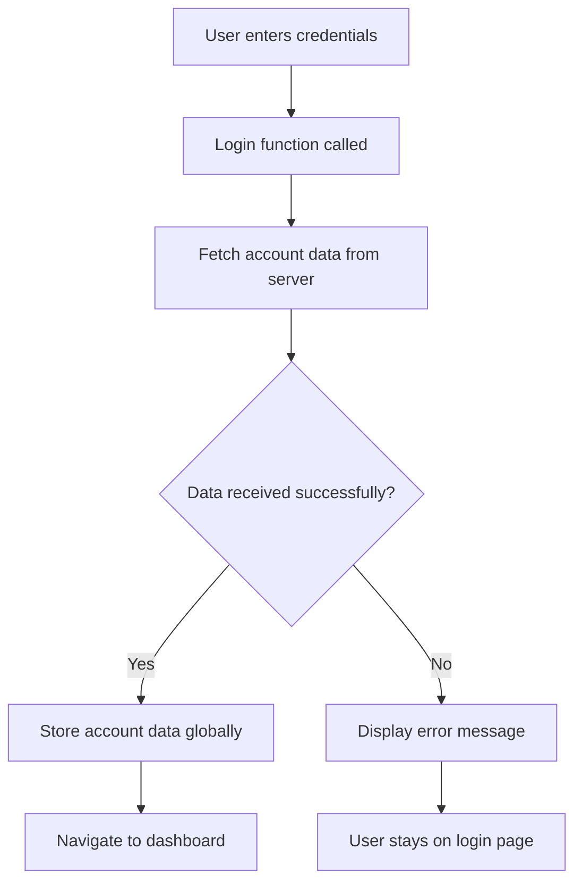

**यसलाई परीक्षण गर्ने समय:**
1. नयाँ खाता सिर्जना गर्नुहोस् र सबै कुरा ठीक छ भनी सुनिश्चित गर्नुहोस्
2. ती समान प्रमाणहरू प्रयोग गरेर लगइन प्रयास गर्नुहोस्
3. यदि केही समस्या देखिन्छ भने, तपाईंको ब्राउजरको कन्सोल (F12) हेर्नुहोस्
4. सफल लगइन पछि ड्यासबोर्डमा पुग्न सुनिश्चित गर्नुहोस्

यदि केही काम गरिरहेको छैन भने, चिन्ता नगर्नुहोस्! अधिकांश समस्याहरू साधारण सुधारहरू हुन् जस्तै टाइपोहरू वा API सर्भर सुरु गर्न बिर्सनु।

#### क्रस-ओरिजिन जादूको बारेमा छिटो शब्द

तपाईं सोच्दै हुनुहुन्छ: "मेरो वेब एपले कसरी यो API सर्भरसँग कुरा गरिरहेको छ जब तिनीहरू फरक पोर्टमा चलिरहेका छन्?" राम्रो प्रश्न! यो प्रत्येक वेब डेभलपरले अन्ततः सामना गर्ने विषय हो।

> 🔒 **क्रस-ओरिजिन सुरक्षा**: ब्राउजरहरूले "साम-ओरिजिन नीति" लागू गर्छन् ताकि
DOM म्यानिपुलेसन भनेको स्थिर वेब पृष्ठलाई गतिशील एप्लिकेसनमा परिवर्तन गर्ने प्रविधि हो, जसले प्रयोगकर्ताको अन्तरक्रिया र सर्भरको प्रतिक्रियाको आधारमा सामग्री अपडेट गर्दछ।

### कामको लागि सही उपकरण छान्नुहोस्

जब तपाईं आफ्नो HTML लाई JavaScript प्रयोग गरेर अपडेट गर्नुहुन्छ, तपाईंसँग धेरै विकल्पहरू छन्। यीलाई उपकरणको बक्समा विभिन्न उपकरणहरू जस्तै सोच्नुहोस् - प्रत्येक विशेष कामको लागि उपयुक्त:

| विधि | यो केको लागि राम्रो छ | कहिले प्रयोग गर्ने | सुरक्षा स्तर |
|--------|---------------------|----------------|--------------|
| `textContent` | प्रयोगकर्ताको डेटा सुरक्षित रूपमा देखाउने | जब तपाईं पाठ देखाउँदै हुनुहुन्छ | ✅ अत्यन्त सुरक्षित |
| `createElement()` + `append()` | जटिल लेआउट बनाउने | नयाँ सेक्सन/सूचीहरू सिर्जना गर्ने | ✅ पूर्ण सुरक्षित |
| `innerHTML` | HTML सामग्री सेट गर्ने | ⚠️ यसलाई सकेसम्म टाढा राख्नुहोस् | ❌ जोखिमपूर्ण |

#### सुरक्षित तरिकाले पाठ देखाउने: textContent

[`textContent`](https://developer.mozilla.org/docs/Web/API/Node/textContent) गुण तपाईंको वेबपृष्ठको लागि सुरक्षा गार्ड जस्तै हो - हानिकारक केही पनि भित्र आउँदैन:

```javascript
// The safe, reliable way to update text
const balanceElement = document.getElementById('balance');
balanceElement.textContent = account.balance;
```

**textContent को फाइदा:**
- सबैलाई सामान्य पाठको रूपमा व्यवहार गर्छ (स्क्रिप्ट कार्यान्वयन रोक्छ)
- स्वतः विद्यमान सामग्री हटाउँछ
- साधारण पाठ अपडेटको लागि प्रभावकारी
- हानिकारक सामग्रीको विरुद्धमा निर्मित सुरक्षा प्रदान गर्छ

#### गतिशील HTML तत्वहरू सिर्जना गर्नुहोस्

अझ जटिल सामग्रीको लागि, [`document.createElement()`](https://developer.mozilla.org/docs/Web/API/Document/createElement) लाई [`append()`](https://developer.mozilla.org/docs/Web/API/ParentNode/append) विधिसँग मिलाउनुहोस्:

```javascript
// Safe way to create new elements
const transactionItem = document.createElement('div');
transactionItem.className = 'transaction-item';
transactionItem.textContent = `${transaction.date}: ${transaction.description}`;
container.append(transactionItem);
```

**यस दृष्टिकोणलाई बुझ्दै:**
- **नयाँ DOM तत्वहरू** प्रोग्राममार्फत सिर्जना गर्छ
- **तत्वको गुणहरू र सामग्रीमा** पूर्ण नियन्त्रण राख्छ
- **जटिल, नेस्टेड तत्व संरचनाहरूको लागि अनुमति दिन्छ**
- **सुरक्षा कायम राख्छ** संरचना र सामग्रीलाई अलग गरेर

> ⚠️ **सुरक्षा विचार**: जबकि [`innerHTML`](https://developer.mozilla.org/docs/Web/API/Element/innerHTML) धेरै ट्युटोरियलहरूमा देखिन्छ, यसले एम्बेड गरिएको स्क्रिप्टहरू कार्यान्वयन गर्न सक्छ। CERN मा सुरक्षा प्रोटोकलहरूले अनधिकृत कोड कार्यान्वयन रोक्ने जस्तै, `textContent` र `createElement` प्रयोग गर्दा सुरक्षित विकल्पहरू प्रदान गर्दछ।
> 
**innerHTML को जोखिम:**
- प्रयोगकर्ताको डेटा भित्रका कुनै पनि `<script>` ट्यागहरू कार्यान्वयन गर्छ
- कोड इन्जेक्सन आक्रमणको लागि संवेदनशील
- सम्भावित सुरक्षा कमजोरीहरू सिर्जना गर्छ
- हामीले प्रयोग गरिरहेका सुरक्षित विकल्पहरूले समान कार्यक्षमता प्रदान गर्छ

### प्रयोगकर्ताको लागि त्रुटिहरूलाई मैत्रीपूर्ण बनाउने

हाल, लगइन त्रुटिहरू ब्राउजर कन्सोलमा मात्र देखिन्छन्, जुन प्रयोगकर्ताहरूका लागि अदृश्य छ। पाइलटको आन्तरिक डायग्नोस्टिक्स र यात्रु सूचना प्रणालीको बीचको फरक जस्तै, हामीले महत्त्वपूर्ण जानकारी उपयुक्त च्यानलमार्फत संचार गर्न आवश्यक छ।

दृश्य त्रुटि सन्देशहरू कार्यान्वयन गर्दा प्रयोगकर्ताहरूलाई के गलत भयो र कसरी अगाडि बढ्ने भन्ने बारेमा तुरुन्त प्रतिक्रिया प्रदान गर्दछ।

#### चरण 1: त्रुटि सन्देशहरूको लागि स्थान थप्नुहोस्

पहिले, त्रुटि सन्देशहरूको लागि तपाईंको HTML मा स्थान दिनुहोस्। यो तपाईंको लगइन बटनको ठीक अगाडि थप्नुहोस् ताकि प्रयोगकर्ताहरूले यसलाई स्वाभाविक रूपमा देख्न सकून्:

```html
<!-- This is where error messages will appear -->
<div id="loginError" role="alert"></div>
<button>Login</button>
```

**यहाँ के भइरहेको छ:**
- हामीले एउटा खाली कन्टेनर सिर्जना गरेका छौं जुन आवश्यक नभएसम्म अदृश्य रहन्छ
- यो "लगइन" क्लिक गरेपछि प्रयोगकर्ताहरू स्वाभाविक रूपमा हेर्ने स्थानमा राखिएको छ
- त्यो `role="alert"` स्क्रिन रिडरहरूको लागि राम्रो स्पर्श हो - यसले सहायक प्रविधिलाई भन्छ "हे, यो महत्त्वपूर्ण छ!"
- अनौठो `id` ले हाम्रो JavaScript लाई सजिलो लक्ष्य दिन्छ

#### चरण 2: उपयोगी सहायक कार्य बनाउनुहोस्

अब एउटा सानो युटिलिटी कार्य बनाऔं जसले कुनै पनि तत्वको पाठ अपडेट गर्न सक्छ। यो "एक पटक लेख्नुहोस्, सबै ठाउँमा प्रयोग गर्नुहोस्" प्रकारको कार्य हो जसले तपाईंको समय बचत गर्नेछ:

```javascript
function updateElement(id, text) {
  const element = document.getElementById(id);
  element.textContent = text;
}
```

**कार्यको फाइदा:**
- केवल तत्वको ID र पाठ सामग्री चाहिने सरल इन्टरफेस
- सुरक्षित रूपमा DOM तत्वहरू पत्ता लगाउँछ र अपडेट गर्छ
- पुन: प्रयोगयोग्य ढाँचा जसले कोड दोहोर्याउने कम गर्छ
- अनुप्रयोगभरि निरन्तर अपडेट गर्ने व्यवहार कायम राख्छ

#### चरण 3: त्रुटिहरू प्रयोगकर्ताहरूले देख्न सक्ने ठाउँमा देखाउनुहोस्

अब लुकेको कन्सोल सन्देशलाई प्रयोगकर्ताहरूले वास्तवमा देख्न सक्ने केहि कुरासँग बदलौं। तपाईंको लगइन कार्यलाई अपडेट गर्नुहोस्:

```javascript
// Instead of just logging to console, show the user what's wrong
if (data.error) {
  return updateElement('loginError', data.error);
}
```

**यो सानो परिवर्तनले ठूलो फरक पार्छ:**
- त्रुटि सन्देशहरू ठीक त्यही ठाउँमा देखिन्छ जहाँ प्रयोगकर्ताहरू हेर्दैछन्
- अब रहस्यमय मौन असफलताहरू छैनन्
- प्रयोगकर्ताहरूले तुरुन्त, कार्यात्मक प्रतिक्रिया पाउँछन्
- तपाईंको एप व्यावसायिक र विचारशील महसुस गर्न थाल्छ

अब जब तपाईंले अमान्य खाता प्रयोग गरेर परीक्षण गर्नुहुन्छ, तपाईंले पृष्ठमा नै उपयोगी त्रुटि सन्देश देख्नुहुनेछ!


#### चरण 4: पहुँचयोग्यताको साथ समावेशी बन्नुहोस्

त्यो `role="alert"` हामीले पहिले थपेको कुरा यहाँ चाखलाग्दो छ - यो केवल सजावट होइन! यो सानो विशेषताले [Live Region](https://developer.mozilla.org/docs/Web/Accessibility/ARIA/ARIA_Live_Regions) सिर्जना गर्छ जसले स्क्रिन रिडरहरूलाई तुरुन्त परिवर्तन घोषणा गर्छ:

```html
<div id="loginError" role="alert"></div>
```

**यसको महत्त्व किन छ:**
- स्क्रिन रिडर प्रयोगकर्ताहरूले त्रुटि सन्देश तुरुन्तै सुन्छन्
- सबैले महत्त्वपूर्ण जानकारी समान रूपमा पाउँछन्, चाहे उनीहरूले कसरी नेभिगेट गरे पनि
- यो तपाईंको एपलाई धेरै व्यक्तिहरूको लागि काम गर्न सजिलो बनाउने सरल तरिका हो
- समावेशी अनुभवहरू सिर्जना गर्न तपाईंले ध्यान दिनुभएको देखाउँछ

यस्ता साना स्पर्शहरूले राम्रो विकासकर्तालाई उत्कृष्ट बनाउँछ!

### 🎯 शैक्षिक जाँच: प्रमाणीकरण ढाँचा

**रोक्नुहोस् र विचार गर्नुहोस्**: तपाईंले पूर्ण प्रमाणीकरण प्रवाह कार्यान्वयन गर्नुभएको छ। यो वेब विकासमा आधारभूत ढाँचा हो।

**छोटो आत्म-मूल्यांकन**:
- तपाईं API कलहरूको लागि async/await किन प्रयोग गर्छौं भनेर व्याख्या गर्न सक्नुहुन्छ?
- यदि हामीले `encodeURIComponent()` कार्य बिर्स्यौं भने के हुन्छ?
- हाम्रो त्रुटि ह्यान्डलिङले प्रयोगकर्ता अनुभवलाई कसरी सुधार गर्छ?

**वास्तविक संसारको सम्बन्ध**: तपाईंले यहाँ सिक्नुभएको ढाँचा (async डेटा फेचिङ, त्रुटि ह्यान्डलिङ, प्रयोगकर्ता प्रतिक्रिया) प्रत्येक प्रमुख वेब एप्लिकेसनमा प्रयोग गरिन्छ, सामाजिक मिडिया प्लेटफर्मदेखि ई-कमर्स साइटसम्म। तपाईं उत्पादन-स्तरको सीप निर्माण गर्दै हुनुहुन्छ!

**चुनौती प्रश्न**: तपाईंले यो प्रमाणीकरण प्रणालीलाई कसरी संशोधन गर्न सक्नुहुन्छ ताकि यसले धेरै प्रयोगकर्ता भूमिकाहरू (ग्राहक, प्रशासक, टेलर) ह्यान्डल गर्न सकून्? आवश्यक डेटा संरचना र UI परिवर्तनहरूको बारेमा सोच्नुहोस्।

#### चरण 5: दर्तामा समान ढाँचा लागू गर्नुहोस्

सुसंगतताका लागि, तपाईंको दर्ता फारममा समान त्रुटि ह्यान्डलिङ कार्यान्वयन गर्नुहोस्:

1. **थप्नुहोस्** त्रुटि प्रदर्शन तत्वलाई तपाईंको दर्ता HTML मा:
```html
<div id="registerError" role="alert"></div>
```

2. **अपडेट गर्नुहोस्** तपाईंको दर्ता कार्यलाई समान त्रुटि प्रदर्शन ढाँचा प्रयोग गर्न:
```javascript
if (data.error) {
  return updateElement('registerError', data.error);
}
```

**सुसंगत त्रुटि ह्यान्डलिङको फाइदा:**
- **समान** प्रयोगकर्ता अनुभव सबै फारमहरूमा प्रदान गर्छ
- **परिचित ढाँचाहरू** प्रयोग गरेर संज्ञानात्मक भार कम गर्छ
- **पुन: प्रयोगयोग्य कोड** द्वारा मर्मतसम्भारलाई सरल बनाउँछ
- **पहुँचयोग्यता मापदण्डहरू** अनुप्रयोगभरि पूरा गर्छ

## तपाईंको गतिशील ड्यासबोर्ड सिर्जना गर्दै

अब हामी तपाईंको स्थिर ड्यासबोर्डलाई गतिशील इन्टरफेसमा परिवर्तन गर्नेछौं जसले वास्तविक खाता डेटा देखाउँछ। मुद्रित उडान तालिका र एयरपोर्टमा लाइभ प्रस्थान बोर्डहरूको बीचको फरक जस्तै, हामी स्थिर जानकारीबाट वास्तविक-समय, प्रतिक्रियाशील प्रदर्शनमा जाँदैछौं।

तपाईंले सिक्नुभएको DOM म्यानिपुलेसन प्रविधि प्रयोग गरेर, हामी एउटा ड्यासबोर्ड बनाउनेछौं जसले हालको खाता जानकारीसँग स्वतः अपडेट गर्दछ।

### तपाईंको डेटा चिन्नुहोस्

हामी निर्माण सुरु गर्नु अघि, तपाईंको सर्भरले फिर्ता पठाउने डेटा प्रकारको झलक हेरौं। जब कसैले सफलतापूर्वक लगइन गर्छ, यहाँ तपाईंले काम गर्न पाउने जानकारीको खजाना छ:

```json
{
  "user": "test",
  "currency": "$",
  "description": "Test account",
  "balance": 75,
  "transactions": [
    { "id": "1", "date": "2020-10-01", "object": "Pocket money", "amount": 50 },
    { "id": "2", "date": "2020-10-03", "object": "Book", "amount": -10 },
    { "id": "3", "date": "2020-10-04", "object": "Sandwich", "amount": -5 }
  ]
}
```

**यो डेटा संरचनाले प्रदान गर्छ:**
- **`user`**: अनुभवलाई व्यक्तिगत बनाउनको लागि उपयुक्त ("फेरि स्वागत छ, Sarah!")
- **`currency`**: पैसा रकम सही ढंगले देखाउन सुनिश्चित गर्छ
- **`description`**: खाताको लागि मैत्रीपूर्ण नाम
- **`balance`**: सबैभन्दा महत्त्वपूर्ण वर्तमान ब्यालेन्स
- **`transactions`**: सम्पूर्ण लेनदेन इतिहास सबै विवरणहरूसहित

पेशेवर देखिने बैंकिङ ड्यासबोर्ड निर्माण गर्न तपाईंलाई चाहिने सबै कुरा!

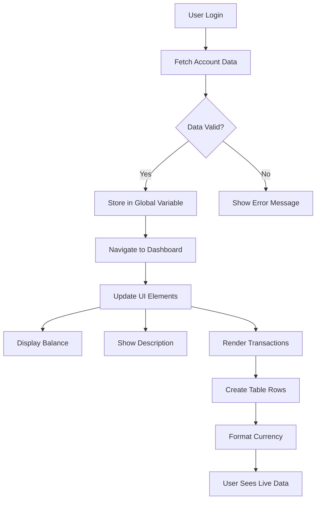

> 💡 **प्रो टिप**: तपाईंको ड्यासबोर्डलाई तुरुन्तै काममा देख्न चाहनुहुन्छ? जब तपाईं लगइन गर्नुहुन्छ, `test` प्रयोगकर्ता नाम प्रयोग गर्नुहोस् - यसमा पहिले नै नमूना डेटा लोड गरिएको छ ताकि तपाईंले लेनदेन सिर्जना गर्नु अघि सबै काम गरिरहेको देख्न सक्नुहुन्छ।
> 
**परीक्षण खाता किन उपयोगी छ:**
- पहिले नै यथार्थपरक नमूना डेटा लोड गरिएको छ
- लेनदेन कसरी प्रदर्शन हुन्छ हेर्नको लागि उत्तम
- तपाईंको ड्यासबोर्ड सुविधाहरू परीक्षण गर्न उत्कृष्ट
- तपाईंलाई म्यानुअल रूपमा डमी डेटा सिर्जना गर्नबाट बचाउँछ

### ड्यासबोर्ड प्रदर्शन तत्वहरू सिर्जना गर्दै

अब हामी तपाईंको ड्यासबोर्ड इन्टरफेसलाई चरणबद्ध रूपमा निर्माण गर्नेछौं, खाता सारांश जानकारीबाट सुरु गर्दै र लेनदेन सूचीहरू जस्ता जटिल सुविधाहरूमा जानेछौं।

#### चरण 1: तपाईंको HTML संरचना अपडेट गर्नुहोस्

पहिले, स्थिर "ब्यालेन्स" सेक्सनलाई गतिशील प्लेसहोल्डर तत्वहरूसँग बदल्नुहोस् जसलाई तपाईंको JavaScript ले भरिदिन सक्छ:

```html
<section>
  Balance: <span id="balance"></span><span id="currency"></span>
</section>
```

अर्को, खाता विवरणको लागि एउटा सेक्सन थप्नुहोस्। किनभने यो ड्यासबोर्ड सामग्रीको लागि शीर्षकको रूपमा कार्य गर्दछ, सेम्यान्टिक HTML प्रयोग गर्नुहोस्:

```html
<h2 id="description"></h2>
```

**HTML संरचनालाई बुझ्दै:**
- **अलग `<span>` तत्वहरू** ब्यालेन्स र मुद्रा व्यक्तिगत नियन्त्रणको लागि प्रयोग गर्छ
- **प्रत्येक तत्वमा** JavaScript लक्ष्यको लागि अनौठो ID लागू गर्छ
- **सेम्यान्टिक HTML** प्रयोग गरेर `<h2>` लाई खाता विवरणको लागि प्रयोग गर्छ
- **स्क्रिन रिडर र SEO को लागि** तार्किक पदानुक्रम सिर्जना गर्छ

> ✅ **पहुँचयोग्यता जानकारी**: खाता विवरण ड्यासबोर्ड सामग्रीको शीर्षकको रूपमा कार्य गर्दछ, त्यसैले यसलाई सेम्यान्टिक रूपमा शीर्षकको रूपमा चिन्हित गरिएको छ। [शीर्षक संरचना](https://www.nomensa.com/blog/2017/how-structure-headings-web-accessibility) पहुँचयोग्यतामा कसरी प्रभाव पार्छ भन्ने बारेमा थप जान्नुहोस्। तपाईंको पृष्ठमा अन्य तत्वहरू पहिचान गर्न सक्नुहुन्छ जसले शीर्षक ट्यागहरूबाट लाभ उठाउन सक्छ?

#### चरण 2: ड्यासबोर्ड अपडेट कार्य सिर्जना गर्नुहोस्

अब एउटा कार्य सिर्जना गर्नुहोस् जसले वास्तविक खाता डेटा प्रयोग गरेर तपाईंको ड्यासबोर्डलाई भरिदिन्छ:

```javascript
function updateDashboard() {
  if (!account) {
    return navigate('/login');
  }

  updateElement('description', account.description);
  updateElement('balance', account.balance.toFixed(2));
  updateElement('currency', account.currency);
}
```

**चरणबद्ध रूपमा, यो कार्यले के गर्छ:**
- **खाता डेटा छ कि छैन भेरिफाई गर्छ** अघि बढ्नु अघि
- **अप्रमाणित प्रयोगकर्ताहरूलाई लगइन पृष्ठमा पुन: निर्देशित गर्छ**
- **पुन: प्रयोगयोग्य `updateElement` कार्य प्रयोग गरेर खाता विवरण अपडेट गर्छ**
- **ब्यालेन्सलाई सधैं दुई दशमलव स्थान देखाउन ढाँचा बनाउँछ**
- **उपयुक्त मुद्रा प्रतीक देखाउँछ**

> 💰 **पैसा ढाँसिङ**: त्यो [`toFixed(2)`](https://developer.mozilla.org/docs/Web/JavaScript/Reference/Global_Objects/Number/toFixed) विधि जीवन बचाउने हो! यसले तपाईंको ब्यालेन्सलाई सधैं वास्तविक पैसाजस्तै देखाउँछ - "75.00" सट्टा केवल "75"। तपाईंका प्रयोगकर्ताहरूले परिचित मुद्रा ढाँसिङ देख्न सराहना गर्नेछन्।

#### चरण 3: तपाईंको ड्यासबोर्ड अपडेट सुनिश्चित गर्नुहोस्

तपाईंको ड्यासबोर्डले प्रत्येक पटक कसैले यसलाई भ्रमण गर्दा वर्तमान डेटा देखाउन सुनिश्चित गर्न, हामीले तपाईंको नेभिगेसन प्रणालीमा हुक गर्न आवश्यक छ। यदि तपाईंले [पाठ 1 असाइनमेन्ट](../1-template-route/assignment.md) पूरा गर्नुभएको छ भने, यो परिचित महसुस हुनुपर्छ। यदि छैन भने, चिन्ता नगर्नुहोस् - यहाँ तपाईंलाई चाहिने कुरा छ:

तपाईंको `updateRoute()` कार्यको अन्त्यमा यो थप्नुहोस्:

```javascript
if (typeof route.init === 'function') {
  route.init();
}
```

त्यसपछि तपाईंको रूटहरूलाई ड्यासबोर्ड इनिसियलाइजेसन समावेश गर्न अपडेट गर्नुहोस्:

```javascript
const routes = {
  '/login': { templateId: 'login' },
  '/dashboard': { templateId: 'dashboard', init: updateDashboard }
};
```

**यो चतुर सेटअपले के गर्छ:**
- जाँच गर्छ कि रूटमा विशेष इनिसियलाइजेसन कोड छ कि छैन
- रूट लोड हुँदा स्वतः त्यो कोड चलाउँछ
- तपाईंको ड्यासबोर्डले सधैं ताजा, वर्तमान डेटा देखाउँछ
- तपाईंको रूटिङ तर्कलाई सफा र व्यवस्थित राख्छ

#### तपाईंको ड्यासबोर्ड परीक्षण गर्दै

यी परिवर्तनहरू कार्यान्वयन गरेपछि, तपाईंको ड्यासबोर्ड परीक्षण गर्नुहोस्:

1. **लगइन गर्नुहोस्** परीक्षण खातासँग
2. **पुष्टि गर्नुहोस्** तपाईं ड्यासबोर्डमा पुन: निर्देशित हुनुहुन्छ
3. **जाँच गर्नुहोस्** खाता विवरण, ब्यालेन्स, र मुद्रा सही ढंगले देखिन्छ
4. **लगआउट र फेरि लगइन प्रयास गर्नुहोस्** डेटा सही ढंगले ताजा हुने सुनिश्चित गर्न

तपाईंको ड्यासबोर्डले अब गतिशील खाता जानकारी देखाउनु पर्छ जुन लगइन गरिएको प्रयोगकर्ताको डेटा अनुसार अपडेट हुन्छ!

## टेम्प्लेटहरूसँग स्मार्ट लेनदेन सूचीहरू निर्माण गर्दै

प्रत्येक लेनदेनको लागि म्यानुअल रूपमा HTML सिर्जना गर्नुको सट्टा, हामी टेम्प्लेटहरू प्रयोग गरेर स्वतः सुसंगत ढाँसिङ सिर्जना गर्नेछौं। अन्तरिक्ष यान निर्माणमा प्रयोग गरिएका मानकीकृत कम्पोनेन्टहरू जस्तै, टेम्प्लेटहरूले सुनिश्चित गर्छ कि प्रत्येक लेनदेन पङ्क्तिले समान संरचना र स्वरूप अनुसरण गर्छ।

यो प्रविधि केही लेनदेनदेखि हजारौंसम्म कुशलतापूर्वक स्केल हुन्छ, सुसंगत प्रदर्शन र प्रस्तुति कायम राख्दै।

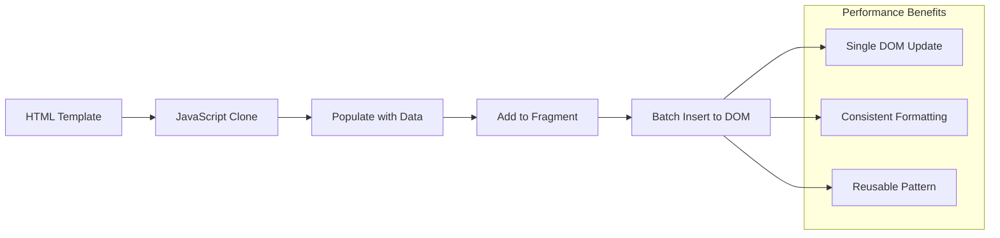

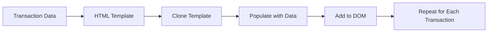

### चरण 1: लेनदेन टेम्प्लेट सिर्जना गर्नुहोस्

पहिले, तपाईंको HTML `<body>` मा लेनदेन पङ्क्तिहरूको लागि पुन: प्रयोगयोग्य टेम्प्लेट थप्नुहोस्:

```html
<template id="transaction">
  <tr>
    <td></td>
    <td></td>
    <td></td>
  </tr>
</template>
```

**HTML टेम्प्लेटहरू बुझ्दै:**
- **एकल टेबल पङ्क्तिको संरचना परिभाषित गर्छ**
- **क्लोन गरिएर JavaScript द्वारा जनसंख्या गरिनु अघि अदृश्य रहन्छ**
- **मिति, विवरण, र रकमको लागि तीन कोषहरू समावेश गर्छ**
- **सुसंगत ढाँसिङको लागि पुन: प्रयोगयोग्य ढाँचा प्रदान गर्छ**

### चरण 2: गतिशील सामग्रीको लागि तपाईंको टेबल तयार गर्नुहोस्

अर्को, तपाईंको टेबल बडीमा `id` थप्नुहोस् ताकि JavaScript सजिलै लक्ष्य गर्न सकून्:

```html
<tbody id="transactions"></tbody>
```

**यसले के हासिल गर्छ:**
- **लेनदेन पङ
> ⚡ **प्रदर्शन सुधार**: [`document.createDocumentFragment()`](https://developer.mozilla.org/docs/Web/API/Document/createDocumentFragment) बोइङको असेंब्ली प्रक्रियाजस्तै काम गर्छ - मुख्य लाइन बाहिर कम्पोनेन्टहरू तयार गरिन्छ, त्यसपछि पूर्ण इकाईको रूपमा स्थापना गरिन्छ। यो ब्याचिङ दृष्टिकोणले धेरै व्यक्तिगत अपरेशनको सट्टा एकल सम्मिलन गरेर DOM पुनः प्रवाहलाई न्यूनतम बनाउँछ।

### चरण ५: मिश्रित सामग्रीको लागि अपडेट फङ्सन सुधार गर्नुहोस्

तपाईंको `updateElement()` फङ्सन हाल केवल पाठ सामग्रीलाई मात्र ह्यान्डल गर्छ। यसलाई पाठ र DOM नोड्स दुवैसँग काम गर्न अद्यावधिक गर्नुहोस्:

```javascript
function updateElement(id, textOrNode) {
  const element = document.getElementById(id);
  element.textContent = ''; // Removes all children
  element.append(textOrNode);
}
```

**यस अद्यावधिकमा मुख्य सुधारहरू:**
- **मेट्छ** पुरानो सामग्रीलाई नयाँ सामग्री थप्नुअघि
- **स्वीकार्छ** पाठ स्ट्रिङहरू वा DOM नोड्सलाई प्यारामिटरको रूपमा
- **प्रयोग गर्छ** [`append()`](https://developer.mozilla.org/docs/Web/API/ParentNode/append) विधि लचिलोताका लागि
- **पछाडि अनुकूलता कायम राख्छ** हालको पाठ-आधारित प्रयोगसँग

### तपाईंको ड्यासबोर्डको परीक्षण ड्राइभ

सत्यको क्षणको समय! तपाईंको गतिशील ड्यासबोर्डलाई काममा हेर्नुहोस्:

1. `test` खाता प्रयोग गरेर लग इन गर्नुहोस् (यसमा नमूना डाटा तयार छ)
2. तपाईंको ड्यासबोर्डमा जानुहोस्
3. सुनिश्चित गर्नुहोस् कि लेनदेन पङ्क्तिहरू सही ढाँचासहित देखिन्छन्
4. सुनिश्चित गर्नुहोस् कि मिति, विवरणहरू, र रकमहरू सबै राम्रो देखिन्छन्

यदि सबै काम गरिरहेको छ भने, तपाईंले आफ्नो ड्यासबोर्डमा पूर्ण रूपमा कार्यात्मक लेनदेन सूची देख्नुहुनेछ! 🎉

**तपाईंले के हासिल गर्नुभयो:**
- कुनै पनि डाटाको मात्रा अनुसार स्केल हुने ड्यासबोर्ड निर्माण गर्नुभयो
- सुसंगत ढाँचाका लागि पुनः प्रयोग गर्न मिल्ने टेम्प्लेटहरू सिर्जना गर्नुभयो
- प्रभावकारी DOM हेरफेर प्रविधिहरू कार्यान्वयन गर्नुभयो
- उत्पादन बैंकिङ अनुप्रयोगहरूसँग तुलनायोग्य कार्यक्षमता विकास गर्नुभयो

तपाईंले स्थिर वेबपेजलाई गतिशील वेब अनुप्रयोगमा रूपान्तरण गर्न सफल हुनुभयो।

### 🎯 शैक्षिक जाँच: गतिशील सामग्री उत्पादन

**आर्किटेक्चर बुझाइ**: तपाईंले React, Vue, र Angular जस्ता फ्रेमवर्कहरूमा प्रयोग गरिने ढाँचाहरू प्रतिबिम्बित गर्ने परिष्कृत डाटा-देखि-UI पाइपलाइन कार्यान्वयन गर्नुभयो।

**मुख्य अवधारणाहरूमा महारत हासिल गरियो**:
- **टेम्प्लेट-आधारित रेंडरिङ**: पुनः प्रयोग गर्न मिल्ने UI कम्पोनेन्टहरू सिर्जना गर्नु
- **डकुमेन्ट फ्र्यागमेन्टहरू**: DOM प्रदर्शनलाई अनुकूल बनाउनु
- **सुरक्षित DOM हेरफेर**: सुरक्षा कमजोरीहरू रोक्नु
- **डाटा रूपान्तरण**: सर्भर डाटालाई प्रयोगकर्ता इन्टरफेसमा रूपान्तरण गर्नु

**उद्योगसँगको सम्बन्ध**: यी प्रविधिहरू आधुनिक फ्रन्टएन्ड फ्रेमवर्कहरूको आधार बनाउँछन्। React को भर्चुअल DOM, Vue को टेम्प्लेट प्रणाली, र Angular को कम्पोनेन्ट आर्किटेक्चर सबै यी मुख्य अवधारणाहरूमा आधारित छन्।

**प्रतिबिम्ब प्रश्न**: तपाईंले वास्तविक-समय अपडेटहरू (जस्तै नयाँ लेनदेनहरू स्वचालित रूपमा देखिने) ह्यान्डल गर्न यो प्रणालीलाई कसरी विस्तार गर्नुहुन्छ? WebSockets वा Server-Sent Events विचार गर्नुहोस्।

---

## 📈 तपाईंको डाटा व्यवस्थापन महारतको समयरेखा

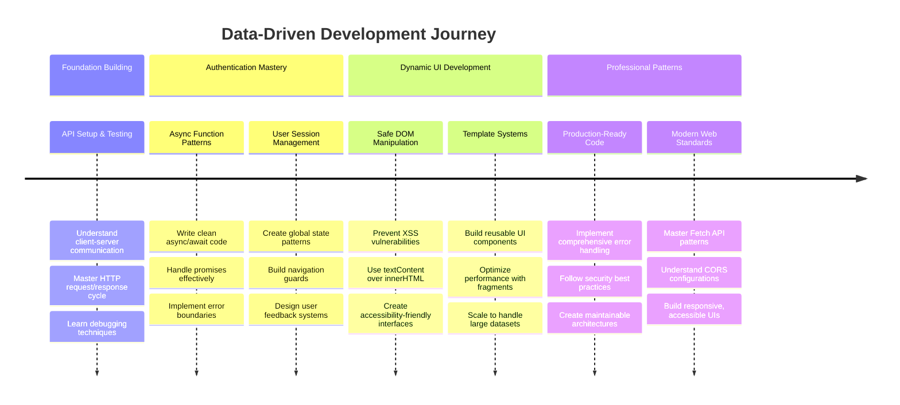

**🎓 स्नातक माइलस्टोन**: तपाईंले आधुनिक जाभास्क्रिप्ट ढाँचाहरू प्रयोग गरेर पूर्ण डाटा-आधारित वेब अनुप्रयोग सफलतापूर्वक निर्माण गर्नुभयो। यी सीपहरू React, Vue, वा Angular जस्ता फ्रेमवर्कहरूसँग काम गर्न सीधा अनुवाद हुन्छन्।

**🔄 अर्को स्तरको क्षमता**:
- यी अवधारणाहरूमा निर्माण गर्ने फ्रन्टएन्ड फ्रेमवर्कहरू अन्वेषण गर्न तयार
- WebSockets सँग वास्तविक-समय सुविधाहरू कार्यान्वयन गर्न तयार
- अफलाइन क्षमताहरूको साथ प्रोग्रेसिभ वेब अनुप्रयोगहरू निर्माण गर्न तयार
- उन्नत राज्य व्यवस्थापन ढाँचाहरू सिक्नको लागि आधार सेट

## GitHub Copilot Agent Challenge 🚀

Agent मोड प्रयोग गरेर निम्न चुनौती पूरा गर्नुहोस्:

**विवरण:** बैंकिङ एपलाई लेनदेन खोजी र फिल्टर सुविधा कार्यान्वयन गरेर सुधार गर्नुहोस् जसले प्रयोगकर्ताहरूलाई मिति दायरा, रकम, वा विवरणको आधारमा विशिष्ट लेनदेनहरू फेला पार्न अनुमति दिन्छ।

**प्रेरणा:** बैंकिङ एपको लागि खोजी कार्यक्षमता सिर्जना गर्नुहोस् जसमा समावेश छ: १) मिति दायरा (देखि/सम्म), न्यूनतम/अधिकतम रकम, र लेनदेन विवरण कुञ्जीशब्दहरूको लागि इनपुट क्षेत्रहरू भएको खोजी फारम, २) `filterTransactions()` फङ्सन जसले account.transactions एर्रेलाई खोजी मापदण्डको आधारमा फिल्टर गर्छ, ३) `updateDashboard()` फङ्सनलाई अद्यावधिक गर्नुहोस् ताकि फिल्टर गरिएको परिणाम देखाउन सकियोस्, र ४) "Clear Filters" बटन थप्नुहोस् दृश्यलाई रिसेट गर्न। आधुनिक जाभास्क्रिप्ट एर्रे विधिहरू जस्तै `filter()` प्रयोग गर्नुहोस् र खाली खोजी मापदण्डको लागि किनाराका केसहरू ह्यान्डल गर्नुहोस्।

[agent mode](https://code.visualstudio.com/blogs/2025/02/24/introducing-copilot-agent-mode) को बारेमा थप जान्नुहोस्।

## 🚀 चुनौती

तपाईंको बैंकिङ एपलाई अर्को स्तरमा लैजान तयार हुनुहुन्छ? यसलाई वास्तवमै प्रयोग गर्न चाहिने जस्तो देखिने र महसुस गराउने बनाऔं। यहाँ तपाईंको सिर्जनशीलतालाई प्रेरित गर्न केही विचारहरू छन्:

**यसलाई सुन्दर बनाउनुहोस्**: CSS स्टाइलिङ थपेर तपाईंको कार्यात्मक ड्यासबोर्डलाई दृश्यात्मक रूपमा आकर्षक बनाउनुहोस्। सफा रेखाहरू, राम्रो स्पेसिङ, र सायद केही सूक्ष्म एनिमेसनहरू सोच्नुहोस्।

**यसलाई उत्तरदायी बनाउनुहोस्**: [मिडिया क्वेरीहरू](https://developer.mozilla.org/docs/Web/CSS/Media_Queries) प्रयोग गरेर [उत्तरदायी डिजाइन](https://developer.mozilla.org/docs/Web/Progressive_web_apps/Responsive/responsive_design_building_blocks) सिर्जना गर्ने प्रयास गर्नुहोस् जसले फोन, ट्याब्लेट, र डेस्कटपमा राम्रो काम गर्छ। तपाईंका प्रयोगकर्ताहरूले धन्यवाद दिनेछन्!

**थप आकर्षण थप्नुहोस्**: लेनदेनहरूलाई रंग-कोडिङ गर्ने विचार गर्नुहोस् (आम्दानीको लागि हरियो, खर्चको लागि रातो), आइकनहरू थप्ने, वा होभर प्रभावहरू सिर्जना गर्ने जसले इन्टरफेसलाई अन्तरक्रियात्मक महसुस गराउँछ।

यहाँ स्टाइलिङ पछि ड्यासबोर्डको उदाहरण परिणाम कस्तो देखिन्छ:


यसलाई ठ्याक्कै मेल गर्नुपर्छ भन्ने महसुस नगर्नुहोस् - यसलाई प्रेरणाको रूपमा प्रयोग गर्नुहोस् र यसलाई आफ्नो बनाउनुहोस्!

## पोस्ट-व्याख्यान क्विज

[पोस्ट-व्याख्यान क्विज](https://ff-quizzes.netlify.app/web/quiz/46)

## असाइनमेन्ट

[तपाईंको कोडलाई पुनः संरचना र टिप्पणी गर्नुहोस्](assignment.md)

---

**अस्वीकरण**:  
यो दस्तावेज़ AI अनुवाद सेवा [Co-op Translator](https://github.com/Azure/co-op-translator) प्रयोग गरेर अनुवाद गरिएको छ। हामी शुद्धताको लागि प्रयास गर्छौं, तर कृपया ध्यान दिनुहोस् कि स्वचालित अनुवादमा त्रुटिहरू वा अशुद्धताहरू हुन सक्छ। यसको मूल भाषा मा रहेको दस्तावेज़लाई आधिकारिक स्रोत मानिनुपर्छ। महत्वपूर्ण जानकारीको लागि, व्यावसायिक मानव अनुवाद सिफारिस गरिन्छ। यस अनुवादको प्रयोगबाट उत्पन्न हुने कुनै पनि गलतफहमी वा गलत व्याख्याको लागि हामी जिम्मेवार हुने छैनौं।