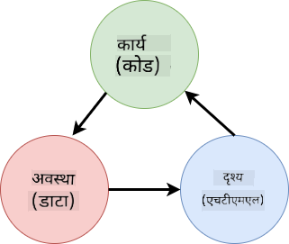
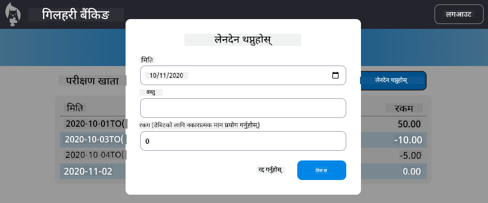

<!--
CO_OP_TRANSLATOR_METADATA:
{
  "original_hash": "4fa20c513e367e9cdd401bf49ae16e33",
  "translation_date": "2025-08-26T00:44:41+00:00",
  "source_file": "7-bank-project/4-state-management/README.md",
  "language_code": "ne"
}
-->
# बैंकिङ एप निर्माण भाग ४: स्टेट म्यानेजमेन्टको अवधारणा

## प्रि-लेक्चर क्विज

[प्रि-लेक्चर क्विज](https://ff-quizzes.netlify.app/web/quiz/47)

### परिचय

जसरी वेब एप्लिकेसन बढ्दै जान्छ, त्यसको डेटा प्रवाहलाई ट्र्याक गर्नु चुनौतीपूर्ण हुन्छ। कुन कोडले डेटा प्राप्त गर्छ, कुन पेजले त्यसलाई प्रयोग गर्छ, कहिले र कहाँ अपडेट गर्नुपर्छ... यसले सजिलै जटिल कोड सिर्जना गर्न सक्छ जुन मर्मत गर्न गाह्रो हुन्छ। यो विशेष गरी सत्य हो जब तपाईंलाई एपका विभिन्न पेजहरूमा डेटा साझा गर्न आवश्यक हुन्छ, जस्तै प्रयोगकर्ता डेटा। *स्टेट म्यानेजमेन्ट* को अवधारणा सबै प्रकारका प्रोग्रामहरूमा सधैं रहेको छ, तर वेब एपहरू जटिलतामा बढ्दै जाँदा यो विकासको क्रममा सोच्नुपर्ने मुख्य बिन्दु बनेको छ।

यस अन्तिम भागमा, हामीले बनाएको एपलाई पुनः हेर्नेछौं ताकि स्टेटलाई व्यवस्थापन गर्न सकियोस्, ब्राउजर रिफ्रेसलाई कुनै पनि समयमा समर्थन गर्न सकियोस्, र प्रयोगकर्ता सत्रहरूमा डेटा कायम राख्न सकियोस्।

### पूर्व-आवश्यकता

यस पाठको लागि तपाईंले वेब एपको [डेटा फेचिङ](../3-data/README.md) भाग पूरा गरिसक्नुपर्छ। तपाईंले [Node.js](https://nodejs.org) स्थापना गर्नुपर्छ र [सर्भर API चलाउनुहोस्](../api/README.md) ताकि तपाईं खाता डेटा व्यवस्थापन गर्न सक्नुहुन्छ।

तपाईंले टर्मिनलमा यो कमाण्ड चलाएर सर्भर ठीकसँग चलिरहेको छ कि छैन परीक्षण गर्न सक्नुहुन्छ:

```sh
curl http://localhost:5000/api
# -> should return "Bank API v1.0.0" as a result
```

---

## स्टेट म्यानेजमेन्ट पुनः विचार गर्नुहोस्

[अघिल्लो पाठ](../3-data/README.md) मा, हामीले हाम्रो एपमा ग्लोबल `account` भेरिएबलको साथ स्टेटको आधारभूत अवधारणा प्रस्तुत गर्यौं, जसले हालको लगइन गरिएको प्रयोगकर्ताको बैंक डेटा समावेश गर्दछ। तर, हाम्रो हालको कार्यान्वयनमा केही कमजोरीहरू छन्। ड्यासबोर्डमा हुँदा पेज रिफ्रेस गर्नुहोस्। के हुन्छ?

हालको कोडमा ३ समस्या छन्:

- स्टेट कायम रहँदैन, किनकि ब्राउजर रिफ्रेसले तपाईंलाई पुनः लगइन पेजमा फर्काउँछ।
- स्टेटलाई परिवर्तन गर्ने धेरै फङ्सनहरू छन्। एप बढ्दै जाँदा, यसले परिवर्तनहरू ट्र्याक गर्न गाह्रो बनाउँछ र एउटा अपडेट गर्न बिर्सन सजिलो हुन्छ।
- स्टेट सफा गरिँदैन, त्यसैले जब तपाईं *Logout* क्लिक गर्नुहुन्छ, खाता डेटा अझै त्यहाँ हुन्छ यद्यपि तपाईं लगइन पेजमा हुनुहुन्छ।

हामी यी समस्याहरूलाई एक-एक गरेर समाधान गर्न कोड अपडेट गर्न सक्थ्यौं, तर यसले कोड दोहोर्याउने र एपलाई जटिल र मर्मत गर्न गाह्रो बनाउँछ। वा हामी केही मिनेट रोक्न सक्थ्यौं र हाम्रो रणनीति पुनः विचार गर्न सक्थ्यौं।

> यहाँ हामी वास्तवमा के समस्या समाधान गर्न खोज्दैछौं?

[स्टेट म्यानेजमेन्ट](https://en.wikipedia.org/wiki/State_management) भनेको यी दुई विशेष समस्याहरू समाधान गर्न राम्रो दृष्टिकोण खोज्नु हो:

- एपमा डेटा प्रवाहलाई कसरी बुझ्न सकिने बनाउने?
- स्टेट डेटा सधैं प्रयोगकर्ता इन्टरफेससँग (र उल्टो) कसरी समन्वयमा राख्ने?

यी समस्याहरू समाधान गरेपछि, तपाईंले सामना गर्न सक्ने अन्य समस्याहरू या त पहिले नै समाधान भइसकेका हुन्छन् या समाधान गर्न सजिलो भएका हुन्छन्। यी समस्याहरू समाधान गर्न धेरै सम्भावित दृष्टिकोणहरू छन्, तर हामी **डेटा र यसलाई परिवर्तन गर्ने तरिकाहरूलाई केन्द्रित गर्ने** सामान्य समाधानमा जानेछौं। डेटा प्रवाह यसरी जानेछ:



> यहाँ हामी डेटा स्वतः दृश्य अपडेट ट्रिगर गर्ने भाग कभर गर्ने छैनौं, किनकि यो [Reactive Programming](https://en.wikipedia.org/wiki/Reactive_programming) को थप उन्नत अवधारणासँग सम्बन्धित छ। यदि तपाईं गहिरो अध्ययन गर्न इच्छुक हुनुहुन्छ भने यो राम्रो विषय हो।

✅ स्टेट म्यानेजमेन्टका लागि विभिन्न दृष्टिकोणहरू भएका धेरै लाइब्रेरीहरू छन्, [Redux](https://redux.js.org) एक लोकप्रिय विकल्प हो। यसमा प्रयोग गरिएका अवधारणाहरू र ढाँचाहरू हेर्नुहोस् किनकि यो ठूलो वेब एपहरूमा तपाईंले सामना गर्न सक्ने सम्भावित समस्याहरू र तिनीहरूलाई कसरी समाधान गर्न सकिन्छ भन्ने सिक्नको लागि अक्सर राम्रो तरिका हो।

### कार्य

हामी थोरै रिफ्याक्टरिङबाट सुरु गर्नेछौं। `account` घोषणा प्रतिस्थापन गर्नुहोस्:

```js
let account = null;
```

यससँग:

```js
let state = {
  account: null
};
```

विचार भनेको हाम्रो एप डेटा सबैलाई एकल स्टेट वस्तुमा *केन्द्रित* गर्नु हो। हाल स्टेटमा हामीसँग `account` मात्र छ त्यसैले यसले धेरै परिवर्तन गर्दैन, तर यसले विकासको लागि मार्ग बनाउँछ।

हामी यसलाई प्रयोग गर्ने फङ्सनहरू पनि अपडेट गर्नुपर्छ। `register()` र `login()` फङ्सनहरूमा, `account = ...` लाई `state.account = ...` ले प्रतिस्थापन गर्नुहोस्;

`updateDashboard()` फङ्सनको शीर्षमा, यो लाइन थप्नुहोस्:

```js
const account = state.account;
```

यो रिफ्याक्टरिङले आफैंमा धेरै सुधार ल्याएन, तर विचार भनेको आगामी परिवर्तनहरूको लागि आधार तयार गर्नु हो।

## डेटा परिवर्तनहरू ट्र्याक गर्नुहोस्

अब हामीले हाम्रो डेटा भण्डारण गर्न `state` वस्तु राखेका छौं, अर्को चरण भनेको अपडेटहरू केन्द्रित गर्नु हो। उद्देश्य भनेको कुनै पनि परिवर्तनहरू र तिनीहरू कहिले हुन्छन् भनेर ट्र्याक गर्न सजिलो बनाउनु हो।

`state` वस्तुमा परिवर्तनहरू गर्नबाट बच्न, यसलाई [*immutable*](https://en.wikipedia.org/wiki/Immutable_object) मान्नु पनि राम्रो अभ्यास हो, जसको अर्थ यसलाई बिल्कुलै परिवर्तन गर्न सकिँदैन। यसको मतलब तपाईंले यसमा केही परिवर्तन गर्न चाहनुहुन्छ भने नयाँ स्टेट वस्तु सिर्जना गर्नुपर्छ। यसो गर्दा, तपाईंले सम्भावित अवांछित [side effects](https://en.wikipedia.org/wiki/Side_effect_(computer_science)) को बारेमा सुरक्षा निर्माण गर्नुहुन्छ, र तपाईंको एपमा नयाँ सुविधाहरू कार्यान्वयन गर्ने सम्भावनाहरू खोल्नुहुन्छ जस्तै undo/redo कार्यान्वयन गर्नु, साथै डिबग गर्न सजिलो बनाउनु। उदाहरणका लागि, तपाईंले स्टेटमा गरिएका प्रत्येक परिवर्तनलाई लग गर्न सक्नुहुन्छ र बगको स्रोत बुझ्न परिवर्तनहरूको इतिहास राख्न सक्नुहुन्छ।

जाभास्क्रिप्टमा, [`Object.freeze()`](https://developer.mozilla.org/docs/Web/JavaScript/Reference/Global_Objects/Object/freeze) प्रयोग गरेर वस्तुको अपरिवर्तनीय संस्करण सिर्जना गर्न सकिन्छ। यदि तपाईंले अपरिवर्तनीय वस्तुमा परिवर्तन गर्न प्रयास गर्नुभयो भने, अपवाद उठाइनेछ।

✅ के तपाईंलाई *shallow* र *deep* अपरिवर्तनीय वस्तु बीचको भिन्नता थाहा छ? तपाईं यसबारे [यहाँ](https://developer.mozilla.org/docs/Web/JavaScript/Reference/Global_Objects/Object/freeze#What_is_shallow_freeze) पढ्न सक्नुहुन्छ।

### कार्य

नयाँ `updateState()` फङ्सन सिर्जना गरौं:

```js
function updateState(property, newData) {
  state = Object.freeze({
    ...state,
    [property]: newData
  });
}
```

यस फङ्सनमा, हामी नयाँ स्टेट वस्तु सिर्जना गर्दैछौं र [*spread (`...`) operator*](https://developer.mozilla.org/docs/Web/JavaScript/Reference/Operators/Spread_syntax#Spread_in_object_literals) प्रयोग गरेर अघिल्लो स्टेटबाट डेटा प्रतिलिपि गर्दैछौं। त्यसपछि हामी [bracket notation](https://developer.mozilla.org/docs/Web/JavaScript/Guide/Working_with_Objects#Objects_and_properties) `[property]` प्रयोग गरेर स्टेट वस्तुको विशेष सम्पत्तिलाई नयाँ डेटा संग अधिलेखन गर्दैछौं। अन्तमा, हामी `Object.freeze()` प्रयोग गरेर वस्तुलाई लक गर्दैछौं ताकि यसलाई परिवर्तन गर्न सकिँदैन। हाल स्टेटमा `account` सम्पत्ति मात्र छ, तर यस दृष्टिकोणले तपाईंलाई स्टेटमा आवश्यक जति सम्पत्तिहरू थप्न अनुमति दिन्छ।

हामीले प्रारम्भिक स्टेट पनि फ्रिज गरिएको सुनिश्चित गर्न `state` आरम्भलाई अपडेट गर्नेछौं:

```js
let state = Object.freeze({
  account: null
});
```

त्यसपछि, `register` फङ्सनलाई `state.account = result;` असाइनमेन्टलाई प्रतिस्थापन गरेर अपडेट गर्नुहोस्:

```js
updateState('account', result);
```

`login` फङ्सनसँग पनि त्यस्तै गर्नुहोस्, `state.account = data;` लाई प्रतिस्थापन गरेर:

```js
updateState('account', data);
```

अब हामी *Logout* क्लिक गर्दा खाता डेटा सफा नगरिएको समस्यालाई समाधान गर्ने मौका लिनेछौं।

नयाँ `logout()` फङ्सन सिर्जना गर्नुहोस्:

```js
function logout() {
  updateState('account', null);
  navigate('/login');
}
```

`updateDashboard()` मा, `return navigate('/login');` रेडिरेक्शनलाई `return logout();` ले प्रतिस्थापन गर्नुहोस्;

नयाँ खाता दर्ता गर्ने, लगआउट गर्ने र पुनः लगइन गर्ने प्रयास गर्नुहोस् ताकि सबै ठीकसँग काम गरिरहेको छ कि छैन जाँच गर्न सकियोस्।

> टिप: तपाईंले `updateState()` को तल `console.log(state)` थपेर र ब्राउजरको विकास उपकरणमा कन्सोल खोलेर सबै स्टेट परिवर्तनहरू हेर्न सक्नुहुन्छ।

## स्टेट कायम राख्नुहोस्

धेरै वेब एपहरू सही रूपमा काम गर्न डेटा कायम राख्न आवश्यक हुन्छ। सबै महत्त्वपूर्ण डेटा सामान्यतया डेटाबेसमा भण्डारण गरिन्छ र सर्भर API मार्फत पहुँच गरिन्छ, जस्तै हाम्रो केसमा प्रयोगकर्ता खाता डेटा। तर कहिलेकाहीँ, प्रयोगकर्ता अनुभव सुधार गर्न वा लोडिङ प्रदर्शन सुधार गर्न ब्राउजरमा चलिरहेको क्लाइन्ट एपमा केही डेटा कायम राख्नु पनि रोचक हुन सक्छ।

जब तपाईं आफ्नो ब्राउजरमा डेटा कायम राख्न चाहनुहुन्छ, तपाईंले केही महत्त्वपूर्ण प्रश्नहरू सोध्नुपर्छ:

- *डेटा संवेदनशील छ?* तपाईंले क्लाइन्टमा कुनै पनि संवेदनशील डेटा भण्डारण गर्नबाट बच्नुपर्छ, जस्तै प्रयोगकर्ता पासवर्डहरू।
- *तपाईंलाई यो डेटा कति समयसम्म राख्न आवश्यक छ?* तपाईंले यो डेटा केवल हालको सत्रको लागि पहुँच गर्न चाहनुहुन्छ कि यो सधैंको लागि भण्डारण गर्न चाहनुहुन्छ?

वेब एप भित्र जानकारी भण्डारण गर्ने धेरै तरिकाहरू छन्, तपाईंले के हासिल गर्न चाहनुहुन्छ भन्नेमा निर्भर गर्दै। उदाहरणका लागि, तपाईंले खोज क्वेरी भण्डारण गर्न URL प्रयोग गर्न सक्नुहुन्छ, र यसलाई प्रयोगकर्ताहरू बीच साझा गर्न सक्नुहुन्छ। तपाईंले [HTTP कुकीहरू](https://developer.mozilla.org/docs/Web/HTTP/Cookies) पनि प्रयोग गर्न सक्नुहुन्छ यदि डेटा सर्भरसँग साझा गर्न आवश्यक छ भने, जस्तै [प्रमाणीकरण](https://en.wikipedia.org/wiki/Authentication) जानकारी।

अर्को विकल्प भनेको डेटा भण्डारण गर्न ब्राउजर API मध्ये एक प्रयोग गर्नु हो। दुई विशेष रूपमा रोचक छन्:

- [`localStorage`](https://developer.mozilla.org/docs/Web/API/Window/localStorage): एक [Key/Value store](https://en.wikipedia.org/wiki/Key%E2%80%93value_database) जसले विभिन्न सत्रहरूमा हालको वेबसाइटको लागि डेटा कायम राख्न अनुमति दिन्छ। यसमा भण्डारण गरिएको डेटा कहिल्यै समाप्त हुँदैन।
- [`sessionStorage`](https://developer.mozilla.org/docs/Web/API/Window/sessionStorage): यो `localStorage` जस्तै काम गर्छ तर यसमा भण्डारण गरिएको डेटा सत्र समाप्त हुँदा (ब्राउजर बन्द हुँदा) सफा गरिन्छ।

ध्यान दिनुहोस् कि यी दुवै API ले केवल [strings](https://developer.mozilla.org/docs/Web/JavaScript/Reference/Global_Objects/String) भण्डारण गर्न अनुमति दिन्छ। यदि तपाईंले जटिल वस्तुहरू भण्डारण गर्न चाहनुहुन्छ भने, तपाईंले यसलाई [JSON](https://developer.mozilla.org/docs/Web/JavaScript/Reference/Global_Objects/JSON) ढाँचामा सिरियलाइज गर्नुपर्नेछ [`JSON.stringify()`](https://developer.mozilla.org/docs/Web/JavaScript/Reference/Global_Objects/JSON/stringify) प्रयोग गरेर।

✅ यदि तपाईं सर्भर बिना काम गर्ने वेब एप बनाउन चाहनुहुन्छ भने, क्लाइन्टमा डेटाबेस सिर्जना गर्न पनि सम्भव छ [`IndexedDB` API](https://developer.mozilla.org/docs/Web/API/IndexedDB_API) प्रयोग गरेर। यो उन्नत प्रयोगका लागि आरक्षित छ वा यदि तपाईंले महत्त्वपूर्ण मात्रामा डेटा भण्डारण गर्न आवश्यक छ भने, किनकि यो प्रयोग गर्न अधिक जटिल छ।

### कार्य

हामी चाहन्छौं कि हाम्रो प्रयोगकर्ताहरू *Logout* बटनमा स्पष्ट रूपमा क्लिक नगरेसम्म लगइन रहून्, त्यसैले हामी `localStorage` प्रयोग गरेर खाता डेटा भण्डारण गर्नेछौं। पहिलो, हामीले डेटा भण्डारण गर्न प्रयोग गर्ने कुञ्जी परिभाषित गरौं।

```js
const storageKey = 'savedAccount';
```

त्यसपछि `updateState()` फङ्सनको अन्त्यमा यो लाइन थप्नुहोस्:

```js
localStorage.setItem(storageKey, JSON.stringify(state.account));
```

यससँग, प्रयोगकर्ता खाता डेटा कायम हुनेछ र हामीले पहिले केन्द्रित गरेका सबै स्टेट अपडेटहरू जस्तै सधैं अद्यावधिक हुनेछ। यहीँबाट हामीले गरेका सबै रिफ्याक्टरहरू लाभ उठाउन सुरु गर्छौं 🙂।

जसरी डेटा बचत गरिन्छ, हामीले एप लोड हुँदा यसलाई पुनःस्थापित गर्न पनि ध्यान दिनुपर्छ। किनकि अब हामीसँग थप आरम्भ कोड हुनेछ, नयाँ `init` फङ्सन सिर्जना गर्नु राम्रो विचार हुन सक्छ, जसले `app.js` को तलको हाम्रो अघिल्लो कोड पनि समावेश गर्दछ:

```js
function init() {
  const savedAccount = localStorage.getItem(storageKey);
  if (savedAccount) {
    updateState('account', JSON.parse(savedAccount));
  }

  // Our previous initialization code
  window.onpopstate = () => updateRoute();
  updateRoute();
}

init();
```

यहाँ हामीले बचत गरिएको डेटा पुनः प्राप्त गर्छौं, र यदि त्यहाँ कुनै छ भने हामी स्टेटलाई त्यस अनुसार अपडेट गर्छौं। यो *पेज अपडेट* को समयमा स्टेटमा निर्भर कोड हुन सक्ने भएकाले रुट अपडेट गर्नु अघि गर्न महत्त्वपूर्ण छ।

हामीले *Dashboard* पेजलाई हाम्रो एपको डिफल्ट पेज बनाउन पनि सक्दछौं, किनकि अब हामी खाता डेटा कायम राख्दैछौं। यदि कुनै डेटा फेला परेन भने, ड्यासबोर्डले *Login* पेजमा रेडिरेक्ट गर्ने काम गर्छ। `updateRoute()` मा, फलब्याक `return navigate('/login');` लाई `return navigate('/dashboard');` ले प्रतिस्थापन गर्नुहोस्।

अब एपमा लगइन गर्नुहोस् र पेज रिफ्रेस गर्ने प्रयास गर्नुहोस्। तपाईं ड्यासबोर्डमा रहनुहुन्छ। यस अपडेटसँगै हामीले हाम्रो प्रारम्भिक समस्याहरूको ख्याल गरेका छौं...

## डेटा रिफ्रेस गर्नुहोस्

...तर हामीले नयाँ समस्या पनि सिर्जना गरेका छौं। ओह!

`test` खाता प्रयोग गरेर ड्यासबोर्डमा जानुहोस्, त्यसपछि नयाँ ट्रान्जेक्सन सिर्जना गर्न टर्मिनलमा यो कमाण्ड चलाउनुहोस्:

```sh
curl --request POST \
     --header "Content-Type: application/json" \
     --data "{ \"date\": \"2020-07-24\", \"object\": \"Bought book\", \"amount\": -20 }" \
     http://localhost:5000/api/accounts/test/transactions
```

अब ब्राउजरमा ड्यासबोर्ड पेज रिफ्रेस गर्ने प्रयास गर्नुहोस्। के हुन्छ? के तपाईंले नयाँ ट्रान्जेक्सन देख्नुभयो?

स्टेट `localStorage` को कारण अनिश्चितकालसम्म कायम रहन्छ, तर यसको मतलब यो कहिल्यै अपडेट हुँदैन जबसम्म तपाईं एपबाट लगआउट गरेर पुनः लगइन गर्नुहुन्न!

यसलाई समाधान गर्ने सम्भावित रणनीति भनेको ड्यासबोर्ड लोड हुँदा हरेक पटक खाता डेटा पुनः लोड गर्नु हो, ताकि पुरानो डेटा नहोस्।

### कार्य

नयाँ `updateAccountData` फङ्सन सिर्जना गर्नुहोस्:

```js
async function updateAccountData() {
  const account = state.account;
  if (!account) {
    return logout();
  }

  const data = await getAccount(account.user);
  if (data.error) {
    return logout();
  }

  updateState('account', data);
}
```

यो विधिले जाँच गर्छ कि हामी हाल लगइन गरिरहेका छौं र त्यसपछि सर्भरबाट खाता डेटा पुनः लोड गर्छ।

`refresh` नामक अर्को फङ्सन सिर्जना गर्नुहोस्:

```js
async function refresh() {
  await updateAccountData();
  updateDashboard();
}
```

यो खाता डेटा अपडेट गर्छ, त्यसपछि ड्यासबोर्ड पेजको HTML अपडेट गर्ने काम गर्छ। यो ड्यासबोर्ड रुट लोड हुँदा हामीले कल गर्न आवश्यक छ। रुट परिभाषा अपडेट गर्नुहोस्:

```js
const routes = {
  '/login': { templateId: 'login' },
  '/dashboard': { templateId: 'dashboard', init: refresh }
};
```

अब ड्यासबोर्ड रिफ्रेस गर्ने प्रयास गर्नुहोस्, यसले अपडेट गरिएको खाता डेटा देखाउनु पर्छ।

---

## 🚀 चुनौती

अब हामीले ड्यासबोर्ड लोड हुँदा हरेक पटक खाता डेटा पुनः लोड गर्छौं, के तपाईंलाई लाग्छ कि हामीले *सबै खाता* डेटा कायम राख्न अझै आवश्यक छ?

सँगै काम गरेर `localStorage` मा बचत गरिएको र लोड गरिएको कुरालाई एप काम गर्न आवश्यक पर्ने कुरामा मात्र सीमित गर्न प्रयास गर्नुहोस्।

## पोस्ट-लेक्चर क्विज
[पोस्ट-व्याख्यान क्विज](https://ff-quizzes.netlify.app/web/quiz/48)

## असाइनमेन्ट

["लेनदेन थप्ने" संवाद लागू गर्नुहोस्](assignment.md)

असाइनमेन्ट पूरा गरेपछि यहाँ एउटा उदाहरण परिणाम छ:



**अस्वीकरण**:  
यो दस्तावेज़ AI अनुवाद सेवा [Co-op Translator](https://github.com/Azure/co-op-translator) प्रयोग गरेर अनुवाद गरिएको छ। हामी शुद्धताको लागि प्रयास गर्छौं, तर कृपया ध्यान दिनुहोस् कि स्वचालित अनुवादमा त्रुटिहरू वा अशुद्धताहरू हुन सक्छ। यसको मूल भाषा मा रहेको मूल दस्तावेज़लाई आधिकारिक स्रोत मानिनुपर्छ। महत्वपूर्ण जानकारीको लागि, व्यावसायिक मानव अनुवाद सिफारिस गरिन्छ। यस अनुवादको प्रयोगबाट उत्पन्न हुने कुनै पनि गलतफहमी वा गलत व्याख्याको लागि हामी जिम्मेवार हुने छैनौं।