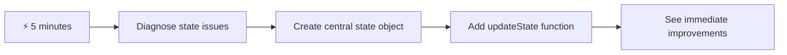
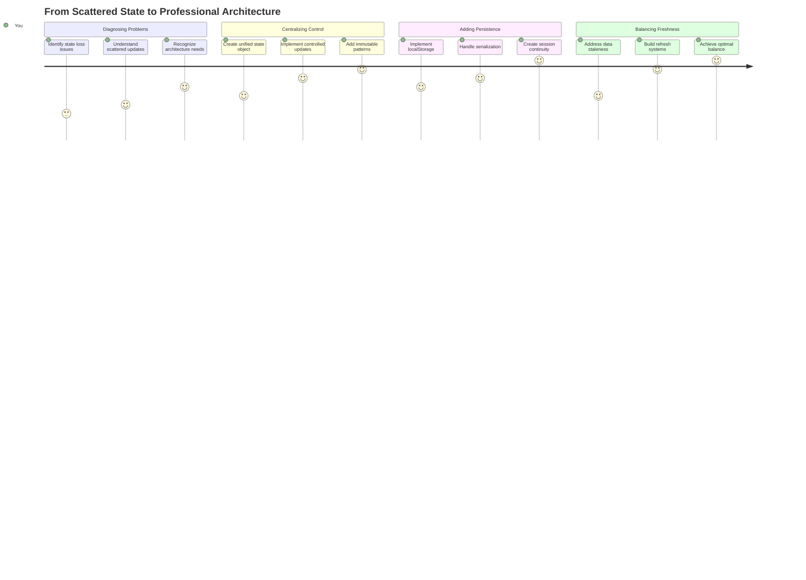
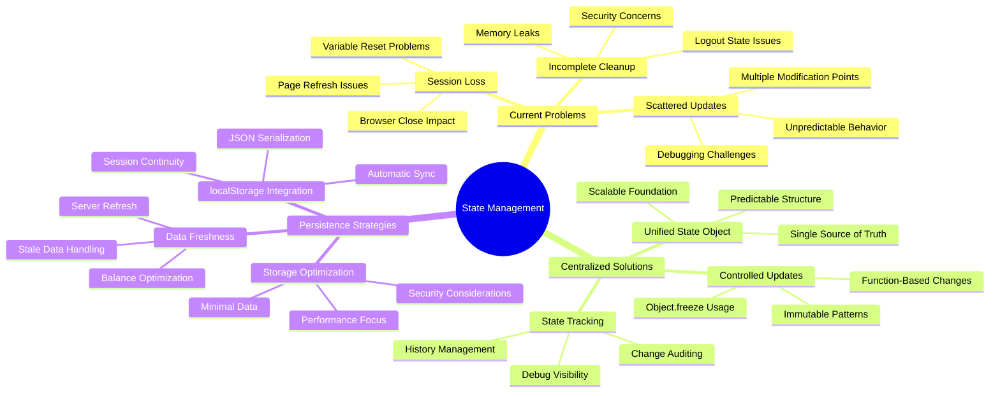
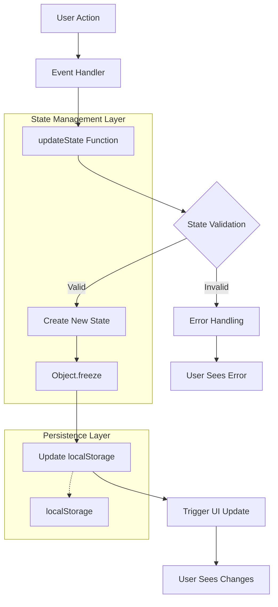
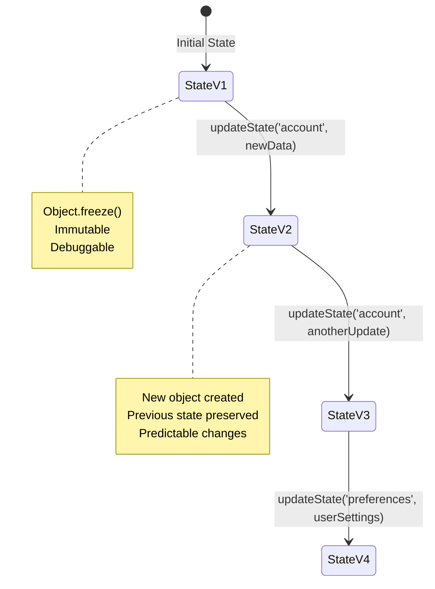
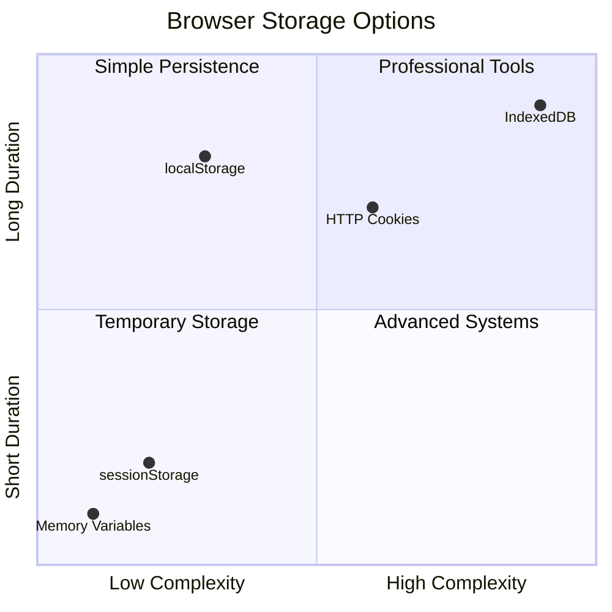
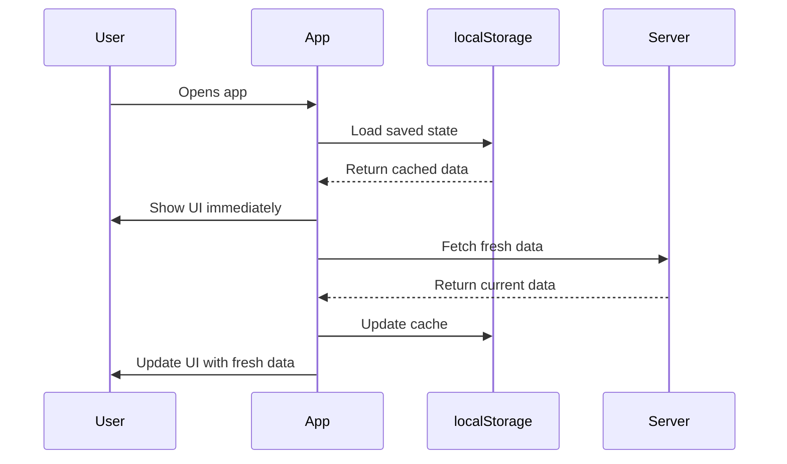
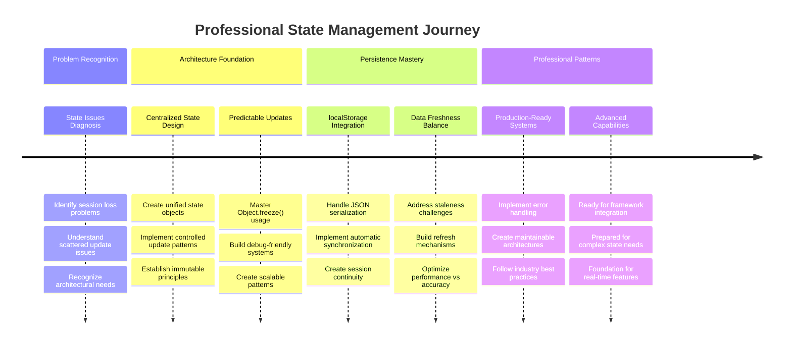

<!--
CO_OP_TRANSLATOR_METADATA:
{
  "original_hash": "b807b09df716dc48a2b750835bf8e933",
  "translation_date": "2025-11-03T15:38:04+00:00",
  "source_file": "7-bank-project/4-state-management/README.md",
  "language_code": "ne"
}
-->
# बैंकिङ एप निर्माण भाग ४: स्टेट म्यानेजमेन्टको अवधारणा

## ⚡ अर्को ५ मिनेटमा तपाईंले के गर्न सक्नुहुन्छ

**व्यस्त डेभलपरहरूको लागि छिटो सुरु गर्ने मार्ग**



- **मिनेट १**: हालको स्टेट समस्या परीक्षण गर्नुहोस् - लगइन गर्नुहोस्, पेज रिफ्रेस गर्नुहोस्, लगआउट हेर्नुहोस्
- **मिनेट २**: `let account = null` लाई `let state = { account: null }` मा परिवर्तन गर्नुहोस्
- **मिनेट ३**: नियन्त्रित अपडेटको लागि सरल `updateState()` फङ्सन बनाउनुहोस्
- **मिनेट ४**: नयाँ ढाँचाको प्रयोग गर्न एउटा फङ्सन अपडेट गर्नुहोस्
- **मिनेट ५**: सुधारिएको पूर्वानुमानयोग्यता र डिबगिङ क्षमता परीक्षण गर्नुहोस्

**छिटो डायग्नोस्टिक परीक्षण**:
```javascript
// Before: Scattered state
let account = null; // Lost on refresh!

// After: Centralized state
let state = Object.freeze({ account: null }); // Controlled and trackable!
```

**किन यो महत्त्वपूर्ण छ**: ५ मिनेटमा, तपाईंले अराजक स्टेट म्यानेजमेन्टबाट पूर्वानुमानयोग्य, डिबग गर्न मिल्ने ढाँचामा रूपान्तरण अनुभव गर्नुहुनेछ। यो जटिल एप्लिकेसनलाई मर्मतयोग्य बनाउने आधार हो।

## 🗺️ स्टेट म्यानेजमेन्टको मास्टरीको माध्यमबाट तपाईंको सिकाइ यात्रा



**तपाईंको यात्रा गन्तव्य**: यो पाठको अन्त्यसम्ममा, तपाईंले स्थायित्व, डेटा ताजगी, र पूर्वानुमानयोग्य अपडेटहरू ह्यान्डल गर्ने व्यावसायिक स्तरको स्टेट म्यानेजमेन्ट प्रणाली निर्माण गर्नुभएको हुनेछ - उत्पादन एप्लिकेसनहरूमा प्रयोग गरिने समान ढाँचाहरू।

## प्रि-लेक्चर क्विज

[प्रि-लेक्चर क्विज](https://ff-quizzes.netlify.app/web/quiz/47)

## परिचय

स्टेट म्यानेजमेन्ट Voyager अन्तरिक्ष यानको नेभिगेसन प्रणाली जस्तै हो – जब सबै कुरा सहज रूपमा काम गरिरहेको हुन्छ, तपाईंले यसको उपस्थिति महसुस पनि गर्नुहुन्न। तर जब समस्या आउँछ, यो अन्तरिक्षको गहिराइमा हराउने र अन्तरतारकीय स्थानमा पुग्ने बीचको भिन्नता बनिन्छ। वेब विकासमा, स्टेटले तपाईंको एप्लिकेसनले सम्झनुपर्ने सबै कुरा प्रतिनिधित्व गर्दछ: प्रयोगकर्ता लगइन स्थिति, फारम डेटा, नेभिगेसन इतिहास, र अस्थायी इन्टरफेस अवस्थाहरू।

तपाईंको बैंकिङ एप साधारण लगइन फारमबाट परिष्कृत एप्लिकेसनमा विकसित हुँदै गर्दा, तपाईंले केही सामान्य चुनौतीहरूको सामना गर्नुभएको हुन सक्छ। पेज रिफ्रेस गर्नुहोस् र प्रयोगकर्ताहरू अनपेक्षित रूपमा लगआउट हुन्छन्। ब्राउजर बन्द गर्नुहोस् र सबै प्रगति हराउँछ। समस्या डिबग गर्नुहोस् र तपाईंले एउटै डेटा विभिन्न तरिकामा परिवर्तन गर्ने धेरै फङ्सनहरूमा खोजी गरिरहनुभएको हुन्छ।

यी खराब कोडिङका संकेत होइनन् – यी प्राकृतिक विकासका पीडाहरू हुन् जुन एप्लिकेसनहरू निश्चित जटिलता सीमा पार गर्दा देखा पर्छन्। प्रत्येक डेभलपरले यी चुनौतीहरूको सामना गर्छन् जब तिनीहरूको एप "प्रूफ अफ कन्सेप्ट" बाट "प्रोडक्सन रेडी" मा रूपान्तरण हुन्छ।

यस पाठमा, हामी एक केन्द्रीयकृत स्टेट म्यानेजमेन्ट प्रणाली कार्यान्वयन गर्नेछौं जसले तपाईंको बैंकिङ एपलाई भरपर्दो, व्यावसायिक एप्लिकेसनमा रूपान्तरण गर्दछ। तपाईंले डेटा प्रवाहलाई पूर्वानुमानयोग्य रूपमा व्यवस्थापन गर्न, प्रयोगकर्ता सत्रहरू उपयुक्त रूपमा स्थायी बनाउन, र आधुनिक वेब एप्लिकेसनले आवश्यक पर्ने सहज प्रयोगकर्ता अनुभव सिर्जना गर्न सिक्नुहुनेछ।

## पूर्वापेक्षाहरू

स्टेट म्यानेजमेन्ट अवधारणाहरूमा डुब्नु अघि, तपाईंको विकास वातावरण ठीकसँग सेटअप गरिएको छ र तपाईंको बैंकिङ एपको आधार तयार छ भन्ने सुनिश्चित गर्नुहोस्। यो पाठ यस श्रृंखलाको अघिल्लो भागहरूबाट अवधारणाहरू र कोडमा सीधा निर्माण गर्दछ।

**आवश्यक सेटअप:**
- [डेटा फेचिङ पाठ](../3-data/README.md) पूरा गर्नुहोस् - तपाईंको एपले सफलतापूर्वक खाता डेटा लोड र प्रदर्शन गर्नुपर्छ
- [Node.js](https://nodejs.org) तपाईंको प्रणालीमा स्थापना गर्नुहोस् ब्याकएन्ड API चलाउनको लागि
- खाता डेटा अपरेसनहरू ह्यान्डल गर्न [सर्भर API](../api/README.md) स्थानीय रूपमा सुरु गर्नुहोस्

**तपाईंको वातावरण परीक्षण गर्नुहोस्:**

तपाईंको API सर्भर सही रूपमा चलिरहेको छ भनी यो कमाण्ड टर्मिनलमा कार्यान्वयन गरेर पुष्टि गर्नुहोस्:

```sh
curl http://localhost:5000/api
# -> should return "Bank API v1.0.0" as a result
```

**यो कमाण्डले के गर्छ:**
- **GET अनुरोध पठाउँछ** तपाईंको स्थानीय API सर्भरमा
- **जाँच गर्छ** कनेक्शन र सर्भर प्रतिक्रिया दिइरहेको छ भनी पुष्टि गर्छ
- **API संस्करण जानकारी फर्काउँछ** यदि सबै ठीक छ भने

## 🧠 स्टेट म्यानेजमेन्ट आर्किटेक्चरको अवलोकन



**मुख्य सिद्धान्त**: व्यावसायिक स्टेट म्यानेजमेन्टले पूर्वानुमानयोग्यता, स्थायित्व, र प्रदर्शनलाई सन्तुलनमा राख्छ जसले सरल अन्तरक्रियाबाट जटिल एप्लिकेसन वर्कफ्लोमा स्केल हुने भरपर्दो प्रयोगकर्ता अनुभव सिर्जना गर्दछ।

---

## हालको स्टेट समस्याहरूको निदान

जस्तै Sherlock Holmes अपराध स्थलको जाँच गर्दैछ, हामीले हाम्रो हालको कार्यान्वयनमा के भइरहेको छ भन्ने कुरा ठीकसँग बुझ्न आवश्यक छ ताकि हराउने प्रयोगकर्ता सत्रहरूको रहस्य समाधान गर्न सकियोस्।

**🧪 यो डायग्नोस्टिक परीक्षण प्रयास गर्नुहोस्:**
1. तपाईंको बैंकिङ एपमा लगइन गर्नुहोस् र ड्यासबोर्डमा नेभिगेट गर्नुहोस्
2. ब्राउजर पेज रिफ्रेस गर्नुहोस्
3. तपाईंको लगइन स्थिति के हुन्छ हेर्नुहोस्

यदि तपाईंलाई पुन: लगइन स्क्रिनमा पुनर्निर्देशित गरिएको छ भने, तपाईंले क्लासिक स्टेट स्थायित्व समस्याको खोजी गर्नुभएको छ। यो व्यवहार हाम्रो हालको कार्यान्वयनले प्रयोगकर्ता डेटा JavaScript भेरिएबलहरूमा भण्डारण गर्ने कारणले हुन्छ, जुन प्रत्येक पेज लोडसँग रिसेट हुन्छ।

**हालको कार्यान्वयन समस्याहरू:**

हाम्रो [अघिल्लो पाठ](../3-data/README.md) बाट साधारण `account` भेरिएबलले प्रयोगकर्ता अनुभव र कोड मर्मतयोग्यतामा असर गर्ने तीन महत्त्वपूर्ण समस्याहरू सिर्जना गर्दछ:

| समस्या | प्राविधिक कारण | प्रयोगकर्ता प्रभाव |
|---------|--------|----------------|
| **सत्र हराउने** | पेज रिफ्रेसले JavaScript भेरिएबलहरू मेट्छ | प्रयोगकर्ताहरूलाई बारम्बार पुन: प्रमाणित गर्नुपर्छ |
| **छरिएको अपडेटहरू** | धेरै फङ्सनहरूले स्टेटलाई प्रत्यक्ष रूपमा परिवर्तन गर्छन् | डिबगिङ झन् कठिन बन्छ |
| **अधूरो सफाइ** | लगआउटले सबै स्टेट सन्दर्भहरू मेट्दैन | सम्भावित सुरक्षा र गोपनीयता चिन्ताहरू |

**आर्किटेक्चरल चुनौती:**

जस्तै Titanic को कम्पार्टमेन्टलाइज्ड डिजाइनले धेरै कम्पार्टमेन्टहरू एकसाथ बाढी हुँदा कमजोर देखायो, यी समस्याहरूलाई व्यक्तिगत रूपमा समाधान गर्दा अन्तर्निहित आर्किटेक्चरल समस्यालाई सम्बोधन गर्दैन। हामीलाई व्यापक स्टेट म्यानेजमेन्ट समाधान आवश्यक छ।

> 💡 **हामी यहाँ के हासिल गर्न खोजिरहेका छौं?**

[स्टेट म्यानेजमेन्ट](https://en.wikipedia.org/wiki/State_management) वास्तवमा दुई मौलिक पहेलीहरू समाधान गर्ने बारेमा हो:

1. **मेरो डेटा कहाँ छ?**: हामीसँग के जानकारी छ र यो कहाँबाट आइरहेको छ भन्ने ट्र्याक राख्नु
2. **सबैजना एउटै पृष्ठमा छन्?**: प्रयोगकर्ताहरूले देखेको कुरा वास्तवमा के भइरहेको छ भन्ने कुरासँग मेल खाने सुनिश्चित गर्नु

**हाम्रो खेल योजना:**

हामी हाम्रो टाउको घुमाउने सट्टा, **केन्द्रीयकृत स्टेट म्यानेजमेन्ट** प्रणाली सिर्जना गर्नेछौं। यसलाई सबै महत्त्वपूर्ण कुराहरूको जिम्मामा एकदमै व्यवस्थित व्यक्तिको रूपमा सोच्नुहोस्:




**यो डेटा प्रवाह बुझ्दै:**
- **केन्द्रीयकृत** सबै एप्लिकेसन स्टेटलाई एक स्थानमा
- **मार्गनिर्देशन** सबै स्टेट परिवर्तनहरू नियन्त्रित फङ्सनहरू मार्फत
- **सुनिश्चित** UI हालको स्टेटसँग समक्रमित रहन्छ
- **प्रदान** डेटा म्यानेजमेन्टको लागि स्पष्ट, पूर्वानुमानयोग्य ढाँचा

> 💡 **व्यावसायिक अन्तर्दृष्टि**: यो पाठ मौलिक अवधारणाहरूमा केन्द्रित छ। जटिल एप्लिकेसनहरूको लागि, [Redux](https://redux.js.org) जस्ता लाइब्रेरीहरूले थप उन्नत स्टेट म्यानेजमेन्ट सुविधाहरू प्रदान गर्छन्। यी मुख्य सिद्धान्तहरू बुझ्नाले तपाईंलाई कुनै पनि स्टेट म्यानेजमेन्ट लाइब्रेरीमा मास्टर बनाउँछ।

> ⚠️ **उन्नत विषय**: हामी स्टेट परिवर्तनहरूले ट्रिगर गर्ने स्वचालित UI अपडेटहरू कभर गर्ने छैनौं, किनकि यसमा [Reactive Programming](https://en.wikipedia.org/wiki/Reactive_programming) अवधारणाहरू समावेश छन्। यो तपाईंको सिकाइ यात्राको लागि उत्कृष्ट अर्को चरण मान्नुहोस्!

### कार्य: स्टेट संरचना केन्द्रीयकरण गर्नुहोस्

हामी हाम्रो छरिएको स्टेट म्यानेजमेन्टलाई केन्द्रीयकृत प्रणालीमा रूपान्तरण गर्न सुरु गरौं। यो पहिलो चरणले सबै सुधारहरूको लागि आधार स्थापना गर्दछ।

**चरण १: केन्द्रीय स्टेट वस्तु सिर्जना गर्नुहोस्**

साधारण `account` घोषणा प्रतिस्थापन गर्नुहोस्:

```js
let account = null;
```

एक संरचित स्टेट वस्तु प्रयोग गरेर:

```js
let state = {
  account: null
};
```

**किन यो परिवर्तन महत्त्वपूर्ण छ:**
- **केन्द्रीयकृत** सबै एप्लिकेसन डेटा एक स्थानमा
- **तयार** संरचना पछि थप स्टेट गुणहरू थप्न
- **स्पष्ट सीमा सिर्जना गर्नुहोस्** स्टेट र अन्य भेरिएबलहरू बीच
- **ढाँचा स्थापना गर्नुहोस्** जसले तपाईंको एप बढ्दै जाँदा स्केल गर्दछ

**चरण २: स्टेट पहुँच ढाँचाहरू अपडेट गर्नुहोस्**

तपाईंको फङ्सनहरूलाई नयाँ स्टेट संरचना प्रयोग गर्न अपडेट गर्नुहोस्:

**`register()` र `login()` फङ्सनहरूमा**, प्रतिस्थापन गर्नुहोस्:
```js
account = ...
```

यससँग:
```js
state.account = ...
```

**`updateDashboard()` फङ्सनमा**, माथि यो लाइन थप्नुहोस्:
```js
const account = state.account;
```

**यी अपडेटहरूले के हासिल गर्छन्:**
- **अवस्थित कार्यक्षमता कायम राख्छ** जबकि संरचना सुधार गर्दछ
- **तयार गर्दछ** तपाईंको कोडलाई थप परिष्कृत स्टेट म्यानेजमेन्टको लागि
- **सुसंगत ढाँचाहरू सिर्जना गर्दछ** स्टेट डेटा पहुँच गर्न
- **केन्द्रीयकृत स्टेट अपडेटहरूको लागि आधार स्थापना गर्दछ**

> 💡 **नोट**: यो पुन: संरचनाले तुरुन्तै हाम्रो समस्याहरू समाधान गर्दैन, तर यो शक्तिशाली सुधारहरूको लागि आवश्यक आधार सिर्जना गर्दछ!

### 🎯 शैक्षिक जाँच: केन्द्रीयकरण सिद्धान्तहरू

**रोक्नुहोस् र विचार गर्नुहोस्**: तपाईंले केन्द्रीयकृत स्टेट म्यानेजमेन्टको आधार कार्यान्वयन गर्नुभएको छ। यो एक महत्त्वपूर्ण आर्किटेक्चरल निर्णय हो।

**छिटो आत्म-मूल्याङ्कन**:
- के तपाईं व्याख्या गर्न सक्नुहुन्छ किन स्टेटलाई एक वस्तुमा केन्द्रीयकृत गर्नु छरिएका भेरिएबलहरू भन्दा राम्रो हो?
- के हुन्छ यदि तपाईंले `state.account` प्रयोग गर्न फङ्सन अपडेट गर्न बिर्सनुभयो भने?
- यो ढाँचाले तपाईंको कोडलाई थप उन्नत सुविधाहरूको लागि कसरी तयार गर्दछ?

**वास्तविक संसारको जडान**: तपाईंले सिक्नुभएको केन्द्रीयकरण ढाँचा आधुनिक फ्रेमवर्कहरू जस्तै Redux, Vuex, र React Context को आधार हो। तपाईंले प्रमुख एप्लिकेसनहरूमा प्रयोग गरिने समान आर्किटेक्चरल सोच निर्माण गर्दै हुनुहुन्छ।

**चुनौती प्रश्न**: यदि तपाईंले आफ्नो एपमा प्रयोगकर्ता प्राथमिकताहरू (थिम, भाषा) थप्न आवश्यक छ भने, तपाईंले तिनीहरूलाई स्टेट संरचनामा कहाँ थप्नुहुन्छ? यो कसरी स्केल हुन्छ?

## नियन्त्रित स्टेट अपडेटहरू कार्यान्वयन गर्दै

हाम्रो स्टेट केन्द्रीयकृत भएपछि, अर्को चरणले डेटा परिमार्जनहरूको लागि नियन्त्रित संयन्त्रहरू स्थापना गर्न समावेश गर्दछ। यो दृष्टिकोणले पूर्वानुमानयोग्य स्टेट परिवर्तनहरू र सजिलो डिबगिङ सुनिश्चित गर्दछ।

मुख्य सिद्धान्त एयर ट्राफिक कन्ट्रोलसँग मिल्दोजुल्दो छ: धेरै फङ्सनहरूलाई स्वतन्त्र रूपमा स्टेट परिमार्जन गर्न अनुमति दिनुको सट्टा, हामी सबै परिवर्तनहरू एकल, नियन्त्रित फङ्सन मार्फत च्यानल गर्नेछौं। यो ढाँचाले डेटा परिवर्तन कहिले र कसरी हुन्छ भन्ने स्पष्ट निरीक्षण प्रदान गर्दछ।

**इम्युटेबल स्टेट म्यानेजमेन्ट:**

हामी हाम्रो `state` वस्तुलाई [*इम्युटेबल*](https://en.wikipedia.org/wiki/Immutable_object) को रूपमा व्यवहार गर्नेछौं, जसको अर्थ हामी यसलाई प्रत्यक्ष रूपमा परिमार्जन गर्दैनौं। यसको सट्टा, प्रत्येक परिवर्तनले अपडेट गरिएको डेटा सहित नयाँ स्टेट वस्तु सिर्जना गर्दछ।

यो दृष्टिकोण प्रत्यक्ष परिमार्जनको तुलनामा सुरुमा अक्षम देखिन सक्छ, तर यसले डिबगिङ, परीक्षण, र एप्लिकेसन पूर्वानुमानयोग्यता कायम राख्नका लागि महत्त्वपूर्ण फाइदाहरू प्रदान गर्दछ।

**इम्युटेबल स्टेट म्यानेजमेन्टका फाइदाहरू:**

| फाइदा | विवरण | प्रभाव |
|---------|-------------|--------|
| **पूर्वानुमानयोग्यता** | परिवर्तनहरू केवल नियन्त्रित फङ्सनहरू मार्फत हुन्छन् | डिबग गर्न र परीक्षण गर्न सजिलो |
| **इतिहास ट्र्याकिङ** | प्रत्येक स्टेट परिवर्तनले नयाँ वस्तु सिर्जना गर्दछ | Undo/Redo कार्यक्षमता सक्षम गर्दछ |
| **साइड इफेक्ट रोकथाम** | कुनै अनपेक्षित परिमार्जन हुँदैन | रहस्यमय बगहरू रोक्छ |
| **प्रदर्शन अनुकूलन** | स्टेट वास्तवमा परिवर्तन भएको छ भनी पत्ता लगाउन सजिलो | कुशल UI अपडेट सक्षम गर्दछ |

**JavaScript इम्युटेबिलिटी `Object.freeze()` प्रयोग गरेर:**

JavaScript ले [`Object.freeze()`](https://developer.mozilla.org/docs/Web/JavaScript/Reference/Global_Objects/Object/freeze) प्रदान गर्दछ जसले वस्तु परिमार्जन रोक्छ:

```js
const immutableState = Object.freeze({ account: userData });
// Any attempt to modify immutableState will throw an error
```

**यहाँ के हुन्छ भन्ने कुरा तोड्दै:**
- **प्रत्यक्ष सम्पत्ति असाइनमेन्ट वा मेटाउने रोक्छ**
- **परिमार्जन प्रयासहरू गरिएमा अपवादहरू फाल्छ**
- **स्टेट परिवर्तनहरू नियन्त्रित फङ्सनहरू मार्फत जानुपर्छ भनी सुनिश्चित गर्दछ**
- **स्टेट कसरी अपडेट गर्न सकिन्छ भन्ने स्पष्ट सम्झौता सिर्जना गर्दछ**

> 💡 **गहिरो अध्ययन**: [MDN डकुमेन्टेशन](https://developer.mozilla.org/docs/Web/JavaScript/Reference/Global_Objects/Object/freeze#What_is_shallow_freeze) मा *शालो* र *डीप* इम्युटेबल वस्तुहरू बीचको भिन्नता सिक्नुहोस्। जटिल स्टेट संरचनाहरूको लागि यो भिन्नता बुझ्नु महत्त्वपूर्ण छ।



### कार्य

नयाँ `updateState()` फङ्सन सिर्जना गरौं:

```js
function updateState(property, newData) {
  state = Object.freeze({
    ...state,
    [property]: newData
  });
}
```

यस फङ्सनमा, हामी नयाँ स्टेट वस्तु सिर्जना गर्दैछौं र [*स्प्रेड (`...`) अपरेटर*](https://developer.mozilla.org/docs/Web/JavaScript/Reference/Operators/Spread_syntax#Spread_in_object_literals) प्रयोग गरेर अघिल्लो स्टेटबाट डेटा प्रतिलिपि गर्दैछौं। त्यसपछि हामी [ब्र्याकेट नोटेशन](https://developer.mozilla.org/docs/Web/JavaScript/Guide/Working_with_Objects#Objects_and_properties) `[property]` प्रयोग गरेर स्टेट वस्तुको विशेष सम्पत्तिलाई नयाँ डेटा सहित ओभरराइड गर्दैछौं। अन्तमा, हामी `Object.freeze()` प्रयोग गरेर वस्तु लक गर्दैछौं ताकि परिमार्जन रोक्न सकियोस्। अहिले हामीसँग स्टेटमा `account` सम्पत्ति मात्र भण्डारण गरिएको छ, तर यस दृष्टिकोणले तपाईंलाई स्टेटमा आवश्यक जति सम्पत्तिहरू थप्न अनुमति दिन्छ।

हामीले स्टेटको सुरुवातलाई सुनिश्चित गर्न `state` इनिसियलाइजेसन पनि अपडेट गर्नेछौं:

```js
let state = Object.freeze({
  account: null
});
```

त्यसपछि, `register` फङ्सनलाई `state.account = result;` असाइनमेन्ट प्रतिस्थापन गरेर अपडेट गर्नुहोस्:

```js
updateState('account', result);
```

`login` फङ्सनमा पनि त्यस्तै गर्नुहोस्, `state.account = data;` लाई प्रतिस्थापन गर्दै:

```js
updateState('account', data);
```

अब हामीले प्रयोगकर्ताले *Logout* क्लिक गर्दा खाता डेटा मेटिने समस्या समाधान गर्ने मौका लिनेछौं।


| **कति समयसम्म यो कायम रहनुपर्छ?** | लगइन अवस्था बनाम अस्थायी UI प्राथमिकताहरू | उपयुक्त भण्डारण अवधि चयन गर्नुहोस् |
| **सर्भरलाई यसको आवश्यकता छ?** | प्रमाणिकरण टोकन बनाम UI सेटिङहरू | साझेदारी आवश्यकताहरू निर्धारण गर्नुहोस् |

**ब्राउजर भण्डारण विकल्पहरू:**

आधुनिक ब्राउजरहरूले विभिन्न उपयोगका लागि डिजाइन गरिएका धेरै भण्डारण संयन्त्रहरू प्रदान गर्छन्:

**प्रमुख भण्डारण APIs:**

1. **[`localStorage`](https://developer.mozilla.org/docs/Web/API/Window/localStorage)**: स्थायी [Key/Value storage](https://en.wikipedia.org/wiki/Key%E2%80%93value_database)
   - **डाटा** ब्राउजर सत्रहरूमा अनिश्चितकालसम्म कायम रहन्छ  
   - **ब्राउजर पुनःसुरु** र कम्प्युटर पुनःसुरु भए पनि बचाइन्छ
   - **विशिष्ट वेबसाइट डोमेनमा सीमित** छ
   - **उपयुक्त** प्रयोगकर्ता प्राथमिकता र लगइन अवस्थाका लागि

2. **[`sessionStorage`](https://developer.mozilla.org/docs/Web/API/Window/sessionStorage)**: अस्थायी सत्र भण्डारण
   - **localStorage जस्तै** सक्रिय सत्रहरूमा काम गर्छ
   - **स्वतः मेटिन्छ** जब ब्राउजर ट्याब बन्द हुन्छ
   - **अस्थायी डाटाका लागि उपयुक्त** जुन कायम रहनु हुँदैन

3. **[HTTP Cookies](https://developer.mozilla.org/docs/Web/HTTP/Cookies)**: सर्भर-साझा भण्डारण
   - **प्रत्येक सर्भर अनुरोधसँग स्वचालित रूपमा पठाइन्छ**
   - **प्रमाणिकरण टोकनका लागि उपयुक्त**
   - **आकारमा सीमित** र प्रदर्शनमा प्रभाव पार्न सक्छ

**डाटा सिरियलाइजेसन आवश्यकता:**

`localStorage` र `sessionStorage` ले मात्र [strings](https://developer.mozilla.org/docs/Web/JavaScript/Reference/Global_Objects/String) भण्डारण गर्छ:

```js
// Convert objects to JSON strings for storage
const accountData = { user: 'john', balance: 150 };
localStorage.setItem('account', JSON.stringify(accountData));

// Parse JSON strings back to objects when retrieving
const savedAccount = JSON.parse(localStorage.getItem('account'));
```

**सिरियलाइजेसन बुझ्दै:**
- **JavaScript वस्तुहरूलाई JSON स्ट्रिङमा रूपान्तरण गर्छ** [`JSON.stringify()`](https://developer.mozilla.org/docs/Web/JavaScript/Reference/Global_Objects/JSON/stringify) प्रयोग गरेर
- **JSON बाट वस्तुहरू पुनःनिर्माण गर्छ** [`JSON.parse()`](https://developer.mozilla.org/docs/Web/JavaScript/Reference/Global_Objects/JSON/parse) प्रयोग गरेर
- **जटिल नेस्टेड वस्तुहरू र एरेहरू स्वचालित रूपमा ह्यान्डल गर्छ**
- **फङ्सनहरू, undefined मानहरू, र सर्कुलर रेफरेन्सहरूमा असफल हुन्छ**

> 💡 **उन्नत विकल्प**: ठूला डाटासेटसहित जटिल अफलाइन एप्लिकेसनहरूको लागि, [`IndexedDB` API](https://developer.mozilla.org/docs/Web/API/IndexedDB_API) विचार गर्नुहोस्। यसले पूर्ण क्लाइन्ट-साइड डाटाबेस प्रदान गर्छ तर थप जटिल कार्यान्वयन आवश्यक छ।



### कार्य: localStorage स्थायित्व कार्यान्वयन गर्नुहोस्

हामी स्थायी भण्डारण कार्यान्वयन गर्नेछौं ताकि प्रयोगकर्ताहरू स्पष्ट रूपमा लगआउट नगरेसम्म लगइन रहन सकून्। हामी `localStorage` प्रयोग गरेर ब्राउजर सत्रहरूमा खाता डाटा भण्डारण गर्नेछौं।

**चरण १: भण्डारण कन्फिगरेसन परिभाषित गर्नुहोस्**

```js
const storageKey = 'savedAccount';
```

**यो स्थिरांकले के प्रदान गर्छ:**
- **हाम्रो भण्डारण डाटाका लागि एक सुसंगत पहिचानकर्ता सिर्जना गर्छ**
- **भण्डारण कुञ्जी सन्दर्भहरूमा टाइपो रोक्छ**
- **भण्डारण कुञ्जी परिवर्तन गर्न सजिलो बनाउँछ**
- **रखरखावयोग्य कोडका लागि उत्तम अभ्यासहरू अनुसरण गर्छ**

**चरण २: स्वचालित स्थायित्व थप्नुहोस्**

`updateState()` फङ्सनको अन्त्यमा यो लाइन थप्नुहोस्:

```js
localStorage.setItem(storageKey, JSON.stringify(state.account));
```

**यहाँ के हुन्छ भन्ने कुरा तोड्दै:**
- **खाता वस्तुलाई JSON स्ट्रिङमा रूपान्तरण गर्छ भण्डारणका लागि**
- **हाम्रो सुसंगत भण्डारण कुञ्जी प्रयोग गरेर डाटा बचाउँछ**
- **राज्य परिवर्तनहरू हुने बित्तिकै स्वचालित रूपमा कार्यान्वयन गर्छ**
- **भण्डारण गरिएको डाटा हालको राज्यसँग सधैं समक्रमण सुनिश्चित गर्छ**

> 💡 **आर्किटेक्चर लाभ**: किनकि हामीले सबै राज्य अपडेटहरू `updateState()` मार्फत केन्द्रित गरेका छौं, स्थायित्व थप्न केवल एक लाइन कोड आवश्यक थियो। यसले राम्रो आर्किटेक्चरल निर्णयहरूको शक्ति प्रदर्शन गर्छ!

**चरण ३: एप लोडमा राज्य पुनःस्थापना गर्नुहोस्**

सुरक्षित डाटा पुनःस्थापना गर्न एक इनिसियलाइजेसन फङ्सन सिर्जना गर्नुहोस्:

```js
function init() {
  const savedAccount = localStorage.getItem(storageKey);
  if (savedAccount) {
    updateState('account', JSON.parse(savedAccount));
  }

  // Our previous initialization code
  window.onpopstate = () => updateRoute();
  updateRoute();
}

init();
```

**इनिसियलाइजेसन प्रक्रिया बुझ्दै:**
- **localStorage बाट पहिले बचाइएको खाता डाटा पुनःप्राप्त गर्छ**
- **JSON स्ट्रिङलाई पुनः JavaScript वस्तुमा पार्स गर्छ**
- **हाम्रो नियन्त्रण गरिएको अपडेट फङ्सन प्रयोग गरेर राज्य अपडेट गर्छ**
- **पृष्ठ लोडमा प्रयोगकर्ताको सत्र स्वचालित रूपमा पुनःस्थापना गर्छ**
- **रूट अपडेटहरू अघि कार्यान्वयन गर्छ ताकि राज्य उपलब्ध होस्**

**चरण ४: डिफल्ट रूटलाई अनुकूलित गर्नुहोस्**

स्थायित्वको फाइदा लिन डिफल्ट रूट अपडेट गर्नुहोस्:

`updateRoute()` मा, प्रतिस्थापन गर्नुहोस्:
```js
// Replace: return navigate('/login');
return navigate('/dashboard');
```

**किन यो परिवर्तन उपयुक्त छ:**
- **हाम्रो नयाँ स्थायित्व प्रणालीलाई प्रभावकारी रूपमा उपयोग गर्छ**
- **ड्यासबोर्डलाई प्रमाणिकरण जाँचहरू ह्यान्डल गर्न अनुमति दिन्छ**
- **यदि कुनै बचाइएको सत्र छैन भने स्वचालित रूपमा लगइनमा पुनःनिर्देशन गर्छ**
- **प्रयोगकर्ताको अनुभवलाई थप सहज बनाउँछ**

**तपाईंको कार्यान्वयन परीक्षण गर्दै:**

1. आफ्नो बैंकिङ एपमा लगइन गर्नुहोस्
2. ब्राउजर पृष्ठ रिफ्रेस गर्नुहोस्
3. पुष्टि गर्नुहोस् कि तपाईं ड्यासबोर्डमा लगइन रहनुभएको छ
4. आफ्नो ब्राउजर बन्द गर्नुहोस् र पुनः खोल्नुहोस्
5. आफ्नो एपमा फर्केर जानुहोस् र पुष्टि गर्नुहोस् कि तपाईं अझै लगइन हुनुहुन्छ

🎉 **उपलब्धि अनलक गरियो**: तपाईंले सफलतापूर्वक स्थायी राज्य व्यवस्थापन कार्यान्वयन गर्नुभएको छ! अब तपाईंको एपले व्यावसायिक वेब एप्लिकेसन जस्तै व्यवहार गर्छ।

### 🎯 शैक्षिक जाँच: स्थायित्व आर्किटेक्चर

**आर्किटेक्चर बुझाइ**: तपाईंले प्रयोगकर्ता अनुभव र डाटा व्यवस्थापन जटिलताको सन्तुलन राख्ने एक परिष्कृत स्थायित्व तह कार्यान्वयन गर्नुभएको छ।

**मुख्य अवधारणाहरू मास्टर गरियो**:
- **JSON सिरियलाइजेसन**: जटिल वस्तुहरूलाई भण्डारण योग्य स्ट्रिङमा रूपान्तरण
- **स्वचालित समक्रमण**: राज्य परिवर्तनहरूले स्थायी भण्डारण ट्रिगर गर्छ
- **सत्र पुनःप्राप्ति**: एपहरू अवरोधपछि प्रयोगकर्ता सन्दर्भ पुनःस्थापना गर्न सक्छन्
- **केन्द्रित स्थायित्व**: एक अपडेट फङ्सनले सबै भण्डारण ह्यान्डल गर्छ

**उद्योग कनेक्शन**: यो स्थायित्व ढाँचा प्रोग्रेसिभ वेब एप्स (PWAs), अफलाइन-प्रथम एप्लिकेसनहरू, र आधुनिक मोबाइल वेब अनुभवहरूको लागि मौलिक छ। तपाईं उत्पादन-स्तरको क्षमता निर्माण गर्दै हुनुहुन्छ।

**प्रतिबिम्ब प्रश्न**: तपाईंले कसरी यो प्रणालीलाई एउटै उपकरणमा धेरै प्रयोगकर्ता खाताहरू ह्यान्डल गर्न संशोधित गर्नुहुन्छ? गोपनीयता र सुरक्षा प्रभावहरू विचार गर्नुहोस्।

## स्थायित्व र डाटा ताजगीको सन्तुलन

हाम्रो स्थायित्व प्रणालीले सफलतापूर्वक प्रयोगकर्ता सत्रहरू कायम राख्छ, तर नयाँ चुनौती प्रस्तुत गर्छ: डाटा पुरानो हुनु। जब धेरै प्रयोगकर्ताहरू वा एप्लिकेसनहरूले एउटै सर्भर डाटा परिवर्तन गर्छन्, स्थानीय क्यास गरिएको जानकारी पुरानो हुन्छ।

यो स्थिति वाइकिङ नेभिगेटरहरूको जस्तै हो जसले भण्डारण गरिएका तारा चार्टहरू र वर्तमान आकाशीय अवलोकनहरूमा भर पर्थे। चार्टहरूले स्थिरता प्रदान गर्थे, तर नेभिगेटरहरूले बदलिँदो अवस्थाहरूलाई ध्यानमा राख्न ताजा अवलोकनहरू आवश्यक थियो। त्यस्तै, हाम्रो एप्लिकेसनलाई स्थायी प्रयोगकर्ता राज्य र वर्तमान सर्भर डाटा दुवै आवश्यक छ।

**🧪 डाटा ताजगी समस्याको खोजी:**

1. `test` खाता प्रयोग गरेर ड्यासबोर्डमा लगइन गर्नुहोस्
2. अर्को स्रोतबाट लेनदेनको अनुकरण गर्न टर्मिनलमा यो कमाण्ड चलाउनुहोस्:

```sh
curl --request POST \
     --header "Content-Type: application/json" \
     --data "{ \"date\": \"2020-07-24\", \"object\": \"Bought book\", \"amount\": -20 }" \
     http://localhost:5000/api/accounts/test/transactions
```

3. ब्राउजरमा आफ्नो ड्यासबोर्ड पृष्ठ रिफ्रेस गर्नुहोस्
4. नयाँ लेनदेन देख्न सक्नुहुन्छ कि छैन हेर्नुहोस्

**यो परीक्षणले के प्रदर्शन गर्छ:**
- **देखाउँछ** कि स्थानीय भण्डारण "पुरानो" (अप्रचलित) हुन सक्छ
- **वास्तविक संसारको परिदृश्य अनुकरण गर्छ** जहाँ डाटा परिवर्तनहरू तपाईंको एप बाहिर हुन्छन्
- **स्थायित्व र डाटा ताजगी बीचको तनाव प्रकट गर्छ**

**डाटा पुरानो हुने चुनौती:**

| समस्या | कारण | प्रयोगकर्तामा प्रभाव |
|---------|-------|-------------|
| **पुरानो डाटा** | localStorage स्वचालित रूपमा कहिल्यै समाप्त हुँदैन | प्रयोगकर्ताहरूले अप्रचलित जानकारी देख्छन् |
| **सर्भर परिवर्तनहरू** | अन्य एप्स/प्रयोगकर्ताहरूले एउटै डाटा परिवर्तन गर्छन् | प्लेटफर्महरूमा असंगत दृश्यहरू |
| **क्यास बनाम वास्तविकता** | स्थानीय क्यास सर्भर राज्यसँग मेल खाँदैन | खराब प्रयोगकर्ता अनुभव र भ्रम |

**समाधान रणनीति:**

हामी "लोडमा रिफ्रेस" ढाँचा कार्यान्वयन गर्नेछौं जसले स्थायित्वको फाइदाहरू र डाटा सटीकताको आवश्यकता सन्तुलन गर्छ। यो दृष्टिकोणले सहज प्रयोगकर्ता अनुभव कायम राख्दै डाटा सटीकता सुनिश्चित गर्छ।



### कार्य: डाटा रिफ्रेस प्रणाली कार्यान्वयन गर्नुहोस्

हामी एक प्रणाली सिर्जना गर्नेछौं जसले सर्भरबाट ताजा डाटा स्वचालित रूपमा प्राप्त गर्छ जबकि हाम्रो स्थायी राज्य व्यवस्थापनको फाइदाहरू कायम राख्छ।

**चरण १: खाता डाटा अपडेटर सिर्जना गर्नुहोस्**

```js
async function updateAccountData() {
  const account = state.account;
  if (!account) {
    return logout();
  }

  const data = await getAccount(account.user);
  if (data.error) {
    return logout();
  }

  updateState('account', data);
}
```

**यस फङ्सनको तर्क बुझ्दै:**
- **जाँच गर्छ** कि प्रयोगकर्ता हाल लगइन छ कि छैन (state.account अवस्थित छ)
- **वैध सत्र नभएमा लगआउटमा पुनःनिर्देशन गर्छ**
- **सर्भरबाट ताजा खाता डाटा प्राप्त गर्छ** `getAccount()` फङ्सन प्रयोग गरेर
- **सर्भर त्रुटिहरूलाई अनुग्रहपूर्वक ह्यान्डल गर्छ** र अमान्य सत्रहरू लगआउट गर्छ
- **हाम्रो नियन्त्रण गरिएको अपडेट प्रणाली प्रयोग गरेर राज्य अपडेट गर्छ**
- **`updateState()` फङ्सन मार्फत स्वचालित localStorage स्थायित्व ट्रिगर गर्छ**

**चरण २: ड्यासबोर्ड रिफ्रेस ह्यान्डलर सिर्जना गर्नुहोस्**

```js
async function refresh() {
  await updateAccountData();
  updateDashboard();
}
```

**यो रिफ्रेस फङ्सनले के पूरा गर्छ:**
- **डाटा रिफ्रेस र UI अपडेट प्रक्रियालाई समन्वय गर्छ**
- **ताजा डाटा लोड हुने प्रतीक्षा गर्छ** UI अपडेट गर्नु अघि
- **ड्यासबोर्डले सबैभन्दा वर्तमान जानकारी देखाउँछ सुनिश्चित गर्छ**
- **डाटा व्यवस्थापन र UI अपडेट बीचको स्पष्ट विभाजन कायम राख्छ**

**चरण ३: रूट प्रणालीसँग एकीकृत गर्नुहोस्**

ड्यासबोर्ड रूट लोड हुँदा स्वचालित रूपमा रिफ्रेस ट्रिगर गर्न आफ्नो रूट कन्फिगरेसन अपडेट गर्नुहोस्:

```js
const routes = {
  '/login': { templateId: 'login' },
  '/dashboard': { templateId: 'dashboard', init: refresh }
};
```

**यो एकीकरण कसरी काम गर्छ:**
- **ड्यासबोर्ड रूट लोड हुँदा रिफ्रेस फङ्सन कार्यान्वयन गर्छ**
- **प्रयोगकर्ताहरू ड्यासबोर्डमा नेभिगेट गर्दा ताजा डाटा सधैं देखिन्छ सुनिश्चित गर्छ**
- **डाटा ताजगी थप्दै विद्यमान रूट संरचना कायम राख्छ**
- **रूट-विशिष्ट इनिसियलाइजेसनको लागि एक सुसंगत ढाँचा प्रदान गर्छ**

**तपाईंको डाटा रिफ्रेस प्रणाली परीक्षण गर्दै:**

1. आफ्नो बैंकिङ एपमा लगइन गर्नुहोस्
2. पहिलेको curl कमाण्ड चलाएर नयाँ लेनदेन सिर्जना गर्नुहोस्
3. आफ्नो ड्यासबोर्ड पृष्ठ रिफ्रेस गर्नुहोस् वा टाढा गएर पुनः फर्कनुहोस्
4. नयाँ लेनदेन तुरुन्तै देखिन्छ पुष्टि गर्नुहोस्

🎉 **सन्तुलन प्राप्त गरियो**: तपाईंको एपले अब स्थायी राज्यको सहज अनुभव र सर्भर डाटाको सटीकता संयोजन गर्छ!

## 📈 तपाईंको राज्य व्यवस्थापन दक्षता समयरेखा



**🎓 स्नातक माइलस्टोन**: तपाईंले Redux, Vuex, र अन्य व्यावसायिक राज्य पुस्तकालयहरूलाई शक्ति दिने समान सिद्धान्तहरू प्रयोग गरेर पूर्ण राज्य व्यवस्थापन प्रणाली सफलतापूर्वक निर्माण गर्नुभएको छ। यी ढाँचाहरू सरल एप्सदेखि उद्यम एप्लिकेसनहरूमा स्केल हुन्छन्।

**🔄 अर्को स्तरको क्षमता**:
- राज्य व्यवस्थापन फ्रेमवर्कहरू (Redux, Zustand, Pinia) मास्टर गर्न तयार
- WebSockets प्रयोग गरेर वास्तविक-समय सुविधाहरू कार्यान्वयन गर्न तयार
- अफलाइन-प्रथम प्रोग्रेसिभ वेब एप्स निर्माण गर्न सुसज्जित
- राज्य मेशिनहरू र पर्यवेक्षकहरू जस्ता उन्नत ढाँचाहरूको लागि आधार सेट

## GitHub Copilot Agent चुनौती 🚀

Agent मोड प्रयोग गरेर निम्न चुनौती पूरा गर्नुहोस्:

**विवरण:** बैंकिङ एपका लागि undo/redo कार्यक्षमता सहित व्यापक राज्य व्यवस्थापन प्रणाली कार्यान्वयन गर्नुहोस्। यो चुनौतीले उन्नत राज्य व्यवस्थापन अवधारणाहरू अभ्यास गर्न मद्दत गर्नेछ जसमा राज्य इतिहास ट्र्याकिङ, अपरिवर्तनीय अपडेटहरू, र प्रयोगकर्ता इन्टरफेस समक्रमण समावेश छ।

**प्रेरणा:** एक उन्नत राज्य व्यवस्थापन प्रणाली सिर्जना गर्नुहोस् जसमा समावेश छ: १) राज्य इतिहास एरे जसले सबै अघिल्लो अवस्थाहरू ट्र्याक गर्छ, २) undo र redo फङ्सनहरू जसले अघिल्लो अवस्थाहरूमा फर्कन सक्छ, ३) ड्यासबोर्डमा undo/redo अपरेसनहरूको लागि UI बटनहरू, ४) मेमोरी समस्याहरू रोक्न १० अवस्थाको अधिकतम इतिहास सीमा, र ५) प्रयोगकर्ता लगआउट हुँदा इतिहासको उचित सफाइ। सुनिश्चित गर्नुहोस् कि undo/redo कार्यक्षमता खाता ब्यालेन्स परिवर्तनहरूसँग काम गर्छ र ब्राउजर रिफ्रेसहरूमा कायम रहन्छ।

[agent mode](https://code.visualstudio.com/blogs/2025/02/24/introducing-copilot-agent-mode) बारे थप जान्नुहोस्।

## 🚀 चुनौती: भण्डारण अनुकूलन

तपाईंको कार्यान्वयनले अब प्रयोगकर्ता सत्रहरू, डाटा रिफ्रेस, र राज्य व्यवस्थापन प्रभावकारी रूपमा ह्यान्डल गर्छ। तर, विचार गर्नुहोस् कि हाम्रो वर्तमान दृष्टिकोणले भण्डारण दक्षता र कार्यक्षमताको सन्तुलन प्रभावकारी रूपमा कायम राख्छ कि छैन।

जस्तै शतरंजका मास्टरहरूले आवश्यक टुक्राहरू र त्याग गर्न सकिने प्यादाहरू छुट्याउँछन्, प्रभावकारी राज्य व्यवस्थापनले कुन डाटा कायम राख्नुपर्छ बनाम कुन सधैं सर्भरबाट ताजा हुनुपर्छ छुट्याउन आवश्यक छ।

**अनुकूलन विश्लेषण:**

तपाईंको वर्तमान localStorage कार्यान्वयन मूल्याङ्कन गर्नुहोस् र यी रणनीतिक प्रश्नहरू विचार गर्नुहोस्:
- प्रयोगकर्ता प्रमाणिकरण कायम राख्न आवश्यक न्यूनतम जानकारी के हो?
- कुन डाटा यति बारम्बार परिवर्तन हुन्छ कि स्थानीय क्यासिङले थोरै फाइदा प्रदान गर्छ?
- भण्डारण अनुकूलनले प्रदर्शन सुधार गर्न कसरी प्रयोगकर्ता अनुभवलाई बिगार्न बिना मद्दत गर्न सक्छ?

**कार्यान्वयन रणनीति:**
- **आवश्यक डाटा पहिचान गर्नुहोस्** जुन कायम रहनुपर्छ (संभवतः केवल प्रयोगकर्ता पहिचान)
- **तपाईंको localStorage कार्यान्वयन संशोधित गर्नुहोस्** केवल महत्वपूर्ण सत्र डाटा भण्डारण गर्न
- **सुनिश्चित गर्नुहोस्** कि ताजा डाटा सधैं ड्यासबोर्ड भ्रमणमा सर्भरबाट लोड हुन्छ
- **परीक्षण गर्नुहोस्** कि तपाईंको अनुकूलित दृष्टिकोणले समान प्रयोगकर्ता अनुभव कायम राख्छ

**उन्नत विचार:**
- **पूर्ण खाता डाटा बनाम केवल प्रमाणिकरण टोकन भण्डारणको व्यापार-अफ तुलना गर्नुहोस्**
- **भविष्यका टोली सदस्यहरूको लागि तपाईंको निर्णयहरू र तर्कहरू दस्तावेज गर्नुहोस्**

यो चुनौतीले तपाईंलाई एक व्यावसायिक विकासकर्ता जस्तै सोच्न मद्दत गर्नेछ जसले कार्यक्षमता र एप्लिकेसन दक्षता दुवै विचार गर्छ। विभिन्न दृष्टिकोणहरू प्रयोग गर्न समय लिनुहोस्!

## पोस्ट-व्याख्यान क्विज

[पोस्ट-व्याख्यान क्विज](https://ff-qu

---

**अस्वीकरण**:  
यो दस्तावेज़ AI अनुवाद सेवा [Co-op Translator](https://github.com/Azure/co-op-translator) प्रयोग गरेर अनुवाद गरिएको छ। हामी शुद्धताको लागि प्रयास गर्छौं, तर कृपया ध्यान दिनुहोस् कि स्वचालित अनुवादमा त्रुटिहरू वा अशुद्धताहरू हुन सक्छ। यसको मूल भाषा मा रहेको दस्तावेज़लाई आधिकारिक स्रोत मानिनुपर्छ। महत्वपूर्ण जानकारीको लागि, व्यावसायिक मानव अनुवाद सिफारिस गरिन्छ। यस अनुवादको प्रयोगबाट उत्पन्न हुने कुनै पनि गलतफहमी वा गलत व्याख्याको लागि हामी जिम्मेवार हुने छैनौं।