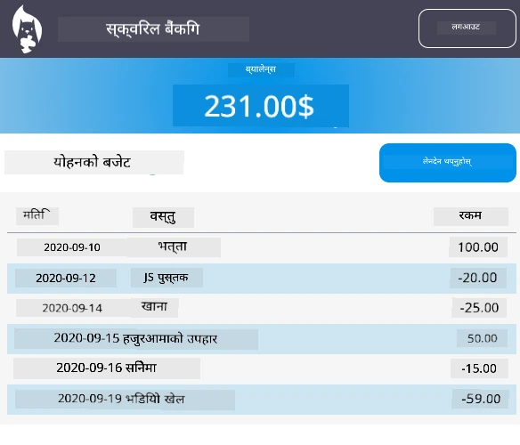

# :dollar: बैंक बनाउनुहोस्

यस परियोजनामा, तपाईंले एक काल्पनिक बैंक कसरी निर्माण गर्ने भनेर सिक्नुहुनेछ। यी पाठहरूले वेब एपको लेआउट कसरी बनाउने र रुटहरू प्रदान गर्ने, फारमहरू निर्माण गर्ने, स्टेट व्यवस्थापन गर्ने, र API बाट डेटा कसरी ल्याउने भन्ने निर्देशनहरू समावेश गर्दछ, जसबाट तपाईं बैंकको डेटा प्राप्त गर्न सक्नुहुन्छ।

|  |  |
|--------------------------------|--------------------------------|

## पाठहरू

1. [वेब एपमा HTML टेम्प्लेट र रुटहरू](1-template-route/README.md)
2. [लगइन र दर्ता फारम बनाउनुहोस्](2-forms/README.md)
3. [डेटा ल्याउने र प्रयोग गर्ने विधिहरू](3-data/README.md)
4. [स्टेट व्यवस्थापनका अवधारणाहरू](4-state-management/README.md)

### श्रेय

यी पाठहरू [Yohan Lasorsa](https://twitter.com/sinedied) द्वारा :hearts: का साथ लेखिएका हुन्।

यदि तपाईं यी पाठहरूमा प्रयोग गरिएको [सर्भर API](/7-bank-project/api/README.md) कसरी निर्माण गर्ने सिक्न इच्छुक हुनुहुन्छ भने, तपाईं [यस भिडियो श्रृंखला](https://aka.ms/NodeBeginner) (विशेष गरी भिडियो १७ देखि २१ सम्म) अनुसरण गर्न सक्नुहुन्छ।

तपाईं [यो अन्तरक्रियात्मक लर्न ट्युटोरियल](https://aka.ms/learn/express-api) पनि हेर्न सक्नुहुन्छ।

**अस्वीकरण**:  
यो दस्तावेज़ AI अनुवाद सेवा [Co-op Translator](https://github.com/Azure/co-op-translator) प्रयोग गरेर अनुवाद गरिएको छ। हामी यथार्थताको लागि प्रयास गर्छौं, तर कृपया ध्यान दिनुहोस् कि स्वचालित अनुवादहरूमा त्रुटिहरू वा अशुद्धताहरू हुन सक्छ। यसको मूल भाषा मा रहेको मूल दस्तावेज़लाई आधिकारिक स्रोत मानिनुपर्छ। महत्वपूर्ण जानकारीको लागि, व्यावसायिक मानव अनुवाद सिफारिस गरिन्छ। यस अनुवादको प्रयोगबाट उत्पन्न हुने कुनै पनि गलतफहमी वा गलत व्याख्याको लागि हामी जिम्मेवार हुने छैनौं।