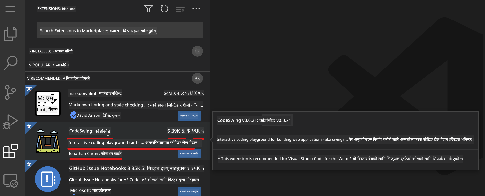

<!--
CO_OP_TRANSLATOR_METADATA:
{
  "original_hash": "7aa6e4f270d38d9cb17f2b5bd86b863d",
  "translation_date": "2025-08-25T23:18:04+00:00",
  "source_file": "8-code-editor/1-using-a-code-editor/README.md",
  "language_code": "ne"
}
-->
# कोड सम्पादक प्रयोग गर्दै

यो पाठले [VSCode.dev](https://vscode.dev) को आधारभूत जानकारी समेट्छ, जुन वेब-आधारित कोड सम्पादक हो। यसले तपाईंलाई आफ्नो कोडमा परिवर्तन गर्न र कुनै पनि सफ्टवेयर आफ्नो कम्प्युटरमा स्थापना नगरी परियोजनामा योगदान दिन सक्षम बनाउँछ।

## सिकाइका उद्देश्यहरू

यस पाठमा, तपाईंले सिक्नुहुनेछ:

- कोड परियोजनामा कोड सम्पादक प्रयोग गर्ने
- संस्करण नियन्त्रणको माध्यमबाट परिवर्तनहरू ट्र्याक गर्ने
- विकासका लागि सम्पादकलाई अनुकूलन गर्ने

### पूर्वआवश्यकताहरू

सुरु गर्नुअघि, तपाईंले [GitHub](https://github.com) मा खाता बनाउनुपर्नेछ। [GitHub](https://github.com/) मा जानुहोस् र खाता बनाउनुहोस् यदि तपाईंले पहिले नै बनाउनु भएको छैन भने।

### परिचय

कोड सम्पादक प्रोग्राम लेख्न र विद्यमान कोडिङ परियोजनाहरूमा सहकार्य गर्नका लागि एक महत्त्वपूर्ण उपकरण हो। एक पटक तपाईंले सम्पादकको आधारभूत कुरा र यसको सुविधाहरू कसरी प्रयोग गर्ने भन्ने बुझ्नुभयो भने, तपाईंले कोड लेख्दा ती लागू गर्न सक्नुहुन्छ।

## VSCode.dev को साथ सुरु गर्दै

[VSCode.dev](https://vscode.dev) वेबमा आधारित कोड सम्पादक हो। यसलाई प्रयोग गर्न तपाईंले केही पनि स्थापना गर्न आवश्यक पर्दैन, यो कुनै पनि वेबसाइट खोल्न जस्तै हो। सम्पादक सुरु गर्न, निम्न लिङ्क खोल्नुहोस्: [https://vscode.dev](https://vscode.dev)। यदि तपाईं [GitHub](https://github.com/) मा साइन इन हुनुहुन्न भने, साइन इन गर्न वा नयाँ खाता बनाउनका लागि निर्देशनहरू पालना गर्नुहोस् र त्यसपछि साइन इन गर्नुहोस्।

लोड भएपछि, यो निम्न चित्र जस्तै देखिनुपर्छ:


त्यहाँ तीन मुख्य खण्डहरू छन्, बायाँबाट दायाँतर्फ जाँदा:

1. _एक्टिभिटी बार_, जसमा केही आइकनहरू छन्, जस्तै आवर्धक गिलास 🔎, गियर ⚙️, र केही अन्य।
2. विस्तारित एक्टिभिटी बार, जुन _एक्सप्लोरर_ मा डिफल्ट हुन्छ, यसलाई _साइड बार_ भनिन्छ।
3. अन्ततः, दायाँपट्टि कोड क्षेत्र।

प्रत्येक आइकनमा क्लिक गरेर फरक मेनु प्रदर्शन गर्नुहोस्। एक पटक सकिएपछि, _एक्सप्लोरर_ मा क्लिक गर्नुहोस् ताकि तपाईं सुरु गरेको ठाउँमा फर्कन सक्नुहुन्छ।

जब तपाईं कोड सिर्जना गर्न वा विद्यमान कोड परिमार्जन गर्न सुरु गर्नुहुन्छ, यो सबैभन्दा ठूलो क्षेत्र (दायाँपट्टि) मा हुनेछ। तपाईंले यो क्षेत्र विद्यमान कोड हेर्नका लागि पनि प्रयोग गर्नुहुनेछ, जुन तपाईंले अब गर्नेछ।

## GitHub रिपोजिटरी खोल्नुहोस्

तपाईंले पहिलो काम गर्नुपर्ने भनेको GitHub रिपोजिटरी खोल्नु हो। रिपोजिटरी खोल्नका लागि धेरै तरिकाहरू छन्। यस खण्डमा, तपाईंले रिपोजिटरी खोल्नका लागि दुई फरक तरिकाहरू देख्नुहुनेछ ताकि तपाईं परिवर्तनहरूमा काम गर्न सुरु गर्न सक्नुहुन्छ।

### 1. सम्पादकको साथ

सम्पादक आफैं प्रयोग गरेर रिमोट रिपोजिटरी खोल्नुहोस्। यदि तपाईं [VSCode.dev](https://vscode.dev) मा जानुहुन्छ भने, तपाईंले _"Open Remote Repository"_ बटन देख्नुहुनेछ:


तपाईं कमाण्ड प्यालेट पनि प्रयोग गर्न सक्नुहुन्छ। कमाण्ड प्यालेट एउटा इनपुट बक्स हो जहाँ तपाईं कुनै पनि शब्द टाइप गर्न सक्नुहुन्छ जुन कमाण्ड वा कार्यको भाग हो, सही कमाण्ड कार्यान्वयन गर्नका लागि। मेनुमा जानुहोस्, त्यसपछि _View_ चयन गर्नुहोस्, र त्यसपछि _Command Palette_ चयन गर्नुहोस्, वा निम्न किबोर्ड सर्टकट प्रयोग गर्नुहोस्: Ctrl-Shift-P (MacOS मा Command-Shift-P हुनेछ)।


मेनु खुलेपछि, _open remote repository_ टाइप गर्नुहोस्, र त्यसपछि पहिलो विकल्प चयन गर्नुहोस्। तपाईं भाग लिएको वा हालै खोलिएको धेरै रिपोजिटरीहरू देखिनेछन्। तपाईं पूर्ण GitHub URL पनि प्रयोग गर्न सक्नुहुन्छ। निम्न URL प्रयोग गर्नुहोस् र बक्समा पेस्ट गर्नुहोस्:

```
https://github.com/microsoft/Web-Dev-For-Beginners
```

✅ सफल भएमा, तपाईंले यो रिपोजिटरीका सबै फाइलहरू पाठ सम्पादकमा लोड भएको देख्नुहुनेछ।

### 2. URL प्रयोग गरेर

तपाईं URL सिधै प्रयोग गरेर पनि रिपोजिटरी लोड गर्न सक्नुहुन्छ। उदाहरणका लागि, हालको रिपोजिटरीको पूर्ण URL [https://github.com/microsoft/Web-Dev-For-Beginners](https://github.com/microsoft/Web-Dev-For-Beginners) हो, तर तपाईं GitHub डोमेनलाई `VSCode.dev/github` सँग स्वाप गर्न सक्नुहुन्छ र रिपोजिटरी सिधै लोड गर्न सक्नुहुन्छ। परिणामी URL हुनेछ [https://vscode.dev/github/microsoft/Web-Dev-For-Beginners](https://vscode.dev/github/microsoft/Web-Dev-For-Beginners)।

## फाइलहरू सम्पादन गर्नुहोस्

एक पटक तपाईंले ब्राउजर/VSCode.dev मा रिपोजिटरी खोल्नुभयो भने, अर्को चरण परियोजनामा अपडेट वा परिवर्तनहरू गर्नु हुनेछ।

### 1. नयाँ फाइल सिर्जना गर्नुहोस्

तपाईंले विद्यमान फोल्डरभित्र फाइल सिर्जना गर्न सक्नुहुन्छ, वा यसलाई रुट डाइरेक्टरी/फोल्डरमा सिर्जना गर्न सक्नुहुन्छ। नयाँ फाइल सिर्जना गर्न, तपाईंले फाइल सुरक्षित गर्न चाहनुभएको स्थान/डाइरेक्टरी खोल्नुहोस् र एक्टिभिटी बारमा _'New file ...'_ आइकन चयन गर्नुहोस्, यसलाई नाम दिनुहोस् र इन्टर थिच्नुहोस्।


### 2. रिपोजिटरीमा फाइल सम्पादन र सुरक्षित गर्नुहोस्

VSCode.dev प्रयोग गर्नु उपयोगी हुन्छ जब तपाईं आफ्नो परियोजनामा छिटो अपडेट गर्न चाहनुहुन्छ र कुनै पनि सफ्टवेयर स्थानीय रूपमा लोड गर्न चाहनुहुन्न।  
आफ्नो कोड अपडेट गर्न, एक्टिभिटी बारमा रहेको 'Explorer' आइकनमा क्लिक गर्नुहोस्, जसले रिपोजिटरीका फाइलहरू र फोल्डरहरू देखाउँछ।  
फाइल चयन गर्नुहोस्, यसलाई कोड क्षेत्रमा खोल्नुहोस्, परिवर्तन गर्नुहोस् र सुरक्षित गर्नुहोस्।


जब तपाईं आफ्नो परियोजनामा अपडेट गर्न सक्नुहुन्छ, _`source control`_ आइकन चयन गर्नुहोस्, जसले तपाईंले आफ्नो रिपोजिटरीमा गरेका सबै नयाँ परिवर्तनहरू समावेश गर्दछ।  
`Changes` फोल्डरमा फाइल(हरू) चयन गरेर तपाईंले आफ्नो परियोजनामा गरेका परिवर्तनहरू हेर्नुहोस्। यसले 'Working Tree' खोल्छ, जसले तपाईंले फाइलमा गरेका परिवर्तनहरू दृश्य रूपमा देखाउँछ। रातोले परियोजनाबाट हटाइएको कुरा देखाउँछ, जबकि हरियोले थपिएको कुरा देखाउँछ।


यदि तपाईंले गरेका परिवर्तनहरू सन्तोषजनक छन् भने, `Changes` फोल्डरमा होभर गर्नुहोस् र परिवर्तनहरू स्टेज गर्न `+` बटन क्लिक गर्नुहोस्। स्टेजिङले तपाईंका परिवर्तनहरू GitHub मा कमिट गर्न तयार पार्ने काम गर्दछ।  
तर, यदि तपाईं केही परिवर्तनहरूमा सन्तुष्ट हुनुहुन्न र तिनीहरूलाई हटाउन चाहनुहुन्छ भने, `Changes` फोल्डरमा होभर गर्नुहोस् र `undo` आइकन चयन गर्नुहोस्।  

त्यसपछि, `commit message` टाइप गर्नुहोस् _(तपाईंले परियोजनामा गरेका परिवर्तनहरूको वर्णन)_ र परिवर्तनहरू कमिट र पुश गर्न `check icon` क्लिक गर्नुहोस्।  

जब तपाईं आफ्नो परियोजनामा काम गर्न सक्नुहुन्छ, शीर्ष बायाँमा रहेको `hamburger menu icon` चयन गर्नुहोस् र github.com मा रिपोजिटरीमा फर्कनुहोस्।


## एक्सटेन्सनहरू प्रयोग गर्दै

VSCode मा एक्सटेन्सनहरू स्थापना गर्दा तपाईंको सम्पादकमा नयाँ सुविधाहरू थप्न र विकास कार्यप्रवाह सुधार गर्न अनुकूलित विकास वातावरण विकल्पहरू थप्न अनुमति दिन्छ। यी एक्सटेन्सनहरूले तपाईंलाई धेरै प्रोग्रामिङ भाषाहरूको लागि समर्थन थप्न मद्दत गर्छन् र प्रायः सामान्य एक्सटेन्सनहरू वा भाषा-आधारित एक्सटेन्सनहरू हुन्छन्।  

सबै उपलब्ध एक्सटेन्सनहरूको सूची ब्राउज गर्न, एक्टिभिटी बारमा _`Extensions icon`_ क्लिक गर्नुहोस् र _'Search Extensions in Marketplace'_ लेबल गरिएको पाठ क्षेत्रमा एक्सटेन्सनको नाम टाइप गर्न सुरु गर्नुहोस्।  
तपाईंले एक्सटेन्सनहरूको सूची देख्नुहुनेछ, प्रत्येकमा **एक्सटेन्सनको नाम, प्रकाशकको नाम, एक वाक्यको वर्णन, डाउनलोडहरूको संख्या** र **स्टार रेटिङ** समावेश हुनेछ।  



तपाईंले पहिले स्थापना गरिएका सबै एक्सटेन्सनहरू _`Installed folder`_ विस्तार गरेर हेर्न सक्नुहुन्छ, अधिकांश विकासकर्ताहरूले प्रयोग गर्ने लोकप्रिय एक्सटेन्सनहरू _`Popular folder`_ मा, र तपाईंका लागि सिफारिस गरिएका एक्सटेन्सनहरू _`recommended folder`_ मा।  


### 1. एक्सटेन्सनहरू स्थापना गर्नुहोस्

एक्सटेन्सन स्थापना गर्न, खोज क्षेत्रमा एक्सटेन्सनको नाम टाइप गर्नुहोस् र यो विस्तारित एक्टिभिटी बारमा देखिएपछि यसलाई क्लिक गर्नुहोस्।  
अतिरिक्त जानकारी हेर्न कोड क्षेत्रमा लोड भएपछि, विस्तारित एक्टिभिटी बारमा _ब्लू इन्स्टल बटन_ क्लिक गर्नुहोस् वा कोड क्षेत्रमा देखिने इन्स्टल बटन प्रयोग गर्नुहोस्।  


### 2. एक्सटेन्सनहरू अनुकूलन गर्नुहोस्

एक्सटेन्सन स्थापना गरेपछि, तपाईंले यसको व्यवहार परिमार्जन गर्न र यसलाई आफ्नो प्राथमिकताहरूमा आधारित अनुकूलन गर्न आवश्यक हुन सक्छ।  
यसका लागि, एक्सटेन्सन आइकन चयन गर्नुहोस्, र यस पटक, तपाईंको एक्सटेन्सन _Installed folder_ मा देखिनेछ। _**Gear icon**_ क्लिक गर्नुहोस् र _Extensions Setting_ मा जानुहोस्।  


### 3. एक्सटेन्सनहरू व्यवस्थापन गर्नुहोस्

एक्सटेन्सन स्थापना र प्रयोग गरेपछि, vscode.dev ले तपाईंको फरक आवश्यकताहरूमा आधारित एक्सटेन्सन व्यवस्थापन गर्न विकल्पहरू प्रदान गर्दछ। उदाहरणका लागि, तपाईंले निम्न गर्न सक्नुहुन्छ:

- **अस्थायी रूपमा निष्क्रिय गर्नुहोस्:**  
  _(जब तपाईंलाई एक्सटेन्सनको आवश्यकता छैन तर यसलाई पूर्ण रूपमा अनइन्स्टल गर्न चाहनुहुन्न)_  
  विस्तारित एक्टिभिटी बारमा स्थापित एक्सटेन्सन चयन गर्नुहोस् > गियर आइकन क्लिक गर्नुहोस् > 'Disable' वा 'Disable (Workspace)' चयन गर्नुहोस् **वा** कोड क्षेत्रमा एक्सटेन्सन खोल्नुहोस् र ब्लू Disable बटन क्लिक गर्नुहोस्।  

- **अनइन्स्टल गर्नुहोस्:**  
  विस्तारित एक्टिभिटी बारमा स्थापित एक्सटेन्सन चयन गर्नुहोस् > गियर आइकन क्लिक गर्नुहोस् > 'Uninstall' चयन गर्नुहोस् **वा** कोड क्षेत्रमा एक्सटेन्सन खोल्नुहोस् र ब्लू Uninstall बटन क्लिक गर्नुहोस्।  

---

## असाइनमेन्ट

[VSCode.dev प्रयोग गरेर रिजुमे वेबसाइट बनाउनुहोस्](https://github.com/microsoft/Web-Dev-For-Beginners/blob/main/8-code-editor/1-using-a-code-editor/assignment.md)

## समीक्षा र आत्म-अध्ययन

[VSCode.dev](https://code.visualstudio.com/docs/editor/vscode-web?WT.mc_id=academic-0000-alfredodeza) र यसको अन्य सुविधाहरूको बारेमा थप पढ्नुहोस्।

**अस्वीकरण**:  
यो दस्तावेज़ AI अनुवाद सेवा [Co-op Translator](https://github.com/Azure/co-op-translator) प्रयोग गरेर अनुवाद गरिएको छ। हामी यथार्थताको लागि प्रयास गर्छौं, तर कृपया ध्यान दिनुहोस् कि स्वचालित अनुवादमा त्रुटिहरू वा अशुद्धताहरू हुन सक्छ। यसको मूल भाषा मा रहेको मूल दस्तावेज़लाई आधिकारिक स्रोत मानिनुपर्छ। महत्वपूर्ण जानकारीको लागि, व्यावसायिक मानव अनुवाद सिफारिस गरिन्छ। यस अनुवादको प्रयोगबाट उत्पन्न हुने कुनै पनि गलतफहमी वा गलत व्याख्याको लागि हामी जिम्मेवार हुने छैनौं।