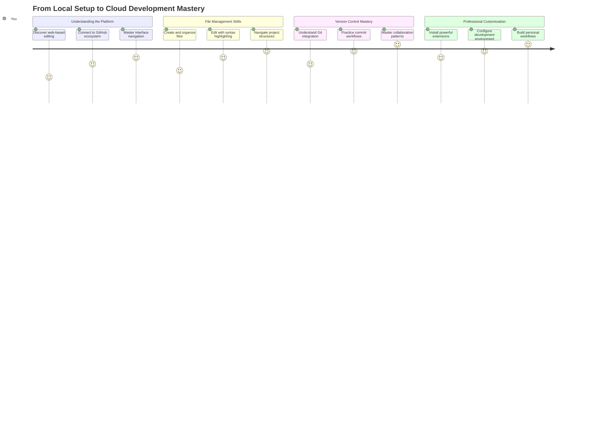
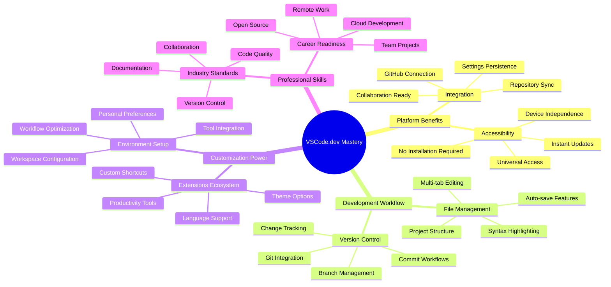
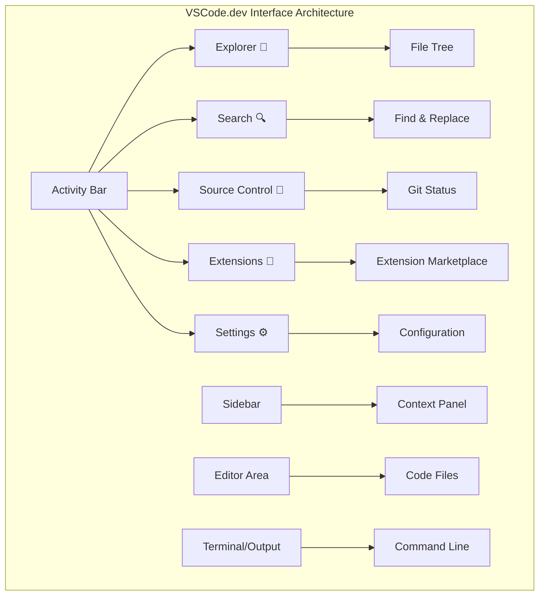
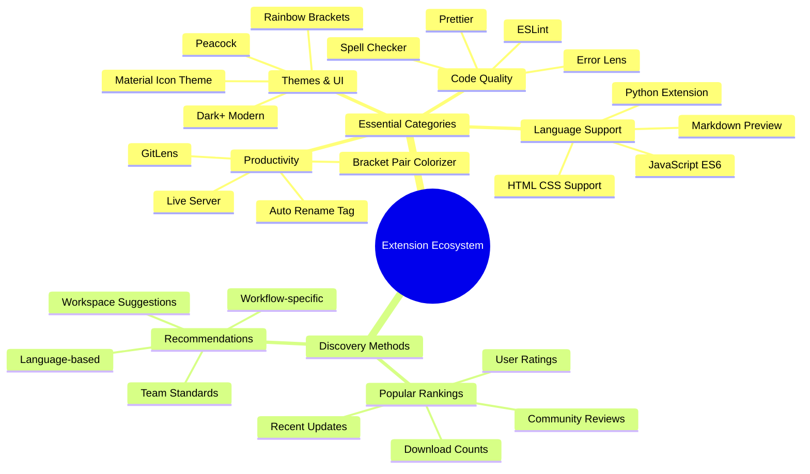
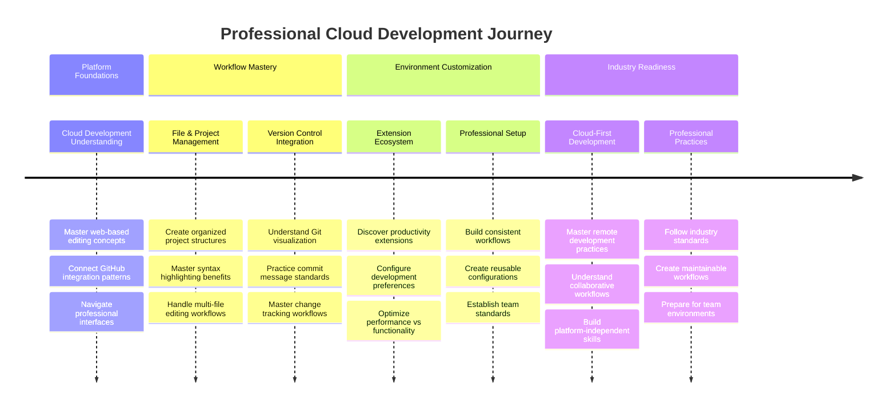

<!--
CO_OP_TRANSLATOR_METADATA:
{
  "original_hash": "a9a3bcc037a447e2d8994d99e871cd9f",
  "translation_date": "2025-11-03T15:16:20+00:00",
  "source_file": "8-code-editor/1-using-a-code-editor/README.md",
  "language_code": "ne"
}
-->
# कोड सम्पादक प्रयोग गर्दै: VSCode.dev मा महारत हासिल गर्नुहोस्

*द म्याट्रिक्स* मा नियोले डिजिटल संसारमा पहुँच गर्न ठूलो कम्प्युटर टर्मिनलमा प्लग गर्नुपरेको सम्झनुहुन्छ? आजको वेब विकास उपकरणहरू यसको ठीक उल्टो कथा हो – जहाँसुकैबाट पहुँच गर्न सकिने अत्यन्त शक्तिशाली क्षमता। VSCode.dev एक ब्राउजर-आधारित कोड सम्पादक हो जसले इन्टरनेट कनेक्शन भएको कुनै पनि उपकरणमा व्यावसायिक विकास उपकरणहरू ल्याउँछ।

जसरी छापाखानाले पुस्तकहरू सबैलाई उपलब्ध गरायो, केवल मठका लेखकहरूलाई मात्र होइन, VSCode.dev ले कोडिङलाई लोकतान्त्रिक बनाउँछ। तपाईं पुस्तकालयको कम्प्युटर, विद्यालयको प्रयोगशाला, वा ब्राउजर पहुँच भएको कुनै पनि ठाउँबाट परियोजनाहरूमा काम गर्न सक्नुहुन्छ। कुनै स्थापना आवश्यक छैन, कुनै "मलाई मेरो विशेष सेटअप चाहिन्छ" भन्ने सीमाहरू छैनन्।

यस पाठको अन्त्यसम्ममा, तपाईंले VSCode.dev नेभिगेट गर्न, GitHub रिपोजिटरीहरू सिधै ब्राउजरमा खोल्न, र संस्करण नियन्त्रणको लागि Git प्रयोग गर्न सिक्नुहुनेछ – व्यावसायिक विकासकर्ताहरूले दैनिक रूपमा भर पर्ने सबै सीपहरू।

## ⚡ तपाईंले अर्को ५ मिनेटमा गर्न सक्ने कुरा

**व्यस्त विकासकर्ताहरूको लागि छिटो सुरु गर्ने मार्ग**


- **मिनेट १**: [vscode.dev](https://vscode.dev) मा जानुहोस् - कुनै स्थापना आवश्यक छैन
- **मिनेट २**: GitHub सँग साइन इन गर्नुहोस् र आफ्नो रिपोजिटरीहरू जडान गर्नुहोस्
- **मिनेट ३**: URL ट्रिक प्रयास गर्नुहोस्: कुनै पनि रिपोजिटरी URL मा `github.com` लाई `vscode.dev/github` मा परिवर्तन गर्नुहोस्
- **मिनेट ४**: नयाँ फाइल सिर्जना गर्नुहोस् र स्वचालित रूपमा काम गर्ने सिन्ट्याक्स हाइलाइटिङ हेर्नुहोस्
- **मिनेट ५**: परिवर्तन गर्नुहोस् र स्रोत नियन्त्रण प्यानल मार्फत यसलाई कमिट गर्नुहोस्

**छिटो परीक्षण URL**:
```
# Transform this:
github.com/microsoft/Web-Dev-For-Beginners

# Into this:
vscode.dev/github/microsoft/Web-Dev-For-Beginners
```

**किन यो महत्त्वपूर्ण छ**: ५ मिनेटमा, तपाईंले व्यावसायिक उपकरणहरूसँग जहाँसुकै कोडिङको स्वतन्त्रता अनुभव गर्नुहुनेछ। यो विकासको भविष्यको प्रतिनिधित्व गर्दछ - पहुँचयोग्य, शक्तिशाली, र तुरुन्त।

## 🗺️ क्लाउड-आधारित विकासको माध्यमबाट तपाईंको सिकाइ यात्रा



**तपाईंको यात्रा गन्तव्य**: यस पाठको अन्त्यसम्ममा, तपाईंले कुनै पनि उपकरणबाट काम गर्ने व्यावसायिक क्लाउड विकास वातावरणमा महारत हासिल गर्नुहुनेछ, जसले तपाईंलाई प्रमुख प्रविधि कम्पनीका विकासकर्ताहरूले प्रयोग गर्ने समान उपकरणहरूसँग कोड गर्न सक्षम बनाउँछ।

## तपाईंले के सिक्नुहुनेछ

हामी यसलाई सँगै हिँड्दा, तपाईं सक्षम हुनुहुनेछ:

- VSCode.dev लाई आफ्नो दोस्रो घरजस्तै नेभिगेट गर्नुहोस् – आवश्यक पर्ने सबै कुरा पत्ता लगाउन बिना हराउने
- कुनै पनि GitHub रिपोजिटरी ब्राउजरमा खोल्नुहोस् र तुरुन्तै सम्पादन सुरु गर्नुहोस् (यो साँच्चै जादुई छ!)
- Git प्रयोग गरेर आफ्नो परिवर्तनहरू ट्र्याक गर्नुहोस् र व्यावसायिक जस्तै आफ्नो प्रगति बचत गर्नुहोस्
- कोडिङलाई छिटो र रमाइलो बनाउने एक्सटेन्सनहरू प्रयोग गरेर आफ्नो सम्पादकलाई सुपरचार्ज गर्नुहोस्
- आत्मविश्वासका साथ परियोजना फाइलहरू सिर्जना र व्यवस्थित गर्नुहोस्

## तपाईंलाई के चाहिन्छ

आवश्यकताहरू सरल छन्:

- नि:शुल्क [GitHub खाता](https://github.com) (हामी आवश्यक परेमा सिर्जना गर्न मार्गदर्शन गर्नेछौं)
- वेब ब्राउजरहरूको आधारभूत परिचय
- GitHub Basics पाठले उपयोगी पृष्ठभूमि प्रदान गर्दछ, यद्यपि यो आवश्यक छैन

> 💡 **GitHub मा नयाँ?** खाता सिर्जना नि:शुल्क छ र केही मिनेट लाग्छ। जस्तै पुस्तकालय कार्डले तपाईंलाई विश्वव्यापी पुस्तकहरूमा पहुँच दिन्छ, GitHub खाता इन्टरनेटभरि कोड रिपोजिटरीहरूमा ढोका खोल्छ।

## 🧠 क्लाउड विकास पारिस्थितिकी प्रणालीको अवलोकन



**मुख्य सिद्धान्त**: क्लाउड-आधारित विकास वातावरणहरूले कोडिङको भविष्यको प्रतिनिधित्व गर्दछ - व्यावसायिक-ग्रेड उपकरणहरू प्रदान गर्दै जुन पहुँचयोग्य, सहयोगात्मक, र प्लेटफर्म-स्वतन्त्र छन्।

## किन वेब-आधारित कोड सम्पादकहरू महत्त्वपूर्ण छन्

इन्टरनेट अघि, विभिन्न विश्वविद्यालयका वैज्ञानिकहरूले अनुसन्धान सजिलै साझेदारी गर्न सक्दैनथे। त्यसपछि १९६० को दशकमा ARPANET आयो, जसले दूरीहरू पार गरेर कम्प्युटरहरू जडान गर्‍यो। वेब-आधारित कोड सम्पादकहरूले यही सिद्धान्त अनुसरण गर्छन् – शक्तिशाली उपकरणहरू तपाईंको भौतिक स्थान वा उपकरणको पर्वाह नगरी पहुँचयोग्य बनाउँदै।

कोड सम्पादक तपाईंको विकास कार्यक्षेत्रको रूपमा काम गर्दछ, जहाँ तपाईं कोड फाइलहरू लेख्नुहुन्छ, सम्पादन गर्नुहुन्छ, र व्यवस्थित गर्नुहुन्छ। साधारण पाठ सम्पादकहरू भन्दा फरक, व्यावसायिक कोड सम्पादकहरूले सिन्ट्याक्स हाइलाइटिङ, त्रुटि पत्ता लगाउने, र परियोजना व्यवस्थापन सुविधाहरू प्रदान गर्छन्।

VSCode.dev यी क्षमताहरूलाई तपाईंको ब्राउजरमा ल्याउँछ:

**वेब-आधारित सम्पादनका फाइदाहरू:**

| सुविधा | विवरण | व्यावहारिक लाभ |
|---------|-------------|----------|
| **प्लेटफर्म स्वतन्त्रता** | कुनै पनि ब्राउजर भएको उपकरणमा चल्छ | विभिन्न कम्प्युटरहरूबाट सहजै काम गर्नुहोस् |
| **स्थापना आवश्यक छैन** | वेब URL मार्फत पहुँच | सफ्टवेयर स्थापना प्रतिबन्धहरू बाइपास गर्नुहोस् |
| **स्वचालित अपडेटहरू** | सधैं नवीनतम संस्करण चल्छ | म्यानुअल अपडेट बिना नयाँ सुविधाहरू पहुँच गर्नुहोस् |
| **रिपोजिटरी एकीकरण** | GitHub सँग सिधा जडान | स्थानीय फाइल व्यवस्थापन बिना कोड सम्पादन गर्नुहोस् |

**व्यावहारिक प्रभावहरू:**
- विभिन्न वातावरणहरूमा कामको निरन्तरता
- अपरेटिङ सिस्टमको पर्वाह नगरी स्थिर इन्टरफेस
- तत्काल सहयोग क्षमताहरू
- स्थानीय भण्डारण आवश्यकताहरू कम गर्नुहोस्

## VSCode.dev अन्वेषण गर्दै

जसरी मेरी क्युरीको प्रयोगशालामा अपेक्षाकृत साधारण ठाउँमा परिष्कृत उपकरणहरू समावेश थिए, VSCode.dev ले ब्राउजर इन्टरफेसमा व्यावसायिक विकास उपकरणहरू समेट्छ। यो वेब एप्लिकेसनले डेस्कटप कोड सम्पादकहरूको समान मुख्य कार्यक्षमता प्रदान गर्दछ।

[VSCode.dev](https://vscode.dev) मा आफ्नो ब्राउजरमा नेभिगेट गरेर सुरु गर्नुहोस्। इन्टरफेस डाउनलोडहरू वा प्रणाली स्थापना बिना लोड हुन्छ – क्लाउड कम्प्युटिङ सिद्धान्तहरूको प्रत्यक्ष अनुप्रयोग।

### आफ्नो GitHub खाता जडान गर्दै

जसरी अलेक्जेन्डर ग्राहम बेलको टेलिफोनले टाढाका स्थानहरू जडान गर्‍यो, आफ्नो GitHub खाता जडान गर्दा VSCode.dev लाई तपाईंको कोड रिपोजिटरीहरूसँग जोड्छ। GitHub सँग साइन इन गर्न संकेत गर्दा, यो जडान स्वीकार गर्न सिफारिस गरिन्छ।

**GitHub एकीकरणले प्रदान गर्दछ:**
- सम्पादक भित्र तपाईंको रिपोजिटरीहरूमा सिधा पहुँच
- उपकरणहरूमा समक्रमित सेटिङहरू र एक्सटेन्सनहरू
- GitHub मा बचत कार्यप्रवाहलाई सरल बनाउनुहोस्
- व्यक्तिगत विकास वातावरण

### आफ्नो नयाँ कार्यक्षेत्र चिन्नुहोस्

सबै कुरा लोड भएपछि, तपाईंले एक सुन्दर रूपमा सफा कार्यक्षेत्र देख्नुहुनेछ जुन तपाईंलाई महत्त्वपूर्ण कुरामा केन्द्रित राख्न डिजाइन गरिएको छ – तपाईंको कोड!


**यहाँ तपाईंको छिमेकको भ्रमण छ:**
- **एक्टिभिटी बार** (बायाँपट्टि पट्टी): तपाईंको मुख्य नेभिगेसन एक्सप्लोरर 📁, खोज 🔍, स्रोत नियन्त्रण 🌿, एक्सटेन्सन 🧩, र सेटिङ ⚙️ सहित
- **साइडबार** (यसको छेउमा प्यानल): तपाईंले चयन गर्नुभएको कुराको आधारमा तपाईंलाई सान्दर्भिक जानकारी देखाउन परिवर्तन हुन्छ
- **सम्पादक क्षेत्र** (बीचको ठूलो ठाउँ): यहाँ जादू हुन्छ – तपाईंको मुख्य कोडिङ क्षेत्र

**एक पल्ट अन्वेषण गर्नुहोस्:**
- ती एक्टिभिटी बार आइकनहरूमा क्लिक गर्नुहोस् र प्रत्येकले के गर्छ हेर्नुहोस्
- साइडबारले विभिन्न जानकारी देखाउन कसरी अपडेट गर्दछ नोट गर्नुहोस् – धेरै राम्रो, हैन र?
- एक्सप्लोरर दृश्य (📁) सम्भवतः तपाईंले धेरै समय बिताउने ठाउँ हो, त्यसैले यससँग सहज हुनुहोस्



## GitHub रिपोजिटरीहरू खोल्दै

इन्टरनेट अघि, अनुसन्धानकर्ताहरूले कागजातहरू पहुँच गर्न पुस्तकालयहरूमा शारीरिक रूपमा यात्रा गर्नुपर्थ्यो। GitHub रिपोजिटरीहरू समान रूपमा काम गर्छन् – तिनीहरू टाढा भण्डारण गरिएको कोडको संग्रह हुन्। VSCode.dev ले सम्पादन अघि रिपोजिटरीहरूलाई तपाईंको स्थानीय मेसिनमा डाउनलोड गर्ने परम्परागत चरणलाई हटाउँछ।

यो क्षमता कुनै पनि सार्वजनिक रिपोजिटरीलाई हेर्न, सम्पादन गर्न, वा योगदान गर्न तत्काल पहुँच सक्षम बनाउँछ। यहाँ रिपोजिटरीहरू खोल्नका लागि दुई विधिहरू छन्:

### विधि १: पोइन्ट-एन्ड-क्लिक तरिका

यो VSCode.dev मा नयाँ सुरु गर्दा र विशिष्ट रिपोजिटरी खोल्न चाहनुहुन्छ भने उत्तम हो। यो सरल र शुरुवातमैत्री छ:

**यसलाई कसरी गर्ने:**

1. [vscode.dev](https://vscode.dev) मा जानुहोस् यदि तपाईं त्यहाँ हुनुहुन्न भने
2. स्वागत स्क्रीनमा "ओपन रिमोट रिपोजिटरी" बटन खोज्नुहोस् र यसलाई क्लिक गर्नुहोस्

   

3. कुनै पनि GitHub रिपोजिटरी URL पेस्ट गर्नुहोस् (यो प्रयास गर्नुहोस्: `https://github.com/microsoft/Web-Dev-For-Beginners`)
4. इन्टर थिच्नुहोस् र जादू हेर्नुहोस्!

**प्रो टिप - कमाण्ड प्यालेट सर्टकट:**

कोडिङ जादूगर जस्तो महसुस गर्न चाहनुहुन्छ? यो किबोर्ड सर्टकट प्रयास गर्नुहोस्: Ctrl+Shift+P (वा Mac मा Cmd+Shift+P) कमाण्ड प्यालेट खोल्न:


**कमाण्ड प्यालेट भनेको तपाईंले गर्न सक्ने सबै कुराको लागि खोज इन्जिन जस्तै हो:**
- "ओपन रिमोट" टाइप गर्नुहोस् र यसले रिपोजिटरी ओपनर तपाईंको लागि फेला पार्छ
- यसले तपाईंले हालै खोल्नुभएको रिपोजिटरीहरू सम्झन्छ (धेरै उपयोगी!)
- एकपटक तपाईं यसमा अभ्यस्त भएपछि, तपाईंलाई लाग्छ कि तपाईं प्रकाशको गतिमा कोडिङ गर्दै हुनुहुन्छ
- यो मूलतः VSCode.dev को "हे सिरी, तर कोडिङको लागि" संस्करण हो

### विधि २: URL परिमार्जन प्रविधि

जसरी HTTP र HTTPS ले समान डोमेन संरचना कायम राख्दै विभिन्न प्रोटोकलहरू प्रयोग गर्छन्, VSCode.dev ले GitHub को ठेगाना प्रणालीलाई प्रतिबिम्बित गर्ने URL ढाँचा प्रयोग गर्छ। कुनै पनि GitHub रिपोजिटरी URL लाई VSCode.dev मा सिधै खोल्न परिमार्जन गर्न सकिन्छ।

**URL रूपान्तरण ढाँचा:**

| रिपोजिटरी प्रकार | GitHub URL | VSCode.dev URL |
|----------------|---------------------|----------------|
| **सार्वजनिक रिपोजिटरी** | `github.com/microsoft/Web-Dev-For-Beginners` | `vscode.dev/github/microsoft/Web-Dev-For-Beginners` |
| **व्यक्तिगत परियोजना** | `github.com/your-username/my-project` | `vscode.dev/github/your-username/my-project` |
| **कुनै पनि पहुँचयोग्य रिपो** | `github.com/their-username/awesome-repo` | `vscode.dev/github/their-username/awesome-repo` |

**कार्यान्वयन:**
- `github.com` लाई `vscode.dev/github` सँग बदल्नुहोस्
- अन्य सबै URL घटकहरू अपरिवर्तित राख्नुहोस्
- कुनै पनि सार्वजनिक रूपमा पहुँचयोग्य रिपोजिटरीसँग काम गर्दछ
- तत्काल सम्पादन पहुँच प्रदान गर्दछ

> 💡 **जीवन परिवर्तन गर्ने टिप**: तपाईंको मनपर्ने रिपोजिटरीहरूको VSCode.dev संस्करणहरू बुकमार्क गर्नुहोस्। मेरोसँग "मेरो पोर्टफोलियो सम्पादन गर्नुहोस्" र "डकुमेन्टेसन सुधार गर्नुहोस्" जस्ता बुकमार्कहरू छन् जसले मलाई सिधै सम्पादन मोडमा लैजान्छ!

**कुन विधि प्रयोग गर्ने?**
- **इन्टरफेस तरिका**: जब तपाईं अन्वेषण गर्दै हुनुहुन्छ वा ठ्याक्कै रिपोजिटरी नामहरू सम्झन सक्नुहुन्न
- **URL ट्रिक**: जब तपाईंलाई ठ्याक्कै कहाँ जानु छ थाहा छ भने प्रकाशको गतिमा पहुँचको लागि उत्तम

### 🎯 शैक्षिक जाँच: क्लाउड विकास पहुँच

**रोक्नुहोस् र प्रतिबिम्बित गर्नुहोस्**: तपाईंले वेब ब्राउजर मार्फत कोड रिपोजिटरीहरू पहुँच गर्ने दुई विधिहरू सिक्नुभएको छ। यसले विकास कसरी काम गर्छ भन्नेमा मौलिक परिवर्तनको प्रतिनिधित्व गर्दछ।

**छिटो आत्म-मूल्यांकन**:
- वेब-आधारित सम्पादनले परम्परागत "विकास वातावरण सेटअप" किन हटाउँछ भनेर तपाईं व्याख्या गर्न सक्नुहुन्छ?
- स्थानीय git क्लोनिङको तुलनामा URL परिमार्जन प्रविधिले के फाइदा प्रदान गर्दछ?
- यसले तपाईंलाई खुला स्रोत परियोजनाहरूमा योगदान गर्ने तरिका कसरी परिवर्तन गर्न सक्छ?

**वास्तविक संसारको जडान**: GitHub, GitLab, र Replit जस्ता प्रमुख कम्पनीहरूले यी क्लाउड-प्रथम सिद्धान्तहरू वरिपरि आफ्ना विकास प्लेटफर्महरू निर्माण गरेका छन्। तपाईंले व्यावसायिक विकास टोलीहरूले विश्वव्यापी रूपमा प्रयोग गर्ने समान कार्यप्रवाहहरू सिक्दै हुनुहुन्छ।

**चुनौती प्रश्न**: क्लाउड-आधारित विकासले विद्यालयहरूमा कोडिङ सिकाउने तरिका कसरी परिवर्तन गर्न सक्छ? उपकरण आवश्यकताहरू, सफ्टवेयर व्यवस्थापन, र सहयोगी सम्भावनाहरू विचार गर्नुहोस्।

## फाइलहरू र परियोजनाहरूको साथ काम गर्दै

अब तपाईंले रिपोजिटरी खोल्नुभएको छ, सुरु गरौं! VSCode.dev ले तपाईंलाई कोड फाइलहरू सिर्जना, सम्पादन, र व्यवस्थित गर्न आवश्यक सबै कुरा दिन्छ। यसलाई तपाईंको डिजिटल कार्यशाला जस्तै सोच्नुहोस् – प्रत्येक उपकरण तपाईंलाई आवश्यक पर्ने ठाउँमा छ।

आउनुहोस्, तपाईंको कोडिङ कार्यप्रवाहको अधिकांश भाग बनाउने दैनिक कार्यहरूमा डुबौं।

### नयाँ फाइलहरू सिर्जना गर्दै

जसरी वास्तुकारको कार्यालयमा ब्लूप्रिन्टहरू व्यवस्थित गरिन्छ, VSCode.dev मा फाइल सिर्जना संरचित दृष्टिकोण अनुसरण गर्दछ। प्रणालीले सबै मानक वेब विकास फाइल प्रकारहरूलाई समर्थन गर्दछ।

**फाइल सिर्जना प्रक्रिया:**

1. एक्सप्लोरर साइडबारमा लक्षित फोल्डरमा नेभिगेट गर्नुहोस्
2. फोल्डर नाममा होभर गर्नुहोस् "नयाँ फाइल" आइकन (📄+) प्रकट गर्न
3. उपयुक्त एक्सटेन्सन सहित फाइल नाम प्रविष्ट गर्नुहोस् (`style.css`, `script.js`, `index.html`)
4. फाइल सिर्जना गर्न इन्टर थिच्नुहोस्


**नामकरण परम्पराहरू:**
- फाइल उद्देश्य संकेत गर्ने वर्णनात्मक नामहरू प्रयोग गर्नुहोस्
- उचित सिन्ट्याक्स हाइलाइटिङको लागि फाइल एक्सटेन्सनहरू समावेश गर्नुहोस्
- परियोजनाहरूमा समान नामकरण ढाँचाहरू अनुसरण गर्नुहोस्
- स्पेसको सट्टा लोअरकेस अक्षरहरू र हाइफनहरू प्रयोग गर्नुहोस्

### फाइलहरू सम्पादन र बचत गर्दै

यहाँ वास्तविक रमाइलो सुरु हुन्छ! VSCode.dev को सम्पादक उपयोगी सुविधाहरूले भरिएको छ जसले कोडिङलाई सहज र सहज बनाउँछ। यो कोडको लागि धेरै स्मार्ट लेखन सहायक भएको जस्तै हो।

**तपाईंको सम्पादन कार्यप्रवाह:**

1. एक्सप्लोररमा कुनै पनि फाइलमा क्लिक गर्नुहोस् यसलाई मुख्य क्षेत्रमा खोल्न
2. टाइप गर्न सुरु गर्नुहोस् र VSCode.dev ले तपाईंलाई रंग, सुझाव, र त्रुटि स्पटिङको साथ मद्दत गरेको हेर्नुहोस्
3. Ctrl+S (Windows/Linux) वा Cmd+S (Mac) सँग आफ्नो काम बचत गर्नुहोस् – यद्यपि यसले स्वचालित रूपमा पनि बचत गर्दछ!


**कोड गर्दा हुने चाखलाग्दो कुराहरू:**
- तपाईंको कोड सु
- तपाईले गरेका सबै staged परिवर्तनहरूमा सन्तुष्ट हुनुहुन्छ भनेर दोहोरो जाँच गर्नुहोस्  
- तपाईले के गर्नुभयो भनेर छोटो नोट लेख्नुहोस् (यो तपाईको "commit message" हो)  
- सबै कुरा GitHub मा बचत गर्न checkmark बटन क्लिक गर्नुहोस्  
- यदि तपाईले कुनै कुरा परिवर्तन गर्न चाहनुहुन्छ भने, undo आइकनले परिवर्तनहरू हटाउन मद्दत गर्दछ  

**राम्रो commit message लेख्ने तरिका (यो सोचेभन्दा सजिलो छ!):**  
- तपाईले के गर्नुभयो भनेर मात्र वर्णन गर्नुहोस्, जस्तै "Add contact form" वा "Fix broken navigation"  
- छोटो र स्पष्ट राख्नुहोस् – ट्वीट जत्तिकै छोटो, निबन्ध जस्तो लामो होइन  
- "Add", "Fix", "Update", वा "Remove" जस्ता क्रियात्मक शब्दबाट सुरु गर्नुहोस्  
- **राम्रो उदाहरणहरू**: "Add responsive navigation menu", "Fix mobile layout issues", "Update colors for better accessibility"  

> 💡 **छिटो नेभिगेसन टिप**: GitHub repository मा फर्कन र तपाईले committed परिवर्तनहरू अनलाइन हेर्नको लागि माथि बायाँ रहेको hamburger menu (☰) प्रयोग गर्नुहोस्। यो तपाईको editing environment र GitHub को home बीचको जादुई द्वार जस्तै हो!  

## विस्तारहरूको साथ कार्यक्षमता सुधार गर्दै  

जसरी एक कुशल कारीगरको कार्यशालामा विभिन्न कार्यहरूको लागि विशेष उपकरणहरू हुन्छन्, VSCode.dev लाई पनि विस्तारहरू प्रयोग गरेर अनुकूलित गर्न सकिन्छ जसले विशिष्ट क्षमताहरू थप्छ। यी समुदायद्वारा विकसित प्लगइनहरूले कोड फर्म्याटिङ, लाइभ प्रिभ्यू, र Git एकीकरण जस्ता सामान्य विकास आवश्यकताहरूलाई सम्बोधन गर्छन्।  

Extension Marketplace मा विश्वभरका विकासकर्ताहरूले बनाएका हजारौं निःशुल्क उपकरणहरू छन्। प्रत्येक विस्तारले विशेष workflow चुनौतीहरू समाधान गर्दछ, जसले तपाईलाई तपाईको विशिष्ट आवश्यकताहरू र प्राथमिकताहरू अनुरूप व्यक्तिगत विकास वातावरण निर्माण गर्न अनुमति दिन्छ।  


  
### तपाईको उपयुक्त विस्तारहरू खोज्दै  

Extension Marketplace धेरै राम्रोसँग व्यवस्थित छ, त्यसैले तपाईलाई आवश्यक पर्ने कुरा खोज्न गाह्रो हुनेछैन। यो विशेष उपकरणहरू र त्यस्ता चिजहरू पत्ता लगाउन मद्दत गर्न डिजाइन गरिएको छ जुन तपाईलाई थाहा पनि थिएन!  

**Marketplace मा कसरी पुग्ने:**  

1. Activity Bar मा Extensions आइकन (🧩) क्लिक गर्नुहोस्  
2. वरिपरि ब्राउज गर्नुहोस् वा केही विशेष खोज्नुहोस्  
3. चासो लाग्ने कुनै पनि कुरामा क्लिक गरेर थप जानकारी प्राप्त गर्नुहोस्  

  

**त्यहाँ के देख्नुहुन्छ:**  

| Section | भित्र के छ | किन उपयोगी छ |  
|----------|---------|----------|  
| **Installed** | तपाईले पहिले नै थपेका विस्तारहरू | तपाईको व्यक्तिगत कोडिङ टूलकिट |  
| **Popular** | सबैभन्दा मनपर्ने | धेरै विकासकर्ताहरूले सिफारिस गरेका |  
| **Recommended** | तपाईको प्रोजेक्टको लागि स्मार्ट सुझावहरू | VSCode.dev को उपयोगी सिफारिसहरू |  

**ब्राउज गर्न सजिलो बनाउने कुरा:**  
- प्रत्येक विस्तारले रेटिङ, डाउनलोड संख्या, र वास्तविक प्रयोगकर्ताको समीक्षा देखाउँछ  
- प्रत्येक विस्तारले के गर्छ भन्ने स्पष्ट विवरण र स्क्रिनशटहरू प्रदान गर्दछ  
- सबै कुरा compatibility जानकारीसहित स्पष्ट रूपमा चिन्हित गरिएको छ  
- समान विस्तारहरू सुझाव दिइन्छ ताकि तपाईले विकल्पहरू तुलना गर्न सक्नुहुन्छ  

### विस्तारहरू स्थापना गर्दै (यो धेरै सजिलो छ!)  

तपाईको editor मा नयाँ क्षमता थप्नु बटन क्लिक गर्ने जत्तिकै सजिलो छ। विस्तारहरू सेकेन्डमा स्थापना हुन्छन् र तुरुन्तै काम गर्न सुरु गर्छन् – कुनै restart आवश्यक छैन, कुनै प्रतीक्षा छैन।  

**तपाईले गर्नुपर्ने सबै:**  

1. तपाईलाई चाहिने कुरा खोज्नुहोस् (जस्तै "live server" वा "prettier" खोज्नुहोस्)  
2. राम्रो देखिनेमा क्लिक गरेर थप विवरण हेर्नुहोस्  
3. यो के गर्छ भनेर पढ्नुहोस् र रेटिङ जाँच गर्नुहोस्  
4. निलो "Install" बटन क्लिक गर्नुहोस् र तपाईको काम सकियो!  

  

**पर्दा पछाडि के हुन्छ:**  
- विस्तार स्वतः डाउनलोड हुन्छ र सेटअप हुन्छ  
- नयाँ सुविधाहरू तपाईको interface मा तुरुन्तै देखा पर्छन्  
- सबै कुरा तुरुन्तै काम गर्न सुरु हुन्छ (गम्भीरतासाथ, यो यति छिटो छ!)  
- यदि तपाई signed in हुनुहुन्छ भने, विस्तार सबै उपकरणहरूमा sync हुन्छ  

**केही सिफारिस गरिएका विस्तारहरू:**  
- **Live Server**: तपाईको वेबसाइट कोड गर्दा वास्तविक समयमा अपडेट हेर्नुहोस् (यो जादुई छ!)  
- **Prettier**: तपाईको कोडलाई स्वचालित रूपमा सफा र व्यावसायिक देखिने बनाउँछ  
- **Auto Rename Tag**: एउटा HTML tag परिवर्तन गर्दा यसको जोडी पनि अपडेट हुन्छ  
- **Bracket Pair Colorizer**: तपाईका ब्र्याकेटहरूलाई रंगीन बनाउँछ ताकि तपाई कहिल्यै हराउनु नपरोस्  
- **GitLens**: तपाईको Git सुविधाहरूलाई धेरै उपयोगी जानकारीसहित सुपरचार्ज गर्दछ  

### तपाईका विस्तारहरू अनुकूलित गर्दै  

धेरै विस्तारहरूमा सेटिङहरू हुन्छन् जसलाई तपाईले आफ्नो आवश्यकता अनुसार समायोजन गर्न सक्नुहुन्छ। यसलाई कारको सीट र ऐना समायोजन गर्ने जस्तै सोच्नुहोस् – सबैको आफ्नै प्राथमिकता हुन्छ!  

**Extension सेटिङहरू समायोजन गर्ने तरिका:**  

1. Extensions panel मा तपाईको installed extension खोज्नुहोस्  
2. यसको नामको छेउमा रहेको सानो gear आइकन (⚙️) खोज्नुहोस् र क्लिक गर्नुहोस्  
3. Dropdown बाट "Extension Settings" चयन गर्नुहोस्  
4. तपाईको workflow अनुसार चीजहरू समायोजन गर्नुहोस्  

  

**तपाईले समायोजन गर्न चाहन सक्ने सामान्य कुराहरू:**  
- तपाईको कोड कसरी फर्म्याट हुन्छ (tabs vs spaces, line length, आदि)  
- कुन keyboard shortcuts विभिन्न कार्यहरू ट्रिगर गर्छन्  
- कुन file types मा विस्तारले काम गर्नुपर्छ  
- विशिष्ट सुविधाहरू अन वा अफ गरेर चीजहरू सफा राख्नुहोस्  

### तपाईका विस्तारहरू व्यवस्थित राख्दै  

तपाईले धेरै राम्रो विस्तारहरू पत्ता लगाउनुभयो भने, तपाई आफ्नो संग्रहलाई सफा र सुचारु राख्न चाहनुहुन्छ। VSCode.dev ले यसलाई व्यवस्थापन गर्न धेरै सजिलो बनाउँछ।  

**तपाईका विस्तार व्यवस्थापन विकल्पहरू:**  

| तपाई के गर्न सक्नुहुन्छ | कहिले उपयोगी हुन्छ | Pro Tip |  
|--------|---------|----------|  
| **Disable** | कुनै विस्तारले समस्या गरिरहेको छ कि छैन परीक्षण गर्न | यदि तपाईलाई पछि चाहिन्छ भने uninstall गर्नुभन्दा राम्रो |  
| **Uninstall** | तपाईलाई आवश्यक नभएको विस्तारहरू पूर्ण रूपमा हटाउने | तपाईको वातावरणलाई सफा र छिटो राख्छ |  
| **Update** | नयाँ सुविधाहरू र bug fixes प्राप्त गर्ने | सामान्यतया स्वतः हुन्छ, तर जाँच गर्न लायक छ |  

**म कसरी विस्तारहरू व्यवस्थापन गर्न मन पराउँछु:**  
- केही महिनामा एकपटक, मैले स्थापना गरेका विस्तारहरू समीक्षा गर्छु र प्रयोग नगरेका चीजहरू हटाउँछु  
- म विस्तारहरू अपडेट राख्छु ताकि नयाँ सुधार र सुरक्षा fixes प्राप्त गर्न सकूँ  
- यदि केही सुस्त देखिन्छ भने, म अस्थायी रूपमा विस्तारहरू disable गर्छु कि कुनै एक कारण हो कि भनेर हेर्न  
- जब विस्तारहरूले major updates पाउँछन्, म update notes पढ्छु – कहिलेकाहीँ त्यहाँ नयाँ सुविधाहरू हुन्छन्!  

> ⚠️ **प्रदर्शन टिप**: विस्तारहरू अद्भुत छन्, तर धेरै धेरै हुँदा चीजहरू सुस्त हुन सक्छ। ती विस्तारहरूमा ध्यान केन्द्रित गर्नुहोस् जसले वास्तवमै तपाईको जीवन सजिलो बनाउँछ र कहिल्यै प्रयोग नगर्ने विस्तारहरू हटाउन नडराउनुहोस्।  

### 🎯 शैक्षिक जाँच: विकास वातावरण अनुकूलन  

**आर्किटेक्चर बुझाइ**: तपाईले समुदायद्वारा बनाइएका विस्तारहरू प्रयोग गरेर व्यावसायिक विकास वातावरण अनुकूलन गर्न सिक्नुभएको छ। यो ठूला विकास टोलीहरूले मानकीकृत टूलचेन निर्माण गर्ने तरिकाको प्रतिबिम्ब हो।  

**मुख्य अवधारणाहरू सिकिएको:**  
- **Extension Discovery**: विशिष्ट विकास चुनौतीहरू समाधान गर्ने उपकरणहरू खोज्दै  
- **Environment Configuration**: व्यक्तिगत वा टोलीको प्राथमिकताहरू अनुसार उपकरणहरू अनुकूलन गर्दै  
- **Performance Optimization**: कार्यक्षमता र प्रणाली प्रदर्शनको सन्तुलन  
- **Community Collaboration**: विश्वव्यापी विकासकर्ता समुदायद्वारा बनाइएका उपकरणहरूको उपयोग गर्दै  

**उद्योग सम्बन्ध**: Extension Ecosystems ले VS Code, Chrome DevTools, र आधुनिक IDEs जस्ता प्रमुख विकास प्लेटफर्महरूलाई शक्ति प्रदान गर्दछ। विस्तारहरू मूल्यांकन, स्थापना, र कन्फिगर गर्ने तरिका बुझ्नु व्यावसायिक विकास workflow को लागि आवश्यक छ।  

**प्रतिबिम्ब प्रश्न**: तपाई १० विकासकर्ताको टोलीको लागि मानकीकृत विकास वातावरण सेटअप गर्न कसरी अगाडि बढ्नुहुन्छ? स्थिरता, प्रदर्शन, र व्यक्तिगत प्राथमिकताहरूलाई विचार गर्नुहोस्।  

## 📈 तपाईको Cloud Development Mastery Timeline  


  
**🎓 Graduation Milestone**: तपाईले प्रमुख टेक कम्पनीहरूका व्यावसायिक विकासकर्ताहरूले प्रयोग गर्ने समान उपकरणहरू र workflow प्रयोग गरेर cloud-based development मा सफलता हासिल गर्नुभएको छ। यी सीपहरू सफ्टवेयर विकासको भविष्यको प्रतिनिधित्व गर्छन्।  

**🔄 Next Level Capabilities**:  
- उन्नत cloud development प्लेटफर्महरू (Codespaces, GitPod) अन्वेषण गर्न तयार  
- वितरित विकास टोलीहरूमा काम गर्न तयार  
- विश्वव्यापी open source projects मा योगदान गर्न सक्षम  
- आधुनिक DevOps र continuous integration अभ्यासहरूको लागि आधार तयार  

## GitHub Copilot Agent Challenge 🚀  

जसरी NASA ले space missions को लागि संरचित दृष्टिकोण अपनाउँछ, यो चुनौतीले VSCode.dev सीपहरूको पूर्ण workflow परिदृश्यमा प्रणालीगत प्रयोग समावेश गर्दछ।  

**Objective:** VSCode.dev को दक्षता प्रदर्शन गर्दै व्यापक वेब विकास workflow स्थापना गर्नुहोस्।  

**Project requirements:** Agent mode सहायता प्रयोग गर्दै यी कार्यहरू पूरा गर्नुहोस्:  
1. कुनै repository fork गर्नुहोस् वा नयाँ बनाउनुहोस्  
2. HTML, CSS, र JavaScript files सहित कार्यात्मक project structure स्थापना गर्नुहोस्  
3. तीन विकास-सुधार गर्ने विस्तारहरू स्थापना र कन्फिगर गर्नुहोस्  
4. वर्णनात्मक commit messages को साथ version control अभ्यास गर्नुहोस्  
5. feature branch creation र modification मा प्रयोग गर्नुहोस्  
6. README.md file मा प्रक्रिया र सिकाइहरू दस्तावेज गर्नुहोस्  

यो अभ्यासले सबै VSCode.dev अवधारणाहरूलाई व्यावहारिक workflow मा समेट्छ जुन भविष्यका विकास परियोजनाहरूमा लागू गर्न सकिन्छ।  

[agent mode](https://code.visualstudio.com/blogs/2025/02/24/introducing-copilot-agent-mode) बारे थप जान्नुहोस्।  

## Assignment  

अब यी सीपहरूलाई वास्तविक परीक्षणमा लैजाने समय हो! मैले एउटा hands-on project तयार गरेको छु जसले तपाईलाई हामीले कभर गरेका सबै कुरा अभ्यास गर्न दिन्छ: [Create a resume website using VSCode.dev](./assignment.md)  

यो assignment ले तपाईलाई browser मा पूर्ण रूपमा व्यावसायिक resume website निर्माण गर्न सिकाउँछ। तपाईले हामीले अन्वेषण गरेका सबै VSCode.dev सुविधाहरू प्रयोग गर्नुहुनेछ, र अन्त्यमा, तपाईसँग राम्रो देखिने website र तपाईको नयाँ workflow मा ठोस आत्मविश्वास हुनेछ।  

## Keep Exploring and Growing Your Skills  

तपाईसँग अब राम्रो आधार छ, तर अझ धेरै चाखलाग्दो कुरा पत्ता लगाउन बाँकी छ! यहाँ तपाईका VSCode.dev सीपहरूलाई अर्को स्तरमा लैजाने केही स्रोतहरू र विचारहरू छन्:  

**Bookmark गर्न लायक आधिकारिक डकहरू:**  
- [VSCode Web Documentation](https://code.visualstudio.com/docs/editor/vscode-web?WT.mc_id=academic-0000-alfredodeza) – browser-based editing को पूर्ण मार्गदर्शन  
- [GitHub Codespaces](https://docs.github.com/en/codespaces) – जब तपाईलाई cloud मा अझ धेरै शक्ति चाहिन्छ  

**अर्को प्रयोग गर्न चाखलाग्दो सुविधाहरू:**  
- **Keyboard Shortcuts**: key combos सिक्नुहोस् जसले तपाईलाई coding ninja जस्तो महसुस गराउँछ  
- **Workspace Settings**: विभिन्न प्रकारका परियोजनाहरूको लागि फरक वातावरण सेटअप गर्नुहोस्  
- **Multi-root Workspaces**: एकै समयमा धेरै repositories मा काम गर्नुहोस् (धेरै उपयोगी!)  
- **Terminal Integration**: तपाईको browser मा command-line tools पहुँच गर्नुहोस्  

**अभ्यासका लागि विचारहरू:**  
- केही open-source projects मा सामेल हुनुहोस् र VSCode.dev प्रयोग गरेर योगदान गर्नुहोस् – यो योगदान गर्ने राम्रो तरिका हो!  
- विभिन्न विस्तारहरू प्रयास गर्नुहोस् र तपाईको उपयुक्त सेटअप पत्ता लगाउनुहोस्  
- तपाईले प्राय: निर्माण गर्ने साइटहरूको प्रकारको लागि project templates बनाउनुहोस्  
- branching र merging जस्ता Git workflows अभ्यास गर्नुहोस् – यी सीपहरू टोली परियोजनाहरूमा अमूल्य छन्  

---

**तपाईले browser-based development मा दक्षता हासिल गर्नुभएको छ!** 🎉 जसरी पोर्टेबल उपकरणहरूको आविष्कारले वैज्ञानिकहरूलाई टाढा-टाढा स्थानहरूमा अनुसन्धान गर्न अनुमति दियो, VSCode.dev ले तपाईलाई कुनै पनि इन्टरनेट-संयुक्त उपकरणबाट व्यावसायिक कोडिङ गर्न सक्षम बनाउँछ।  

यी सीपहरूले वर्तमान उद्योग अभ्यासहरूलाई प्रतिबिम्बित गर्छन् – धेरै व्यावसायिक विकासकर्ताहरूले cloud-based development environments को लचिलोपन र पहुँचको लागि प्रयोग गर्छन्। तपाईले व्यक्तिगत परियोजनाहरूदेखि ठूला टोली सहयोगसम्मको लागि स्केल हुने workflow सिक्नुभएको छ।  

तपाईको अर्को विकास परियोजनामा यी प्रविधिहरू लागू गर्नुहोस्! 🚀  

---

**अस्वीकरण**:  
यो दस्तावेज AI अनुवाद सेवा [Co-op Translator](https://github.com/Azure/co-op-translator) प्रयोग गरेर अनुवाद गरिएको छ। हामी शुद्धताको लागि प्रयास गर्छौं, तर कृपया ध्यान दिनुहोस् कि स्वचालित अनुवादहरूमा त्रुटिहरू वा अशुद्धताहरू हुन सक्छ। यसको मूल भाषा मा रहेको दस्तावेजलाई आधिकारिक स्रोत मानिनुपर्छ। महत्वपूर्ण जानकारीको लागि, व्यावसायिक मानव अनुवाद सिफारिस गरिन्छ। यस अनुवादको प्रयोगबाट उत्पन्न हुने कुनै पनि गलतफहमी वा गलत व्याख्याको लागि हामी जिम्मेवार हुनेछैनौं।