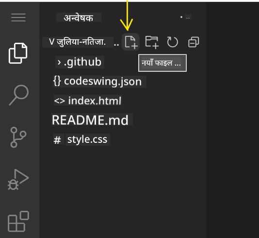
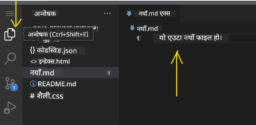
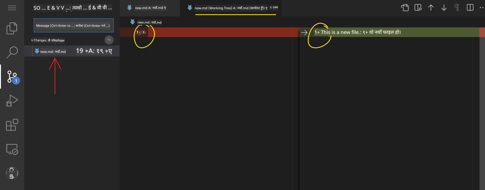
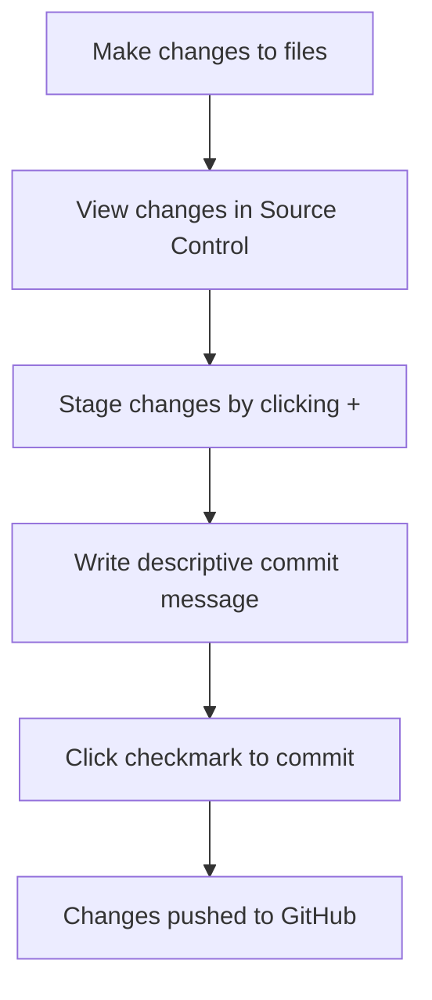

<!--
CO_OP_TRANSLATOR_METADATA:
{
  "original_hash": "cfd4a15974168ca426d50c67682ab9d4",
  "translation_date": "2025-10-22T16:42:28+00:00",
  "source_file": "8-code-editor/1-using-a-code-editor/README.md",
  "language_code": "ne"
}
-->
# कोड एडिटर प्रयोग गर्दै: VSCode.dev मा महारत हासिल गर्नुहोस्

*द म्याट्रिक्स* मा नियोले डिजिटल संसारमा पहुँच गर्न ठूलो कम्प्युटर टर्मिनलमा प्लग गर्नुपरेको सम्झनुहुन्छ? आजको वेब विकास उपकरणहरू यसको ठीक उल्टो कथा हो – जहाँसुकैबाट पहुँच गर्न सकिने अत्यन्त शक्तिशाली क्षमता। VSCode.dev एक ब्राउजर-आधारित कोड एडिटर हो जसले इन्टरनेट कनेक्शन भएको कुनै पनि उपकरणमा व्यावसायिक विकास उपकरणहरू ल्याउँछ।

जसरी छापाखानाले पुस्तकहरू सबैका लागि पहुँचयोग्य बनायो, केवल मठका लेखकहरूका लागि मात्र होइन, VSCode.dev ले कोडिङलाई लोकतान्त्रिक बनाउँछ। तपाईं पुस्तकालयको कम्प्युटर, विद्यालयको प्रयोगशाला, वा ब्राउजर पहुँच भएको कुनै पनि ठाउँबाट परियोजनाहरूमा काम गर्न सक्नुहुन्छ। कुनै स्थापना आवश्यक छैन, कुनै "मलाई मेरो विशेष सेटअप चाहिन्छ" भन्ने सीमाहरू छैनन्।

यस पाठको अन्त्यसम्ममा, तपाईंले VSCode.dev नेभिगेट गर्न, GitHub रिपोजिटरीहरू सिधै ब्राउजरमा खोल्न, र Git प्रयोग गरेर संस्करण नियन्त्रण गर्न सिक्नुहुनेछ – पेशेवर विकासकर्ताहरूले दैनिक रूपमा भर पर्ने सबै सीपहरू।

## तपाईंले के सिक्नुहुनेछ

हामी यो सँगै हिँडिसकेपछि, तपाईं सक्षम हुनुहुनेछ:

- VSCode.dev लाई आफ्नो दोस्रो घरजस्तै नेभिगेट गर्नुहोस् – आवश्यक सबै कुरा पत्ता लगाउनुहोस् बिना हराउने
- कुनै पनि GitHub रिपोजिटरी ब्राउजरमा खोल्नुहोस् र तुरुन्तै सम्पादन सुरु गर्नुहोस् (यो वास्तवमै जादुई छ!)
- Git प्रयोग गरेर आफ्नो परिवर्तनहरू ट्र्याक गर्नुहोस् र पेशेवरजस्तै आफ्नो प्रगति बचत गर्नुहोस्
- कोडिङलाई छिटो र रमाइलो बनाउने एक्सटेन्सनहरू प्रयोग गरेर आफ्नो एडिटरलाई सुपरचार्ज गर्नुहोस्
- परियोजना फाइलहरू आत्मविश्वासका साथ सिर्जना र व्यवस्थित गर्नुहोस्

## तपाईंलाई के चाहिन्छ

आवश्यकताहरू सरल छन्:

- एक नि:शुल्क [GitHub खाता](https://github.com) (हामी आवश्यक परेमा सिर्जना गर्न मार्गदर्शन गर्नेछौं)
- वेब ब्राउजरहरूको आधारभूत परिचय
- GitHub Basics पाठले उपयोगी पृष्ठभूमि प्रदान गर्दछ, यद्यपि यो आवश्यक छैन

> 💡 **GitHub मा नयाँ?** खाता सिर्जना नि:शुल्क छ र केही मिनेट लाग्छ। जस्तै पुस्तकालय कार्डले तपाईंलाई विश्वव्यापी पुस्तकहरूमा पहुँच दिन्छ, GitHub खाता इन्टरनेटभरि कोड रिपोजिटरीहरूमा ढोका खोल्छ।

## किन वेब-आधारित कोड एडिटरहरू महत्त्वपूर्ण छन्

इन्टरनेटभन्दा पहिले, विभिन्न विश्वविद्यालयका वैज्ञानिकहरूले अनुसन्धान सजिलै साझेदारी गर्न सक्दैनथे। त्यसपछि १९६० को दशकमा ARPANET आयो, जसले दूरीभरि कम्प्युटरहरू जोड्यो। वेब-आधारित कोड एडिटरहरूले यही सिद्धान्त अनुसरण गर्छन् – शक्तिशाली उपकरणहरू तपाईंको भौतिक स्थान वा उपकरणको परवाह नगरी पहुँचयोग्य बनाउँदै।

कोड एडिटर तपाईंको विकास कार्यक्षेत्रको रूपमा काम गर्दछ, जहाँ तपाईं कोड फाइलहरू लेख्नुहुन्छ, सम्पादन गर्नुहुन्छ, र व्यवस्थित गर्नुहुन्छ। साधारण टेक्स्ट एडिटरहरू भन्दा फरक, व्यावसायिक कोड एडिटरहरूले सिन्ट्याक्स हाइलाइटिङ, त्रुटि पत्ता लगाउने, र परियोजना व्यवस्थापन सुविधाहरू प्रदान गर्छन्।

VSCode.dev ले यी क्षमताहरू तपाईंको ब्राउजरमा ल्याउँछ:

**वेब-आधारित सम्पादनका फाइदाहरू:**

| सुविधा | विवरण | व्यावहारिक लाभ |
|---------|-------------|----------|
| **प्लेटफर्म स्वतन्त्रता** | कुनै पनि ब्राउजर भएको उपकरणमा चल्छ | विभिन्न कम्प्युटरहरूबाट सहजै काम गर्नुहोस् |
| **स्थापना आवश्यक छैन** | वेब URL मार्फत पहुँच | सफ्टवेयर स्थापना प्रतिबन्धहरू बाइपास गर्नुहोस् |
| **स्वचालित अपडेटहरू** | सधैं नवीनतम संस्करण चल्छ | म्यानुअल अपडेट बिना नयाँ सुविधाहरू पहुँच गर्नुहोस् |
| **रिपोजिटरी एकीकरण** | GitHub सँग सिधा कनेक्शन | स्थानीय फाइल व्यवस्थापन बिना कोड सम्पादन गर्नुहोस् |

**व्यावहारिक प्रभावहरू:**
- विभिन्न वातावरणहरूमा कामको निरन्तरता
- अपरेटिङ सिस्टमको परवाह नगरी स्थिर इन्टरफेस
- तत्काल सहयोग क्षमताहरू
- स्थानीय भण्डारण आवश्यकताहरू कम

## VSCode.dev अन्वेषण गर्दै

जसरी मेरी क्युरीको प्रयोगशालामा अपेक्षाकृत साधारण ठाउँमा परिष्कृत उपकरणहरू समावेश थिए, VSCode.dev ले ब्राउजर इन्टरफेसमा व्यावसायिक विकास उपकरणहरू समेट्छ। यो वेब एप्लिकेसनले डेस्कटप कोड एडिटरहरूको समान कोर कार्यक्षमता प्रदान गर्दछ।

[VSCode.dev](https://vscode.dev) मा आफ्नो ब्राउजरमा नेभिगेट गरेर सुरु गर्नुहोस्। इन्टरफेस डाउनलोडहरू वा प्रणाली स्थापनाहरू बिना लोड हुन्छ – क्लाउड कम्प्युटिङ सिद्धान्तहरूको प्रत्यक्ष अनुप्रयोग।

### आफ्नो GitHub खाता जडान गर्दै

जसरी अलेक्जेन्डर ग्राहम बेलको टेलिफोनले टाढाका स्थानहरू जोड्यो, तपाईंको GitHub खाता जडानले VSCode.dev लाई तपाईंको कोड रिपोजिटरीहरूसँग जोड्छ। GitHub सँग साइन इन गर्न संकेत गर्दा, यो जडान स्वीकार गर्न सिफारिस गरिन्छ।

**GitHub एकीकरणले प्रदान गर्दछ:**
- एडिटर भित्र तपाईंको रिपोजिटरीहरूमा सिधा पहुँच
- उपकरणहरूमा समक्रमित सेटिङहरू र एक्सटेन्सनहरू
- GitHub मा बचत कार्यप्रवाहलाई सरल बनाउँछ
- व्यक्तिगत विकास वातावरण

### आफ्नो नयाँ कार्यक्षेत्र चिन्नुहोस्

सबै कुरा लोड भएपछि, तपाईंले एक सुन्दर रूपमा सफा कार्यक्षेत्र देख्नुहुनेछ जुन तपाईंलाई महत्त्वपूर्ण कुरामा केन्द्रित राख्न डिजाइन गरिएको छ – तपाईंको कोड!

**यहाँ तपाईंको छिमेकको भ्रमण छ:**
- **एक्टिभिटी बार** (बायाँपट्टि पट्टी): तपाईंको मुख्य नेभिगेसन Explorer 📁, Search 🔍, Source Control 🌿, Extensions 🧩, र Settings ⚙️
- **साइडबार** (यसको छेउमा प्यानल): तपाईंले चयन गर्नुभएको कुराको आधारमा सान्दर्भिक जानकारी देखाउन परिवर्तन हुन्छ
- **एडिटर क्षेत्र** (बीचको ठूलो ठाउँ): यहाँ जादू हुन्छ – तपाईंको मुख्य कोडिङ क्षेत्र

**एक पल्ट अन्वेषण गर्नुहोस्:**
- ती एक्टिभिटी बार आइकनहरूमा क्लिक गर्नुहोस् र प्रत्येकले के गर्छ हेर्नुहोस्
- साइडबारले विभिन्न जानकारी देखाउन कसरी अपडेट गर्छ ध्यान दिनुहोस् – धेरै राम्रो, हैन?
- Explorer दृश्य (📁) सम्भवतः तपाईंले धेरै समय बिताउने ठाउँ हो, त्यसैले यससँग सहज हुनुहोस्

## GitHub रिपोजिटरीहरू खोल्दै

इन्टरनेटभन्दा पहिले, अनुसन्धानकर्ताहरूले कागजातहरू पहुँच गर्न पुस्तकालयहरूमा शारीरिक रूपमा यात्रा गर्नुपर्थ्यो। GitHub रिपोजिटरीहरू समान काम गर्छन् – टाढा भण्डारण गरिएको कोडको संग्रह। VSCode.dev ले रिपोजिटरीहरूलाई स्थानीय मेसिनमा डाउनलोड गर्ने परम्परागत चरणलाई सम्पादन गर्नु अघि हटाउँछ।

यो क्षमता कुनै पनि सार्वजनिक रिपोजिटरीलाई हेर्न, सम्पादन गर्न, वा योगदान गर्न तत्काल पहुँच सक्षम बनाउँछ। यहाँ रिपोजिटरीहरू खोल्नका लागि दुई विधिहरू छन्:

### विधि १: पोइन्ट-एन्ड-क्लिक तरिका

यो VSCode.dev मा नयाँ सुरु गर्दा र विशिष्ट रिपोजिटरी खोल्न चाहनुहुन्छ भने उत्तम हो। यो सरल र शुरुआती मैत्री छ:

**यसलाई कसरी गर्ने:**

1. [VSCode.dev](https://vscode.dev) मा जानुहोस् यदि तपाईं पहिले नै त्यहाँ हुनुहुन्न भने
2. स्वागत स्क्रीनमा "Open Remote Repository" बटन खोज्नुहोस् र क्लिक गर्नुहोस्

   

3. कुनै पनि GitHub रिपोजिटरी URL पेस्ट गर्नुहोस् (यो प्रयास गर्नुहोस्: `https://github.com/microsoft/Web-Dev-For-Beginners`)
4. Enter थिच्नुहोस् र जादू हेर्नुहोस्!

**प्रो टिप - कमाण्ड प्यालेट सर्टकट:**

कोडिङ जादूगर जस्तो महसुस गर्न चाहनुहुन्छ? यो किबोर्ड सर्टकट प्रयास गर्नुहोस्: Ctrl+Shift+P (वा Mac मा Cmd+Shift+P) कमाण्ड प्यालेट खोल्न:

**कमाण्ड प्यालेट सबै गर्न सक्ने कुराको लागि खोज इन्जिन जस्तै हो:**
- "open remote" टाइप गर्नुहोस् र यसले तपाईंका लागि रिपोजिटरी ओपनर फेला पार्नेछ
- यसले तपाईंले हालै खोल्नुभएको रिपोजिटरीहरू सम्झन्छ (धेरै उपयोगी!)
- एकपटक तपाईं यसमा अभ्यस्त भएपछि, तपाईंलाई लाग्छ कि तपाईं प्रकाशको गतिमा कोडिङ गर्दै हुनुहुन्छ
- यो मूलतः VSCode.dev को "Hey Siri, तर कोडिङका लागि" संस्करण हो

### विधि २: URL संशोधन प्रविधि

जसरी HTTP र HTTPS ले विभिन्न प्रोटोकलहरू प्रयोग गर्छन् जबकि समान डोमेन संरचना कायम राख्छन्, VSCode.dev ले GitHub को ठेगाना प्रणालीलाई प्रतिबिम्बित गर्ने URL ढाँचा प्रयोग गर्दछ। कुनै पनि GitHub रिपोजिटरी URL लाई VSCode.dev मा सिधै खोल्न संशोधित गर्न सकिन्छ।

**URL रूपान्तरण ढाँचा:**

| रिपोजिटरी प्रकार | GitHub URL | VSCode.dev URL |
|----------------|---------------------|----------------|
| **सार्वजनिक रिपोजिटरी** | `github.com/microsoft/Web-Dev-For-Beginners` | `vscode.dev/github/microsoft/Web-Dev-For-Beginners` |
| **व्यक्तिगत परियोजना** | `github.com/your-username/my-project` | `vscode.dev/github/your-username/my-project` |
| **कुनै पनि पहुँचयोग्य रिपो** | `github.com/their-username/awesome-repo` | `vscode.dev/github/their-username/awesome-repo` |

**कार्यान्वयन:**
- `github.com` लाई `vscode.dev/github` सँग बदल्नुहोस्
- अन्य सबै URL घटकहरू अपरिवर्तित राख्नुहोस्
- कुनै पनि सार्वजनिक रूपमा पहुँचयोग्य रिपोजिटरीसँग काम गर्दछ
- तत्काल सम्पादन पहुँच प्रदान गर्दछ

> 💡 **जीवन परिवर्तन गर्ने टिप**: तपाईंको मनपर्ने रिपोजिटरीहरूको VSCode.dev संस्करणहरू बुकमार्क गर्नुहोस्। मेरोसँग "Edit My Portfolio" र "Fix Documentation" जस्ता बुकमार्कहरू छन् जसले मलाई सिधै सम्पादन मोडमा लैजान्छ!

**कुन विधि प्रयोग गर्ने?**
- **इन्टरफेस तरिका**: अन्वेषण गर्दा वा ठ्याक्कै रिपोजिटरी नामहरू सम्झन नसक्दा उत्कृष्ट
- **URL ट्रिक**: तपाईंलाई ठ्याक्कै कहाँ जानु छ थाहा छ भने प्रकाशको गतिमा पहुँचका लागि उत्तम

## फाइलहरू र परियोजनाहरूको साथ काम गर्दै

अब तपाईंले रिपोजिटरी खोल्नुभयो, सुरु गरौं! VSCode.dev ले तपाईंलाई कोड फाइलहरू सिर्जना, सम्पादन, र व्यवस्थित गर्न आवश्यक सबै कुरा दिन्छ। यसलाई तपाईंको डिजिटल कार्यशाला जस्तै सोच्नुहोस् – प्रत्येक उपकरण तपाईंलाई आवश्यक पर्ने ठाउँमा छ।

आउनुहोस्, दैनिक कार्यहरूमा डुबौं जसले तपाईंको कोडिङ कार्यप्रवाहको अधिकांश भाग बनाउनेछ।

### नयाँ फाइलहरू सिर्जना गर्दै

जसरी एक वास्तुकारको कार्यालयमा ब्लूप्रिन्टहरू व्यवस्थित गरिन्छ, VSCode.dev मा फाइल सिर्जना संरचित दृष्टिकोण अनुसरण गर्दछ। प्रणालीले सबै मानक वेब विकास फाइल प्रकारहरूलाई समर्थन गर्दछ।

**फाइल सिर्जना प्रक्रिया:**

1. Explorer साइडबारमा लक्षित फोल्डरमा नेभिगेट गर्नुहोस्
2. फोल्डर नाममा होभर गर्नुहोस् "New File" आइकन (📄+) प्रकट गर्न
3. उपयुक्त एक्सटेन्सन सहित फाइल नाम प्रविष्ट गर्नुहोस् (`style.css`, `script.js`, `index.html`)
4. फाइल सिर्जना गर्न Enter थिच्नुहोस्

**नामकरण परम्पराहरू:**
- फाइल उद्देश्य संकेत गर्ने वर्णनात्मक नामहरू प्रयोग गर्नुहोस्
- उचित सिन्ट्याक्स हाइलाइटिङको लागि फाइल एक्सटेन्सनहरू समावेश गर्नुहोस्
- परियोजनाहरूमा लगातार नामकरण ढाँचाहरू अनुसरण गर्नुहोस्
- स्पेसको सट्टा लोअरकेस अक्षरहरू र हाइफनहरू प्रयोग गर्नुहोस्

### फाइलहरू सम्पादन र बचत गर्दै

यहाँ वास्तविक रमाइलो सुरु हुन्छ! VSCode.dev को एडिटर उपयोगी सुविधाहरूले भरिएको छ जसले कोडिङलाई सहज र सहज बनाउँछ। यो कोडका लागि वास्तवमै स्मार्ट लेखन सहायक जस्तै हो।

**तपाईंको सम्पादन कार्यप्रवाह:**

1. Explorer मा कुनै पनि फाइलमा क्लिक गर्नुहोस् यसलाई मुख्य क्षेत्रमा खोल्न
2. टाइप गर्न सुरु गर्नुहोस् र VSCode.dev ले तपाईंलाई रंग, सुझाव, र त्रुटि स्पटिङको साथ मद्दत गरेको हेर्नुहोस्
3. Ctrl+S (Windows/Linux) वा Cmd+S (Mac) प्रयोग गरेर आफ्नो काम बचत गर्नुहोस् – यद्यपि यसले स्वचालित रूपमा पनि बचत गर्दछ!

**कोडिङ गर्दा हुने चिसो कुराहरू:**
- तपाईंको कोड सुन्दर रूपमा रंग-कोड गरिएको छ त्यसैले यो पढ्न सजिलो छ
- VSCode.dev ले तपाईंलाई टाइप गर्दा पूर्णता सुझाव दिन्छ (जस्तै अटोकररेक्ट, तर धेरै स्मार्ट)
- यसले तपाईंले बचत गर्नु अघि टाइपो र त्रुटिहरू समात्छ
- तपाईं ब्राउजरमा जस्तै ट्याबहरूमा धेरै फाइलहरू खोल्न सक्नुहुन्छ
- सबै कुरा पृष्ठभूमिमा स्वचालित रूपमा बचत हुन्छ

> ⚠️ **छिटो टिप**: यद्यपि अटो-सेभले तपाईंको पछाडि छ, Ctrl+S वा Cmd+S थिच्नु अझै राम्रो बानी हो। यसले तुरुन्तै सबै कुरा बचत गर्दछ र त्रुटि जाँच जस्ता केही अतिरिक्त उपयोगी सुविधाहरू ट्रिगर गर्दछ।

### Git को साथ संस्करण नियन्त्रण

जसरी पुरातत्वविद्हरू उत्खनन तहहरूको विस्तृत रेकर्डहरू बनाउँछन्, Git ले समयसँगै तपाईंको कोडमा परिवर्तनहरू ट्र्याक गर्दछ। यो प्रणालीले परियोजना इतिहासलाई सुरक्षित गर्दछ र आवश्यक परेमा तपाईंलाई अघिल्लो संस्करणहरूमा फर्कन सक्षम बनाउँछ। VSCode.dev मा एकीकृत Git कार्यक्षमता समावेश छ।

**स्रोत नियन्त्रण इन्टरफेस:**

1. एक्टिभिटी बारमा 🌿 आइकन मार्फत स्रोत नियन्त्रण प्यानल पहुँच गर्नुहोस्
2. परिवर्तन गरिएको फाइलहरू "Changes" सेक्सनमा देखा पर्छन्
3. रंग कोडिङले परिवर्तन प्रकारहरू संकेत गर्दछ: थपहरूको लागि हरियो, हटाउनेहरूको लागि रातो

**तपाईंको काम बचत गर्दै (कमिट कार्यप्रवाह):**

**यहाँ तपाईंको चरण-दर-चरण प्रक्रिया छ:**
- तपाईं बचत गर्न चाहनुभएको फाइलहरूको छेउमा "+" आइकनमा क्लिक गर्नुहोस् (यसले तिनीहरूलाई "स्टेज" गर्दछ)
- तपाईंले स्टेज गरिएका सबै परिवर्तनहरूमा खुसी हुनुहुन्छ भनेर डबल-जाँच गर्नुहोस्
- तपाईंले के गर्नुभयो भनेर छोटो नोट लेख्नुहोस् (यो तपाईंको "कमिट सन्देश" हो)
- सबै कुरा GitHub मा बचत गर्न चेकमार्क बटनमा क्लिक गर्नुहोस्
- यदि तपाईंले कुनै कुरामा आफ्नो विचार परिवर्तन गर्नुभयो भने, Undo आइकनले तपाईंलाई परिवर्तनहरू खारेज गर्न दिन्छ

**राम्रो कमिट सन्देश लेख्दै (यो सोच्नुभन्दा सजिलो छ!):**
- केवल तपाईंले के गर्नुभयो वर्णन गर्नुहोस्, जस्तै "Add contact form" वा "Fix broken navigation"
- छोटो र मीठो राख्नुहोस् – निबन्ध होइन, ट्वीट लम्बाइ सोच्नुहोस्
- "Add", "Fix", "Update", वा "Remove" जस्ता क्रिया शब्दहरूबाट सुरु गर्नुहोस्
- **राम्रो उदाहरणहरू**: "Add responsive navigation menu", "Fix mobile layout issues", "Update colors for better accessibility"

> 💡 **छिटो नेभिगेसन टिप**: माथि बायाँपट्टि ह्याम्बर्गर मेनु (☰) प्रयोग गरेर आफ्नो GitHub रिपोजिटरीमा फर्कनुहोस् र आफ्नो कमिट गरिएको परिवर्तनहरू अनलाइन हेर्नुहोस्। यो तपाईंको सम्पादन वातावरण र GitHub मा तपाईंको परियोजनाको घर बीचको पोर्टल जस्तै हो!

## एक्सटेन्सनहरूको साथ कार्यक्षमता बढाउँदै

जसरी एक शिल्पकारको कार्यशालामा विभिन्न कार्यहरूको लागि विशेष उपकरणहरू समावेश छन्, VSCode.dev लाई एक्सटेन्सनहरूसँग अनुकूलित गर्न सकिन्छ जसले विशिष्ट क्षमताहरू थप्छ। यी समुदाय-विकसित प्लगइनहरूले कोड फर्म्याटिङ, लाइभ प्रिभ्यू, र उन्नत Git एकीकरण जस्ता सामान्य विकास आवश्यकताहरूलाई सम्बोधन गर्छन्।

- प्रत्येक एक्सटेन्सनले रेटिङ, डाउनलोड संख्या, र वास्तविक प्रयोगकर्ताको समीक्षा देखाउँछ
- तपाईंले प्रत्येक एक्सटेन्सनले के गर्छ भन्ने स्पष्ट विवरण र स्क्रिनशट्स पाउनुहुन्छ
- सबै कुरा स्पष्ट रूपमा अनुकूलता जानकारीसहित चिन्हित गरिएको छ
- समान एक्सटेन्सनहरू सुझाव दिइन्छ ताकि तपाईं विकल्पहरू तुलना गर्न सक्नुहुन्छ

### एक्सटेन्सनहरू स्थापना गर्नुहोस् (यो धेरै सजिलो छ!)

तपाईंको एडिटरमा नयाँ शक्ति थप्न केवल एउटा बटन क्लिक गर्नु जत्तिकै सजिलो छ। एक्सटेन्सनहरू सेकेन्डमै स्थापना हुन्छन् र तुरुन्तै काम गर्न थाल्छन् – कुनै रिस्टार्ट आवश्यक छैन, कुनै पर्खाइ छैन।

**तपाईंले गर्नुपर्ने सबै कुरा यहाँ छ:**

1. तपाईंलाई चाहिएको कुरा खोज्नुहोस् (जस्तै "live server" वा "prettier" खोज्ने प्रयास गर्नुहोस्)
2. राम्रो देखिने एकमा क्लिक गरेर थप विवरण हेर्नुहोस्
3. यसले के गर्छ भनेर पढ्नुहोस् र रेटिङ जाँच गर्नुहोस्
4. निलो "Install" बटनमा क्लिक गर्नुहोस् र तपाईं सक्नुभयो!

**पर्दा पछाडि के हुन्छ:**
- एक्सटेन्सन स्वतः डाउनलोड हुन्छ र सेटअप हुन्छ
- नयाँ सुविधाहरू तुरुन्तै तपाईंको इन्टरफेसमा देखा पर्छन्
- सबै कुरा तुरुन्तै काम गर्न थाल्छ (गम्भीर रूपमा, यो यति छिटो छ!)
- यदि तपाईं साइन इन हुनुहुन्छ भने, एक्सटेन्सन तपाईंको सबै उपकरणहरूमा सिंक हुन्छ

**केही एक्सटेन्सनहरू म सिफारिस गर्छु:**
- **Live Server**: तपाईंको वेबसाइट कोड गर्दा वास्तविक समयमा अपडेट हेर्नुहोस् (यो जादुई छ!)
- **Prettier**: तपाईंको कोडलाई स्वचालित रूपमा सफा र व्यावसायिक देखिने बनाउँछ
- **Auto Rename Tag**: एउटा HTML ट्याग परिवर्तन गर्दा यसको जोडी पनि अपडेट हुन्छ
- **Bracket Pair Colorizer**: तपाईंको ब्र्याकेटहरू रंग-कोड गर्दछ ताकि तपाईं कहिल्यै हराउनु नपरोस्
- **GitLens**: तपाईंको Git सुविधाहरूलाई धेरै उपयोगी जानकारीसहित सुपरचार्ज गर्दछ

### तपाईंको एक्सटेन्सनहरू अनुकूलन गर्दै

धेरै एक्सटेन्सनहरू सेटिङ्ससहित आउँछन् जसलाई तपाईं आफ्नो आवश्यकता अनुसार समायोजन गर्न सक्नुहुन्छ। यसलाई कारको सीट र ऐनाहरू समायोजन गर्ने जस्तै सोच्नुहोस् – सबैको आफ्नै प्राथमिकता हुन्छ!

**एक्सटेन्सन सेटिङ्स समायोजन गर्दै:**

1. एक्सटेन्सन प्यानलमा तपाईंको स्थापना गरिएको एक्सटेन्सन खोज्नुहोस्
2. यसको नामको छेउमा रहेको सानो गियर आइकन (⚙️) खोज्नुहोस् र क्लिक गर्नुहोस्
3. ड्रपडाउनबाट "Extension Settings" चयन गर्नुहोस्
4. तपाईंको कार्यप्रवाहको लागि सही लाग्ने गरी चीजहरू समायोजन गर्नुहोस्

**तपाईंले समायोजन गर्न चाहन सक्ने सामान्य चीजहरू:**
- तपाईंको कोड कसरी फर्म्याट हुन्छ (tabs vs spaces, लाइन लम्बाइ, आदि)
- कुन किबोर्ड सर्टकटहरूले विभिन्न कार्यहरू ट्रिगर गर्छ
- एक्सटेन्सनले कुन फाइल प्रकारहरूसँग काम गर्नुपर्छ
- विशिष्ट सुविधाहरू अन वा अफ गरेर चीजहरू सफा राख्नुहोस्

### तपाईंको एक्सटेन्सनहरू व्यवस्थित राख्दै

जति धेरै चाखलाग्दा एक्सटेन्सनहरू पत्ता लगाउनुहुन्छ, तपाईं आफ्नो संग्रहलाई सफा र सुचारु राख्न चाहनुहुन्छ। VSCode.dev ले यो व्यवस्थापन गर्न धेरै सजिलो बनाउँछ।

**तपाईंको एक्सटेन्सन व्यवस्थापन विकल्पहरू:**

| तपाईं के गर्न सक्नुहुन्छ | यो कहिले उपयोगी हुन्छ | प्रो टिप |
|--------|---------|----------|
| **Disable** | एक्सटेन्सनले समस्या उत्पन्न गरिरहेको छ कि छैन परीक्षण गर्दै | यदि तपाईंलाई फिर्ता चाहिन्छ भने अनइन्स्टल गर्नुभन्दा राम्रो |
| **Uninstall** | तपाईंलाई आवश्यक नभएको एक्सटेन्सनहरू पूर्ण रूपमा हटाउँदै | तपाईंको वातावरणलाई सफा र छिटो राख्छ |
| **Update** | नवीनतम सुविधाहरू र बग फिक्सहरू प्राप्त गर्दै | सामान्यतया स्वतः हुन्छ, तर जाँच गर्न लायक छ |

**म कसरी एक्सटेन्सनहरू व्यवस्थापन गर्न मन पराउँछु:**
- प्रत्येक केही महिनामा, मैले स्थापना गरेको चीजहरूको समीक्षा गर्छु र प्रयोग नगरेको चीजहरू हटाउँछु
- मैले एक्सटेन्सनहरू अपडेट राख्छु ताकि नवीनतम सुधारहरू र सुरक्षा फिक्सहरू प्राप्त गर्न सकूँ
- यदि केही सुस्त देखिन्छ भने, मैले अस्थायी रूपमा एक्सटेन्सनहरू डिसेबल गर्छु कि ती मध्ये कुनै एक कारण हो कि भनेर हेर्न
- जब एक्सटेन्सनहरूले प्रमुख अपडेटहरू प्राप्त गर्छन्, म अपडेट नोटहरू पढ्छु – कहिलेकाहीँ त्यहाँ चाखलाग्दा नयाँ सुविधाहरू हुन्छन्!

> ⚠️ **प्रदर्शन टिप**: एक्सटेन्सनहरू अद्भुत छन्, तर धेरै धेरै हुँदा चीजहरू सुस्त हुन सक्छ। ती एक्सटेन्सनहरूमा ध्यान केन्द्रित गर्नुहोस् जसले वास्तवमै तपाईंको जीवनलाई सजिलो बनाउँछ र कहिल्यै प्रयोग नगर्ने एक्सटेन्सनहरू अनइन्स्टल गर्न नडराउनुहोस्।

## GitHub Copilot Agent Challenge 🚀

जस्तै नासाले अन्तरिक्ष मिसनहरूको लागि संरचित दृष्टिकोण प्रयोग गर्छ, यो चुनौतीले VSCode.dev सीपहरूको पूर्ण कार्यप्रवाह परिदृश्यमा प्रणालीगत प्रयोग समावेश गर्दछ।

**उद्देश्य:** VSCode.dev को दक्षता प्रदर्शन गर्दै व्यापक वेब विकास कार्यप्रवाह स्थापना गर्नुहोस्।

**प्रोजेक्ट आवश्यकताहरू:** Agent मोड सहायता प्रयोग गर्दै, यी कार्यहरू पूरा गर्नुहोस्:
1. एउटा विद्यमान रिपोजिटरी फोर्क गर्नुहोस् वा नयाँ सिर्जना गर्नुहोस्
2. HTML, CSS, र JavaScript फाइलहरूसहित कार्यात्मक प्रोजेक्ट संरचना स्थापना गर्नुहोस्
3. तीन विकास-सुधार गर्ने एक्सटेन्सनहरू स्थापना र कन्फिगर गर्नुहोस्
4. वर्णनात्मक कमिट सन्देशहरूसहित संस्करण नियन्त्रण अभ्यास गर्नुहोस्
5. फिचर ब्रान्च सिर्जना र संशोधनको साथ प्रयोग गर्नुहोस्
6. README.md फाइलमा प्रक्रिया र सिकाइहरू दस्तावेज गर्नुहोस्

यो अभ्यासले सबै VSCode.dev अवधारणाहरूलाई व्यावहारिक कार्यप्रवाहमा समेकित गर्दछ जुन भविष्यका विकास परियोजनाहरूमा लागू गर्न सकिन्छ।

[agent mode](https://code.visualstudio.com/blogs/2025/02/24/introducing-copilot-agent-mode) को बारेमा थप जान्नुहोस्।

## असाइनमेन्ट

यी सीपहरूलाई वास्तविक परीक्षणमा लैजाने समय! मैले एउटा व्यावहारिक प्रोजेक्ट तयार गरेको छु जसले तपाईंलाई हामीले कभर गरेका सबै कुरा अभ्यास गर्न दिन्छ: [VSCode.dev प्रयोग गरेर रिजुमे वेबसाइट बनाउनुहोस्](./assignment.md)

यो असाइनमेन्टले तपाईंलाई ब्राउजरमा पूर्ण रूपमा व्यावसायिक रिजुमे वेबसाइट निर्माण गर्न मार्गदर्शन गर्दछ। तपाईंले हामीले अन्वेषण गरेका सबै VSCode.dev सुविधाहरू प्रयोग गर्नुहुनेछ, र अन्त्यमा, तपाईंसँग राम्रो देखिने वेबसाइट र तपाईंको नयाँ कार्यप्रवाहमा ठोस आत्मविश्वास हुनेछ।

## अन्वेषण गर्दै र तपाईंको सीपहरू बढाउँदै

तपाईंसँग अब एक ठोस आधार छ, तर अझ धेरै चाखलाग्दा चीजहरू पत्ता लगाउन बाँकी छ! यहाँ केही स्रोतहरू र विचारहरू छन् जसले तपाईंको VSCode.dev सीपहरू अर्को स्तरमा लैजान मद्दत गर्नेछ:

**बुकमार्क गर्न लायक आधिकारिक डकहरू:**
- [VSCode Web Documentation](https://code.visualstudio.com/docs/editor/vscode-web?WT.mc_id=academic-0000-alfredodeza) – ब्राउजर-आधारित सम्पादनको पूर्ण मार्गदर्शिका
- [GitHub Codespaces](https://docs.github.com/en/codespaces) – जब तपाईं क्लाउडमा अझ धेरै शक्ति चाहनुहुन्छ

**अर्को प्रयोग गर्न चाखलाग्दा सुविधाहरू:**
- **Keyboard Shortcuts**: ती किबोर्ड कम्बोहरू सिक्नुहोस् जसले तपाईंलाई कोडिङ निन्जा जस्तो महसुस गराउँछ
- **Workspace Settings**: विभिन्न प्रकारका प्रोजेक्टहरूको लागि विभिन्न वातावरण सेटअप गर्नुहोस्
- **Multi-root Workspaces**: एकै समयमा धेरै रिपोजिटरीहरूमा काम गर्नुहोस् (धेरै उपयोगी!)
- **Terminal Integration**: तपाईंको ब्राउजरमै कमाण्ड-लाइन उपकरणहरू पहुँच गर्नुहोस्

**अभ्यासका लागि विचारहरू:**
- केही ओपन-सोर्स प्रोजेक्टहरूमा जम्प गर्नुहोस् र VSCode.dev प्रयोग गरेर योगदान गर्नुहोस् – यो फिर्ता दिने राम्रो तरिका हो!
- विभिन्न एक्सटेन्सनहरू प्रयास गर्नुहोस् ताकि तपाईंको लागि उपयुक्त सेटअप पत्ता लगाउन सक्नुहोस्
- तपाईंले प्रायः निर्माण गर्ने साइटहरूको प्रकारका लागि प्रोजेक्ट टेम्प्लेटहरू सिर्जना गर्नुहोस्
- ब्रान्चिङ र मर्जिङ जस्ता Git कार्यप्रवाह अभ्यास गर्नुहोस् – यी सीपहरू टोली प्रोजेक्टहरूमा सुन हुन्

---

**तपाईंले ब्राउजर-आधारित विकासमा महारत हासिल गर्नुभयो!** 🎉 जस्तै पोर्टेबल उपकरणहरूको आविष्कारले वैज्ञानिकहरूलाई टाढाका स्थानहरूमा अनुसन्धान गर्न सक्षम बनायो, VSCode.dev ले तपाईंलाई कुनै पनि इन्टरनेट-संलग्न उपकरणबाट व्यावसायिक कोडिङ गर्न सक्षम बनाउँछ।

यी सीपहरूले वर्तमान उद्योग अभ्यासहरू प्रतिबिम्बित गर्छन् – धेरै व्यावसायिक विकासकर्ताहरूले क्लाउड-आधारित विकास वातावरणहरू यसको लचिलोपन र पहुँचयोग्यताका लागि प्रयोग गर्छन्। तपाईंले व्यक्तिगत प्रोजेक्टहरूदेखि ठूलो टोली सहयोगसम्म स्केल हुने कार्यप्रवाह सिक्नुभएको छ।

यी प्रविधिहरू तपाईंको अर्को विकास प्रोजेक्टमा लागू गर्नुहोस्! 🚀

---

**अस्वीकरण**:  
यो दस्तावेज़ AI अनुवाद सेवा [Co-op Translator](https://github.com/Azure/co-op-translator) प्रयोग गरेर अनुवाद गरिएको छ। हामी शुद्धताको लागि प्रयास गर्छौं, तर कृपया ध्यान दिनुहोस् कि स्वचालित अनुवादमा त्रुटिहरू वा अशुद्धताहरू हुन सक्छ। यसको मूल भाषा मा रहेको दस्तावेज़लाई आधिकारिक स्रोत मानिनुपर्छ। महत्वपूर्ण जानकारीको लागि, व्यावसायिक मानव अनुवाद सिफारिस गरिन्छ। यस अनुवादको प्रयोगबाट उत्पन्न हुने कुनै पनि गलतफहमी वा गलत व्याख्याको लागि हामी जिम्मेवार हुने छैनौं।