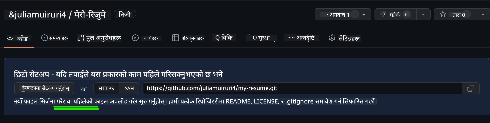
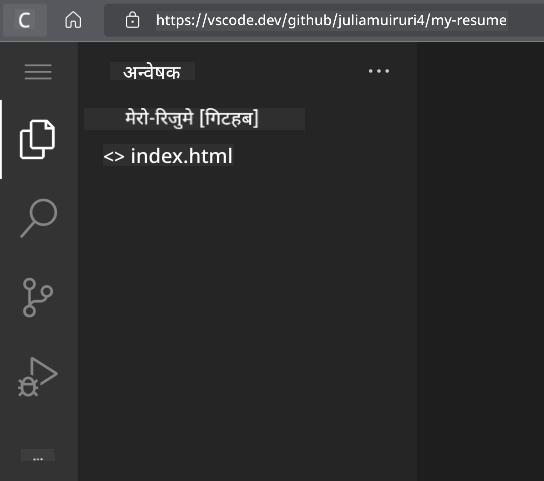
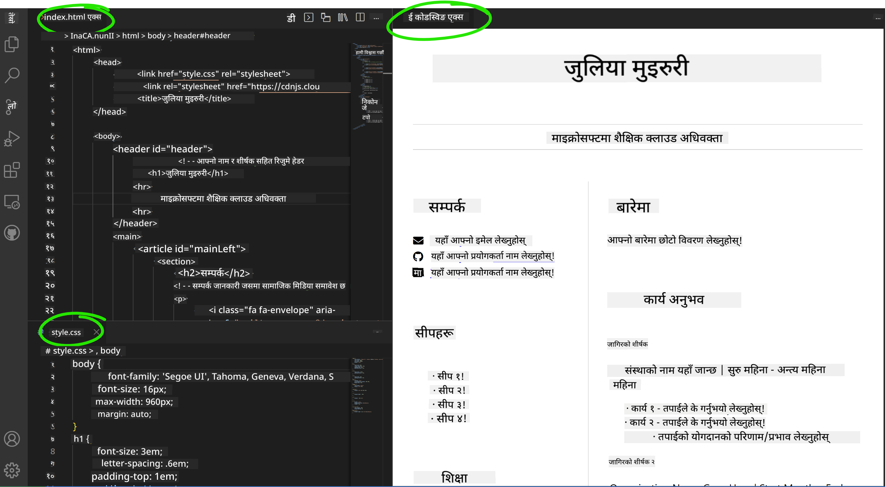

<!--
CO_OP_TRANSLATOR_METADATA:
{
  "original_hash": "effe56ba51c38d7bdfad1ea38288666b",
  "translation_date": "2025-10-22T16:43:17+00:00",
  "source_file": "8-code-editor/1-using-a-code-editor/assignment.md",
  "language_code": "ne"
}
-->
# VSCode.dev प्रयोग गरेर रिजुम वेबसाइट बनाउनुहोस्

आफ्नो करियर सम्भावनाहरूलाई सुधार गर्नुहोस् र आफ्नो सीप र अनुभवलाई अन्तरक्रियात्मक, आधुनिक स्वरूपमा प्रदर्शन गर्ने व्यावसायिक रिजुम वेबसाइट निर्माण गर्नुहोस्। परम्परागत PDF पठाउने सट्टा, कल्पना गर्नुहोस् कि तपाईंले भर्तीकर्ताहरूलाई एक आकर्षक, उत्तरदायी वेबसाइट प्रदान गर्न सक्नुहुन्छ जसले तपाईंको योग्यता र वेब विकास क्षमताहरू दुवै देखाउँछ।

यो व्यावहारिक असाइनमेन्टले तपाईंको VSCode.dev सीपलाई अभ्यासमा राख्छ र तपाईंको करियरका लागि वास्तवमै उपयोगी केही सिर्जना गर्न मद्दत गर्दछ। तपाईंले वेब विकासको सम्पूर्ण कार्यप्रवाह अनुभव गर्नुहुनेछ – रिपोजिटरी सिर्जना देखि डिप्लोयमेन्टसम्म – सबै ब्राउजरभित्रै।

यो परियोजना पूरा गरेर, तपाईंले एक व्यावसायिक अनलाइन उपस्थिति बनाउनुहुनेछ जसलाई सम्भावित नियोक्ताहरूलाई सजिलैसँग साझा गर्न सकिन्छ, तपाईंको सीप बढ्दै जाँदा अपडेट गर्न सकिन्छ, र तपाईंको व्यक्तिगत ब्रान्डसँग मिलाउन अनुकूलित गर्न सकिन्छ। यो व्यावहारिक परियोजना हो जसले वास्तविक संसारको वेब विकास सीपलाई प्रदर्शन गर्दछ।

## सिकाइ उद्देश्यहरू

यो असाइनमेन्ट पूरा गरेपछि, तपाईं सक्षम हुनुहुनेछ:

- **सिर्जना गर्नुहोस्** र VSCode.dev प्रयोग गरेर पूर्ण वेब विकास परियोजना व्यवस्थापन गर्नुहोस्
- **संरचना गर्नुहोस्** व्यावसायिक वेबसाइटलाई सेम्यान्टिक HTML तत्वहरूको प्रयोग गरेर
- **स्टाइल गर्नुहोस्** आधुनिक CSS प्रविधिहरूको साथ उत्तरदायी लेआउटहरू
- **कार्यान्वयन गर्नुहोस्** आधारभूत वेब प्रविधिहरू प्रयोग गरेर अन्तरक्रियात्मक सुविधाहरू
- **डिप्लोय गर्नुहोस्** एक लाइभ वेबसाइट जसलाई साझा गर्न सकिने URL मार्फत पहुँच गर्न सकिन्छ
- **प्रदर्शन गर्नुहोस्** विकास प्रक्रियामा संस्करण नियन्त्रणको उत्कृष्ट अभ्यासहरू

## पूर्व आवश्यकताहरू

यो असाइनमेन्ट सुरु गर्नु अघि, सुनिश्चित गर्नुहोस् कि तपाईंले:

- GitHub खाता बनाइसक्नुभएको छ ([github.com](https://github.com/) मा खाता सिर्जना गर्नुहोस् यदि आवश्यक छ भने)
- VSCode.dev पाठ पूरा गर्नुभएको छ जसले इन्टरफेस नेभिगेसन र आधारभूत अपरेसनहरू समेट्छ
- HTML संरचना र CSS स्टाइलिङ अवधारणाको आधारभूत समझ छ

## परियोजना सेटअप र रिपोजिटरी सिर्जना

आफ्नो परियोजना आधार तयार पार्न सुरु गरौं। यो प्रक्रिया वास्तविक संसारको विकास कार्यप्रवाहलाई प्रतिबिम्बित गर्दछ जहाँ परियोजनाहरू उचित रिपोजिटरी आरम्भ र संरचना योजना संग सुरु हुन्छन्।

### चरण १: आफ्नो GitHub रिपोजिटरी सिर्जना गर्नुहोस्

समर्पित रिपोजिटरी सेटअपले सुनिश्चित गर्दछ कि तपाईंको परियोजना सुरु देखि नै व्यवस्थित र संस्करण-नियन्त्रित छ।

1. [GitHub.com](https://github.com) मा जानुहोस् र आफ्नो खातामा साइन इन गर्नुहोस्
2. हरियो "New" बटन वा माथि-दायाँ कुनामा "+" आइकनमा क्लिक गर्नुहोस्
3. आफ्नो रिपोजिटरीलाई `my-resume` नाम दिनुहोस् (वा `john-smith-resume` जस्तो व्यक्तिगत नाम चयन गर्नुहोस्)
4. छोटो विवरण थप्नुहोस्: "HTML र CSS प्रयोग गरेर बनाइएको व्यावसायिक रिजुम वेबसाइट"
5. "Public" चयन गर्नुहोस् ताकि तपाईंको रिजुम सम्भावित नियोक्ताहरूलाई पहुँचयोग्य होस्
6. "Add a README file" चेक गर्नुहोस् ताकि आरम्भिक परियोजना विवरण सिर्जना होस्
7. "Create repository" क्लिक गरेर सेटअप पूरा गर्नुहोस्

> 💡 **रिपोजिटरी नामकरण सुझाव**: परियोजनाको उद्देश्य स्पष्ट रूपमा संकेत गर्ने वर्णनात्मक, व्यावसायिक नामहरू प्रयोग गर्नुहोस्। यसले नियोक्ताहरूलाई साझा गर्दा वा पोर्टफोलियो समीक्षा गर्दा मद्दत गर्दछ।

### चरण २: परियोजना संरचना आरम्भ गर्नुहोस्

VSCode.dev लाई रिपोजिटरी खोल्न कम्तिमा एउटा फाइल आवश्यक पर्ने भएकाले, हामी मुख्य HTML फाइल GitHub मा सिधै सिर्जना गर्नेछौं र त्यसपछि वेब सम्पादकमा स्विच गर्नेछौं।

1. आफ्नो नयाँ रिपोजिटरीमा "creating a new file" लिंकमा क्लिक गर्नुहोस्
2. `index.html` फाइल नाम टाइप गर्नुहोस्
3. यो आरम्भिक HTML संरचना थप्नुहोस्:

```html
<!DOCTYPE html>
<html lang="en">
<head>
    <meta charset="UTF-8">
    <meta name="viewport" content="width=device-width, initial-scale=1.0">
    <title>Your Name - Professional Resume</title>
</head>
<body>
    <h1>Your Name</h1>
    <p>Professional Resume Website</p>
</body>
</html>
```

4. कमिट सन्देश लेख्नुहोस्: "Add initial HTML structure"
5. "Commit new file" क्लिक गरेर परिवर्तनहरू सुरक्षित गर्नुहोस्



**यो आरम्भिक सेटअपले के पूरा गर्दछ:**
- HTML5 कागजात संरचना सेम्यान्टिक तत्वहरूसँग स्थापना गर्दछ
- उत्तरदायी डिजाइन अनुकूलताको लागि viewport meta tag समावेश गर्दछ
- ब्राउजर ट्याबहरूमा देखिने वर्णनात्मक पृष्ठ शीर्षक सेट गर्दछ
- व्यावसायिक सामग्री संगठनको लागि आधार सिर्जना गर्दछ

## VSCode.dev मा काम गर्दै

अब तपाईंको रिपोजिटरी आधार स्थापना भइसकेको छ, मुख्य विकास कार्यको लागि VSCode.dev मा संक्रमण गरौं। यो वेब-आधारित सम्पादकले व्यावसायिक वेब विकासका लागि आवश्यक सबै उपकरणहरू प्रदान गर्दछ।

### चरण ३: आफ्नो परियोजना VSCode.dev मा खोल्नुहोस्

1. नयाँ ब्राउजर ट्याबमा [vscode.dev](https://vscode.dev) मा जानुहोस्
2. स्वागत स्क्रीनमा "Open Remote Repository" मा क्लिक गर्नुहोस्
3. GitHub बाट आफ्नो रिपोजिटरी URL प्रतिलिपि गर्नुहोस् र इनपुट फिल्डमा टाँस्नुहोस्

   स्वरूप: `https://github.com/your-username/my-resume`
   
   *`your-username` लाई आफ्नो वास्तविक GitHub प्रयोगकर्ता नामले प्रतिस्थापन गर्नुहोस्*

4. आफ्नो परियोजना लोड गर्न Enter थिच्नुहोस्

✅ **सफलता संकेतक**: तपाईंले आफ्नो परियोजना फाइलहरू Explorer साइडबारमा देख्नुहुनेछ र `index.html` मुख्य सम्पादक क्षेत्रमा सम्पादनको लागि उपलब्ध हुनेछ।



**इन्टरफेसमा तपाईंले के देख्नुहुनेछ:**
- **Explorer साइडबार**: **तपाईंको रिपोजिटरी फाइलहरू र फोल्डर संरचना देखाउँछ**
- **सम्पादक क्षेत्र**: **चयन गरिएका फाइलहरूको सामग्री सम्पादनको लागि देखाउँछ**
- **Activity bar**: **स्रोत नियन्त्रण र एक्सटेन्सन जस्ता सुविधाहरूमा पहुँच प्रदान गर्दछ**
- **Status bar**: **जडान स्थिति र वर्तमान शाखा जानकारी संकेत गर्दछ**

### चरण ४: आफ्नो रिजुम सामग्री निर्माण गर्नुहोस्

`index.html` मा प्लेसहोल्डर सामग्रीलाई व्यापक रिजुम संरचनासँग प्रतिस्थापन गर्नुहोस्। यो HTMLले तपाईंको योग्यता प्रस्तुत गर्नको लागि व्यावसायिक आधार प्रदान गर्दछ।

<details>
<summary><b>पूर्ण HTML रिजुम संरचना</b></summary>

```html
<!DOCTYPE html>
<html lang="en">
<head>
    <meta charset="UTF-8">
    <meta name="viewport" content="width=device-width, initial-scale=1.0">
    <link href="style.css" rel="stylesheet">
    <link rel="stylesheet" href="https://cdnjs.cloudflare.com/ajax/libs/font-awesome/5.15.4/css/all.min.css">
    <title>Your Name - Professional Resume</title>
</head>
<body>
    <header id="header">
        <h1>Your Full Name</h1>
        <hr>
        <p class="role">Your Professional Title</p>
        <hr>
    </header>
    
    <main>
        <article id="mainLeft">
            <section>
                <h2>CONTACT</h2>
                <p>
                    <i class="fa fa-envelope" aria-hidden="true"></i>
                    <a href="mailto:your.email@domain.com">your.email@domain.com</a>
                </p>
                <p>
                    <i class="fab fa-github" aria-hidden="true"></i>
                    <a href="https://github.com/your-username">github.com/your-username</a>
                </p>
                <p>
                    <i class="fab fa-linkedin" aria-hidden="true"></i>
                    <a href="https://linkedin.com/in/your-profile">linkedin.com/in/your-profile</a>
                </p>
            </section>
            
            <section>
                <h2>SKILLS</h2>
                <ul>
                    <li>HTML5 & CSS3</li>
                    <li>JavaScript (ES6+)</li>
                    <li>Responsive Web Design</li>
                    <li>Version Control (Git)</li>
                    <li>Problem Solving</li>
                </ul>
            </section>
            
            <section>
                <h2>EDUCATION</h2>
                <h3>Your Degree or Certification</h3>
                <p>Institution Name</p>
                <p>Start Date - End Date</p>
            </section>
        </article>
        
        <article id="mainRight">
            <section>
                <h2>ABOUT</h2>
                <p>Write a compelling summary that highlights your passion for web development, key achievements, and career goals. This section should give employers insight into your personality and professional approach.</p>
            </section>
            
            <section>
                <h2>WORK EXPERIENCE</h2>
                <div class="job">
                    <h3>Job Title</h3>
                    <p class="company">Company Name | Start Date – End Date</p>
                    <ul>
                        <li>Describe a key accomplishment or responsibility</li>
                        <li>Highlight specific skills or technologies used</li>
                        <li>Quantify impact where possible (e.g., "Improved efficiency by 25%")</li>
                    </ul>
                </div>
                
                <div class="job">
                    <h3>Previous Job Title</h3>
                    <p class="company">Previous Company | Start Date – End Date</p>
                    <ul>
                        <li>Focus on transferable skills and achievements</li>
                        <li>Demonstrate growth and learning progression</li>
                        <li>Include any leadership or collaboration experiences</li>
                    </ul>
                </div>
            </section>
            
            <section>
                <h2>PROJECTS</h2>
                <div class="project">
                    <h3>Project Name</h3>
                    <p>Brief description of what the project accomplishes and technologies used.</p>
                    <a href="#" target="_blank">View Project</a>
                </div>
            </section>
        </article>
    </main>
</body>
</html>
```
</details>

**अनुकूलन दिशानिर्देशहरू:**
- **सबै प्लेसहोल्डर पाठलाई** आफ्नो वास्तविक जानकारीसँग प्रतिस्थापन गर्नुहोस्
- **अनुभव स्तर र करियर फोकसको आधारमा** खण्डहरू समायोजन गर्नुहोस्
- **आवश्यक भएमा खण्डहरू थप्नुहोस् वा हटाउनुहोस्** (जस्तै, प्रमाणपत्रहरू, स्वयंसेवा कार्य, भाषाहरू)
- **आफ्नो वास्तविक प्रोफाइल र परियोजनाहरूमा लिंक समावेश गर्नुहोस्**

### चरण ५: सहायक फाइलहरू सिर्जना गर्नुहोस्

व्यावसायिक वेबसाइटहरूलाई व्यवस्थित फाइल संरचना आवश्यक हुन्छ। CSS स्टाइलशीट र पूर्ण परियोजनाको लागि आवश्यक कन्फिगरेसन फाइलहरू सिर्जना गर्नुहोस्।

1. Explorer साइडबारमा आफ्नो परियोजना फोल्डर नाममा होभर गर्नुहोस्
2. देखिने "New File" आइकन (📄+) मा क्लिक गर्नुहोस्
3. यी फाइलहरू एक-एक गरेर सिर्जना गर्नुहोस्:
   - `style.css` (स्टाइल र लेआउटको लागि)
   - `codeswing.json` (पूर्वावलोकन एक्सटेन्सन कन्फिगरेसनको लागि)

**CSS फाइल (`style.css`) सिर्जना गर्दै:**

<details>
<summary><b>व्यावसायिक CSS स्टाइलिङ</b></summary>

```css
/* Modern Resume Styling */
body {
    font-family: 'Segoe UI', Tahoma, Geneva, Verdana, sans-serif;
    font-size: 16px;
    line-height: 1.6;
    max-width: 960px;
    margin: 0 auto;
    padding: 20px;
    color: #333;
    background-color: #f9f9f9;
}

/* Header Styling */
header {
    text-align: center;
    margin-bottom: 3em;
    padding: 2em;
    background: linear-gradient(135deg, #667eea 0%, #764ba2 100%);
    color: white;
    border-radius: 10px;
    box-shadow: 0 4px 6px rgba(0, 0, 0, 0.1);
}

h1 {
    font-size: 3em;
    letter-spacing: 0.1em;
    margin-bottom: 0.2em;
    font-weight: 300;
}

.role {
    font-size: 1.3em;
    font-weight: 300;
    margin: 1em 0;
}

/* Main Content Layout */
main {
    display: grid;
    grid-template-columns: 35% 65%;
    gap: 3em;
    margin-top: 3em;
    background: white;
    padding: 2em;
    border-radius: 10px;
    box-shadow: 0 2px 10px rgba(0, 0, 0, 0.1);
}

/* Typography */
h2 {
    font-size: 1.4em;
    font-weight: 600;
    margin-bottom: 1em;
    color: #667eea;
    border-bottom: 2px solid #667eea;
    padding-bottom: 0.3em;
}

h3 {
    font-size: 1.1em;
    font-weight: 600;
    margin-bottom: 0.5em;
    color: #444;
}

/* Section Styling */
section {
    margin-bottom: 2.5em;
}

#mainLeft {
    border-right: 1px solid #e0e0e0;
    padding-right: 2em;
}

/* Contact Links */
section a {
    color: #667eea;
    text-decoration: none;
    transition: color 0.3s ease;
}

section a:hover {
    color: #764ba2;
    text-decoration: underline;
}

/* Icons */
i {
    margin-right: 0.8em;
    width: 20px;
    text-align: center;
    color: #667eea;
}

/* Lists */
ul {
    list-style: none;
    padding-left: 0;
}

li {
    margin: 0.5em 0;
    padding: 0.3em 0;
    position: relative;
}

li:before {
    content: "▸";
    color: #667eea;
    margin-right: 0.5em;
}

/* Work Experience */
.job, .project {
    margin-bottom: 2em;
    padding-bottom: 1.5em;
    border-bottom: 1px solid #f0f0f0;
}

.company {
    font-style: italic;
    color: #666;
    margin-bottom: 0.5em;
}

/* Responsive Design */
@media (max-width: 768px) {
    main {
        grid-template-columns: 1fr;
        gap: 2em;
    }
    
    #mainLeft {
        border-right: none;
        border-bottom: 1px solid #e0e0e0;
        padding-right: 0;
        padding-bottom: 2em;
    }
    
    h1 {
        font-size: 2.2em;
    }
    
    body {
        padding: 10px;
    }
}

/* Print Styles */
@media print {
    body {
        background: white;
        color: black;
        font-size: 12pt;
    }
    
    header {
        background: none;
        color: black;
        box-shadow: none;
    }
    
    main {
        box-shadow: none;
    }
}
```
</details>

**कन्फिगरेसन फाइल (`codeswing.json`) सिर्जना गर्दै:**

```json
{
    "scripts": [],
    "styles": []
}
```

**CSS सुविधाहरूको समझ:**
- **CSS Grid प्रयोग गर्दछ** उत्तरदायी, व्यावसायिक लेआउट संरचनाको लागि
- **आधुनिक रंग योजनाहरू लागू गर्दछ** ग्रेडियन्ट हेडरहरूसँग
- **Hover प्रभावहरू र smooth transitions समावेश गर्दछ** अन्तरक्रियात्मकताको लागि
- **उत्तरदायी डिजाइन प्रदान गर्दछ** जुन सबै उपकरण आकारहरूमा काम गर्दछ
- **PDF निर्माणको लागि प्रिन्ट-मैत्री शैलीहरू थप्छ**

### चरण ६: एक्सटेन्सनहरू स्थापना र कन्फिगर गर्नुहोस्

एक्सटेन्सनहरूले तपाईंको विकास अनुभवलाई सुधार गर्दछ जसले लाइभ पूर्वावलोकन क्षमताहरू र सुधारिएको कार्यप्रवाह उपकरणहरू प्रदान गर्दछ। CodeSwing एक्सटेन्सन वेब विकास परियोजनाहरूको लागि विशेष रूपमा उपयोगी छ।

**CodeSwing एक्सटेन्सन स्थापना गर्दै:**

1. Activity Bar मा एक्सटेन्सन आइकन (🧩) मा क्लिक गर्नुहोस्
2. मार्केटप्लेस खोज बक्समा "CodeSwing" खोज्नुहोस्
3. खोज परिणामहरूबाट CodeSwing एक्सटेन्सन चयन गर्नुहोस्
4. निलो "Install" बटनमा क्लिक गर्नुहोस्


**CodeSwing के प्रदान गर्दछ:**
- **तपाईंको वेबसाइटको लाइभ पूर्वावलोकन सक्षम गर्दछ** जब तपाईं सम्पादन गर्नुहुन्छ
- **परिवर्तनहरू वास्तविक समयमा देखाउँछ** म्यानुअल रिफ्रेस बिना
- **HTML, CSS, र JavaScript सहित** बहु फाइल प्रकारहरू समर्थन गर्दछ
- **एकीकृत विकास वातावरण अनुभव प्रदान गर्दछ**

**स्थापनापछि तत्काल परिणामहरू:**
CodeSwing स्थापना भएपछि, तपाईंले आफ्नो रिजुम वेबसाइटको लाइभ पूर्वावलोकन सम्पादकमा देख्नुहुनेछ। यसले तपाईंलाई परिवर्तनहरू गर्दा तपाईंको साइट कस्तो देखिन्छ भन्ने देख्न अनुमति दिन्छ।



**सुधारिएको इन्टरफेसको समझ:**
- **स्प्लिट भ्यू**: **तपाईंको कोड एक पक्षमा र लाइभ पूर्वावलोकन अर्को पक्षमा देखाउँछ**
- **वास्तविक समय अपडेटहरू**: **तपाईंले टाइप गर्दा परिवर्तनहरू तुरुन्तै प्रतिबिम्बित गर्दछ**
- **अन्तरक्रियात्मक पूर्वावलोकन**: **लिंकहरू र अन्तरक्रियाहरू परीक्षण गर्न अनुमति दिन्छ**
- **मोबाइल सिमुलेशन**: **उत्तरदायी डिजाइन परीक्षण क्षमताहरू प्रदान गर्दछ**

### चरण ७: संस्करण नियन्त्रण र प्रकाशन

अब तपाईंको रिजुम वेबसाइट पूरा भइसकेको छ, Git प्रयोग गरेर आफ्नो काम सुरक्षित गर्नुहोस् र अनलाइन उपलब्ध गराउनुहोस्।

**तपाईंको परिवर्तनहरू कमिट गर्दै:**

1. Activity Bar मा स्रोत नियन्त्रण आइकन (🌿) मा क्लिक गर्नुहोस्
2. "Changes" खण्डमा तपाईंले सिर्जना र संशोधित गरेका सबै फाइलहरू समीक्षा गर्नुहोस्
3. प्रत्येक फाइलको छेउमा "+" आइकन क्लिक गरेर परिवर्तनहरू स्टेज गर्नुहोस्
4. वर्णनात्मक कमिट सन्देश लेख्नुहोस्, जस्तै:
   - "Add complete resume website with responsive design"
   - "Implement professional styling and content structure"
5. चेकमार्क (✓) क्लिक गरेर परिवर्तनहरू कमिट र पुश गर्नुहोस्

**प्रभावकारी कमिट सन्देश उदाहरणहरू:**
- "Add professional resume content and styling"
- "Implement responsive design for mobile compatibility"
- "Update contact information and project links"

> 💡 **व्यावसायिक सुझाव**: राम्रो कमिट सन्देशहरूले तपाईंको परियोजनाको विकास ट्र्याक गर्न मद्दत गर्दछ र विवरणमा ध्यान दिनुहोस् भन्ने देखाउँछ – नियोक्ताहरूले मूल्यांकन गर्ने गुणहरू।

**तपाईंको प्रकाशित साइट पहुँच गर्दै:**
कमिट गरेपछि, तपाईं आफ्नो GitHub रिपोजिटरीमा फर्कन सक्नुहुन्छ। तपाईंको रिजुम वेबसाइट अब संस्करण-नियन्त्रित छ र डिप्लोयमेन्ट वा साझा गर्न तयार छ।

## परिणामहरू र आगामी कदमहरू

**बधाई छ! 🎉** तपाईंले VSCode.dev प्रयोग गरेर व्यावसायिक रिजुम वेबसाइट सफलतापूर्वक सिर्जना गर्नुभएको छ। तपाईंको परियोजनाले प्रदर्शन गर्दछ:
**प्रदर्शित प्राविधिक सीपहरू:**
- **रिपोजिटरी व्यवस्थापन**: पूर्ण परियोजना संरचना सिर्जना र व्यवस्थित गरियो
- **वेब विकास**: आधुनिक HTML5 र CSS3 प्रयोग गरेर उत्तरदायी वेबसाइट निर्माण गरियो
- **संस्करण नियन्त्रण**: अर्थपूर्ण कमिटहरूसँग उचित Git कार्यप्रवाह लागू गरियो
- **उपकरण दक्षता**: VSCode.dev को इन्टरफेस र एक्सटेन्सन प्रणाली प्रभावकारी रूपमा प्रयोग गरियो

**प्राप्त व्यावसायिक परिणामहरू:**
- **अनलाइन उपस्थिति**: साझा गर्न सकिने URL जसले तपाईंको योग्यता प्रदर्शन गर्दछ
- **आधुनिक स्वरूप**: परम्परागत PDF रिजुमको अन्तरक्रियात्मक विकल्प
- **प्रदर्शनीय सीपहरू**: तपाईंको वेब विकास क्षमताहरूको ठोस प्रमाण
- **सजिलो अपडेटहरू**: तपाईंले निरन्तर सुधार र अनुकूलन गर्न सक्ने आधार

### डिप्लोयमेन्ट विकल्पहरू

तपाईंको रिजुमलाई नियोक्ताहरूलाई पहुँचयोग्य बनाउन, यी होस्टिङ विकल्पहरू विचार गर्नुहोस्:

**GitHub Pages (सिफारिस गरिएको):**
1. GitHub मा आफ्नो रिपोजिटरी सेटिङ्समा जानुहोस्
2. "Pages" खण्डमा स्क्रोल गर्नुहोस्
3. "Deploy from a branch" चयन गर्नुहोस् र "main" चयन गर्नुहोस्
4. तपाईंको साइट `https://your-username.github.io/my-resume` मा उपलब्ध हुनेछ

**वैकल्पिक प्लेटफर्महरू:**
- **Netlify**: स्वचालित डिप्लोयमेन्ट कस्टम डोमेनहरूसँग
- **Vercel**: आधुनिक होस्टिङ सुविधाहरूको साथ छिटो डिप्लोयमेन्ट
- **GitHub Codespaces**: बिल्ट-इन पूर्वावलोकनको साथ विकास वातावरण

### सुधार सुझावहरू

यी सुविधाहरू थपेर आफ्नो सीपहरू विकास गर्न जारी राख्नुहोस्:

**प्राविधिक सुधारहरू:**
- **JavaScript अन्तरक्रियात्मकता**: स्मूथ स्क्रोलिङ वा अन्तरक्रियात्मक तत्वहरू थप्नुहोस्
- **डार्क मोड टगल**: प्रयोगकर्ताको प्राथमिकताको लागि थिम स्विचिङ लागू गर्नुहोस्
- **सम्पर्क फारम**: सम्भावित नियोक्ताहरूबाट प्रत्यक्ष संचार सक्षम गर्नुहोस्
- **SEO अनुकूलन**: राम्रो खोज दृश्यताका लागि मेटा ट्यागहरू र संरचित डेटा थप्नुहोस्

**सामग्री सुधारहरू:**
- **परियोजना पोर्टफोलियो**: GitHub रिपोजिटरीहरू र लाइभ प्रदर्शनहरूमा लिंक गर्नुहोस्
- **सीप दृश्यता**: प्रगति बारहरू वा सीप रेटिङ प्रणाली सिर्जना गर्नुहोस्
- **प्रशंसापत्र खण्ड**: सहकर्मी वा प्रशिक्षकहरूबाट सिफारिसहरू समावेश गर्नुहोस्
- **ब्लग एकीकरण**: तपाईंको सिकाइ यात्रा प्रदर्शन गर्न ब्लग खण्ड थप्नुहोस्

## GitHub Copilot Agent चुनौती 🚀

Agent मोड प्रयोग गरेर निम्न चुनौती पूरा गर्नुहोस्:

**विवरण:** व्यावसायिक वेब विकास क्षमताहरू र आधुनिक डिजाइन सिद्धान्तहरू प्रदर्शन गर्ने उन्नत सुविधाहरूको साथ आफ्नो रिजुम वेबसाइट सुधार गर्नुहोस्।

**प्रेरणा:** तपाईंको विद्यमान रिजुम वेबसाइटमा आधारित, यी उन्नत सुविधाहरू लागू गर्नुहोस्:
1. स्मूथ ट्रान्जिसनसहित डार्क/लाइट थिम टगल थप्नुहोस्
2. एनिमेटेड प्रगति बारहरूसहित अन्तरक्रियात्मक सीप खण्ड सिर्जना गर्नुहोस्
3. फारम मान्यता सहित सम्पर्क फारम लागू गर्नुहोस्
4. होभर प्रभावहरू र मोडल पपअपहरूसहित परियोजनाहरूको पोर्टफोलियो खण्ड सिर्जना गर्नुहोस्
5. तपाईंको सिकाइ यात्राको बारेमा कम्तीमा ३ नमूना पोस्टहरू सहित ब्लग खण्ड समावेश गर्नुहोस्
6. उचित मेटा ट्यागहरू, संरचित डेटा, र प्रदर्शनको साथ SEO अनुकूलन गर्नुहोस्
7. GitHub Pages वा Netlify प्रयोग गरेर उन्नत साइट डिप्लोय गर्नुहोस्
8. आफ्नो README.md मा सबै नयाँ सुविधाहरूको स्क्रिनशटहरूसहित दस्तावेज बनाउनुहोस्

तपाईंको उन्नत वेबसाइटले उत्तरदायी डिजाइन, JavaScript अन्तरक्रियात्मकता, र व्यावसायिक डिप्लोयमेन्ट कार्यप्रवाह सहित आधुनिक वेब विकास अभ्यासहरूको मास्टरी प्रदर्शन गर्नुपर्छ।

## चुनौती विस्तार

आफ्नो सीपलाई अझ अगाडि बढाउन तयार हुनुहुन्छ? यी उन्नत चुनौतीहरू प्रयास गर्नुहोस्:

**📱 मोबाइल-प्रथम पुनःडिजाइन:** CSS Grid र Flexbox प्रयोग गरेर मोबाइल-प्रथम दृष्टिकोणबाट आफ्नो साइट पूर्ण रूपमा पुनःनिर्माण गर्नुहोस्

**🔍 SEO अनुकूलन:** मेटा ट्यागहरू, संरचित डेटा, र प्रदर्शन अनुकूलन सहित व्यापक SEO लागू गर्नुहोस्

**🌐 बहु-भाषा
- **पहुँचयोग्यता**: समावेशी वेब डिजाइनका लागि WCAG दिशानिर्देशहरू सिक्नुहोस्  
- **प्रदर्शन**: अनुकूलनका लागि Lighthouse जस्ता उपकरणहरूको अन्वेषण गर्नुहोस्  
- **SEO**: सर्च इन्जिन अप्टिमाइजेसनका आधारभूत कुराहरू बुझ्नुहोस्  

**व्यावसायिक विकास:**  
- **पोर्टफोलियो निर्माण**: विविध सीपहरू प्रदर्शन गर्न थप परियोजनाहरू सिर्जना गर्नुहोस्  
- **ओपन सोर्स**: सहकार्य अनुभव प्राप्त गर्न विद्यमान परियोजनाहरूमा योगदान गर्नुहोस्  
- **नेटवर्किङ**: डेभलपर समुदायहरूमा आफ्नो रिजुमे वेबसाइट साझा गरेर प्रतिक्रिया प्राप्त गर्नुहोस्  
- **निरन्तर सिकाइ**: वेब विकासका प्रवृत्ति र प्रविधिहरूसँग अद्यावधिक रहनुहोस्  

---

**तपाईंको अर्को कदमहरू:** आफ्नो रिजुमे वेबसाइट साथीहरू, परिवार, वा मार्गदर्शकहरूसँग साझा गर्नुहोस्। उनीहरूको सुझावहरू प्रयोग गरेर आफ्नो डिजाइनलाई पुनः सुधार गर्नुहोस्। याद गर्नुहोस्, यो परियोजना केवल रिजुमे मात्र होइन – यो तपाईंको वेब डेभलपरको रूपमा भएको प्रगतिको प्रदर्शन हो!

---

**अस्वीकरण**:  
यो दस्तावेज AI अनुवाद सेवा [Co-op Translator](https://github.com/Azure/co-op-translator) प्रयोग गरेर अनुवाद गरिएको छ। हामी शुद्धताको लागि प्रयास गर्छौं, तर कृपया ध्यान दिनुहोस् कि स्वचालित अनुवादहरूमा त्रुटि वा अशुद्धता हुन सक्छ। यसको मूल भाषा मा रहेको मूल दस्तावेजलाई आधिकारिक स्रोत मानिनुपर्छ। महत्वपूर्ण जानकारीको लागि, व्यावसायिक मानव अनुवाद सिफारिस गरिन्छ। यस अनुवादको प्रयोगबाट उत्पन्न हुने कुनै पनि गलतफहमी वा गलत व्याख्याको लागि हामी जिम्मेवार हुने छैनौं।