# एआईको साथमा च्याट सहायक बनाउनुहोस्

स्टार ट्रेकमा जहाजको कम्प्युटरसँग कुरा गर्दै जटिल प्रश्न सोध्ने र विचारशील उत्तर प्राप्त गर्ने दृश्य सम्झनुहुन्छ? १९६० को दशकमा विज्ञान कल्पनाजस्तो देखिने कुरा अब तपाईंले पहिले नै जान्ने वेब प्रविधिहरू प्रयोग गरेर निर्माण गर्न सक्नुहुन्छ।

यस पाठमा, हामी HTML, CSS, JavaScript, र केही ब्याकएन्ड एकीकरण प्रयोग गरेर एआई च्याट सहायक बनाउनेछौं। तपाईंले सिक्दै आएको सीपहरू शक्तिशाली एआई सेवाहरूमा जडान गर्न सक्ने तरिका पत्ता लगाउनुहुनेछ, जसले सन्दर्भ बुझ्न र अर्थपूर्ण उत्तरहरू उत्पन्न गर्न सक्छ।

एआईलाई विशाल पुस्तकालयको पहुँच जस्तै सोच्नुहोस्, जसले जानकारी मात्र फेला पार्न सक्दैन तर यसलाई तपाईंको विशिष्ट प्रश्नहरूमा अनुकूलित उत्तरहरूमा संश्लेषण गर्न सक्छ। हजारौं पृष्ठहरू खोज्ने सट्टा, तपाईंले प्रत्यक्ष, सन्दर्भगत उत्तरहरू प्राप्त गर्नुहुन्छ।

एकीकरण परिचित वेब प्रविधिहरूको सहकार्यबाट हुन्छ। HTML च्याट इन्टरफेस बनाउँछ, CSS दृश्य डिजाइनको हेरचाह गर्छ, JavaScript प्रयोगकर्ता अन्तर्क्रियाहरू व्यवस्थापन गर्छ, र ब्याकएन्ड एपीआईले सबैलाई एआई सेवाहरूमा जडान गर्छ। यो एक सिम्फनी सिर्जना गर्न विभिन्न अर्केस्ट्रा खण्डहरू कसरी सँगै काम गर्छन् भन्ने जस्तै हो।

हामी प्राकृतिक मानव सञ्चार र मेसिन प्रशोधनको बीचमा पुल निर्माण गर्दैछौं। तपाईंले एआई सेवा एकीकरणको प्राविधिक कार्यान्वयन र अन्तर्क्रियाहरू सहज महसुस गराउने डिजाइन ढाँचाहरू सिक्नुहुनेछ।

यस पाठको अन्त्यसम्ममा, एआई एकीकरण रहस्यमय प्रक्रियाजस्तो कम र तपाईंले काम गर्न सक्ने अर्को एपीआईजस्तो महसुस हुनेछ। तपाईंले ChatGPT र Claude जस्ता अनुप्रयोगहरूलाई शक्ति दिने आधारभूत ढाँचाहरू बुझ्नुहुनेछ, तपाईंले सिक्दै आएको वेब विकास सिद्धान्तहरू प्रयोग गरेर।

## ⚡ तपाईंले अर्को ५ मिनेटमा गर्न सक्ने कुरा

**व्यस्त विकासकर्ताहरूका लागि छिटो सुरु गर्ने मार्ग**

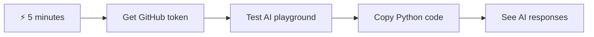

- **मिनेट १**: [GitHub Models Playground](https://github.com/marketplace/models/azure-openai/gpt-4o-mini/playground) मा जानुहोस् र व्यक्तिगत पहुँच टोकन सिर्जना गर्नुहोस्
- **मिनेट २**: प्लेग्राउन्ड इन्टरफेसमा एआई अन्तर्क्रियाहरू प्रत्यक्ष परीक्षण गर्नुहोस्
- **मिनेट ३**: "Code" ट्याबमा क्लिक गर्नुहोस् र Python स्निपेट प्रतिलिपि गर्नुहोस्
- **मिनेट ४**: आफ्नो टोकनको साथमा कोड स्थानीय रूपमा चलाउनुहोस्: `GITHUB_TOKEN=your_token python test.py`
- **मिनेट ५**: आफ्नो कोडबाट पहिलो एआई उत्तर उत्पन्न भएको हेर्नुहोस्

**छिटो परीक्षण कोड**:
```python
import os
from openai import OpenAI

client = OpenAI(
    base_url="https://models.github.ai/inference",
    api_key="your_token_here"
)

response = client.chat.completions.create(
    messages=[{"role": "user", "content": "Hello AI!"}],
    model="openai/gpt-4o-mini"
)

print(response.choices[0].message.content)
```

**यसको महत्त्व किन छ**: ५ मिनेटमा, तपाईंले प्रोग्रामेटिक एआई अन्तर्क्रियाको जादू अनुभव गर्नुहुनेछ। यो तपाईंले प्रयोग गर्ने प्रत्येक एआई अनुप्रयोगलाई शक्ति दिने आधारभूत निर्माण खण्ड हो।

तपाईंको समाप्त परियोजना यस्तो देखिनेछ:

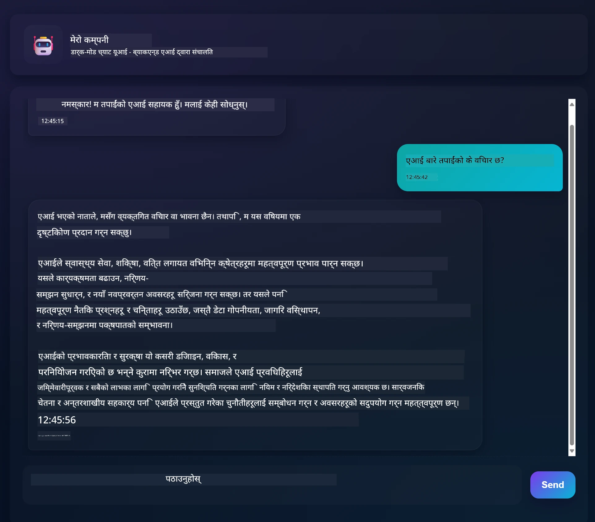

## 🗺️ एआई अनुप्रयोग विकासको माध्यमबाट तपाईंको सिक्ने यात्रा

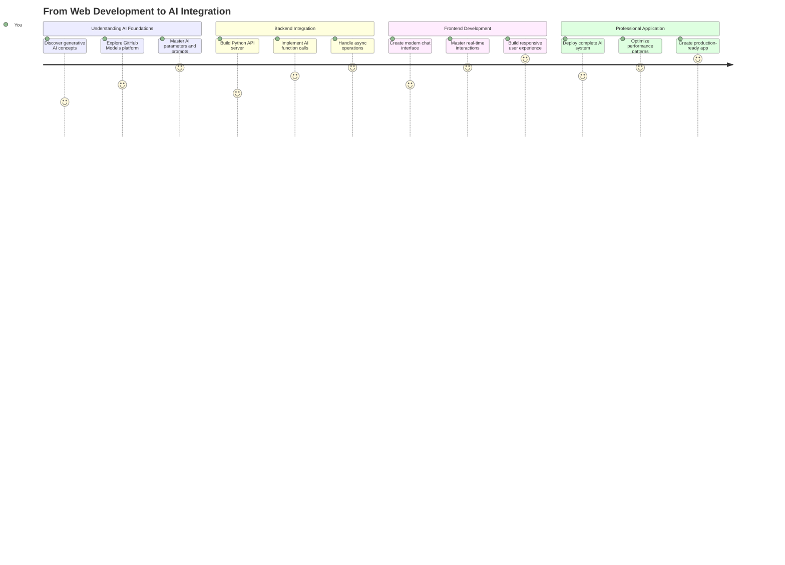

**तपाईंको यात्रा गन्तव्य**: यस पाठको अन्त्यसम्ममा, तपाईंले आधुनिक एआई सहायकहरू जस्तै ChatGPT, Claude, र Google Bard लाई शक्ति दिने समान प्रविधिहरू र ढाँचाहरू प्रयोग गरेर पूर्ण एआई-संचालित अनुप्रयोग निर्माण गर्नुभएको हुनेछ।

## एआई बुझ्दै: रहस्यबाट महारथसम्म

कोडमा डुब्नु अघि, हामी केसँग काम गर्दैछौं भन्ने कुरा बुझौं। यदि तपाईंले पहिले एपीआईहरू प्रयोग गर्नुभएको छ भने, तपाईंले आधारभूत ढाँचा थाहा पाउनुभएको छ: अनुरोध पठाउनुहोस्, प्रतिक्रिया प्राप्त गर्नुहोस्।

एआई एपीआईहरूले समान संरचना अनुसरण गर्छन्, तर डेटाबेसबाट पूर्व-संचित डेटा पुनःप्राप्त गर्ने सट्टा, तिनीहरूले विशाल पाठको ढाँचाबाट सिकेका ढाँचाहरूको आधारमा नयाँ प्रतिक्रियाहरू उत्पन्न गर्छन्। यो पुस्तकालय सूची प्रणाली र ज्ञानवान पुस्तकालयकारको बीचको भिन्नता जस्तै सोच्नुहोस्, जसले धेरै स्रोतहरूबाट जानकारी संश्लेषण गर्न सक्छ।

### "जेनरेटिभ एआई" वास्तवमा के हो?

रोसेटा स्टोनले ज्ञात र अज्ञात भाषाहरू बीचको ढाँचाहरू फेला पारेर विद्वानहरूलाई इजिप्टियन हाइरोग्लिफिक्स बुझ्न अनुमति दिएको जस्तै सोच्नुहोस्। एआई मोडेलहरूले विशाल पाठमा ढाँचाहरू फेला पार्छन् ताकि भाषा कसरी काम गर्छ भन्ने बुझ्न सकियोस्, त्यसपछि ती ढाँचाहरू प्रयोग गरेर नयाँ प्रश्नहरूको उपयुक्त उत्तरहरू उत्पन्न गरिन्छ।

**यसलाई सरल तुलना गरेर बुझौं:**
- **परम्परागत डेटाबेस**: तपाईंको जन्म प्रमाणपत्रको लागि सोध्नुहोस् – तपाईंले हरेक पटक उही दस्तावेज प्राप्त गर्नुहुन्छ
- **सर्च इन्जिन**: पुस्तकालयकारलाई बिरालाहरूको बारेमा पुस्तकहरू फेला पार्न सोध्नुहोस् – तिनीहरूले उपलब्ध कुरा देखाउँछन्
- **जेनरेटिभ एआई**: ज्ञानवान साथीलाई बिरालाहरूको बारेमा सोध्नुहोस् – तिनीहरूले तपाईंलाई रोचक कुरा आफ्नै शब्दमा बताउँछन्, तपाईंले जान्न चाहेको कुरामा अनुकूलित

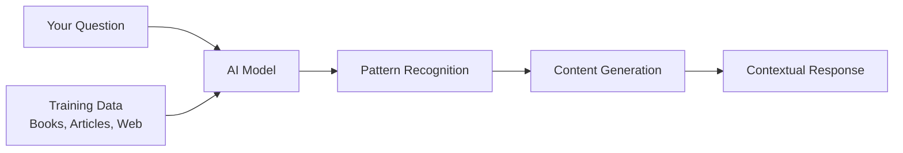

### एआई मोडेलहरू कसरी सिक्छन् (सरल संस्करण)

एआई मोडेलहरूले पुस्तकहरू, लेखहरू, र संवादहरू समावेश गर्ने विशाल डेटासेटहरूमा पहुँच मार्फत सिक्छन्। यस प्रक्रियामा, तिनीहरूले निम्न कुराहरूमा ढाँचाहरू पहिचान गर्छन्:
- लेखिएको सञ्चारमा विचारहरू कसरी संरचित छन्
- कुन शब्दहरू सामान्यतया सँगै देखा पर्छन्
- संवादहरू सामान्यतया कसरी प्रवाह हुन्छन्
- औपचारिक र अनौपचारिक सञ्चार बीचको सन्दर्भगत भिन्नता

**यो पुरातत्वविदहरूले प्राचीन भाषाहरू डिकोड गर्ने तरिकाजस्तै हो**: तिनीहरूले व्याकरण, शब्दावली, र सांस्कृतिक सन्दर्भ बुझ्न हजारौं उदाहरणहरू विश्लेषण गर्छन्, अन्ततः ती सिकेका ढाँचाहरू प्रयोग गरेर नयाँ पाठहरूको व्याख्या गर्न सक्षम हुन्छन्।

### किन GitHub Models?

हामी GitHub Models प्रयोग गर्दैछौं व्यावहारिक कारणका लागि – यसले हामीलाई हाम्रो आफ्नै एआई पूर्वाधार सेटअप नगरी उद्यम-स्तरको एआई पहुँच दिन्छ (जुन, विश्वास गर्नुहोस्, तपाईं अहिले गर्न चाहनुहुन्न!)। यो मौसम एपीआई प्रयोग गरेर मौसमको भविष्यवाणी गर्ने प्रयास नगरी मौसम स्टेशनहरू सेटअप गर्ने प्रयास जस्तै हो।

यो "एआई-एज-अ-सर्भिस" हो, र सबैभन्दा राम्रो कुरा? यो सुरु गर्न निःशुल्क छ, त्यसैले तपाईंले ठूलो बिलको चिन्ता नगरी प्रयोग गर्न सक्नुहुन्छ।

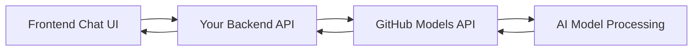

हामी हाम्रो ब्याकएन्ड एकीकरणको लागि GitHub Models प्रयोग गर्नेछौं, जसले व्यावसायिक-स्तरको एआई क्षमताहरूलाई विकासकर्ता-अनुकूल इन्टरफेस मार्फत पहुँच प्रदान गर्दछ। [GitHub Models Playground](https://github.com/marketplace/models/azure-openai/gpt-4o-mini/playground) विभिन्न एआई मोडेलहरू प्रयोग गर्न र तिनीहरूको क्षमताहरूलाई कोडमा कार्यान्वयन गर्नु अघि बुझ्नको लागि परीक्षण वातावरणको रूपमा काम गर्दछ।

## 🧠 एआई अनुप्रयोग विकास पारिस्थितिकी तन्त्र

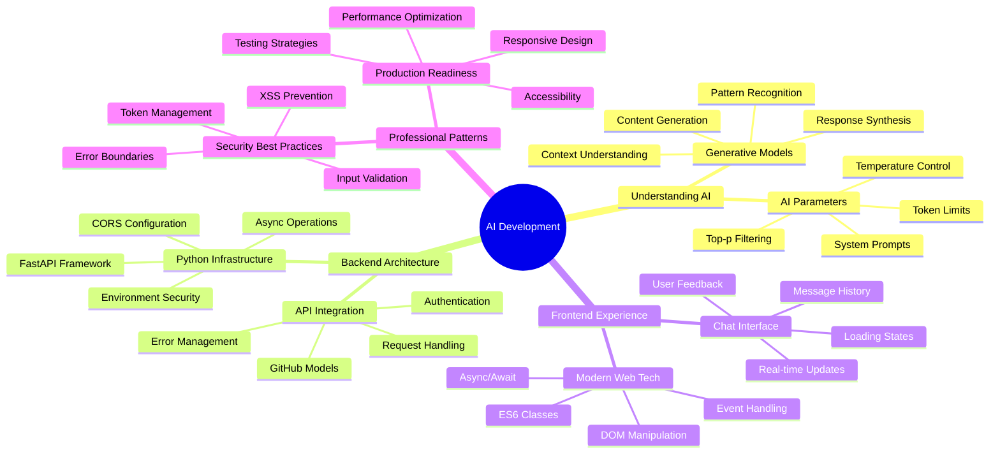

**मुख्य सिद्धान्त**: एआई अनुप्र
**२. आउटपुट स्वरूपण**: एआईलाई उत्तरहरू कसरी संरचना गर्ने भनेर बताउनुहोस्  
```python
system_prompt = """
You are a technical mentor. Always structure your responses as:
1. Quick Answer (1-2 sentences)
2. Detailed Explanation 
3. Code Example
4. Common Pitfalls to Avoid
5. Next Steps for Learning
"""
```
  
**३. बाध्यता सेटिङ**: एआईले के नगर्नु पर्छ भनेर परिभाषित गर्नुहोस्  
```python
system_prompt = """
You are a coding tutor focused on teaching best practices. Never write complete 
solutions for the user - instead, guide them with hints and questions so they 
learn by doing. Always explain the 'why' behind coding decisions.
"""
```
  

#### किन यो तपाईंको च्याट सहायकको लागि महत्त्वपूर्ण छ  

सिस्टम प्रॉम्प्टहरू बुझ्नाले तपाईंलाई विशेष एआई सहायकहरू सिर्जना गर्न अद्भुत शक्ति दिन्छ:  
- **ग्राहक सेवा बोट**: सहयोगी, धैर्यशील, नीति-सचेत  
- **शिक्षण ट्यूटर**: उत्साहजनक, चरण-दर-चरण, बुझाइ जाँच गर्ने  
- **रचनात्मक साझेदार**: कल्पनाशील, विचारहरूमा निर्माण गर्ने, "के हुन्छ यदि?" सोध्ने  
- **प्राविधिक विशेषज्ञ**: सटीक, विस्तृत, सुरक्षा-सचेत  

**मुख्य कुरा**: तपाईं केवल एआई एपीआईलाई कल गर्दै हुनुहुन्न – तपाईं आफ्नो विशिष्ट प्रयोगको लागि सेवा गर्ने अनुकूलित एआई व्यक्तित्व सिर्जना गर्दै हुनुहुन्छ। यही कारणले आधुनिक एआई अनुप्रयोगहरू सामान्यभन्दा अनुकूल र उपयोगी महसुस हुन्छ।  

### 🎯 शैक्षिक जाँच: एआई व्यक्तित्व प्रोग्रामिङ  

**रोक्नुहोस् र विचार गर्नुहोस्**: तपाईंले अहिले मात्र प्रणाली प्रॉम्प्टहरू मार्फत एआई व्यक्तित्वहरू प्रोग्राम गर्न सिक्नुभयो। यो आधुनिक एआई अनुप्रयोग विकासमा एक मौलिक सीप हो।  

**छोटो आत्म-मूल्यांकन**:  
- के तपाईं व्याख्या गर्न सक्नुहुन्छ कि प्रणाली प्रॉम्प्टहरू सामान्य प्रयोगकर्ता सन्देशहरूबाट कसरी फरक छन्?  
- तापक्रम र top_p प्यारामिटरहरू बीचको भिन्नता के हो?  
- तपाईं कसरी विशिष्ट प्रयोगको लागि प्रणाली प्रॉम्प्ट सिर्जना गर्नुहुन्छ (जस्तै कोडिङ ट्यूटर)?  

**वास्तविक संसारको सम्बन्ध**: प्रणाली प्रॉम्प्ट प्रविधिहरू जुन तपाईंले सिक्नुभएको छ, प्रत्येक प्रमुख एआई अनुप्रयोगमा प्रयोग गरिन्छ - GitHub Copilot को कोडिङ सहायता देखि ChatGPT को संवादात्मक इन्टरफेससम्म। तपाईं प्रमुख टेक कम्पनीहरूको एआई उत्पादन टोलीहरूले प्रयोग गर्ने समान ढाँचाहरूमा महारत हासिल गर्दै हुनुहुन्छ।  

**चुनौती प्रश्न**: तपाईंले विभिन्न प्रयोगकर्ता प्रकारहरू (सुरुवातकर्ता बनाम विशेषज्ञ) को लागि विभिन्न एआई व्यक्तित्वहरू कसरी डिजाइन गर्न सक्नुहुन्छ? विचार गर्नुहोस् कि कसरी एउटै आधारभूत एआई मोडेलले प्रॉम्प्ट इन्जिनियरिङ मार्फत विभिन्न दर्शकहरूलाई सेवा गर्न सक्छ।  

## FastAPI प्रयोग गरेर वेब एपीआई निर्माण: तपाईंको उच्च-प्रदर्शन एआई संचार केन्द्र  

अब हामी फ्रन्टएन्डलाई एआई सेवाहरूमा जडान गर्ने ब्याकएन्ड निर्माण गर्नेछौं। हामी FastAPI प्रयोग गर्नेछौं, आधुनिक पायथन फ्रेमवर्क जसले एआई अनुप्रयोगहरूको लागि एपीआई निर्माणमा उत्कृष्टता प्रदान गर्दछ।  

FastAPI ले यस प्रकारको परियोजनाको लागि धेरै फाइदाहरू प्रदान गर्दछ: समवर्ती अनुरोधहरू ह्यान्डल गर्न निर्मित async समर्थन, स्वचालित एपीआई डकुमेन्टेसन निर्माण, र उत्कृष्ट प्रदर्शन। तपाईंको FastAPI सर्भरले फ्रन्टएन्डबाट अनुरोधहरू प्राप्त गर्ने, एआई सेवाहरूसँग संवाद गर्ने, र स्वरूपित प्रतिक्रियाहरू फर्काउने मध्यस्थको रूपमा काम गर्दछ।  

### किन एआई अनुप्रयोगहरूको लागि FastAPI?  

तपाईं सोच्न सक्नुहुन्छ: "के म फ्रन्टएन्ड जाभास्क्रिप्टबाट एआईलाई सिधै कल गर्न सक्दिन?" वा "किन FastAPI Flask वा Django को सट्टा?" उत्कृष्ट प्रश्नहरू!  

**यहाँ किन FastAPI हाम्रो निर्माणको लागि उपयुक्त छ:**  
- **डिफल्ट रूपमा Async**: धेरै एआई अनुरोधहरू एकैपटक ह्यान्डल गर्न सक्छ बिना अड्किने  
- **स्वचालित डकुमेन्टेसन**: `/docs` मा जानुहोस् र निःशुल्क सुन्दर, अन्तरक्रियात्मक एपीआई डकुमेन्टेसन पृष्ठ प्राप्त गर्नुहोस्  
- **निर्मित मान्यता**: समस्याहरू उत्पन्न हुनु अघि त्रुटिहरू समात्छ  
- **चमकदार छिटो**: पायथन फ्रेमवर्कहरू मध्ये एक छिटो  
- **आधुनिक पायथन**: पायथनका सबै नवीनतम र उत्कृष्ट सुविधाहरू प्रयोग गर्दछ  

**र यहाँ किन हामीलाई ब्याकएन्ड चाहिन्छ:**  

**सुरक्षा**: तपाईंको एआई एपीआई कुञ्जी पासवर्ड जस्तै हो – यदि तपाईं यसलाई फ्रन्टएन्ड जाभास्क्रिप्टमा राख्नुहुन्छ भने, तपाईंको वेबसाइटको स्रोत कोड हेर्ने जो कोहीले यसलाई चोर्न सक्छ र तपाईंको एआई क्रेडिटहरू प्रयोग गर्न सक्छ। ब्याकएन्डले संवेदनशील प्रमाणहरू सुरक्षित राख्छ।  

**दर सीमितता र नियन्त्रण**: ब्याकएन्डले तपाईंलाई प्रयोगकर्ताहरूले कति पटक अनुरोध गर्न सक्छन् भन्ने नियन्त्रण गर्न, प्रयोगकर्ता प्रमाणीकरण कार्यान्वयन गर्न, र प्रयोग ट्र्याक गर्न लगिङ थप्न अनुमति दिन्छ।  

**डाटा प्रशोधन**: तपाईं वार्तालापहरू बचत गर्न, अनुपयुक्त सामग्री फिल्टर गर्न, वा धेरै एआई सेवाहरूलाई संयोजन गर्न चाहनुहुन्छ। यो तर्क ब्याकएन्डमा हुन्छ।  

**आर्किटेक्चर क्लाइन्ट-सर्भर मोडेल जस्तै देखिन्छ:**  
- **फ्रन्टएन्ड**: अन्तरक्रियाको लागि प्रयोगकर्ता इन्टरफेस तह  
- **ब्याकएन्ड एपीआई**: अनुरोध प्रशोधन र रुटिङ तह  
- **एआई सेवा**: बाह्य गणना र प्रतिक्रिया उत्पादन  
- **पर्यावरण चरहरू**: सुरक्षित कन्फिगरेसन र प्रमाणपत्र भण्डारण  

### अनुरोध-प्रतिक्रिया प्रवाह बुझ्दै  

आउनुहोस् प्रयोगकर्ताले सन्देश पठाउँदा के हुन्छ भनेर ट्रेस गरौं:  

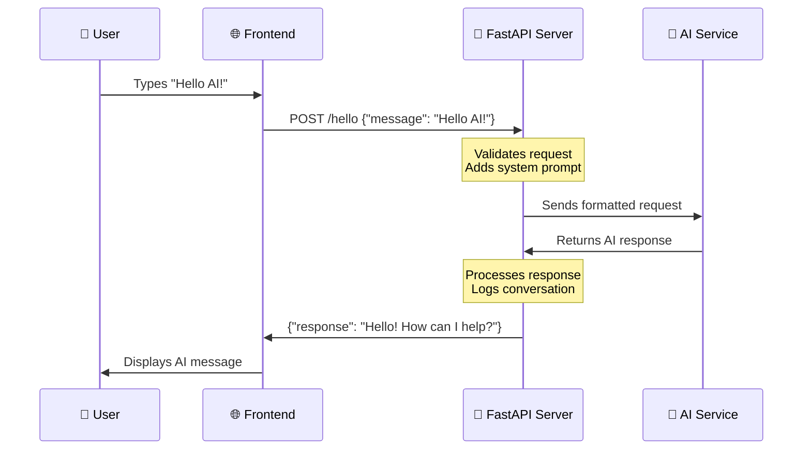
  
**प्रत्येक चरण बुझ्दै:**  
1. **प्रयोगकर्ता अन्तरक्रिया**: व्यक्तिले च्याट इन्टरफेसमा टाइप गर्छ  
2. **फ्रन्टएन्ड प्रशोधन**: जाभास्क्रिप्टले इनपुटलाई JSON रूपमा समात्छ र स्वरूपित गर्छ  
3. **एपीआई मान्यता**: FastAPI ले Pydantic मोडेलहरू प्रयोग गरेर अनुरोधलाई स्वचालित रूपमा मान्यता दिन्छ  
4. **एआई एकीकरण**: ब्याकएन्डले सन्दर्भ (सिस्टम प्रॉम्प्ट) थप्छ र एआई सेवालाई कल गर्छ  
5. **प्रतिक्रिया ह्यान्डलिङ**: एपीआईले एआई प्रतिक्रिया प्राप्त गर्छ र आवश्यक परेमा यसलाई परिमार्जन गर्न सक्छ  
6. **फ्रन्टएन्ड प्रदर्शन**: जाभास्क्रिप्टले च्याट इन्टरफेसमा प्रतिक्रिया देखाउँछ  

### एपीआई आर्किटेक्चर बुझ्दै  

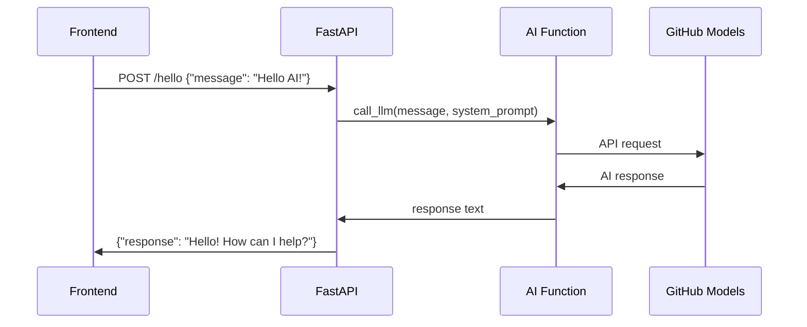
  
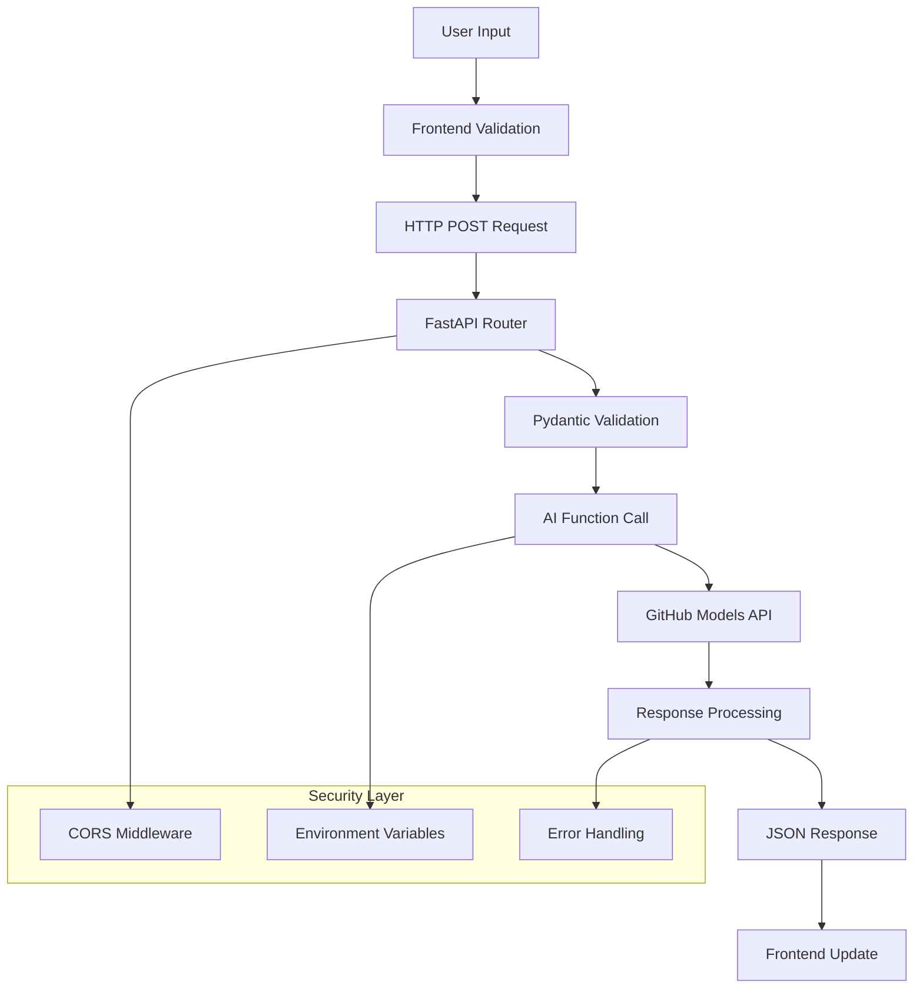
  
### FastAPI एप्लिकेसन सिर्जना गर्दै  

आउनुहोस् हाम्रो एपीआई चरण-दर-चरण निर्माण गरौं। `api.py` नामक फाइल सिर्जना गर्नुहोस् र निम्न FastAPI कोड थप्नुहोस्:  

```python
# api.py
from fastapi import FastAPI, HTTPException
from fastapi.middleware.cors import CORSMiddleware
from pydantic import BaseModel
from llm import call_llm
import logging

# Configure logging
logging.basicConfig(level=logging.INFO)
logger = logging.getLogger(__name__)

# Create FastAPI application
app = FastAPI(
    title="AI Chat API",
    description="A high-performance API for AI-powered chat applications",
    version="1.0.0"
)

# Configure CORS
app.add_middleware(
    CORSMiddleware,
    allow_origins=["*"],  # Configure appropriately for production
    allow_credentials=True,
    allow_methods=["*"],
    allow_headers=["*"],
)

# Pydantic models for request/response validation
class ChatMessage(BaseModel):
    message: str

class ChatResponse(BaseModel):
    response: str

@app.get("/")
async def root():
    """Root endpoint providing API information."""
    return {
        "message": "Welcome to the AI Chat API",
        "docs": "/docs",
        "health": "/health"
    }

@app.get("/health")
async def health_check():
    """Health check endpoint."""
    return {"status": "healthy", "service": "ai-chat-api"}

@app.post("/hello", response_model=ChatResponse)
async def chat_endpoint(chat_message: ChatMessage):
    """Main chat endpoint that processes messages and returns AI responses."""
    try:
        # Extract and validate message
        message = chat_message.message.strip()
        if not message:
            raise HTTPException(status_code=400, detail="Message cannot be empty")
        
        logger.info(f"Processing message: {message[:50]}...")
        
        # Call AI service (note: call_llm should be made async for better performance)
        ai_response = await call_llm_async(message, "You are a helpful and friendly assistant.")
        
        logger.info("AI response generated successfully")
        return ChatResponse(response=ai_response)
        
    except HTTPException:
        raise
    except Exception as e:
        logger.error(f"Error processing chat message: {str(e)}")
        raise HTTPException(status_code=500, detail="Internal server error")

if __name__ == "__main__":
    import uvicorn
    uvicorn.run(app, host="0.0.0.0", port=5000, reload=True)
```
  
**FastAPI कार्यान्वयन बुझ्दै:**  
- **आयात गर्दछ** FastAPI आधुनिक वेब फ्रेमवर्क कार्यक्षमता र Pydantic डाटा मान्यता लागि  
- **स्वचालित एपीआई डकुमेन्टेसन सिर्जना गर्दछ** (सर्भर चल्दा `/docs` मा उपलब्ध)  
- **CORS मिडलवेयर सक्षम गर्दछ** विभिन्न उत्पत्तिबाट फ्रन्टएन्ड अनुरोधहरू अनुमति दिन  
- **Pydantic मोडेलहरू परिभाषित गर्दछ** स्वचालित अनुरोध/प्रतिक्रिया मान्यता र डकुमेन्टेसनका लागि  
- **असिंक्रोनस अन्त बिन्दुहरू प्रयोग गर्दछ** समवर्ती अनुरोधहरूसँग राम्रो प्रदर्शनका लागि  
- **उपयुक्त HTTP स्थिति कोडहरू र त्रुटि ह्यान्डलिङ कार्यान्वयन गर्दछ** HTTPException प्रयोग गरेर  
- **संरचित लगिङ समावेश गर्दछ** निगरानी र डिबगिङका लागि  
- **सेवा स्थिति निगरानीका लागि स्वास्थ्य जाँच अन्त बिन्दु प्रदान गर्दछ**  

**परम्परागत फ्रेमवर्कहरूमा FastAPI का प्रमुख फाइदाहरू:**  
- **स्वचालित मान्यता**: Pydantic मोडेलहरूले प्रशोधन अघि डाटा अखण्डता सुनिश्चित गर्दछ  
- **अन्तरक्रियात्मक डकुमेन्टेसन**: `/docs` मा जानुहोस् स्वचालित रूपमा उत्पन्न, परीक्षण योग्य एपीआई डकुमेन्टेसनका लागि  
- **प्रकार सुरक्षा**: पायथन प्रकार संकेतहरूले रनटाइम त्रुटिहरू रोक्छ र कोड गुणस्तर सुधार गर्दछ  
- **असिंक्रोनस समर्थन**: एकै समयमा धेरै एआई अनुरोधहरू ह्यान्डल गर्नुहोस् बिना रोकावट  
- **प्रदर्शन**: वास्तविक समय अनुप्रयोगहरूको लागि महत्वपूर्ण रूपमा छिटो अनुरोध प्रशोधन  

### CORS बुझ्दै: वेबको सुरक्षा गार्ड  

CORS (Cross-Origin Resource Sharing) भवनको सुरक्षा गार्ड जस्तै हो जसले आगन्तुकहरूलाई प्रवेश गर्न अनुमति छ कि छैन भनेर जाँच गर्दछ। आउनुहोस् किन यो महत्त्वपूर्ण छ र यो तपाईंको अनुप्रयोगलाई कसरी असर गर्छ भनेर बुझौं।  

#### CORS के हो र किन यो अस्तित्वमा छ?  

**समस्या**: कल्पना गर्नुहोस् यदि कुनै पनि वेबसाइटले तपाईंको अनुमति बिना तपाईंको बैंकको वेबसाइटमा अनुरोधहरू गर्न सक्थ्यो। त्यो सुरक्षा दुःस्वप्न हुनेछ! ब्राउजरहरूले यो "समान-उत्पत्ति नीति" मार्फत डिफल्ट रूपमा रोक्छ।  

**समान-उत्पत्ति नीति**: ब्राउजरहरूले केवल वेब पृष्ठहरूलाई अनुरोध गर्न अनुमति दिन्छन् जुन तिनीहरू लोड गरिएको डोमेन, पोर्ट, र प्रोटोकलसँग समान छन्।  

**वास्तविक संसारको उपमा**: यो अपार्टमेन्ट भवन सुरक्षा जस्तै हो – केवल निवासीहरू (समान उत्पत्ति) ले डिफल्ट रूपमा भवनमा पहुँच गर्न सक्छन्। यदि तपाईंले साथीलाई (विभिन्न उत्पत्ति) भ्रमण गर्न दिन चाहनुहुन्छ भने, तपाईंले सुरक्षा गार्डलाई स्पष्ट रूपमा बताउनुपर्छ कि यो ठीक छ।  

#### तपाईंको विकास वातावरणमा CORS  

विकासको क्रममा, तपाईंको फ्रन्टएन्ड र ब्याकएन्ड विभिन्न पोर्टहरूमा चल्छ:  
- फ्रन्टएन्ड: `http://localhost:3000` (वा HTML सिधै खोल्दा file://)  
- ब्याकएन्ड: `http://localhost:5000`  

यी "विभिन्न उत्पत्ति" मानिन्छन् यद्यपि तिनीहरू एउटै कम्प्युटरमा छन्!  

```python
from fastapi.middleware.cors import CORSMiddleware

app = FastAPI(__name__)
CORS(app)   # This tells browsers: "It's okay for other origins to make requests to this API"
```
  
**CORS कन्फिगरेसनले व्यवहारमा के गर्छ:**  
- **विशेष HTTP हेडरहरू थप्छ** एपीआई प्रतिक्रियाहरूमा जसले ब्राउजरहरूलाई "यो क्रस-उत्पत्ति अनुरोध अनुमति छ" भन्छ  
- **"प्रिफ्लाइट" अनुरोधहरू ह्यान्डल गर्दछ** (ब्राउजरहरूले कहिलेकाहीँ वास्तविक अनुरोध पठाउनु अघि अनुमति जाँच गर्छन्)  
- **ब्राउजर कन्सोलमा "CORS नीति द्वारा अवरुद्ध" त्रुटि रोक्छ**  

#### CORS सुरक्षा: विकास बनाम उत्पादन  

```python
# 🚨 Development: Allows ALL origins (convenient but insecure)
CORS(app)

# ✅ Production: Only allow your specific frontend domain
CORS(app, origins=["https://yourdomain.com", "https://www.yourdomain.com"])

# 🔒 Advanced: Different origins for different environments
if app.debug:  # Development mode
    CORS(app, origins=["http://localhost:3000", "http://127.0.0.1:3000"])
else:  # Production mode
    CORS(app, origins=["https://yourdomain.com"])
```
  
**किन यो महत्त्वपूर्ण छ**: विकासमा, `CORS(app)` तपाईंको अगाडिको ढोका अनलक गरिएको जस्तै हो – सुविधाजनक तर सुरक्षित छैन। उत्पादनमा, तपाईंले ठीक-ठीक कुन वेबसाइटहरूले तपाईंको एपीआईसँग कुरा गर्न सक्छन् भनेर निर्दिष्ट गर्न चाहनुहुन्छ।  

#### सामान्य CORS परिदृश्यहरू र समाधानहरू  

| परिदृश्य | समस्या | समाधान |  
|----------|---------|----------|  
| **स्थानीय विकास** | फ्रन्टएन्डले ब्याकएन्डमा पुग्न सक्दैन | FastAPI मा CORSMiddleware थप्नुहोस् |  
| **GitHub Pages + Heroku** | तैनात फ्रन्टएन्डले एपीआईमा पुग्न सक्दैन | CORS उत्पत्तिहरूमा तपाईंको GitHub Pages URL थप्नुहोस् |  
| **कस्टम डोमेन** | उत्पादनमा CORS त्रुटिहरू | CORS उत्पत्तिहरूलाई तपाईंको डोमेनसँग मिलाउन अद्यावधिक गर्नुहोस् |  
| **मोबाइल एप** | एपले वेब एपीआईमा पुग्न सक्दैन | तपाईंको एपको डोमेन थप्नुहोस् वा सावधानीपूर्वक `*` प्रयोग गर्नुहोस् |  

**प्रो टिप**: तपाईं आफ्नो ब्राउजरको डेभलपर टूल्सको नेटवर्क ट्याबमा CORS हेडरहरू जाँच गर्न सक्नुहुन्छ। प्रतिक्रियामा `Access-Control-Allow-Origin` जस्ता हेडरहरू खोज्नुहोस्।  

### त्रुटि ह्यान्डलिङ र मान्यता  

हाम्रो एपीआईले उचित त्रुटि ह्यान्डलिङ समावेश गरेको छ भन्ने कुरा नोट गर्नुहोस्:  

```python
# Validate that we received a message
if not message:
    return jsonify({"error": "Message field is required"}), 400
```
  
**मुख्य मान्यता सिद्धान्तहरू:**  
- **आवश्यक क्षेत्रहरूको लागि जाँच गर्दछ** अनुरोधहरू प्रशोधन गर्नु अघि  
- **अर्थपूर्ण त्रुटि सन्देशहरू JSON स्वरूपमा फर्काउँछ**  
- **उपयुक्त HTTP स्थिति कोडहरू प्रयोग गर्दछ** (खराब अनुरोधहरूको लागि 400)  
- **फ्रन्टएन्ड विकासकर्ताहरूलाई समस्या डिबग गर्न मद्दत गर्न स्पष्ट प्रतिक्रिया प्रदान गर्दछ**  

## ब्याकएन्ड सेटअप र चलाउँदै  

अब हामीसँग हाम्रो एआई एकीकरण र FastAPI सर्भर तयार छ, आउनुहोस् सबै कुरा चलाउन सुरु गरौं। सेटअप प्रक्रियामा पायथन निर्भरताहरू स्थापना गर्ने, वातावरण चरहरू कन्फिगर गर्ने, र तपाईंको विकास सर्भर सुरु गर्ने समावेश छ।  

### पायथन वातावरण सेटअप  

आउनुहोस् तपाईंको पायथन विकास वातावरण सेट गरौं। भर्चुअल वातावरणहरू म्यानहट्टन प्रोजेक्टको कम्पार्टमेन्टलाइज्ड दृष्टिकोण जस्तै हुन् – प्रत्येक परियोजनाले विशिष्ट उपकरणहरू र निर्भरताहरूको साथ आफ्नो अलग ठाउँ प्राप्त गर्दछ, विभिन्न परियोजनाहरू बीचको द्वन्द्व रोक्छ।  

```bash
# Navigate to your backend directory
cd backend

# Create a virtual environment (like creating a clean room for your project)
python -m venv venv

# Activate it (Linux/Mac)
source ./venv/bin/activate

# On Windows, use:
# venv\Scripts\activate

# Install the good stuff
pip install openai fastapi uvicorn python-dotenv
```
  
**हामीले अहिले के गर्यौं:**  
- **हाम्रो आफ्नै सानो पायथन बबल सिर्जना गर्यौं** जहाँ हामी प्याकेजहरू स्थापना गर्न सक्छौं बिना अरू कुनै कुरालाई असर नगरी  
- **यसलाई सक्रिय गर्यौं** ताकि हाम्रो टर्मिनलले यो विशिष्ट वातावरण प्रयोग गर्न जान्दछ  
- **आवश्यकताहरू स्थापना गर्यौं**: OpenAI एआई जादूका लागि, FastAPI हाम्रो वेब एपीआईका लागि, Uvicorn यसलाई वास्तवमा चलाउनका लागि, र python-dotenv सुरक्षित गोप्य व्यवस्थापनका लागि  

**मुख्य निर्भरताहरूको व्याख्या:**  
- **FastAPI**: आधुनिक, छिटो वेब फ्रेमवर्क स्वचालित एपीआई डकुमेन्टेसनको साथ  
- **Uvicorn**: FastAPI अनुप्रयोगहरू चलाउने चटपटे छिटो ASGI सर्भर  
- **OpenAI**: GitHub मोडेलहरू र OpenAI एपीआई एकीकरणको लागि आधिकारिक लाइब्रेरी  
- **python-dotenv**: .env फाइलहरूबाट सुरक्षित वातावरण चर लोड गर्दै  

### वातावरण कन्फिगरेसन: गोप्य कुरा सुरक्षित राख्दै  

हाम्रो एपीआई सुरु गर्नु अघि, वेब विकासमा सबैभन्दा महत्त्वपूर्ण पाठहरू मध्ये एकको बारेमा कुरा गरौं: तपाईंको गोप्य कुरा वास्तवमै गोप्य कसरी राख्ने। वातावरण चरहरू सुरक्षित भल्ट जस्तै हुन् जुन केवल तपाईंको अनुप्रयोगले पहुँच गर्न सक्छ।  

#### वातावरण चरहरू के हुन्?  

**वातावरण चरहरूलाई सुरक्षा निक्षेप बक्स जस्तै सोच्नुहोस्** – तपाईंले त्यहाँ आफ्नो मूल्यवान सामान राख्नुहुन्छ, र केवल तपाईं (र तपाईंको एप) सँग यसलाई बाहिर निकाल्नको लागि कुञ्जी छ। तपाईंको कोडमा संवेदनशील जानकारी सिधै लेख्ने (जहाँ शाब्दिक रूपमा जो कोहीले यसलाई देख्न सक्छ) सट्टा, तपाईं यसलाई सुरक्षित रूपमा वातावरणमा भण्डारण गर्नुहुन्छ।  

**यहाँ भिन्नता छ:**  
- **गलत तरिका**: तपाईंको पासवर्डलाई स्टिकी नोटमा लेखेर तपाईंको मोनिटरमा राख्नुहोस्  
- **सही तरिका**: तपाईंको पासवर्डलाई सुरक्षित पासवर्ड व्यवस्थापकमा राख्नुहोस् जसलाई केवल तपाईंले पहुँच गर्न सक्नुहुन्छ  

#### किन वातावरण चरहरू महत्त्वपूर्ण छन्  

```python
# 🚨 NEVER DO THIS - API key visible to everyone
client = OpenAI(
    api_key="ghp_1234567890abcdef...",  # Anyone can steal this!
    base_url="https://models.github.ai/inference"
)

# ✅ DO THIS - API key stored securely
client = OpenAI(
    api_key=os.environ["GITHUB_TOKEN"],  # Only your app can access this
    base_url="https://models.github.ai/inference"
)
```
  
**जब तपाईं गोप्य कुरा हार्डकोड गर्नुहुन्छ के हुन्छ:**  
1. **संस्करण नियन्त्रण एक्सपोजर**: तपाईंको Git रिपोजिटरीमा पहुँच भएको जो कोहीले तपाईंको एपीआई कुञ्जी देख्छ  
2. **सार्वजनिक रिपोजिटरीहरू**: यदि तपाईं GitHub मा धकेल्नुहुन्छ भने, तपाईंको कुञ्जी सम्पूर्ण इन्टरनेटमा देखिनेछ  
3. **टीम साझेदारी**: तपाईंको परियोजनामा काम गर्ने अन्य विकासकर्ताहरूले तपाईंको व्यक्तिगत एपीआई कुञ्जीमा पहुँच प्राप्त गर्छन्  
4. **सुरक्षा उल्लङ्घनहरू**: यदि कसैले तपाईंको एपीआई कुञ्जी चोर्छ भने, तिनीहरूले तपाईंको एआई क्रेडिटहरू प्रयोग गर्न सक्छन्  

#### तपाईंको वातावरण फाइल सेट गर्दै  

तपाईंको ब्याकएन्ड डाइरेक्टरीमा `.env` फाइल सिर्जना गर्नुहोस्। यो फाइलले तपाईं
अब रोमाञ्चक क्षण आउँछ – आफ्नो FastAPI विकास सर्भर सुरु गर्दै र आफ्नो AI एकीकरणलाई जीवित देख्दै! FastAPI ले Uvicorn प्रयोग गर्दछ, जुन असिंक्रोनस पायथन एप्लिकेसनहरूको लागि विशेष रूपमा डिजाइन गरिएको चाँडो ASGI सर्भर हो।

#### FastAPI सर्भर सुरु गर्ने प्रक्रिया बुझ्दै

```bash
# Method 1: Direct Python execution (includes auto-reload)
python api.py

# Method 2: Using Uvicorn directly (more control)
uvicorn api:app --host 0.0.0.0 --port 5000 --reload
```

जब तपाईं यो कमाण्ड चलाउनुहुन्छ, पर्दा पछाडि निम्न कुराहरू हुन्छन्:

**1. पायथनले तपाईंको FastAPI एप्लिकेसन लोड गर्दछ**:
- आवश्यक सबै लाइब्रेरीहरू (FastAPI, Pydantic, OpenAI, आदि) आयात गर्दछ
- तपाईंको `.env` फाइलबाट वातावरणीय भेरिएबलहरू लोड गर्दछ
- स्वचालित डकुमेन्टेसनको साथ FastAPI एप्लिकेसन इन्स्टेन्स सिर्जना गर्दछ

**2. Uvicorn ले ASGI सर्भरलाई कन्फिगर गर्दछ**:
- असिंक्रोनस अनुरोध ह्यान्डलिङ क्षमताहरूको साथ पोर्ट 5000 मा बाइन्ड गर्दछ
- स्वचालित मान्यता सहित अनुरोध राउटिङ सेटअप गर्दछ
- विकासको लागि हट रीलोड सक्षम गर्दछ (फाइल परिवर्तनमा पुनः सुरु हुन्छ)
- अन्तरक्रियात्मक API डकुमेन्टेसन उत्पन्न गर्दछ

**3. सर्भर सुन्न सुरु गर्दछ**:
- तपाईंको टर्मिनलमा देखिन्छ: `INFO: Uvicorn running on http://0.0.0.0:5000`
- सर्भरले धेरै समवर्ती AI अनुरोधहरू ह्यान्डल गर्न सक्छ
- तपाईंको API `http://localhost:5000/docs` मा स्वचालित डकुमेन्टेसनको साथ तयार छ

#### जब सबै कुरा ठीकसँग काम गर्छ, तपाईंले के देख्नुहुन्छ

```bash
$ python api.py
INFO:     Will watch for changes in these directories: ['/your/project/path']
INFO:     Uvicorn running on http://0.0.0.0:5000 (Press CTRL+C to quit)
INFO:     Started reloader process [12345] using WatchFiles
INFO:     Started server process [12346]
INFO:     Waiting for application startup.
INFO:     Application startup complete.
```

**FastAPI आउटपुट बुझ्दै:**
- **परिवर्तनहरूको लागि हेर्नेछ**: विकासको लागि स्वत: रीलोड सक्षम
- **Uvicorn चलिरहेको छ**: उच्च-प्रदर्शन ASGI सर्भर सक्रिय छ
- **रीलोडर प्रक्रिया सुरु भयो**: स्वचालित पुनः सुरुको लागि फाइल वाचर
- **एप्लिकेसन सुरु पूरा भयो**: FastAPI एप सफलतापूर्वक आरम्भ भयो
- **अन्तरक्रियात्मक डकुमेन्टेसन उपलब्ध छ**: `/docs` मा स्वचालित API डकुमेन्टेसन हेर्नुहोस्

#### तपाईंको FastAPI परीक्षण गर्दै: धेरै शक्तिशाली तरिकाहरू

FastAPI ले तपाईंको API परीक्षण गर्नका लागि धेरै सुविधाजनक तरिकाहरू प्रदान गर्दछ, जसमा स्वचालित अन्तरक्रियात्मक डकुमेन्टेसन पनि समावेश छ:

**विधि 1: अन्तरक्रियात्मक API डकुमेन्टेसन (सिफारिस गरिएको)**
1. तपाईंको ब्राउजर खोल्नुहोस् र `http://localhost:5000/docs` मा जानुहोस्
2. तपाईंले Swagger UI देख्नुहुनेछ जसमा सबै तपाईंको अन्त बिन्दुहरू डकुमेन्ट गरिएको छ
3. `/hello` मा क्लिक गर्नुहोस् → "Try it out" → परीक्षण सन्देश प्रविष्ट गर्नुहोस् → "Execute"
4. ब्राउजरमा सही ढाँचासहित प्रतिक्रिया हेर्नुहोस्

**विधि 2: आधारभूत ब्राउजर परीक्षण**
1. रूट अन्त बिन्दुका लागि `http://localhost:5000` मा जानुहोस्
2. सर्भरको स्वास्थ्य जाँच गर्न `http://localhost:5000/health` मा जानुहोस्
3. यसले तपाईंको FastAPI सर्भर ठीकसँग चलिरहेको छ भनेर पुष्टि गर्दछ

**विधि 3: कमाण्ड लाइन परीक्षण (उन्नत)**
```bash
# Test with curl (if available)
curl -X POST http://localhost:5000/hello \
  -H "Content-Type: application/json" \
  -d '{"message": "Hello AI!"}'

# Expected response:
# {"response": "Hello! I'm your AI assistant. How can I help you today?"}
```

**विधि 4: पायथन परीक्षण स्क्रिप्ट**
```python
# test_api.py - Create this file to test your API
import requests
import json

# Test the API endpoint
url = "http://localhost:5000/hello"
data = {"message": "Tell me a joke about programming"}

response = requests.post(url, json=data)
if response.status_code == 200:
    result = response.json()
    print("AI Response:", result['response'])
else:
    print("Error:", response.status_code, response.text)
```

#### सामान्य सुरु गर्ने समस्याहरू समाधान गर्दै

| त्रुटि सन्देश | यसको अर्थ के हो | समाधान कसरी गर्ने |
|---------------|-----------------|--------------------|
| `ModuleNotFoundError: No module named 'fastapi'` | FastAPI स्थापना गरिएको छैन | तपाईंको भर्चुअल वातावरणमा `pip install fastapi uvicorn` चलाउनुहोस् |
| `ModuleNotFoundError: No module named 'uvicorn'` | ASGI सर्भर स्थापना गरिएको छैन | तपाईंको भर्चुअल वातावरणमा `pip install uvicorn` चलाउनुहोस् |
| `KeyError: 'GITHUB_TOKEN'` | वातावरणीय भेरिएबल भेटिएन | तपाईंको `.env` फाइल र `load_dotenv()` कल जाँच गर्नुहोस् |
| `Address already in use` | पोर्ट 5000 व्यस्त छ | पोर्ट 5000 प्रयोग गरिरहेको अन्य प्रक्रियाहरू बन्द गर्नुहोस् वा पोर्ट परिवर्तन गर्नुहोस् |
| `ValidationError` | अनुरोध डेटा Pydantic मोडेलसँग मेल खाँदैन | तपाईंको अनुरोध ढाँचा अपेक्षित स्किमासँग मेल खाँदैन भनेर जाँच गर्नुहोस् |
| `HTTPException 422` | प्रक्रिया गर्न नसकिने इकाई | अनुरोध मान्यता असफल भयो, सही ढाँचाको लागि `/docs` जाँच गर्नुहोस् |
| `OpenAI API error` | AI सेवा प्रमाणीकरण असफल भयो | तपाईंको GitHub टोकन सही छ र उचित अनुमति छ भनेर पुष्टि गर्नुहोस् |

#### विकासका लागि उत्तम अभ्यासहरू

**हट रीलोडिंग**: FastAPI र Uvicornले तपाईंको पायथन फाइलहरूमा परिवर्तनहरू बचत गर्दा स्वत: रीलोड प्रदान गर्दछ। यसको मतलब तपाईं आफ्नो कोड परिमार्जन गर्न सक्नुहुन्छ र म्यानुअल रूपमा पुनः सुरु नगरी तुरुन्त परीक्षण गर्न सक्नुहुन्छ।

```python
# Enable hot reloading explicitly
if __name__ == "__main__":
    app.run(host="0.0.0.0", port=5000, debug=True)  # debug=True enables hot reload
```

**विकासका लागि लगिङ**: के भइरहेको छ बुझ्नको लागि लगिङ थप्नुहोस्:

```python
import logging

# Set up logging
logging.basicConfig(level=logging.INFO)
logger = logging.getLogger(__name__)

@app.route("/hello", methods=["POST"])
def hello():
    data = request.get_json()
    message = data.get("message", "")
    
    logger.info(f"Received message: {message}")
    
    if not message:
        logger.warning("Empty message received")
        return jsonify({"error": "Message field is required"}), 400
    
    try:
        response = call_llm(message, "You are a helpful and friendly assistant.")
        logger.info(f"AI response generated successfully")
        return jsonify({"response": response})
    except Exception as e:
        logger.error(f"AI API error: {str(e)}")
        return jsonify({"error": "AI service temporarily unavailable"}), 500
```

**किन लगिङ सहयोगी छ**: विकासको क्रममा, तपाईंले ठ्याक्कै के अनुरोधहरू आइरहेका छन्, AI के प्रतिक्रिया दिइरहेको छ, र कहाँ त्रुटिहरू आइरहेका छन् भनेर देख्न सक्नुहुन्छ। यसले डिबगिङलाई धेरै छिटो बनाउँछ।

### GitHub Codespaces को लागि कन्फिगर गर्दै: क्लाउड विकास सजिलो बनाउँदै

GitHub Codespaces भनेको क्लाउडमा शक्तिशाली विकास कम्प्युटर जस्तै हो जसलाई तपाईं कुनै पनि ब्राउजरबाट पहुँच गर्न सक्नुहुन्छ। यदि तपाईं Codespaces मा काम गर्दै हुनुहुन्छ भने, तपाईंको ब्याकएन्डलाई तपाईंको फ्रन्टएन्डमा पहुँचयोग्य बनाउनका लागि केही थप चरणहरू आवश्यक छन्।

#### Codespaces नेटवर्किङ बुझ्दै

स्थानीय विकास वातावरणमा, सबै कुरा एउटै कम्प्युटरमा चल्छ:
- ब्याकएन्ड: `http://localhost:5000`
- फ्रन्टएन्ड: `http://localhost:3000` (वा file://)

Codespaces मा, तपाईंको विकास वातावरण GitHub का सर्भरहरूमा चल्छ, त्यसैले "localhost" को अर्थ फरक छ। GitHubले तपाईंको सेवाहरूका लागि स्वत: सार्वजनिक URLहरू सिर्जना गर्दछ, तर तपाईंले तिनीहरूलाई ठीकसँग कन्फिगर गर्न आवश्यक छ।

#### चरण-दर-चरण Codespaces कन्फिगरेसन

**1. तपाईंको ब्याकएन्ड सर्भर सुरु गर्नुहोस्**:
```bash
cd backend
python api.py
```

तपाईंले परिचित FastAPI/Uvicorn सुरु गर्ने सन्देश देख्नुहुनेछ, तर ध्यान दिनुहोस् कि यो Codespace वातावरण भित्र चलिरहेको छ।

**2. पोर्ट दृश्यता कन्फिगर गर्नुहोस्**:
- VS Code को तल्लो प्यानलमा "Ports" ट्याब खोज्नुहोस्
- सूचीमा पोर्ट 5000 खोज्नुहोस्
- पोर्ट 5000 मा राइट-क्लिक गर्नुहोस्
- "Port Visibility" → "Public" चयन गर्नुहोस्

**किन सार्वजनिक बनाउने?** डिफल्ट रूपमा, Codespace पोर्टहरू निजी हुन्छन् (तपाईंलाई मात्र पहुँचयोग्य)। सार्वजनिक बनाउँदा तपाईंको फ्रन्टएन्ड (जसले ब्राउजरमा चल्छ) तपाईंको ब्याकएन्डसँग संवाद गर्न सक्षम हुन्छ।

**3. तपाईंको सार्वजनिक URL प्राप्त गर्नुहोस्**:
पोर्ट सार्वजनिक बनाएपछि, तपाईंले यस्तो URL देख्नुहुनेछ:
```
https://your-codespace-name-5000.app.github.dev
```

**4. तपाईंको फ्रन्टएन्ड कन्फिगरेसन अपडेट गर्नुहोस्**:
```javascript
// In your frontend app.js, update the BASE_URL:
this.BASE_URL = "https://your-codespace-name-5000.app.github.dev";
```

#### Codespace URL बुझ्दै

Codespace URLहरूले पूर्वानुमान योग्य ढाँचा अनुसरण गर्दछ:
```
https://[codespace-name]-[port].app.github.dev
```

**यसलाई तोड्दै:**
- `codespace-name`: तपाईंको Codespace को लागि एक अद्वितीय पहिचानकर्ता (सामान्यतया तपाईंको प्रयोगकर्ता नाम समावेश गर्दछ)
- `port`: तपाईंको सेवा चलिरहेको पोर्ट नम्बर (हाम्रो FastAPI एपका लागि 5000)
- `app.github.dev`: Codespace एप्लिकेसनहरूको लागि GitHub को डोमेन

#### तपाईंको Codespace सेटअप परीक्षण गर्दै

**1. ब्याकएन्डलाई सिधै परीक्षण गर्नुहोस्**:
तपाईंको सार्वजनिक URL नयाँ ब्राउजर ट्याबमा खोल्नुहोस्। तपाईंले देख्नुहुनेछ:
```
Welcome to the AI Chat API. Send POST requests to /hello with JSON payload containing 'message' field.
```

**2. ब्राउजर विकासकर्ता उपकरणहरूसँग परीक्षण गर्नुहोस्**:
```javascript
// Open browser console and test your API
fetch('https://your-codespace-name-5000.app.github.dev/hello', {
  method: 'POST',
  headers: {'Content-Type': 'application/json'},
  body: JSON.stringify({message: 'Hello from Codespaces!'})
})
.then(response => response.json())
.then(data => console.log(data));
```

#### Codespaces बनाम स्थानीय विकास

| पक्ष | स्थानीय विकास | GitHub Codespaces |
|------|--------------|-------------------|
| **सेटअप समय** | लामो (पायथन, निर्भरता स्थापना गर्नुहोस्) | तुरुन्त (पूर्व-कन्फिगर गरिएको वातावरण) |
| **URL पहुँच** | `http://localhost:5000` | `https://xyz-5000.app.github.dev` |
| **पोर्ट कन्फिगरेसन** | स्वत: | म्यानुअल (पोर्टहरू सार्वजनिक बनाउनुहोस्) |
| **फाइल स्थायित्व** | स्थानीय मेसिन | GitHub रिपोजिटरी |
| **सहयोग** | वातावरण साझा गर्न गाह्रो | Codespace लिंक साझा गर्न सजिलो |
| **इन्टरनेट निर्भरता** | केवल AI API कलहरूको लागि | सबै कुराको लागि आवश्यक |

#### Codespace विकास सुझावहरू

**Codespaces मा वातावरणीय भेरिएबलहरू**:
तपाईंको `.env` फाइल Codespaces मा उस्तै तरिकाले काम गर्दछ, तर तपाईं Codespace भित्र वातावरणीय भेरिएबलहरू सिधै सेट गर्न सक्नुहुन्छ:

```bash
# Set environment variable for the current session
export GITHUB_TOKEN="your_token_here"

# Or add to your .bashrc for persistence
echo 'export GITHUB_TOKEN="your_token_here"' >> ~/.bashrc
```

**पोर्ट व्यवस्थापन**:
- Codespacesले स्वचालित रूपमा पत्ता लगाउँछ जब तपाईंको एप्लिकेसन पोर्टमा सुन्न सुरु गर्दछ
- तपाईं एकै समयमा धेरै पोर्टहरू अगाडि बढाउन सक्नुहुन्छ (यदि तपाईंले पछि डेटाबेस थप्नुभयो भने उपयोगी)
- पोर्टहरू तपाईंको Codespace चलिरहेको छ जबसम्म पहुँचयोग्य रहन्छ

**विकास कार्यप्रवाह**:
1. VS Code मा कोड परिवर्तन गर्नुहोस्
2. FastAPI स्वत: रीलोड हुन्छ (Uvicorn को रीलोड मोडको लागि धन्यवाद)
3. सार्वजनिक URL मार्फत परिवर्तनहरू तुरुन्त परीक्षण गर्नुहोस्
4. तयार हुँदा कमिट र पुश गर्नुहोस्

> 💡 **प्रो टिप**: विकासको क्रममा तपाईंको Codespace ब्याकएन्ड URL बुकमार्क गर्नुहोस्। Codespace नामहरू स्थिर छन्, URL परिवर्तन हुँदैन जबसम्म तपाईं उही Codespace प्रयोग गर्दै हुनुहुन्छ।

## फ्रन्टएन्ड च्याट इन्टरफेस सिर्जना गर्दै: जहाँ मानिसहरू AI सँग भेट्छन्

अब हामी प्रयोगकर्ता इन्टरफेस निर्माण गर्नेछौं – भाग जसले मानिसहरूलाई तपाईंको AI सहायकसँग कसरी अन्तरक्रिया गर्ने निर्धारण गर्दछ। जस्तै मूल iPhone को इन्टरफेसको डिजाइन, हामी जटिल प्रविधिलाई सहज र प्रयोग गर्न प्राकृतिक बनाउनेमा ध्यान केन्द्रित गर्दैछौं।

### आधुनिक फ्रन्टएन्ड आर्किटेक्चर बुझ्दै

हाम्रो च्याट इन्टरफेसलाई "सिंगल पेज एप्लिकेसन" वा SPA भनिन्छ। पुरानो शैलीको दृष्टिकोण जहाँ प्रत्येक क्लिकले नयाँ पेज लोड गर्दछ, हाम्रो एप सहज र तुरुन्त अपडेट हुन्छ:

**पुराना वेबसाइटहरू**: भौतिक पुस्तक पढ्ने जस्तै – तपाईं पूर्ण रूपमा नयाँ पेजहरूमा पल्टाउनुहुन्छ
**हाम्रो च्याट एप**: तपाईंको फोन प्रयोग गर्ने जस्तै – सबै कुरा प्रवाह हुन्छ र सहज रूपमा अपडेट हुन्छ

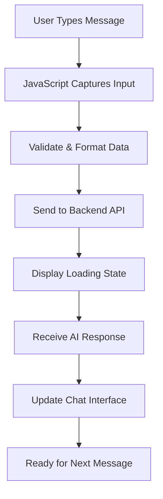

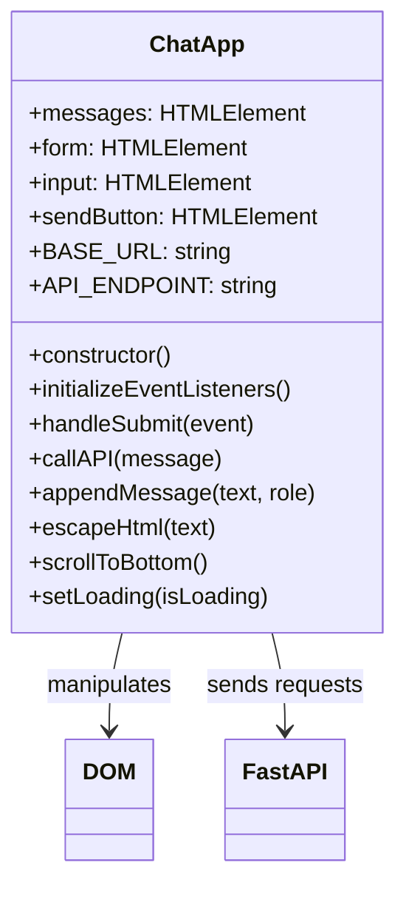

### फ्रन्टएन्ड विकासका तीन स्तम्भहरू

प्रत्येक फ्रन्टएन्ड एप्लिकेसन – साधारण वेबसाइटहरूदेखि जटिल एपहरू जस्तै Discord वा Slack – तीन मुख्य प्रविधिहरूमा आधारित छ। यीलाई वेबमा तपाईंले देख्न र अन्तरक्रिया गर्न सक्ने सबै कुराको आधारभूत रूपमा सोच्नुहोस्:

**HTML (संरचना)**: यो तपाईंको आधार हो
- कुन तत्वहरू छन् (बटनहरू, टेक्स्ट क्षेत्रहरू, कन्टेनरहरू) निर्णय गर्दछ
- सामग्रीलाई अर्थ दिन्छ (यो हेडर हो, यो फारम हो, आदि)
- आधारभूत संरचना सिर्जना गर्दछ जसमा सबै कुरा निर्माण हुन्छ

**CSS (प्रस्तुति)**: यो तपाईंको आन्तरिक डिजाइनर हो
- सबै कुरालाई सुन्दर बनाउँछ (रंगहरू, फन्टहरू, लेआउटहरू)
- विभिन्न स्क्रिन आकारहरू ह्यान्डल गर्दछ (फोन बनाम ल्यापटप बनाम ट्याब्लेट)
- सहज एनिमेसन र दृश्य प्रतिक्रिया सिर्जना गर्दछ

**JavaScript (व्यवहार)**: यो तपाईंको मस्तिष्क हो
- प्रयोगकर्ताहरूले के गर्छन् (क्लिकहरू, टाइपिङ, स्क्रोलिङ) प्रतिक्रिया दिन्छ
- तपाईंको ब्याकएन्डसँग कुरा गर्छ र पेज अपडेट गर्छ
- सबै कुरालाई अन्तरक्रियात्मक र गतिशील बनाउँछ

**यसलाई वास्तुकला डिजाइन जस्तै सोच्नुहोस्:**
- **HTML**: संरचनात्मक ब्लूप्रिन्ट (स्पेस र सम्बन्धहरू परिभाषित गर्दै)
- **CSS**: सौन्दर्य र वातावरणीय डिजाइन (दृश्य शैली र प्रयोगकर्ता अनुभव)
- **JavaScript**: यांत्रिक प्रणालीहरू (कार्यक्षमता र अन्तरक्रियात्मकता)

### किन आधुनिक JavaScript आर्किटेक्चर महत्त्वपूर्ण छ

हाम्रो च्याट एप्लिकेसनले आधुनिक JavaScript ढाँचाहरू प्रयोग गर्नेछ जुन तपाईंले व्यावसायिक एप्लिकेसनहरूमा देख्नुहुनेछ। यी अवधारणाहरू बुझ्नु तपाईंलाई विकासकर्ता रूपमा बढ्दै जाँदा सहयोग गर्नेछ:

**क्लास-आधारित आर्किटेक्चर**: हामी हाम्रो कोडलाई क्लासहरूमा व्यवस्थित गर्नेछौं, जुन वस्तुहरूको लागि ब्लूप्रिन्ट सिर्जना गर्ने जस्तै हो
**Async/Await**: समय लाग्ने अपरेसनहरू (जस्तै API कलहरू) ह्यान्डल गर्ने आधुनिक तरिका
**इभेन्ट-ड्रिभन प्रोग्रामिङ**: हाम्रो एप प्रयोगकर्ता क्रियाकलापहरू (क्लिकहरू, कुञ्जी प्रेसहरू) प्रतिक्रिया दिन्छ, लूपमा चल्ने सट्टा
**DOM म्यानिपुलेसन**: प्रयोगकर्ता अन्तरक्रिया र API प्रतिक्रियाहरूको आधारमा वेबपेज सामग्रीलाई गतिशील रूपमा अपडेट गर्दै

### परियोजना संरचना सेटअप

संगठित संरचनासहित फ्रन्टएन्ड डाइरेक्टरी सिर्जना गर्नुहोस्:

```text
frontend/
├── index.html      # Main HTML structure
├── app.js          # JavaScript functionality
└── styles.css      # Visual styling
```

**आर्किटेक्चर बुझ्दै:**
- **संरचना (HTML)**, व्यवहार (JavaScript), र प्रस्तुति (CSS) बीच चिन्ता अलग गर्दछ
- **सरल फाइल संरचना** कायम राख्छ जुन नेभिगेट गर्न र परिमार्जन गर्न सजिलो छ
- **वेब विकासका लागि उत्तम अभ्यासहरू** अनुसरण गर्दछ संगठन र मर्मतयोग्यताका लागि

### HTML आधार निर्माण गर्दै: पहुँचयोग्यताको लागि अर्थपूर्ण संरचना

HTML संरचनाबाट सुरु गरौं। आधुनिक वेब विकासले "अर्थपूर्ण HTML" मा जोड दिन्छ – HTML तत्वहरू प्रयोग गर्दै जसले स्पष्ट रूपमा आफ्नो उद्देश्य वर्णन गर्दछ, केवल आफ्नो उपस्थिति मात्र होइन। यसले तपाईंको एप्लिकेसनलाई स्क्रिन रिडरहरू, सर्च इन्जिनहरू, र अन्य उपकरणहरूको लागि पहुँचयोग्य बनाउँछ।

**किन अर्थपूर्ण HTML महत्त्वपूर्ण छ**: कल्पना गर्नुहोस् तपाईंको च्याट एप कसैलाई फोनमा वर्णन गर्दै। तपाईं भन्नुहुन्छ "त्यहाँ शीर्षकको साथ हेडर छ, मुख्य क्षेत्र जहाँ कुराकानीहरू देखा पर्दछ, र तल सन्देश टाइप गर्न फारम छ।" अर्थपूर्ण HTMLले तत्वहरू प्रयोग गर्दछ जसले यो प्राकृतिक वर्णनसँग मेल खाउँछ।

`index.html` सिर्जना गर्नुहोस् यस विचारपूर्वक संरचित मार्कअपसँग:

```html
<!DOCTYPE html>
<html lang="en">
<head>
    <meta charset="UTF-8">
    <meta name="viewport" content="width=device-width, initial-scale=1.0">
    <title>AI Chat Assistant</title>
    <link rel="stylesheet" href="styles.css">
</head>
<body>
    <div class="chat-container">
        <header class="chat-header">
            <h1>AI Chat Assistant</h1>
            <p>Ask me anything!</p>
        </header>
        
        <main class="chat-messages" id="messages" role="log" aria-live="polite">
            <!-- Messages will be dynamically added here -->
        </main>
        
        <form class="chat-form" id="chatForm">
            <div class="input-group">
                <input 
                    type="text" 
                    id="messageInput" 
                    placeholder="Type your message here..." 
                    required
                    aria-label="Chat message input"
                >
                <button type="submit" id="sendBtn" aria-label="Send message">
                    Send
                </button>
            </div>
        </form>
    </div>
    <script src="app.js"></script>
</body>
</html>
```

**प्रत्येक HTML तत्व र यसको उद्देश्य बुझ्दै:**

#### दस्तावेज संरचना
- **`<!DOCTYPE html>`**: ब्राउजरलाई यो आधुनिक HTML5 हो भन्छ
- **`<html lang="en">`**: स्क्रिन रिडर र अनुवाद उपकरणहरूको लागि पृष्ठ भाषा निर्दिष्ट गर्दछ
- **`<meta charset="UTF-8">`**: अन्तर्राष्ट्रिय पाठको लागि उचित क्यारेक्टर इन्कोडिङ सुनिश्चित गर्दछ
- **`<meta name="viewport"...>`**: पृष्ठलाई मोबाइल-उत्तरदायी बनाउँछ जूम र स्केल नियन्त्रण गरेर

#### अर्थपूर्ण तत्वहरू
- **`<header>`**: शीर्षक र विवरणको साथ शीर्ष खण्ड स्पष्ट रूपमा पहिचान गर्दछ
- **`<main>`**: प्राथमिक सामग्री क्षेत्र (जहाँ कुराकानीहरू हुन्छन्) निर्दिष्ट गर्दछ
- **`<form>`**: प्रयोगकर्ता इनपुटको लागि अर्थपूर्ण रूपमा सही, उचित कुञ्जीपाटी नेभिगेसन सक्षम गर्दछ

#### पहुँचयोग्यता सुविधाहरू
- **`role="log"`**: स्क्रिन रिडरहरूलाई यो क्षेत्र सन्देशहरूको कालानुक्रमिक लग समावेश गर्दछ भन्छ
- **`aria-live="polite"`**: स्क्रिन र
अब हामी हाम्रो च्याट इन्टरफेसलाई जीवन्त बनाउने जाभास्क्रिप्ट निर्माण गर्नेछौं। हामी आधुनिक जाभास्क्रिप्ट ढाँचाहरू प्रयोग गर्नेछौं जुन व्यावसायिक वेब विकासमा देखिन्छ, जस्तै ES6 क्लासहरू, async/await, र इभेन्ट-ड्राइभन प्रोग्रामिङ।

#### आधुनिक जाभास्क्रिप्ट आर्किटेक्चर बुझ्दै

क्रमिक कोड लेख्ने (एकपछि अर्को चल्ने कार्यहरू) सट्टा, हामी **क्लास-आधारित आर्किटेक्चर** सिर्जना गर्नेछौं। क्लासलाई वस्तुहरू सिर्जना गर्नको लागि ब्लूप्रिन्टको रूपमा सोच्नुहोस् – जस्तै आर्किटेक्टको ब्लूप्रिन्टले धेरै घरहरू निर्माण गर्न प्रयोग गर्न सकिन्छ।

**वेब एप्लिकेसनहरूका लागि क्लास किन प्रयोग गर्ने?**
- **व्यवस्थितता**: सबै सम्बन्धित कार्यक्षमता एकसाथ समूह गरिन्छ
- **पुनः प्रयोगयोग्यता**: तपाईं एउटै पृष्ठमा धेरै च्याट उदाहरणहरू सिर्जना गर्न सक्नुहुन्छ
- **रखरखाव क्षमता**: विशेष सुविधाहरू डिबग गर्न र संशोधन गर्न सजिलो
- **व्यावसायिक मानक**: यो ढाँचा React, Vue, र Angular जस्ता फ्रेमवर्कहरूमा प्रयोग गरिन्छ

`app.js` सिर्जना गर्नुहोस् यो आधुनिक, राम्रो संरचित जाभास्क्रिप्टको साथ:

```javascript
// app.js - Modern chat application logic

class ChatApp {
    constructor() {
        // Get references to DOM elements we'll need to manipulate
        this.messages = document.getElementById("messages");
        this.form = document.getElementById("chatForm");
        this.input = document.getElementById("messageInput");
        this.sendButton = document.getElementById("sendBtn");
        
        // Configure your backend URL here
        this.BASE_URL = "http://localhost:5000"; // Update this for your environment
        this.API_ENDPOINT = `${this.BASE_URL}/hello`;
        
        // Set up event listeners when the chat app is created
        this.initializeEventListeners();
    }
    
    initializeEventListeners() {
        // Listen for form submission (when user clicks Send or presses Enter)
        this.form.addEventListener("submit", (e) => this.handleSubmit(e));
        
        // Also listen for Enter key in the input field (better UX)
        this.input.addEventListener("keypress", (e) => {
            if (e.key === "Enter" && !e.shiftKey) {
                e.preventDefault();
                this.handleSubmit(e);
            }
        });
    }
    
    async handleSubmit(event) {
        event.preventDefault(); // Prevent form from refreshing the page
        
        const messageText = this.input.value.trim();
        if (!messageText) return; // Don't send empty messages
        
        // Provide user feedback that something is happening
        this.setLoading(true);
        
        // Add user message to chat immediately (optimistic UI)
        this.appendMessage(messageText, "user");
        
        // Clear input field so user can type next message
        this.input.value = '';
        
        try {
            // Call the AI API and wait for response
            const reply = await this.callAPI(messageText);
            
            // Add AI response to chat
            this.appendMessage(reply, "assistant");
        } catch (error) {
            console.error('API Error:', error);
            this.appendMessage("Sorry, I'm having trouble connecting right now. Please try again.", "error");
        } finally {
            // Re-enable the interface regardless of success or failure
            this.setLoading(false);
        }
    }
    
    async callAPI(message) {
        const response = await fetch(this.API_ENDPOINT, {
            method: "POST",
            headers: { 
                "Content-Type": "application/json" 
            },
            body: JSON.stringify({ message })
        });
        
        if (!response.ok) {
            throw new Error(`HTTP error! status: ${response.status}`);
        }
        
        const data = await response.json();
        return data.response;
    }
    
    appendMessage(text, role) {
        const messageElement = document.createElement("div");
        messageElement.className = `message ${role}`;
        messageElement.innerHTML = `
            <div class="message-content">
                <span class="message-text">${this.escapeHtml(text)}</span>
                <span class="message-time">${new Date().toLocaleTimeString()}</span>
            </div>
        `;
        
        this.messages.appendChild(messageElement);
        this.scrollToBottom();
    }
    
    escapeHtml(text) {
        const div = document.createElement('div');
        div.textContent = text;
        return div.innerHTML;
    }
    
    scrollToBottom() {
        this.messages.scrollTop = this.messages.scrollHeight;
    }
    
    setLoading(isLoading) {
        this.sendButton.disabled = isLoading;
        this.input.disabled = isLoading;
        this.sendButton.textContent = isLoading ? "Sending..." : "Send";
    }
}

// Initialize the chat application when the page loads
document.addEventListener("DOMContentLoaded", () => {
    new ChatApp();
});
```

#### प्रत्येक जाभास्क्रिप्ट अवधारणा बुझ्दै

**ES6 क्लास संरचना**:
```javascript
class ChatApp {
    constructor() {
        // This runs when you create a new ChatApp instance
        // It's like the "setup" function for your chat
    }
    
    methodName() {
        // Methods are functions that belong to the class
        // They can access class properties using "this"
    }
}
```

**Async/Await ढाँचा**:
```javascript
// Old way (callback hell):
fetch(url)
  .then(response => response.json())
  .then(data => console.log(data))
  .catch(error => console.error(error));

// Modern way (async/await):
try {
    const response = await fetch(url);
    const data = await response.json();
    console.log(data);
} catch (error) {
    console.error(error);
}
```

**इभेन्ट-ड्राइभन प्रोग्रामिङ**:
केही भएको छ कि छैन भनेर निरन्तर जाँच गर्ने सट्टा, हामी घटनाहरूको लागि "सुन्छौं":
```javascript
// When form is submitted, run handleSubmit
this.form.addEventListener("submit", (e) => this.handleSubmit(e));

// When Enter key is pressed, also run handleSubmit
this.input.addEventListener("keypress", (e) => { /* ... */ });
```

**DOM म्यानिपुलेशन**:
```javascript
// Create new elements
const messageElement = document.createElement("div");

// Modify their properties
messageElement.className = "message user";
messageElement.innerHTML = "Hello world!";

// Add to the page
this.messages.appendChild(messageElement);
```

#### सुरक्षा र उत्तम अभ्यासहरू

**XSS रोकथाम**:
```javascript
escapeHtml(text) {
    const div = document.createElement('div');
    div.textContent = text;  // This automatically escapes HTML
    return div.innerHTML;
}
```

**किन यो महत्त्वपूर्ण छ**: यदि प्रयोगकर्ताले `<script>alert('hack')</script>` टाइप गर्छ भने, यो कार्यले यसलाई कोडको रूपमा कार्यान्वयन गर्नुको सट्टा पाठको रूपमा प्रदर्शन सुनिश्चित गर्दछ।

**त्रुटि ह्यान्डलिङ**:
```javascript
try {
    const reply = await this.callAPI(messageText);
    this.appendMessage(reply, "assistant");
} catch (error) {
    // Show user-friendly error instead of breaking the app
    this.appendMessage("Sorry, I'm having trouble...", "error");
}
```

**प्रयोगकर्ता अनुभव विचारहरू**:
- **आशावादी UI**: प्रयोगकर्ता सन्देश तुरुन्तै थप्नुहोस्, सर्भर प्रतिक्रिया कुर्नुहोस्
- **लोडिङ अवस्था**: बटनहरू अक्षम गर्नुहोस् र "पठाउँदै..." देखाउनुहोस् कुर्दा
- **स्वत: स्क्रोल**: नयाँ सन्देशहरू देखिने बनाउनुहोस्
- **इनपुट मान्यता**: खाली सन्देशहरू नपठाउनुहोस्
- **किबोर्ड सर्टकटहरू**: इन्टर कुञ्जीले सन्देशहरू पठाउँछ (जस्तै वास्तविक च्याट एपहरू)

#### एप्लिकेसन फ्लो बुझ्दै

1. **पृष्ठ लोड हुन्छ** → `DOMContentLoaded` इभेन्ट फायर हुन्छ → `new ChatApp()` सिर्जना हुन्छ
2. **कन्स्ट्रक्टर चल्छ** → DOM तत्व सन्दर्भहरू प्राप्त गर्दछ → इभेन्ट लिसनरहरू सेटअप गर्दछ
3. **प्रयोगकर्ताले सन्देश टाइप गर्छ** → इन्टर थिच्छ वा पठाउन क्लिक गर्छ → `handleSubmit` चल्छ
4. **handleSubmit** → इनपुट मान्यता दिन्छ → लोडिङ अवस्था देखाउँछ → API कल गर्छ
5. **API प्रतिक्रिया दिन्छ** → च्याटमा AI सन्देश थप्छ → इन्टरफेस पुन: सक्षम बनाउँछ
6. **अर्को सन्देशको लागि तयार** → प्रयोगकर्ता च्याट जारी राख्न सक्छ

यो आर्किटेक्चर स्केलेबल छ – तपाईं सन्देश सम्पादन, फाइल अपलोड, वा धेरै कुराकानी थ्रेडहरू जस्ता सुविधाहरू सजिलै थप्न सक्नुहुन्छ कोर संरचना पुन: लेख्न बिना।

### 🎯 शैक्षिक जाँच: आधुनिक फ्रन्टएन्ड आर्किटेक्चर

**आर्किटेक्चर बुझाइ**: तपाईंले आधुनिक जाभास्क्रिप्ट ढाँचाहरू प्रयोग गरेर पूर्ण एकल-पृष्ठ एप्लिकेसन कार्यान्वयन गर्नुभएको छ। यो व्यावसायिक स्तरको फ्रन्टएन्ड विकासको प्रतिनिधित्व गर्दछ।

**मुख्य अवधारणाहरूमा महारत**:
- **ES6 क्लास आर्किटेक्चर**: व्यवस्थित, रखरखाव योग्य कोड संरचना
- **Async/Await ढाँचाहरू**: आधुनिक असिंक्रोनस प्रोग्रामिङ
- **इभेन्ट-ड्राइभन प्रोग्रामिङ**: उत्तरदायी प्रयोगकर्ता इन्टरफेस डिजाइन
- **सुरक्षा उत्तम अभ्यासहरू**: XSS रोकथाम र इनपुट मान्यता

**उद्योग कनेक्शन**: तपाईंले सिकेका ढाँचाहरू (क्लास-आधारित आर्किटेक्चर, असिंक्रोनस अपरेसनहरू, DOM म्यानिपुलेशन) आधुनिक फ्रेमवर्कहरू जस्तै React, Vue, र Angular को आधार हुन्। तपाईं उत्पादन एप्लिकेसनहरूमा प्रयोग हुने समान आर्किटेक्चरल सोचको साथ निर्माण गर्दै हुनुहुन्छ।

**प्रतिबिम्ब प्रश्न**: तपाईंले यो च्याट एप्लिकेसनलाई धेरै कुराकानीहरू वा प्रयोगकर्ता प्रमाणीकरण ह्यान्डल गर्न कसरी विस्तार गर्नुहुन्छ? आवश्यक आर्किटेक्चरल परिवर्तनहरू विचार गर्नुहोस् र क्लास संरचना कसरी विकसित हुनेछ।

### तपाईंको च्याट इन्टरफेसलाई स्टाइलिङ गर्दै

अब हामी CSS को साथ आधुनिक, दृश्यात्मक रूपमा आकर्षक च्याट इन्टरफेस सिर्जना गर्नेछौं। राम्रो स्टाइलिङले तपाईंको एप्लिकेसनलाई व्यावसायिक महसुस गराउँछ र समग्र प्रयोगकर्ता अनुभव सुधार गर्दछ। हामी Flexbox, CSS Grid, र अनुकूलन गुणहरू जस्ता आधुनिक CSS सुविधाहरू प्रयोग गर्नेछौं।

`styles.css` सिर्जना गर्नुहोस् यी व्यापक शैलीहरूको साथ:

```css
/* styles.css - Modern chat interface styling */

:root {
    --primary-color: #2563eb;
    --secondary-color: #f1f5f9;
    --user-color: #3b82f6;
    --assistant-color: #6b7280;
    --error-color: #ef4444;
    --text-primary: #1e293b;
    --text-secondary: #64748b;
    --border-radius: 12px;
    --shadow: 0 4px 6px -1px rgba(0, 0, 0, 0.1);
}

* {
    margin: 0;
    padding: 0;
    box-sizing: border-box;
}

body {
    font-family: -apple-system, BlinkMacSystemFont, 'Segoe UI', Roboto, sans-serif;
    background: linear-gradient(135deg, #667eea 0%, #764ba2 100%);
    min-height: 100vh;
    display: flex;
    align-items: center;
    justify-content: center;
    padding: 20px;
}

.chat-container {
    width: 100%;
    max-width: 800px;
    height: 600px;
    background: white;
    border-radius: var(--border-radius);
    box-shadow: var(--shadow);
    display: flex;
    flex-direction: column;
    overflow: hidden;
}

.chat-header {
    background: var(--primary-color);
    color: white;
    padding: 20px;
    text-align: center;
}

.chat-header h1 {
    font-size: 1.5rem;
    margin-bottom: 5px;
}

.chat-header p {
    opacity: 0.9;
    font-size: 0.9rem;
}

.chat-messages {
    flex: 1;
    padding: 20px;
    overflow-y: auto;
    display: flex;
    flex-direction: column;
    gap: 15px;
    background: var(--secondary-color);
}

.message {
    display: flex;
    max-width: 80%;
    animation: slideIn 0.3s ease-out;
}

.message.user {
    align-self: flex-end;
}

.message.user .message-content {
    background: var(--user-color);
    color: white;
    border-radius: var(--border-radius) var(--border-radius) 4px var(--border-radius);
}

.message.assistant {
    align-self: flex-start;
}

.message.assistant .message-content {
    background: white;
    color: var(--text-primary);
    border-radius: var(--border-radius) var(--border-radius) var(--border-radius) 4px;
    border: 1px solid #e2e8f0;
}

.message.error .message-content {
    background: var(--error-color);
    color: white;
    border-radius: var(--border-radius);
}

.message-content {
    padding: 12px 16px;
    box-shadow: var(--shadow);
    position: relative;
}

.message-text {
    display: block;
    line-height: 1.5;
    word-wrap: break-word;
}

.message-time {
    display: block;
    font-size: 0.75rem;
    opacity: 0.7;
    margin-top: 5px;
}

.chat-form {
    padding: 20px;
    border-top: 1px solid #e2e8f0;
    background: white;
}

.input-group {
    display: flex;
    gap: 10px;
    align-items: center;
}

#messageInput {
    flex: 1;
    padding: 12px 16px;
    border: 2px solid #e2e8f0;
    border-radius: var(--border-radius);
    font-size: 1rem;
    outline: none;
    transition: border-color 0.2s ease;
}

#messageInput:focus {
    border-color: var(--primary-color);
}

#messageInput:disabled {
    background: #f8fafc;
    opacity: 0.6;
    cursor: not-allowed;
}

#sendBtn {
    padding: 12px 24px;
    background: var(--primary-color);
    color: white;
    border: none;
    border-radius: var(--border-radius);
    font-size: 1rem;
    font-weight: 600;
    cursor: pointer;
    transition: background-color 0.2s ease;
    min-width: 80px;
}

#sendBtn:hover:not(:disabled) {
    background: #1d4ed8;
}

#sendBtn:disabled {
    background: #94a3b8;
    cursor: not-allowed;
}

@keyframes slideIn {
    from {
        opacity: 0;
        transform: translateY(10px);
    }
    to {
        opacity: 1;
        transform: translateY(0);
    }
}

/* Responsive design for mobile devices */
@media (max-width: 768px) {
    body {
        padding: 10px;
    }
    
    .chat-container {
        height: calc(100vh - 20px);
        border-radius: 8px;
    }
    
    .message {
        max-width: 90%;
    }
    
    .input-group {
        flex-direction: column;
        gap: 10px;
    }
    
    #messageInput {
        width: 100%;
    }
    
    #sendBtn {
        width: 100%;
    }
}

/* Accessibility improvements */
@media (prefers-reduced-motion: reduce) {
    .message {
        animation: none;
    }
    
    * {
        transition: none !important;
    }
}

/* Dark mode support */
@media (prefers-color-scheme: dark) {
    .chat-container {
        background: #1e293b;
        color: #f1f5f9;
    }
    
    .chat-messages {
        background: #0f172a;
    }
    
    .message.assistant .message-content {
        background: #334155;
        color: #f1f5f9;
        border-color: #475569;
    }
    
    .chat-form {
        background: #1e293b;
        border-color: #475569;
    }
    
    #messageInput {
        background: #334155;
        color: #f1f5f9;
        border-color: #475569;
    }
}
```

**CSS आर्किटेक्चर बुझ्दै:**
- **प्रयोग गर्दछ** CSS अनुकूलन गुणहरू (भेरिएबलहरू) सुसंगत थिमिङ र सजिलो रखरखावको लागि
- **कार्यान्वयन गर्दछ** Flexbox लेआउट उत्तरदायी डिजाइन र उचित संरेखणको लागि
- **सामेल गर्दछ** सन्देशको उपस्थिति बिना ध्यान भंग गर्ने सहज एनिमेसनहरू
- **प्रदान गर्दछ** प्रयोगकर्ता सन्देशहरू, AI प्रतिक्रियाहरू, र त्रुटि अवस्थाहरू बीच दृश्य भिन्नता
- **समर्थन गर्दछ** उत्तरदायी डिजाइन जसले डेस्कटप र मोबाइल उपकरणहरूमा काम गर्दछ
- **विचार गर्दछ** पहुँचयोग्यता कम गति प्राथमिकताहरू र उचित कन्ट्रास्ट अनुपातहरूसँग
- **अफर गर्दछ** प्रयोगकर्ताको प्रणाली प्राथमिकताहरूमा आधारित डार्क मोड समर्थन

### तपाईंको ब्याकएन्ड URL कन्फिगर गर्दै

अन्तिम चरण भनेको तपाईंको जाभास्क्रिप्टमा `BASE_URL` अपडेट गर्नु हो ताकि यो तपाईंको ब्याकएन्ड सर्भरसँग मेल खान्छ:

```javascript
// For local development
this.BASE_URL = "http://localhost:5000";

// For GitHub Codespaces (replace with your actual URL)
this.BASE_URL = "https://your-codespace-name-5000.app.github.dev";
```

**तपाईंको ब्याकएन्ड URL निर्धारण गर्दै:**
- **स्थानीय विकास**: यदि फ्रन्टएन्ड र ब्याकएन्ड दुवै स्थानीय रूपमा चलाउँदै हुनुहुन्छ भने `http://localhost:5000` प्रयोग गर्नुहोस्
- **Codespaces**: पोर्ट 5000 सार्वजनिक बनाएपछि पोर्ट ट्याबमा तपाईंको ब्याकएन्ड URL फेला पार्नुहोस्
- **उत्पादन**: होस्टिङ सेवामा तैनाती गर्दा तपाईंको वास्तविक डोमेनसँग प्रतिस्थापन गर्नुहोस्

> 💡 **परीक्षण सुझाव**: तपाईं आफ्नो ब्राउजरमा रूट URL भ्रमण गरेर आफ्नो ब्याकएन्ड प्रत्यक्ष परीक्षण गर्न सक्नुहुन्छ। तपाईंले आफ्नो FastAPI सर्भरबाट स्वागत सन्देश देख्नुपर्छ।
- **वार्तालापको विषयमा आधारित स्मार्ट सुझावहरू लागू गर्नुहोस्**
- **सामान्य प्रश्नहरूको लागि छिटो उत्तर बटनहरू सिर्जना गर्नुहोस्**

> 🎯 **शिक्षण लक्ष्य**: यी बोनस चुनौतीहरूले तपाईंलाई उत्पादन अनुप्रयोगहरूमा प्रयोग गरिने उन्नत वेब विकास ढाँचाहरू र एआई एकीकरण प्रविधिहरू बुझ्न मद्दत गर्छ।

## सारांश र आगामी कदमहरू

बधाई छ! तपाईंले सुरुबाट पूर्ण एआई-संचालित च्याट सहायक निर्माण गर्न सफल हुनुभएको छ। यस परियोजनाले तपाईंलाई आधुनिक वेब विकास प्रविधिहरू र एआई एकीकरणसँग व्यावहारिक अनुभव प्रदान गरेको छ – आजको प्रविधि क्षेत्रमा अत्यन्तै मूल्यवान सीपहरू।

### तपाईंले के हासिल गर्नुभयो

यस पाठक्रमको क्रममा, तपाईंले धेरै प्रमुख प्रविधिहरू र अवधारणाहरूमा महारत हासिल गर्नुभएको छ:

**ब्याकएन्ड विकास:**
- **GitHub Models API** सँग एआई कार्यक्षमता एकीकृत गर्नुभयो
- **Flask** प्रयोग गरेर RESTful API निर्माण गर्नुभयो जसमा उचित त्रुटि व्यवस्थापन छ
- **पर्यावरण चरहरू** प्रयोग गरेर सुरक्षित प्रमाणीकरण लागू गर्नुभयो
- **CORS** कन्फिगर गर्नुभयो ताकि फ्रन्टएन्ड र ब्याकएन्ड बीच क्रस-ओरिजिन अनुरोधहरू सम्भव होस्

**फ्रन्टएन्ड विकास:**
- **सामान्य HTML** प्रयोग गरेर उत्तरदायी च्याट इन्टरफेस सिर्जना गर्नुभयो
- **आधुनिक JavaScript** प्रयोग गरेर async/await र क्लास-आधारित आर्किटेक्चर लागू गर्नुभयो
- **CSS Grid, Flexbox, र एनिमेसनहरू** प्रयोग गरेर आकर्षक प्रयोगकर्ता इन्टरफेस डिजाइन गर्नुभयो
- **पहुंचयोग्यता सुविधाहरू** र उत्तरदायी डिजाइन सिद्धान्तहरू थप्नुभयो

**फुल-स्ट्याक एकीकरण:**
- **HTTP API कलहरू** मार्फत फ्रन्टएन्ड र ब्याकएन्ड जडान गर्नुभयो
- **रियल-टाइम प्रयोगकर्ता अन्तरक्रिया** र असिंक्रोनस डाटा प्रवाह व्यवस्थापन गर्नुभयो
- **त्रुटि व्यवस्थापन** र सम्पूर्ण अनुप्रयोगमा प्रयोगकर्ता प्रतिक्रिया लागू गर्नुभयो
- **प्रयोगकर्ता इनपुटदेखि एआई प्रतिक्रिया सम्मको सम्पूर्ण अनुप्रयोग वर्कफ्लो परीक्षण गर्नुभयो**

### प्रमुख शिक्षण परिणामहरू

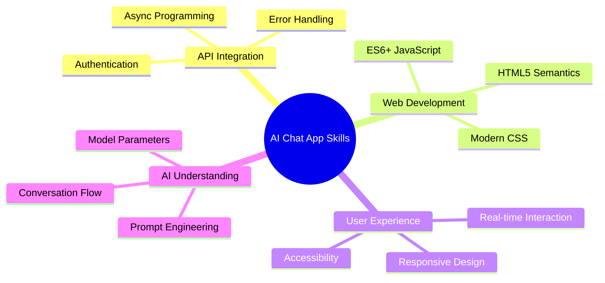

यस परियोजनाले तपाईंलाई एआई-संचालित अनुप्रयोगहरू निर्माणको आधारभूत कुराहरूमा परिचय गराएको छ, जसले वेब विकासको भविष्यलाई प्रतिनिधित्व गर्दछ। अब तपाईंले परम्परागत वेब अनुप्रयोगहरूमा एआई क्षमताहरू एकीकृत गर्ने तरिका बुझ्नुभएको छ, जसले बौद्धिक र उत्तरदायी महसुस हुने प्रयोगकर्ता अनुभवहरू सिर्जना गर्दछ।

### व्यावसायिक अनुप्रयोगहरू

यस पाठक्रममा तपाईंले विकास गरेका सीपहरू आधुनिक सफ्टवेयर विकास करियरहरूमा प्रत्यक्ष रूपमा लागू गर्न सकिन्छ:

- **आधुनिक फ्रेमवर्कहरू र APIहरू** प्रयोग गरेर फुल-स्ट्याक वेब विकास
- **वेब अनुप्रयोगहरू र मोबाइल एप्समा एआई एकीकरण**
- **माइक्रोसर्भिस आर्किटेक्चरहरूको लागि API डिजाइन र विकास**
- **पहुंचयोग्यता र उत्तरदायी डिजाइनमा ध्यान केन्द्रित गरेर प्रयोगकर्ता इन्टरफेस विकास**
- **पर्यावरण कन्फिगरेसन र डिप्लोयमेन्ट सहित DevOps अभ्यासहरू**

### तपाईंको एआई विकास यात्रा जारी राख्दै

**अगाडि सिक्ने कदमहरू:**
- **उन्नत एआई मोडेलहरू र APIहरू** (GPT-4, Claude, Gemini) अन्वेषण गर्नुहोस्
- **बेहतर एआई प्रतिक्रियाहरूको लागि प्रम्प्ट इन्जिनियरिङ प्रविधिहरू** सिक्नुहोस्
- **वार्तालाप डिजाइन र च्याटबोट प्रयोगकर्ता अनुभव सिद्धान्तहरू** अध्ययन गर्नुहोस्
- **एआई सुरक्षा, नैतिकता, र जिम्मेवार एआई विकास अभ्यासहरू** अनुसन्धान गर्नुहोस्
- **वार्तालाप मेमोरी र सन्दर्भ सचेतनतासहित थप जटिल अनुप्रयोगहरू निर्माण गर्नुहोस्**

**उन्नत परियोजना विचारहरू:**
- एआई मध्यस्थता सहित बहु-प्रयोगकर्ता च्याट कोठाहरू
- एआई-संचालित ग्राहक सेवा च्याटबोटहरू
- व्यक्तिगत शिक्षणको साथ शैक्षिक ट्युटरिंग सहायकहरू
- विभिन्न एआई व्यक्तित्वहरूसँग रचनात्मक लेखन सहयोगीहरू
- विकासकर्ताहरूको लागि प्राविधिक दस्तावेजीकरण सहायकहरू

## GitHub Codespaces सँग सुरु गर्दै

के तपाईं यो परियोजना क्लाउड विकास वातावरणमा प्रयास गर्न चाहनुहुन्छ? GitHub Codespaces ले तपाईंको ब्राउजरमा पूर्ण विकास सेटअप प्रदान गर्दछ, स्थानीय सेटअप आवश्यकताहरू बिना एआई अनुप्रयोगहरूमा प्रयोग गर्नको लागि उत्तम।

### तपाईंको विकास वातावरण सेटअप गर्दै

**चरण १: टेम्प्लेटबाट सिर्जना गर्नुहोस्**
- **[Web Dev For Beginners repository](https://github.com/microsoft/Web-Dev-For-Beginners)** मा जानुहोस्
- **शीर्ष-दायाँ कुनामा "Use this template" क्लिक गर्नुहोस्** (पक्का गर्नुहोस् कि तपाईं GitHub मा लगइन हुनुहुन्छ)

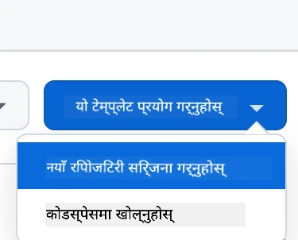

**चरण २: Codespaces सुरु गर्नुहोस्**
- **तपाईंको नयाँ सिर्जित रिपोजिटरी खोल्नुहोस्**
- **हरियो "Code" बटन क्लिक गर्नुहोस् र "Codespaces" चयन गर्नुहोस्**
- **"Create codespace on main" चयन गर्नुहोस्** ताकि तपाईंको विकास वातावरण सुरु होस्

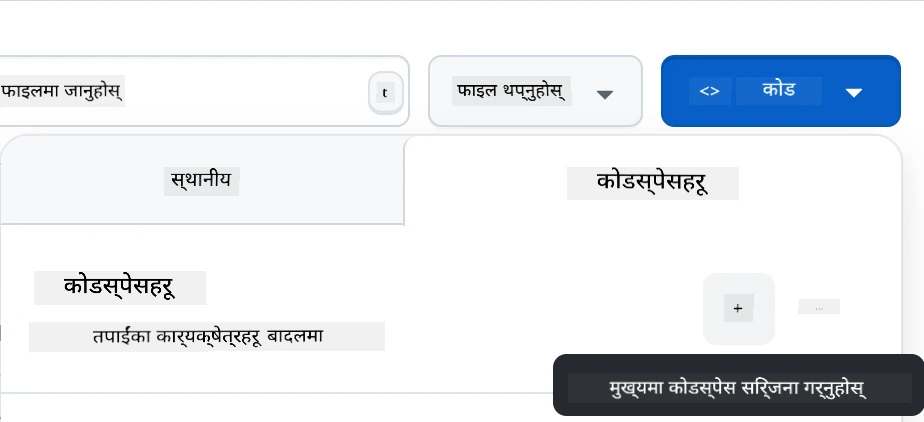

**चरण ३: वातावरण कन्फिगरेसन**
तपाईंको Codespace लोड भएपछि, तपाईंले पहुँच पाउनुहुनेछ:
- **पहिले नै इन्स्टल गरिएको** Python, Node.js, र सबै आवश्यक विकास उपकरणहरू
- **VS Code इन्टरफेस** जसमा वेब विकासका लागि एक्सटेन्सनहरू छन्
- **टर्मिनल पहुँच** ब्याकएन्ड र फ्रन्टएन्ड सर्भरहरू चलाउनको लागि
- **पोर्ट फर्वार्डिङ** तपाईंको अनुप्रयोगहरू परीक्षण गर्नको लागि

**Codespaces के प्रदान गर्दछ:**
- **स्थानीय वातावरण सेटअप र कन्फिगरेसन समस्याहरू हटाउँछ**
- **विभिन्न उपकरणहरूमा स्थिर विकास वातावरण प्रदान गर्दछ**
- **वेब विकासका लागि पूर्व-कन्फिगरेड उपकरणहरू र एक्सटेन्सनहरू समावेश गर्दछ**
- **GitHub सँग संस्करण नियन्त्रण र सहकार्यको लागि सहज एकीकरण प्रदान गर्दछ**

> 🚀 **प्रो टिप**: Codespaces एआई अनुप्रयोगहरू सिक्न र प्रोटोटाइप गर्नको लागि उत्तम हो किनभने यसले सबै जटिल वातावरण सेटअप स्वचालित रूपमा व्यवस्थापन गर्दछ, जसले तपाईंलाई निर्माण र सिकाइमा ध्यान केन्द्रित गर्न अनुमति दिन्छ।

---

**अस्वीकरण**:  
यो दस्तावेज़ AI अनुवाद सेवा [Co-op Translator](https://github.com/Azure/co-op-translator) प्रयोग गरेर अनुवाद गरिएको छ। हामी शुद्धताको लागि प्रयास गर्छौं, तर कृपया ध्यान दिनुहोस् कि स्वचालित अनुवादमा त्रुटिहरू वा अशुद्धताहरू हुन सक्छ। यसको मूल भाषा मा रहेको दस्तावेज़लाई आधिकारिक स्रोत मानिनुपर्छ। महत्वपूर्ण जानकारीको लागि, व्यावसायिक मानव अनुवाद सिफारिस गरिन्छ। यस अनुवादको प्रयोगबाट उत्पन्न हुने कुनै पनि गलतफहमी वा गलत व्याख्याको लागि हामी जिम्मेवार हुने छैनौं।