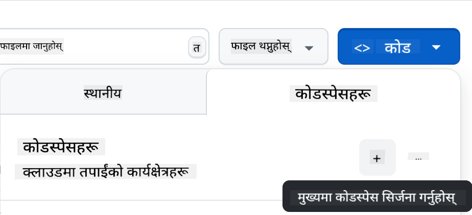

<!--
CO_OP_TRANSLATOR_METADATA:
{
  "original_hash": "002304ffe0059e55b33e2ee5283788ad",
  "translation_date": "2025-09-01T15:26:22+00:00",
  "source_file": "9-chat-project/README.md",
  "language_code": "ne"
}
-->
# च्याट प्रोजेक्ट

यो च्याट प्रोजेक्टले GitHub Models प्रयोग गरेर च्याट असिस्टेन्ट कसरी बनाउने भनेर देखाउँछ।

तपाईंले तयार प्रोजेक्ट यसरी देख्नुहुनेछ:

<div>
  
</div>

थप सन्दर्भका लागि, जेनेरेटिभ एआई प्रयोग गरेर च्याट असिस्टेन्ट बनाउनु एआई सिक्न सुरु गर्नको लागि उत्कृष्ट तरिका हो। यस पाठक्रममा, तपाईंले जेनेरेटिभ एआईलाई वेब एपमा कसरी एकीकृत गर्ने भनेर सिक्नुहुनेछ। सुरु गरौं।

## जेनेरेटिभ एआईसँग जडान गर्नुहोस्

ब्याकएन्डको लागि, हामी GitHub Models प्रयोग गर्दैछौं। यो एक उत्कृष्ट सेवा हो जसले तपाईंलाई निःशुल्क एआई प्रयोग गर्न सक्षम बनाउँछ। यसको प्लेग्राउन्डमा जानुहोस् र तपाईंको रोजाइको ब्याकएन्ड भाषासँग मेल खाने कोड लिनुहोस्। यो यसरी देखिन्छ: [GitHub Models Playground](https://github.com/marketplace/models/azure-openai/gpt-4o-mini/playground)

<div>
  
</div>

जसरी भनिएको छ, "Code" ट्याब र तपाईंको रोजाइको रनटाइम चयन गर्नुहोस्। 

<div>
  
</div>

### Python प्रयोग गर्दै

यस अवस्थामा, हामी Python चयन गर्छौं, जसले गर्दा हामीले यो कोड लिन्छौं:

```python
"""Run this model in Python

> pip install openai
"""
import os
from openai import OpenAI

# To authenticate with the model you will need to generate a personal access token (PAT) in your GitHub settings. 
# Create your PAT token by following instructions here: https://docs.github.com/en/authentication/keeping-your-account-and-data-secure/managing-your-personal-access-tokens
client = OpenAI(
    base_url="https://models.github.ai/inference",
    api_key=os.environ["GITHUB_TOKEN"],
)

response = client.chat.completions.create(
    messages=[
        {
            "role": "system",
            "content": "",
        },
        {
            "role": "user",
            "content": "What is the capital of France?",
        }
    ],
    model="openai/gpt-4o-mini",
    temperature=1,
    max_tokens=4096,
    top_p=1
)

print(response.choices[0].message.content)
```

यो कोडलाई पुन: प्रयोगयोग्य बनाउनका लागि सफा गरौं:

```python
def call_llm(prompt: str, system_message: str):
    response = client.chat.completions.create(
        messages=[
            {
                "role": "system",
                "content": system_message,
            },
            {
                "role": "user",
                "content": prompt,
            }
        ],
        model="openai/gpt-4o-mini",
        temperature=1,
        max_tokens=4096,
        top_p=1
    )

    return response.choices[0].message.content
```

`call_llm` नामक यो फङ्सनले अब एउटा प्रम्प्ट र सिस्टम प्रम्प्ट लिन्छ र परिणाम फर्काउँछ।

### एआई असिस्टेन्टलाई अनुकूलन गर्नुहोस्

यदि तपाईं एआई असिस्टेन्टलाई अनुकूलन गर्न चाहनुहुन्छ भने, तपाईं यसलाई कसरी व्यवहार गर्न चाहनुहुन्छ भनेर सिस्टम प्रम्प्टमा यसरी निर्दिष्ट गर्न सक्नुहुन्छ:

```python
call_llm("Tell me about you", "You're Albert Einstein, you only know of things in the time you were alive")
```

## यसलाई वेब एपीआई मार्फत सार्वजनिक गर्नुहोस्

उत्तम, हामीले एआई भाग पूरा गर्यौं, अब यसलाई वेब एपीआईमा कसरी एकीकृत गर्न सकिन्छ हेरौं। वेब एपीआईको लागि, हामी Flask प्रयोग गर्दैछौं, तर कुनै पनि वेब फ्रेमवर्क राम्रो हुन सक्छ। यसको कोड यसरी देखिन्छ:

### Python प्रयोग गर्दै

```python
# api.py
from flask import Flask, request, jsonify
from llm import call_llm
from flask_cors import CORS

app = Flask(__name__)
CORS(app)   # *   example.com

@app.route("/", methods=["GET"])
def index():
    return "Welcome to this API. Call POST /hello with 'message': 'my message' as JSON payload"


@app.route("/hello", methods=["POST"])
def hello():
    # get message from request body  { "message": "do this taks for me" }
    data = request.get_json()
    message = data.get("message", "")

    response = call_llm(message, "You are a helpful assistant.")
    return jsonify({
        "response": response
    })

if __name__ == "__main__":
    app.run(host="0.0.0.0", port=5000)
```

यहाँ, हामीले एउटा Flask API बनायौं र "/" र "/chat" नामक दुई रुट परिभाषित गर्यौं। दोस्रो रुट हाम्रो फ्रन्टएन्डले प्रश्नहरू पठाउन प्रयोग गर्ने उद्देश्यले बनाइएको हो।

*llm.py* लाई एकीकृत गर्नका लागि, हामीले निम्न गर्नुपर्छ:

- `call_llm` फङ्सन इम्पोर्ट गर्नुहोस्:

   ```python
   from llm import call_llm
   from flask import Flask, request
   ```

- "/chat" रुटबाट यसलाई कल गर्नुहोस्:

   ```python
   @app.route("/hello", methods=["POST"])
   def hello():
      # get message from request body  { "message": "do this taks for me" }
      data = request.get_json()
      message = data.get("message", "")

      response = call_llm(message, "You are a helpful assistant.")
      return jsonify({
         "response": response
      })
   ```

   यहाँ हामी इनकमिङ अनुरोधलाई पार्स गरेर JSON बडीबाट `message` प्रोपर्टी निकाल्छौं। त्यसपछि हामी LLM लाई यसरी कल गर्छौं:

   ```python
   response = call_llm(message, "You are a helpful assistant")

   # return the response as JSON
   return jsonify({
      "response": response 
   })
   ```

उत्तम, अब हामीले आवश्यक सबै काम गरिसक्यौं।

## Cors कन्फिगर गर्नुहोस्

हामीले CORS, अर्थात् क्रस-ओरिजिन रिसोर्स सेयरिङ सेटअप गरेको कुरा उल्लेख गर्नुपर्छ। यसको मतलब हाम्रो ब्याकएन्ड र फ्रन्टएन्ड फरक पोर्टमा चल्ने भएकाले, हामीले फ्रन्टएन्डलाई ब्याकएन्डमा कल गर्न अनुमति दिनुपर्छ। 

### Python प्रयोग गर्दै

*api.py* मा यो सेटअप गर्ने कोडको टुक्रा छ:

```python
from flask_cors import CORS

app = Flask(__name__)
CORS(app)   # *   example.com
```

हाल यो "*" अर्थात् सबै ओरिजिनलाई अनुमति दिन सेट गरिएको छ, जुन अलि असुरक्षित छ। उत्पादनमा जाँदा यसलाई सीमित गर्नुपर्छ।

## तपाईंको प्रोजेक्ट चलाउनुहोस्

तपाईंको प्रोजेक्ट चलाउन, पहिले ब्याकएन्ड र त्यसपछि फ्रन्टएन्ड सुरु गर्नुपर्छ।

### Python प्रयोग गर्दै

ठिक छ, हामीसँग *llm.py* र *api.py* छ, अब ब्याकएन्डसँग यो कसरी काम गर्ने बनाउने? दुई कुरा गर्नुपर्छ:

- निर्भरता इन्स्टल गर्नुहोस्:

   ```sh
   cd backend
   python -m venv venv
   source ./venv/bin/activate

   pip install openai flask flask-cors openai
   ```

- एपीआई सुरु गर्नुहोस्:

   ```sh
   python api.py
   ```

   यदि तपाईं Codespaces मा हुनुहुन्छ भने, सम्पादकको तल्लो भागमा रहेको पोर्टमा जानुहोस्, त्यसमा दायाँ-क्लिक गर्नुहोस् र "Port Visibility" मा क्लिक गरेर "Public" चयन गर्नुहोस्।

### फ्रन्टएन्डमा काम गर्नुहोस्

अब हामीसँग एपीआई चलिरहेको छ, यसका लागि फ्रन्टएन्ड बनाऔं। एक न्यूनतम फ्रन्टएन्ड जसलाई हामी क्रमशः सुधार गर्नेछौं। *frontend* फोल्डरमा निम्न बनाउनुहोस्:

```text
backend/
frontend/
index.html
app.js
styles.css
```

**index.html** बाट सुरु गरौं:

```html
<html>
    <head>
        <link rel="stylesheet" href="styles.css">
    </head>
    <body>
      <form>
        <textarea id="messages"></textarea>
        <input id="input" type="text" />
        <button type="submit" id="sendBtn">Send</button>  
      </form>  
      <script src="app.js" />
    </body>
</html>    
```

माथिको कोडले च्याट विन्डोलाई समर्थन गर्न आवश्यक न्यूनतम कुरा समावेश गर्दछ। यसमा सन्देशहरू देखाउनका लागि एउटा textarea, सन्देश टाइप गर्नका लागि इनपुट र ब्याकएन्डमा सन्देश पठाउनका लागि बटन छ। अब *app.js* मा JavaScript हेरौं:

**app.js**

```js
// app.js

(function(){
  // 1. set up elements  
  const messages = document.getElementById("messages");
  const form = document.getElementById("form");
  const input = document.getElementById("input");

  const BASE_URL = "change this";
  const API_ENDPOINT = `${BASE_URL}/hello`;

  // 2. create a function that talks to our backend
  async function callApi(text) {
    const response = await fetch(API_ENDPOINT, {
      method: "POST",
      headers: { "Content-Type": "application/json" },
      body: JSON.stringify({ message: text })
    });
    let json = await response.json();
    return json.response;
  }

  // 3. add response to our textarea
  function appendMessage(text, role) {
    const el = document.createElement("div");
    el.className = `message ${role}`;
    el.innerHTML = text;
    messages.appendChild(el);
  }

  // 4. listen to submit events
  form.addEventListener("submit", async(e) => {
    e.preventDefault();
   // someone clicked the button in the form
   
   // get input
   const text = input.value.trim();

   appendMessage(text, "user")

   // reset it
   input.value = '';

   const reply = await callApi(text);

   // add to messages
   appendMessage(reply, "assistant");

  })
})();
```

कोडलाई खण्ड अनुसार हेरौं:

- 1) यहाँ हामीले सबै तत्वहरूको रेफरेन्स लिन्छौं जसलाई पछि कोडमा प्रयोग गरिन्छ।
- 2) यस खण्डमा, हामीले `fetch` विधि प्रयोग गरेर ब्याकएन्डलाई कल गर्ने फङ्सन बनाउँछौं।
- 3) `appendMessage` ले प्रयोगकर्ताले टाइप गरेको र असिस्टेन्टको प्रतिक्रिया दुवै थप्न मद्दत गर्छ।
- 4) यहाँ हामीले submit इभेन्टलाई सुन्छौं र इनपुट फिल्ड पढ्छौं, प्रयोगकर्ताको सन्देशलाई textarea मा राख्छौं, एपीआईलाई कल गर्छौं, र प्रतिक्रिया textarea मा देखाउँछौं।

अब स्टाइलिङ हेरौं, यहाँ तपाईंले आफ्नो इच्छाअनुसार परिवर्तन गर्न सक्नुहुन्छ, तर केही सुझावहरू यस्ता छन्:

**styles.css**

```
.message {
    background: #222;
    box-shadow: 0 0 0 10px orange;
    padding: 10px:
    margin: 5px;
}

.message.user {
    background: blue;
}

.message.assistant {
    background: grey;
} 
```

यी तीन कक्षाहरूले सन्देशहरूलाई स्रोत अनुसार फरक तरिकाले स्टाइल गर्छन्, चाहे त्यो असिस्टेन्टबाट होस् वा प्रयोगकर्ताबाट। प्रेरणाका लागि, `solution/frontend/styles.css` फोल्डर हेर्नुहोस्।

### बेस युआरएल परिवर्तन गर्नुहोस्

यहाँ एउटा कुरा सेट गरिएको थिएन, त्यो हो `BASE_URL`, जुन ब्याकएन्ड सुरु नभएसम्म थाहा हुँदैन। यसलाई सेट गर्न:

- यदि तपाईंले एपीआई स्थानीय रूपमा चलाउनुहुन्छ भने, यो `http://localhost:5000` जस्तो हुनुपर्छ।
- यदि Codespaces मा चलाउनुहुन्छ भने, यो "[name]app.github.dev" जस्तो देखिन्छ।

## असाइनमेन्ट

तपाईंको आफ्नै *project* फोल्डर बनाउनुहोस् जसमा निम्न सामग्री होस्:

```text
project/
  frontend/
    index.html
    app.js
    styles.css
  backend/
    ...
```

माथि दिइएको निर्देशनबाट सामग्री प्रतिलिपि गर्नुहोस् तर तपाईंको इच्छाअनुसार अनुकूलन गर्न स्वतन्त्र महसुस गर्नुहोस्।

## समाधान

[Solution](./solution/README.md)

## बोनस

एआई असिस्टेन्टको व्यक्तित्व परिवर्तन गर्ने प्रयास गर्नुहोस्। 

### Python को लागि

जब तपाईं *api.py* मा `call_llm` कल गर्नुहुन्छ, तपाईं दोस्रो आर्गुमेन्टलाई आफ्नो इच्छाअनुसार परिवर्तन गर्न सक्नुहुन्छ, जस्तै:

```python
call_llm(message, "You are Captain Picard")
```

### फ्रन्टएन्ड

CSS र पाठलाई पनि आफ्नो इच्छाअनुसार परिवर्तन गर्नुहोस्, त्यसैले *index.html* र *styles.css* मा परिवर्तन गर्नुहोस्।

## संक्षेप

उत्तम, तपाईंले एआई प्रयोग गरेर व्यक्तिगत असिस्टेन्ट कसरी बनाउने भनेर सुरुबाट सिक्नुभयो। हामीले GitHub Models, Python मा ब्याकएन्ड, र HTML, CSS, JavaScript मा फ्रन्टएन्ड प्रयोग गरेर यो गरेका छौं।

## Codespaces सेटअप गर्नुहोस्

- यहाँ जानुहोस्: [Web Dev For Beginners repo](https://github.com/microsoft/Web-Dev-For-Beginners)
- टेम्प्लेटबाट सिर्जना गर्नुहोस् (GitHub मा लगइन भएको सुनिश्चित गर्नुहोस्) माथिल्लो दायाँ कुनामा:

    

- एकपटक तपाईंको रिपोमा, Codespace सिर्जना गर्नुहोस्:

    

    यसले तपाईंलाई काम गर्न मिल्ने वातावरण सुरु गर्नेछ।

---

**अस्वीकरण**:  
यो दस्तावेज़ AI अनुवाद सेवा [Co-op Translator](https://github.com/Azure/co-op-translator) प्रयोग गरेर अनुवाद गरिएको छ। हामी शुद्धताको लागि प्रयास गर्छौं, तर कृपया ध्यान दिनुहोस् कि स्वचालित अनुवादहरूमा त्रुटिहरू वा अशुद्धताहरू हुन सक्छ। यसको मूल भाषा मा रहेको मूल दस्तावेज़लाई आधिकारिक स्रोत मानिनुपर्छ। महत्वपूर्ण जानकारीको लागि, व्यावसायिक मानव अनुवाद सिफारिस गरिन्छ। यस अनुवादको प्रयोगबाट उत्पन्न हुने कुनै पनि गलतफहमी वा गलत व्याख्याको लागि हामी जिम्मेवार हुने छैनौं।