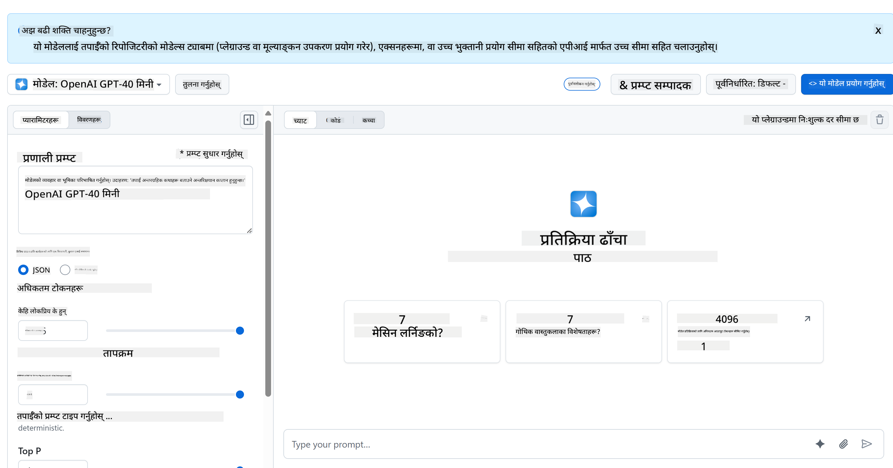

<!--
CO_OP_TRANSLATOR_METADATA:
{
  "original_hash": "51406271f80e4b452de0023147809658",
  "translation_date": "2025-10-20T21:38:58+00:00",
  "source_file": "9-chat-project/README.md",
  "language_code": "ne"
}
-->
# च्याट प्रोजेक्ट

यो च्याट प्रोजेक्टले GitHub Models प्रयोग गरेर च्याट सहायक कसरी निर्माण गर्ने भनेर देखाउँछ।

तपाईंको अन्तिम प्रोजेक्ट यस्तो देखिन्छ:


थप सन्दर्भको लागि, जेनेरेटिभ AI प्रयोग गरेर च्याट सहायक निर्माण गर्नु AI सिक्न सुरु गर्नको लागि उत्कृष्ट तरिका हो। यस पाठको क्रममा तपाईंले जेनेरेटिभ AI लाई वेब एपमा कसरी एकीकृत गर्ने भनेर सिक्नुहुनेछ। सुरु गरौं।

## जेनेरेटिभ AIसँग जडान गर्नुहोस्

ब्याकएन्डको लागि, हामी GitHub Models प्रयोग गर्दैछौं। यो एक उत्कृष्ट सेवा हो जसले तपाईंलाई निःशुल्क AI प्रयोग गर्न सक्षम बनाउँछ। यसको प्लेग्राउन्डमा जानुहोस् र तपाईंको छनोट गरिएको ब्याकएन्ड भाषासँग मेल खाने कोड प्राप्त गर्नुहोस्। यो [GitHub Models Playground](https://github.com/marketplace/models/azure-openai/gpt-4o-mini/playground) मा यस्तो देखिन्छ।



जसरी भनिएको थियो, "Code" ट्याब र तपाईंको छनोट गरिएको रनटाइम चयन गर्नुहोस्।


### Python प्रयोग गर्दै

यस अवस्थामा हामी Python चयन गर्छौं, जसको अर्थ हामी यो कोड लिन्छौं:

```python
"""Run this model in Python

> pip install openai
"""
import os
from openai import OpenAI

# To authenticate with the model you will need to generate a personal access token (PAT) in your GitHub settings. 
# Create your PAT token by following instructions here: https://docs.github.com/en/authentication/keeping-your-account-and-data-secure/managing-your-personal-access-tokens
client = OpenAI(
    base_url="https://models.github.ai/inference",
    api_key=os.environ["GITHUB_TOKEN"],
)

response = client.chat.completions.create(
    messages=[
        {
            "role": "system",
            "content": "",
        },
        {
            "role": "user",
            "content": "What is the capital of France?",
        }
    ],
    model="openai/gpt-4o-mini",
    temperature=1,
    max_tokens=4096,
    top_p=1
)

print(response.choices[0].message.content)
```

यो कोडलाई थोरै सफा गरौं ताकि यो पुन: प्रयोग गर्न सकियोस्:

```python
def call_llm(prompt: str, system_message: str):
    response = client.chat.completions.create(
        messages=[
            {
                "role": "system",
                "content": system_message,
            },
            {
                "role": "user",
                "content": prompt,
            }
        ],
        model="openai/gpt-4o-mini",
        temperature=1,
        max_tokens=4096,
        top_p=1
    )

    return response.choices[0].message.content
```

यो `call_llm` फङ्क्सनको साथमा हामी अब एक प्रम्प्ट र सिस्टम प्रम्प्ट लिन सक्छौं र फङ्क्सनले नतिजा फर्काउँछ।

### AI सहायकलाई अनुकूलित गर्नुहोस्

यदि तपाईं AI सहायकलाई अनुकूलित गर्न चाहनुहुन्छ भने तपाईंले सिस्टम प्रम्प्टलाई यसरी भरिदिन सक्नुहुन्छ:

```python
call_llm("Tell me about you", "You're Albert Einstein, you only know of things in the time you were alive")
```

## यसलाई वेब API मार्फत सार्वजनिक गर्नुहोस्

उत्कृष्ट, हामीले AI भाग पूरा गर्यौं, अब हामी यसलाई वेब API मा कसरी एकीकृत गर्न सकिन्छ हेर्नुहोस्। वेब API को लागि, हामी Flask प्रयोग गर्दैछौं, तर कुनै पनि वेब फ्रेमवर्क राम्रो हुनुपर्छ। यसको कोड हेर्नुहोस्:

### Python प्रयोग गर्दै

```python
# api.py
from flask import Flask, request, jsonify
from llm import call_llm
from flask_cors import CORS

app = Flask(__name__)
CORS(app)   # *   example.com

@app.route("/", methods=["GET"])
def index():
    return "Welcome to this API. Call POST /hello with 'message': 'my message' as JSON payload"


@app.route("/hello", methods=["POST"])
def hello():
    # get message from request body  { "message": "do this taks for me" }
    data = request.get_json()
    message = data.get("message", "")

    response = call_llm(message, "You are a helpful assistant.")
    return jsonify({
        "response": response
    })

if __name__ == "__main__":
    app.run(host="0.0.0.0", port=5000)
```

यहाँ, हामी एक फ्लास्क API सिर्जना गर्छौं र "/" र "/chat" नामक डिफल्ट रुट परिभाषित गर्छौं। पछिल्लो हाम्रो फ्रन्टएन्डले प्रश्नहरू पठाउन प्रयोग गर्नको लागि हो।

*llm.py* लाई एकीकृत गर्नको लागि हामीले निम्न गर्नुपर्छ:

- `call_llm` फङ्क्सन आयात गर्नुहोस्:

   ```python
   from llm import call_llm
   from flask import Flask, request
   ```

- "/chat" रुटबाट यसलाई कल गर्नुहोस्:

   ```python
   @app.route("/hello", methods=["POST"])
   def hello():
      # get message from request body  { "message": "do this taks for me" }
      data = request.get_json()
      message = data.get("message", "")

      response = call_llm(message, "You are a helpful assistant.")
      return jsonify({
         "response": response
      })
   ```

   यहाँ हामी आउने अनुरोधलाई JSON बडीबाट `message` प्रोपर्टी पुन: प्राप्त गर्नको लागि पार्स गर्छौं। त्यसपछि हामी यस कलको साथ LLM कल गर्छौं:

   ```python
   response = call_llm(message, "You are a helpful assistant")

   # return the response as JSON
   return jsonify({
      "response": response 
   })
   ```

उत्कृष्ट, अब हामीले आवश्यक काम गर्यौं।

## Cors कन्फिगर गर्नुहोस्

हामीले Cors, क्रस-ओरिजिन रिसोर्स सेयरिङ जस्तो केही सेटअप गरेको कुरा उल्लेख गर्नुपर्छ। यसको मतलब हाम्रो ब्याकएन्ड र फ्रन्टएन्ड फरक पोर्टमा चल्ने भएकाले, हामीले फ्रन्टएन्डलाई ब्याकएन्डमा कल गर्न अनुमति दिनुपर्छ।

### Python प्रयोग गर्दै

*api.py* मा एउटा कोडको टुक्रा छ जसले यसलाई सेटअप गर्छ:

```python
from flask_cors import CORS

app = Flask(__name__)
CORS(app)   # *   example.com
```

अहिले यो "*" लाई अनुमति दिन सेटअप गरिएको छ जुन सबै ओरिजिन हो र यो अलि असुरक्षित छ, हामीले यसलाई उत्पादनमा जाँदा सीमित गर्नुपर्छ।

## आफ्नो प्रोजेक्ट चलाउनुहोस्

आफ्नो प्रोजेक्ट चलाउनको लागि, तपाईंले पहिले आफ्नो ब्याकएन्ड सुरु गर्नुपर्छ र त्यसपछि आफ्नो फ्रन्टएन्ड।

### Python प्रयोग गर्दै

ठिक छ, हामीसँग *llm.py* र *api.py* छ, हामी यसलाई ब्याकएन्डसँग कसरी काम गर्न सक्दछौं? खैर, दुई कुरा गर्नुपर्छ:

- निर्भरता स्थापना गर्नुहोस्:

   ```sh
   cd backend
   python -m venv venv
   source ./venv/bin/activate

   pip install openai flask flask-cors openai
   ```

- API सुरु गर्नुहोस्

   ```sh
   python api.py
   ```

   यदि तपाईं Codespaces मा हुनुहुन्छ भने तपाईंले सम्पादकको तलको भागमा पोर्टमा जानुहोस्, त्यसमा राइट-क्लिक गर्नुहोस् र "Port Visibility" क्लिक गर्नुहोस् र "Public" चयन गर्नुहोस्।

### फ्रन्टएन्डमा काम गर्नुहोस्

अब हामीसँग API चलिरहेको छ, हामी यसको लागि फ्रन्टएन्ड सिर्जना गरौं। एक न्यूनतम फ्रन्टएन्ड जसलाई हामी चरणबद्ध रूपमा सुधार गर्नेछौं। *frontend* फोल्डरमा निम्न सिर्जना गर्नुहोस्:

```text
backend/
frontend/
index.html
app.js
styles.css
```

सुरु गरौं **index.html** बाट:

```html
<html>
    <head>
        <link rel="stylesheet" href="styles.css">
    </head>
    <body>
      <form>
        <textarea id="messages"></textarea>
        <input id="input" type="text" />
        <button type="submit" id="sendBtn">Send</button>  
      </form>  
      <script src="app.js" />
    </body>
</html>    
```

माथिको कोड च्याट विन्डोलाई समर्थन गर्नको लागि न्यूनतम आवश्यक छ, किनकि यसमा सन्देशहरू प्रस्तुत गरिने टेक्स्टएरिया, सन्देश टाइप गर्नको लागि इनपुट र ब्याकएन्डमा सन्देश पठाउनको लागि बटन समावेश छ। अब *app.js* मा JavaScript हेर्नुहोस्।

**app.js**

```js
// app.js

(function(){
  // 1. set up elements  
  const messages = document.getElementById("messages");
  const form = document.getElementById("form");
  const input = document.getElementById("input");

  const BASE_URL = "change this";
  const API_ENDPOINT = `${BASE_URL}/hello`;

  // 2. create a function that talks to our backend
  async function callApi(text) {
    const response = await fetch(API_ENDPOINT, {
      method: "POST",
      headers: { "Content-Type": "application/json" },
      body: JSON.stringify({ message: text })
    });
    let json = await response.json();
    return json.response;
  }

  // 3. add response to our textarea
  function appendMessage(text, role) {
    const el = document.createElement("div");
    el.className = `message ${role}`;
    el.innerHTML = text;
    messages.appendChild(el);
  }

  // 4. listen to submit events
  form.addEventListener("submit", async(e) => {
    e.preventDefault();
   // someone clicked the button in the form
   
   // get input
   const text = input.value.trim();

   appendMessage(text, "user")

   // reset it
   input.value = '';

   const reply = await callApi(text);

   // add to messages
   appendMessage(reply, "assistant");

  })
})();
```

कोडलाई खण्ड अनुसार जाँच गरौं:

- 1) यहाँ हामी सबै तत्वहरूको सन्दर्भ प्राप्त गर्छौं जसलाई हामी पछि कोडमा सन्दर्भ दिनेछौं।
- 2) यस खण्डमा, हामी एक फङ्क्सन सिर्जना गर्छौं जसले बिल्ट-इन `fetch` मेथड प्रयोग गर्छ र हाम्रो ब्याकएन्डलाई कल गर्छ।
- 3) `appendMessage` ले प्रतिक्रियाहरू थप्न मद्दत गर्छ साथै तपाईंले प्रयोगकर्ता रूपमा टाइप गर्नुभएको कुरा।
- 4) यहाँ हामी सबमिट इभेन्टलाई सुन्छौं र अन्ततः इनपुट फिल्ड पढ्छौं, प्रयोगकर्ताको सन्देशलाई टेक्स्टएरियामा राख्छौं, API कल गर्छौं, र टेक्स्टएरियामा प्रतिक्रिया प्रस्तुत गर्छौं।

अब स्टाइलिङ हेर्नुहोस्, यहाँ तपाईं साँच्चै क्रिएटिभ हुन सक्नुहुन्छ र यसलाई तपाईंले चाहेको जस्तो देखाउन सक्नुहुन्छ, तर यहाँ केही सुझावहरू छन्:

**styles.css**

```
.message {
    background: #222;
    box-shadow: 0 0 0 10px orange;
    padding: 10px:
    margin: 5px;
}

.message.user {
    background: blue;
}

.message.assistant {
    background: grey;
} 
```

यी तीन कक्षाहरूको साथमा, तपाईंले सन्देशहरूलाई सहायकबाट वा प्रयोगकर्ताबाट आएको आधारमा फरक तरिकाले स्टाइल गर्नुहुनेछ। यदि तपाईं प्रेरित हुन चाहनुहुन्छ भने, `solution/frontend/styles.css` फोल्डर हेर्नुहोस्।

### बेस URL परिवर्तन गर्नुहोस्

यहाँ एउटा कुरा छ जुन हामीले सेट गरेनौं र त्यो हो `BASE_URL`, यो तपाईंको ब्याकएन्ड सुरु नभएसम्म थाहा हुँदैन। यसलाई सेट गर्न:

- यदि तपाईंले API स्थानीय रूपमा चलाउनुहुन्छ भने, यसलाई `http://localhost:5000` जस्तो सेट गर्नुपर्छ।
- यदि Codespaces मा चलाउनुहुन्छ भने, यो "[name]app.github.dev" जस्तो देखिनुपर्छ।

## GitHub Copilot Agent Challenge 🚀

Agent मोड प्रयोग गरेर निम्न चुनौती पूरा गर्नुहोस्:

**विवरण:** च्याट सहायकलाई सुधार गरेर वार्तालाप इतिहास र सन्देश स्थायित्व थप्नुहोस्। यो चुनौतीले तपाईंलाई च्याट एप्लिकेसनहरूमा स्टेट व्यवस्थापन कसरी गर्ने र राम्रो प्रयोगकर्ता अनुभवको लागि डाटा भण्डारण कार्यान्वयन गर्ने बुझ्न मद्दत गर्नेछ।

**प्रम्प्ट:** च्याट एप्लिकेसनलाई संशोधन गरेर वार्तालाप इतिहास समावेश गर्नुहोस् जसले सत्रहरू बीचमा स्थायित्व कायम राख्छ। च्याट सन्देशहरूलाई स्थानीय भण्डारणमा बचत गर्ने, पृष्ठ लोड हुँदा वार्तालाप इतिहास देखाउने, र "Clear History" बटन समावेश गर्ने कार्यक्षमता थप्नुहोस्। साथै टाइपिङ संकेतकहरू र सन्देशको टाइमस्ट्याम्पहरू कार्यान्वयन गर्नुहोस् ताकि च्याट अनुभवलाई अझ वास्तविक बनाइयोस्।

## असाइनमेन्ट

आफ्नै *project* नामक फोल्डर सिर्जना गर्नुहोस् जसमा यस्तो सामग्री होस्:

```text
project/
  frontend/
    index.html
    app.js
    styles.css
  backend/
    ...
```

माथि उल्लेख गरिएको सामग्रीबाट प्रतिलिपि गर्नुहोस् तर तपाईंको इच्छाअनुसार अनुकूलन गर्न स्वतन्त्र महसुस गर्नुहोस्।

## समाधान

[Solution](./solution/README.md)

## बोनस

AI सहायकको व्यक्तित्व परिवर्तन गर्न प्रयास गर्नुहोस्।

### Python को लागि

जब तपाईं *api.py* मा `call_llm` कल गर्नुहुन्छ, तपाईंले दोस्रो आर्गुमेन्टलाई आफ्नो इच्छाअनुसार परिवर्तन गर्न सक्नुहुन्छ, उदाहरणका लागि:

```python
call_llm(message, "You are Captain Picard")
```

### फ्रन्टएन्ड

CSS र पाठलाई पनि आफ्नो इच्छाअनुसार परिवर्तन गर्नुहोस्, त्यसैले *index.html* र *styles.css* मा परिवर्तन गर्नुहोस्।

## सारांश

उत्कृष्ट, तपाईंले AI प्रयोग गरेर व्यक्तिगत सहायक कसरी सिर्जना गर्ने भनेर सुरुबाट सिक्नुभयो। हामीले GitHub Models, Python मा ब्याकएन्ड र HTML, CSS र JavaScript मा फ्रन्टएन्ड प्रयोग गरेर यो गरेका छौं।

## Codespaces सेटअप गर्नुहोस्

- जानुहोस्: [Web Dev For Beginners repo](https://github.com/microsoft/Web-Dev-For-Beginners)
- टेम्प्लेटबाट सिर्जना गर्नुहोस् (पक्का गर्नुहोस् कि तपाईं GitHub मा लगइन हुनुहुन्छ) माथि-दायाँ कुनामा:

    

- एकपटक तपाईंको रिपोमा, Codespace सिर्जना गर्नुहोस्:

    

    यसले अब तपाईं काम गर्न सक्ने वातावरण सुरु गर्नुपर्छ।

---

**अस्वीकरण**:  
यो दस्तावेज AI अनुवाद सेवा [Co-op Translator](https://github.com/Azure/co-op-translator) प्रयोग गरेर अनुवाद गरिएको छ। हामी शुद्धताको लागि प्रयास गर्छौं, तर कृपया ध्यान दिनुहोस् कि स्वचालित अनुवादमा त्रुटि वा अशुद्धता हुन सक्छ। यसको मूल भाषा मा रहेको दस्तावेजलाई आधिकारिक स्रोत मानिनुपर्छ। महत्वपूर्ण जानकारीको लागि, व्यावसायिक मानव अनुवाद सिफारिस गरिन्छ। यस अनुवादको प्रयोगबाट उत्पन्न हुने कुनै पनि गलतफहमी वा गलत व्याख्याको लागि हामी जिम्मेवार हुने छैनौं।