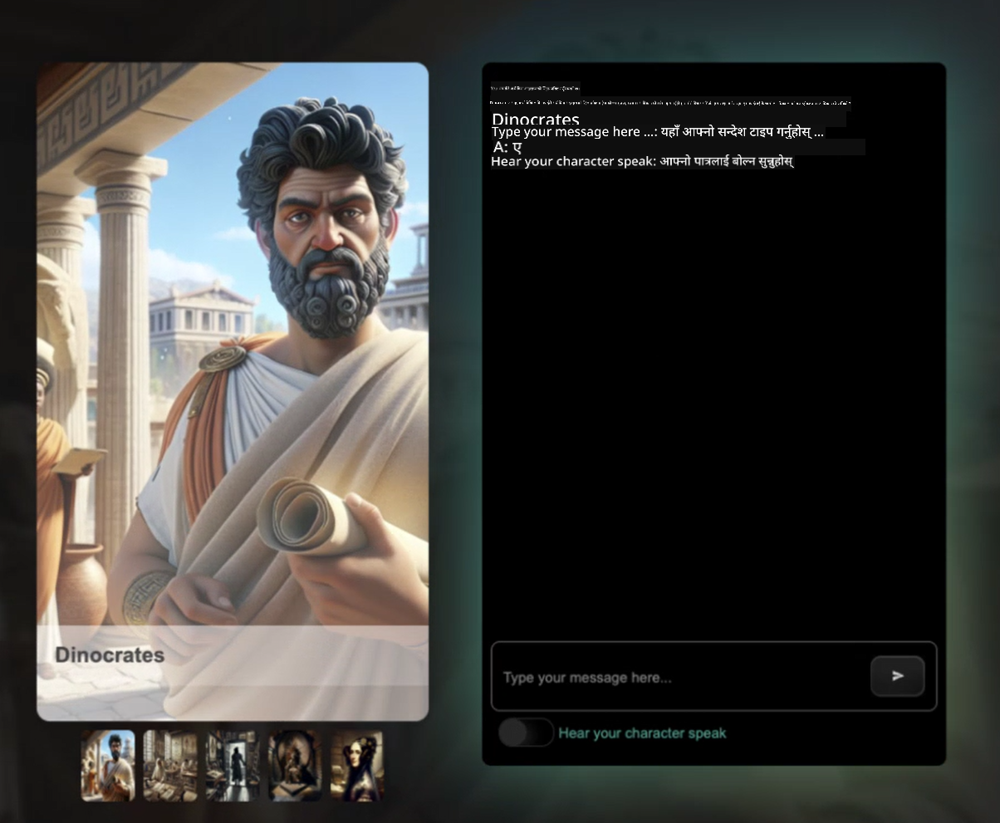

<!--
CO_OP_TRANSLATOR_METADATA:
{
  "original_hash": "687c62646ad5595f1ba733edc294cdae",
  "translation_date": "2025-08-28T16:26:59+00:00",
  "source_file": "README.md",
  "language_code": "ne"
}
-->
[](https://github.com/microsoft/Web-Dev-For-Beginners/blob/master/LICENSE)
[](https://GitHub.com/microsoft/Web-Dev-For-Beginners/graphs/contributors/)
[](https://GitHub.com/microsoft/Web-Dev-For-Beginners/issues/)
[](https://GitHub.com/microsoft/Web-Dev-For-Beginners/pulls/)
[](http://makeapullrequest.com)

[](https://GitHub.com/microsoft/Web-Dev-For-Beginners/watchers/)
[](https://GitHub.com/microsoft/Web-Dev-For-Beginners/network/)
[](https://GitHub.com/microsoft/Web-Dev-For-Beginners/stargazers/)

[](https://discord.gg/zxKYvhSnVp?WT.mc_id=academic-000002-leestott)

[](https://open.vscode.dev/microsoft/Web-Dev-For-Beginners)

[](https://discord.com/invite/ByRwuEEgH4)

यी स्रोतहरू प्रयोग गर्न सुरु गर्न निम्न चरणहरू अनुसरण गर्नुहोस्:
1. **रिपोजिटरीलाई फोर्क गर्नुहोस्**: [](https://GitHub.com/microsoft/Web-Dev-For-Beginners/fork) मा क्लिक गर्नुहोस्।
2. **रिपोजिटरीलाई क्लोन गर्नुहोस्**:   `git clone https://github.com/microsoft/Web-Dev-For-Beginners.git`
3. [**Azure AI Foundry Discord मा सामेल हुनुहोस् र विशेषज्ञहरू तथा अन्य विकासकर्तासँग भेट गर्नुहोस्**](https://discord.com/invite/ByRwuEEgH4)

# शुरुवातका लागि वेब विकास - एक पाठ्यक्रम

Microsoft Cloud Advocates द्वारा तयार गरिएको हाम्रो १२ हप्ताको व्यापक पाठ्यक्रमको साथ वेब विकासको आधारभूत कुरा सिक्नुहोस्। प्रत्येक २४ पाठले JavaScript, CSS, र HTML मा व्यावहारिक परियोजनाहरू जस्तै टेरारियम, ब्राउजर एक्सटेन्सन, र स्पेस गेमहरू मार्फत गहिरो जानकारी दिन्छ। क्विजहरू, छलफलहरू, र व्यावहारिक असाइनमेन्टहरूमा संलग्न हुनुहोस्। हाम्रो प्रभावकारी परियोजना-आधारित शिक्षण विधिको साथ आफ्नो सीप सुधार गर्नुहोस् र ज्ञानको प्रतिधारणलाई अनुकूलित गर्नुहोस्। आजै आफ्नो कोडिङ यात्रा सुरु गर्नुहोस्!

### 🌐 बहुभाषी समर्थन

#### GitHub Action मार्फत समर्थित (स्वचालित र सधैं अद्यावधिक)

[French](../fr/README.md) | [Spanish](../es/README.md) | [German](../de/README.md) | [Russian](../ru/README.md) | [Arabic](../ar/README.md) | [Persian (Farsi)](../fa/README.md) | [Urdu](../ur/README.md) | [Chinese (Simplified)](../zh/README.md) | [Chinese (Traditional, Macau)](../mo/README.md) | [Chinese (Traditional, Hong Kong)](../hk/README.md) | [Chinese (Traditional, Taiwan)](../tw/README.md) | [Japanese](../ja/README.md) | [Korean](../ko/README.md) | [Hindi](../hi/README.md) | [Bengali](../bn/README.md) | [Marathi](../mr/README.md) | [Nepali](./README.md) | [Punjabi (Gurmukhi)](../pa/README.md) | [Portuguese (Portugal)](../pt/README.md) | [Portuguese (Brazil)](../br/README.md) | [Italian](../it/README.md) | [Polish](../pl/README.md) | [Turkish](../tr/README.md) | [Greek](../el/README.md) | [Thai](../th/README.md) | [Swedish](../sv/README.md) | [Danish](../da/README.md) | [Norwegian](../no/README.md) | [Finnish](../fi/README.md) | [Dutch](../nl/README.md) | [Hebrew](../he/README.md) | [Vietnamese](../vi/README.md) | [Indonesian](../id/README.md) | [Malay](../ms/README.md) | [Tagalog (Filipino)](../tl/README.md) | [Swahili](../sw/README.md) | [Hungarian](../hu/README.md) | [Czech](../cs/README.md) | [Slovak](../sk/README.md) | [Romanian](../ro/README.md) | [Bulgarian](../bg/README.md) | [Serbian (Cyrillic)](../sr/README.md) | [Croatian](../hr/README.md) | [Slovenian](../sl/README.md) | [Ukrainian](../uk/README.md) | [Burmese (Myanmar)](../my/README.md)

**यदि तपाईंले थप भाषाहरूको अनुवाद चाहनुहुन्छ भने यहाँ सूचीबद्ध छन् [यहाँ](https://github.com/Azure/co-op-translator/blob/main/getting_started/supported-languages.md)**

#### 🧑‍🎓 _तपाईं विद्यार्थी हुनुहुन्छ?_

[**Student Hub पृष्ठ**](https://docs.microsoft.com/learn/student-hub/?WT.mc_id=academic-77807-sagibbon) मा जानुहोस् जहाँ तपाईंले शुरुवातका स्रोतहरू, विद्यार्थी प्याकहरू र नि:शुल्क प्रमाणपत्र भौचर प्राप्त गर्ने तरिकाहरू पाउनुहुनेछ। यो पृष्ठलाई बुकमार्क गर्नुहोस् र समय-समयमा जाँच गर्नुहोस् किनभने हामी मासिक रूपमा सामग्री परिवर्तन गर्छौं।

### 📣 घोषणा - _Generative AI प्रयोग गरेर नयाँ परियोजना निर्माण गर्नुहोस्_ 

नयाँ AI सहायक परियोजना हालै थपिएको छ, यसलाई [परियोजना](./09-chat-project/README.md) मा हेर्नुहोस्।

### 📣 घोषणा - _Generative AI को नयाँ पाठ्यक्रम_ JavaScript को लागि हालै जारी गरिएको छ

हाम्रो नयाँ Generative AI पाठ्यक्रम नछुटाउनुहोस्!

सुरु गर्न [https://aka.ms/genai-js-course](https://aka.ms/genai-js-course) मा जानुहोस्!


- आधारभूतदेखि RAG सम्मका पाठहरू।
- GenAI र हाम्रो साथी एप प्रयोग गरेर ऐतिहासिक पात्रहरूसँग अन्तरक्रिया गर्नुहोस्।
- रमाइलो र आकर्षक कथा, तपाईं समय यात्रा गर्दै हुनुहुनेछ!



प्रत्येक पाठमा असाइनमेन्ट, ज्ञान जाँच, र चुनौती समावेश छ जसले तपाईंलाई निम्न विषयहरू सिक्न मार्गदर्शन गर्दछ:
- प्रम्प्टिङ र प्रम्प्ट इन्जिनियरिङ
- टेक्स्ट र इमेज एप निर्माण
- सर्च एपहरू

सुरु गर्न [https://aka.ms/genai-js-course](https://aka.ms/genai-js-course) मा जानुहोस्!


## 🌱 शुरुवात गर्दै

> **शिक्षकहरू**, हामीले [केही सुझावहरू समावेश गरेका छौं](for-teachers.md) यो पाठ्यक्रम कसरी प्रयोग गर्ने। हाम्रो [चर्चा फोरममा](https://github.com/microsoft/Web-Dev-For-Beginners/discussions/categories/teacher-corner) तपाईंको प्रतिक्रिया चाहन्छौं!

**[शिक्षार्थीहरू](https://aka.ms/student-page/?WT.mc_id=academic-77807-sagibbon)**, प्रत्येक पाठको लागि, प्रि-लेक्चर क्विजबाट सुरु गर्नुहोस् र लेक्चर सामग्री पढ्दै, विभिन्न गतिविधिहरू पूरा गर्दै र पोस्ट-लेक्चर क्विजको साथ आफ्नो बुझाइ जाँच गर्नुहोस्।

तपाईंको सिकाइ अनुभवलाई सुधार गर्न, परियोजनाहरूमा सँगै काम गर्नका लागि तपाईंका साथीहरूसँग जडान गर्नुहोस्! हाम्रो [चर्चा फोरममा](https://github.com/microsoft/Web-Dev-For-Beginners/discussions) छलफललाई प्रोत्साहन गरिन्छ जहाँ हाम्रो मोडरेटरहरूको टोली तपाईंका प्रश्नहरूको उत्तर दिन उपलब्ध हुनेछ।

तपाईंको शिक्षा अगाडि बढाउन, हामी [Microsoft Learn](https://learn.microsoft.com/users/wirelesslife/collections/p1ddcy5jwy0jkm?WT.mc_id=academic-77807-sagibbon) मा थप अध्ययन सामग्री अन्वेषण गर्न अत्यधिक सिफारिस गर्छौं।

### 📋 तपाईंको वातावरण सेटअप गर्दै

यो पाठ्यक्रमसँग विकास वातावरण तयार छ! सुरु गर्दा तपाईं [Codespace](https://github.com/features/codespaces/) (_ब्राउजर-आधारित, कुनै स्थापना आवश्यक छैन_) मा पाठ्यक्रम चलाउन वा तपाईंको कम्प्युटरमा स्थानीय रूपमा [Visual Studio Code](https://code.visualstudio.com/?WT.mc_id=academic-77807-sagibbon) जस्ता टेक्स्ट एडिटर प्रयोग गर्न छनोट गर्न सक्नुहुन्छ।

#### तपाईंको रिपोजिटरी बनाउनुहोस्
तपाईंको काम सजिलै बचत गर्न, तपाईंले यो रिपोजिटरीको आफ्नै प्रतिलिपि बनाउनु सिफारिस गरिन्छ। तपाईंले पृष्ठको माथि रहेको **Use this template** बटनमा क्लिक गरेर यो गर्न सक्नुहुन्छ। यसले तपाईंको GitHub खातामा पाठ्यक्रमको प्रतिलिपि सहित नयाँ रिपोजिटरी बनाउनेछ।

यी चरणहरू अनुसरण गर्नुहोस्:
1. **रिपोजिटरीलाई फोर्क गर्नुहोस्**: यस पृष्ठको माथि-दायाँ कुनामा रहेको "Fork" बटनमा क्लिक गर्नुहोस्।
2. **रिपोजिटरीलाई क्लोन गर्नुहोस्**:   `git clone https://github.com/microsoft/Web-Dev-For-Beginners.git`

#### Codespace मा पाठ्यक्रम चलाउँदै

तपाईंले बनाएको यस रिपोजिटरीको प्रतिलिपिमा, **Code** बटनमा क्लिक गर्नुहोस् र **Open with Codespaces** चयन गर्नुहोस्। यसले तपाईंलाई काम गर्न नयाँ Codespace बनाउनेछ।

[!Codespace](../..)./images/createcodespace.png)

#### तपाईंको कम्प्युटरमा स्थानीय रूपमा पाठ्यक्रम चलाउँदै

तपाईंको कम्प्युटरमा यो पाठ्यक्रम चलाउन, तपाईंलाई टेक्स्ट एडिटर, ब्राउजर र कमाण्ड लाइन उपकरण आवश्यक हुनेछ। हाम्रो पहिलो पाठ, [प्रोग्रामिङ भाषाहरू र उपकरणहरूको परिचय](../../1-getting-started-lessons/1-intro-to-programming-languages), तपाईंलाई यी उपकरणहरूको लागि विभिन्न विकल्पहरूमा मार्गदर्शन गर्नेछ ताकि तपाईंलाई उपयुक्त लाग्ने विकल्प चयन गर्न सक्नुहुन्छ।

हाम्रो सिफारिस [Visual Studio Code](https://code.visualstudio.com/?WT.mc_id=academic-77807-sagibbon) प्रयोग गर्नु हो, जसमा [Terminal](https://code.visualstudio.com/docs/terminal/basics/?WT.mc_id=academic-77807-sagibbon) पनि समावेश छ। तपाईं [यहाँ](https://code.visualstudio.com/?WT.mc_id=academic-77807-sagibbon) बाट Visual Studio Code डाउनलोड गर्न सक्नुहुन्छ।

1. तपाईंको रिपोजिटरीलाई तपाईंको कम्प्युटरमा क्लोन गर्नुहोस्। तपाईंले **Code** बटनमा क्लिक गरेर र URL प्रतिलिपि गरेर यो गर्न सक्नुहुन्छ:

    [!CodeSpace](./images/createcodespace.png)

    त्यसपछि, [Visual Studio Code](https://code.visualstudio.com/?WT.mc_id=academic-77807-sagibbon) भित्र [Terminal](https://code.visualstudio.com/docs/terminal/basics/?WT.mc_id=academic-77807-sagibbon) खोल्नुहोस् र तपाईंले प्रतिलिपि गरेको URL साटेर निम्न कमाण्ड चलाउनुहोस्:

    ```bash 
    git clone <your-repository-url>
    ```

2. Visual Studio Code मा फोल्डर खोल्नुहोस्। तपाईंले **File** मा क्लिक गरेर यो गर्न सक्नुहुन्छ।
> **फोल्डर खोल्नुहोस्** र तपाईंले भर्खरै क्लोन गरेको फोल्डर चयन गर्नुहोस्।
>  भिजुअल स्टुडियो कोडका लागि सिफारिस गरिएका एक्सटेन्सनहरू:
>
> * [Live Server](https://marketplace.visualstudio.com/items?itemName=ritwickdey.LiveServer&WT.mc_id=academic-77807-sagibbon) - HTML पेजहरूलाई भिजुअल स्टुडियो कोडमा प्रिभ्यू गर्न
> * [Copilot](https://marketplace.visualstudio.com/items?itemName=GitHub.copilot&WT.mc_id=academic-77807-sagibbon) - कोड छिटो लेख्न सहयोग गर्न

## 📂 प्रत्येक पाठमा समावेश:

- वैकल्पिक स्केच नोट
- वैकल्पिक पूरक भिडियो
- पाठ अघि वार्मअप क्विज
- लिखित पाठ
- प्रोजेक्ट-आधारित पाठहरूको लागि, प्रोजेक्ट निर्माणको चरण-दर-चरण मार्गदर्शन
- ज्ञान जाँच
- चुनौती
- पूरक पढाइ
- असाइनमेन्ट
- [पाठपछि क्विज](https://ff-quizzes.netlify.app/web/)

> **क्विजहरूको बारेमा नोट**: सबै क्विजहरू `Quiz-app` फोल्डरमा समावेश छन्, कुल ४८ क्विजहरू, प्रत्येकमा तीन प्रश्न। यी [यहाँ](https://ff-quizzes.netlify.app/web/) उपलब्ध छन्। क्विज एपलाई स्थानीय रूपमा चलाउन वा Azure मा डिप्लोय गर्न सकिन्छ; `quiz-app` फोल्डरमा दिइएको निर्देशनहरू पालना गर्नुहोस्।

## 🗃️ पाठहरू

|     |                       प्रोजेक्ट नाम                       |                            सिकाइने अवधारणाहरू                             | सिकाइका उद्देश्यहरू                                                                                                                 |                                                         लिंक गरिएको पाठ                                                          |         लेखक          |
| :-: | :------------------------------------------------------: | :--------------------------------------------------------------------: | ----------------------------------------------------------------------------------------------------------------------------------- | :----------------------------------------------------------------------------------------------------------------------------: | :---------------------: |
| 01  |                     सुरुवात गर्दै                      |           प्रोग्रामिङको परिचय र प्रयोग गरिने उपकरणहरू           | अधिकांश प्रोग्रामिङ भाषाहरूको आधारभूत संरचना र पेशेवर डेभलपरहरूले प्रयोग गर्ने सफ्टवेयरको बारेमा जान्नुहोस् | [प्रोग्रामिङ भाषाहरू र उपकरणहरूको परिचय](./1-getting-started-lessons/1-intro-to-programming-languages/README.md) |         Jasmine         |
| 02  |                     सुरुवात गर्दै                      |             GitHub को आधारभूत कुरा, टिमसँग काम गर्ने समावेश             | आफ्नो प्रोजेक्टमा GitHub कसरी प्रयोग गर्ने, कोड बेसमा अरूसँग कसरी सहकार्य गर्ने                                                    |                            [GitHub को परिचय](./1-getting-started-lessons/2-github-basics/README.md)                             |          Floor          |
| 03  |                     सुरुवात गर्दै                      |                             पहुँचयोग्यता                              | वेब पहुँचयोग्यताको आधारभूत कुरा जान्नुहोस्                                                                                               |                       [पहुंचयोग्यता आधारभूत कुरा](./1-getting-started-lessons/3-accessibility/README.md)                       |       Christopher       |
| 04  |                        JS आधारभूत कुरा                         |                         JavaScript डेटा प्रकार                          | JavaScript डेटा प्रकारहरूको आधारभूत कुरा                                                                                                 |                                       [डेटा प्रकारहरू](./2-js-basics/1-data-types/README.md)                                        |         Jasmine         |
| 05  |                        JS आधारभूत कुरा                         |                         फङ्क्सनहरू र मेथडहरू                          | एप्लिकेसनको तर्क प्रवाह व्यवस्थापन गर्न फङ्क्सनहरू र मेथडहरूको बारेमा जान्नुहोस्                                                             |                              [फङ्क्सनहरू र मेथडहरू](./2-js-basics/2-functions-methods/README.md)                               | Jasmine and Christopher |
| 06  |                        JS आधारभूत कुरा                         |                        JS प्रयोग गरेर निर्णय लिने                        | निर्णय लिने विधिहरू प्रयोग गरेर आफ्नो कोडमा सर्तहरू सिर्जना गर्ने तरिका जान्नुहोस्                                                           |                                 [निर्णय लिने](./2-js-basics/3-making-decisions/README.md)                                  |         Jasmine         |
| 07  |                        JS आधारभूत कुरा                         |                            Arrays र लूपहरू                            | JavaScript मा डेटा प्रयोग गर्न Arrays र लूपहरूको प्रयोग                                                                                 |                                   [Arrays र लूपहरू](./2-js-basics/4-arrays-loops/README.md)                                    |         Jasmine         |
| 08  |       [Terrarium](./3-terrarium/solution/README.md)       |                            HTML अभ्यासमा                            | अनलाइन Terrarium निर्माण गर्न HTML बनाउनुहोस्, लेआउट निर्माणमा ध्यान केन्द्रित गर्दै                                                         |                                 [HTML को परिचय](./3-terrarium/1-intro-to-html/README.md)                                 |           Jen           |
| 09  |       [Terrarium](./3-terrarium/solution/README.md)       |                            CSS अभ्यासमा                             | अनलाइन Terrarium लाई स्टाइल गर्न CSS बनाउनुहोस्, CSS को आधारभूत कुरा सहित पेजलाई उत्तरदायी बनाउनेमा ध्यान केन्द्रित गर्दै                     |                                  [CSS को परिचय](./3-terrarium/2-intro-to-css/README.md)                                  |           Jen           |
| 10  |            [Terrarium](./3-terrarium/solution/README.md)            |                 JavaScript Closures, DOM ह्यान्डलिङ                  | Terrarium लाई ड्र्याग/ड्रप इन्टरफेसको रूपमा कार्य गर्न JavaScript बनाउनुहोस्, Closures र DOM ह्यान्डलिङमा ध्यान केन्द्रित गर्दै             |                  [JavaScript Closures, DOM ह्यान्डलिङ](./3-terrarium/3-intro-to-DOM-and-closures/README.md)                   |           Jen           |
| 11  |          [Typing Game](./4-typing-game/solution/README.md)          |                          टाइपिङ गेम निर्माण                           | आफ्नो JavaScript एपको तर्कलाई चलाउन किबोर्ड इभेन्टहरूको प्रयोग गर्ने तरिका जान्नुहोस्                                                          |                                [इभेन्ट-ड्रिभन प्रोग्रामिङ](./4-typing-game/typing-game/README.md)                                |       Christopher       |
| 12  | [Green Browser Extension](./5-browser-extension/solution/README.md) |                         ब्राउजरसँग काम गर्ने                          | ब्राउजरहरू कसरी काम गर्छन्, तिनीहरूको इतिहास, र ब्राउजर एक्सटेन्सनको पहिलो तत्वहरूको संरचना कसरी बनाउने                               |                               [ब्राउजरहरूको बारेमा](./5-browser-extension/1-about-browsers/README.md)                                |           Jen           |
| 13  | [Green Browser Extension](./5-browser-extension/solution/README.md) | फारम निर्माण गर्ने, API कल गर्ने र स्थानीय स्टोरेजमा भेरिएबलहरू राख्ने | स्थानीय स्टोरेजमा राखिएका भेरिएबलहरूको प्रयोग गरेर API कल गर्न आफ्नो ब्राउजर एक्सटेन्सनको JavaScript तत्वहरू निर्माण गर्नुहोस्                      |                [APIs, फारमहरू, र स्थानीय स्टोरेज](./5-browser-extension/2-forms-browsers-local-storage/README.md)                 |           Jen           |
| 14  | [Green Browser Extension](./5-browser-extension/solution/README.md) |          ब्राउजरको पृष्ठभूमि प्रक्रिया, वेब प्रदर्शन          | ब्राउजरको पृष्ठभूमि प्रक्रियाहरू प्रयोग गरेर एक्सटेन्सनको आइकन व्यवस्थापन गर्नुहोस्; वेब प्रदर्शन र केही अनुकूलनहरूको बारेमा जान्नुहोस्   |             [पृष्ठभूमि कार्यहरू र प्रदर्शन](./5-browser-extension/3-background-tasks-and-performance/README.md)              |           Jen           |
| 15  |           [Space Game](./6-space-game/solution/README.md)           |             JavaScript प्रयोग गरेर उन्नत गेम विकास             | गेम निर्माणको तयारीमा Classes र Composition प्रयोग गरेर Inheritance र Pub/Sub पाटर्नको बारेमा जान्नुहोस्              |                      [उन्नत गेम विकासको परिचय](./6-space-game/1-introduction/README.md)                       |          Chris          |
| 16  |           [Space Game](./6-space-game/solution/README.md)           |                           क्यानभासमा चित्र बनाउने                            | स्क्रिनमा तत्वहरू चित्र बनाउन प्रयोग गरिने Canvas API को बारेमा जान्नुहोस्                                                                       |                                [क्यानभासमा चित्र बनाउने](./6-space-game/2-drawing-to-canvas/README.md)                                |          Chris          |
| 17  |           [Space Game](./6-space-game/solution/README.md)           |                   स्क्रिनमा तत्वहरू सार्ने                    | Cartesian coordinates र Canvas API प्रयोग गरेर तत्वहरूलाई गति कसरी दिन सकिन्छ जान्नुहोस्                                            |                           [तत्वहरू सार्ने](./6-space-game/3-moving-elements-around/README.md)                           |          Chris          |
| 18  |           [Space Game](./6-space-game/solution/README.md)           |                          टक्कर पत्ता लगाउने                           | तत्वहरूलाई एक-अर्कासँग टक्कर गर्न र प्रतिक्रिया दिन बनाउनुहोस्, keypress प्रयोग गरेर; गेमको प्रदर्शन सुनिश्चित गर्न cooldown फङ्क्सन प्रदान गर्नुहोस्    |                              [टक्कर पत्ता लगाउने](./6-space-game/4-collision-detection/README.md)                              |          Chris          |
| 19  |           [Space Game](./6-space-game/solution/README.md)           |                             स्कोर राख्ने                              | गेमको स्थिति र प्रदर्शनको आधारमा गणितीय गणना गर्नुहोस्                                                                |                                    [स्कोर राख्ने](./6-space-game/5-keeping-score/README.md)                                    |          Chris          |
| 20  |           [Space Game](./6-space-game/solution/README.md)           |                     गेम समाप्त गर्ने र पुनः सुरु गर्ने                     | गेम समाप्त गर्ने र पुनः सुरु गर्ने तरिका जान्नुहोस्, जसमा सम्पत्ति सफा गर्ने र भेरिएबल मानहरू पुनः सेट गर्ने समावेश छ                              |                                [समाप्ति अवस्था](./6-space-game/6-end-condition/README.md)                                 |          Chris          |
| 21  |         [Banking App](./7-bank-project/solution/README.md)          |                 वेब एपमा HTML टेम्प्लेटहरू र रूटहरू                 | रूटिङ र HTML टेम्प्लेटहरू प्रयोग गरेर बहुपृष्ठ वेबसाइटको संरचना कसरी बनाउने जान्नुहोस्                             |                            [HTML टेम्प्लेटहरू र रूटहरू](./7-bank-project/1-template-route/README.md)                             |          Yohan          |
| 22  |         [Banking App](./7-bank-project/solution/README.md)          |                  लगइन र रजिस्ट्रेसन फारम निर्माण गर्नुहोस्                   | फारमहरू निर्माण गर्ने र मान्यकरण प्रक्रियाहरू ह्यान्डल गर्ने बारेमा जान्नुहोस्                                                                          |                                           [फारमहरू](./7-bank-project/2-forms/README.md)                                           |          Yohan          |
| 23  |         [Banking App](./7-bank-project/solution/README.md)          |                   डेटा प्राप्त गर्ने र प्रयोग गर्ने विधिहरू                   | डेटा कसरी एपमा आउँछ र बाहिर जान्छ, कसरी प्राप्त गर्ने, स्टोर गर्ने, र हटाउने                                                 |                                            [डेटा](./7-bank-project/3-data/README.md)                                            |          Yohan          |
| 24  |         [Banking App](./7-bank-project/solution/README.md)          |                      राज्य व्यवस्थापनको अवधारणाहरू                      | आफ्नो एपले राज्य कसरी राख्छ र यसलाई प्रोग्राममार्फत कसरी व्यवस्थापन गर्ने जान्नुहोस्                                                              |                                [राज्य व्यवस्थापन](./7-bank-project/4-state-management/README.md)                                |          Yohan          |
| 25 | [Browser/VScode Code](../../8-code-editor) | VScode प्रयोग गर्ने | कोड एडिटर प्रयोग गर्ने तरिका जान्नुहोस्| [VScode कोड एडिटर प्रयोग गर्नुहोस्](./8-code-editor/1-using-a-code-editor/README.md) | Chris |
| 26 | [AI Assistants](./9-chat-project/README.md) | AIसँग काम गर्ने | आफ्नो AI सहायक निर्माण गर्ने तरिका जान्नुहोस् | [AI सहायक प्रोजेक्ट](./9-chat-project/README.md) | Chris |

## 🏫 शिक्षाशास्त्र

हाम्रो पाठ्यक्रम दुई प्रमुख शिक्षाशास्त्रीय सिद्धान्तहरूमा आधारित छ:
* प्रोजेक्ट-आधारित सिकाइ
* बारम्बार क्विजहरू

कार्यक्रमले JavaScript, HTML, र CSS को आधारभूत कुरा सिकाउँछ, साथै आजका वेब डेभलपरहरूले प्रयोग गर्ने नवीनतम उपकरण र प्रविधिहरू। विद्यार्थीहरूले टाइपिङ गेम, भर्चुअल Terrarium, इको-फ्रेन्डली ब्राउजर एक्सटेन्सन, स्पेस-इनभेडर शैलीको गेम, र व्यवसायहरूको लागि बैंकिङ एप निर्माण गरेर व्यावहारिक अनुभव प्राप्त गर्ने अवसर पाउनेछन्। श्रृंखला समाप्त हुँदा, विद्यार्थीहरूले वेब विकासको ठोस समझ प्राप्त गरेका हुनेछन्।

> 🎓 तपाईं यस पाठ्यक्रमका केही प्रारम्भिक पाठहरू [Microsoft Learn](https://docs.microsoft.com/learn/paths/web-development-101/?WT.mc_id=academic-77807-sagibbon) मा [Learn Path](https://docs.microsoft.com/learn/paths/web-development-101/?WT.mc_id=academic-77807-sagibbon) को रूपमा लिन सक्नुहुन्छ!

पाठ्यक्रमलाई प्रोजेक्टहरूसँग मिलाएर सुनिश्चित गर्दा, प्रक्रिया विद्यार्थीहरूको लागि थप आकर्षक बनाइन्छ र अवधारणाहरूको सम्झना बढाइन्छ। हामीले JavaScript को आधारभूत कुरा सिकाउनका लागि केही प्रारम्भिक पाठहरू लेखेका छौं, जसमा "[Beginners Series to: JavaScript](https://channel9.msdn.com/Series/Beginners-Series-to-JavaScript/?WT.mc_id=academic-77807-sagibbon)" भिडियो ट्युटोरियलहरूको संग्रहबाट भिडियोहरू समावेश छन्, जसका केही लेखकहरूले यस पाठ्यक्रममा योगदान दिएका छन्।

यसका अतिरिक्त, कक्षाको अघि कम-जोखिमको क्विजले विद्यार्थीलाई विषयवस्तु सिक्न प्रेरित गर्छ, जबकि कक्षापछि दोस्रो क्विजले अवधारणाको सम्झना सुनिश्चित गर्छ। यो पाठ्यक्रम लचिलो र रमाइलो बनाउन डिजाइन गरिएको हो र पूर्ण वा आंशिक रूपमा लिन सकिन्छ। प्रोजेक्टहरू साना स्तरबाट सुरु हुन्छन् र १२ हप्ताको चक्रको अन्त्यसम्ममा क्रमशः जटिल बन्दै जान्छन्।

हामीले जानाजानी JavaScript फ्रेमवर्कहरूलाई परिचय नगराई वेब डेभलपरको रूपमा आवश्यक आधारभूत सीपहरू सिकाउन ध्यान केन्द्रित गरेका छौं। पाठ्यक्रम पूरा गरेपछि अर्को राम्रो कदम भनेको Node.js को बारेमा सिक्नु हो, जसका लागि अर्को भिडियो संग्रह उपलब्ध छ: "[Beginner Series to: Node.js](https://channel9.msdn.com/Series/Beginners-Series-to-Nodejs/?WT.mc_id=academic-77807-sagibbon)".

> हाम्रो [Code of Conduct](CODE_OF_CONDUCT.md) र [Contributing](CONTRIBUTING.md) दिशानिर्देशहरू हेर्नुहोस्। हामी तपाईंको रचनात्मक प्रतिक्रिया स्वागत गर्दछौं!


## 🧭 अफलाइन पहुँच

तपाईं [Docsify](https://docsify.js.org/#/) प्रयोग गरेर यो डकुमेन्टेसनलाई अफलाइन चलाउन सक्नुहुन्छ। यो रिपोजिटरीलाई Fork गर्नुहोस्, आफ्नो स्थानीय मेसिनमा [Docsify स्थापना गर्नुहोस्](https://docsify.js.org/#/quickstart), र त्यसपछि यो रिपोजिटरीको रुट फोल्डरमा `docsify serve` टाइप गर्नुहोस्। वेबसाइट तपाईंको localhost मा पोर्ट 3000 मा चलाइनेछ: `localhost:3000`.

## 📘 PDF

सबै पाठहरूको PDF [यहाँ](https://microsoft.github.io/Web-Dev-For-Beginners/pdf/readme.pdf) फेला पार्न सकिन्छ।


## 🎒 अन्य पाठ्यक्रमहरू

हाम्रो टिमले अन्य पाठ्यक्रमहरू उत्पादन गर्छ! हेर्नुहोस्:

- [Generative AI for Beginners](https://aka.ms/genai-beginners)
- [Generative AI for Beginners .NET](https://github.com/microsoft/Generative-AI-for-beginners-dotnet)
- [Generative AI with JavaScript](https://github.com/microsoft/generative-ai-with-javascript)
- [Generative AI with Java](https://github.com/microsoft/Generative-AI-for-beginners-java)
- [AI for Beginners](https://aka.ms/ai-beginners)
- [डाटा साइन्सको लागि शुरुवात](https://aka.ms/datascience-beginners)
- [मेसिन लर्निङको लागि शुरुवात](https://aka.ms/ml-beginners)
- [साइबर सुरक्षा को लागि शुरुवात](https://github.com/microsoft/Security-101)
- [वेब विकासको लागि शुरुवात](https://aka.ms/webdev-beginners)
- [इन्टरनेट अफ थिङ्स (IoT) को लागि शुरुवात](https://aka.ms/iot-beginners)
- [XR विकासको लागि शुरुवात](https://github.com/microsoft/xr-development-for-beginners)
- [एजेन्टिक प्रयोगको लागि GitHub Copilot को मास्टरी](https://github.com/microsoft/Mastering-GitHub-Copilot-for-Paired-Programming)
- [C#/.NET विकासकर्ताहरूको लागि GitHub Copilot को मास्टरी](https://github.com/microsoft/mastering-github-copilot-for-dotnet-csharp-developers)
- [आफ्नै Copilot साहसिक यात्रा चयन गर्नुहोस्](https://github.com/microsoft/CopilotAdventures)

## लाइसेन्स

यो रिपोजिटरी MIT लाइसेन्स अन्तर्गत लाइसेन्स गरिएको छ। थप जानकारीको लागि [LICENSE](../../LICENSE) फाइल हेर्नुहोस्।

---

**अस्वीकरण**:  
यो दस्तावेज़ AI अनुवाद सेवा [Co-op Translator](https://github.com/Azure/co-op-translator) प्रयोग गरेर अनुवाद गरिएको हो। हामी शुद्धताको लागि प्रयास गर्छौं, तर कृपया ध्यान दिनुहोस् कि स्वचालित अनुवादमा त्रुटिहरू वा अशुद्धताहरू हुन सक्छ। यसको मूल भाषा मा रहेको मूल दस्तावेज़लाई आधिकारिक स्रोत मानिनुपर्छ। महत्वपूर्ण जानकारीको लागि, व्यावसायिक मानव अनुवाद सिफारिस गरिन्छ। यस अनुवादको प्रयोगबाट उत्पन्न हुने कुनै पनि गलतफहमी वा गलत व्याख्याको लागि हामी जिम्मेवार हुने छैनौं।