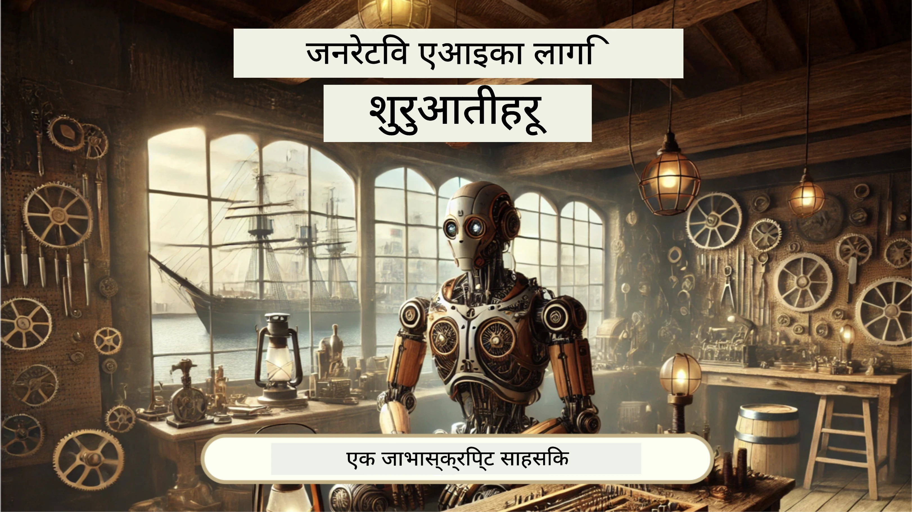
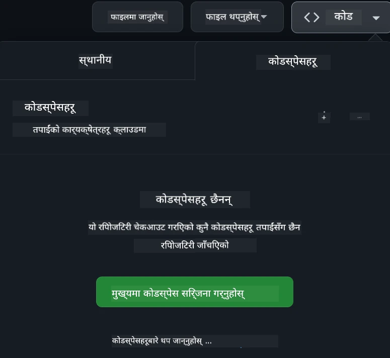

# वेब विकास आरम्भकर्ताहरूका लागि - एक पाठ्यक्रम

माइक्रोसफ्ट क्लाउड एड्भोकेट्स द्वारा प्रदान गरिएको हाम्रो १२ हप्ताको समग्र पाठ्यक्रमसँग वेब विकासका आधारभूत कुरा सिक्नुहोस्। २४ वटा पाठहरू प्रत्येकमा जाभास्क्रिप्ट, CSS, र HTML लाई प्रायोगात्मक परियोजनाहरू जस्तै टेरारियम, ब्राउजर एक्सटेन्शन, र अन्तरिक्ष खेलहरू मार्फत गहिराइमा अध्ययन गरिएको छ। क्विजहरू, छलफलहरू, र व्यावहारिक कार्यहरूमा संलग्न हुनुहोस्। हाम्रो प्रभावकारी परियोजना-आधारित शिक्षण विधिसँग तपाईंको सीप सुधार गर्नुहोस् र ज्ञानको अवधारणालाई अप्टिमाइज गर्नुहोस्। आजै आफ्नो कोडिङ यात्रा सुरु गर्नुहोस्!

एज्योर AI फाउन्ड्री डिस्कोर्ड समुदायमा सामेल हुनुहोस्

[](https://discord.gg/nTYy5BXMWG)

यी स्रोतहरू प्रयोग गर्न शुरु गर्न यी कदमहरू पालना गर्नुहोस्:
1. **रेपोजिटरी फरक गर्नुहोस्**: Click [](https://GitHub.com/microsoft/Web-Dev-For-Beginners/fork)
2. **रेपोजिटरी क्लोन गर्नुहोस्**:   `git clone https://github.com/microsoft/Web-Dev-For-Beginners.git`
3. [**एज्योर AI फाउन्ड्री डिस्कोर्डमा सामेल हुनुहोस् र विशेषज्ञहरू र सहकर्मी विकासकर्ताहरूलाई भेट्नुहोस्**](https://discord.com/invite/ByRwuEEgH4)

### 🌐 बहु-भाषा समर्थन

#### GitHub Action द्वारा समर्थित (स्वचालित र सदैव अद्यावधिक)

<!-- CO-OP TRANSLATOR LANGUAGES TABLE START -->
[Arabic](../ar/README.md) | [Bengali](../bn/README.md) | [Bulgarian](../bg/README.md) | [Burmese (Myanmar)](../my/README.md) | [Chinese (Simplified)](../zh-CN/README.md) | [Chinese (Traditional, Hong Kong)](../zh-HK/README.md) | [Chinese (Traditional, Macau)](../zh-MO/README.md) | [Chinese (Traditional, Taiwan)](../zh-TW/README.md) | [Croatian](../hr/README.md) | [Czech](../cs/README.md) | [Danish](../da/README.md) | [Dutch](../nl/README.md) | [Estonian](../et/README.md) | [Finnish](../fi/README.md) | [French](../fr/README.md) | [German](../de/README.md) | [Greek](../el/README.md) | [Hebrew](../he/README.md) | [Hindi](../hi/README.md) | [Hungarian](../hu/README.md) | [Indonesian](../id/README.md) | [Italian](../it/README.md) | [Japanese](../ja/README.md) | [Kannada](../kn/README.md) | [Korean](../ko/README.md) | [Lithuanian](../lt/README.md) | [Malay](../ms/README.md) | [Malayalam](../ml/README.md) | [Marathi](../mr/README.md) | [Nepali](./README.md) | [Nigerian Pidgin](../pcm/README.md) | [Norwegian](../no/README.md) | [Persian (Farsi)](../fa/README.md) | [Polish](../pl/README.md) | [Portuguese (Brazil)](../pt-BR/README.md) | [Portuguese (Portugal)](../pt-PT/README.md) | [Punjabi (Gurmukhi)](../pa/README.md) | [Romanian](../ro/README.md) | [Russian](../ru/README.md) | [Serbian (Cyrillic)](../sr/README.md) | [Slovak](../sk/README.md) | [Slovenian](../sl/README.md) | [Spanish](../es/README.md) | [Swahili](../sw/README.md) | [Swedish](../sv/README.md) | [Tagalog (Filipino)](../tl/README.md) | [Tamil](../ta/README.md) | [Telugu](../te/README.md) | [Thai](../th/README.md) | [Turkish](../tr/README.md) | [Ukrainian](../uk/README.md) | [Urdu](../ur/README.md) | [Vietnamese](../vi/README.md)

> **स्थानीय रूपमा क्लोन गर्न चाहनुहुन्छ?**

> यस रेपोजिटरीमा ५० भन्दा बढी भाषा अनुवादहरू समावेश छन् जसले डाउनलोड आकार धेरै बढाउँछ। अनुवाद विना क्लोन गर्न, sparse checkout प्रयोग गर्नुहोस्:
> ```bash
> git clone --filter=blob:none --sparse https://github.com/microsoft/Web-Dev-For-Beginners.git
> cd Web-Dev-For-Beginners
> git sparse-checkout set --no-cone '/*' '!translations' '!translated_images'
> ```
> यसले तपाईंलाई कोर्स पूरा गर्न आवश्यक सबै कुरा दिन्छ र छिटो डाउनलोड गरिन्छ।
<!-- CO-OP TRANSLATOR LANGUAGES TABLE END -->

**यदि तपाईं थप अनुवाद भाषाहरू समर्थन गर्न चाहनुहुन्छ भने ती [यहाँ](https://github.com/Azure/co-op-translator/blob/main/getting_started/supported-languages.md) सूचीबद्ध छन्**

[](https://open.vscode.dev/microsoft/Web-Dev-For-Beginners)

#### 🧑‍🎓 _के तपाईं विद्यार्थी हुनुहुन्छ?_

[**स्टुडेन्ट हब पृष्ठमा जानुहोस्**](https://docs.microsoft.com/learn/student-hub/?WT.mc_id=academic-77807-sagibbon) जहाँ तपाईंले आरम्भकर्ताका लागि स्रोतहरू, विद्यार्थी प्याकहरू र निःशुल्क प्रमाणपत्र भाउचर प्राप्त गर्ने तरिकाहरू पाउनुहुनेछ। यो पृष्ठ तपाईंले पोस्ट गर्नुपर्ने र समय-समयमा जाँच गर्नु पर्ने पृष्ठ हो किनभने हामी हरेक महिनामा सामग्री परिवर्तन गर्दैछौं।

### 📣 घोषणा - नयाँ GitHub Copilot Agent मोड चुनौतीहरू पूरा गर्न!

नयाँ चुनौती थपिएको छ, धेरै अध्यायहरूमा "GitHub Copilot Agent चुनौती 🚀" हेर्नुहोस्। यो GitHub Copilot र Agent मोड प्रयोग गरेर तपाईंले पूरा गर्नुपर्ने नयाँ चुनौती हो। यदि तपाईंले पहिला Agent मोड प्रयोग गर्नुभएन भने यसको क्षमता केवल पाठ मात्र उत्पन्न गर्नु छैन, यसले फाइलहरू बनाउन र सम्पादन गर्न, कमाण्डहरू चलाउन र अन्य धेरै गर्न सक्छ।

### 📣 घोषणा - _नयाँ परियोजना जनरेटिभ AI प्रयोग गरी निर्माण गर्ने_

नयाँ AI सहायक परियोजना भर्खरै थपिएको छ, यो परियोजना [यहाँ](./9-chat-project/README.md) जाँच गर्नुहोस्।

### 📣 घोषणा - _नयाँ पाठ्यक्रम_ जनरेटिभ AI को लागि जाभास्क्रिप्टमा भर्खरै जारी गरिएको

हाम्रो नयाँ जनरेटिभ AI पाठ्यक्रम नछुट्नुहोस्!

शुरू गर्न यहाँ जानुहोस् [https://aka.ms/genai-js-course](https://aka.ms/genai-js-course)!



- आधारदेखि RAG सम्म सबै कुरा समेट्ने पाठहरू।
- GenAI र हाम्रो साथी एपमार्फत ऐतिहासिक पात्रहरूसँग अन्तरक्रिया गर्नुहोस्।
- रमाइलो र आकर्षक कथा, तपाईं समय यात्रामा हुनुहुनेछ!


प्रत्येक पाठमा पूरा गर्नुपर्ने एउटा असाइनमेन्ट, ज्ञान जाँच, र चुनौती समावेश छ, जसले तपाईंलाई यी विषयहरू सिक्न गाइड गर्छ:
- प्रॉम्प्टिङ र प्रॉम्प्ट ईन्जिनियरिङ
- पाठ र छवि एप उत्पादन
- खोज एपहरू

शुरु गर्न यहाँ जानुहोस् [https://aka.ms/genai-js-course](https://aka.ms/genai-js-course)


## 🌱 सुरु गर्ने तरिका

> **शिक्षकहरू**, हामीले [यस पाठ्यक्रमलाई कसरी प्रयोग गर्ने बारे केही सुझावहरू](for-teachers.md) समावेश गरेका छौं। हामी तपाईंको प्रतिक्रिया [हाम्रो छलफल फोरम](https://github.com/microsoft/Web-Dev-For-Beginners/discussions/categories/teacher-corner) मा पाउन इच्छुक छौं!

**[अध्यार्थीहरू](https://aka.ms/student-page/?WT.mc_id=academic-77807-sagibbon)**, प्रत्येक पाठको लागि, प्रि-लेक्चर क्विजबाट सुरु गर्नुहोस् र व्याख्यान सामग्री पढ्दै, विभिन्न गतिविधिहरू पूरा गर्दै र पोस्ट-लेक्चर क्विजसँग बुझाइ जाँच गर्दै अघि बढ्नुहोस्।

तपाईंको सिकाइ अनुभव बढाउन, तपाईंका साथीहरूसँग परियोजनाहरूमा सँगै काम गर्न जडान हुनुहोस्! छलफलहरू हाम्रो [चर्चा फोरम](https://github.com/microsoft/Web-Dev-For-Beginners/discussions) मा प्रोत्साहित गरिन्छ जहाँ हाम्रा मोडरेटर टोली तपाईंका प्रश्नहरूको उत्तर दिन उपलब्ध रहनेछ।

अझै पनि तपाईंको शिक्षालाई अगाडि बढाउन, हामी प्रबल सुझाव दिन्छौं कि तपाईं [Microsoft Learn](https://learn.microsoft.com/users/wirelesslife/collections/p1ddcy5jwy0jkm?WT.mc_id=academic-77807-sagibbon) मा थप अध्ययन सामग्री अन्वेषण गर्नुहोस्।

### 📋 तपाईंको वातावरण सेटअप गर्ने

यो पाठ्यक्रमसँग विकास वातावरण तयार छ! तपाईं सुरु गर्दा, तपाईंले पाठ्यक्रमलाई [Codespace](https://github.com/features/codespaces/) मा चलाउन रोज्न सक्नुहुन्छ (_ब्राउजर-आधारित, कुनै इन्स्टल आवश्यक छैन वातावरण_), वा आफ्नो कम्प्युटरमा [Visual Studio Code](https://code.visualstudio.com/?WT.mc_id=academic-77807-sagibbon) जस्तो टेक्स्ट एडिटर प्रयोग गरेर स्थानीय रूपमा चलाउन सक्नुहुन्छ।

#### आफ्नो रेपोजिटरी सिर्जना गर्नुहोस्
आफ्नो काम सजिलै सुरक्षित गर्नको लागि, यो सुझाव दिइन्छ कि तपाईंले यस रेपोजिटरीको आफ्नै प्रतिलिपि सिर्जना गर्नुहोस्। तपाईं यो पृष्ठको माथि रहेको **Use this template** बटन क्लिक गरेर गर्न सक्नुहुन्छ। यसले तपाईंको GitHub खातामा पाठ्यक्रमको एक प्रतिलिपि सहित नयाँ रेपोजिटरी सिर्जना गर्नेछ।

यी कदमहरू पालना गर्नुहोस्:
1. **रेपोजिटरी फरक गर्नुहोस्**: यो पृष्ठको माथि-दायाँ कुनामा रहेको "Fork" बटनमा क्लिक गर्नुहोस्।
2. **रेपोजिटरी क्लोन गर्नुहोस्**:   `git clone https://github.com/microsoft/Web-Dev-For-Beginners.git`

#### Codespace मा पाठ्यक्रम चलाउने

तपाईंले सिर्जना गरेको यस रेपोजिटरीको प्रतिलिपिमा, **Code** बटन क्लिक गरी **Open with Codespaces** चयन गर्नुहोस्। यसले तपाईंको लागि नयाँ Codespace सिर्जना गर्नेछ।



#### आफ्नै कम्प्युटरमा पाठ्यक्रम स्थानीय रूपमा चलाउने

तपाईंको कम्प्युटरमा स्थानीय रूपमा यो पाठ्यक्रम चलाउन, तपाईंलाई टेक्स्ट एडिटर, ब्राउजर र कमाण्ड लाइन उपकरण आवश्यक पर्छ। हाम्रो पहिलो पाठ, [प्रोग्रामिङ भाषा र उपकरणहरूको परिचय](../../1-getting-started-lessons/1-intro-to-programming-languages), तपाईंलाई यी उपकरणहरूका विभिन्न विकल्पहरू मार्फत हिंड्नेछ जुन तपाईंका लागि सबै भन्दा उपयुक्त छान्न सक्नुहुनेछ।

हामी [Visual Studio Code](https://code.visualstudio.com/?WT.mc_id=academic-77807-sagibbon) लाई तपाईंको एडिटरका रूपमा प्रयोग गर्न सिफारिस गर्छौं, जसमा निर्मित [Terminal](https://code.visualstudio.com/docs/terminal/basics/?WT.mc_id=academic-77807-sagibbon) पनि छ। तपाईंले Visual Studio Code यहाँबाट डाउनलोड गर्न सक्नुहुन्छ: [यहाँ](https://code.visualstudio.com/?WT.mc_id=academic-77807-sagibbon)।

1. आफ्नो रेपोजिटरी आफ्नो कम्प्युटरमा क्लोन गर्नुहोस्। तपाईं यो गर्न सक्नुहुन्छ **Code** बटन क्लिक गरी URL प्रतिलिपि गरेर:

    [CodeSpace](./images/createcodespace.png)
    त्यसपछि, [Visual Studio Code](https://code.visualstudio.com/?WT.mc_id=academic-77807-sagibbon) भित्र [Terminal](https://code.visualstudio.com/docs/terminal/basics/?WT.mc_id=academic-77807-sagibbon) खोल्नुहोस् र तलको आदेश चलाउनुहोस्, जहाँ `<your-repository-url>` लाई तपाईँले भर्खरै कपी गरेको URL द्वारा प्रतिस्थापन गर्नुहोस्:

    ```bash 
    git clone <your-repository-url>
    ```

2. Visual Studio Code मा फोल्डर खोल्नुहोस्। तपाईं यसो गर्न सक्नुहुन्छ **File** > **Open Folder** क्लिक गरेर र भर्खर क्लोन गरिएको फोल्डर चयन गरेर।


>  सिफारिस गरिएको Visual Studio Code एक्सटेन्सनहरू:
>
> * [Live Server](https://marketplace.visualstudio.com/items?itemName=ritwickdey.LiveServer&WT.mc_id=academic-77807-sagibbon) - Visual Studio Code भित्र HTML पृष्ठहरूको पूर्वावलोकन गर्न
> * [Copilot](https://marketplace.visualstudio.com/items?itemName=GitHub.copilot&WT.mc_id=academic-77807-sagibbon) - कोड छिटो लेख्न सहयोग गर्न

## 📂 प्रत्येक पाठमा समावेश छन्:

- वैकल्पिक स्केच नोट
- वैकल्पिक पूरक भिडियो
- पाठअघि वार्मअप क्विज
- लिखित पाठ
- प्रोजेक्ट-आधारित पाठहरूमा, प्रोजेक्ट कसरी निर्माण गर्ने भनेर कदम-दर-कदम गाइडहरू
- ज्ञान जाँचहरू
- एक चुनौती
- पूरक पढाइ
- असाइनमेन्ट
- [पाठपश्चात क्विज](https://ff-quizzes.netlify.app/web/)

> **क्विजहरू सम्बन्धी एउटा नोट**: सबै क्विजहरू Quiz-app फोल्डरमा राखिएका छन्, कुल ४८ क्विजहरू छन्, प्रत्येकमा तीन प्रश्नहरू छन्। तिनीहरू यहाँ उपलब्ध छन् [यहाँ](https://ff-quizzes.netlify.app/web/) क्विज एप्लिकेशनलाई स्थानीय रूपमा चलाउन सकिन्छ वा Azure मा तैनाथ गर्न सकिन्छ; `quiz-app` फोल्डरमा निर्देशनहरू पालना गर्नुहोस्।

## 🗃️ पाठहरू

|     |                       प्रोजेक्ट नाम                       |                            सिकाइ अवधारणाहरू                             | सिकाइ उद्देश्यहरू                                                                                                                 |                                                         लिंक गरिएको पाठ                                                          |         लेखक          |
| :-: | :------------------------------------------------------: | :--------------------------------------------------------------------: | ----------------------------------------------------------------------------------------------------------------------------------- | :----------------------------------------------------------------------------------------------------------------------------: | :---------------------: |
| 01  |                     सुरूवात गर्दै                      |           प्रोग्रामिङ र उपकरणहरूको परिचय           | प्रायः प्रोग्रामिङ भाषाहरूको आधारभूत अवधारणाहरू सिक्नुहोस् र पेशेवर विकासकर्ताहरूलाई सहयोग गर्ने सफ्टवेयरहरूको बारेमा जान्नुहोस् | [प्रोग्रामिङ भाषाहरू र उपकरणहरूको परिचय](./1-getting-started-lessons/1-intro-to-programming-languages/README.md) |         Jasmine         |
| 02  |                     सुरूवात गर्दै                      |             GitHub का आधारभूत कुरा, टिमसँग काम गर्ने प्रक्रिया             | तपाईंको प्रोजेक्टमा GitHub कसरी प्रयोग गर्ने, कसरी सहयोग गर्ने सिक्नुहोस्                                                    |                            [GitHub परिचय](./1-getting-started-lessons/2-github-basics/README.md)                             |          Floor          |
| 03  |                     सुरूवात गर्दै                      |                             पहुँचयोग्यता                              | वेब पहुँचयोग्यताको आधारभूत कुरा सिक्नुहोस्                                                                                               |                       [पहुँचयोग्यता आधारभूत कुरा](./1-getting-started-lessons/3-accessibility/README.md)                       |       Christopher       |
| 04  |                        JS आधारभूत                        |                         JavaScript डाटा प्रकार                          | JavaScript डाटा प्रकारहरूको आधारभूत कुरा                                                                                                 |                                       [डाटा प्रकार](./2-js-basics/1-data-types/README.md)                                        |         Jasmine         |
| 05  |                        JS आधारभूत                        |                         क्रियाहरू र मेथडहरू                          | एप्लिकेशनको लॉजिक फ्लो व्यवस्थापन गर्न क्रियाहरू र मेथडहरूको बारेमा जान्नुहोस्                                                             |                              [क्रियाहरू र मेथडहरू](./2-js-basics/2-functions-methods/README.md)                               | Jasmine र Christopher |
| 06  |                        JS आधारभूत                        |                        JS सँग निर्णय लिनु                      | आफ्नो कोडमा निर्णय-निर्माण विधिहरू प्रयोग गरेर सर्तहरू कसरी बनाउने जान्नुहोस्                                                           |                                 [निर्णय लिनु](./2-js-basics/3-making-decisions/README.md)                                  |         Jasmine         |
| 07  |                        JS आधारभूत                        |                            एरेहरू र लूपहरू                            | JavaScript मा एरेहरू र लूपहरूको माध्यमबाट डाटा प्रशोधन गर्नुहोस्                                                                                 |                                   [एरेहरू र लूपहरू](./2-js-basics/4-arrays-loops/README.md)                                    |         Jasmine         |
| 08  |       [Terrarium](./3-terrarium/solution/README.md)       |                            HTML अभ्यासमा                            | अनलाइन टेरारियम सिर्जना गर्न HTML बनाउनुस्, लेआउट बनाउनेमा केन्द्रित                                                         |                                 [HTML परिचय](./3-terrarium/1-intro-to-html/README.md)                                 |           Jen           |
| 09  |       [Terrarium](./3-terrarium/solution/README.md)       |                            CSS अभ्यासमा                             | अनलाइन टेरारियमको शैली निर्धारण गर्न CSS बनाउनुहोस्, CSS का आधारभूत कुरा र पृष्ठ प्रतिक्रियाशील बनाउन केन्द्रित                     |                                  [CSS परिचय](./3-terrarium/2-intro-to-css/README.md)                                  |           Jen           |
| 10  |            [Terrarium](./3-terrarium/solution/README.md)            |                 JavaScript क्लोजरहरू, DOM ह्यान्डलिङ                  | ड्र्याग/ड्रप इन्टरफेसका लागि टेरारियम काम गर्ने JavaScript बनाउनुहोस्, क्लोजर र DOM ह्यान्डलिङमा केन्द्रित             |                  [JavaScript क्लोजरहरू, DOM ह्यान्डलिङ](./3-terrarium/3-intro-to-DOM-and-closures/README.md)                   |           Jen           |
| 11  |          [टाइपिङ खेल](./4-typing-game/solution/README.md)          |                          टाइपिङ खेल बनाउनुहोस्                           | तपाईंको JavaScript एपको लॉजिक चलाउन किबोर्ड घटनाहरू कसरी प्रयोग गर्ने जान्नुहोस्                                                          |                                [इभेन्ट-ड्राइभन प्रोग्रामिङ](./4-typing-game/typing-game/README.md)                                |       Christopher       |
| 12  | [हरियो ब्राउजर एक्सटेन्सन](./5-browser-extension/solution/README.md) |                         ब्राउजरसँग काम गर्दै                          | ब्राउजरहरू कसरी काम गर्छन्, तिनीहरूको इतिहास र पहिलो एक्सटेन्सन तत्वहरू कसरी तयार गर्ने जान्नुहोस्                               |                               [ब्राउजरहरूबारे](./5-browser-extension/1-about-browsers/README.md)                                |           Jen           |
| 13  | [हरियो ब्राउजर एक्सटेन्सन](./5-browser-extension/solution/README.md) | फारम बनाउने, API कल गर्ने र स्थानीय स्टोरेजमा भेरिएबलहरू भण्डारण गर्ने | API कल गर्न स्थानीय स्टोरेजमा भण्डारण गरिएको भेरिएबलहरू प्रयोग गरेर तपाईंको ब्राउजर एक्सटेन्सनका JavaScript तत्वहरू बनाउनुहोस्                      |                [API, फारम, र स्थानीय स्टोरेज](./5-browser-extension/2-forms-browsers-local-storage/README.md)                 |           Jen           |
| 14  | [हरियो ब्राउजर एक्सटेन्सन](./5-browser-extension/solution/README.md) |          ब्राउजरको पृष्ठभूमि प्रक्रियाहरू, वेब प्रदर्शन          | एक्सटेन्सनको आइकन व्यवस्थापन गर्न ब्राउजरको पृष्ठभूमि प्रक्रियाहरू प्रयोग गर्नुहोस्; वेब प्रदर्शन र केही अनुकूलनहरूबारे जान्नुहोस्   |             [पृष्ठभूमि कार्यहरू र प्रदर्शन](./5-browser-extension/3-background-tasks-and-performance/README.md)              |           Jen           |
| 15  |           [स्पेस खेल](./6-space-game/solution/README.md)           |             JavaScript सँग थप उन्नत खेल विकास             | कक्षाहरू र संयोजन दुवै प्रयोग गरेर इनहेरिटेन्स र Pub/Sub ढाँचाका बारेमा जान्नुहोस्, खेल विकासको तयारीमा              |                      [उन्नत खेल विकासको परिचय](./6-space-game/1-introduction/README.md)                       |          Chris          |
| 16  |           [स्पेस खेल](./6-space-game/solution/README.md)           |                           क्यानभासमा रेखाचित्र खिच्ने                            | स्क्रिनमा तत्वहरू खिच्न क्यानभास API का बारेमा जान्नुहोस्                                                                       |                                [क्यानभासमा रेखाचित्र](./6-space-game/2-drawing-to-canvas/README.md)                                |          Chris          |
| 17  |           [स्पेस खेल](./6-space-game/solution/README.md)           |                   स्क्रिन वरिपरि तत्वहरू सराउने                    | कसरि तत्वहरू कर्टेसियन निर्देशांक र क्यानभास API प्रयोग गरेर चलाउन सकिन्छ पत्ता लगाउनुहोस्                                            |                           [तत्वहरू सराउने](./6-space-game/3-moving-elements-around/README.md)                           |          Chris          |
| 18  |           [स्पेस खेल](./6-space-game/solution/README.md)           |                          ठक्कर पत्ता लगाउने                           | तत्वहरूलाई ठक्कर लाग्ने र एक अर्कामा प्रतिक्रिया जनाउने बनाउनुहोस् कि बटन थिचेपछि र खेलको प्रदर्शन सुनिश्चित गर्न कूलडाउन क्षमता दिनुहोस्    |                              [ठक्कर पत्ता लगाउने](./6-space-game/4-collision-detection/README.md)                              |          Chris          |
| 19  |           [स्पेस खेल](./6-space-game/solution/README.md)           |                             स्कोर राख्ने                              | खेलको स्थिति र प्रदर्शन आधारमा गणितीय गणना प्रदर्शन गर्नुहोस्                                                                |                                    [स्कोर राख्ने](./6-space-game/5-keeping-score/README.md)                                    |          Chris          |
| 20  |           [स्पेस खेल](./6-space-game/solution/README.md)           |                     खेल समाप्त र पुनः सुरु गर्ने                     | खेल समाप्त गर्ने र पुनः सुरु गर्ने बारे जान्नुहोस्, जसमा स्रोतहरू सफा पार्ने र भेरिएबल मानहरू रिसेट गर्ने समावेश छ                              |                                [अन्त्य सर्त](./6-space-game/6-end-condition/README.md)                                 |          Chris          |
| 21  |         [बैंकिङ एप](./7-bank-project/solution/README.md)          |                 वेब एपमा HTML टेम्प्लेट र रूटहरू                 | बहुपृष्ठ वेबसाइटको रचना गर्न राउटिङ र HTML टेम्प्लेटहरू कसरी बनाउने सिक्नुहोस्                             |                            [HTML टेम्प्लेट र रूटहरू](./7-bank-project/1-template-route/README.md)                             |          Yohan          |
| 22  |         [बैंकिङ एप](./7-bank-project/solution/README.md)          |                  लगइन र दर्ता फारम बनाउने                   | फारम बनाउने र प्रमाणीकरण प्रक्रिया ह्यान्डल गर्ने सिक्नुहोस्                                                                          |                                           [फारमहरू](./7-bank-project/2-forms/README.md)                                           |          Yohan          |
| 23  |         [बैंकिङ एप](./7-bank-project/solution/README.md)          |                   डाटा ल्याउने र प्रयोग गर्ने तरिका                   | तपाईंको एपमा डाटा कसरी आउँछ र जान्छ, कसरी ल्याउने, भण्डारण गर्ने र नष्ट गर्ने जान्नुहोस्                                                 |                                            [डाटा](./7-bank-project/3-data/README.md)                                            |          Yohan          |
| 24  |         [बैंकिङ एप](./7-bank-project/solution/README.md)          |                      राज्य व्यवस्थापनका अवधारणाहरू                      | तपाईंको एपले राज्यलाई कसरी राख्छ र यसलाई प्रोग्रामिङ्गमार्फत कसरी व्यवस्थापन गर्ने जान्नुहोस्                                                              |                                [राज्य व्यवस्थापन](./7-bank-project/4-state-management/README.md)                                |          Yohan          |
| 25 | [ब्राउजर/VScode कोड](../../8-code-editor) | VScode सँग काम गर्दै | कोड सम्पादक प्रयोग गर्ने विधि सिक्नुहोस्| [VScode कोड सम्पादक उपयोग](./8-code-editor/1-using-a-code-editor/README.md) | Chris |
| 26 | [AI सहायकहरू](./9-chat-project/README.md) | AI सँग काम गर्दै | आफ्नो AI सहायक कसरी बनाउने सिक्नुहोस् | [AI सहायक प्रोजेक्ट](./9-chat-project/README.md) | Chris |

## 🏫 पिडागोजी

हाम्रो पाठ्यक्रम दुई प्रमुख शिक्षाशास्त्रीय सिद्धान्तहरूसँग डिजाइन गरिएको छ:
* परियोजना-आधारित सिकाइ
* बारम्बार क्विजहरू

कार्यक्रमले JavaScript, HTML, र CSS का आधारभूत कुरा सिकाउँछ, साथै आजका वेब विकासकर्ताहरूले प्रयोग गर्ने नवीनतम उपकरण र प्रविधिहरू पनि। विद्यार्थीहरूलाई टाइपिङ खेल, भर्चुअल टेरारियम, वातावरणमैत्री ब्राउजर एक्सटेन्सन, अन्तरिक्ष-आक्रमण शैलीको खेल, र व्यवसायका लागि बैंकिङ एप निर्माण गरेर व्यावहारिक अनुभव विकसित गर्ने अवसर प्राप्त हुन्छ। श्रृंखलाको अन्त्यसम्म, विद्यार्थीहरूले वेब विकासको गहिरो समझ प्राप्त गर्नेछन्।

> 🎓 तपाईं Microsoft Learn मा [Learn Path](https://docs.microsoft.com/learn/paths/web-development-101/?WT.mc_id=academic-77807-sagibbon) को रूपमा यस पाठ्यक्रमका पहिलो केही पाठहरू लिन सक्नुहुन्छ!

सामग्री परियोजनासँग सुसंगत हुनाले प्रक्रिया विद्यार्थीहरूको लागि रमाईलो र अवधारणाहरूको सम्झना अझ मजबुत बनाउने हुन्छ। हामीले JavaScript आधारभूत कुराहरू सिकाउने प्रारम्भिक पाठहरू पनि लेखेका छौं, जसमा "[Beginner Series to: JavaScript](https://channel9.msdn.com/Series/Beginners-Series-to-JavaScript/?WT.mc_id=academic-77807-sagibbon)" भिडियो ट्युटोरियलको एउटा भिडियो रहेको छ, जसका केही लेखकहरूले यो पाठ्यक्रममा योगदान दिएका छन्।

थप रूपमा, कक्षाबाट अघि सक्ने एक क्विजले विद्यार्थीलाई सिकाइ दिशामा तयार पार्छ, भने कक्षापछि दोस्रो क्विजले अवधारणाको थप सम्झना सुनिश्चित गर्छ। यो पाठ्यक्रम लचिलो र रमाईलो रूपमा डिजाइन गरिएको छ र यो पूरै वा अंशमा लिन सकिन्छ। परियोजनाहरू सानोबाट सुरु भएर १२ हप्ते अवधिसम्म जटिल बन्दै जान्छन्।

हामीले जानबूजेर JavaScript फ्रेमवर्कहरू नसमेटी वेब विकासकर्ता बन्नका लागि आवश्यक आधारभूत सीपहरूमा केन्द्रित छौँ, फ्रेमवर्क सिक्नुअघि। राम्रो अर्को कदम यस पाठ्यक्रम पूरा गर्न Node.js सिक्नु हो, भिडियोहरूको अर्को संग्रहको माध्यमबाट: "[Beginner Series to: Node.js](https://channel9.msdn.com/Series/Beginners-Series-to-Nodejs/?WT.mc_id=academic-77807-sagibbon)".

> हाम्रो [Code of Conduct](CODE_OF_CONDUCT.md) र [Contributing](CONTRIBUTING.md) निर्देशनहरू अवलोकन गर्नुहोस्। हामी तपाईंको रचनात्मक प्रतिक्रिया स्वागत गर्दछौँ!


## 🧭 अफलाइन पहुँच

तपाईं [Docsify](https://docsify.js.org/#/) प्रयोग गरेर यो दस्तावेजलाई अफलाइन पनि चलाउन सक्नुहुन्छ। यस रिपोजिटोरीलाई फोर्क गर्नुहोस्, आफ्नो स्थानीय मेसिनमा [Docsify स्थापना गर्नुहोस्](https://docsify.js.org/#/quickstart), र त्यसपछि यस रिपोजिटोरीको मूल फोल्डरमा `docsify serve` टाइप गर्नुहोस्। वेबसाइट स्थानीयहोस्ट: `localhost:3000` को पोर्ट ३००० मा सेवा हुनेछ।

## 📘 PDF

सबै पाठहरूको PDF यहाँ फेला पार्न सकिन्छ [यहाँ](https://microsoft.github.io/Web-Dev-For-Beginners/pdf/readme.pdf)।


## 🎒 अन्य कोर्सहरू
हाम्रो टोलीले अन्य कोर्सहरू उत्पादन गर्दछ! जाँच गर्नुहोस्:

<!-- CO-OP TRANSLATOR OTHER COURSES START -->
### LangChain
[](https://aka.ms/langchain4j-for-beginners)
[](https://aka.ms/langchainjs-for-beginners?WT.mc_id=m365-94501-dwahlin)

---

### Azure / Edge / MCP / Agents
[](https://github.com/microsoft/AZD-for-beginners?WT.mc_id=academic-105485-koreyst)
[](https://github.com/microsoft/edgeai-for-beginners?WT.mc_id=academic-105485-koreyst)
[](https://github.com/microsoft/mcp-for-beginners?WT.mc_id=academic-105485-koreyst)
[](https://github.com/microsoft/ai-agents-for-beginners?WT.mc_id=academic-105485-koreyst)

---
 
### Generative AI Series
[](https://github.com/microsoft/generative-ai-for-beginners?WT.mc_id=academic-105485-koreyst)
[-9333EA?style=for-the-badge&labelColor=E5E7EB&color=9333EA)](https://github.com/microsoft/Generative-AI-for-beginners-dotnet?WT.mc_id=academic-105485-koreyst)
[-C084FC?style=for-the-badge&labelColor=E5E7EB&color=C084FC)](https://github.com/microsoft/generative-ai-for-beginners-java?WT.mc_id=academic-105485-koreyst)
[-E879F9?style=for-the-badge&labelColor=E5E7EB&color=E879F9)](https://github.com/microsoft/generative-ai-with-javascript?WT.mc_id=academic-105485-koreyst)

---
 
### Core Learning
[](https://aka.ms/ml-beginners?WT.mc_id=academic-105485-koreyst)
[](https://aka.ms/datascience-beginners?WT.mc_id=academic-105485-koreyst)
[](https://aka.ms/ai-beginners?WT.mc_id=academic-105485-koreyst)
[](https://github.com/microsoft/Security-101?WT.mc_id=academic-96948-sayoung)
[](https://aka.ms/webdev-beginners?WT.mc_id=academic-105485-koreyst)
[](https://aka.ms/iot-beginners?WT.mc_id=academic-105485-koreyst)
[](https://github.com/microsoft/xr-development-for-beginners?WT.mc_id=academic-105485-koreyst)

---
 
### Copilot Series
[](https://aka.ms/GitHubCopilotAI?WT.mc_id=academic-105485-koreyst)
[](https://github.com/microsoft/mastering-github-copilot-for-dotnet-csharp-developers?WT.mc_id=academic-105485-koreyst)
[](https://github.com/microsoft/CopilotAdventures?WT.mc_id=academic-105485-koreyst)
<!-- CO-OP TRANSLATOR OTHER COURSES END -->

## सहयोग प्राप्त गर्ने तरिका

यदि तपाईं अड्कनुहुन्छ वा AI अनुप्रयोगहरू निर्माण गर्दा कुनै प्रश्नहरू छन् भने, MCP सम्बन्धी छलफलहरूमा साथी सिक्नेहरू र अनुभवी विकासकर्ताहरूसँग जडान हुनुहोस्। यो एक सहयोगात्मक समुदाय हो जहाँ प्रश्नहरू स्वागत छन् र ज्ञान स्वतन्त्र रूपमा साझा गरिन्छ।

[](https://discord.gg/nTYy5BXMWG)

यदि तपाईंलाई उत्पादन प्रतिक्रिया वा निर्माण गर्दा त्रुटिहरू छन् भने जानुहोस्:

[](https://aka.ms/foundry/forum)

## अनुमति

यो रिपोजिटोरी MIT अनुमति अन्तर्गत लाइसेन्स प्राप्त छ। थप जानकारीका लागि [LICENSE](../../LICENSE) फाइल हेर्नुहोस्।

---

<!-- CO-OP TRANSLATOR DISCLAIMER START -->
**अपवाद**:
यो दस्तावेज़ AI अनुवाद सेवा [Co-op Translator](https://github.com/Azure/co-op-translator) को प्रयोग गरी अनुवाद गरिएको हो। हामी शुद्धताको प्रयास गर्दछौं, तर कृपया ध्यान दिनुहोस् कि स्वचालित अनुवादहरूमा त्रुटिहरू वा असत्यताहरू हुन सक्छन्। मूल दस्तावेज़ यसको मूल भाषामा आधिकारिक स्रोतको रूपमा मानिनु पर्छ। महत्वपूर्ण जानकारीका लागि व्यावसायिक मानव अनुवाद सिफारिस गरिन्छ। यस अनुवादको प्रयोगबाट उत्पन्न कुनै पनि गलतफहमी वा गलत व्याख्याका लागि हामी जिम्मेवार छैनौं।
<!-- CO-OP TRANSLATOR DISCLAIMER END -->