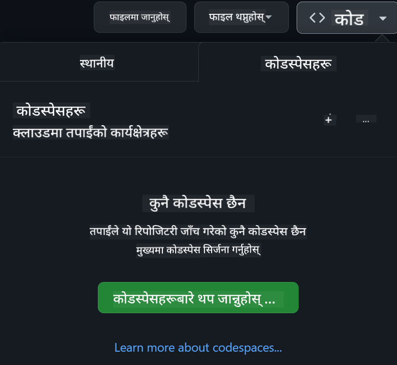

<!--
CO_OP_TRANSLATOR_METADATA:
{
  "original_hash": "1f45a6242179e3c001907339ab26af87",
  "translation_date": "2025-10-03T14:54:41+00:00",
  "source_file": "README.md",
  "language_code": "ne"
}
-->
[](https://github.com/microsoft/Web-Dev-For-Beginners/blob/master/LICENSE)
[](https://GitHub.com/microsoft/Web-Dev-For-Beginners/graphs/contributors/)
[](https://GitHub.com/microsoft/Web-Dev-For-Beginners/issues/)
[](https://GitHub.com/microsoft/Web-Dev-For-Beginners/pulls/)
[](http://makeapullrequest.com)

[](https://GitHub.com/microsoft/Web-Dev-For-Beginners/watchers/)
[](https://GitHub.com/microsoft/Web-Dev-For-Beginners/network/)
[](https://GitHub.com/microsoft/Web-Dev-For-Beginners/stargazers/)

[](https://discord.gg/zxKYvhSnVp?WT.mc_id=academic-000002-leestott)

# वेब विकासको लागि शुरुवातकर्ता - एक पाठ्यक्रम

माइक्रोसफ्ट क्लाउड एड्भोकेट्सद्वारा तयार गरिएको १२ हप्ताको व्यापक पाठ्यक्रममार्फत वेब विकासको आधारभूत कुराहरू सिक्नुहोस्। प्रत्येक २४ पाठले जाभास्क्रिप्ट, CSS, र HTML मा ध्यान केन्द्रित गर्दै टेरारियम, ब्राउजर एक्सटेन्सन, र स्पेस गेमजस्ता परियोजनाहरूमा आधारित अभ्यासहरू समावेश गर्दछ। क्विज, छलफल, र व्यावहारिक असाइनमेन्टहरूमा संलग्न हुनुहोस्। परियोजनामा आधारित शिक्षण विधिको माध्यमबाट आफ्नो सीप सुधार गर्नुहोस् र ज्ञानको प्रभावकारी रूपमा उपयोग गर्नुहोस्। आजै आफ्नो कोडिङ यात्रा सुरु गर्नुहोस्!

Azure AI Foundry Discord समुदायमा सामेल हुनुहोस्

[](https://discord.com/invite/ByRwuEEgH4)

यी स्रोतहरू प्रयोग गर्न सुरु गर्नका लागि निम्न चरणहरू अनुसरण गर्नुहोस्:
1. **रिपोजिटरी फोर्क गर्नुहोस्**: क्लिक गर्नुहोस् [](https://GitHub.com/microsoft/Web-Dev-For-Beginners/fork)
2. **रिपोजिटरी क्लोन गर्नुहोस्**:   `git clone https://github.com/microsoft/Web-Dev-For-Beginners.git`
3. [**Azure AI Foundry Discord मा सामेल हुनुहोस् र विशेषज्ञहरू तथा अन्य विकासकर्तासँग भेट गर्नुहोस्**](https://discord.com/invite/ByRwuEEgH4)

### 🌐 बहुभाषी समर्थन

#### GitHub Action मार्फत समर्थित (स्वचालित र सधैं अद्यावधिक)

[French](../fr/README.md) | [Spanish](../es/README.md) | [German](../de/README.md) | [Russian](../ru/README.md) | [Arabic](../ar/README.md) | [Persian (Farsi)](../fa/README.md) | [Urdu](../ur/README.md) | [Chinese (Simplified)](../zh/README.md) | [Chinese (Traditional, Macau)](../mo/README.md) | [Chinese (Traditional, Hong Kong)](../hk/README.md) | [Chinese (Traditional, Taiwan)](../tw/README.md) | [Japanese](../ja/README.md) | [Korean](../ko/README.md) | [Hindi](../hi/README.md) | [Bengali](../bn/README.md) | [Marathi](../mr/README.md) | [Nepali](./README.md) | [Punjabi (Gurmukhi)](../pa/README.md) | [Portuguese (Portugal)](../pt/README.md) | [Portuguese (Brazil)](../br/README.md) | [Italian](../it/README.md) | [Polish](../pl/README.md) | [Turkish](../tr/README.md) | [Greek](../el/README.md) | [Thai](../th/README.md) | [Swedish](../sv/README.md) | [Danish](../da/README.md) | [Norwegian](../no/README.md) | [Finnish](../fi/README.md) | [Dutch](../nl/README.md) | [Hebrew](../he/README.md) | [Vietnamese](../vi/README.md) | [Indonesian](../id/README.md) | [Malay](../ms/README.md) | [Tagalog (Filipino)](../tl/README.md) | [Swahili](../sw/README.md) | [Hungarian](../hu/README.md) | [Czech](../cs/README.md) | [Slovak](../sk/README.md) | [Romanian](../ro/README.md) | [Bulgarian](../bg/README.md) | [Serbian (Cyrillic)](../sr/README.md) | [Croatian](../hr/README.md) | [Slovenian](../sl/README.md) | [Ukrainian](../uk/README.md) | [Burmese (Myanmar)](../my/README.md)

**यदि तपाईंले थप भाषाहरूको अनुवाद चाहनुहुन्छ भने यहाँ सूचीबद्ध भाषाहरू समर्थित छन् [यहाँ](https://github.com/Azure/co-op-translator/blob/main/getting_started/supported-languages.md)**

[](https://open.vscode.dev/microsoft/Web-Dev-For-Beginners)

#### 🧑‍🎓 _के तपाईं विद्यार्थी हुनुहुन्छ?_

[**Student Hub पृष्ठ**](https://docs.microsoft.com/learn/student-hub/?WT.mc_id=academic-77807-sagibbon) मा जानुहोस् जहाँ तपाईंले शुरुवातकर्ताका स्रोतहरू, विद्यार्थी प्याकहरू र नि:शुल्क प्रमाणपत्र भौचर प्राप्त गर्ने तरिकाहरू पाउन सक्नुहुन्छ। यो पृष्ठलाई बुकमार्क गर्नुहोस् र समय-समयमा जाँच गर्नुहोस् किनभने हामी मासिक रूपमा सामग्री परिवर्तन गर्छौं।

### 📣 घोषणा - _Generative AI प्रयोग गरेर नयाँ परियोजना निर्माण गर्नुहोस्_

नयाँ AI सहायक परियोजना हालै थपिएको छ, यसलाई हेर्नुहोस् [परियोजना](./09-chat-project/README.md)

### 📣 घोषणा - _Generative AI को नयाँ पाठ्यक्रम_ JavaScript को लागि हालै जारी गरिएको छ

हाम्रो नयाँ Generative AI पाठ्यक्रम नछुटाउनुहोस्!

सुरु गर्न [https://aka.ms/genai-js-course](https://aka.ms/genai-js-course) मा जानुहोस्!


- आधारभूतदेखि RAG सम्मका पाठहरू।
- GenAI र हाम्रो सहायक एप प्रयोग गरेर ऐतिहासिक पात्रहरूसँग अन्तरक्रिया गर्नुहोस्।
- रमाइलो र आकर्षक कथा, तपाईं समय यात्रा गर्दै हुनुहुनेछ!


प्रत्येक पाठमा समावेश छ:
- प्रम्प्टिङ र प्रम्प्ट इन्जिनियरिङ
- टेक्स्ट र इमेज एप निर्माण
- सर्च एप्स

सुरु गर्न [https://aka.ms/genai-js-course](https://aka.ms/genai-js-course) मा जानुहोस्!

## 🌱 सुरु गर्दै

> **शिक्षकहरू**, हामीले [केही सुझावहरू समावेश गरेका छौं](for-teachers.md) यो पाठ्यक्रम कसरी प्रयोग गर्ने। हाम्रो [चर्चा फोरममा](https://github.com/microsoft/Web-Dev-For-Beginners/discussions/categories/teacher-corner) तपाईंको प्रतिक्रिया चाहन्छौं!

**[शिक्षार्थीहरू](https://aka.ms/student-page/?WT.mc_id=academic-77807-sagibbon)**, प्रत्येक पाठको लागि, प्रि-लेक्चर क्विजबाट सुरु गर्नुहोस् र पाठ सामग्री पढ्दै, विभिन्न गतिविधिहरू पूरा गर्दै र पोस्ट-लेक्चर क्विजमार्फत आफ्नो बुझाइ जाँच गर्नुहोस्।

तपाईंको सिकाइ अनुभवलाई सुधार गर्न, परियोजनाहरूमा सँगै काम गर्नका लागि आफ्नो सहपाठीहरूसँग जडान गर्नुहोस्! हाम्रो [चर्चा फोरममा](https://github.com/microsoft/Web-Dev-For-Beginners/discussions) छलफललाई प्रोत्साहन दिइन्छ जहाँ हाम्रो मोडरेटरहरूको टोली तपाईंको प्रश्नहरूको उत्तर दिन उपलब्ध हुनेछ।

तपाईंको शिक्षा अगाडि बढाउन, हामी [Microsoft Learn](https://learn.microsoft.com/users/wirelesslife/collections/p1ddcy5jwy0jkm?WT.mc_id=academic-77807-sagibbon) मा थप अध्ययन सामग्री अन्वेषण गर्न अत्यधिक सिफारिस गर्छौं।

### 📋 आफ्नो वातावरण सेटअप गर्दै

यो पाठ्यक्रमसँग विकास वातावरण तयार छ! सुरु गर्दा तपाईं [Codespace](https://github.com/features/codespaces/) (_ब्राउजर-आधारित, कुनै इन्स्टल आवश्यक छैन_) वा आफ्नो कम्प्युटरमा स्थानीय रूपमा [Visual Studio Code](https://code.visualstudio.com/?WT.mc_id=academic-77807-sagibbon) जस्ता टेक्स्ट एडिटर प्रयोग गर्न छनोट गर्न सक्नुहुन्छ।

#### आफ्नो रिपोजिटरी बनाउनुहोस्
आफ्नो काम सजिलै बचत गर्नका लागि, यो रिपोजिटरीको आफ्नै प्रतिलिपि बनाउनु सिफारिस गरिन्छ। तपाईंले पृष्ठको माथि रहेको **Use this template** बटन क्लिक गरेर यो गर्न सक्नुहुन्छ। यसले पाठ्यक्रमको प्रतिलिपि सहित तपाईंको GitHub खातामा नयाँ रिपोजिटरी बनाउनेछ।

यी चरणहरू अनुसरण गर्नुहोस्:
1. **रिपोजिटरी फोर्क गर्नुहोस्**: यस पृष्ठको माथि-दायाँ कुनामा रहेको "Fork" बटनमा क्लिक गर्नुहोस्।
2. **रिपोजिटरी क्लोन गर्नुहोस्**:   `git clone https://github.com/microsoft/Web-Dev-For-Beginners.git`

#### Codespace मा पाठ्यक्रम चलाउँदै

तपाईंले बनाएको यस रिपोजिटरीको प्रतिलिपिमा, **Code** बटनमा क्लिक गर्नुहोस् र **Open with Codespaces** चयन गर्नुहोस्। यसले तपाईंलाई काम गर्न नयाँ Codespace बनाउनेछ।



#### आफ्नो कम्प्युटरमा स्थानीय रूपमा पाठ्यक्रम चलाउँदै

तपाईंको कम्प्युटरमा यो पाठ्यक्रम चलाउनका लागि, तपाईंलाई टेक्स्ट एडिटर, ब्राउजर र कमाण्ड लाइन टूल आवश्यक हुनेछ। हाम्रो पहिलो पाठ, [प्रोग्रामिङ भाषाहरू र उपकरणहरूको परिचय](../../1-getting-started-lessons/1-intro-to-programming-languages), तपाईंलाई यी उपकरणहरूको लागि विभिन्न विकल्पहरूमा हिँड्नेछ ताकि तपाईंलाई उपयुक्त लाग्ने विकल्प चयन गर्न सक्नुहुन्छ।

हाम्रो सिफारिस [Visual Studio Code](https://code.visualstudio.com/?WT.mc_id=academic-77807-sagibbon) प्रयोग गर्नु हो, जसमा [Terminal](https://code.visualstudio.com/docs/terminal/basics/?WT.mc_id=academic-77807-sagibbon) पनि समावेश छ। तपाईं [यहाँ](https://code.visualstudio.com/?WT.mc_id=academic-77807-sagibbon) बाट Visual Studio Code डाउनलोड गर्न सक्नुहुन्छ।

1. आफ्नो रिपोजिटरीलाई आफ्नो कम्प्युटरमा क्लोन गर्नुहोस्। तपाईंले **Code** बटन क्लिक गरेर URL प्रतिलिपि गर्न सक्नुहुन्छ:

    [CodeSpace](./images/createcodespace.png)

    त्यसपछि, [Visual Studio Code](https://code.visualstudio.com/?WT.mc_id=academic-77807-sagibbon) भित्र [Terminal](https://code.visualstudio.com/docs/terminal/basics/?WT.mc_id=academic-77807-sagibbon) खोल्नुहोस् र तपाईंले प्रतिलिपि गरेको URL प्रतिस्थापन गर्दै निम्न कमाण्ड चलाउनुहोस्:

    ```bash 
    git clone <your-repository-url>
    ```

2. Visual Studio Code मा फोल्डर खोल्नुहोस्। तपाईंले **File** > **Open Folder** क्लिक गरेर क्लोन गरिएको फोल्डर चयन गर्न सक्नुहुन्छ।

>  सिफारिस गरिएको Visual Studio Code एक्सटेन्सनहरू:
>
> * [Live Server](https://marketplace.visualstudio.com/items?itemName=ritwickdey.LiveServer&WT.mc_id=academic-77807-sagibbon) - Visual Studio Code भित्र HTML पृष्ठहरू पूर्वावलोकन गर्न
> * [Copilot](https://marketplace.visualstudio.com/items?itemName=GitHub.copilot&WT.mc_id=academic-77807-sagibbon) - तपाईंलाई छिटो कोड लेख्न मद्दत गर्न

## 📂 प्रत्येक पाठमा समावेश छ:

- वैकल्पिक स्केच नोट
- वैकल्पिक पूरक भिडियो
- प्रि-लेसन वार्मअप क्विज
- लिखित पाठ
- परियोजनामा आधारित पाठहरूको लागि, परियोजना निर्माण गर्ने चरण-दर-चरण मार्गदर्शन
- ज्ञान जाँच
- चुनौती
- पूरक पढाइ
- असाइनमेन्ट
- [पोस्ट-लेसन क्विज](https://ff-quizzes.netlify.app/web/)
> **क्विजहरूको बारेमा नोट**: सबै क्विजहरू Quiz-app फोल्डरमा समावेश छन्, प्रत्येकमा तीन प्रश्न सहित कुल 48 क्विजहरू। तिनीहरू [यहाँ](https://ff-quizzes.netlify.app/web/) उपलब्ध छन्। क्विज एपलाई स्थानीय रूपमा चलाउन वा Azure मा डिप्लोय गर्न सकिन्छ; `quiz-app` फोल्डरमा दिइएको निर्देशनहरू पालना गर्नुहोस्।

## 🗃️ पाठहरू

|     |                       परियोजनाको नाम                       |                            सिकाइने अवधारणाहरू                             | सिकाइका उद्देश्यहरू                                                                                                                 |                                                         लिंक गरिएको पाठ                                                          |         लेखक          |
| :-: | :------------------------------------------------------: | :--------------------------------------------------------------------: | ----------------------------------------------------------------------------------------------------------------------------------- | :----------------------------------------------------------------------------------------------------------------------------: | :---------------------: |
| 01  |                     सुरुवात गर्दै                      |           प्रोग्रामिङ र उपकरणहरूको परिचय           | अधिकांश प्रोग्रामिङ भाषाहरूको आधारभूत ज्ञान र पेशेवर विकासकर्ताहरूलाई सहयोग गर्ने सफ्टवेयरको बारेमा जान्नुहोस् | [प्रोग्रामिङ भाषाहरू र उपकरणहरूको परिचय](./1-getting-started-lessons/1-intro-to-programming-languages/README.md) |         जैस्मिन         |
| 02  |                     सुरुवात गर्दै                      |             GitHub को आधारभूत कुरा, टिमसँग काम गर्ने समावेश             | आफ्नो परियोजनामा GitHub कसरी प्रयोग गर्ने, कोड बेसमा अरूसँग कसरी सहकार्य गर्ने                                                    |                            [GitHub को परिचय](./1-getting-started-lessons/2-github-basics/README.md)                             |          फ्लोर          |
| 03  |                     सुरुवात गर्दै                      |                             पहुँचयोग्यता                              | वेब पहुँचयोग्यताको आधारभूत कुरा जान्नुहोस्                                                                                               |                       [पहुंचयोग्यता आधारभूत कुरा](./1-getting-started-lessons/3-accessibility/README.md)                       |       क्रिस्टोफर       |
| 04  |                        JS आधारभूत कुरा                         |                         जाभास्क्रिप्ट डेटा प्रकार                          | जाभास्क्रिप्ट डेटा प्रकारहरूको आधारभूत कुरा                                                                                                 |                                       [डेटा प्रकारहरू](./2-js-basics/1-data-types/README.md)                                        |         जैस्मिन         |
| 05  |                        JS आधारभूत कुरा                         |                         फङ्क्सनहरू र मेथडहरू                          | एप्लिकेशनको तर्क प्रवाह व्यवस्थापन गर्न फङ्क्सनहरू र मेथडहरूको बारेमा जान्नुहोस्                                                             |                              [फङ्क्सनहरू र मेथडहरू](./2-js-basics/2-functions-methods/README.md)                               | जैस्मिन र क्रिस्टोफर |
| 06  |                        JS आधारभूत कुरा                         |                        जाभास्क्रिप्टसँग निर्णय लिने                        | निर्णय लिने विधिहरू प्रयोग गरेर आफ्नो कोडमा सर्तहरू कसरी सिर्जना गर्ने जान्नुहोस्                                                           |                                 [निर्णय लिने](./2-js-basics/3-making-decisions/README.md)                                  |         जैस्मिन         |
| 07  |                        JS आधारभूत कुरा                         |                            एरेहरू र लूपहरू                            | जाभास्क्रिप्टमा एरेहरू र लूपहरू प्रयोग गरेर डेटा काम गर्नुहोस्                                                                                 |                                   [एरेहरू र लूपहरू](./2-js-basics/4-arrays-loops/README.md)                                    |         जैस्मिन         |
| 08  |       [टेरारियम](./3-terrarium/solution/README.md)       |                            HTML अभ्यासमा                            | अनलाइन टेरारियम बनाउन HTML निर्माण गर्नुहोस्, लेआउट निर्माणमा ध्यान केन्द्रित गर्दै                                                         |                                 [HTML को परिचय](./3-terrarium/1-intro-to-html/README.md)                                 |           जेन           |
| 09  |       [टेरारियम](./3-terrarium/solution/README.md)       |                            CSS अभ्यासमा                             | अनलाइन टेरारियमलाई शैली दिन CSS निर्माण गर्नुहोस्, CSS को आधारभूत कुराहरूमा ध्यान केन्द्रित गर्दै पृष्ठलाई उत्तरदायी बनाउनुहोस्                     |                                  [CSS को परिचय](./3-terrarium/2-intro-to-css/README.md)                                  |           जेन           |
| 10  |            [टेरारियम](./3-terrarium/solution/README.md)            |                 जाभास्क्रिप्ट क्लोजरहरू, DOM हेरफेर                  | टेरारियमलाई ड्र्याग/ड्रप इन्टरफेसको रूपमा कार्य गर्न जाभास्क्रिप्ट निर्माण गर्नुहोस्, क्लोजरहरू र DOM हेरफेरमा ध्यान केन्द्रित गर्दै             |                  [जाभास्क्रिप्ट क्लोजरहरू, DOM हेरफेर](./3-terrarium/3-intro-to-DOM-and-closures/README.md)                   |           जेन           |
| 11  |          [टाइपिङ खेल](./4-typing-game/solution/README.md)          |                          टाइपिङ खेल निर्माण                           | आफ्नो जाभास्क्रिप्ट एपको तर्कलाई चलाउन किबोर्ड घटनाहरू कसरी प्रयोग गर्ने जान्नुहोस्                                                          |                                [इभेन्ट-ड्राइभन प्रोग्रामिङ](./4-typing-game/typing-game/README.md)                                |       क्रिस्टोफर       |
| 12  | [हरियो ब्राउजर एक्सटेन्सन](./5-browser-extension/solution/README.md) |                         ब्राउजरसँग काम गर्ने                          | ब्राउजरहरू कसरी काम गर्छन्, तिनीहरूको इतिहास, र ब्राउजर एक्सटेन्सनको पहिलो तत्वहरूको स्क्याफोल्ड कसरी बनाउने                               |                               [ब्राउजरहरूको बारेमा](./5-browser-extension/1-about-browsers/README.md)                                |           जेन           |
| 13  | [हरियो ब्राउजर एक्सटेन्सन](./5-browser-extension/solution/README.md) | फारम निर्माण, API कल गर्ने र स्थानीय स्टोरेजमा भेरिएबलहरू भण्डारण गर्ने | स्थानीय स्टोरेजमा भण्डारण गरिएका भेरिएबलहरू प्रयोग गरेर API कल गर्न आफ्नो ब्राउजर एक्सटेन्सनको जाभास्क्रिप्ट तत्वहरू निर्माण गर्नुहोस्                      |                [APIs, फारमहरू, र स्थानीय स्टोरेज](./5-browser-extension/2-forms-browsers-local-storage/README.md)                 |           जेन           |
| 14  | [हरियो ब्राउजर एक्सटेन्सन](./5-browser-extension/solution/README.md) |          ब्राउजरमा पृष्ठभूमि प्रक्रिया, वेब प्रदर्शन          | ब्राउजरको पृष्ठभूमि प्रक्रियाहरू प्रयोग गरेर एक्सटेन्सनको आइकन व्यवस्थापन गर्नुहोस्; वेब प्रदर्शन र केही अनुकूलनहरूको बारेमा जान्नुहोस्   |             [पृष्ठभूमि कार्यहरू र प्रदर्शन](./5-browser-extension/3-background-tasks-and-performance/README.md)              |           जेन           |
| 15  |           [स्पेस खेल](./6-space-game/solution/README.md)           |             जाभास्क्रिप्टसँग अधिक उन्नत खेल विकास             | खेल निर्माणको तयारीमा कक्षाहरू र संरचनाको प्रयोग गरेर उत्तराधिकारको बारेमा जान्नुहोस् र पब/सब ढाँचाको बारेमा जान्नुहोस्              |                      [उन्नत खेल विकासको परिचय](./6-space-game/1-introduction/README.md)                       |          क्रिस          |
| 16  |           [स्पेस खेल](./6-space-game/solution/README.md)           |                           क्यानभासमा चित्रण                            | क्यानभास API को बारेमा जान्नुहोस्, स्क्रिनमा तत्वहरू चित्रण गर्न प्रयोग गरिन्छ                                                                       |                                [क्यानभासमा चित्रण](./6-space-game/2-drawing-to-canvas/README.md)                                |          क्रिस          |
| 17  |           [स्पेस खेल](./6-space-game/solution/README.md)           |                   स्क्रिनमा तत्वहरू सार्ने                    | तत्वहरूले कसरी गति प्राप्त गर्न सक्छन् Cartesian समन्वय र क्यानभास API प्रयोग गरेर                                            |                           [तत्वहरू सार्ने](./6-space-game/3-moving-elements-around/README.md)                           |          क्रिस          |
| 18  |           [स्पेस खेल](./6-space-game/solution/README.md)           |                          टक्कर पत्ता लगाउने                           | तत्वहरूलाई टक्कर गर्न र एकअर्कासँग प्रतिक्रिया दिन बनाउनुहोस्, कीप्रेसहरू प्रयोग गरेर र खेलको प्रदर्शन सुनिश्चित गर्न कूलडाउन फङ्क्सन प्रदान गर्नुहोस्    |                              [टक्कर पत्ता लगाउने](./6-space-game/4-collision-detection/README.md)                              |          क्रिस          |
| 19  |           [स्पेस खेल](./6-space-game/solution/README.md)           |                             स्कोर राख्ने                              | खेलको स्थिति र प्रदर्शनको आधारमा गणितीय गणना गर्नुहोस्                                                                |                                    [स्कोर राख्ने](./6-space-game/5-keeping-score/README.md)                                    |          क्रिस          |
| 20  |           [स्पेस खेल](./6-space-game/solution/README.md)           |                     खेल समाप्त गर्ने र पुनः सुरु गर्ने                     | खेल समाप्त गर्ने र पुनः सुरु गर्ने बारेमा जान्नुहोस्, सम्पत्ति सफा गर्ने र भेरिएबल मानहरू पुनः सेट गर्ने समावेश                              |                                [समाप्ति अवस्था](./6-space-game/6-end-condition/README.md)                                 |          क्रिस          |
| 21  |         [बैंकिङ एप](./7-bank-project/solution/README.md)          |                 वेब एपमा HTML टेम्पलेटहरू र रुटहरू                 | रुटिङ र HTML टेम्पलेटहरू प्रयोग गरेर बहुपृष्ठ वेबसाइटको वास्तुकला निर्माण गर्ने तरिका जान्नुहोस्                             |                            [HTML टेम्पलेटहरू र रुटहरू](./7-bank-project/1-template-route/README.md)                             |          योहान          |
| 22  |         [बैंकिङ एप](./7-bank-project/solution/README.md)          |                  लगइन र दर्ता फारम निर्माण                   | फारमहरू निर्माण गर्ने र मान्यता दिनको लागि प्रक्रिया व्यवस्थापन गर्ने बारेमा जान्नुहोस्                                                                          |                                           [फारमहरू](./7-bank-project/2-forms/README.md)                                           |          योहान          |
| 23  |         [बैंकिङ एप](./7-bank-project/solution/README.md)          |                   डेटा प्राप्त गर्ने र प्रयोग गर्ने विधिहरू                   | तपाईंको एपमा डेटा कसरी प्रवाह हुन्छ, कसरी प्राप्त गर्ने, भण्डारण गर्ने, र नष्ट गर्ने                                                 |                                            [डेटा](./7-bank-project/3-data/README.md)                                            |          योहान          |
| 24  |         [बैंकिङ एप](./7-bank-project/solution/README.md)          |                      राज्य व्यवस्थापनको अवधारणाहरू                      | तपाईंको एपले राज्यलाई कसरी कायम राख्छ र यसलाई प्रोग्रामेटिक रूपमा कसरी व्यवस्थापन गर्ने                                                              |                                [राज्य व्यवस्थापन](./7-bank-project/4-state-management/README.md)                                |          योहान          |
| 25 | [ब्राउजर/VScode कोड](../../8-code-editor) | VScode सँग काम गर्ने | कोड एडिटर प्रयोग गर्ने तरिका जान्नुहोस्| [VScode कोड एडिटर प्रयोग गर्नुहोस्](./8-code-editor/1-using-a-code-editor/README.md) | क्रिस |
| 26 | [AI सहायकहरू](./9-chat-project/README.md) | AI सँग काम गर्ने | आफ्नो AI सहायक निर्माण गर्ने तरिका जान्नुहोस् | [AI सहायक परियोजना](./9-chat-project/README.md) | क्रिस |

## 🏫 शिक्षण विधि

हाम्रो पाठ्यक्रम दुई प्रमुख शिक्षण सिद्धान्तहरूमा आधारित छ:
* परियोजना-आधारित सिकाइ
* बारम्बार क्विजहरू

यो कार्यक्रमले जाभास्क्रिप्ट, HTML, र CSS को आधारभूत कुराहरू सिकाउँछ, साथै आजका वेब विकासकर्ताहरूले प्रयोग गर्ने नवीनतम उपकरणहरू र प्रविधिहरू। विद्यार्थीहरूले टाइपिङ खेल, भर्चुअल टेरारियम, वातावरणमैत्री ब्राउजर एक्सटेन्सन, स्पेस-इनभेडर शैलीको खेल, र व्यवसायहरूको लागि बैंकिङ एप निर्माण गरेर व्यावहारिक अनुभव प्राप्त गर्ने अवसर पाउनेछन्। श्रृंखला समाप्त हुँदा, विद्यार्थीहरूले वेब विकासको ठोस समझ प्राप्त गर्नेछन्।

> 🎓 तपाईं यस पाठ्यक्रमका पहिलो केही पाठहरू [Microsoft Learn](https://docs.microsoft.com/learn/paths/web-development-101/?WT.mc_id=academic-77807-sagibbon) मा [Learn Path](https://docs.microsoft.com/learn/paths/web-development-101/?WT.mc_id=academic-77807-sagibbon) को रूपमा लिन सक्नुहुन्छ!

सामग्री परियोजनासँग मेल खाने सुनिश्चित गरेर, प्रक्रिया विद्यार्थीहरूको लागि थप आकर्षक बनाइन्छ र अवधारणाहरूको सम्झना बढाइनेछ। हामीले जाभास्क्रिप्ट आधारभूत कुराहरूको परिचय दिने केही प्रारम्भिक पाठहरू पनि लेख्यौं, "[Beginners Series to: JavaScript](https://channel9.msdn.com/Series/Beginners-Series-to-JavaScript/?WT.mc_id=academic-77807-sagibbon)" भिडियो ट्यूटोरियलहरूको संग्रहबाट भिडियोसँग जोडीएको, जसका केही लेखकहरूले यस पाठ्यक्रममा योगदान दिएका छन्।

यसको अतिरिक्त, कक्षाको अगाडि कम-जोखिमको क्विजले विद्यार्थीलाई विषय सिक्नको लागि उद्देश्य सेट गर्दछ, जबकि कक्षापछि दोस्रो क्विजले थप सम्झना सुनिश्चित गर्दछ। यो पाठ्यक्रम लचिलो र रमाइलो बनाउन डिजाइन गरिएको थियो र पूर्ण वा आंशिक रूपमा लिन सकिन्छ। परियोजनाहरू साना सुरु हुन्छन् र 12-हप्ताको चक्रको अन्त्यसम्ममा क्रमिक रूपमा जटिल बन्छन्।

हामीले जानी-जानी जाभास्क्रिप्ट फ्रेमवर्कहरू परिचय गराउनबाट बच्यौं ताकि फ्रेमवर्क अपनाउनु अघि वेब विकासकर्ताको रूपमा आवश्यक आधारभूत सीपहरूमा ध्यान केन्द्रित गर्न सकियोस्। यस पाठ्यक्रम पूरा गरेपछि अर्को राम्रो कदम भनेको "[Beginner Series to: Node.js](https://channel9.msdn.com/Series/Beginners-Series-to-Nodejs/?WT.mc_id=academic-77807-sagibbon)" भिडियोहरूको अर्को संग्रह मार्फत Node.js को बारेमा सिक्नु हुनेछ।

> हाम्रो [आचार संहिता](CODE_OF_CONDUCT.md) र [योगदान](CONTRIBUTING.md) दिशानिर्देशहरू भ्रमण गर्नुहोस्। हामी तपाईंको रचनात्मक प्रतिक्रिया स्वागत गर्दछौं!


## 🧭 अफलाइन पहुँच

तपाईं [Docsify](https://docsify.js.org/#/) प्रयोग गरेर यो दस्तावेजीकरणलाई अफलाइन चलाउन सक्नुहुन्छ। यस रिपो फोर्क गर्नुहोस्, [Docsify स्थापना गर्नुहोस्](https://docsify.js.org/#/quickstart) आफ्नो स्थानीय मेसिनमा, र त्यसपछि यस रिपोको मूल फोल्डरमा `docsify serve` टाइप गर्नुहोस्। वेबसाइट तपाईंको localhost मा पोर्ट 3000 मा सेवा गरिनेछ: `localhost:3000`।

## 📘 PDF

सबै पाठहरूको PDF [यहाँ](https://microsoft.github.io/Web-Dev-For-Beginners/pdf/readme.pdf) फेला पार्न सकिन्छ।


## 🎒 अन्य पाठ्यक्रमहरू

हाम्रो टिमले अन्य पाठ्यक्रमहरू उत्पादन गर्दछ! हेर्नुहोस्:

- [MCP for Beginners](https://aka.ms/mcp-for-beginners)
- [Edge AI for Beginners](https://aka.ms/edgeai-for-beginners)
- [AI Agents for Beginners](https://aka.ms/ai-agents-beginners)
- [Generative AI for Beginners .NET](https://github.com/microsoft/Generative-AI-for-beginners-dotnet)
- [Generative AI with JavaScript](https://github.com/microsoft/generative-ai-with-javascript)
- [Generative AI with Java](https://github.com/microsoft/Generative-AI-for-beginners-java)
- [AI for Beginners](https://aka.ms/ai-beginners)
- [Data Science for Beginners](https://aka.ms/datascience-beginners)
- [ML for Beginners](https://aka.ms/ml-beginners)
- [Cybersecurity for Beginners](https://github.com/microsoft/Security-101)
- [Web Dev for Beginners](https://aka.ms/webdev-beginners)
- [IoT for Beginners](https://aka.ms/iot-beginners)
- [XR Development for Beginners](https://github.com/microsoft/xr-development-for-beginners)
- [Mastering GitHub Copilot for Agentic use](https://github.com/microsoft/Mastering-GitHub-Copilot-for-Paired-Programming)
- [C#/.NET विकासकर्ताहरूका लागि GitHub Copilot को मास्टरी](https://github.com/microsoft/mastering-github-copilot-for-dotnet-csharp-developers)
- [आफ्नै Copilot साहसिक यात्रा चयन गर्नुहोस्](https://github.com/microsoft/CopilotAdventures)

## सहयोग प्राप्त गर्ने तरिका

यदि तपाईं अड्किनुहुन्छ वा AI एप्स निर्माणको बारेमा कुनै प्रश्न छ भने, यहाँ सामेल हुनुहोस्:

[](https://aka.ms/foundry/discord)

यदि तपाईंलाई उत्पादन सम्बन्धी प्रतिक्रिया दिनु छ वा निर्माणको क्रममा त्रुटिहरू देखिन्छ भने, यहाँ जानुहोस्:

[](https://aka.ms/foundry/forum)

## लाइसेन्स

यो रिपोजिटरी MIT लाइसेन्स अन्तर्गत लाइसेन्स गरिएको छ। थप जानकारीको लागि [LICENSE](../../LICENSE) फाइल हेर्नुहोस्।

---

**अस्वीकरण**:  
यो दस्तावेज़ AI अनुवाद सेवा [Co-op Translator](https://github.com/Azure/co-op-translator) प्रयोग गरेर अनुवाद गरिएको हो। हामी यथार्थताको लागि प्रयास गर्छौं, तर कृपया ध्यान दिनुहोस् कि स्वचालित अनुवादमा त्रुटिहरू वा अशुद्धताहरू हुन सक्छ। मूल दस्तावेज़ यसको मातृभाषामा आधिकारिक स्रोत मानिनुपर्छ। महत्वपूर्ण जानकारीको लागि, व्यावसायिक मानव अनुवाद सिफारिस गरिन्छ। यस अनुवादको प्रयोगबाट उत्पन्न हुने कुनै पनि गलतफहमी वा गलत व्याख्याको लागि हामी जिम्मेवार हुनेछैनौं।