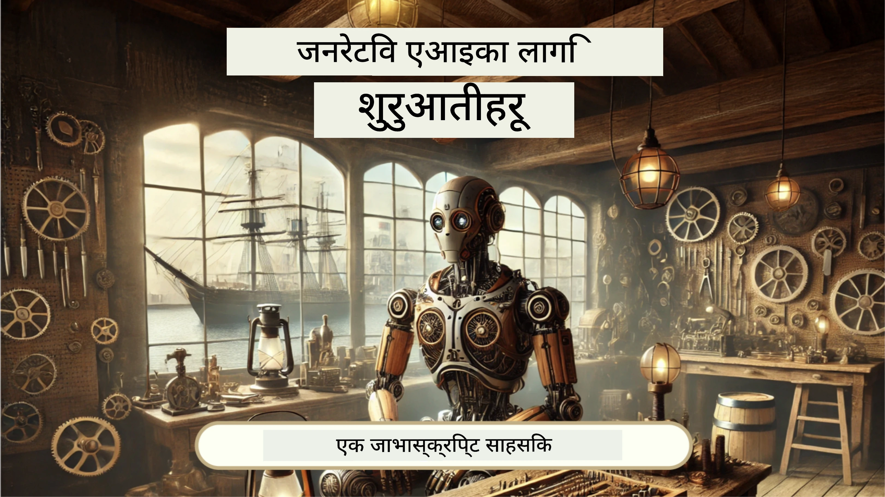
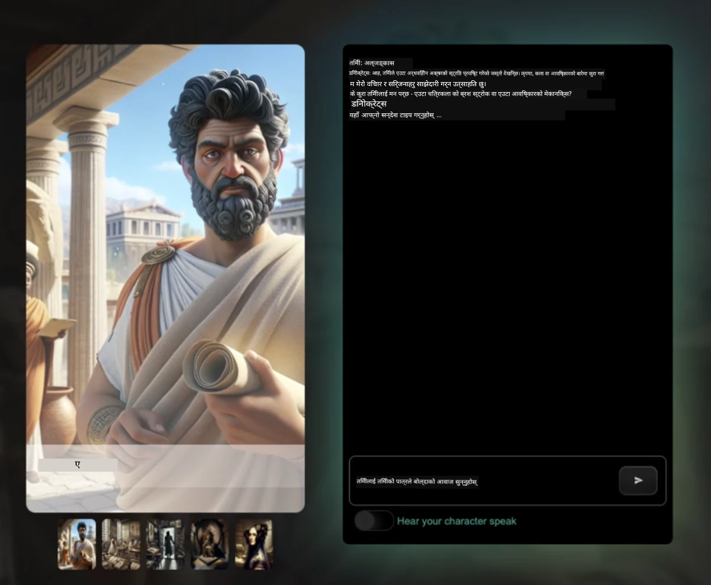
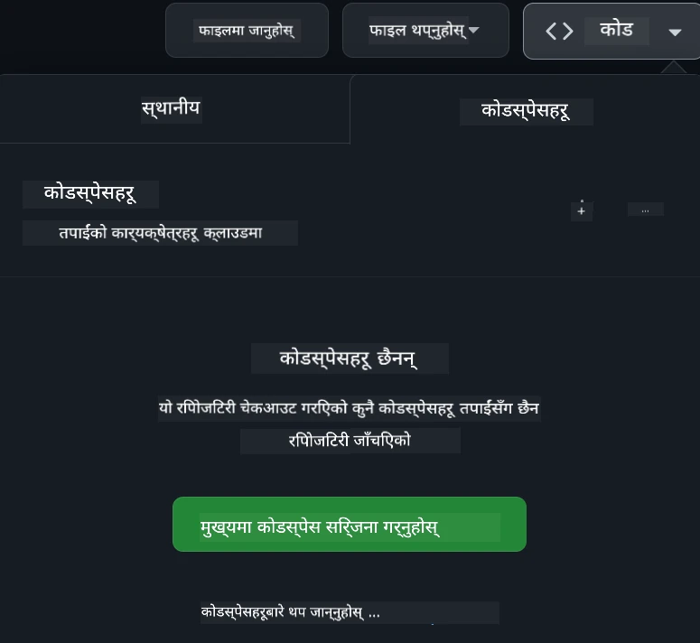

[](https://github.com/microsoft/Web-Dev-For-Beginners/blob/master/LICENSE)
[](https://GitHub.com/microsoft/Web-Dev-For-Beginners/graphs/contributors/)
[](https://GitHub.com/microsoft/Web-Dev-For-Beginners/issues/)
[](https://GitHub.com/microsoft/Web-Dev-For-Beginners/pulls/)
[](http://makeapullrequest.com) 

[](https://GitHub.com/microsoft/Web-Dev-For-Beginners/watchers/)
[](https://GitHub.com/microsoft/Web-Dev-For-Beginners/network/)
[](https://GitHub.com/microsoft/Web-Dev-For-Beginners/stargazers/)

[](https://discord.gg/nTYy5BXMWG)

# शुरुवातीहरूको लागि वेब विकास - एक पाठ्यक्रम

Microsoft Cloud Advocates द्वारा संचालित हाम्रो १२ हप्ता लामो समग्र पाठ्यक्रमसँग वेब विकासका आधारभूत कुराहरू सिक्नुहोस्। हरेक २४ पाठहरूमा terrariums, browser extensions, र space games जस्ता अभ्यास परियोजनाहरू मार्फत JavaScript, CSS, र HTML को अध्यन गरिन्छ। प्रश्नोत्तरीहरू, छलफलहरू, र व्यावहारिक कर्तव्यहरूमा संलग्न हुनुहोस्। हाम्रो प्रभावकारी परियोजना-आधारित शिक्षण पद्धतिसँग आफ्नो सीपहरू वृद्धि गर्नुहोस् र ज्ञानलाई प्रभावकारी रूपमा कायम राख्नुहोस्। आजै आफ्नो कोडिङ यात्रा सुरु गर्नुहोस्!

Azure AI Foundry Discord समुदायमा सामेल हुनुहोस्

[](https://discord.gg/nTYy5BXMWG)

यी स्रोतहरू प्रयोग गरेर सुरु गर्न यी चरणहरू पालना गर्नुहोस्:
1. **Repository Fork गर्नुहोस्**: क्लिक गर्नुहोस् [](https://GitHub.com/microsoft/Web-Dev-For-Beginners/fork)
2. **Repository Clone गर्नुहोस्**:   `git clone https://github.com/microsoft/Web-Dev-For-Beginners.git`
3. [**Azure AI Foundry Discord मा सामेल हुनुहोस् र विशेषज्ञ र अन्य विकासकर्ताहरूसँग भेट्नुहोस्**](https://discord.com/invite/ByRwuEEgH4)

### 🌐 बहुभाषीय समर्थन

#### GitHub Action मार्फत समर्थित (स्वचालित र सधैं अद्यावधिक)

<!-- CO-OP TRANSLATOR LANGUAGES TABLE START -->
[Arabic](../ar/README.md) | [Bengali](../bn/README.md) | [Bulgarian](../bg/README.md) | [Burmese (Myanmar)](../my/README.md) | [Chinese (Simplified)](../zh-CN/README.md) | [Chinese (Traditional, Hong Kong)](../zh-HK/README.md) | [Chinese (Traditional, Macau)](../zh-MO/README.md) | [Chinese (Traditional, Taiwan)](../zh-TW/README.md) | [Croatian](../hr/README.md) | [Czech](../cs/README.md) | [Danish](../da/README.md) | [Dutch](../nl/README.md) | [Estonian](../et/README.md) | [Finnish](../fi/README.md) | [French](../fr/README.md) | [German](../de/README.md) | [Greek](../el/README.md) | [Hebrew](../he/README.md) | [Hindi](../hi/README.md) | [Hungarian](../hu/README.md) | [Indonesian](../id/README.md) | [Italian](../it/README.md) | [Japanese](../ja/README.md) | [Kannada](../kn/README.md) | [Korean](../ko/README.md) | [Lithuanian](../lt/README.md) | [Malay](../ms/README.md) | [Malayalam](../ml/README.md) | [Marathi](../mr/README.md) | [Nepali](./README.md) | [Nigerian Pidgin](../pcm/README.md) | [Norwegian](../no/README.md) | [Persian (Farsi)](../fa/README.md) | [Polish](../pl/README.md) | [Portuguese (Brazil)](../pt-BR/README.md) | [Portuguese (Portugal)](../pt-PT/README.md) | [Punjabi (Gurmukhi)](../pa/README.md) | [Romanian](../ro/README.md) | [Russian](../ru/README.md) | [Serbian (Cyrillic)](../sr/README.md) | [Slovak](../sk/README.md) | [Slovenian](../sl/README.md) | [Spanish](../es/README.md) | [Swahili](../sw/README.md) | [Swedish](../sv/README.md) | [Tagalog (Filipino)](../tl/README.md) | [Tamil](../ta/README.md) | [Telugu](../te/README.md) | [Thai](../th/README.md) | [Turkish](../tr/README.md) | [Ukrainian](../uk/README.md) | [Urdu](../ur/README.md) | [Vietnamese](../vi/README.md)

> **स्थानीय रूपमा क्लोन गर्न प्राथमिकता दिनुहुन्छ?**
>
> यस repository मा ५०+ भाषा अनुवादहरू छन् जुन डाउनलोड आकार धेरै बढाउँछ। अनुवादहरू बिना क्लोन गर्न sparse checkout प्रयोग गर्नुहोस्:
>
> **Bash / macOS / Linux:**
> ```bash
> git clone --filter=blob:none --sparse https://github.com/microsoft/Web-Dev-For-Beginners.git
> cd Web-Dev-For-Beginners
> git sparse-checkout set --no-cone '/*' '!translations' '!translated_images'
> ```
>
> **CMD (Windows):**
> ```cmd
> git clone --filter=blob:none --sparse https://github.com/microsoft/Web-Dev-For-Beginners.git
> cd Web-Dev-For-Beginners
> git sparse-checkout set --no-cone "/*" "!translations" "!translated_images"
> ```
>
> यसले तपाईंलाई पाठ्यक्रम पूरा गर्न आवश्यक सबै कुरा छिटो डाउनलोड गराउँछ।
<!-- CO-OP TRANSLATOR LANGUAGES TABLE END -->

**यदि तपाईं थप अनुवाद भाषाहरू चाहानुहुन्छ भने ती यहाँ सूचीबद्ध छन् [यहाँ](https://github.com/Azure/co-op-translator/blob/main/getting_started/supported-languages.md)**

[](https://open.vscode.dev/microsoft/Web-Dev-For-Beginners)

#### 🧑‍🎓 _तपाईं विद्यार्थी हो?_

[**विद्यार्थी हब पृष्ठ**](https://docs.microsoft.com/learn/student-hub/?WT.mc_id=academic-77807-sagibbon) भ्रमण गर्नुहोस् जहाँ तपाईंले शुरुवातीहरूको लागि स्रोतहरू, विद्यार्थी प्याकहरू र निशुल्क प्रमाणपत्र भौचर कसरी पाउने तरिकाहरू पाउनुहुनेछ। यो पृष्ठ तपाईंले बुकमार्क गर्नु पर्ने पृष्ठ हो र हामी मासिक रूपमा सामग्री परिवर्तन गर्दा समय समयमा जाँच गर्नुहोस्।

### 📣 घोषणा - नयाँ GitHub Copilot Agent मोड चुनौतीहरू पूरा गर्नुहोस्!

नयाँ चुनौती थपियो, धेरै अध्यायहरूमा "GitHub Copilot Agent Challenge 🚀" खोज्नुहोस्। यो GitHub Copilot र Agent मोडको प्रयोग गरेर तपाईंले पूरा गर्न सक्ने नयाँ चुनौती हो। यदि तपाईंले पहिले Agent मोड प्रयोग गर्नुभएन भने यो केवल पाठ बनाउने मात्र नभई फाइलहरू सिर्जना गर्न, सम्पादन गर्न, आदेशहरू चलाउन र अझ धेरै गर्न सक्षम छ।

### 📣 घोषणा - _Generative AI प्रयोग गरेर नयाँ परियोजना बनाउने_ 

नयाँ AI सहायक परियोजना थपियो, यहाँ हेरौं [परियोजना](./9-chat-project/README.md)

### 📣 घोषणा - _Generative AI को लागि नयाँ पाठ्यक्रम_ JavaScript मा जारी भएको छ

हाम्रो नयाँ Generative AI पाठ्यक्रम नछुटाउनुहोस्!

सुरु गर्न जानुहोस् [https://aka.ms/genai-js-course](https://aka.ms/genai-js-course)



- आधारभूतदेखि RAG सम्म सबै विषयहरू समेटिएको पाठहरू।
- GenAI र हाम्रो साथीसँग ऐतिहासिक पात्रहरूसँग अन्तरक्रिया गर्नुहोस्।
- रमाईलो र रोचक कथावाचन, तपाईं समय यात्रा गर्दै हुनुहुन्छ!



हरेक पाठसँग एउटा कार्य पूरा गर्ने, ज्ञान जाँच्ने र चुनौती समावेश छ जसले तपाईंलाई यी विषयहरूमा मार्गदर्शन गर्छ:
- Prompting र prompt engineering
- पाठ र छवि एप् उत्पादन
- खोजी एप्लिकेसनहरू

सुरु गर्न जानुहोस् [https://aka.ms/genai-js-course](https://aka.ms/genai-js-course)


## 🌱 सुरु गर्ने तरिका

> **शिक्षकहरू**, हामीसँग [केही सुझावहरू](for-teachers.md) छन् यस पाठ्यक्रम कसरी प्रयोग गर्ने भनेर। कृपया हाम्रो सुझावहरूमा प्रतिक्रिया दिनुहोस् [हाम्रो छलफल फोरममा](https://github.com/microsoft/Web-Dev-For-Beginners/discussions/categories/teacher-corner)!

**[शिक्षार्थीहरू](https://aka.ms/student-page/?WT.mc_id=academic-77807-sagibbon)**, प्रत्येक पाठका लागि, प्रि-लेक्चर क्विजबाट सुरु गर्नुहोस् र त्यसपछि लेक्चर सामग्री पढ्नुहोस्, विभिन्न गतिविधिहरू पूरा गर्नुहोस् र पोस्ट-लेक्चर क्विजसँग आफ्नो बुझाइ जाँच्नुहोस्।

तपाईंको सिकाइ अनुभवलाई बढावा दिनका लागि, आफ्नो सहपाठीहरूसँग जोडिएर परियोजनाहरूमा सँगै काम गर्नुहोस्! छलफलहरू हाम्रो [चर्चा फोरम](https://github.com/microsoft/Web-Dev-For-Beginners/discussions) मा प्रोत्साहित गरिन्छ जहाँ हाम्रो मोडरेटर टोलीले तपाईंको प्रश्नहरूको उत्तर दिन उपलब्ध हुनेछ।

आफ्नो शिक्षालाई अझ अघि बढाउन, हामी अत्यधिक सिफारिस गर्दछौं कि तपाईंले [Microsoft Learn](https://learn.microsoft.com/users/wirelesslife/collections/p1ddcy5jwy0jkm?WT.mc_id=academic-77807-sagibbon) अतिरिक्त अध्ययन सामग्रीहरूको लागि अन्वेषण गर्नुहोस्।

### 📋 आफ्नो वातावरण सेटअप गर्नुहोस्

यस पाठ्यक्रमसँग विकासको वातावरण तयार छ! सुरु गर्दा, तपाईं [Codespace](https://github.com/features/codespaces/) (_ब्राउजर आधारित, कुनै इन्स्टल आवश्यकता छैन वातावरण_), वा तपाईंको कम्प्युटरमा स्थानीय रूपमा [Visual Studio Code](https://code.visualstudio.com/?WT.mc_id=academic-77807-sagibbon) जस्ता टेक्स्ट सम्पादक प्रयोग गरेर पाठ्यक्रम चलाउन सक्नुहुन्छ।

#### आफ्नो repository सिर्जना गर्नुहोस्
आफ्नो काम सजिलै सुरक्षित गर्न, तपाईंले यो repository को आफ्नै प्रति सिर्जना गर्ने सिफारिस गरिन्छ। तपाईं यसलाई पृष्ठको माथिल्लो भागमा रहेको **Use this template** बटनमा क्लिक गरेर गर्न सक्नुहुन्छ। यसले Github खातामा पाठ्यक्रमको प्रति भएको नयाँ repository सिर्जना गर्नेछ।

यी चरणहरू पालना गर्नुहोस्:
1. **Repository Fork गर्नुहोस्**: यस पृष्ठको माथि-दायाँ कुनामा रहेको "Fork" बटनमा क्लिक गर्नुहोस्।
2. **Repository Clone गर्नुहोस्**:   `git clone https://github.com/microsoft/Web-Dev-For-Beginners.git`

#### Codespace मा पाठ्यक्रम चलाउनुहोस्

तपाईंले सिर्जना गरेको आफ्नो repository प्रतिमा, **Code** बटन थिच्नुहोस् र **Open with Codespaces** चयन गर्नुहोस्। यसले तपाईंलाई कार्य गर्न नयाँ Codespace सिर्जना गर्नेछ।



#### आफ्नो कम्प्युटरमा स्थानीय रूपमा पाठ्यक्रम चलाउनुहोस्

तपाईंको कम्प्युटरमा यस पाठ्यक्रमलाई स्थानीय रूपमा चलाउन, तपाईलाई एक टेक्स्ट सम्पादक, एउटा ब्राउजर, र कमाण्ड लाइन उपकरण आवश्यक पर्नेछ। हाम्रो पहिलो पाठ, [प्रोग्रामिङ भाषा र उपकरणहरूको परिचय](../../1-getting-started-lessons/1-intro-to-programming-languages), तपाईंलाई सबै उपकरणहरूको विभिन्न विकल्पहरूमा हिँडेर आफूलाई उपयुक्त छानेर छनोट गर्न मद्दत गर्नेछ।

हाम्रो सिफारिस हुन्छ कि तपाईं [Visual Studio Code](https://code.visualstudio.com/?WT.mc_id=academic-77807-sagibbon) लाई आफ्नो सम्पादकको रूपमा प्रयोग गर्नुहोस्, जसमा [Terminal](https://code.visualstudio.com/docs/terminal/basics/?WT.mc_id=academic-77807-sagibbon) पनि समावेश छ। तपाईं Visual Studio Code यो ठाउँबाट डाउनलोड गर्न सक्नुहुन्छ [यहाँ](https://code.visualstudio.com/?WT.mc_id=academic-77807-sagibbon)।
1. आफ्नो रिपोजिटरी आफ्नो कम्प्युटरमा क्लोन गर्नुहोस्। तपाईंले यो **Code** बटनमा क्लिक गरेर र URL कपी गरेर गर्न सक्नुहुन्छ:

    [CodeSpace](./images/createcodespace.png)

    त्यसपछि, [Visual Studio Code](https://code.visualstudio.com/?WT.mc_id=academic-77807-sagibbon) भित्र [Terminal](https://code.visualstudio.com/docs/terminal/basics/?WT.mc_id=academic-77807-sagibbon) खोल्नुहोस् र तलको आदेश चलाउनुहोस्, जहाँ `<your-repository-url>` साटासाट तपाईंले कपी गरेको URL राख्नुहोस्:

    ```bash 
    git clone <your-repository-url>
    ```

2. Visual Studio Code मा फोल्डर खोल्नुहोस्। तपाईंले यो **File** > **Open Folder** क्लिक गरेर र हालै क्लोन गरेको फोल्डर चयन गरेर गर्न सक्नुहुन्छ।

>  सिफारिस गरिएको Visual Studio Code एक्सटेन्सनहरू:
>
> * [Live Server](https://marketplace.visualstudio.com/items?itemName=ritwickdey.LiveServer&WT.mc_id=academic-77807-sagibbon) - Visual Studio Code भित्र HTML पानाहरू पूर्वावलोकन गर्न
> * [Copilot](https://marketplace.visualstudio.com/items?itemName=GitHub.copilot&WT.mc_id=academic-77807-sagibbon) - तपाईलाई छिटो कोड लेख्न मद्दत गर्ने

## 📂 प्रत्येक पाठमा समावेश छ:

- वैकल्पिक स्केच नोट
- वैकल्पिक पूरक भिडियो
- पाठअघि तातोप तापी क्वीज
- लेखिएको पाठ
- प्रोजेक्ट आधारित पाठहरूको लागि, प्रोजेक्ट कसरी बनाउने भन्ने चरण-द्वारा-चरण मार्गदर्शनहरू
- ज्ञान जाँचहरू
- एउटा चुनौती
- पूरक पढाइ
- असाइनमेन्ट
- [पाठपछि क्वीज](https://ff-quizzes.netlify.app/web/)

> **क्वीजहरूबारे सूचना**: सबै क्वीजहरू Quiz-app फोल्डरमा रहेका छन्, कुल ४८ क्वीजहरू हरेकमा तीन प्रश्नहरू हुन्छन्। तिनीहरू [यहाँ](https://ff-quizzes.netlify.app/web/) उपलब्ध छन्। क्वीज एप स्थानीय रूपमा चलाउन वा Azure मा डिप्लोय गर्न सकिन्छ; `quiz-app` फोल्डरमा निर्देशहरू पछ्याउनुहोस्।

## 🗃️ पाठहरू

|     |                       प्रोजेक्ट नाम                        |                            सिकाइका अवधारणाहरू                             | सिकाइका उद्देश्यहरू                                                                                                                 |                                                         लिंक गरिएको पाठ                                                          |         लेखक          |
| :-: | :------------------------------------------------------: | :--------------------------------------------------------------------: | ----------------------------------------------------------------------------------------------------------------------------------- | :----------------------------------------------------------------------------------------------------------------------------: | :---------------------: |
| 01  |                     सुरूवात गर्दै                       |           प्रोग्रामिङ परिचय र उपकरणहरू           | अधिकांश प्रोग्रामिङ भाषाहरूको आधारभूत अवधारणाहरू सिक्नुहोस् र पेशेवर विकासकर्ताले आफ्नो काम गर्न प्रयोग गर्ने सफ्टवेयरको बारेमा जान्नुहोस् | [प्रोग्रामिङ भाषाहरू र उपकरणहरूको परिचय](./1-getting-started-lessons/1-intro-to-programming-languages/README.md) |         Jasmine         |
| 02  |                     सुरूवात गर्दै                       |             GitHub को आधारभूत कुरा, टोलीसँग काम गर्नेसमेत             | तपाईंको प्रोजेक्टमा GitHub कसरी प्रयोग गर्ने, र कोड बेसमा अरूसँग कसरी सहकार्य गर्ने                                                |                            [GitHub परिचय](./1-getting-started-lessons/2-github-basics/README.md)                             |          Floor          |
| 03  |                     सुरूवात गर्दै                       |                             पहुँचयोग्यता                              | वेब पहुँचयोग्यताको आधारभूत कुरा सिक्नुहोस्                                                                                               |                       [पहुंचयोग्यता आधारभूत कुरा](./1-getting-started-lessons/3-accessibility/README.md)                       |       Christopher       |
| 04  |                        JS आधारभूत                        |                         JavaScript डेटा प्रकार                          | JavaScript डेटा प्रकारहरूको आधारभूत कुरा                                                                                                 |                                       [डेटा प्रकार](./2-js-basics/1-data-types/README.md)                                        |         Jasmine         |
| 05  |                        JS आधारभूत                        |                         कार्यहरू र विधिहरू                          | आवेदनको तर्क प्रवाह व्यवस्थापन गर्न कार्यहरू र विधिहरूको बारे सिक्नुहोस्                                                             |                              [कार्यहरू र विधिहरू](./2-js-basics/2-functions-methods/README.md)                               | Jasmine र Christopher |
| 06  |                        JS आधारभूत                        |                        JS सँग निर्णय बनाउने                        | निर्णय गर्ने तरिका प्रयोग गरी तपाईंको कोडमा सर्तहरू कसरी बनाउन सिक्नुहोस्                                                           |                                 [निर्णय बनाउने](./2-js-basics/3-making-decisions/README.md)                                  |         Jasmine         |
| 07  |                        JS आधारभूत                        |                            एर्रेहरू र लूपहरू                            | JavaScript मा एर्रे र लूपहरूको प्रयोग गरी डाटासँग काम गर्नुहोस्                                                                                 |                                   [एर्रे र लूपहरू](./2-js-basics/4-arrays-loops/README.md)                                    |         Jasmine         |
| 08  |       [Terrarium](./3-terrarium/solution/README.md)       |                            प्रायोगमा HTML                            | अनलाइन टेरियम बनाउन HTML निर्माण गर्नुहोस्, लेआउट बनाउनमा केन्द्रित                                                         |                                 [HTML परिचय](./3-terrarium/1-intro-to-html/README.md)                                 |           Jen           |
| 09  |       [Terrarium](./3-terrarium/solution/README.md)       |                            प्रायोगमा CSS                             | अनलाइन टेरियमलाई स्टाइल दिन CSS बनाउनुहोस्, पृष्ठले प्रतिक्रिया जनाउने गरी CSS का आधारहरू सहित                     |                                  [CSS परिचय](./3-terrarium/2-intro-to-css/README.md)                                  |           Jen           |
| 10  |            [Terrarium](./3-terrarium/solution/README.md)            |                 JavaScript क्लोजरहरू, DOM हेरफेर                  | टेरियमलाई ड्र्याग/ड्रप इन्टरफेस बनाउन JavaScript लेख्नुहोस्, क्लोजर र DOM हेरफेरमा केन्द्रित             |                  [JavaScript क्लोजरहरू, DOM हेरफेर](./3-terrarium/3-intro-to-DOM-and-closures/README.md)                   |           Jen           |
| 11  |          [टाइपिङ गेम](./4-typing-game/solution/README.md)          |                          टाइपिङ गेम बनाउने                           | कीबोर्ड इभेन्टहरू प्रयोग गरेर तपाईंको JavaScript अनुप्रयोगको तर्क चलाउन सिक्नुहोस्                                                          |                                [इभेन्ट-चालित प्रोग्रामिङ](./4-typing-game/typing-game/README.md)                                |       Christopher       |
| 12  | [हरियो ब्राउजर एक्सटेन्सन](./5-browser-extension/solution/README.md) |                         ब्राउजरहरूसँग काम                          | ब्राउजरहरू कसरी काम गर्छन्, तिनको इतिहास र ब्राउजर एक्सटेन्सनका पहिलो तत्वहरू कसरी बनाउने                                       |                               [ब्राउजरहरूबारे](./5-browser-extension/1-about-browsers/README.md)                                |           Jen           |
| 13  | [हरियो ब्राउजर एक्सटेन्सन](./5-browser-extension/solution/README.md) | फारम बनाउने, API कल गर्ने र स्थानीय संग्रहमा भेरिएबल राख्ने | आफ्नो ब्राउजर एक्सटेन्सनका JavaScript तत्वहरू बनाउन, स्थानीय संग्रहमा राखिएका भेरिएबल छन् API कल गर्न                                    |                [API, फारम र स्थानीय संग्रह](./5-browser-extension/2-forms-browsers-local-storage/README.md)                 |           Jen           |
| 14  | [हरियो ब्राउजर एक्सटेन्सन](./5-browser-extension/solution/README.md) |          ब्राउजरको पृष्ठभूमि प्रक्रियाहरू, वेब प्रदर्शन          | एक्सटेन्सनको आइकन व्यवस्थापन गर्न ब्राउजरको पृष्ठभूमि प्रक्रियाहरू प्रयोग गर्नुहोस्; वेब प्रदर्शन र सुधार गर्न सिक्नुहोस्   |             [पृष्ठभूमि कार्यहरू र प्रदर्शन](./5-browser-extension/3-background-tasks-and-performance/README.md)              |           Jen           |
| 15  |           [सपेस गेम](./6-space-game/solution/README.md)           |             JavaScript सँग अझ उन्नत गेम विकास             | Inheritance बारे क्लासहरू र Composition दुवै र Pub/Sub ढाँचाबारे सिक्नुहोस्, गेम विकासको तयारीका लागि              |                      [उन्नत गेम विकास परिचय](./6-space-game/1-introduction/README.md)                       |          Chris          |
| 16  |           [सपेस गेम](./6-space-game/solution/README.md)           |                           क्यानभासमा चित्र बनाउने                            | स्क्रीनमा तन्काउन क्यानभास API को बारेमा सिक्नुहोस्                                                                       |                                [क्यानभासमा चित्र बनाउने](./6-space-game/2-drawing-to-canvas/README.md)                                |          Chris          |
| 17  |           [सपेस गेम](./6-space-game/solution/README.md)           |                   स्क्रिनमा तत्वहरू सार्ने                    | तत्वहरू गति पाउन कार्टेशियन समन्वय प्रणाली र क्यानभास API प्रयोग कसरी गर्ने पत्ता लगाउनुहोस्                                            |                           [तत्वहरू सार्ने](./6-space-game/3-moving-elements-around/README.md)                           |          Chris          |
| 18  |           [सपेस गेम](./6-space-game/solution/README.md)           |                          टक्कर पत्ता लगाउने                           | कुञ्जी थिच्नेहरू प्रयोग गरी तत्वहरू कसरी आपसमा ठोक्किन्छन् र प्रतिक्रिया दिन्छन् र प्रदर्शन सुनिश्चित गर्न कोलडाउन फंक्शन दिने    |                              [टक्कर पत्ता लगाउने](./6-space-game/4-collision-detection/README.md)                              |          Chris          |
| 19  |           [सपेस गेम](./6-space-game/solution/README.md)           |                             स्कोर राख्ने                              | गेमको स्थिति र प्रदर्शन आधारमा गणितीय हिसाबकिताब गर्नुहोस्                                                                |                                    [स्कोर राख्ने](./6-space-game/5-keeping-score/README.md)                                    |          Chris          |
| 20  |           [सपेस गेम](./6-space-game/solution/README.md)           |                     गेम अन्त्य र पुनः सुरु गर्ने                     | गेम अन्त्य र पुनः सुरु गर्न सिक्नुहोस्, जसमा स्रोतहरू सफा गर्ने र भेरिएबल मानहरू रिसेट गर्ने पनि समावेश छ                              |                                [अन्त्य अवस्था](./6-space-game/6-end-condition/README.md)                                 |          Chris          |
| 21  |         [बैंकिङ एप](./7-bank-project/solution/README.md)          |                 वेब एपमा HTML टेम्प्लेट र मार्गहरू                 | बहुपृष्ठ वेबसाइटको संरचना सिर्जना गर्न रुटिङ र HTML टेम्प्लेट प्रयोग कसरी गर्ने सिक्नुहोस्                             |                            [HTML टेम्प्लेट र मार्गहरू](./7-bank-project/1-template-route/README.md)                             |          Yohan          |
| 22  |         [बैंकिङ एप](./7-bank-project/solution/README.md)          |                  लग इन र दर्ता फारम बनाउने                   | फारम निर्माण र प्रमाणीकरण प्रक्रिया व्यवस्थापनको बारेमा जान्नुहोस्                                                                          |                                           [फारमहरू](./7-bank-project/2-forms/README.md)                                           |          Yohan          |
| 23  |         [बैंकिङ एप](./7-bank-project/solution/README.md)          |                   डेटा ल्याउने र प्रयोग गर्ने तरिकाहरू                   | तपाईंको एपमा डेटा कसरी आउँछ र जान्छ, कसरी तानिन्छ, भण्डारण गरिन्छ र हटाइन्छ                                                 |                                            [डेटा](./7-bank-project/3-data/README.md)                                            |          Yohan          |
| 24  |         [बैंकिङ एप](./7-bank-project/solution/README.md)          |                      राज्य व्यवस्थापनका अवधारणाहरू                      | तपाईंको एपले कसरी राज्य सम्हाल्छ र यसलाई प्रोग्रामले कसरी व्यवस्थापन गर्ने सिक्नुहोस्                                                              |                                [राज्य व्यवस्थापन](./7-bank-project/4-state-management/README.md)                                |          Yohan          |
| 25 | [ब्राउजर/VScode कोड](../../8-code-editor) | VScode प्रयोग गर्ने | कोड सम्पादक कसरी प्रयोग गर्ने जान्नुहोस्| [VScode कोड सम्पादक प्रयोग](./8-code-editor/1-using-a-code-editor/README.md) | Chris |
| 26 | [AI सहायकहरू](./9-chat-project/README.md) | AI सँग काम गर्ने | आफ्नो AI सहायक कसरी बनाउने सिक्नुहोस् | [AI सहायक प्रोजेक्ट](./9-chat-project/README.md) | Chris |

## 🏫 पठनशास्त्र

हाम्रो पाठ्यक्रम दुई प्रमुख पठनशास्त्रीय सिद्धान्तहरूसँग डिजाइन गरिएको छ:
* प्रोजेक्ट-आधारित सिकाइ
* बारम्बार क्वीज

कार्यक्रमले JavaScript, HTML, र CSS का आधारभूत कुराहरू सिकाउँछ, साथै आजका वेब विकासकर्ताहरूले प्रयोग गर्ने नवीनतम उपकरणहरू र प्रविधिहरू पनि। विद्यार्थीहरूले टाइपिङ गेम, भर्चुअल टेरियम, इको-मैत्री ब्राउजर एक्सटेन्सन, स्पेस-इन्वेडर शैलीको गेम, र व्यवसायहरूका लागि बैंकिङ एप जस्ता परियोजनाहरू बनाउन व्यावहारिक अनुभव प्राप्त गर्ने अवसर पाउनेछन्। श्रृंखलाको अन्त्यसम्म, विद्यार्थीहरूले वेब विकासको राम्रो समझ हासिल गर्नेछन्।

> 🎓 तपाईं यो पाठ्यक्रमका केही पहिलो पाठहरू Microsoft Learn मा [Learn Path](https://docs.microsoft.com/learn/paths/web-development-101/?WT.mc_id=academic-77807-sagibbon) को रूपमा लिन सक्नुहुन्छ!

सामग्री प्रोजेक्टहरूसँग मेल खाने सुनिश्चित गर्दा, प्रक्रिया विद्यार्थीहरूका लागि अझ रोचक हुन्छ र अवधारणाहरूको ज्ञान वृद्धिमा मद्दत पुग्छ। हामीले JavaScript आधारभूत कुराहरू सिकाउन धेरै प्रारम्भिक पाठहरू लेखेका छौं, जसमा "[JavaScript को लागि बिगिनर्स सिरिज](https://channel9.msdn.com/Series/Beginners-Series-to-JavaScript/?WT.mc_id=academic-77807-sagibbon)" भिडियो ट्युटोरियलहरूबाट एक भिडियो पनि समावेश छ, जसका केही लेखकहरूले यो पाठ्यक्रममा योगदान दिएका छन्।

थप रूपमा, कक्षा सुरु हुनुअघि सजिलो क्वीजले विद्यार्थीलाई विषय सिक्न तयार पार्छ, भने कक्षा पछि दोस्रो क्वीजले अवधारणा अझ राम्रोसँग सम्झन मद्दत गर्छ। यो पाठ्यक्रम लचिलो र रमाइलो बनाउन डिजाइन गरिएको हो र पूर्ण रूपमा वा आंशिक रूपमा लिन सकिन्छ। परियोजनाहरू साना बाट सुरु भएर १२ हप्ता अवधिको अन्त्यसम्म बुझ्न कठिन हुँदै जान्छ।

हामीले जानाजानी JavaScript फ्रेमवर्कहरू समावेश गर्नबाट बचेका छौं ताकि आधारभूत वेब विकास कौशलहरूमा केन्द्रित रहिऊस्, फ्रेमवर्क अपनाउनु अघि। यस पाठ्यक्रम पूरा गरेपछि अर्को राम्रो चरण Node.js सिक्नु हुनेछ, जुन अर्को भिडियो संग्रह "[Node.js को लागि बिगिनर्स सिरिज](https://channel9.msdn.com/Series/Beginners-Series-to-Nodejs/?WT.mc_id=academic-77807-sagibbon)" बाट सिक्न सकिन्छ।

> हाम्रो [आचार संहिता](CODE_OF_CONDUCT.md) र [योगदान गर्ने तरिका](CONTRIBUTING.md) दिशानिर्देशमा जानुहोस्। हामी तपाईंको रचनात्मक प्रतिक्रिया स्वागत गर्दछौं!


## 🧭 अफलाइन पहुँच

तपाईं [Docsify](https://docsify.js.org/#/) प्रयोग गरी यो दस्तावेज अफलाइन रूपमा चलाउन सक्नुहुन्छ। यस रिपोमा फोर्क गर्नुहोस्, [Docsify स्थापना](https://docsify.js.org/#/quickstart) गर्नुहोस् आफ्नो स्थानीय कम्प्युटरमा, र त्यसपछि यो रिपोको मूल फोल्डरमा `docsify serve` टाइप गर्नुहोस्। वेबसाइट तपाईंको लोकलहोस्टमा पोर्ट 3000 मा सेवा हुनेछ: `localhost:3000`।

## 📘 PDF
सबै पाठहरूको PDF फाइल [यहाँ](https://microsoft.github.io/Web-Dev-For-Beginners/pdf/readme.pdf) फेला पार्न सकिन्छ।

## 🎒 अन्य कोर्सहरू

हाम्रो टोलीले अन्य कोर्सहरू पनि उत्पादन गर्छ! जाँच गर्नुहोस्:

<!-- CO-OP TRANSLATOR OTHER COURSES START -->
### LangChain
[](https://aka.ms/langchain4j-for-beginners)
[](https://aka.ms/langchainjs-for-beginners?WT.mc_id=m365-94501-dwahlin)
[](https://github.com/microsoft/langchain-for-beginners?WT.mc_id=m365-94501-dwahlin)
---

### Azure / Edge / MCP / Agents
[](https://github.com/microsoft/AZD-for-beginners?WT.mc_id=academic-105485-koreyst)
[](https://github.com/microsoft/edgeai-for-beginners?WT.mc_id=academic-105485-koreyst)
[](https://github.com/microsoft/mcp-for-beginners?WT.mc_id=academic-105485-koreyst)
[](https://github.com/microsoft/ai-agents-for-beginners?WT.mc_id=academic-105485-koreyst)

---
 
### Generative AI श्रृंखला
[](https://github.com/microsoft/generative-ai-for-beginners?WT.mc_id=academic-105485-koreyst)
[-9333EA?style=for-the-badge&labelColor=E5E7EB&color=9333EA)](https://github.com/microsoft/Generative-AI-for-beginners-dotnet?WT.mc_id=academic-105485-koreyst)
[-C084FC?style=for-the-badge&labelColor=E5E7EB&color=C084FC)](https://github.com/microsoft/generative-ai-for-beginners-java?WT.mc_id=academic-105485-koreyst)
[-E879F9?style=for-the-badge&labelColor=E5E7EB&color=E879F9)](https://github.com/microsoft/generative-ai-with-javascript?WT.mc_id=academic-105485-koreyst)

---
 
### कोर सिकाइ
[](https://aka.ms/ml-beginners?WT.mc_id=academic-105485-koreyst)
[](https://aka.ms/datascience-beginners?WT.mc_id=academic-105485-koreyst)
[](https://aka.ms/ai-beginners?WT.mc_id=academic-105485-koreyst)
[](https://github.com/microsoft/Security-101?WT.mc_id=academic-96948-sayoung)
[](https://aka.ms/webdev-beginners?WT.mc_id=academic-105485-koreyst)
[](https://aka.ms/iot-beginners?WT.mc_id=academic-105485-koreyst)
[](https://github.com/microsoft/xr-development-for-beginners?WT.mc_id=academic-105485-koreyst)

---
 
### कोपाइलट श्रृंखला
[](https://aka.ms/GitHubCopilotAI?WT.mc_id=academic-105485-koreyst)
[](https://github.com/microsoft/mastering-github-copilot-for-dotnet-csharp-developers?WT.mc_id=academic-105485-koreyst)
[](https://github.com/microsoft/CopilotAdventures?WT.mc_id=academic-105485-koreyst)
<!-- CO-OP TRANSLATOR OTHER COURSES END -->

## सहायता पाउने तरिका

यदि तपाईं अड्किनुहुन्छ वा AI एप्लिकेसनहरू निर्माण गर्दा कुनै प्रश्नहरू छन् भने। साथी सिक्नेहरू र अनुभवी विकासकर्ताहरूसँग MCP सम्बन्धी छलफलहरूमा सामेल हुनुहोस्। यो एक सहयोगी समुदाय हो जहाँ प्रश्नहरू स्वागत छ र ज्ञान स्वतन्त्र रूपमा बाँडिन्छ।

[](https://discord.gg/nTYy5BXMWG)

यदि तपाईंलाई उत्पादन समबन्धी प्रतिक्रिया छ वा निर्माण गर्दा त्रुटिहरू छन् भने भ्रमण गर्नुहोस्:

[](https://aka.ms/foundry/forum)

## लाइसेन्स

यो रिपोजिटोरी MIT लाइसेन्स अन्तर्गत लाइसेन्स भएको छ। थप जानकारीको लागि [LICENSE](../../LICENSE) फाइल हेर्नुहोस्।

---

<!-- CO-OP TRANSLATOR DISCLAIMER START -->
**अस्वीकरण**:
यस कागजातलाई AI अनुवाद सेवा [Co-op Translator](https://github.com/Azure/co-op-translator) प्रयोग गरी अनुवाद गरिएको हो। हामी सबै प्रयासका बावजुद, कृपया जान्नुहोस् कि स्वचालित अनुवादमा त्रुटिहरू वा अशुद्धता हुन सक्छ। मूल भाषा मा रहेको कागजातलाई आधिकारिक स्रोतको रूपमा मानिनु पर्छ। महत्वपूर्ण जानकारीको लागि व्यावसायिक मानव अनुवाद सल्लाह दिइन्छ। यस अनुवादको प्रयोगबाट हुने कुनै पनि गलतफहमी वा गलत अर्थ लगाउन हामी उत्तरदायी छैनौं।
<!-- CO-OP TRANSLATOR DISCLAIMER END -->