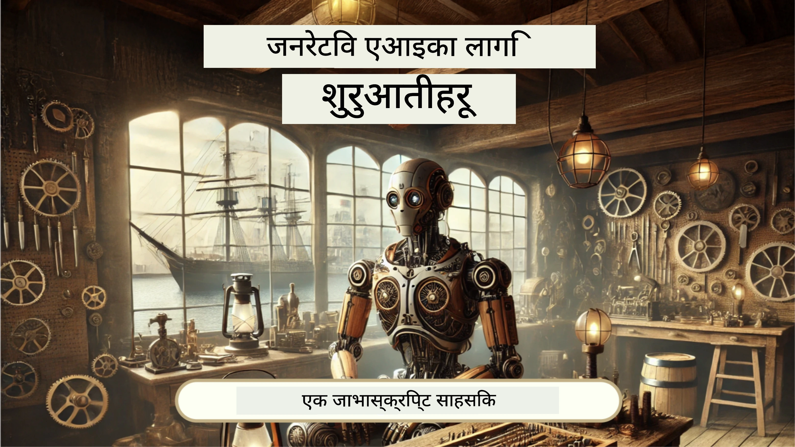
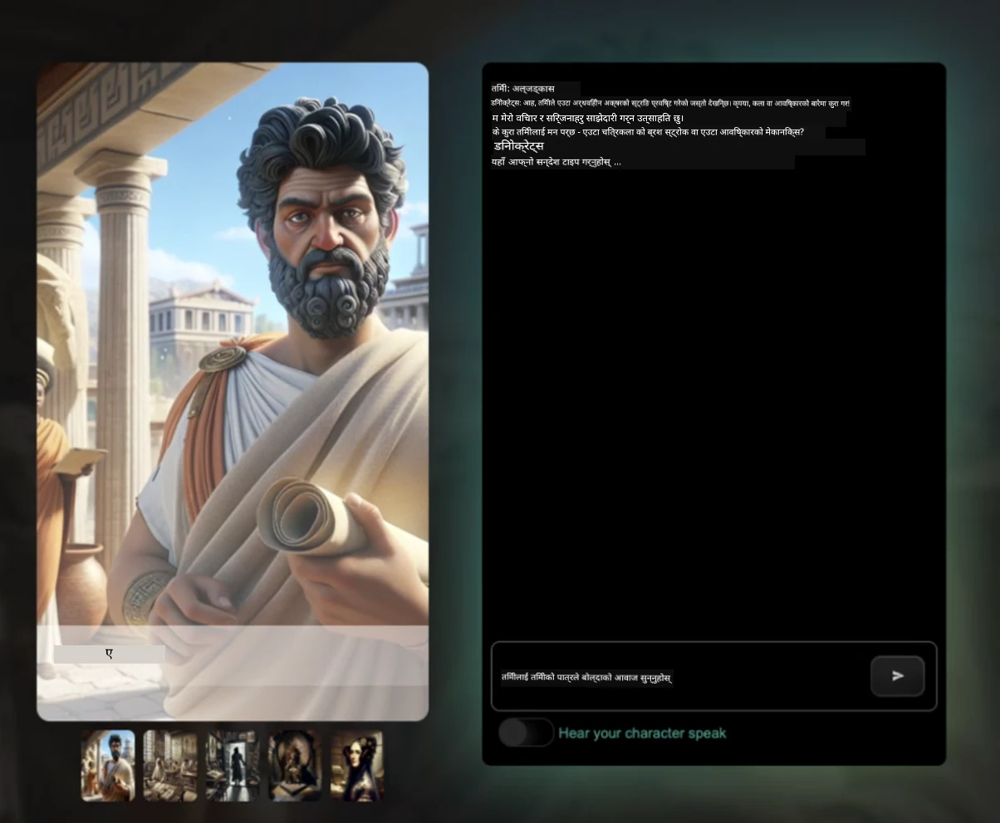
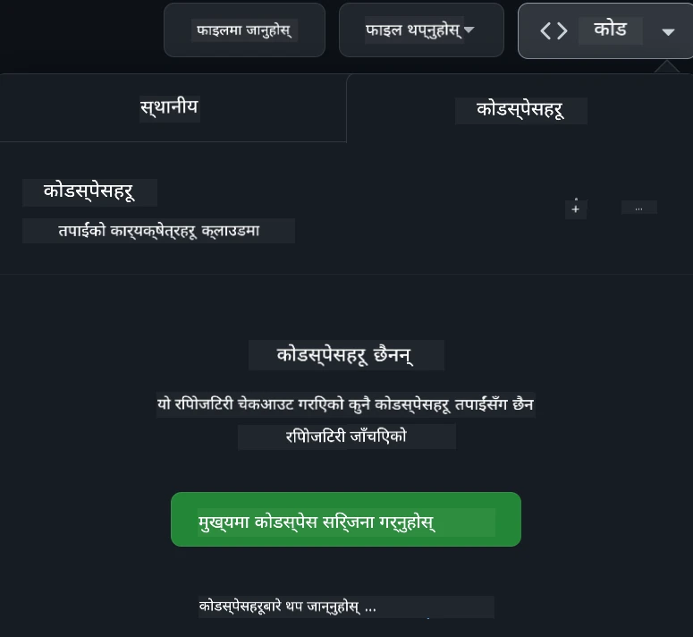

# वेब विकास आरम्भकर्ताहरूका लागि - एक पाठ्यक्रम

Microsoft Cloud Advocates द्वारा तयार गरिएको हाम्रो १२ हप्ते समग्र कोर्स संग वेब विकासका आधारहरू सिक्नुहोस्। २४ पाठहरू मध्ये प्रत्येकले JavaScript, CSS, र HTML मा हातेमालो प्रोजेक्टहरू जस्तै कि टेरारियमहरू, ब्राउजर एक्सटेन्सनहरू, र स्पेस गेमहरू मार्फत डुबकी मार्छ। क्विजहरू, छलफलहरू, र व्यावहारिक असाइन्मेन्टहरूसँग संलग्न हुनुहोस्। हाम्रो प्रभावकारी परियोजना-आधारित शिक्षाशैलीसँग तपाईंको क्षमताहरू बढाउनुहोस् र ज्ञान धारणालाई अधिकतम गर्नुहोस्। आजै आफ्नो कोडिङ यात्रा सुरु गर्नुहोस्!

Azure AI Foundry Discord मा सामेल हुनुहोस् र विशेषज्ञहरू तथा अन्य विकासकर्ताहरूसँग भेटघाट गर्नुहोस्।

[](https://discord.gg/nTYy5BXMWG)

यी स्रोतहरू प्रयोग गर्न सुरु गर्न यी कदमहरू पालना गर्नुहोस्:
1. **रिपोजिटरी फरक गर्नुहोस्**: क्लिक गर्नुहोस् [](https://GitHub.com/microsoft/Web-Dev-For-Beginners/fork)
2. **रिपोजिटरी क्लोन गर्नुहोस्**: `git clone https://github.com/microsoft/Web-Dev-For-Beginners.git`
3. [**Azure AI Foundry Discord मा सामेल हुनुहोस् र विशेषज्ञहरू तथा अन्य विकासकर्ताहरूसँग भेट्नुहोस्**](https://discord.com/invite/ByRwuEEgH4)

### 🌐 बहुभाषा समर्थन

#### GitHub Action द्वारा समर्थन (स्वचालित र सँधै अपडेट रहने)

<!-- CO-OP TRANSLATOR LANGUAGES TABLE START -->
[Arabic](../ar/README.md) | [Bengali](../bn/README.md) | [Bulgarian](../bg/README.md) | [Burmese (Myanmar)](../my/README.md) | [Chinese (Simplified)](../zh-CN/README.md) | [Chinese (Traditional, Hong Kong)](../zh-HK/README.md) | [Chinese (Traditional, Macau)](../zh-MO/README.md) | [Chinese (Traditional, Taiwan)](../zh-TW/README.md) | [Croatian](../hr/README.md) | [Czech](../cs/README.md) | [Danish](../da/README.md) | [Dutch](../nl/README.md) | [Estonian](../et/README.md) | [Finnish](../fi/README.md) | [French](../fr/README.md) | [German](../de/README.md) | [Greek](../el/README.md) | [Hebrew](../he/README.md) | [Hindi](../hi/README.md) | [Hungarian](../hu/README.md) | [Indonesian](../id/README.md) | [Italian](../it/README.md) | [Japanese](../ja/README.md) | [Kannada](../kn/README.md) | [Khmer](../km/README.md) | [Korean](../ko/README.md) | [Lithuanian](../lt/README.md) | [Malay](../ms/README.md) | [Malayalam](../ml/README.md) | [Marathi](../mr/README.md) | [Nepali](./README.md) | [Nigerian Pidgin](../pcm/README.md) | [Norwegian](../no/README.md) | [Persian (Farsi)](../fa/README.md) | [Polish](../pl/README.md) | [Portuguese (Brazil)](../pt-BR/README.md) | [Portuguese (Portugal)](../pt-PT/README.md) | [Punjabi (Gurmukhi)](../pa/README.md) | [Romanian](../ro/README.md) | [Russian](../ru/README.md) | [Serbian (Cyrillic)](../sr/README.md) | [Slovak](../sk/README.md) | [Slovenian](../sl/README.md) | [Spanish](../es/README.md) | [Swahili](../sw/README.md) | [Swedish](../sv/README.md) | [Tagalog (Filipino)](../tl/README.md) | [Tamil](../ta/README.md) | [Telugu](../te/README.md) | [Thai](../th/README.md) | [Turkish](../tr/README.md) | [Ukrainian](../uk/README.md) | [Urdu](../ur/README.md) | [Vietnamese](../vi/README.md)

> **स्थानीय रूपमा क्लोन गर्न मन पराउनुहुन्छ?**
>
> यो रिपोजिटरीमा ५०+ भाषा अनुवादहरू समावेश छन् जसले डाउनलोड साइजलाई निकै बढाउँछ। अनुवादहरू बिना क्लोन गर्न, sparse checkout प्रयोग गर्नुहोस्:
>
> **Bash / macOS / Linux:**
> ```bash
> git clone --filter=blob:none --sparse https://github.com/microsoft/Web-Dev-For-Beginners.git
> cd Web-Dev-For-Beginners
> git sparse-checkout set --no-cone '/*' '!translations' '!translated_images'
> ```
>
> **CMD (Windows):**
> ```cmd
> git clone --filter=blob:none --sparse https://github.com/microsoft/Web-Dev-For-Beginners.git
> cd Web-Dev-For-Beginners
> git sparse-checkout set --no-cone "/*" "!translations" "!translated_images"
> ```
>
> यसले तपाईलाई कोर्स पूरा गर्न आवश्यक सबै कुरा छिटो डाउनलोड गर्ने सुविधा दिन्छ।
<!-- CO-OP TRANSLATOR LANGUAGES TABLE END -->

**यदि थप अनुवादहरू चाहानुहुन्छ भने, समर्थन भएका भाषाहरू यहाँ सूचीबद्ध छन्। [यहाँ](https://github.com/Azure/co-op-translator/blob/main/getting_started/supported-languages.md)**

[](https://open.vscode.dev/microsoft/Web-Dev-For-Beginners)

#### 🧑‍🎓 _के तपाईं विद्यार्थी हुनुहुन्छ?_

[**Student Hub पृष्ठ**](https://docs.microsoft.com/learn/student-hub/?WT.mc_id=academic-77807-sagibbon) भ्रमण गर्नुहोस् जहाँ तपाईंलाई आरम्भकर्ताका स्रोतहरू, विद्यार्थी प्याकहरू र निशुल्क प्रमाणपत्र भौचर प्राप्त गर्ने तरिकाहरू फेला पर्नेछन्। यो पृष्ठ बुकमार्क गर्नुहोस् र हरेक महिना सामग्री परिवर्तन हुँदा समय-समयमा जाँच गर्नुहोस्।

### 📣 घोषणा - नयाँ GitHub Copilot Agent मोड चुनौतीहरू पूरा गर्न!

नयाँ चुनौती थपिएको छ, अधिकांश अध्यायहरूमा "GitHub Copilot Agent Challenge 🚀" खोज्नुहोस्। यो तपाईंले GitHub Copilot र Agent मोड प्रयोग गरेर पूरा गर्नु पर्ने नयाँ चुनौती हो। यदि तपाईंले पहिले Agent मोड प्रयोग गर्नुभएको छैन भने यो केवल पाठ उत्पन्न मात्र गर्दैन, यसले फाइलहरू सिर्जना र सम्पादन, कमाण्डहरू चलाउने आदि पनि गर्न सक्छ।

### 📣 घोषणा - _Generative AI प्रयोग गरी नयाँ परियोजना तयार गर्ने_

नयाँ AI सहायक परियोजना थपिएको छ, यहाँ हेर्नुहोस् [project](./9-chat-project/README.md)

### 📣 घोषणा - _Generative AI को लागि नयाँ पाठ्यक्रम_ JavaScript को लागि अहिले मात्र जारी गरिएको छ

हामीले नयाँ Generative AI पाठ्यक्रम जारी गरेका छौं, यो नछुटाउनुहोस्!

सुरु गर्न [https://aka.ms/genai-js-course](https://aka.ms/genai-js-course) भ्रमण गर्नुहोस्!



- आधारभूतदेखि RAG सम्म सबै कुरा समेट्ने पाठहरू।
- GenAI र हाम्रो सहायक एपको माध्यमबाट ऐतिहासिक पात्रहरूसँग अन्तरक्रिया गर्नुहोस्।
- रमाइलो र पदार्पणात्मक कथा, तपाईं समय यात्रा गर्दै हुनुहुनेछ!



प्रत्येक पाठमा एउटा असाइन्मेन्ट पूरा गर्न, ज्ञान जाँच गर्न र चुनौती समावेश छ, जसले तपाईंलाई यी विषयहरू सिक्न मार्गदर्शन गर्छ:
- प्रम्प्टिंग र प्रम्प्ट इन्जिनियरिङ
- पाठ र छवि अनुप्रयोग सिर्जना
- खोज अनुप्रयोगहरू

सुरु गर्न [https://aka.ms/genai-js-course](https://aka.ms/genai-js-course) भ्रमण गर्नुहोस्!


## 🌱 सुरु गर्ने तरिका

> **शिक्षकहरू**, हामीले यस पाठ्यक्रमलाई कसरी प्रयोग गर्ने भन्ने बारेमा [केही सुझावहरू समावेश गरेका छौं](for-teachers.md)। कृपया हामीलाई तपाईंको प्रतिक्रिया दिनुहोस् [हाम्रो छलफल फोरममा](https://github.com/microsoft/Web-Dev-For-Beginners/discussions/categories/teacher-corner)!

**[शिक्षार्थीहरू](https://aka.ms/student-page/?WT.mc_id=academic-77807-sagibbon)**, प्रत्येक पाठका लागि, पूर्व-लेक्चर क्विजबाट सुरु गर्नुहोस् र त्यसपछि लेक्चर सामग्री पढ्दै, विभिन्न क्रियाकलापहरू पूरा गर्दै, र पष्ट-लेक्चर क्विजबाट आफ्नो बुझाइ जाँच गर्नुहोस्।

तपाईंको सिकाइ अनुभवलाई अझ राम्रो बनाउन, साथीहरू सँग मिलेर परियोजनाहरूमा काम गर्नुहोस्! छलफलहरू हाम्रो [छलफल फोरम](https://github.com/microsoft/Web-Dev-For-Beginners/discussions) मा प्रोत्साहित गरिन्छ जहाँ हाम्रो मॉडरेटरहरूको टोली तपाईंको प्रश्नहरूको उत्तर दिन उपलब्ध हुनेछ।

तपाईंको शिक्षालाई थप अघि बढाउन, हामी [Microsoft Learn](https://learn.microsoft.com/users/wirelesslife/collections/p1ddcy5jwy0jkm?WT.mc_id=academic-77807-sagibbon) बाट थप अध्ययन सामग्रीहरू अन्वेषण गर्न अत्यधिक सिफारिस गर्छौं।

### 📋 तपाईंको वातावरण सेटअप गर्ने

यो पाठ्यक्रमले विकास वातावरण तयार गरेको छ! सुरु गर्दा तपाईं कूरिकुलमलाई [Codespace](https://github.com/features/codespaces/) (ब्राउजरमा आधारित, कुनै इन्स्टल आवश्यक पर्ने छैन) मा चलाउन वा स्थानीय रूपमा आफ्नो कम्प्युटरमा [Visual Studio Code](https://code.visualstudio.com/?WT.mc_id=academic-77807-sagibbon) जस्ता टेक्स्ट सम्पादकको प्रयोग गरी चलाउन रोज्न सक्नुहुन्छ।

#### आफ्नो रिपोजिटरी सिर्जना गर्नुहोस्
तपाईंका काम सजिलै सुरक्षित गर्नको लागि, आफ्नै प्रतिलिपि बनाउन सिफारिस गरिन्छ। यसका लागि, पृष्ठको माथिल्लो भागमा रहेको **Use this template** बटन थिच्नुहोस्। यसले तपाईंको GitHub खातामा पाठ्यक्रमको प्रतिलिपि भएको नयाँ रिपोजिटरी सिर्जना गर्दछ।

यी चरणहरू पालना गर्नुहोस्:
1. **रिपोजिटरी फरक गर्नुहोस्**: यस पृष्ठको माथिल्लो-दायाँ कुनामा रहेको "Fork" बटन क्लिक गर्नुहोस्।
2. **रिपोजिटरी क्लोन गर्नुहोस्**: `git clone https://github.com/microsoft/Web-Dev-For-Beginners.git`

#### Codespace मा कूरिकुलम चलाउने

तपाईंले सिर्जना गरेको रिपोजिटरीको प्रतिलिपिमा, **Code** बटन क्लिक गरेर **Open with Codespaces** छनौट गर्नुहोस्। यसले तपाईंको लागि नयाँ Codespace सिर्जना गर्नेछ जहाँ तपाईं काम गर्न सक्नुहुन्छ।



#### आफ्नो कम्प्युटरमा स्थानीय रूपमा कूरिकुलम चलाउने

कंप्युटरमा स्थानीय रूपमा यो कूरिकुलम चलाउन, तपाईंलाई टेक्स्ट सम्पादक, ब्राउजर र कमाण्ड लाइन उपकरण आवश्यक पर्छ। हाम्रो पहिलो पाठ, [Introduction to Programming Languages and Tools of the Trade](../../1-getting-started-lessons/1-intro-to-programming-languages),ले यी उपकरणहरु मध्ये प्रत्येकका विभिन्न विकल्पहरू प्रस्ताव गर्नेछ र तपाईंलाई सबैभन्दा उपयुक्त चयन गर्न मद्दत गर्नेछ।

हाम्रो सिफारिस [Visual Studio Code](https://code.visualstudio.com/?WT.mc_id=academic-77807-sagibbon) प्रयोग गर्नु हो, जसमा [Terminal](https://code.visualstudio.com/docs/terminal/basics/?WT.mc_id=academic-77807-sagibbon) पनि भित्रै छ। तपाईं Visual Studio Code यहाँबाट डाउनलोड गर्न सक्नुहुन्छ: [यहाँ](https://code.visualstudio.com/?WT.mc_id=academic-77807-sagibbon)।
1. आफ्नो रिपोजिटोरीलाई तपाईंको कम्प्युटरमा क्लोन गर्नुहोस्। तपाईं यो गर्न सक्नुहुन्छ **Code** बटन क्लिक गरेर र URL कपी गरेर:

    [CodeSpace](./images/createcodespace.png)

    त्यसपछि, [Visual Studio Code](https://code.visualstudio.com/?WT.mc_id=academic-77807-sagibbon) भित्र [Terminal](https://code.visualstudio.com/docs/terminal/basics/?WT.mc_id=academic-77807-sagibbon) खोल्नुहोस् र तल दिइएको कमाण्ड चलाउनुहोस्, `<your-repository-url>` लाई तपाईंले कपी गरेको URL ले प्रतिस्थापित गर्दै:

    ```bash 
    git clone <your-repository-url>
    ```

2. Visual Studio Code मा फोल्डर खोल्नुहोस्। तपाईं यसलाई **File** > **Open Folder** क्लिक गरेर र पहिले क्लोन गरेको फोल्डर छान्दै गर्न सक्नुहुन्छ।

>  सिफारिस गरिएको Visual Studio Code एक्सटेन्सनहरू:
>
> * [Live Server](https://marketplace.visualstudio.com/items?itemName=ritwickdey.LiveServer&WT.mc_id=academic-77807-sagibbon) - Visual Studio Code भित्र HTML पृष्ठहरू पूर्वावलोकन गर्न
> * [Copilot](https://marketplace.visualstudio.com/items?itemName=GitHub.copilot&WT.mc_id=academic-77807-sagibbon) - तपाईंलाई छिटो कोड लेख्न मद्दत गर्न

## 📂 प्रत्येक पाठ समावेश गर्दछ:

- वैकल्पिक स्केचनोट
- वैकल्पिक पूरक भिडियो
- पूर्व-पाठ वार्मअप क्विज
- लिखित पाठ
- परियोजना-आधारित पाठहरूको लागि, परियोजना बनाउन चरण-द्वारा-चरण गाइडहरू
- ज्ञान जाँचहरू
- एउटा चुनौती
- पूरक पढाइ
- असाइनमेन्ट
- [पाठपछि क्विज](https://ff-quizzes.netlify.app/web/)

> **क्विजहरूको बारेमा एउटा नोट**: सबै क्विजहरू Quiz-app फोल्डरमा राखिएका छन्, कुल ४८ क्विजहरू तीन प्रश्नहरू सहित। तिनीहरू यहाँ उपलब्ध छन् [यहाँ](https://ff-quizzes.netlify.app/web/), क्विज एप्लिकेसन स्थानीय रूपमा चलाउन वा Azure मा परिनियोजन गर्न सकिन्छ; `quiz-app` फोल्डरमा निर्देशनहरू पालना गर्नुहोस्।

## 🗃️ पाठहरू

|     |                       परियोजनाको नाम                       |                            सिकाइ गराउने अवधारणाहरू                             | सिकाइका उद्देश्यहरू                                                                                                                    |                                                         लिंक गरिएको पाठ                                                          |         लेखक          |
| :-: | :----------------------------------------------------------: | :--------------------------------------------------------------------: | ----------------------------------------------------------------------------------------------------------------------------------- | :----------------------------------------------------------------------------------------------------------------------------: | :---------------------: |
| 01  |                     सुरु गर्दै                      |           प्रोग्रामिङ र उपकरणहरूको परिचय           | प्रायः प्रोग्रामिङ भाषाहरूको आधारभूत ज्ञान र व्यावसायिक विकासकर्ताहरूले आफ्नो काम गर्न प्रयोग गर्ने सफ्टवेयरहरूका बारेमा सिक्नुहोस् | [प्रोग्रामिङ भाषाहरू र उपकरणहरूको परिचय](./1-getting-started-lessons/1-intro-to-programming-languages/README.md) |         Jasmine         |
| 02  |                     सुरु गर्दै                      |             GitHub का आधारहरू, टोलीसँग काम गर्ने समावेश             | आफ्नो परियोजनामा GitHub कसरी प्रयोग गर्ने, कोड आधारमा अरू व्यक्ति संग कसरी सहकार्य गर्ने                                                    |                            [GitHub परिचय](./1-getting-started-lessons/2-github-basics/README.md)                             |          Floor          |
| 03  |                     सुरु गर्दै                      |                             पहुँचयोग्यता                              | वेब पहुँचयोग्यताको आधारभूत कुरा सिक्नुहोस्                                                                                               |                       [पहुँचयोग्यता आधारहरू](./1-getting-started-lessons/3-accessibility/README.md)                       |       Christopher       |
| 04  |                        JS आधारहरू                         |                         JavaScript डाटा प्रकारहरू                          | JavaScript डाटा प्रकारहरूका आधारभूत कुरा                                                                                                 |                                       [डाटा प्रकारहरू](./2-js-basics/1-data-types/README.md)                                        |         Jasmine         |
| 05  |                        JS आधारहरू                         |                         फङ्सन र मेथडहरू                          | अनुप्रयोगको तर्क प्रवाह व्यवस्थापन गर्न फङ्सन र मेथडहरूको बारेमा सिक्नुहोस्                                                             |                              [फङ्सन र मेथडहरू](./2-js-basics/2-functions-methods/README.md)                               | Jasmine र Christopher |
| 06  |                        JS आधारहरू                         |                        JS संग निर्णय लिनु                        | निर्णय लिन्ने विधिहरू प्रयोग गरेर आफूले कोडमा सर्तहरू कसरी सिर्जना गर्ने सिक्नुहोस्                                                           |                                 [निर्णय लिनु](./2-js-basics/3-making-decisions/README.md)                                  |         Jasmine         |
| 07  |                        JS आधारहरू                         |                            एर्रे र लूपहरू                            | JavaScript मा एर्रे र लूपहरू प्रयोग गरेर डाटा संग काम गर्नुहोस्                                                                                 |                                   [एर्रे र लूपहरू](./2-js-basics/4-arrays-loops/README.md)                                    |         Jasmine         |
| 08  |       [Terrarium](./3-terrarium/solution/README.md)       |                            व्यावहारिक HTML                            | अनलाइन टेरेरियमको लेआउट निर्माण गर्दै HTML बनाउनुहोस्                                                         |                                 [HTML परिचय](./3-terrarium/1-intro-to-html/README.md)                                 |           Jen           |
| 09  |       [Terrarium](./3-terrarium/solution/README.md)       |                            व्यावहारिक CSS                             | अनलाइन टेरेरियमको शैली बनाउन CSS प्रयोग गर्नुहोस्, CSS को आधारहरू सहित पृष्ठलाई प्रतिक्रियाशील बनाउने                                         |                                  [CSS परिचय](./3-terrarium/2-intro-to-css/README.md)                                  |           Jen           |
| 10  |            [Terrarium](./3-terrarium/solution/README.md)            |                 JavaScript क्लोजर, DOM हेरफेर                  | टेरेरियमलाई ड्र्याग/ड्रप इन्टरफेस बनाउन JavaScript लेख्नुहोस्, क्लोजर र DOM हेरफेरमा केन्द्रित भएर             |                  [JavaScript क्लोजर, DOM हेरफेर](./3-terrarium/3-intro-to-DOM-and-closures/README.md)                   |           Jen           |
| 11  |          [टाइपिङ्ग खेल](./4-typing-game/solution/README.md)          |                          एक टाइपिङ्ग खेल बनाउनुहोस्                           | किबोर्ड घटनाहरूको प्रयोगबाट JavaScript अनुप्रयोगको तर्क चलाउनु कसरी गर्ने सिक्नुहोस्                                                          |                                [घटना-चालित प्रोग्रामिङ](./4-typing-game/typing-game/README.md)                                |       Christopher       |
| 12  | [हरियो ब्राउजर एक्सटेन्सन](./5-browser-extension/solution/README.md) |                         ब्राउजरसँग काम गर्दै                          | ब्राउजरहरू कसरी काम गर्छन्, इतिहास, र पहिलो ब्राउजर एक्सटेन्सनको तत्वहरू तयार गर्ने विधि सिक्नुहोस्                               |                               [ब्राउजरका बारेमा](./5-browser-extension/1-about-browsers/README.md)                                |           Jen           |
| 13  | [हरियो ब्राउजर एक्सटेन्सन](./5-browser-extension/solution/README.md) | फारम बनाउनु, API कल गर्नु र लोकल स्टोरेजमा भेरिएबलहरू राख्नु | API कल गर्न र लोकल स्टोरेजमा भेरिएबलहरू भण्डारण गर्न JavaScript प्रयोग गरेर ब्राउजर एक्सटेन्सनका तत्वहरू निर्माण गर्नुहोस्                      |                [API, फारम, र लोकल स्टोरेज](./5-browser-extension/2-forms-browsers-local-storage/README.md)                 |           Jen           |
| 14  | [हरियो ब्राउजर एक्सटेन्सन](./5-browser-extension/solution/README.md) |          ब्राउजरका पृष्ठभूमि प्रक्रियाहरू, वेब प्रदर्शन          | एक्सटेन्सनको आइकन व्यवस्थापन गर्न ब्राउजरको पृष्ठभूमि प्रक्रियाहरू प्रयोग गर्नुहोस्; वेब प्रदर्शन र केही अप्टिमाइजेसनहरूको बारेमा जान्नुहोस्   |             [पृष्ठभूमि कार्य र प्रदर्शन](./5-browser-extension/3-background-tasks-and-performance/README.md)              |           Jen           |
| 15  |           [स्पेस खेल](./6-space-game/solution/README.md)           |             JavaScript संग अझ बढी उन्नत खेल विकास             | क्लास र कम्पोजिशन दुवै प्रयोग गरी इनहेरिटेन्स र Pub/Sub ढाँचा सिक्नुहोस्, खेल विकासको तयारीका लागि              |                      [उन्नत खेल विकासमा परिचय](./6-space-game/1-introduction/README.md)                       |          Chris          |
| 16  |           [स्पेस खेल](./6-space-game/solution/README.md)           |                           क्यानभासमा चित्र बनाउने                            | क्यानभास API को बारेमा सिक्नुहोस्, जसले स्क्रिनमा तत्त्वहरू चित्रित गर्छ                                                                       |                                [क्यानभासमा चित्र बनाउने](./6-space-game/2-drawing-to-canvas/README.md)                                |          Chris          |
| 17  |           [स्पेस खेल](./6-space-game/solution/README.md)           |                   स्क्रिनमा तत्त्वहरू सार्नु                    | तत्त्वहरूलाई गति प्राप्त कसरी हुन्छ कार्टेसियन निर्देशांक र क्यानभास API प्रयोग गरेर पत्ता लगाउनुहोस्                                            |                           [तत्त्वहरू सार्ने](./6-space-game/3-moving-elements-around/README.md)                           |          Chris          |
| 18  |           [स्पेस खेल](./6-space-game/solution/README.md)           |                          ठोक्किने पहिचान                           | तत्त्वहरूलाई ठोक्कन र एक अर्कामा प्रतिक्रिया गर्न बनाउनुहोस्, कीप्रेस प्रयोग गरेर र खेलको प्रदर्शन सुनिश्चित गर्न कूलडाउन फङ्सन प्रदान गर्नुहोस्    |                              [ठोक्किने पहिचान](./6-space-game/4-collision-detection/README.md)                              |          Chris          |
| 19  |           [स्पेस खेल](./6-space-game/solution/README.md)           |                             स्कोर राख्न                              | खेलको स्थिति र प्रदर्शनमा आधारित गणितीय गणना गर्नुहोस्                                                                |                                    [स्कोर राख्ने](./6-space-game/5-keeping-score/README.md)                                    |          Chris          |
| 20  |           [स्पेस खेल](./6-space-game/solution/README.md)           |                     खेल समाप्त र पुनः सुरु गर्ने                     | खेल समाप्त गर्ने र पुनः सुरु गर्ने बारे जान्नुहोस्, जसमा स्रोतहरू क्लीनअप र भेरिएबल मानहरू रिसेट गर्ने पनि समावेश छ                              |                                [समापन अवस्था](./6-space-game/6-end-condition/README.md)                                 |          Chris          |
| 21  |         [बैंकिङ एप](./7-bank-project/solution/README.md)          |                 वेब एपमा HTML टेम्प्लेट र रुटहरू                 | मल्टिपेज वेबसाइटको संरचना स्क्याफोल्ड गर्न रुटिङ र HTML टेम्प्लेटहरू कसरी बनाउन सिक्नुहोस्                             |                            [HTML टेम्प्लेट र रुटहरू](./7-bank-project/1-template-route/README.md)                             |          Yohan          |
| 22  |         [बैंकिङ एप](./7-bank-project/solution/README.md)          |                  लगइन र दर्ता फारम बनाउने                   | फारमहरू बनाउन र मान्यता प्रक्रिया कसरी सम्हाल्ने जान्नुहोस्                                                                          |                                           [फारमहरू](./7-bank-project/2-forms/README.md)                                           |          Yohan          |
| 23  |         [बैंकिङ एप](./7-bank-project/solution/README.md)          |                   डाटा ल्याउने र प्रयोग गर्ने विधिहरू                   | तपाईंको एपमा डाटा कसरी आउँछ र जान्छ, कसरी ल्याउने, भण्डारण गर्ने र डिस्पोज गर्ने                                                 |                                            [डाटा](./7-bank-project/3-data/README.md)                                            |          Yohan          |
| 24  |         [बैंकिङ एप](./7-bank-project/solution/README.md)          |                      राज्य व्यवस्थापन अवधारणाहरू                      | तपाईंको एपले कसरी राज्य राख्छ र प्रोग्रामबाट कसरी व्यवस्थापन गर्ने सिक्नुहोस्                                                              |                                [राज्य व्यवस्थापन](./7-bank-project/4-state-management/README.md)                                |          Yohan          |
| 25 | [ब्राउजर / VScode कोड](../../8-code-editor) | VScode सँग काम गर्दै | कोड सम्पादक प्रयोग गर्न सिक्नुहोस्| [VScode कोड सम्पादक प्रयोग गर्नुहोस्](./8-code-editor/1-using-a-code-editor/README.md) | Chris |
| 26 | [AI सहायकहरू](./9-chat-project/README.md) | AI सँग काम गर्दै | आफ्नो AI सहायक बनाउने तरिका सिक्नुहोस् | [AI सहायक परियोजना](./9-chat-project/README.md) | Chris |

## 🏫 शिक्षाशास्त्र

हाम्रो पाठ्यक्रम दुई मुख्य शिक्षाशास्त्रीय सिद्धान्तहरूका साथ डिजाइन गरिएको छ:
* परियोजना-आधारित सिकाइ
* बारम्बार क्विजहरू

यो कार्यक्रम JavaScript, HTML, र CSS का आधारभूत कुरा सिकाउँछ, साथै आजका वेब विकासकर्ताहरूले प्रयोग गर्ने नयाँतम उपकरण र प्रविधिहरू पनि सिकाउँछ। विद्यार्थीहरूले टाइपिङ्ग खेल, भर्चुअल टेरेरियम, इको-मैत्री ब्राउजर एक्सटेन्सन, स्पेस-इन्वाडर शैली खेल, र बैंकिङ एप व्यवसायहरूका लागि निर्माण गरेर व्यवहारिक अनुभव प्राप्त गर्ने मौका पाउँछन्। श्रृंखलाको अन्त्यसम्म विद्यार्थीहरूले वेब विकासको दृढ बुझाइ हासिल गर्नेछन्।

> 🎓 तपाईं यस पाठ्यक्रमका पहिलो केही पाठहरूलाई Microsoft Learn मा [Learn Path](https://docs.microsoft.com/learn/paths/web-development-101/?WT.mc_id=academic-77807-sagibbon) को रूपमा लिन सक्नुहुन्छ!

सामग्री परियोजनाहरू संग मेल खाने गरी सुनिश्चित गरिएर, प्रक्रिया विद्यार्थीहरूका लागि थप आकर्षक बनेको छ र अवधारणाहरूको सम्प्रेषण बढ्छ। हामीले धेरै सुरुवाती पाठहरू JavaScript आधारभूतहरूमा पनि लेखेका छौं अवधारणाहरू परिचय गराउनका लागि, "[Beginners Series to: JavaScript](https://channel9.msdn.com/Series/Beginners-Series-to-JavaScript/?WT.mc_id=academic-77807-sagibbon)" भिडियो ट्युटोरियलहरूको संग्रहबाट भिडियोसँग मिलाएर, जसका केही लेखकहरूले यो पाठ्यक्रममा योगदान दिएका छन्।

थप रूपमा, एउटा कक्षा अगाडि गुमाएर सिकाईको उद्देश्य सेट गर्ने कम-जोखिम क्विज र कक्षा पछि अर्को क्विजले थप अवधारणाहरू सम्बन्धी सम्झनशीलता सुनिश्चित गर्दछ। यो पाठ्यक्रम लचिलो र रमाइलो हुने गरी डिजाइन गरिएको छ र पूर्ण वा अंशमा लिन सकिन्छ। परियोजनाहरू सानोतिनोतर्फ सुरु भएर १२ हप्ते चक्रको अन्त्यसम्म क्रमशः जटिल बन्दै जान्छन्।

हामीले जानाजानी JavaScript फ्रेमवर्कहरू परिचय नगरि वेब विकासकर्ताका रूपमा चाहिने आधारभूत कौशलहरूमा ध्यान केन्द्रित गर्न चाहेका छौं, फ्रेमवर्क अपनाउनु अघि, यस पाठ्यक्रम पूरा गर्ने अर्को राम्रो चरण Node.js सिक्नु हुनसक्छ अर्को भिडियो सङ्ग्रहमार्फत: "[Beginner Series to: Node.js](https://channel9.msdn.com/Series/Beginners-Series-to-Nodejs/?WT.mc_id=academic-77807-sagibbon)".

> हाम्रो [आचार संहिता](CODE_OF_CONDUCT.md) र [योगदान गर्ने](CONTRIBUTING.md) दिशानिर्देशहरू भ्रमण गर्नुहोस्। हामी तपाईंका रचनात्मक सुझावहरूलाई स्वागत गर्दछौं!


## 🧭 अफलाइन पहुँच

तपाईं [Docsify](https://docsify.js.org/#/) प्रयोग गरी यो दस्तावेजीकरण अफलाइनमा चलाउन सक्नुहुन्छ। यस रेपो लाइ फोर्क गर्नुहोस्, स्थानिय मेसिनमा [Docsify स्थापना](https://docsify.js.org/#/quickstart) गर्नुहोस्, र त्यसपछि यस रेपोको रुट फोल्डरमा `docsify serve` टाइप गर्नुहोस्। वेबसाइट पोर्ट ३००० मा तपाईंको लोकलहोस्टमा सेवा हुनेछ: `localhost:3000`।

## 📘 PDF
सबै पाठहरूको PDF [यहाँ](https://microsoft.github.io/Web-Dev-For-Beginners/pdf/readme.pdf) फेला पार्न सकिन्छ।


## 🎒 अन्य पाठ्यक्रमहरू

हाम्रो टोलीले अन्य पाठ्यक्रमहरू पनि उत्पादन गर्छ! जाँच गर्नुहोस्:

<!-- CO-OP TRANSLATOR OTHER COURSES START -->
### LangChain
[](https://aka.ms/langchain4j-for-beginners)
[](https://aka.ms/langchainjs-for-beginners?WT.mc_id=m365-94501-dwahlin)
[](https://github.com/microsoft/langchain-for-beginners?WT.mc_id=m365-94501-dwahlin)
---

### Azure / Edge / MCP / एजेन्टहरू
[](https://github.com/microsoft/AZD-for-beginners?WT.mc_id=academic-105485-koreyst)
[](https://github.com/microsoft/edgeai-for-beginners?WT.mc_id=academic-105485-koreyst)
[](https://github.com/microsoft/mcp-for-beginners?WT.mc_id=academic-105485-koreyst)
[](https://github.com/microsoft/ai-agents-for-beginners?WT.mc_id=academic-105485-koreyst)

---
 
### जनरेटिभ AI सिरिज
[](https://github.com/microsoft/generative-ai-for-beginners?WT.mc_id=academic-105485-koreyst)
[-9333EA?style=for-the-badge&labelColor=E5E7EB&color=9333EA)](https://github.com/microsoft/Generative-AI-for-beginners-dotnet?WT.mc_id=academic-105485-koreyst)
[-C084FC?style=for-the-badge&labelColor=E5E7EB&color=C084FC)](https://github.com/microsoft/generative-ai-for-beginners-java?WT.mc_id=academic-105485-koreyst)
[-E879F9?style=for-the-badge&labelColor=E5E7EB&color=E879F9)](https://github.com/microsoft/generative-ai-with-javascript?WT.mc_id=academic-105485-koreyst)

---
 
### कोर सिकाइ
[](https://aka.ms/ml-beginners?WT.mc_id=academic-105485-koreyst)
[](https://aka.ms/datascience-beginners?WT.mc_id=academic-105485-koreyst)
[](https://aka.ms/ai-beginners?WT.mc_id=academic-105485-koreyst)
[](https://github.com/microsoft/Security-101?WT.mc_id=academic-96948-sayoung)
[](https://aka.ms/webdev-beginners?WT.mc_id=academic-105485-koreyst)
[](https://aka.ms/iot-beginners?WT.mc_id=academic-105485-koreyst)
[](https://github.com/microsoft/xr-development-for-beginners?WT.mc_id=academic-105485-koreyst)

---
 
### Copilot सिरिज
[](https://aka.ms/GitHubCopilotAI?WT.mc_id=academic-105485-koreyst)
[](https://github.com/microsoft/mastering-github-copilot-for-dotnet-csharp-developers?WT.mc_id=academic-105485-koreyst)
[](https://github.com/microsoft/CopilotAdventures?WT.mc_id=academic-105485-koreyst)
<!-- CO-OP TRANSLATOR OTHER COURSES END -->

## सहयोग पाउने तरिका

यदि तपाईं अड्कनुभयो वा AI एप्स बनाउन कुनै प्रश्नहरू छन् भने। MCP मा फेला साथी सिक्दै गर्नुहुनेहरू र अनुभवी विकासकर्ताहरूको छलफलमा सहभागी हुनुहोस्। यो एक सहयोगात्मक समुदाय हो जहाँ प्रश्नहरू स्वागत हुन्छन् र ज्ञान स्वतन्त्र रूपमा साझा गरिन्छ।

[](https://discord.gg/nTYy5BXMWG)

यदि तपाईंसँग उत्पादन प्रतिक्रिया वा निर्माण गर्ने क्रममा त्रुटिहरू छन् भने भ्रमण गर्नुहोस्:

[](https://aka.ms/foundry/forum)

## लाइसेन्स

यस रिपोजिटोरीलाई MIT लाइसेन्स अन्तर्गत लाइसेन्स गरिएको छ। थप जानकारीका लागि [LICENSE](../../LICENSE) फाइल हेर्नुहोस्।

---

<!-- CO-OP TRANSLATOR DISCLAIMER START -->
**अस्वीकरण**:
यो दस्तावेज AI अनुवाद सेवा [Co-op Translator](https://github.com/Azure/co-op-translator) को प्रयोग गरी अनुवाद गरिएको हो। हामी शुद्धताको प्रयास गर्छौं भने पनि कृपया जानकार हुनुहोस् कि स्वचालित अनुवादहरूमा त्रुटि वा असावधानी हुनसक्छ। मूल दस्तावेज यसको मूल भाषामा आधिकारिक स्रोत मानिन्छ। महत्वपूर्ण जानकारीको लागि, विज्ञ व्यावसायिक मानव अनुवाद सिफारिस गरिन्छ। यस अनुवादको प्रयोगबाट उत्पन्न हुने कुनै पनि गलत बुझाई वा गलत व्याख्याका लागि हामी जिम्मेवार छैनौं।
<!-- CO-OP TRANSLATOR DISCLAIMER END -->