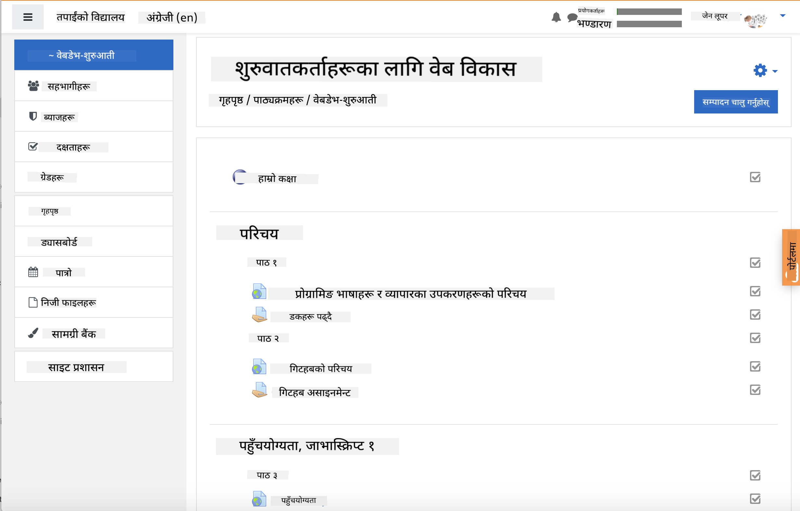
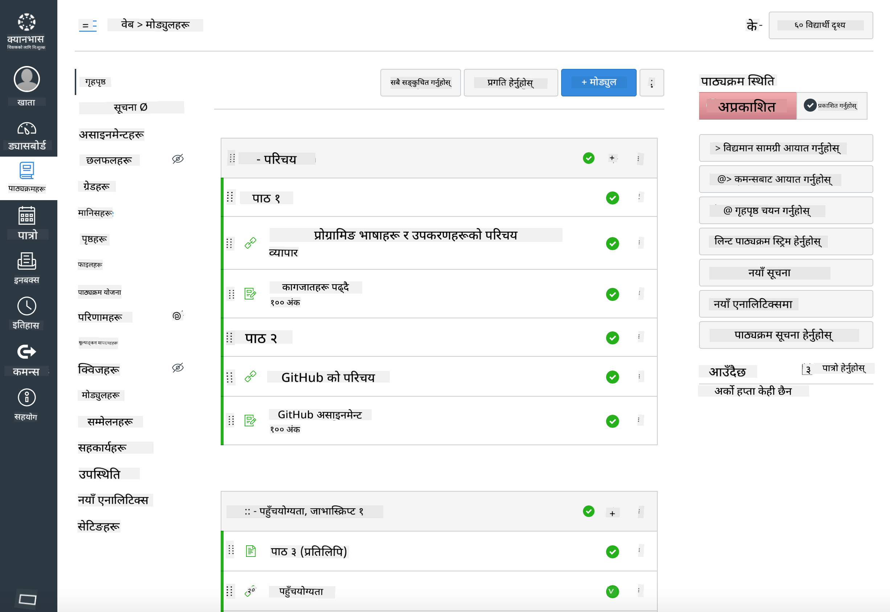

<!--
CO_OP_TRANSLATOR_METADATA:
{
  "original_hash": "75cb51f7ca9ea0b097ef4a1287e9290c",
  "translation_date": "2025-08-25T20:56:33+00:00",
  "source_file": "for-teachers.md",
  "language_code": "ne"
}
-->
## शिक्षकहरूका लागि

के तपाईं आफ्नो कक्षाकोठामा यो पाठ्यक्रम प्रयोग गर्न चाहनुहुन्छ? कृपया निःसंकोच प्रयोग गर्नुहोस्!

वास्तवमा, तपाईं यसलाई GitHub Classroom प्रयोग गरेर GitHub भित्रै प्रयोग गर्न सक्नुहुन्छ।

त्यसका लागि, यो रिपोजिटरीलाई fork गर्नुहोस्। तपाईंलाई प्रत्येक पाठका लागि छुट्टै रिपोजिटरी बनाउनुपर्नेछ, त्यसैले प्रत्येक फोल्डरलाई छुट्टै रिपोजिटरीमा निकाल्नुपर्नेछ। यसरी, [GitHub Classroom](https://classroom.github.com/classrooms) ले प्रत्येक पाठलाई छुट्टै रूपमा लिन सक्छ। 

यी [पूर्ण निर्देशनहरू](https://github.blog/2020-03-18-set-up-your-digital-classroom-with-github-classroom/) ले तपाईंलाई कक्षाकोठा सेटअप गर्ने तरिका बुझ्न मद्दत गर्नेछ।

## Moodle, Canvas वा Blackboard मा प्रयोग गर्दै

यो पाठ्यक्रम यी Learning Management Systems मा राम्रोसँग काम गर्दछ! पूर्ण सामग्रीका लागि [Moodle अपलोड फाइल](../../../../../../../teaching-files/webdev-moodle.mbz) प्रयोग गर्नुहोस्, वा केही सामग्री समावेश भएको [Common Cartridge फाइल](../../../../../../../teaching-files/webdev-common-cartridge.imscc) प्रयास गर्नुहोस्। Moodle Cloud ले पूर्ण Common Cartridge निर्यातलाई समर्थन गर्दैन, त्यसैले Moodle डाउनलोड फाइल प्रयोग गर्नु राम्रो हुन्छ, जसलाई Canvas मा अपलोड गर्न सकिन्छ। कृपया हामीलाई यो अनुभव सुधार गर्न कसरी सहयोग गर्न सकिन्छ भन्नुहोस्।

> Moodle कक्षाकोठामा पाठ्यक्रम

> Canvas मा पाठ्यक्रम

## रिपोजिटरीलाई जस्ताको तस्तै प्रयोग गर्दै

यदि तपाईं GitHub Classroom प्रयोग नगरीकन यो रिपोजिटरीलाई हालको अवस्थामा प्रयोग गर्न चाहनुहुन्छ भने, त्यो पनि सम्भव छ। तपाईंले आफ्ना विद्यार्थीहरूलाई कुन पाठ सँगै काम गर्नुपर्ने हो भनेर जानकारी दिनुपर्नेछ।

अनलाइन ढाँचामा (Zoom, Teams, वा अन्य) तपाईं क्विजहरूको लागि ब्रेकआउट रूमहरू बनाउन सक्नुहुन्छ, र विद्यार्थीहरूलाई सिक्न तयार हुन मद्दत गर्न मार्गदर्शन गर्न सक्नुहुन्छ। त्यसपछि विद्यार्थीहरूलाई क्विजहरूमा सहभागी हुन आमन्त्रित गर्नुहोस् र निश्चित समयमा 'issues' को रूपमा आफ्नो उत्तरहरू पेश गर्न भन्नुहोस्। यदि तपाईं चाहनुहुन्छ भने विद्यार्थीहरूले खुला रूपमा सहकार्य गरेर काम गर्नका लागि असाइनमेन्टहरू पनि यसैगरी गर्न सक्नुहुन्छ।

यदि तपाईंलाई बढी निजी ढाँचा मनपर्छ भने, आफ्ना विद्यार्थीहरूलाई पाठ्यक्रमलाई पाठ-पाठ अनुसार आफ्नै GitHub रिपोजिटरीहरूमा निजी रूपमा fork गर्न भन्नुहोस्, र तपाईंलाई पहुँच दिन भन्नुहोस्। त्यसपछि उनीहरूले क्विजहरू र असाइनमेन्टहरू निजी रूपमा पूरा गर्न सक्छन् र तपाईंलाई आफ्नो कक्षाकोठा रिपोजिटरीमा issues मार्फत पेश गर्न सक्छन्।

अनलाइन कक्षाकोठा ढाँचामा यसलाई काम गराउने धेरै तरिकाहरू छन्। कृपया तपाईंका लागि के राम्रो काम गर्छ भन्ने कुरा हामीलाई बताउनुहोस्!

## कृपया आफ्नो विचार दिनुहोस्!

हामी यो पाठ्यक्रम तपाईं र तपाईंका विद्यार्थीहरूको लागि उपयोगी बनाउन चाहन्छौं। [Teacher corner](https://github.com/microsoft/Web-Dev-For-Beginners/discussions/categories/teacher-corner) मा हामीसँग जडान गर्नुहोस् र कुनै पनि अनुरोध, बगहरू र प्रतिक्रिया दिनका लागि [**नयाँ issue खोल्नुहोस्**](https://github.com/microsoft/Web-Dev-For-Beginners/issues/new/choose)।

**अस्वीकरण**:  
यो दस्तावेज़ AI अनुवाद सेवा [Co-op Translator](https://github.com/Azure/co-op-translator) प्रयोग गरेर अनुवाद गरिएको छ। हामी शुद्धताको लागि प्रयास गर्छौं, तर कृपया ध्यान दिनुहोस् कि स्वचालित अनुवादहरूमा त्रुटिहरू वा अशुद्धताहरू हुन सक्छ। यसको मूल भाषा मा रहेको मूल दस्तावेज़लाई आधिकारिक स्रोत मानिनुपर्छ। महत्वपूर्ण जानकारीको लागि, व्यावसायिक मानव अनुवाद सिफारिस गरिन्छ। यस अनुवादको प्रयोगबाट उत्पन्न हुने कुनै पनि गलतफहमी वा गलत व्याख्याको लागि हामी जिम्मेवार हुने छैनौं।