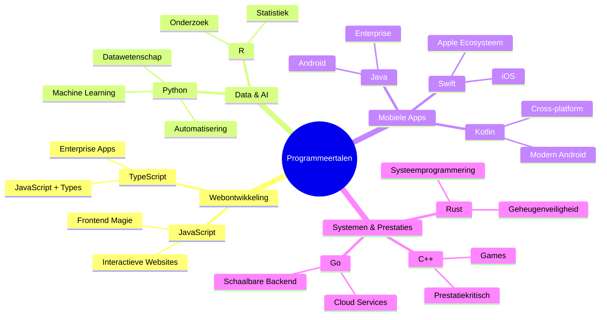
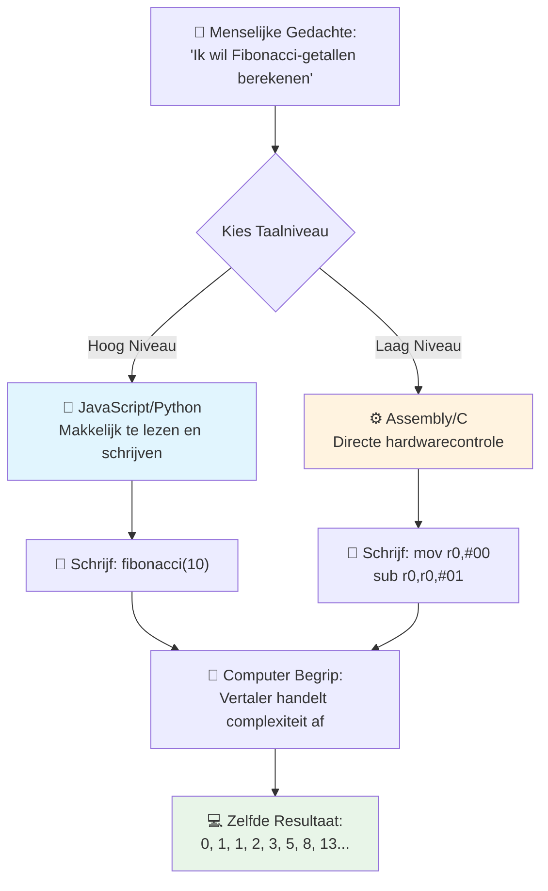
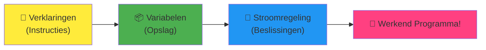
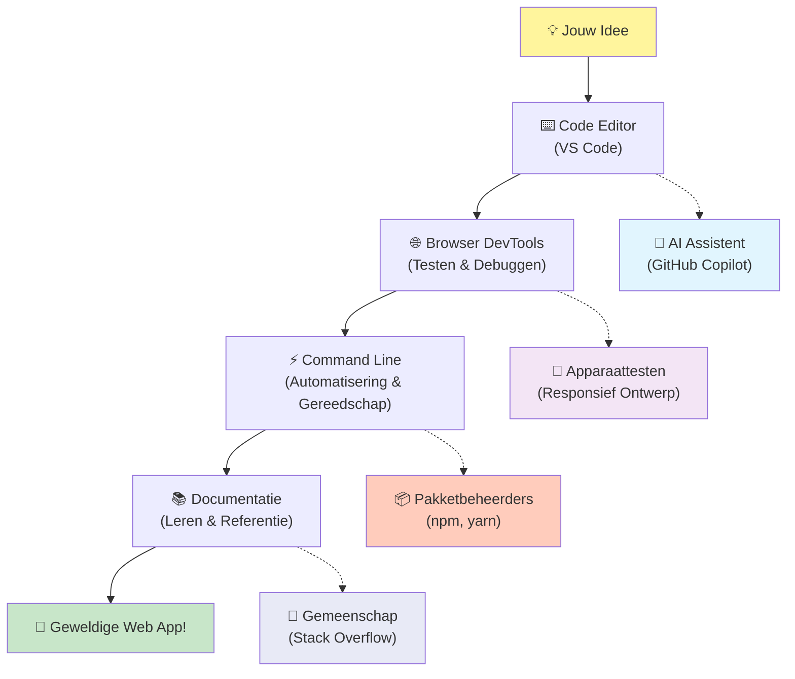
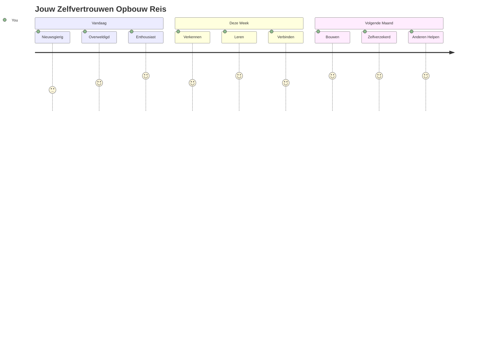

# Introductie tot Programmeertalen en Moderne Ontwikkelaarstools
 
Hey daar, toekomstige ontwikkelaar! 👋 Mag ik je iets vertellen dat me elke dag nog kippenvel geeft? Je staat op het punt te ontdekken dat programmeren niet alleen over computers gaat – het gaat erom dat je echte superkrachten hebt om je wildste ideeën tot leven te brengen!

Je kent dat moment wel wanneer je je favoriete app gebruikt en alles gewoon perfect klikt? Wanneer je op een knop tikt en er iets magisch gebeurt waardoor je denkt "wow, hoe hebben ze DAT gedaan?" Wel, iemand net zoals jij – waarschijnlijk om 2 uur ’s nachts in zijn favoriete koffietent met zijn derde espresso – heeft de code geschreven die die magie creëerde. En hier komt het deel dat je versteld zal doen staan: aan het einde van deze les begrijp je niet alleen hoe ze het deden, maar je staat te popelen om het zelf te proberen!

Kijk, ik snap helemaal dat programmeren nu misschien intimiderend aanvoelt. Toen ik net begon, dacht ik eerlijk gezegd dat je een soort rekenwonder moest zijn of al aan het coderen moest zijn sinds je vijf jaar was. Maar hier is wat mijn perspectief compleet veranderde: programmeren is precies als het leren voeren van gesprekken in een nieuwe taal. Je begint met "hallo" en "dank je," dan werk je toe naar het bestellen van koffie, en voor je het weet, voer je diepe filosofische gesprekken! Maar in dit geval heb je gesprekken met computers, en eerlijk? Zij zijn de meest geduldige gesprekspartners die je ooit zult hebben – ze beoordelen je fouten nooit en ze zijn altijd enthousiast om het opnieuw te proberen!

Vandaag gaan we de ongelooflijke tools verkennen die moderne webontwikkeling niet alleen mogelijk maken, maar ook ronduit verslavend. Ik heb het over precies dezelfde editors, browsers en workflows die ontwikkelaars bij Netflix, Spotify en je favoriete indie-appstudio elke dag gebruiken. En hier komt het deel waar je een vreugdedansje van gaat doen: de meeste van deze professionele, industriestandaardtools zijn helemaal gratis!


> Sketchnote door [Tomomi Imura](https://twitter.com/girlie_mac)


```mermaid
journey
    title Je Programmeerreis Vandaag
    section Ontdekken
      Wat is Programmeren: 5: You
      Programmeertalen: 4: You
      Overzicht Hulpmiddelen: 5: You
    section Verkennen
      Code Editors: 4: You
      Browsers & DevTools: 5: You
      Command Line: 3: You
    section Oefenen
      Taal Detective: 4: You
      Hulpmiddel Verkenning: 5: You
      Community Connectie: 5: You
```
## Laten We Kijken Wat Je Al Weet!

Voordat we aan het leuke gedeelte beginnen, ben ik benieuwd – wat weet jij al over deze programmeerwereld? En luister, mocht je naar deze vragen kijken en denken "ik heb er letterlijk geen idee van," dan is dat niet alleen prima, het is perfect! Dat betekent dat je precies op de juiste plek bent. Zie deze quiz als een warming-up voor een workout – we maken die breinspieren alvast los!

[Neem de pre-les quiz](https://ff-quizzes.netlify.app/web/)


## Het Avontuur Waar We Samen Aan Gaan

Oké, ik ben echt super enthousiast over wat we vandaag gaan ontdekken! Serieus, ik wou dat ik je gezicht kon zien als sommige van deze concepten ineens klikken. Dit is de ongelooflijke reis die we samen gaan maken:

- **Wat programmeren eigenlijk is (en waarom het het coolste ooit is!)** – We gaan ontdekken hoe code letterlijk de onzichtbare magie is die alles om je heen aandrijft, van dat alarm dat op de een of andere manier weet dat het maandagochtend is tot het algoritme dat perfect je Netflix-aanbevelingen samenstelt
- **Programmeertalen en hun geweldige persoonlijkheden** – Stel je eens voor dat je een feest binnenloopt waar iedereen compleet verschillende superkrachten en manieren heeft om problemen op te lossen. Zo is de wereld van programmeertalen, en je zult ze geweldig vinden om te ontmoeten!
- **De fundamentele bouwstenen die digitale magie mogelijk maken** – Zie deze als het ultieme creatieve LEGO-set. Zodra je begrijpt hoe deze stukjes in elkaar passen, besef je dat je letterlijk alles kunt bouwen wat je verbeelding maar kan bedenken
- **Professionele tools die je het gevoel geven alsof je zojuist een toverstaf hebt gekregen** – Ik overdrijf niet – deze tools geven je echt het gevoel dat je superkrachten hebt, en het beste deel? Het zijn dezelfde tools die de professionals gebruiken!

> 💡 **Dit is het punt:** Probeer vandaag niet alles te memoriseren! Op dit moment wil ik alleen dat je die vonk van opwinding voelt over wat er mogelijk is. De details blijven vanzelf hangen terwijl we samen oefenen – zo leer je echt!

> Je kunt deze les volgen op [Microsoft Learn](https://learn.microsoft.com/en-us/learn/modules/web-development-101/introduction-programming/?WT.mc_id=academic-77807-sagibbon)!

## Dus Wat *Is* Programmering Eigenlijk?

Oké, laten we de miljoen-dollar-vraag aanpakken: wat is programmeren nu eigenlijk?

Ik vertel je een verhaal dat mijn kijk hierop compleet veranderde. Vorige week probeerde ik mijn moeder uit te leggen hoe ze onze nieuwe smart TV-afstandsbediening moest gebruiken. Ik betrapte mezelf erop dat ik zei: "Druk op de rode knop, maar niet de grote rode knop, de kleine rode knop links... nee, je andere links... oké, hou ‘m nu twee seconden ingedrukt, niet één, niet drie..." Klinkt bekend? 😅

Dat is programmeren! Het is de kunst om ongelooflijk gedetailleerde, stapsgewijze instructies te geven aan iets dat heel krachtig is maar alles perfect uitgelegd moet krijgen. Alleen leg je het niet uit aan je moeder (die kan vragen "welke rode knop?!"), maar aan een computer (die precies doet wat je zegt, ook als wat je zei niet helemaal is wat je bedoelde).

Dit blies mijn geest helemaal weg toen ik het voor het eerst leerde: computers zijn eigenlijk best eenvoudig van binnenuit. Ze begrijpen letterlijk maar twee dingen – 1 en 0, wat in feite gewoon "ja" en "nee" of "aan" en "uit" is. Dat is het! Maar hier wordt het magisch – we hoeven niet in 1’ en 0’s te praten alsof we in The Matrix zitten. Daar komen **programmeertalen** om de hoek kijken. Die zijn als de beste vertaler ter wereld die je volkomen normale menselijke gedachten vertaalt naar computertaal.

En dit geeft me nog steeds echte kippenvel elke ochtend als ik wakker word: letterlijk *alles* digitaal in je leven begon met iemand net zoals jij, waarschijnlijk in pyjama met een kop koffie, code typend op zijn laptop. Die Instagram-filter die je er perfect uit laat zien? Iemand heeft die gecodeerd. Die aanbeveling die je naar je nieuwe favoriete nummer leidde? Een ontwikkelaar heeft dat algoritme gebouwd. De app die je helpt om de rekening met vrienden te splitsen? Ja, iemand dacht "dit is vervelend, dat kan ik wel fixen" en toen... deden ze het!

Als je leert programmeren, leer je niet alleen een nieuwe vaardigheid – je wordt onderdeel van een ongelooflijke gemeenschap van probleemoplossers die hun dagen doorbrengen met denken: "Wat als ik iets kon bouwen dat iemands dag net een beetje beter maakt?" Eerlijk, is er iets cooler dan dat?

✅ **Leuk weetje**: Hier is iets supergaafs om op te zoeken als je even tijd hebt – wie denk je dat ’s werelds eerste computerprogrammeur was? Ik geef je een hint: het is misschien niet wie je verwacht! Het verhaal achter deze persoon is absoluut fascinerend en laat zien dat programmeren altijd al ging over creatief problemen oplossen en buiten de gebaande paden denken.

### 🧠 **Check-in: Hoe Voel Je Je?**

**Neem even de tijd om na te denken:**
- Maakt het idee van "instructies geven aan computers" nu voor jou zin?
- Kun je een dagelijkse taak bedenken die je met programmeren zou willen automatiseren?
- Welke vragen borrelen er op in je hoofd over die hele programmeerwereld?

> **Onthoud:** Het is volkomen normaal als sommige concepten nu nog wazig aanvoelen. Programmeren leren is net zoals een nieuwe taal leren – het kost tijd om je hersenen die neurale paden te laten bouwen. Je doet het geweldig!

## Programmeertalen Zijn Net Verschillende Smaken Magie

Oké, dit klinkt raar, maar blijf even bij me – programmeertalen zijn net als verschillende soorten muziek. Denk er eens over na: je hebt jazz, wat soepel en improviserend is, rock die krachtig en rechttoe-rechtaan is, klassiek dat elegant en gestructureerd is, en hip-hop dat creatief en expressief is. Elke stijl heeft zijn eigen vibe, zijn eigen gemeenschap van gepassioneerde fans, en elke is perfect voor verschillende stemmingen en gelegenheden.

Programmeertalen werken precies zo! Je zou niet dezelfde taal gebruiken om een leuk mobiel spel te bouwen als om enorme hoeveelheden klimaatdata te verwerken, net zoals je bij een yogales waarschijnlijk geen death metal afspeelt (nou ja, in de meeste yogalessen dan! 😄).

Maar hier gaat mijn verstand keer op keer stuk: deze talen zijn als de meest geduldige, briljante tolk ter wereld die naast je zit. Je kunt je ideeën uitdrukken op een manier die natuurlijk aanvoelt voor je menselijke brein, en zij regelen al het ongelooflijk complexe werk om dat te vertalen naar de 1’en en 0’en waar computers echt mee communiceren. Het is alsof je een vriend hebt die perfect vloeiend is in zowel "menselijke creativiteit" als "computerlogica" – en die nooit moe wordt, nooit koffiepauzes nodig heeft, en je nooit veroordeelt als je dezelfde vraag twee keer stelt!

### Populaire Programmeertalen en Waar Ze Voor Worden Gebruikt


```mermaid
mindmap
  root((Programmeertalen))
    Webontwikkeling
      JavaScript
        Frontend Magie
        Interactieve Websites
      TypeScript
        JavaScript + Types
        Enterprise Apps
    Data & AI
      Python
        Datawetenschap
        Machine Learning
        Automatisering
      R
        Statistiek
        Onderzoek
    Mobiele Apps
      Java
        Android
        Enterprise
      Swift
        iOS
        Apple Ecosysteem
      Kotlin
        Modern Android
        Cross-platform
    Systemen & Prestaties
      C++
        Games
        Prestatiekritisch
      Rust
        Geheugenveiligheid
        Systeemprogrammering
      Go
        Cloud Services
        Schaalbare Backend
```
| Language | Best For | Why It's Popular |
|----------|----------|------------------|
| **JavaScript** | Webontwikkeling, gebruikersinterfaces | Draait in browsers en ondersteunt interactieve websites |
| **Python** | Datawetenschap, automatisering, AI | Makkelijk te lezen en te leren, krachtige bibliotheken |
| **Java** | Enterprise-applicaties, Android-apps | Platformonafhankelijk, robuust voor grote systemen |
| **C#** | Windows-applicaties, game-ontwikkeling | Sterke ondersteuning van het Microsoft-ecosysteem |
| **Go** | Cloud-services, backendsystemen | Snel, simpel, ontworpen voor moderne computing |

### High-Level versus Low-Level Talen

Oké, dit was eerlijk gezegd het concept dat mijn brein brak toen ik begon, dus ik deel de analogie die het voor mij uiteindelijk duidelijk maakte – en hopelijk helpt het jou ook!

Stel je voor dat je in een land bent waar je de taal niet spreekt en je dringend het dichtstbijzijnde toilet moet vinden (we zijn allemaal wel eens zo geweest, toch? 😅):

- **Low-level programmeren** is alsof je de lokale dialect zo goed leert dat je een praatje kan maken met de oma die fruit verkoopt op de hoek, met culturele verwijzingen, lokale straattaal en inside jokes die alleen iemand die daar is opgegroeid zou begrijpen. Supper indrukwekkend en ongelooflijk efficiënt... als je toevallig vloeiend bent! Maar best overweldigend als je alleen een wc zoekt.

- **High-level programmeren** is alsof je die geweldige lokale vriend hebt die je gewoon begrijpt. Je zegt "ik moet echt een wc vinden" in gewoon Engels, en die regelt dan alle culturele vertaling en geeft je aanwijzingen die voor jouw niet-lokale brein helemaal logisch zijn.

In programmeertaal:
- **Low-level talen** (zoals Assembly of C) laten je heel gedetailleerd praten met de hardware van de computer, maar je moet denken als een machine, wat... nou ja, zeg maar een behoorlijke mentale omschakeling is!
- **High-level talen** (zoals JavaScript, Python of C#) laten je denken als een mens terwijl zij het machine-taaltje achter de schermen regelen. Bovendien hebben ze ongelooflijk gastvrije communities vol mensen die zich herinneren hoe het was om nieuw te zijn en die je echt willen helpen!

Raad eens met welke talen ik zou aanraden te beginnen? 😉 High-level talen zijn zoals zijwieltjes die je eigenlijk nooit wilt afdoen omdat ze alles zoveel leuker maken!


```mermaid
flowchart TB
    A["👤 Menselijke Gedachte:<br/>'Ik wil Fibonacci-getallen berekenen'"] --> B{Kies Taalniveau}
    
    B -->|Hoog Niveau| C["🌟 JavaScript/Python<br/>Makkelijk te lezen en schrijven"]
    B -->|Laag Niveau| D["⚙️ Assembly/C<br/>Directe hardwarecontrole"]
    
    C --> E["📝 Schrijf: fibonacci(10)"]
    D --> F["📝 Schrijf: mov r0,#00<br/>sub r0,r0,#01"]
    
    E --> G["🤖 Computer Begrip:<br/>Vertaler handelt complexiteit af"]
    F --> G
    
    G --> H["💻 Zelfde Resultaat:<br/>0, 1, 1, 2, 3, 5, 8, 13..."]
    
    style C fill:#e1f5fe
    style D fill:#fff3e0
    style H fill:#e8f5e8
```
### Ik Laat Je Zien Waarom High-Level Talen Veel Vriendelijker Zijn

Oké, ik ga je iets laten zien dat perfect illustreert waarom ik verliefd werd op high-level talen, maar eerst – beloof me iets. Als je die eerste codevoorbeelden ziet, raak niet in paniek! Het hoort er een beetje intimiderend uit te zien. Dat is precies het punt dat ik maak!

We gaan naar exact dezelfde taak kijken, geschreven in twee totaal verschillende stijlen. Beide maken wat men de Fibonacci-reeks noemt – het is zo’n prachtig wiskundig patroon waarbij elk getal de som is van de twee voorgaande: 0, 1, 1, 2, 3, 5, 8, 13... (Leuk weetje: je vindt dit patroon letterlijk overal in de natuur – in zonnebloemzaadspiraaltjes, dennenappelpatronen en zelfs in de vorming van sterrenstelsels!)

Klaar om het verschil te zien? Let’s go!

**High-level taal (JavaScript) – Mensvriendelijk:**

```javascript
// Stap 1: Basisopzet van Fibonacci
const fibonacciCount = 10;
let current = 0;
let next = 1;

console.log('Fibonacci sequence:');
```

**Dit doet deze code:**
- **Declareert** een constante om aan te geven hoeveel Fibonacci-getallen we willen genereren
- **Initialiseert** twee variabelen om het huidige en volgende nummer in de reeks bij te houden
- **Stelt in** de beginwaarden (0 en 1) die het Fibonacci-patroon definiëren
- **Laat zien** een koptekstbericht om onze output te identificeren

```javascript
// Stap 2: Genereer de reeks met een lus
for (let i = 0; i < fibonacciCount; i++) {
  console.log(`Position ${i + 1}: ${current}`);
  
  // Bereken het volgende nummer in de reeks
  const sum = current + next;
  current = next;
  next = sum;
}
```

**Wat hier gebeurt, uitgelegd:**
- **Loop** door elke positie in onze reeks met een `for`-lus
- **Toon** elk getal met zijn positie met behulp van template literals
- **Bereken** het volgende Fibonacci-getal door huidige en volgende waardes op te tellen
- **Update** onze variabelen om naar de volgende iteratie te gaan

```javascript
// Stap 3: Moderne functionele benadering
const generateFibonacci = (count) => {
  const sequence = [0, 1];
  
  for (let i = 2; i < count; i++) {
    sequence[i] = sequence[i - 1] + sequence[i - 2];
  }
  
  return sequence;
};

// Voorbeeld van gebruik
const fibSequence = generateFibonacci(10);
console.log(fibSequence);
```

**In de bovenstaande hebben we:**
- **Een herbruikbare functie gemaakt** met moderne arrow function-syntaxis
- **Een array gebouwd** om de hele reeks op te slaan in plaats van één voor één weer te geven
- **Array-indexering gebruikt** om elk nieuw getal uit vorige waardes te berekenen
- **De volledige reeks teruggegeven** voor flexibel gebruik in andere delen van ons programma

**Low-level taal (ARM Assembly) – Computer-vriendelijk:**

```assembly
 area ascen,code,readonly
 entry
 code32
 adr r0,thumb+1
 bx r0
 code16
thumb
 mov r0,#00
 sub r0,r0,#01
 mov r1,#01
 mov r4,#10
 ldr r2,=0x40000000
back add r0,r1
 str r0,[r2]
 add r2,#04
 mov r3,r0
 mov r0,r1
 mov r1,r3
 sub r4,#01
 cmp r4,#00
 bne back
 end
```

Merk op hoe de JavaScript-versie bijna leest als Engelse instructies, terwijl de Assembly-versie cryptische commando’s gebruikt die direct de processor van de computer aansturen. Beide bereiken exact dezelfde taak, maar de high-level taal is veel makkelijker voor mensen om te begrijpen, schrijven en onderhouden.

**Belangrijkste verschillen die je zult zien:**
- **Leesbaarheid**: JavaScript gebruikt beschrijvende namen zoals `fibonacciCount` terwijl Assembly cryptische labels gebruikt zoals `r0`, `r1`
- **Commentaar**: Hoog-niveau talen moedigen verklarende commentaren aan die de code zelf-documenterend maken
- **Structuur**: De logische stroom van JavaScript komt overeen met hoe mensen stap voor stap over problemen nadenken
- **Onderhoud**: Het bijwerken van de JavaScript-versie voor verschillende vereisten is eenvoudig en duidelijk

✅ **Over de Fibonacci-reeks**: Dit absoluut prachtige getallenpatroon (waarbij elk getal gelijk is aan de som van de twee ervoor: 0, 1, 1, 2, 3, 5, 8...) komt letterlijk *overal* in de natuur voor! Je vindt het in zonnebloemspiralen, dennenappels, de manier waarop nautilusschelpen krullen, en zelfs in hoe boomtakken groeien. Het is best verbluffend hoe wiskunde en code ons kunnen helpen de patronen die de natuur gebruikt om schoonheid te creëren te begrijpen en na te bootsen!


## De Bouwstenen Die De Magie Maken

Oké, nu je hebt gezien hoe programmeertalen er in actie uitzien, laten we de fundamentele stukjes ontleden die letterlijk elk programma ooit geschreven vormen. Zie deze als de essentiële ingrediënten in je favoriete recept – zodra je begrijpt wat elk ervan doet, kun je vrijwel elke taal lezen en schrijven!

Dit is een beetje als het leren van de grammatica van programmeren. Weet je nog op school toen je leerde over zelfstandige naamwoorden, werkwoorden, en hoe je zinnen in elkaar zet? Programmeren heeft zijn eigen versie van grammatica, en eerlijk gezegd is die veel logischer en vergevingsgezinder dan de Engelse grammatica ooit was! 😄

### Statements: De Stapsgewijze Instructies

Laten we beginnen met **statements** – deze zijn als individuele zinnen in een gesprek met je computer. Elk statement vertelt de computer om één specifiek ding te doen, een beetje als het geven van aanwijzingen: "Sla hier linksaf," "Stop bij het rode licht," "Parkeer op die plek."

Wat ik leuk vind aan statements is hoe leesbaar ze meestal zijn. Kijk hier eens naar:

```javascript
// Basisverklaringen die enkele acties uitvoeren
const userName = "Alex";                    
console.log("Hello, world!");              
const sum = 5 + 3;                         
```

**Dit is wat deze code doet:**
- **Declareer** een constante variabele om de naam van een gebruiker op te slaan
- **Toon** een begroetingsbericht in de console-uitvoer
- **Bereken** en sla het resultaat van een wiskundige bewerking op

```javascript
// Instructies die interageren met webpagina's
document.title = "My Awesome Website";      
document.body.style.backgroundColor = "lightblue";
```

**Stap voor stap, dit gebeurt er:**
- **Wijzig** de titel van de webpagina die in het browsertabblad verschijnt
- **Verander** de achtergrondkleur van de hele pagina

### Variabelen: Het Geheugensysteem van Je Programma

Oké, **variabelen** zijn eerlijk gezegd een van mijn allerfavoriete concepten om uit te leggen omdat ze zo erg lijken op dingen die je elke dag al gebruikt!

Denk even aan je telefooncontactenlijst. Je onthoudt niet het telefoonnummer van iedereen – in plaats daarvan sla je op "Mama," "Beste Vriend," of "Pizzaria Die Tot 2 uur 's nachts Bezorgen" en laat je telefoon de nummers onthouden. Variabelen werken precies hetzelfde! Ze zijn als gelabelde containers waarin je programma informatie kan opslaan en later kan ophalen met een naam die echt logisch is.

Wat echt gaaf is: variabelen kunnen veranderen terwijl je programma draait (vandaar de naam "variabele" – zie wat ze daar deden?). Net als dat je misschien dat pizzaria-contact bijwerkt wanneer je ergens nog beter ontdekt, kunnen variabelen worden bijgewerkt als je programma nieuwe informatie leert of als situaties veranderen!

Laat me je laten zien hoe mooi simpel dit kan zijn:

```javascript
// Stap 1: Basisvariabelen aanmaken
const siteName = "Weather Dashboard";        
let currentWeather = "sunny";               
let temperature = 75;                       
let isRaining = false;                      
```

**Deze concepten begrijpen:**
- **Sla** onveranderlijke waarden op in `const`-variabelen (zoals een sitenaam)
- **Gebruik** `let` voor waarden die gedurende je programma kunnen veranderen
- **Ken** verschillende datatypes toe: strings (tekst), nummers, en booleans (waar/onwaar)
- **Kies** beschrijvende namen die uitleggen wat elke variabele bevat

```javascript
// Stap 2: Werken met objecten om gerelateerde gegevens te groeperen
const weatherData = {                       
  location: "San Francisco",
  humidity: 65,
  windSpeed: 12
};
```

**Hierboven hebben we:**
- **Een object gemaakt** om gerelateerde weersinformatie te groeperen
- **Meerdere stukjes data georganiseerd** onder één variabelenaam
- **Sleutel-waarde paren gebruikt** om elk stuk informatie duidelijk te labelen

```javascript
// Stap 3: Variabelen gebruiken en bijwerken
console.log(`${siteName}: Today is ${currentWeather} and ${temperature}°F`);
console.log(`Wind speed: ${weatherData.windSpeed} mph`);

// Veranderbare variabelen bijwerken
currentWeather = "cloudy";                  
temperature = 68;                          
```

**Laten we elk onderdeel begrijpen:**
- **Toon** informatie met template-literals met `${}` syntax
- **Benader** objecteigenschappen met dot notatie (`weatherData.windSpeed`)
- **Werk** variabelen die met `let` zijn gedeclareerd bij om veranderende omstandigheden weer te geven
- **Combineer** meerdere variabelen om betekenisvolle berichten te maken

```javascript
// Stap 4: Moderne destructurering voor schonere code
const { location, humidity } = weatherData; 
console.log(`${location} humidity: ${humidity}%`);
```

**Wat je moet weten:**
- **Pak** specifieke eigenschappen uit objecten met destructuring assignment
- **Maak** automatisch nieuwe variabelen aan met dezelfde namen als de sleutels van het object
- **Vereenvoudig** code door repetitief gebruik van dot notatie te vermijden

### Control Flow: Je Programma Leren Denken

Oké, dit is waar programmeren echt verbluffend wordt! **Control flow** is in feite je programma leren slimme beslissingen te nemen, precies zoals jij elke dag doet zonder erbij na te denken.

Stel je voor: vanmorgen dacht je waarschijnlijk iets als "Als het regent, pak ik een paraplu. Als het koud is, doe ik een jas aan. Als ik te laat ben, sla ik het ontbijt over en pak ik koffie onderweg." Je brein volgt deze als-dan-logica tientallen keren per dag automatisch!

Dit maakt programma's intelligent en levendig in plaats van alleen maar een saaie, voorspelbare script te volgen. Ze kunnen echt naar een situatie kijken, evalueren wat er gebeurt, en gepast reageren. Het is alsof je je programma een brein geeft dat zich kan aanpassen en keuzes kan maken!

Wil je zien hoe prachtig dit werkt? Laat me je laten zien:

```javascript
// Stap 1: Basis voorwaardelijke logica
const userAge = 17;

if (userAge >= 18) {
  console.log("You can vote!");
} else {
  const yearsToWait = 18 - userAge;
  console.log(`You'll be able to vote in ${yearsToWait} year(s).`);
}
```

**Dit is wat deze code doet:**
- **Controleer** of de leeftijd van de gebruiker aan de stemgerechtigde eis voldoet
- **Voer** verschillende codeblokken uit op basis van het resultaat van de conditie
- **Bereken** en toon hoe lang het duurt tot stemgerechtigdheid als onder de 18
- **Geef** specifieke, behulpzame feedback voor elk scenario

```javascript
// Stap 2: Meerdere voorwaarden met logische operatoren
const userAge = 17;
const hasPermission = true;

if (userAge >= 18 && hasPermission) {
  console.log("Access granted: You can enter the venue.");
} else if (userAge >= 16) {
  console.log("You need parent permission to enter.");
} else {
  console.log("Sorry, you must be at least 16 years old.");
}
```

**Hier is een analyse van wat er gebeurt:**
- **Combineer** meerdere voorwaarden met de `&&` (en) operator
- **Maak** een hiërarchie van voorwaarden met `else if` voor meerdere scenario's
- **Behandel** alle mogelijke gevallen met een laatste `else` statement
- **Geef** duidelijke, bruikbare feedback voor elke verschillende situatie

```javascript
// Stap 3: Bondige voorwaarde met ternary-operator
const votingStatus = userAge >= 18 ? "Can vote" : "Cannot vote yet";
console.log(`Status: ${votingStatus}`);
```

**Dit moet je onthouden:**
- **Gebruik** de ternary-operator (`? :`) voor eenvoudige twee-keuze voorwaarden
- **Schrijf** eerst de conditie, gevolgd door `?`, dan het resultaat als waar, dan `:`, gevolgd door het resultaat als onwaar
- **Pas** dit patroon toe wanneer je waarden wilt toewijzen op basis van voorwaarden

```javascript
// Stap 4: Omgaan met meerdere specifieke gevallen
const dayOfWeek = "Tuesday";

switch (dayOfWeek) {
  case "Monday":
  case "Tuesday":
  case "Wednesday":
  case "Thursday":
  case "Friday":
    console.log("It's a weekday - time to work!");
    break;
  case "Saturday":
  case "Sunday":
    console.log("It's the weekend - time to relax!");
    break;
  default:
    console.log("Invalid day of the week");
}
```

**Deze code doet het volgende:**
- **Vergelijk** de variabele waarde met meerdere specifieke gevallen
- **Groeperen** soortgelijke gevallen (weekdagen versus weekend)
- **Voer** het juiste codeblok uit wanneer er een match is
- **Gebruik** een `default`-case om onverwachte waarden te behandelen
- **Gebruik** `break` statements om te voorkomen dat code doorgaat naar het volgende geval

> 💡 **Reële analogie**: Denk aan control flow als de meest geduldige GPS ter wereld die je aanwijzingen geeft. Hij zegt misschien "Als er file is op de Hoofdstraat, neem dan de snelweg. Als er wegwerkzaamheden zijn op de snelweg, probeer dan de schilderachtige route." Programma's gebruiken precies hetzelfde soort conditionele logica om intelligent op verschillende situaties te reageren en altijd de beste gebruikerservaring te bieden.

### 🎯 **Conceptcheck: Meesterschap van Bouwstenen**

**Laten we kijken hoe het gaat met de basis:**
- Kun je het verschil uitleggen tussen een variabele en een statement in je eigen woorden?
- Bedenk een scenario uit de echte wereld waarin je een als-dan beslissing zou gebruiken (zoals ons stemvoorbeeld)
- Wat verbaasde je het meest aan programmeerlogica?

**Snelle zelfvertrouwenboost:**

```mermaid
flowchart LR
    A["📝 Verklaringen<br/>(Instructies)"] --> B["📦 Variabelen<br/>(Opslag)"] --> C["🔀 Stroomregeling<br/>(Beslissingen)"] --> D["🎉 Werkend Programma!"]
    
    style A fill:#ffeb3b
    style B fill:#4caf50
    style C fill:#2196f3
    style D fill:#ff4081
```
✅ **Wat staat er hierna te wachten?** We gaan samen ontzettend veel plezier beleven als we dieper ingaan op deze concepten tijdens onze geweldige reis! Focus nu gewoon op het opbouwen van dat gevoel van opwinding over alle fantastische mogelijkheden die voor je liggen. De specifieke vaardigheden en technieken zullen vanzelf blijven hangen als we samen oefenen – ik beloof dat dit veel leuker gaat worden dan je misschien verwacht!

## Tools of the Trade

Oké, hier word ik eerlijk gezegd zo enthousiast dat ik mezelf bijna niet kan bedwingen! 🚀 We gaan het hebben over de geweldige tools die je het gevoel gaan geven alsof je zojuist de sleutels van een digitale ruimteschip hebt gekregen.

Je weet hoe een chef die perfect uitgebalanceerde messen heeft die voelen als een verlengstuk van zijn handen? Of hoe een muzikant die ene gitaar heeft die lijkt te zingen zodra hij hem aanraakt? Nou, ontwikkelaars hebben onze eigen versie van deze magische tools, en hier komt iets wat je helemaal omver gaat blazen – de meeste zijn helemaal gratis!

Ik zit praktisch te stuiteren in mijn stoel als ik aan het delen hiervan denk omdat ze de manier waarop we software bouwen totaal hebben veranderd. We hebben het over AI-gestuurde code-assistenten die je kunnen helpen met coderen (ik maak geen grapje!), cloudomgevingen waar je complete applicaties kunt bouwen vanaf letterlijk overal met Wi-Fi, en debugtools zo geavanceerd dat ze net röntgenvisie voor je programma's zijn.

En hier komt het deel dat me nog steeds kippenvel bezorgt: dit zijn niet "beginners-tools" waar je overheen groeit. Dit zijn precies dezelfde professionele tools die ontwikkelaars bij Google, Netflix en die indie app studio die jij leuk vindt op dit moment gebruiken. Je gaat je zo’n pro voelen als je ze gebruikt!


```mermaid
graph TD
    A["💡 Jouw Idee"] --> B["⌨️ Code Editor<br/>(VS Code)"] 
    B --> C["🌐 Browser DevTools<br/>(Testen & Debuggen)"]
    C --> D["⚡ Command Line<br/>(Automatisering & Gereedschap)"]
    D --> E["📚 Documentatie<br/>(Leren & Referentie)"]
    E --> F["🚀 Geweldige Web App!"]
    
    B -.-> G["🤖 AI Assistent<br/>(GitHub Copilot)"]
    C -.-> H["📱 Apparaattesten<br/>(Responsief Ontwerp)"]
    D -.-> I["📦 Pakketbeheerders<br/>(npm, yarn)"]
    E -.-> J["👥 Gemeenschap<br/>(Stack Overflow)"]
    
    style A fill:#fff59d
    style F fill:#c8e6c9
    style G fill:#e1f5fe
    style H fill:#f3e5f5
    style I fill:#ffccbc
    style J fill:#e8eaf6
```
### Code Editors en IDE's: Je Nieuwe Digitale Beste Vrienden

Laten we praten over code editors – die gaan serieus je nieuwe favoriete plekken worden om te hangen! Zie ze als je persoonlijke codingsanctuarium waar je het grootste deel van je tijd zult doorbrengen om je digitale creaties te ontwerpen en perfectioneren.

Maar hier komt het magische van moderne editors: ze zijn niet zomaar chique teksteditors. Ze zijn alsof de meest briljante, ondersteunende code-mentor 24/7 naast je zit. Ze vangen je tikfouten voordat jij ze doorhebt, suggereren verbeteringen die je als een genie doen lijken, helpen je te begrijpen wat elk stuk code doet, en sommige kunnen zelfs voorspellen wat je gaat typen en bieden aan je gedachte af te maken!

Ik herinner me nog toen ik auto-completion ontdekte – ik voelde me letterlijk alsof ik in de toekomst leefde. Je begint iets te typen en je editor zegt: "Hé, dacht je aan deze functie die precies doet wat je nodig hebt?" Het is alsof je een gedachtenlezer als code buddy hebt!

**Wat maakt deze editors zo ongelooflijk?**

Moderne code editors bieden een indrukwekkende reeks functies die je productiviteit verhogen:

| Functie | Wat het Doet | Waarom Het Helpt |
|---------|--------------|------------------|
| **Syntax Highlighting** | Kleurt verschillende delen van je code | Maakt code makkelijker leesbaar en fouten sneller zichtbaar |
| **Auto-completion** | Sugereert code terwijl je typt | Versnelt coderen en vermindert tikfouten |
| **Debugging Tools** | Helpt je fouten te vinden en op te lossen | Bespaart uren aan probleemoplossing |
| **Extensions** | Voegt gespecialiseerde functies toe | Maak je editor op maat voor elke technologie |
| **AI Assistants** | Sugereert code en uitleg | Versnelt leren en productiviteit |

> 🎥 **Video Resource**: Wil je deze tools in actie zien? Bekijk deze [Tools of the Trade video](https://youtube.com/watch?v=69WJeXGBdxg) voor een uitgebreide overzicht.

#### Aanbevolen Editors voor Web Development

**[Visual Studio Code](https://code.visualstudio.com/?WT.mc_id=academic-77807-sagibbon)** (Gratis)
- Meest populair onder webontwikkelaars
- Uitstekend ecosysteem van extensies
- Ingebouwde terminal en Git-integratie
- **Onmisbare extensies**:
  - [GitHub Copilot](https://marketplace.visualstudio.com/items?itemName=GitHub.copilot) - AI-aangedreven code suggesties
  - [Live Share](https://marketplace.visualstudio.com/items?itemName=MS-vsliveshare.vsliveshare) - Real-time samenwerking
  - [Prettier](https://marketplace.visualstudio.com/items?itemName=esbenp.prettier-vscode) - Automatische code-opmaak
  - [Code Spell Checker](https://marketplace.visualstudio.com/items?itemName=streetsidesoftware.code-spell-checker) - Vang tikfouten in je code

**[JetBrains WebStorm](https://www.jetbrains.com/webstorm/)** (Betaald, gratis voor studenten)
- Geavanceerde debug- en testtools
- Intelligente code-aanvulling
- Ingebouwde versiecontrole

**Cloud-Based IDEs** (Verschillende prijzen)
- [GitHub Codespaces](https://github.com/features/codespaces) - Volledige VS Code in je browser
- [Replit](https://replit.com/) - Geweldig om te leren en code te delen
- [StackBlitz](https://stackblitz.com/) - Directe full-stack webontwikkeling

> 💡 **Begintip**: Begin met Visual Studio Code – het is gratis, wordt veel gebruikt in de industrie en heeft een enorme community die handige tutorials en extensies maakt.


### Web Browsers: Je Geheime Ontwikkellabo

Oké, bereid je voor om je geest compleet te laten verbazen! Je weet hoe je browsers hebt gebruikt om door sociale media te scrollen en video's te kijken? Het blijkt dat ze al die tijd een ongelooflijk geheim ontwikkellaboratorium verborgen hebben, gewoon wachtend op jouw ontdekking!

Elke keer als je met de rechtermuisknop op een webpagina klikt en "Element inspecteren" kiest, open je een verborgen wereld van ontwikkelaarstools die eerlijk gezegd krachtiger zijn dan sommige dure software waarvoor ik vroeger honderden euro's betaalde. Het is alsof je ontdekt dat je gewone keuken achter een geheime paneel een professionele cheflaboratorium heeft verborgen!
De eerste keer dat iemand mij browser DevTools liet zien, heb ik ongeveer drie uur rondgeklikt en gezegd: "WACHT, DAT KAN HET OOK?!" Je kunt letterlijk elke website in realtime bewerken, precies zien hoe snel alles laadt, testen hoe je site eruitziet op verschillende apparaten, en zelfs JavaScript debuggen als een echte pro. Het is gewoonweg verbluffend!

**Dit is waarom browsers je geheime wapen zijn:**

Wanneer je een website of webapplicatie maakt, moet je zien hoe die eruitziet en werkt in de echte wereld. Browsers tonen niet alleen je werk, maar geven ook gedetailleerde feedback over prestaties, toegankelijkheid en mogelijke problemen.

#### Browser Developer Tools (DevTools)

Moderne browsers bevatten uitgebreide ontwikkelsuites:

| Toolcategorie | Wat Het Doet | Voorbeeld Gebruik |
|---------------|--------------|------------------|
| **Element Inspector** | Bekijk en bewerk HTML/CSS in realtime | Pas styling aan om direct resultaat te zien |
| **Console** | Bekijk foutmeldingen en test JavaScript | Debug problemen en experimenteer met code |
| **Network Monitor** | Volg hoe bronnen laden | Optimaliseer prestaties en laadtijden |
| **Accessibility Checker** | Test op inclusief ontwerp | Zorg dat je site voor alle gebruikers werkt |
| **Device Simulator** | Bekijk op verschillende schermformaten | Test responsief ontwerp zonder meerdere apparaten |

#### Aanbevolen Browsers voor Ontwikkeling

- **[Chrome](https://developers.google.com/web/tools/chrome-devtools/)** - Industriestandaard DevTools met uitgebreide documentatie
- **[Firefox](https://developer.mozilla.org/docs/Tools)** - Uitstekende CSS Grid en toegankelijkheidstools
- **[Edge](https://docs.microsoft.com/microsoft-edge/devtools-guide-chromium/?WT.mc_id=academic-77807-sagibbon)** - Gebouwd op Chromium met Microsofts ontwikkelaarsmiddelen

> ⚠️ **Belangrijke Testtip**: Test je websites altijd in meerdere browsers! Wat perfect werkt in Chrome kan er anders uitzien in Safari of Firefox. Professionele ontwikkelaars testen in alle grote browsers om consistente gebruikerservaring te garanderen.


### Command Line Tools: Jouw Toegang tot Ontwikkelaarskracht

Oké, laten we even eerlijk zijn over de command line, want ik wil dat je dit hoort van iemand die het echt begrijpt. Toen ik het voor het eerst zag – zo’n enge zwarte scherm met knipperende tekst – dacht ik letterlijk: "Nee, absoluut niet! Dit lijkt wel iets uit een hackerfilm uit de jaren ’80, en ik ben zeker niet slim genoeg hiervoor!" 😅

Maar hier is wat ik wenste dat iemand me toen had verteld, en wat ik je nu vertel: de command line is niet eng – het is eigenlijk alsof je een direct gesprek hebt met je computer. Zie het als het verschil tussen eten bestellen via een chique app met plaatjes en menu’s (wat makkelijk en fijn is), versus binnenlopen in je favoriete lokale restaurant waar de chef precies weet wat je lekker vindt en iets perfects klaarmaakt als jij zegt "verras me maar met iets geweldigs."

De command line is waar ontwikkelaars zich echte tovenaars voelen. Je typt een paar ogenschijnlijk magische woorden (oké, het zijn gewoon opdrachten, maar het voelt magisch!), drukt op enter, en BOEM – je hebt complete projectstructuren gemaakt, krachtige tools van over de hele wereld geïnstalleerd, of je app online gezet zodat miljoenen mensen het kunnen zien. Zodra je die kracht eenmaal proeft, is het eerlijk gezegd best verslavend!

**Waarom de command line jouw favoriete tool wordt:**

Hoewel grafische interfaces fantastisch zijn voor veel taken, blinkt de command line uit in automatisering, precisie en snelheid. Veel ontwikkeltools werken voornamelijk via command line interfaces, en leren hoe je die efficiënt gebruikt, kan je productiviteit enorm verhogen.

```bash
# Stap 1: Maak de projectmap aan en ga er naartoe
mkdir my-awesome-website
cd my-awesome-website
```

**Dit is wat deze code doet:**
- **Maak** een nieuwe map genaamd "my-awesome-website" aan voor je project
- **Ga** naar de nieuw aangemaakte map om te beginnen met werken

```bash
# Stap 2: Initialiseer het project met package.json
npm init -y

# Installeer moderne ontwikkeltools
npm install --save-dev vite prettier eslint
npm install --save-dev @eslint/js
```

**Stap voor stap, dit gebeurt er:**
- **Initialiseer** een nieuw Node.js-project met standaardinstellingen via `npm init -y`
- **Installeer** Vite als moderne build tool voor snelle ontwikkeling en productie builds
- **Voeg toe** Prettier voor automatische codeformattering en ESLint voor codekwaliteitschecks
- **Gebruik** de `--save-dev` vlag om deze als alleen voor ontwikkeling te markeren

```bash
# Stap 3: Maak projectstructuur en bestanden aan
mkdir src assets
echo '<!DOCTYPE html><html><head><title>My Site</title></head><body><h1>Hello World</h1></body></html>' > index.html

# Start de ontwikkelserver
npx vite
```

**Hierboven hebben we:**
- **Georganiseerd** door aparte mappen te maken voor broncode en assets
- **Gegenereerd** een basis HTML-bestand met correcte documentstructuur
- **Gestart** de Vite ontwikkelserver voor live herladen en hot module replacement

#### Essentiële Command Line Tools voor Webontwikkeling

| Tool | Doel | Waarom Je Het Nodig Hebt |
|------|---------|-----------------|
| **[Git](https://git-scm.com/)** | Versiebeheer | Wijzigingen bijhouden, samenwerken en back-ups maken |
| **[Node.js & npm](https://nodejs.org/)** | JavaScript-runtime & pakketbeheer | JavaScript buiten browsers draaien, moderne ontwikkeltools installeren |
| **[Vite](https://vitejs.dev/)** | Build tool & dev server | Supersnelle ontwikkeling met hot module replacement |
| **[ESLint](https://eslint.org/)** | Codekwaliteit | Automatisch problemen vinden en oplossen in je JavaScript |
| **[Prettier](https://prettier.io/)** | Codeformattering | Houd je code consistent en leesbaar opgemaakt |

#### Platform-specifieke Opties

**Windows:**
- **[Windows Terminal](https://docs.microsoft.com/windows/terminal/?WT.mc_id=academic-77807-sagibbon)** - Moderne, feature-rijke terminal
- **[PowerShell](https://docs.microsoft.com/powershell/?WT.mc_id=academic-77807-sagibbon)** 💻 - Krachtige scriptingomgeving
- **[Command Prompt](https://docs.microsoft.com/windows-server/administration/windows-commands/?WT.mc_id=academic-77807-sagibbon)** 💻 - Traditionele Windows command line

**macOS:**
- **[Terminal](https://support.apple.com/guide/terminal/)** 💻 - Ingebouwde terminal applicatie
- **[iTerm2](https://iterm2.com/)** - Verbeterde terminal met geavanceerde functies

**Linux:**
- **[Bash](https://www.gnu.org/software/bash/)** 💻 - Standaard Linux shell
- **[KDE Konsole](https://docs.kde.org/trunk5/en/konsole/konsole/index.html)** - Geavanceerde terminal emulator

> 💻 = Voorgeïnstalleerd op het besturingssysteem

> 🎯 **Leerroute**: Begin met basiscommando’s zoals `cd` (directory veranderen), `ls` of `dir` (bestanden weergeven), en `mkdir` (map maken). Oefen met moderne workflowcommando’s zoals `npm install`, `git status` en `code .` (opent de huidige map in VS Code). Naarmate je meer vertrouwd raakt, pak je vanzelf geavanceerdere opdrachten en automatiseringstechnieken op.


### Documentatie: Jouw 24/7 Leermentor

Oké, ik deel een klein geheim dat je echt een stuk beter laat voelen over beginner zijn: zelfs de meest ervaren ontwikkelaars besteden een groot deel van hun tijd aan het lezen van documentatie. En dat is niet omdat ze niet weten wat ze doen – het is juist een teken van wijsheid!

Zie documentatie als de meest geduldige, deskundige leraren ter wereld die 24/7 voor je klaarstaan. Zit je om 2 uur ’s nachts vast met een probleem? Documentatie is er met een virtuele warme knuffel en precies het antwoord dat je nodig hebt. Wil je leren over een coole nieuwe feature waar iedereen het over heeft? Documentatie staat voor je klaar met stapsgewijze voorbeelden. Probeer je te begrijpen waarom iets werkt zoals het werkt? Je raadt het al – documentatie legt het uit op een manier waardoor het eindelijk klikt!

Hier is iets dat mijn kijk compleet heeft veranderd: de wereld van webontwikkeling beweegt ongelooflijk snel, en niemand (ik bedoel echt NIEMAND!) onthoudt alles uit zijn hoofd. Ik heb senior developers met meer dan 15 jaar ervaring basale syntax zien opzoeken, en weet je? Dat is niet beschamend – dat is slim! Het gaat niet om het hebben van een perfect geheugen, maar om weten waar je snel betrouwbare antwoorden vindt en hoe je die toepast.

**Hier gebeurt de echte magie:**

Professionele ontwikkelaars besteden een flink deel van hun tijd aan documentatie – niet omdat ze niet weten wat ze doen, maar omdat het landschap van webontwikkeling zo snel verandert dat je up-to-date blijven continu moet bijleren. Goede documentatie helpt je niet alleen te begrijpen *hoe* je iets gebruikt, maar ook *waarom* en *wanneer* je het moet gebruiken.

#### Essentiële Documentatiebronnen

**[Mozilla Developer Network (MDN)](https://developer.mozilla.org/docs/Web)**
- De gouden standaard voor webtechnologie documentatie
- Uitgebreide gidsen voor HTML, CSS en JavaScript
- Bevat informatie over browsercompatibiliteit
- Beschikt over praktische voorbeelden en interactieve demo’s

**[Web.dev](https://web.dev)** (door Google)
- Moderne best practices in webontwikkeling
- Gidsen voor prestatieoptimalisatie
- Principes voor toegankelijkheid en inclusief ontwerp
- Case-studies uit de praktijk

**[Microsoft Developer Documentation](https://docs.microsoft.com/microsoft-edge/#microsoft-edge-for-developers)**
- Ontwikkelbronnen voor de Edge browser
- Progressive Web App handleidingen
- Inzichten over cross-platform ontwikkeling

**[Frontend Masters Learning Paths](https://frontendmasters.com/learn/)**
- Gestructureerde leertrajecten
- Videocursussen van experts uit de industrie
- Praktische codeeroefeningen

> 📚 **Studie-strategie**: Probeer documentatie niet te onthouden – leer in plaats daarvan hoe je er efficiënt in navigeert. Zet vaak gebruikte referenties als bladwijzer en oefen het zoeken om snel specifieke informatie te vinden.

### 🔧 **Check Jouw Toolbeheersing: Wat Spreekt Jou Aan?**

**Neem even de tijd om na te denken:**
- Welke tool wil je als eerste proberen? (Er is geen fout antwoord!)
- Voelt de command line nog steeds intimiderend, of ben je er nieuwsgierig naar?
- Kun je je voorstellen browser DevTools te gebruiken om achter de schermen van je favoriete websites te kijken?


```mermaid
pie title "Ontwikkelaarstijd Besteed aan Hulpmiddelen"
    "Code Editor" : 40
    "Browser Testing" : 25
    "Command Line" : 15
    "Reading Docs" : 15
    "Debugging" : 5
```
> **Leuke tip**: De meeste ontwikkelaars besteden ongeveer 40% van hun tijd in hun code-editor, maar merk op hoeveel tijd naar testen, leren en probleemoplossing gaat. Programmeren gaat niet alleen over code schrijven – het gaat over het creëren van ervaringen!

✅ **Denkstof**: Hier is iets om over na te denken – hoe denk je dat tools voor het bouwen van websites (ontwikkeling) verschillen van tools voor het ontwerpen van hoe ze eruitzien (design)? Het is als het verschil tussen een architect die een mooi huis ontwerpt en de aannemer die het daadwerkelijk bouwt. Beiden zijn cruciaal, maar ze hebben verschillende gereedschapskisten nodig! Dit soort denken helpt je echt het grotere geheel te zien van hoe websites tot leven komen.

## GitHub Copilot Agent Challenge 🚀

Gebruik de Agent-modus om de volgende uitdaging te voltooien:

**Beschrijving:** Verken de functies van een moderne code-editor of IDE en demonstreer hoe dit je workflow als webontwikkelaar kan verbeteren.

**Prompt:** Kies een code-editor of IDE (zoals Visual Studio Code, WebStorm, of een cloud-gebaseerde IDE). Noem drie functies of extensies die je helpen efficiënter code te schrijven, debuggen of onderhouden. Geef bij elk een korte uitleg hoe het je workflow verbetert.

---

## 🚀 Uitdaging

**Oké, detective, klaar voor je eerste zaak?**

Nu je deze geweldige basis hebt, heb ik een avontuur voor je dat je gaat laten zien hoe ongelooflijk divers en fascinerend de wereld van programmeren eigenlijk is. En onthoud – dit gaat nog niet over code schrijven, dus geen druk! Zie jezelf als een programmeertale detective bij je allereerste spannende zaak!

**Je missie, als je die accepteert:**
1. **Word een taalontdekker**: Kies drie programmeertalen uit totaal verschillende werelden – misschien één die websites bouwt, één die mobiele apps maakt, en één die data verwerkt voor wetenschappers. Zoek voorbeelden van dezelfde eenvoudige taak geschreven in elke taal. Ik beloof je dat je versteld zult staan hoe verschillend ze eruit kunnen zien terwijl ze precies hetzelfde doen!

2. **Ontdek hun ontstaan**: Wat maakt elke taal speciaal? Hier is een leuk feit – elke programmeertaal is gemaakt omdat iemand dacht: "Weet je wat? Er moet een betere manier zijn om dit specifieke probleem op te lossen." Kun je uitzoeken wat die problemen waren? Sommige van deze verhalen zijn echt fascinerend!

3. **Leer de communities kennen**: Kijk hoe gastvrij en gepassioneerd elke taal-community is. Sommige hebben miljoenen ontwikkelaars die kennis delen en elkaar helpen, anderen zijn kleiner maar ontzettend hecht en ondersteunend. Je gaat het leuk vinden om de verschillende persoonlijkheden te zien!

4. **Volg je intuïtie**: Welke taal voelt op dit moment het meest toegankelijk voor jou? Maak je geen zorgen over de "perfecte" keuze – luister gewoon naar je instinct! Er is echt geen fout antwoord, en je kunt altijd later andere talen ontdekken.

**Bonus detectivewerk**: Kijk of je kunt ontdekken welke grote websites of apps met elke taal zijn gebouwd. Ik garandeer dat je versteld zult staan van wat Instagram, Netflix of dat mobiele spelletje dat je niet kunt stoppen met spelen, aandrijft!

> 💡 **Onthoud**: Je probeert vandaag geen expert te worden in deze talen. Je leert alleen de buurt kennen voordat je beslist waar je wilt gaan wonen. Neem je tijd, heb plezier, en laat je nieuwsgierigheid je leiden!

## Laten we vieren wat je hebt ontdekt!

Jeetje mina, je hebt vandaag zo veel geweldige informatie in je opgenomen! Ik ben echt benieuwd hoeveel van deze geweldige reis je is bijgebleven. En onthoud – dit is geen toets waar je alles perfect moet doen. Dit is meer een viering van alle toffe dingen die je hebt geleerd over deze fascinerende wereld waar je zo in gaat duiken!

[Neem de post-les quiz](https://ff-quizzes.netlify.app/web/)

## Review & Zelfstudie

**Neem de tijd om te ontdekken en plezier te hebben!**

Je hebt vandaag veel geleerd, en dat is iets om trots op te zijn! Nu komt het leukste deel – het verkennen van de onderwerpen die je nieuwsgierigheid hebben gewekt. Onthoud, dit is geen huiswerk – het is een avontuur!

**Verdiep je in wat jou enthousiast maakt:**

**Ga praktisch aan de slag met programmeertalen:**
- Bezoek de officiële websites van 2-3 talen die je aandacht trokken. Elke taal heeft zijn eigen persoonlijkheid en verhaal!
- Probeer wat online codeerplatforms zoals [CodePen](https://codepen.io/), [JSFiddle](https://jsfiddle.net/), of [Replit](https://replit.com/). Wees niet bang om te experimenteren – je kunt niets stuk maken!
- Lees over hoe jouw favoriete taal is ontstaan. Echt, sommige van deze oorsprongsverhalen zijn fascinerend en helpen je te begrijpen waarom talen werken zoals ze doen.

**Word vertrouwd met je nieuwe tools:**
- Download Visual Studio Code als je dat nog niet gedaan hebt – het is gratis en je gaat het geweldig vinden!
- Neem een paar minuten de tijd om de extensiemarkt te verkennen. Het is als een appwinkel voor je code-editor!
- Open de ontwikkelaarstools van je browser en klik wat rond. Maak je geen zorgen als je niet alles begrijpt – raak gewoon vertrouwd met wat er is.

**Sluit je aan bij de community:**
- Volg enkele ontwikkelaarscommunity’s op [Dev.to](https://dev.to/), [Stack Overflow](https://stackoverflow.com/), of [GitHub](https://github.com/). De programmeergemeenschap verwelkomt nieuwkomers ontzettend graag!
- Bekijk beginner-vriendelijke codeervideo’s op YouTube. Er zijn zoveel geweldige makers die zich herinneren hoe het is om te beginnen.
- Overweeg om deel te nemen aan lokale meetups of online communities. Geloof me, ontwikkelaars helpen nieuwkomers graag!

> 🎯 **Luister, dit wil ik dat je onthoudt**: Je hoeft niet van de ene op de andere dag een programmeer-expert te worden! Op dit moment leer je alleen deze geweldige nieuwe wereld kennen waar je deel van gaat uitmaken. Neem je tijd, geniet van de reis, en onthoud – elke ontwikkelaar die je bewondert zat ooit precies waar jij nu zit, voelde zich enthousiast en misschien een beetje overweldigd. Dat is heel normaal, en het betekent dat je het goed doet!


## Opdracht

[Reading the Docs](assignment.md)

> 💡 **Een kleine hint voor je opdracht**: Ik zou het fantastisch vinden als je tools gaat ontdekken die we nog niet behandeld hebben! Sla de editors, browsers en commandline-tools over waar we het al over gehad hebben – er is een hele geweldige wereld van ontwikkeltools die wachten om ontdekt te worden. Zoek naar tools die actief worden onderhouden en levendige, behulpzame communities hebben (deze hebben meestal de beste tutorials en de meest ondersteunende mensen wanneer je vastloopt en een helpende hand nodig hebt).

---

## 🚀 Je Programmeerreis Tijdlijn

### ⚡ **Wat je in de volgende 5 minuten kunt doen**
- [ ] Bookmark 2-3 websites van programmeertalen die je aandacht trokken
- [ ] Download Visual Studio Code als je dat nog niet hebt gedaan
- [ ] Open de DevTools van je browser (F12) en klik wat rond op een website
- [ ] Sluit je aan bij een programmeergemeenschap (Dev.to, Reddit r/webdev, of Stack Overflow)

### ⏰ **Wat je dit uur kunt bereiken**
- [ ] Maak de quiz na de les en reflecteer op je antwoorden
- [ ] Stel VS Code in met de GitHub Copilot-extensie
- [ ] Probeer een "Hello World" voorbeeld in 2 verschillende programmeertalen online
- [ ] Bekijk een video “Dag uit het leven van een ontwikkelaar” op YouTube
- [ ] Begin je detectivewerk voor programmeertalen (uit de uitdaging)

### 📅 **Je weeklange avontuur**
- [ ] Maak de opdracht af en ontdek 3 nieuwe ontwikkeltools
- [ ] Volg 5 ontwikkelaars of programmeeraccounts op sociale media
- [ ] Probeer iets kleins te bouwen in CodePen of Replit (zelfs maar “Hello, [Je Naam]!”)
- [ ] Lees een blogpost van een ontwikkelaar over iemands codeerreis
- [ ] Doe mee aan een virtuele meetup of bekijk een programmeertalk
- [ ] Begin je gekozen programmeertaal te leren met online tutorials

### 🗓️ **Je maandlange transformatie**
- [ ] Bouw je eerste kleine project (zelfs een simpele webpagina telt!)
- [ ] Draag bij aan een open-sourceproject (begin met documentatie-aanpassingen)
- [ ] Word mentor van iemand die net begint met programmeren
- [ ] Maak je eigen ontwikkelaarsportfolio-website
- [ ] Verbind met lokale ontwikkelaarsgemeenschappen of studiegroepen
- [ ] Begin met het plannen van je volgende leerdoel

### 🎯 **Laatste reflectiecontrole**

**Voordat je verder gaat, neem een moment om te vieren:**
- Wat is één ding aan programmeren dat je vandaag enthousiast maakte?
- Welke tool of concept wil je als eerste verkennen?
- Hoe voel je je over het starten van deze programmeerreis?
- Wat is één vraag die je nu aan een ontwikkelaar zou willen stellen?


```mermaid
journey
    title Jouw Zelfvertrouwen Opbouw Reis
    section Vandaag
      Nieuwsgierig: 3: You
      Overweldigd: 4: You
      Enthousiast: 5: You
    section Deze Week
      Verkennen: 4: You
      Leren: 5: You
      Verbinden: 4: You
    section Volgende Maand
      Bouwen: 5: You
      Zelfverzekerd: 5: You
      Anderen Helpen: 5: You
```
> 🌟 **Onthoud**: Elke expert was ooit een beginner. Elke senior developer voelde zich ooit precies zoals jij je nu voelt – enthousiast, misschien een beetje overweldigd, en zeker nieuwsgierig naar wat er mogelijk is. Je bent in geweldig gezelschap, en deze reis gaat geweldig worden. Welkom in de prachtige wereld van programmeren! 🎉

---

<!-- CO-OP TRANSLATOR DISCLAIMER START -->
**Disclaimer**:
Dit document is vertaald met behulp van de AI-vertalingsservice [Co-op Translator](https://github.com/Azure/co-op-translator). Hoewel we streven naar nauwkeurigheid, kan het voorkomen dat geautomatiseerde vertalingen fouten of onnauwkeurigheden bevatten. Het oorspronkelijke document in de oorspronkelijke taal dient als de gezaghebbende bron te worden beschouwd. Voor cruciale informatie wordt professionele menselijke vertaling aanbevolen. Wij zijn niet aansprakelijk voor misverstanden of verkeerde interpretaties die voortvloeien uit het gebruik van deze vertaling.
<!-- CO-OP TRANSLATOR DISCLAIMER END -->