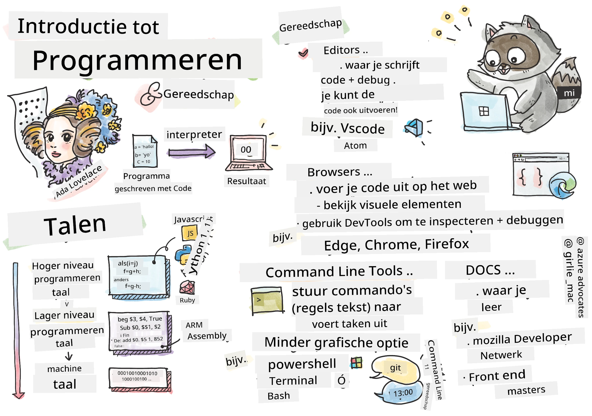
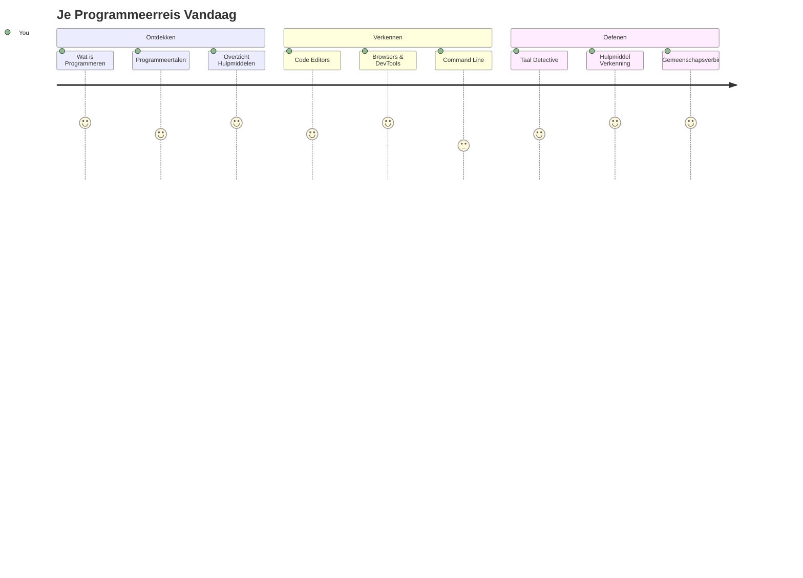
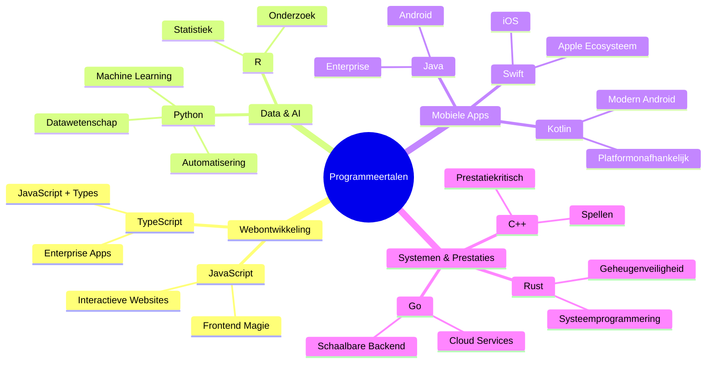
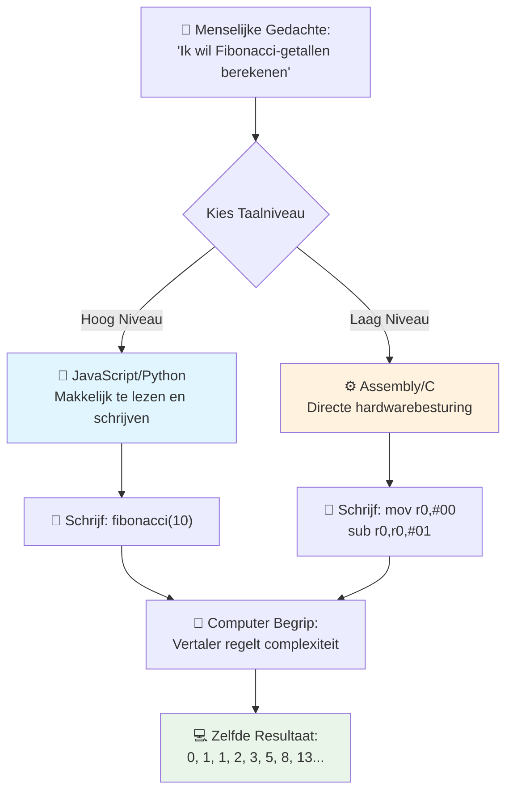
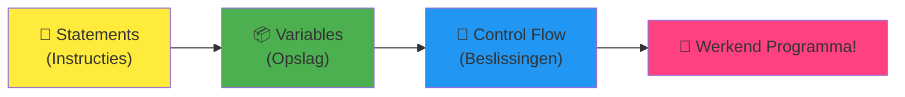
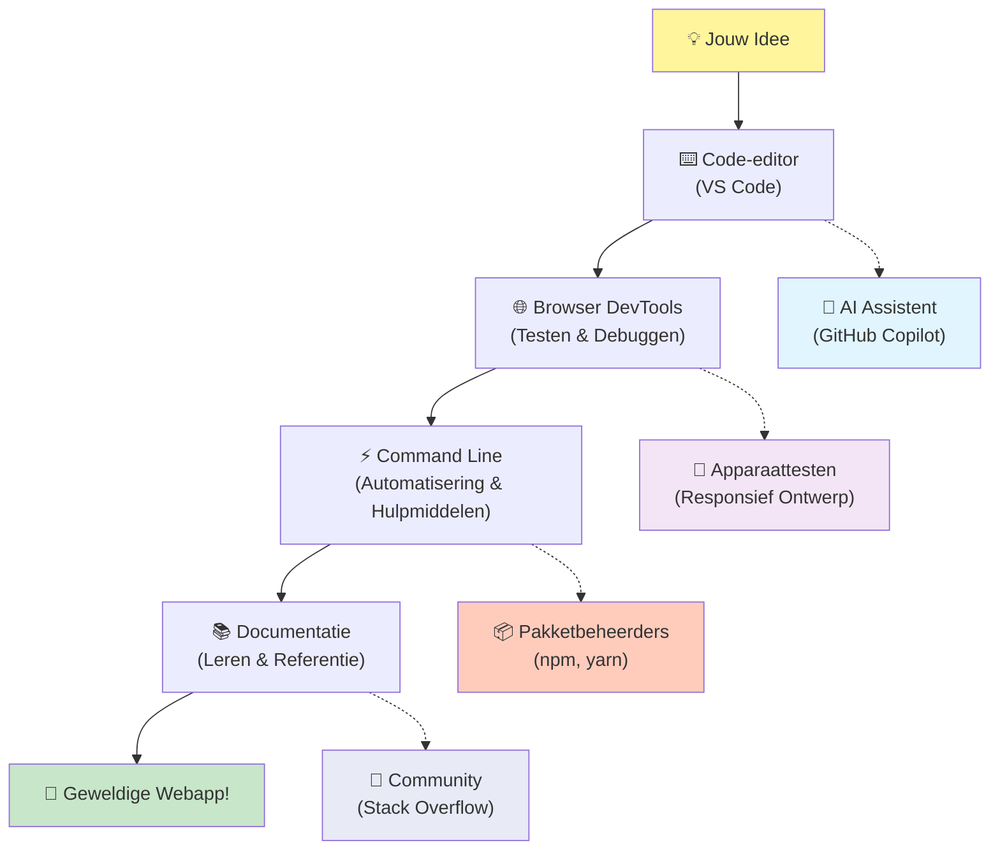
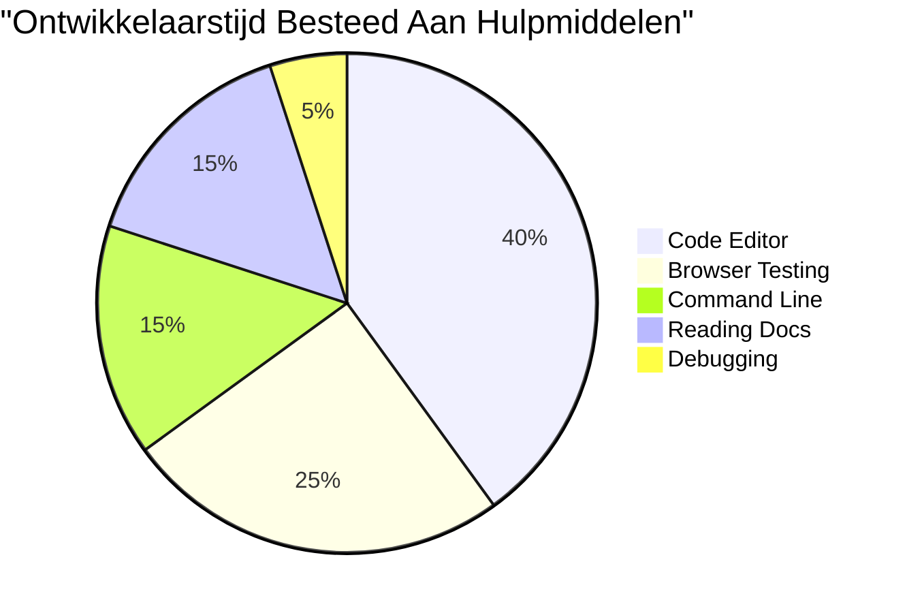
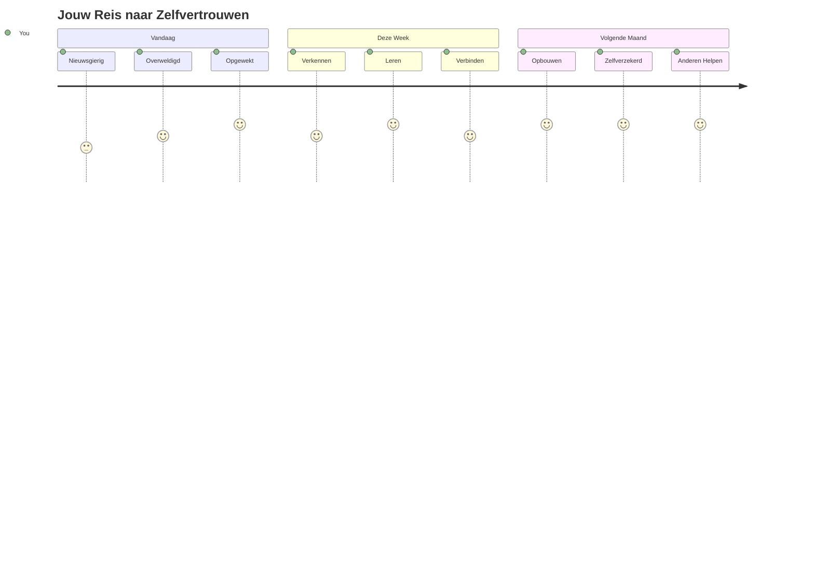

# Introductie tot Programmeertalen en Moderne Ontwikkelaarstools
 
Hallo daar, toekomstige ontwikkelaar! 👋 Mag ik je iets vertellen dat mij elke dag weer kippenvel bezorgt? Je staat op het punt te ontdekken dat programmeren niet alleen om computers gaat – het gaat om het hebben van echte superkrachten om je wildste ideeën tot leven te brengen!

Je kent dat moment wel wanneer je je favoriete app gebruikt en alles gewoon perfect samenkomt? Wanneer je op een knop drukt en er iets absoluut magisch gebeurt waardoor je denkt "wow, hoe hebben ze DAT gedaan?" Nou, iemand net zoals jij – waarschijnlijk zittend in hun favoriete koffietentje om 2 uur ’s nachts met hun derde espresso – schreef de code die die magie creëerde. En hier komt iets dat je versteld zal doen staan: aan het eind van deze les snap je niet alleen hoe ze het deden, maar kun je niet wachten om het zelf te proberen!

Kijk, ik begrijp het helemaal als programmeren nu nog intimiderend voelt. Toen ik net begon, dacht ik eerlijk gezegd dat je een soort wiskundegenius moest zijn of sinds je vijfde aan het coderen moest zijn. Maar hier is wat mijn kijk compleet veranderde: programmeren is precies zoals leren om gesprekken te voeren in een nieuwe taal. Je begint met “hallo” en “dank je”, gaat dan over op koffie bestellen, en voordat je het weet, voer je diepgaande filosofische discussies! Alleen in dit geval voer je gesprekken met computers, en eerlijk? Het zijn de meest geduldige gesprekspartners die je ooit zult hebben – ze oordelen nooit over je fouten en zijn altijd enthousiast om het opnieuw te proberen!

Vandaag gaan we de ongelooflijke tools verkennen die moderne webontwikkeling niet alleen mogelijk maken, maar ook serieus verslavend zijn. Ik heb het over precies dezelfde editors, browsers en workflows die ontwikkelaars bij Netflix, Spotify en je favoriete indie app-studio elke dag gebruiken. En hier komt het deel waar je een blije dans van gaat doen: de meeste van deze professionele, industrieel-standaard tools zijn helemaal gratis!


> Sketchnote door [Tomomi Imura](https://twitter.com/girlie_mac)


```mermaid
journey
    title Je Programmeerreis Vandaag
    section Ontdekken
      Wat is Programmeren: 5: You
      Programmeertalen: 4: You
      Overzicht Hulpmiddelen: 5: You
    section Verkennen
      Code Editors: 4: You
      Browsers & DevTools: 5: You
      Command Line: 3: You
    section Oefenen
      Taal Detective: 4: You
      Hulpmiddel Verkenning: 5: You
      Gemeenschapsverbinding: 5: You
```
## Laten We Zien Wat Je Al Weet!

Voordat we in het leuke gedeelte duiken, ben ik benieuwd – wat weet je al over deze programmeerwereld? En luister, als je naar deze vragen kijkt en denkt "Ik heb hier letterlijk geen flauw idee van," dan is dat niet alleen oké, het is perfect! Dat betekent dat je precies op de juiste plek bent. Zie deze quiz als een warming-up voor je brein voordat je gaat trainen.

[Neem de pre-lesson quiz](https://ff-quizzes.netlify.app/web/)


## Het Avontuur Waar We Samen Aan Gaan Beginnen

Oké, ik ben echt super enthousiast over wat we vandaag gaan ontdekken! Serieus, ik wou dat ik jouw gezicht kon zien op het moment dat sommige van deze concepten gaan klikken. Dit is de ongelooflijke reis die we samen maken:

- **Wat programmeren eigenlijk is (en waarom het het coolste ooit is!)** – We gaan ontdekken hoe code letterlijk de onzichtbare magie is die alles om je heen aandrijft, van die wekker die op de een of andere manier weet dat het maandagmorgen is tot het algoritme dat je Netflix-aanbevelingen perfect samenstelt
- **Programmeertalen en hun geweldige persoonlijkheden** – Stel je voor dat je op een feest binnenloopt waar iedereen compleet verschillende superkrachten en manieren van problemen oplossen heeft. Zo is de wereld van programmeertalen, en je gaat ze fantastisch vinden!
- **De fundamentele bouwstenen die digitale magie mogelijk maken** – Zie deze als de ultieme creatieve LEGO-set. Zodra je begrijpt hoe deze stukken samenkomen, realiseer je je dat je letterlijk alles kunt bouwen wat je verbeelding kan dromen
- **Professionele tools die je het gevoel geven alsof je net een toverstaf hebt gekregen** – Ik overdrijf niet – deze tools laten je echt voelen alsof je superkrachten hebt, en het beste? Het zijn precies dezelfde tools die de professionals gebruiken!

> 💡 **Hier komt het op neer**: Probeer vandaag niet alles te onthouden! Voor nu wil ik alleen dat je die vonk van enthousiasme voelt over wat mogelijk is. De details blijven vanzelf hangen terwijl we samen oefenen – zo leer je echt!

> Je kunt deze les ook volgen op [Microsoft Learn](https://learn.microsoft.com/en-us/learn/modules/web-development-101/introduction-programming/?WT.mc_id=academic-77807-sagibbon)!

## Wat Is Programmeren Eigenlijk?

Goed, laten we de miljoen-dollar-vraag behandelen: wat is programmeren nu eigenlijk?

Ik geef je een verhaal dat mijn kijk hier compleet veranderde. Vorige week probeerde ik mijn moeder uit te leggen hoe je onze nieuwe smart TV-afstandsbediening gebruikt. Ik betrapte mezelf erop dat ik zoiets zei als "Druk op de rode knop, maar niet de grote rode knop, de kleine rode knop links... nee, jouw andere links... oké, houd hem nu twee seconden ingedrukt, niet één, niet drie..." Klinkt bekend? 😅

Dat is programmeren! Het is de kunst om ongelooflijk gedetailleerde, stapsgewijze instructies te geven aan iets dat heel krachtig is maar alles perfect uitgelegd moet krijgen. Alleen leg je het niet uit aan je moeder (die kan vragen “welke rode knop?!”), maar aan een computer (die precies doet wat je zegt, zelfs als het niet is wat je eigenlijk bedoelde).

Dit blies mijn geest weg toen ik dit leerde: computers zijn eigenlijk best simpel van binnen. Ze begrijpen letterlijk maar twee dingen – 1 en 0, wat eigenlijk gewoon “ja” en “nee” of “aan” en “uit” betekent. Dat is het! Maar hier wordt het magisch – we hoeven niet in enen en nullen te spreken alsof we in The Matrix zitten. Daar komen **programmeertalen** om de hoek kijken. Ze zijn alsof je de allerbeste vertaler hebt die je normale menselijke gedachten omzet in computertaal.

En hier krijg ik nog steeds elke ochtend kippenvel van als ik wakker word: letterlijk *alles* digitaal in je leven begon met iemand net zoals jij, waarschijnlijk zittend in pyjama met een kop koffie, code typend op hun laptop. Dat Instagram-filter dat je er vlekkeloos uit laat zien? Iemand heeft dat gecodeerd. De aanbeveling die je naar je nieuwe favoriete nummer bracht? Een ontwikkelaar heeft dat algoritme gebouwd. De app die je helpt om de rekening te splitsen met vrienden? Ja, iemand dacht “dit is irritant, dit kan ik fixen” en toen... deden ze dat!

Als je leert programmeren, leer je niet alleen een nieuwe vaardigheid – je wordt onderdeel van een geweldige gemeenschap van probleemoplossers die hun dagen doorbrengen met denken, “Wat als ik iets kon bouwen dat iemands dag net een beetje beter maakt?” Is er echt iets coolers dan dat?

✅ **Leuk weetje om op te zoeken**: Hier is iets supergaafs om te zoeken als je even tijd hebt – wie denk je dat ’s werelds eerste computerprogrammeur was? Ik geef je een hint: het is misschien niet wie je verwacht! Het verhaal achter deze persoon is absoluut fascinerend en toont dat programmeren altijd al ging over creatief problemen oplossen en buiten de gebaande paden denken.

### 🧠 **Time-out: Hoe Voel Je Je?**

**Neem even de tijd om na te denken:**
- Maakt het idee van “instructies geven aan computers” nu voor jou meer sense?
- Kun je een dagelijkse taak bedenken die je met programmeren zou willen automatiseren?
- Welke vragen spelen er in je hoofd over dit hele programmeergedoe?

> **Onthoud**: Het is helemaal normaal dat sommige concepten nu nog wazig zijn. Programmeren leren is net als een nieuwe taal leren – het kost tijd om die neurale paden in je brein aan te leggen. Je doet het supergoed!

## Programmeertalen Zijn Als Verschillende Smaken Magie

Oké, dit klinkt misschien gek, maar blijf bij me – programmeertalen zijn heel erg als verschillende muziekstijlen. Denk maar aan jazz, dat soepel en improviserend is, rock die krachtig en direct is, klassiek dat elegant en gestructureerd is, en hiphop die creatief en expressief is. Elke stijl heeft zijn eigen vibe, zijn eigen gemeenschap van gepassioneerde fans, en elke stijl past bij verschillende stemmingen en gelegenheden.

Programmeertalen werken precies zo! Je zou niet dezelfde taal gebruiken om een leuk mobiel spel te maken als om enorme hoeveelheden klimaatdata te verwerken, net zoals je niet death metal speelt tijdens een yogales (nou ja, de meeste yogalessen in ieder geval! 😄).

Maar hier word ik elke keer weer helemaal enthousiast van: deze talen zijn alsof je de meest geduldige, briljante tolk ter wereld naast je hebt zitten. Je kunt je ideeën uitdrukken op een manier die natuurlijk voelt voor jouw menselijke brein, en zij regelen al het ongelooflijk complexe werk om dat te vertalen naar de enen en nullen waar computers echt in spreken. Het is alsof je een vriend hebt die perfect vloeiend is in zowel “menselijke creativiteit” als “computerlogica” – en ze worden nooit moe, hebben nooit koffiepauzes nodig en vinden het niet erg als je dezelfde vraag twee keer stelt!

### Populaire Programmeertalen en Hun Gebruik


```mermaid
mindmap
  root((Programmeertalen))
    Webontwikkeling
      JavaScript
        Frontend Magie
        Interactieve Websites
      TypeScript
        JavaScript + Types
        Enterprise Apps
    Data & AI
      Python
        Datawetenschap
        Machine Learning
        Automatisering
      R
        Statistiek
        Onderzoek
    Mobiele Apps
      Java
        Android
        Enterprise
      Swift
        iOS
        Apple Ecosysteem
      Kotlin
        Modern Android
        Platformonafhankelijk
    Systemen & Prestaties
      C++
        Spellen
        Prestatiekritisch
      Rust
        Geheugenveiligheid
        Systeemprogrammering
      Go
        Cloud Services
        Schaalbare Backend
```
| Language | Best For | Why It's Popular |
|----------|----------|------------------|
| **JavaScript** | Webontwikkeling, gebruikersinterfaces | Draait in browsers en maakt interactieve websites mogelijk |
| **Python** | Datawetenschap, automatisering, AI | Gemakkelijk leesbaar en leerbaar, krachtige bibliotheken |
| **Java** | Enterprise-applicaties, Android apps | Platformonafhankelijk, robuust voor grote systemen |
| **C#** | Windows-applicaties, game-ontwikkeling | Sterke ondersteuning binnen het Microsoft-ecosysteem |
| **Go** | Cloudservices, backend systemen | Snel, eenvoudig, ontworpen voor moderne computing |

### High-Level versus Low-Level Talen

Oké, dit was eerlijk gezegd het concept dat mijn brein brak toen ik voor het eerst begon, dus ik ga de metafoor delen die het eindelijk voor mij duidelijk maakte – en ik hoop echt dat het jou ook helpt!

Stel je voor dat je in een land bent waar je de taal niet spreekt en je echt dringend het dichtstbijzijnde toilet moet vinden (we zijn er allemaal wel geweest, toch? 😅):

- **Low-level programmeren** is alsof je de lokale dialect zo goed leert dat je kunt praten met de grootmoeder die fruit verkoopt op de hoek met culturele verwijzingen, lokale slang en inside jokes die alleen iemand die daar is opgegroeid zou begrijpen. Super indrukwekkend en ongelooflijk efficiënt... als je toevallig vloeiend bent! Maar best overweldigend als je alleen een toilet zoekt.

- **High-level programmeren** is alsof je die geweldige lokale vriend hebt die je helemaal begrijpt. Je zegt “Ik moet echt een wc vinden” gewoon in begrijpelijk Engels, en zij regelen alle culturele vertalingen en geven je aanwijzingen op een manier die perfect begrijpelijk is voor je niet-lokale brein.

In programmeertermen:
- **Low-level talen** (zoals Assembly of C) laten je extreem gedetailleerde gesprekken voeren met de hardware van de computer, maar je moet denken als een machine, wat... nou ja, een grote mentale omschakeling is!
- **High-level talen** (zoals JavaScript, Python of C#) laten je denken als een mens terwijl zij al het machinatale achter de schermen regelen. Bovendien hebben die talen zulke ongelooflijk vriendelijke communities vol mensen die zich herinneren hoe het was om nieuw te zijn en echt willen helpen!

Raad eens welke ik je aanraad om mee te beginnen? 😉 High-level talen zijn als zijwieltjes die je nooit echt wilt afdoen omdat ze het hele proces zoveel leuker maken!


```mermaid
flowchart TB
    A["👤 Menselijke Gedachte:<br/>'Ik wil Fibonacci-getallen berekenen'"] --> B{Kies Taalniveau}
    
    B -->|Hoog Niveau| C["🌟 JavaScript/Python<br/>Makkelijk te lezen en schrijven"]
    B -->|Laag Niveau| D["⚙️ Assembly/C<br/>Directe hardwarebesturing"]
    
    C --> E["📝 Schrijf: fibonacci(10)"]
    D --> F["📝 Schrijf: mov r0,#00<br/>sub r0,r0,#01"]
    
    E --> G["🤖 Computer Begrip:<br/>Vertaler regelt complexiteit"]
    F --> G
    
    G --> H["💻 Zelfde Resultaat:<br/>0, 1, 1, 2, 3, 5, 8, 13..."]
    
    style C fill:#e1f5fe
    style D fill:#fff3e0
    style H fill:#e8f5e8
```
### Laat Me Je Tonen Waarom High-Level Talen Veel Vriendelijker Zijn

Oké, ik ga je iets laten zien dat perfect demonstreert waarom ik verliefd werd op high-level talen, maar eerst – moet je me iets beloven. Als je die eerste code ziet, raak niet in paniek! Het is de bedoeling dat het een beetje intimiderend lijkt. Dat is precies mijn punt!

We gaan naar exact dezelfde taak kijken, geschreven in twee totaal verschillende stijlen. Beide creëren wat de Fibonacci-reeks heet – het is een prachtig wiskundig patroon waarbij elk getal de som is van de twee ervoor: 0, 1, 1, 2, 3, 5, 8, 13... (Leuk weetje: je vindt dit patroon letterlijk overal in de natuur – zonnebloempit spiralen, dennenappelpatronen, zelfs de manier waarop sterrenstelsels zich vormen!)

Klaar om het verschil te zien? Laten we gaan!

**High-level taal (JavaScript) – Mensvriendelijk:**

```javascript
// Stap 1: Basis Fibonacci opzet
const fibonacciCount = 10;
let current = 0;
let next = 1;

console.log('Fibonacci sequence:');
```

**Dit is wat deze code doet:**
- **Declareert** een constante om aan te geven hoeveel Fibonacci-getallen we willen genereren
- **Initialiseert** twee variabelen om het huidige en volgende nummer in de reeks bij te houden
- **Stelt in** de beginwaarden (0 en 1) die het Fibonacci-patroon bepalen
- **Toont** een koptekstbericht om onze output te identificeren

```javascript
// Stap 2: Genereer de reeks met een lus
for (let i = 0; i < fibonacciCount; i++) {
  console.log(`Position ${i + 1}: ${current}`);
  
  // Bereken het volgende getal in de reeks
  const sum = current + next;
  current = next;
  next = sum;
}
```

**Stap voor stap wat hier gebeurt:**
- **Doorloopt** elke positie in onze reeks met een `for`-lus
- **Toont** elk getal met zijn positie met behulp van template literal formatting
- **Bereken** het volgende Fibonacci-getal door de huidige en volgende waarden op te tellen
- **Werk** onze trackingvariabelen bij om naar de volgende iteratie te gaan

```javascript
// Stap 3: Moderne functionele benadering
const generateFibonacci = (count) => {
  const sequence = [0, 1];
  
  for (let i = 2; i < count; i++) {
    sequence[i] = sequence[i - 1] + sequence[i - 2];
  }
  
  return sequence;
};

// Voorbeeld van gebruik
const fibSequence = generateFibonacci(10);
console.log(fibSequence);
```

**Hierboven hebben we:**
- **Gemaakt** een herbruikbare functie met moderne pijl-functie syntax
- **Gebouwd** een array om de hele reeks op te slaan in plaats van er één per één te tonen
- **Gebruikt** array-indexering om elk nieuw getal te berekenen op basis van voorgaande waarden
- **Geretourneerd** de volledige reeks voor flexibele gebruik in andere delen van ons programma

**Low-level taal (ARM Assembly) – Computer-vriendelijk:**

```assembly
 area ascen,code,readonly
 entry
 code32
 adr r0,thumb+1
 bx r0
 code16
thumb
 mov r0,#00
 sub r0,r0,#01
 mov r1,#01
 mov r4,#10
 ldr r2,=0x40000000
back add r0,r1
 str r0,[r2]
 add r2,#04
 mov r3,r0
 mov r0,r1
 mov r1,r3
 sub r4,#01
 cmp r4,#00
 bne back
 end
```

Merk op hoe de JavaScript-versie bijna leest als Engelse instructies, terwijl de Assembly-versie cryptische commando’s gebruikt die direct de processor van de computer aansturen. Beide bereiken exact dezelfde taak, maar de high-level taal is veel gemakkelijker voor mensen om te begrijpen, te schrijven en te onderhouden.

**Belangrijke verschillen die je zult opmerken:**
- **Leesbaarheid**: JavaScript gebruikt beschrijvende namen zoals `fibonacciCount` terwijl Assembly cryptische labels gebruikt zoals `r0`, `r1`
- **Commentaar**: Hoog-niveau talen moedigen verklarende commentaar aan die de code zelfdocumenterend maken
- **Structuur**: De logische stroom van JavaScript komt overeen met hoe mensen probleems stap-voor-stap aanpakken
- **Onderhoud**: Het bijwerken van de JavaScript-versie voor verschillende eisen is eenvoudig en duidelijk

✅ **Over de Fibonacci-reeks**: Dit absoluut prachtige getallenpatroon (waar elk getal gelijk is aan de som van de twee ervoor: 0, 1, 1, 2, 3, 5, 8...) verschijnt letterlijk *overal* in de natuur! Je vindt het in zonnebloemspiralen, dennenappelpatronen, de manier waarop nautilusschelpen krullen, en zelfs in de manier waarop boomtakken groeien. Het is behoorlijk verbluffend hoe wiskunde en code ons kunnen helpen de patronen te begrijpen en na te bootsen die de natuur gebruikt om schoonheid te creëren!


## De Bouwstenen Die De Magie Maken Gebeuren

Oké, nu je hebt gezien hoe programmeertalen eruitzien in actie, laten we de fundamentele stukjes ontleden die letterlijk elk programma ooit geschreven vormen. Zie deze als de essentiële ingrediënten in je favoriete recept – zodra je begrijpt wat elk ingrediënt doet, kun je code lezen en schrijven in vrijwel elke taal!

Dit is een beetje alsof je de grammatica van programmeren leert. Weet je nog van vroeger op school toen je leerde over zelfstandige naamwoorden, werkwoorden en hoe je zinnen opbouwt? Programmeren heeft zijn eigen versie van grammatica, en eerlijk gezegd is die veel logischer en vergevingsgezinder dan Engelse grammatica ooit was! 😄

### Statements: De Stapsgewijze Instructies

Laten we beginnen met **statements** – dit zijn als individuele zinnen in een gesprek met je computer. Elke statement vertelt de computer om een specifieke taak uit te voeren, net alsof je instructies geeft: "Sla hier linksaf," "Stop bij het rode licht," "Parkeer op die plek."

Wat ik geweldig vind aan statements is hoe leesbaar ze meestal zijn. Kijk hier:

```javascript
// Basisverklaringen die enkele acties uitvoeren
const userName = "Alex";                    
console.log("Hello, world!");              
const sum = 5 + 3;                         
```

**Dit is wat deze code doet:**
- **Declareer** een constante variabele om de naam van een gebruiker op te slaan
- **Toon** een begroetingsbericht op de console-uitvoer
- **Bereken** en sla het resultaat van een wiskundige operatie op

```javascript
// Instructies die interactie hebben met webpagina's
document.title = "My Awesome Website";      
document.body.style.backgroundColor = "lightblue";
```

**Stap voor stap, dit gebeurt er:**
- **Wijzig** de titel van de webpagina die in het browsertabblad verschijnt
- **Verander** de achtergrondkleur van de hele pagina

### Variabelen: Het Geheugensysteem van Je Programma

Oké, **variabelen** zijn eerlijk gezegd een van mijn absolute favoriete concepten om te onderwijzen omdat ze zo lijken op dingen die je elke dag al gebruikt!

Denk even aan de contactenlijst op je telefoon. Je onthoudt niet van iedereen het telefoonnummer – in plaats daarvan sla je "Mama", "Beste Vriend" of "Pizzabezorging Tot 2 Uur 's Nachts" op en laat je telefoon de echt nummers onthouden. Variabelen werken precies zo! Ze zijn als gelabelde containers waar je programma informatie kan opslaan en later terug kan halen met een naam die echt logisch is.

Hier komt het coole: variabelen kunnen veranderen terwijl je programma draait (vandaar de naam "variabele" – snap je 'm?). Net zoals je dat pizzagegevens kunt bijwerken wanneer je ergens beter ontdekt, kunnen variabelen worden aangepast naarmate je programma nieuwe informatie leert of situaties veranderen!

Laat me je laten zien hoe prachtig simpel dit kan zijn:

```javascript
// Stap 1: Basisvariabelen aanmaken
const siteName = "Weather Dashboard";        
let currentWeather = "sunny";               
let temperature = 75;                       
let isRaining = false;                      
```

**Begrijpen van deze concepten:**
- **Sla** onveranderlijke waarden op in `const` variabelen (zoals sitenaam)
- **Gebruik** `let` voor waarden die kunnen veranderen tijdens je programma
- **Ken** verschillende datatypes toe: strings (tekst), getallen, en booleans (waar/onwaar)
- **Kies** beschrijvende namen die uitleggen wat elke variabele bevat

```javascript
// Stap 2: Werken met objecten om gerelateerde gegevens te groeperen
const weatherData = {                       
  location: "San Francisco",
  humidity: 65,
  windSpeed: 12
};
```

**In het bovenstaande hebben we:**
- **Gemaakt** een object om gerelateerde weerinformatie te groeperen
- **Georganiseerd** meerdere gegevens onder één variabelenaam
- **Gebruikt** sleutel-waarde-paren om elke informatie duidelijk te labelen

```javascript
// Stap 3: Variabelen gebruiken en bijwerken
console.log(`${siteName}: Today is ${currentWeather} and ${temperature}°F`);
console.log(`Wind speed: ${weatherData.windSpeed} mph`);

// Veranderlijke variabelen bijwerken
currentWeather = "cloudy";                  
temperature = 68;                          
```

**Laten we elk onderdeel begrijpen:**
- **Toon** informatie met template literals met `${}` syntax
- **Toegang** tot objecteigenschappen via puntnotatie (`weatherData.windSpeed`)
- **Werk** variabelen bij die met `let` zijn gedeclareerd om veranderende condities weer te geven
- **Combineer** meerdere variabelen om betekenisvolle berichten te maken

```javascript
// Stap 4: Moderne destructurering voor schonere code
const { location, humidity } = weatherData; 
console.log(`${location} humidity: ${humidity}%`);
```

**Wat je moet weten:**
- **Haal** specifieke eigenschappen uit objecten met destructureringsopdracht
- **Maak** automatisch nieuwe variabelen met dezelfde namen als object-sleutels
- **Vereenvoudig** code door repetitieve puntnotatie te vermijden

### Control Flow: Je Programma Leren Denken

Oké, hier wordt programmeren echt verbluffend! **Control flow** is eigenlijk je programma leren hoe het slimme beslissingen kan nemen, precies zoals jij elke dag doet zonder er zelfs maar over na te denken.

Stel je voor: vanochtend ging je waarschijnlijk door iets als "Als het regent, neem ik een paraplu. Als het koud is, trek ik een jas aan. Als ik te laat ben, sla ik het ontbijt over en haal koffie onderweg." Je brein volgt vanzelf deze als-dan logica tientallen keren per dag!

Dit is wat programma's intelligent en levendig laat aanvoelen in plaats van een saaie, voorspelbare script te volgen. Ze kunnen echt naar een situatie kijken, evalueren wat er gebeurt, en passend reageren. Het is alsof je je programma een brein geeft dat zich aanpast en keuzes maakt!

Wil je zien hoe prachtig dit werkt? Laat me het je laten zien:

```javascript
// Stap 1: Basis voorwaardelijke logica
const userAge = 17;

if (userAge >= 18) {
  console.log("You can vote!");
} else {
  const yearsToWait = 18 - userAge;
  console.log(`You'll be able to vote in ${yearsToWait} year(s).`);
}
```

**Dit is wat deze code doet:**
- **Controleer** of de leeftijd van de gebruiker voldoet aan de stemvereiste
- **Voer** verschillende codeblokken uit op basis van de uitkomst van de voorwaarde
- **Bereken** en toon hoe lang het nog duurt voordat stemmen is toegestaan indien onder 18
- **Geef** specifieke, bruikbare feedback voor elke situatie

```javascript
// Stap 2: Meerdere voorwaarden met logische operatoren
const userAge = 17;
const hasPermission = true;

if (userAge >= 18 && hasPermission) {
  console.log("Access granted: You can enter the venue.");
} else if (userAge >= 16) {
  console.log("You need parent permission to enter.");
} else {
  console.log("Sorry, you must be at least 16 years old.");
}
```

**Uitleg wat er hier gebeurt:**
- **Combineer** meerdere voorwaarden met de `&&` (en) operator
- **Maak** een hiërarchie van voorwaarden met `else if` voor meerdere scenario's
- **Behandel** alle mogelijke gevallen met een laatste `else` statement
- **Bied** duidelijke, bruikbare feedback voor elke verschillende situatie

```javascript
// Stap 3: Bondige voorwaarde met de terno-operator
const votingStatus = userAge >= 18 ? "Can vote" : "Cannot vote yet";
console.log(`Status: ${votingStatus}`);
```

**Wat je moet onthouden:**
- **Gebruik** de ternary operator (`? :`) voor eenvoudige tweedelige voorwaarden
- **Schrijf** eerst de voorwaarde, gevolgd door `?`, dan het resultaat als waar, dan `:`, dan het resultaat als onwaar
- **Pas** dit patroon toe wanneer je waarden op basis van voorwaarden moet toewijzen

```javascript
// Stap 4: Omgaan met meerdere specifieke gevallen
const dayOfWeek = "Tuesday";

switch (dayOfWeek) {
  case "Monday":
  case "Tuesday":
  case "Wednesday":
  case "Thursday":
  case "Friday":
    console.log("It's a weekday - time to work!");
    break;
  case "Saturday":
  case "Sunday":
    console.log("It's the weekend - time to relax!");
    break;
  default:
    console.log("Invalid day of the week");
}
```

**Deze code bereikt het volgende:**
- **Vergelijk** de variabele waarde met meerdere specifieke gevallen
- **Groeperen** vergelijkbare gevallen samen (weekdagen versus weekend)
- **Voer** het juiste codeblok uit wanneer er een overeenkomst is
- **Inclusief** een `default` geval om onverwachte waarden af te handelen
- **Gebruik** `break` statements om te voorkomen dat code doorgaat naar het volgende geval

> 💡 **Analogie uit de praktijk**: Zie control flow als de meest geduldige GPS ter wereld die je aanwijzingen geeft. Het zou kunnen zeggen: "Als er file is op Main Street, neem dan de snelweg. Als er wegwerkzaamheden zijn op de snelweg, probeer dan de schilderachtige route." Programma’s gebruiken precies hetzelfde soort voorwaardelijke logica om op verschillende situaties intelligent te reageren en gebruikers altijd de best mogelijke ervaring te bieden.

### 🎯 **Begripscontrole: Meesterschap Bouwstenen**

**Laten we eens kijken hoe je het doet met de basisprincipes:**
- Kun je in je eigen woorden het verschil uitleggen tussen een variabele en een statement?
- Denk aan een echte situatie waarin je een als-dan beslissing zou gebruiken (zoals in ons voorbeeld over stemmen)
- Wat is één ding over programmeerlogica dat je verbaasde?

**Snelle zelfvertrouwenboost:**

```mermaid
flowchart LR
    A["📝 Statements<br/>(Instructies)"] --> B["📦 Variables<br/>(Opslag)"] --> C["🔀 Control Flow<br/>(Beslissingen)"] --> D["🎉 Werkend Programma!"]
    
    style A fill:#ffeb3b
    style B fill:#4caf50
    style C fill:#2196f3
    style D fill:#ff4081
```
✅ **Wat komt hierna**: We gaan enorm veel plezier beleven terwijl we dieper ingaan op deze concepten terwijl we deze ongelooflijke reis samen voortzetten! Focus nu gewoon op het voelen van die opwinding over alle geweldige mogelijkheden die voor je liggen. De specifieke vaardigheden en technieken verdwalen vanzelf terwijl we samen oefenen – ik beloof je dat dit veel leuker wordt dan je zou verwachten!

## Gereedschappen van het Vak

Oké, hier word ik serieus zo enthousiast dat ik mezelf bijna niet kan inhouden! 🚀 We gaan het hebben over de ongelooflijke tools die je het gevoel geven alsof je net de sleutels van een digitale ruimteschip hebt gekregen.

Je weet toch hoe een chef die perfect uitgebalanceerde messen heeft die voelen als een verlengstuk van hun handen? Of hoe een muzikant die ene gitaar heeft die lijkt te zingen op het moment dat ze hem aanraken? Nou, ontwikkelaars hebben onze eigen versie van deze magische tools, en hier komt het deel dat je echt versteld zal doen staan – de meeste zijn volledig gratis!

Ik kan bijna niet stilzitten in mijn stoel als ik eraan denk om deze met jou te delen, want ze hebben de manier waarop we software bouwen compleet gerevolutioneerd. We hebben het over AI-gestuurde code-assistenten die je kunnen helpen je code te schrijven (ik maak geen grapje!), cloud-omgevingen waarin je volledige applicaties kunt bouwen vanaf letterlijk overal met Wi-Fi, en debugtools zo geavanceerd dat ze zijn als röntgenvisie voor je programma’s.

En hier komt het deel dat me nog steeds kippenvel bezorgt: dit zijn geen "beginnersgereedschappen" die je snel ontgroeit. Dit zijn exact dezelfde professionele tools die ontwikkelaars bij Google, Netflix, en die indie appstudio die je zo leuk vindt, op dit moment gebruiken. Je gaat je echt een professional voelen als je ze gebruikt!


```mermaid
graph TD
    A["💡 Jouw Idee"] --> B["⌨️ Code-editor<br/>(VS Code)"] 
    B --> C["🌐 Browser DevTools<br/>(Testen & Debuggen)"]
    C --> D["⚡ Command Line<br/>(Automatisering & Hulpmiddelen)"]
    D --> E["📚 Documentatie<br/>(Leren & Referentie)"]
    E --> F["🚀 Geweldige Webapp!"]
    
    B -.-> G["🤖 AI Assistent<br/>(GitHub Copilot)"]
    C -.-> H["📱 Apparaattesten<br/>(Responsief Ontwerp)"]
    D -.-> I["📦 Pakketbeheerders<br/>(npm, yarn)"]
    E -.-> J["👥 Community<br/>(Stack Overflow)"]
    
    style A fill:#fff59d
    style F fill:#c8e6c9
    style G fill:#e1f5fe
    style H fill:#f3e5f5
    style I fill:#ffccbc
    style J fill:#e8eaf6
```
### Code Editors en IDE’s: Je Nieuwe Digitale Beste Vrienden

Laten we het hebben over code editors – dit worden serieus je nieuwe favoriete plekken om te hangen! Zie ze als je persoonlijke codeerheiligdom waar je het grootste deel van je tijd zult doorbrengen met het maken en perfectioneren van je digitale creaties.

Maar hier is wat echt magisch is aan moderne editors: het zijn niet zomaar chique teksteditors. Het is alsof je de meest briljante, ondersteunende codeermentor naast je hebt zitten, 24/7. Ze vangen je typefouten nog voordat je ze opmerkt, suggereren verbeteringen waardoor je eruitziet als een genie, helpen je te begrijpen wat elk stukje code doet, en sommigen kunnen zelfs raden wat je gaat typen en bieden aan om je gedachte af te maken!

Ik herinner me nog toen ik voor het eerst auto-completion ontdekte – ik voelde me werkelijk alsof ik in de toekomst leefde. Je begint iets te typen, en je editor zegt: "Hé, dacht je aan deze functie die precies doet wat je nodig hebt?" Het is alsof je een gedachtelezer hebt als codeermaatje!

**Wat maakt deze editors zo ongelooflijk?**

Moderne code editors bieden een indrukwekkend scala aan functies die zijn ontworpen om je productiviteit te verhogen:

| Functie | Wat het Doet | Waarom het Helpt |
|---------|--------------|------------------|
| **Syntax Highlighting** | Kleurt verschillende delen van je code | Maakt code makkelijker leesbaar en helpt fouten op te sporen |
| **Auto-completion** | Suggereren van code terwijl je typt | Versnelt het coderen en vermindert tikfouten |
| **Debugging Tools** | Helpt je fouten te vinden en op te lossen | Bespaart uren aan probleemoplossing |
| **Extensions** | Voegt gespecialiseerde functies toe | Maak je editor aanpasbaar voor elke technologie |
| **AI Assistants** | Suggereren van code en uitleggen | Versnelt leren en productiviteit |

> 🎥 **Video Bron**: Wil je deze tools in actie zien? Bekijk dan deze [Tools of the Trade video](https://youtube.com/watch?v=69WJeXGBdxg) voor een uitgebreid overzicht.

#### Aanbevolen Editors voor Webontwikkeling

**[Visual Studio Code](https://code.visualstudio.com/?WT.mc_id=academic-77807-sagibbon)** (Gratis)
- Meest populair onder webontwikkelaars
- Uitstekend extensie-ecosysteem
- Ingebouwde terminal en Git-integratie
- **Onmisbare extensies**:
  - [GitHub Copilot](https://marketplace.visualstudio.com/items?itemName=GitHub.copilot) - AI-gestuurde codevoorstellen
  - [Live Share](https://marketplace.visualstudio.com/items?itemName=MS-vsliveshare.vsliveshare) - Real-time samenwerking
  - [Prettier](https://marketplace.visualstudio.com/items?itemName=esbenp.prettier-vscode) - Automatische code-opmaak
  - [Code Spell Checker](https://marketplace.visualstudio.com/items?itemName=streetsidesoftware.code-spell-checker) - Foutjes in je code opsporen

**[JetBrains WebStorm](https://www.jetbrains.com/webstorm/)** (Betaald, gratis voor studenten)
- Geavanceerde debug- en testtools
- Intelligente code-completion
- Ingebouwde versiecontrole

**Cloud-Based IDEs** (Diverse prijzen)
- [GitHub Codespaces](https://github.com/features/codespaces) - Volledige VS Code in je browser
- [Replit](https://replit.com/) - Geweldig voor leren en delen van code
- [StackBlitz](https://stackblitz.com/) - Directe, full-stack webontwikkeling

> 💡 **Begin Tip**: Begin met Visual Studio Code – het is gratis, veelgebruikt in de industrie, en heeft een enorme community die nuttige tutorials en extensies maakt.


### Webbrowsers: Je Geheime Ontwikkellaboratorium

Oké, maak je klaar om versteld te staan! Je weet toch hoe je browsers gebruikt om door sociale media te scrollen en video’s te kijken? Nou, het blijkt dat ze al die tijd een ongelooflijk geheim ontwikkellaboratorium hebben verstopt, gewoon wachtend tot jij het ontdekt!

Elke keer als je met de rechtermuisknop op een webpagina klikt en "Element inspecteren" kiest, open je een verborgen wereld van ontwikkeltools die eerlijk gezegd krachtiger zijn dan sommige dure software waar ik vroeger honderden euro’s voor betaalde. Het is alsof je ontdekt dat je gewone keuken al die tijd een professioneel koks-laboratorium achter een geheime wand verstopte!
De eerste keer dat iemand me de browser DevTools liet zien, heb ik ongeveer drie uur rondgeklikt en gezegd: "WACHT, DAT KAN OOK?!" Je kunt letterlijk elke website in realtime bewerken, precies zien hoe snel alles laadt, testen hoe je site eruitziet op verschillende apparaten, en zelfs JavaScript debuggen als een echte professional. Het is echt verbluffend!

**Dit is waarom browsers jouw geheime wapen zijn:**

Wanneer je een website of webapplicatie maakt, moet je zien hoe deze eruitziet en zich gedraagt in de echte wereld. Browsers tonen niet alleen je werk, ze geven ook gedetailleerde feedback over prestaties, toegankelijkheid en mogelijke problemen.

#### Browser Developer Tools (DevTools)

Moderne browsers bevatten uitgebreide ontwikkelingssuites:

| Toolcategorie | Wat het doet | Voorbeeld gebruik |
|---------------|--------------|------------------|
| **Element Inspector** | Bekijk en bewerk HTML/CSS in realtime | Styling aanpassen om directe resultaten te zien |
| **Console** | Bekijk foutmeldingen en test JavaScript | Problemen debuggen en experimenteren met code |
| **Network Monitor** | Volg hoe resources laden | Prestatie en laadtijden optimaliseren |
| **Accessibility Checker** | Testen op inclusief ontwerp | Zekerstellen dat je site werkt voor alle gebruikers |
| **Device Simulator** | Voorvertoning op verschillende schermgroottes | Responsief ontwerp testen zonder meerdere apparaten |

#### Aanbevolen browsers voor ontwikkeling

- **[Chrome](https://developers.google.com/web/tools/chrome-devtools/)** - Industriestandaard DevTools met uitgebreide documentatie
- **[Firefox](https://developer.mozilla.org/docs/Tools)** - Uitstekende CSS Grid- en toegankelijkheidstools
- **[Edge](https://docs.microsoft.com/microsoft-edge/devtools-guide-chromium/?WT.mc_id=academic-77807-sagibbon)** - Gebouwd op Chromium met Microsofts ontwikkelaarsbronnen

> ⚠️ **Belangrijke testtip**: Test je websites altijd in meerdere browsers! Wat perfect werkt in Chrome kan er anders uitzien in Safari of Firefox. Professionele ontwikkelaars testen in alle grote browsers voor consistente gebruikerservaringen.


### Command Line Tools: Jouw toegangspoort tot ontwikkelaar superkrachten

Oké, laten we eerlijk zijn over de command line, want ik wil dat je dit hoort van iemand die het echt snapt. Toen ik het voor het eerst zag – gewoon dat enge zwarte scherm met knipperende tekst – dacht ik letterlijk: "Nee, absoluut niet! Dit lijkt uit een hackerfilm uit de jaren 80 te komen, en ik ben hier echt niet slim genoeg voor!" 😅

Maar hier is wat ik wou dat iemand me toen had verteld, en wat ik jou nu vertel: de command line is niet eng – het is eigenlijk alsof je een direct gesprek hebt met je computer. Zie het als het verschil tussen eten bestellen via een luxe app met plaatjes en menu's (wat makkelijk en fijn is) versus binnenlopen bij je favoriete lokale restaurant waar de chef precies weet wat je lekker vindt en iets perfects maakt alleen al door jouw "verras me met iets geweldigs" te zeggen.

De command line is waar ontwikkelaars zich echte tovenaars voelen. Je typt een paar schijnbaar magische woorden (oké, het zijn gewoon commando’s, maar ze voelen magisch!), drukt op enter, en BOEM – je hebt hele projectstructuren gemaakt, krachtige tools geïnstalleerd uit de hele wereld, of je app op het internet gezet zodat miljoenen mensen het kunnen zien. Zodra je die kracht proeft, is het eerlijk gezegd verslavend!

**Waarom de command line jouw favoriete tool wordt:**

Hoewel grafische interfaces voor veel taken fijn zijn, blinkt de command line uit in automatisering, precisie en snelheid. Veel ontwikkeltools werken vooral via command line interfaces, en leren hoe je ze efficiënt gebruikt kan je productiviteit drastisch verbeteren.

```bash
# Stap 1: Maak de projectdirectory aan en navigeer ernaartoe
mkdir my-awesome-website
cd my-awesome-website
```
  
**Dit is wat deze code doet:**  
- **Maak** een nieuwe map genaamd "my-awesome-website" voor je project  
- **Ga naar** de nieuw aangemaakte map om te beginnen met werken  

```bash
# Stap 2: Initialiseer project met package.json
npm init -y

# Installeer moderne ontwikkeltools
npm install --save-dev vite prettier eslint
npm install --save-dev @eslint/js
```
  
**Stap voor stap, dit gebeurt er:**  
- **Initialiseer** een nieuw Node.js-project met standaard instellingen met `npm init -y`  
- **Installeer** Vite als moderne buildtool voor snelle ontwikkeling en productie builds  
- **Voeg toe** Prettier voor automatische code-opmaak en ESLint voor code kwaliteitscontroles  
- **Gebruik** de `--save-dev` vlag om deze alleen als ontwikkel-afhankelijkheden te markeren  

```bash
# Stap 3: Maak projectstructuur en bestanden aan
mkdir src assets
echo '<!DOCTYPE html><html><head><title>My Site</title></head><body><h1>Hello World</h1></body></html>' > index.html

# Start ontwikkelserver
npx vite
```
  
**In het bovenstaande hebben we:**  
- **Ons project georganiseerd** door aparte mappen te maken voor broncode en assets  
- **Een basis HTML-bestand gegenereerd** met de juiste documentstructuur  
- **De Vite development server gestart** voor live herladen en hot module replacement  

#### Essentiële command line tools voor webontwikkeling

| Tool | Doel | Waarom heb je het nodig |
|------|---------|-----------------|
| **[Git](https://git-scm.com/)** | Versiebeheer | Volg wijzigingen, werk samen met anderen, backup je werk |
| **[Node.js & npm](https://nodejs.org/)** | JavaScript runtime & pakketbeheer | Run JavaScript buiten browsers, installeer moderne ontwikkeltools |
| **[Vite](https://vitejs.dev/)** | Buildtool & dev server | Razendsnelle ontwikkeling met hot module replacement |
| **[ESLint](https://eslint.org/)** | Codekwaliteit | Vind en los automatisch problemen in je JavaScript op |
| **[Prettier](https://prettier.io/)** | Codeopmaak | Houd je code consistent opgemaakt en leesbaar |

#### Platform-specifieke opties

**Windows:**  
- **[Windows Terminal](https://docs.microsoft.com/windows/terminal/?WT.mc_id=academic-77807-sagibbon)** - Moderne, uitgebreide terminal  
- **[PowerShell](https://docs.microsoft.com/powershell/?WT.mc_id=academic-77807-sagibbon)** 💻 - Krachtige scripting omgeving  
- **[Command Prompt](https://learn.microsoft.com/windows-server/administration/windows-commands/windows-commands)** 💻 - Traditionele Windows command line  

**macOS:**  
- **[Terminal](https://support.apple.com/guide/terminal/)** 💻 - Ingebouwde terminal applicatie  
- **[iTerm2](https://iterm2.com/)** - Verbeterde terminal met geavanceerde functies  

**Linux:**  
- **[Bash](https://www.gnu.org/software/bash/)** 💻 - Standaard Linux shell  
- **[KDE Konsole](https://docs.kde.org/trunk5/en/konsole/konsole/index.html)** - Geavanceerde terminal-emulator  

> 💻 = Vooraf geïnstalleerd op het besturingssysteem

> 🎯 **Leerpad**: Begin met basiscommando’s zoals `cd` (verander map), `ls` of `dir` (lijst bestanden), en `mkdir` (maak map). Oefen met moderne workflow-commando’s als `npm install`, `git status` en `code .` (opent huidige map in VS Code). Naarmate je meer vertrouwd raakt, leer je vanzelf geavanceerdere commando’s en automatiseringstechnieken.


### Documentatie: jouw altijd beschikbare leermentor

Oké, ik deel een geheim dat je enorm zal helpen je beter te voelen als beginner: zelfs de meest ervaren ontwikkelaars besteden een groot deel van hun tijd aan documentatie lezen. En dat is niet omdat ze niet weten wat ze doen – het is juist een teken van wijsheid!

Zie documentatie als toegang tot de meest geduldige, deskundige leraren ter wereld die 24/7 beschikbaar zijn. Zit je vast aan een probleem om 2 uur ’s nachts? Documentatie geeft je een warme virtuele hug en precies het antwoord dat je nodig hebt. Wil je meer weten over een coole nieuwe feature waar iedereen het over heeft? Documentatie helpt je stap voor stap. Probeer je te begrijpen waarom iets werkt zoals het werkt? Documentatie legt het uit op een manier die het eindelijk laat klikken!

Iets wat mijn perspectief volledig veranderde: de wereld van webontwikkeling beweegt ontzettend snel en niemand (maar dan ook echt niemand!) heeft alles uit zijn hoofd geleerd. Ik heb senior developers met 15+ jaar ervaring gezien die nog steeds basis syntax opzoeken, en weet je wat? Dat is niet beschamend – dat is slim! Het gaat niet om een perfect geheugen; het gaat erom te weten waar je betrouwbare antwoorden snel kunt vinden en hoe je die moet toepassen.

**Hier gebeurt de echte magie:**

Professionele ontwikkelaars besteden een groot deel van hun tijd aan documentatie lezen – niet omdat ze niet weten wat ze doen, maar omdat webontwikkeling zo snel verandert dat bijblijven voortdurend leren vereist. Goede documentatie helpt je niet alleen *hoe* iets te gebruiken, maar ook *waarom* en *wanneer* je het zou moeten gebruiken.

#### Essentiële documentatiebronnen

**[Mozilla Developer Network (MDN)](https://developer.mozilla.org/docs/Web)**  
- De gouden standaard voor webtechnologie documentatie  
- Uitgebreide gidsen voor HTML, CSS en JavaScript  
- Inclusief browser compatibiliteitsinformatie  
- Praktische voorbeelden en interactieve demos  

**[Web.dev](https://web.dev)** (door Google)  
- Moderne webontwikkeling best practices  
- Gidsen voor prestatie-optimalisatie  
- Toegankelijkheid- en inclusief ontwerp principes  
- Casestudy’s van echte projecten  

**[Microsoft Developer Documentation](https://docs.microsoft.com/microsoft-edge/#microsoft-edge-for-developers)**  
- Ontwikkelaar bronnen voor de Edge-browser  
- Progressive Web App gidsen  
- Cross-platform ontwikkelingsinzichten  

**[Frontend Masters Learning Paths](https://frontendmasters.com/learn/)**  
- Gestructureerde leertrajecten  
- Videocursussen van experts uit de industrie  
- Hands-on programmeeroefeningen  

> 📚 **Studiestrategie**: Probeer documentatie niet uit je hoofd te leren – leer het efficiënt te navigeren. Zet veelgebruikte referenties in je favorieten en oefen met zoekfuncties om snel specifieke informatie te vinden.

### 🔧 **Tool Mastery Check: Wat spreekt jou het meest aan?**

**Neem even de tijd en denk na:**  
- Welke tool wil je als eerste uitproberen? (Er is geen fout antwoord!)  
- Voelt de command line nog steeds intimiderend, of ben je nieuwsgierig?  
- Kun je je voorstellen om browser DevTools te gebruiken om eens achter de schermen van je favoriete websites te kijken?


```mermaid
pie title "Ontwikkelaarstijd Besteed Aan Hulpmiddelen"
    "Code Editor" : 40
    "Browser Testing" : 25
    "Command Line" : 15
    "Reading Docs" : 15
    "Debugging" : 5
```  
> **Leuk weetje**: De meeste ontwikkelaars brengen zo’n 40% van hun tijd door in hun code-editor, maar kijk eens hoeveel tijd er gaat naar testen, leren, en problemen oplossen. Programmeren gaat niet alleen om code schrijven – het gaat om het creëren van ervaringen!

✅ **Denkstof**: Hier is iets interessants om over na te denken – hoe denk je dat de tools om websites te bouwen (ontwikkeling) verschillen van tools om te ontwerpen hoe ze eruitzien (design)? Het is net als het verschil tussen een architect die een prachtig huis ontwerpt en de aannemer die het daadwerkelijk bouwt. Beide zijn cruciaal, maar vereisen andere gereedschapskisten! Dit soort denken helpt je het grotere plaatje te zien van hoe websites tot leven komen.

## GitHub Copilot Agent Challenge 🚀

Gebruik de Agent modus om de volgende uitdaging te voltooien:

**Beschrijving:** Verken de functies van een moderne code-editor of IDE en toon aan hoe deze je workflow als webontwikkelaar kan verbeteren.

**Opdracht:** Kies een code-editor of IDE (zoals Visual Studio Code, WebStorm of een cloud-gebaseerde IDE). Noem drie functies of extensies die je helpen code efficiënter te schrijven, debuggen of onderhouden. Geef voor elk een korte uitleg over hoe het je workflow verbetert.

---

## 🚀 Uitdaging

**Oké, detective, klaar voor je eerste zaak?**

Nu je deze geweldige basis hebt, wacht er een avontuur op je dat je helpt zien hoe ongelooflijk divers en fascinerend de programmeerwereld echt is. En luister – dit gaat nog niet over code schrijven, dus geen druk! Zie jezelf als een programmeertaaldetective bij je allereerste spannende zaak!

**Jouw missie, als je die accepteert:**  
1. **Word een taalspeurder**: Kies drie programmeertalen uit totaal verschillende werelden – misschien één die websites bouwt, één voor mobiele apps, en één die data verwerkt voor wetenschappers. Zoek voorbeelden van dezelfde simpele taak in elke taal. Ik beloof je, je zult versteld staan hoe verschillend ze kunnen zijn terwijl ze exact hetzelfde doen!  

2. **Ontdek hun oorsprongsverhalen**: Wat maakt elke taal speciaal? Hier is een leuk feit – elke programmeertaal is gemaakt omdat iemand dacht: "Weet je wat? Er moet een betere manier zijn om dit specifieke probleem op te lossen." Kun jij erachter komen wat die problemen waren? Sommige van deze verhalen zijn echt fascinerend!  

3. **Ontmoet de communities**: Kijk hoe gastvrij en gepassioneerd elke taalcommunity is. Sommige hebben miljoenen ontwikkelaars die kennis delen en elkaar helpen, andere zijn kleiner maar ongelooflijk hecht en ondersteunend. Je gaat het leuk vinden om de verschillende persoonlijkheden van deze communities te ontdekken!  

4. **Volg je buikgevoel**: Welke taal voelt nu voor jou het meest toegankelijk? Maak je geen zorgen over de “perfecte” keuze – luister gewoon naar je gevoel! Er is echt geen fout antwoord, en je kunt later altijd andere talen ontdekken.  

**Bonus detectivewerk:** Kijk of je kunt ontdekken welke grote websites of apps met elke taal zijn gebouwd. Ik garandeer dat je zult schrikken als je ziet wat Instagram, Netflix, of dat mobiele spel waar je niet vanaf kunt blijven aandrijft!

> 💡 **Onthoud**: Je probeert vandaag nog geen expert te worden in deze talen. Je maakt alleen kennis met de buurt voordat je beslist waar je wilt neerstrijken. Neem je tijd, heb er plezier in, en laat je nieuwsgierigheid je leiden!

## Laten we vieren wat je ontdekt hebt!

Holy moly, je hebt vandaag zoveel ongelooflijke informatie opgenomen! Ik ben echt benieuwd hoeveel van deze geweldige reis bij je is blijven hangen. En onthoud – dit is geen test waar je alles perfect moet doen. Dit is meer een viering van al het coole dat je geleerd hebt over deze fascinerende wereld waar je zojuist in bent gedoken!

[Maak de quiz na de les](https://ff-quizzes.netlify.app/web/)

## Review & Zelfstudie

**Neem de tijd om te verkennen en er plezier mee te hebben!**
Je hebt vandaag een hoop geleerd, en dat is iets om trots op te zijn! Nu komt het leuke gedeelte – het verkennen van de onderwerpen die je nieuwsgierigheid hebben gewekt. Onthoud, dit is geen huiswerk – het is een avontuur!

**Duik dieper in wat jou enthousiasmeert:**

**Ga zelf aan de slag met programmeertalen:**
- Bezoek de officiële websites van 2-3 talen die je aandacht hebben getrokken. Elke taal heeft zijn eigen karakter en verhaal!
- Probeer wat online codeerpleinen zoals [CodePen](https://codepen.io/), [JSFiddle](https://jsfiddle.net/), of [Replit](https://replit.com/). Wees niet bang om te experimenteren – je kunt niets stukmaken!
- Lees over hoe je favoriete taal is ontstaan. Serieus, sommige van deze ontstaansverhalen zijn fascinerend en helpen je te begrijpen waarom talen werken zoals ze doen.

**Maak jezelf vertrouwd met je nieuwe tools:**
- Download Visual Studio Code als je dat nog niet hebt gedaan – het is gratis en je gaat er dol op zijn!
- Breng een paar minuten door in de Extensions-marktplaats. Het is net een appwinkel voor je code-editor!
- Open de Developer Tools van je browser en klik er wat rond. Maak je geen zorgen dat je niet alles begrijpt – gewoon vertrouwd raken met wat er is.

**Sluit je aan bij de community:**
- Volg wat ontwikkelaarscommunity’s op [Dev.to](https://dev.to/), [Stack Overflow](https://stackoverflow.com/), of [GitHub](https://github.com/). De programmeergemeenschap verwelkomt nieuwkomers ontzettend hartelijk!
- Kijk wat beginner-vriendelijke codeervideo’s op YouTube. Er zijn zoveel geweldige makers die zich nog goed herinneren hoe het is om te beginnen.
- Overweeg deel te nemen aan lokale meetups of online communities. Geloof me, ontwikkelaars helpen nieuwkomers graag!

> 🎯 **Luister, dit wil ik dat je onthoudt**: Er wordt niet van je verwacht dat je van de ene op de andere dag een codeerwizzard wordt! Op dit moment leer je deze geweldige nieuwe wereld gewoon kennen waar je deel van gaat uitmaken. Neem je tijd, geniet van de reis, en onthoud – elke ontwikkelaar die je bewondert zat ooit precies waar jij nu zit, voelde zich enthousiast en misschien een beetje overweldigd. Dat is helemaal normaal, en het betekent dat je het goed doet!


## Opdracht

[Reading the Docs](assignment.md)

> 💡 **Een kleine aanmoediging voor je opdracht**: Ik zou het geweldig vinden om te zien dat je wat tools onderzoekt die we nog niet behandeld hebben! Sla de editors, browsers en commandoregeltools die we al besproken hebben over – er is een hele ongelooflijke wereld aan geweldige ontwikkeltools die wachten om ontdekt te worden. Zoek naar tools die actief worden onderhouden en levendige, behulpzame gemeenschappen hebben (die hebben meestal de beste tutorials en de meest ondersteunende mensen als je vastloopt en een helpende hand nodig hebt).

---

## 🚀 Jouw programmeerreis-tijdlijn

### ⚡ **Wat je in de komende 5 minuten kunt doen**
- [ ] Blader naar 2-3 programmeertaalwebsites die je aandacht trokken en zet ze bij je favorieten
- [ ] Download Visual Studio Code als je dat nog niet hebt gedaan
- [ ] Open de DevTools van je browser (F12) en klik rond op een willekeurige website
- [ ] Sluit je aan bij één programmeercommunity (Dev.to, Reddit r/webdev, of Stack Overflow)

### ⏰ **Wat je dit uur kunt bereiken**
- [ ] Maak de quiz na de les en reflecteer op je antwoorden
- [ ] Stel VS Code in met de GitHub Copilot-extensie
- [ ] Probeer een "Hello World"-voorbeeld in 2 verschillende programmeertalen online
- [ ] Kijk een "Day in the Life of a Developer"-video op YouTube
- [ ] Begin met je programmeertaaldetectivewerk (uit de uitdaging)

### 📅 **Je avontuur van een week**
- [ ] Maak de opdracht af en verken 3 nieuwe ontwikkeltools
- [ ] Volg 5 ontwikkelaars of programmeeraccounts op sociale media
- [ ] Probeer iets kleins te bouwen in CodePen of Replit (zelfs alleen "Hello, [Jouw Naam]!")
- [ ] Lees een blogpost van een ontwikkelaar over iemands codeerreis
- [ ] Sluit je aan bij een virtuele meetup of bekijk een programmeerpraatje
- [ ] Begin met het leren van je gekozen taal met online tutorials

### 🗓️ **Je transformatie van een maand**
- [ ] Bouw je eerste kleine project (zelfs een simpele webpagina telt!)
- [ ] Draag bij aan een open-source project (begin met documentatiefixes)
- [ ] Mentor iemand die net begint met programmeren
- [ ] Maak je eigen ontwikkelaarportfolio-website
- [ ] Kom in contact met lokale ontwikkelaarscommunity’s of studieclubs
- [ ] Begin met het plannen van je volgende leerdoel

### 🎯 **Laatste reflectie-check-in**

**Voordat je verder gaat, neem even de tijd om te vieren:**
- Wat is iets aan programmeren dat je vandaag enthousiast maakte?
- Welke tool of welk concept wil je als eerste onderzoeken?
- Hoe voel je je over het starten van deze programmeerreis?
- Welke vraag wil je nu aan een ontwikkelaar stellen?


```mermaid
journey
    title Jouw Reis naar Zelfvertrouwen
    section Vandaag
      Nieuwsgierig: 3: You
      Overweldigd: 4: You
      Opgewekt: 5: You
    section Deze Week
      Verkennen: 4: You
      Leren: 5: You
      Verbinden: 4: You
    section Volgende Maand
      Opbouwen: 5: You
      Zelfverzekerd: 5: You
      Anderen Helpen: 5: You
```
> 🌟 **Onthoud**: Elke expert was ooit een beginner. Elke senior developer voelde zich ooit precies zoals jij je nu voelt – enthousiast, misschien een beetje overweldigd, en zeker nieuwsgierig naar wat er mogelijk is. Je bent in geweldig gezelschap, en deze reis wordt fantastisch. Welkom in de prachtige wereld van programmeren! 🎉

---

<!-- CO-OP TRANSLATOR DISCLAIMER START -->
**Disclaimer**:  
Dit document is vertaald met behulp van de AI-vertalingsdienst [Co-op Translator](https://github.com/Azure/co-op-translator). Hoewel we streven naar nauwkeurigheid, verzoeken we u te beseffen dat geautomatiseerde vertalingen fouten of onjuistheden kunnen bevatten. Het originele document in de oorspronkelijke taal moet worden beschouwd als de gezaghebbende bron. Voor cruciale informatie wordt professionele menselijke vertaling aanbevolen. Wij zijn niet aansprakelijk voor eventuele misverstanden of verkeerde interpretaties die voortvloeien uit het gebruik van deze vertaling.
<!-- CO-OP TRANSLATOR DISCLAIMER END -->