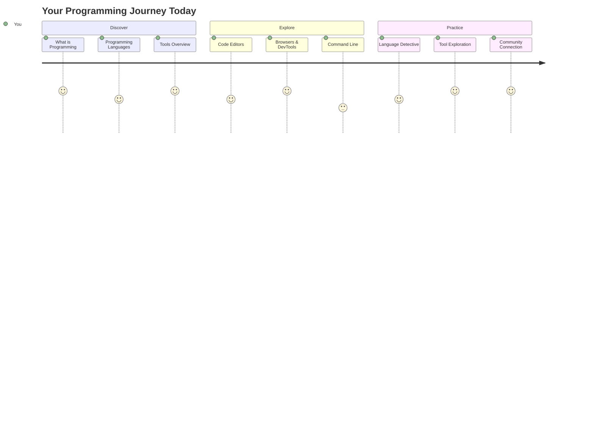
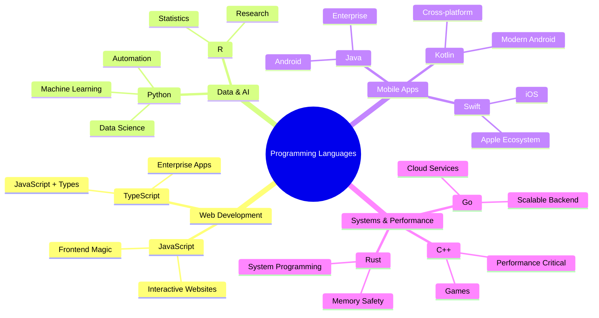
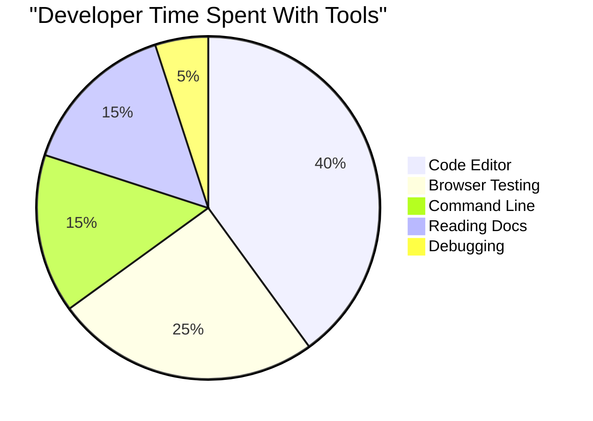
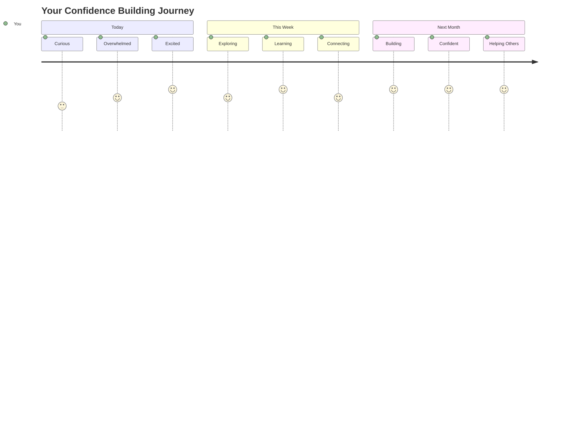

<!--
CO_OP_TRANSLATOR_METADATA:
{
  "original_hash": "d45ddcc54eb9232a76d08328b09d792e",
  "translation_date": "2025-11-04T01:51:13+00:00",
  "source_file": "1-getting-started-lessons/1-intro-to-programming-languages/README.md",
  "language_code": "nl"
}
-->
# Introductie tot programmeertalen en moderne ontwikkeltools

Hoi daar, toekomstige ontwikkelaar! 👋 Mag ik je iets vertellen dat me elke dag weer kippenvel bezorgt? Je staat op het punt te ontdekken dat programmeren niet alleen over computers gaat – het is alsof je superkrachten krijgt om je wildste ideeën tot leven te brengen!

Ken je dat moment waarop je je favoriete app gebruikt en alles gewoon perfect werkt? Wanneer je op een knop drukt en er iets magisch gebeurt waardoor je denkt: "Wow, hoe hebben ze DAT gedaan?" Nou, iemand zoals jij – waarschijnlijk zittend in hun favoriete koffietentje om 2 uur 's nachts met hun derde espresso – heeft de code geschreven die die magie creëerde. En hier komt het: aan het einde van deze les begrijp je niet alleen hoe ze dat deden, maar sta je te popelen om het zelf te proberen!

Luister, ik snap het helemaal als programmeren nu nog intimiderend lijkt. Toen ik begon, dacht ik eerlijk gezegd dat je een soort wiskundig genie moest zijn of al vanaf je vijfde aan het coderen moest zijn. Maar dit veranderde mijn hele kijk: programmeren is precies zoals het leren van een nieuwe taal. Je begint met "hallo" en "dank je," werkt toe naar het bestellen van koffie, en voor je het weet voer je diepe filosofische gesprekken! Alleen in dit geval voer je gesprekken met computers, en eerlijk? Ze zijn de meest geduldige gesprekspartners die je ooit zult hebben – ze oordelen nooit over je fouten en zijn altijd bereid om opnieuw te proberen!

Vandaag gaan we de geweldige tools verkennen die moderne webontwikkeling niet alleen mogelijk maken, maar ook verslavend leuk. Ik heb het over dezelfde editors, browsers en workflows die ontwikkelaars bij Netflix, Spotify en je favoriete indie-appstudio elke dag gebruiken. En hier komt het deel dat je een vreugdedansje laat doen: de meeste van deze professionele, industrienorm-tools zijn helemaal gratis!


> Sketchnote door [Tomomi Imura](https://twitter.com/girlie_mac)



## Laten we kijken wat je al weet!

Voordat we in de leuke dingen duiken, ben ik benieuwd – wat weet je al over deze programmeerwereld? En luister, als je naar deze vragen kijkt en denkt "Ik heb echt geen idee," dan is dat niet alleen oké, het is perfect! Dat betekent dat je precies op de juiste plek bent. Zie deze quiz als een warming-up voor een workout – we maken gewoon die hersenspieren warm!

[Doe de pre-les quiz](https://forms.office.com/r/dru4TE0U9n?origin=lprLink)

## Het avontuur dat we samen gaan beleven

Oké, ik ben echt super enthousiast over wat we vandaag gaan verkennen! Serieus, ik wou dat ik je gezicht kon zien wanneer sommige van deze concepten duidelijk worden. Hier is de geweldige reis die we samen gaan maken:

- **Wat programmeren eigenlijk is (en waarom het het coolste ooit is!)** – We gaan ontdekken hoe code letterlijk de onzichtbare magie is achter alles om je heen, van dat alarm dat weet dat het maandagochtend is tot het algoritme dat je perfecte Netflix-aanbevelingen samenstelt.
- **Programmeertalen en hun geweldige persoonlijkheden** – Stel je voor dat je een feestje binnenloopt waar iedereen compleet verschillende superkrachten en manieren heeft om problemen op te lossen. Dat is hoe de wereld van programmeertalen is, en je gaat ervan genieten om ze te leren kennen!
- **De fundamentele bouwstenen die digitale magie mogelijk maken** – Zie dit als de ultieme creatieve LEGO-set. Zodra je begrijpt hoe deze stukken in elkaar passen, realiseer je je dat je letterlijk alles kunt bouwen wat je fantasie bedenkt.
- **Professionele tools die je het gevoel geven dat je een toverstok hebt gekregen** – Ik overdrijf niet – deze tools geven je echt het gevoel dat je superkrachten hebt, en het beste deel? Het zijn dezelfde tools die de professionals gebruiken!

> 💡 **Hier is het ding**: Denk er niet eens aan om vandaag alles te proberen te onthouden! Voor nu wil ik alleen dat je die vonk van opwinding voelt over wat mogelijk is. De details blijven vanzelf hangen terwijl we samen oefenen – zo gebeurt echt leren!

> Je kunt deze les volgen op [Microsoft Learn](https://docs.microsoft.com/learn/modules/web-development-101/introduction-programming/?WT.mc_id=academic-77807-sagibbon)!

## Dus wat *is* programmeren eigenlijk?

Oké, laten we de miljoen-dollar vraag aanpakken: wat is programmeren nou echt?

Ik geef je een verhaal dat mijn kijk hierop compleet veranderde. Vorige week probeerde ik mijn moeder uit te leggen hoe ze onze nieuwe afstandsbediening van de smart-tv moest gebruiken. Ik hoorde mezelf dingen zeggen zoals "Druk op de rode knop, maar niet de grote rode knop, de kleine rode knop aan de linkerkant... nee, je andere links... oké, houd hem nu twee seconden ingedrukt, niet één, niet drie..." Klinkt bekend? 😅

Dat is programmeren! Het is de kunst van het geven van ongelooflijk gedetailleerde, stap-voor-stap instructies aan iets dat heel krachtig is maar alles perfect uitgelegd moet krijgen. Alleen in plaats van het uitleggen aan je moeder (die kan vragen "welke rode knop?!"), leg je het uit aan een computer (die precies doet wat je zegt, zelfs als wat je zei niet helemaal is wat je bedoelde).

Wat mijn gedachten compleet veranderde toen ik dit leerde: computers zijn eigenlijk vrij simpel in hun kern. Ze begrijpen letterlijk maar twee dingen – 1 en 0, wat in feite gewoon "ja" en "nee" of "aan" en "uit" is. Dat is alles! Maar hier wordt het magisch – we hoeven niet in 1-en en 0-en te spreken alsof we in The Matrix zitten. Dat is waar **programmeertalen** ons te hulp schieten. Ze zijn als de beste vertaler ter wereld die je normale menselijke gedachten omzet in computertaal.

En hier is wat me elke ochtend nog steeds kippenvel bezorgt: letterlijk *alles* digitaal in je leven begon met iemand zoals jij, waarschijnlijk zittend in hun pyjama met een kop koffie, code typend op hun laptop. Dat Instagram-filter dat je er perfect uit laat zien? Iemand heeft dat gecodeerd. De aanbeveling die je naar je nieuwe favoriete nummer leidde? Een ontwikkelaar heeft dat algoritme gebouwd. De app die je helpt om de rekening van het diner met vrienden te splitsen? Ja, iemand dacht "dit is irritant, ik wed dat ik dit kan oplossen" en toen... deden ze het!

Wanneer je leert programmeren, leer je niet alleen een nieuwe vaardigheid – je wordt onderdeel van deze geweldige gemeenschap van probleemoplossers die hun dagen doorbrengen met denken: "Wat als ik iets kon bouwen dat iemands dag net een beetje beter maakt?" Eerlijk, is er iets coolers dan dat?

✅ **Leuk weetje om op te zoeken**: Hier is iets supergaafs om op te zoeken als je een momentje vrij hebt – wie denk je dat de eerste computerprogrammeur ter wereld was? Ik geef je een hint: het is misschien niet wie je verwacht! Het verhaal achter deze persoon is absoluut fascinerend en laat zien dat programmeren altijd al draaide om creatief problemen oplossen en buiten de gebaande paden denken.

### 🧠 **Check-in tijd: Hoe voel je je?**

**Neem even de tijd om na te denken:**
- Begrijp je nu het idee van "instructies geven aan computers"?
- Kun je een dagelijkse taak bedenken die je zou willen automatiseren met programmeren?
- Welke vragen borrelen er op in je hoofd over dit hele programmeerconcept?

> **Onthoud**: Het is helemaal normaal als sommige concepten nu nog vaag aanvoelen. Programmeren leren is zoals het leren van een nieuwe taal – het kost tijd voordat je hersenen die neurale verbindingen opbouwen. Je doet het geweldig!

## Programmeertalen zijn als verschillende smaken van magie

Oké, dit klinkt misschien een beetje vreemd, maar blijf bij me – programmeertalen zijn een beetje zoals verschillende soorten muziek. Denk er eens over na: je hebt jazz, dat soepel en improviserend is, rock dat krachtig en rechttoe rechtaan is, klassiek dat elegant en gestructureerd is, en hip-hop dat creatief en expressief is. Elke stijl heeft zijn eigen vibe, zijn eigen gemeenschap van gepassioneerde fans, en elke stijl is perfect voor verschillende stemmingen en gelegenheden.

Programmeertalen werken precies hetzelfde! Je zou niet dezelfde taal gebruiken om een leuke mobiele game te bouwen als om enorme hoeveelheden klimaatdata te verwerken, net zoals je geen death metal zou spelen tijdens een yogales (nou ja, de meeste yogalessen! 😄).

Maar hier is wat me elke keer weer verbaast: deze talen zijn als de meest geduldige, briljante tolk ter wereld die naast je zit. Je kunt je ideeën uiten op een manier die natuurlijk voelt voor je menselijke brein, en zij doen al het ongelooflijk complexe werk om dat te vertalen naar de 1-en en 0-en die computers daadwerkelijk spreken. Het is alsof je een vriend hebt die perfect vloeiend is in zowel "menselijke creativiteit" als "computerlogica" – en ze worden nooit moe, hebben nooit koffiepauzes nodig, en oordelen nooit als je dezelfde vraag twee keer stelt!

### Populaire programmeertalen en hun toepassingen



| Taal | Beste voor | Waarom populair |
|------|------------|-----------------|
| **JavaScript** | Webontwikkeling, gebruikersinterfaces | Draait in browsers en maakt interactieve websites mogelijk |
| **Python** | Data science, automatisering, AI | Makkelijk te lezen en te leren, krachtige bibliotheken |
| **Java** | Enterprise-applicaties, Android-apps | Platformonafhankelijk, robuust voor grote systemen |
| **C#** | Windows-applicaties, gameontwikkeling | Sterke ondersteuning vanuit het Microsoft-ecosysteem |
| **Go** | Cloudservices, backendsystemen | Snel, simpel, ontworpen voor moderne computing |

### High-level vs. Low-level talen

Oké, dit was eerlijk gezegd het concept dat mijn brein brak toen ik begon met leren, dus ik ga de analogie delen die het eindelijk duidelijk maakte voor mij – en ik hoop echt dat het jou ook helpt!

Stel je voor dat je een land bezoekt waar je de taal niet spreekt, en je moet dringend de dichtstbijzijnde wc vinden (we hebben het allemaal meegemaakt, toch? 😅):

- **Low-level programmeren** is alsof je de lokale dialecten zo goed leert dat je kunt praten met de oma die fruit verkoopt op de hoek, met culturele verwijzingen, lokale slang en inside jokes die alleen iemand die daar is opgegroeid begrijpt. Super indrukwekkend en ongelooflijk efficiënt... als je toevallig vloeiend bent! Maar behoorlijk overweldigend als je gewoon een wc probeert te vinden.

- **High-level programmeren** is alsof je die geweldige lokale vriend hebt die je gewoon begrijpt. Je kunt zeggen "Ik moet echt een wc vinden" in gewoon Nederlands, en zij regelen alle culturele vertaling en geven je aanwijzingen op een manier die perfect logisch is voor jouw niet-lokale brein.

In programmeertermen:
- **Low-level talen** (zoals Assembly of C) laten je ongelooflijk gedetailleerde gesprekken voeren met de daadwerkelijke hardware van de computer, maar je moet denken als een machine, wat... nou ja, laten we zeggen dat het een behoorlijke mentale verschuiving is!
- **High-level talen** (zoals JavaScript, Python of C#) laten je denken als een mens terwijl zij alle machine-taal achter de schermen afhandelen. Plus, ze hebben ongelooflijk gastvrije gemeenschappen vol mensen die zich herinneren hoe het was om nieuw te zijn en echt willen helpen!

Raad eens welke ik ga voorstellen om mee te beginnen? 😉 High-level talen zijn als zijwieltjes die je eigenlijk nooit wilt afnemen omdat ze de hele ervaring zoveel leuker maken!

```mermaid
flowchart TB
    A["👤 Human Thought:<br/>'I want to calculate Fibonacci numbers'"] --> B{Choose Language Level}
    
    B -->|High-Level| C["🌟 JavaScript/Python<br/>Easy to read and write"]
    B -->|Low-Level| D["⚙️ Assembly/C<br/>Direct hardware control"]
    
    C --> E["📝 Write: fibonacci(10)"]
    D --> F["📝 Write: mov r0,#00<br/>sub r0,r0,#01"]
    
    E --> G["🤖 Computer Understanding:<br/>Translator handles complexity"]
    F --> G
    
    G --> H["💻 Same Result:<br/>0, 1, 1, 2, 3, 5, 8, 13..."]
    
    style C fill:#e1f5fe
    style D fill:#fff3e0
    style H fill:#e8f5e8
```



### Laat me je laten zien waarom high-level talen zoveel vriendelijker zijn

Oké, ik ga je iets laten zien dat perfect laat zien waarom ik verliefd werd op high-level talen, maar eerst – ik wil dat je me iets belooft. Wanneer je dat eerste codevoorbeeld ziet, niet in paniek raken! Het is bedoeld om intimiderend te lijken. Dat is precies het punt dat ik wil maken!

We gaan naar dezelfde taak kijken, geschreven in twee compleet verschillende stijlen. Beide creëren wat de Fibonacci-reeks wordt genoemd – het is een prachtige wiskundige patroon waarbij elk getal de som is van de twee ervoor: 0, 1, 1, 2, 3, 5, 8, 13... (Leuk weetje: je vindt dit patroon letterlijk overal in de natuur – zonnebloemzaadspiralen, dennenappels, zelfs de manier waarop sterrenstelsels worden gevormd!)

Klaar om het verschil te zien? Laten we gaan!

**High-level taal (JavaScript) – Mensvriendelijk:**

```javascript
// Step 1: Basic Fibonacci setup
const fibonacciCount = 10;
let current = 0;
let next = 1;

console.log('Fibonacci sequence:');
```

**Wat deze code doet:**
- **Declareert** een constante om aan te geven hoeveel Fibonacci-getallen we willen genereren
- **Initialiseert** twee variabelen om de huidige en volgende getallen in de reeks bij te houden
- **Stelt in** de startwaarden (0 en 1) die het Fibonacci-patroon definiëren
- **Toont** een koptekst om onze uitvoer te identificeren

```javascript
// Step 2: Generate the sequence with a loop
for (let i = 0; i < fibonacciCount; i++) {
  console.log(`Position ${i + 1}: ${current}`);
  
  // Calculate next number in sequence
  const sum = current + next;
  current = next;
  next = sum;
}
```

**Wat hier gebeurt:**
- **Loopt** door elke positie in onze reeks met een `for`-lus
- **Toont** elk getal met zijn positie met behulp van template literal formatting
- **Bereken** het volgende Fibonacci-getal door huidige en volgende waarden op te tellen
- **Update** onze trackingvariabelen om door te gaan naar de volgende iteratie

```javascript
// Step 3: Modern functional approach
const generateFibonacci = (count) => {
  const sequence = [0, 1];
  
  for (let i = 2; i < count; i++) {
    sequence[i] = sequence[i - 1] + sequence[i - 2];
  }
  
  return sequence;
};

// Usage example
const fibSequence = generateFibonacci(10);
console.log(fibSequence);
```

**Hier hebben we:**
- **Een herbruikbare functie gemaakt** met moderne arrow function syntax
- **Een array gebouwd** om de volledige reeks op te slaan in plaats van één voor één weer te geven
- **Array-indexering gebruikt** om elk nieuw getal te berekenen op basis van eerdere waarden
- **De volledige reeks geretourneerd** voor flexibel gebruik in andere delen van ons programma

**Low-level taal (ARM Assembly) – Computer-vriendelijk:**

```assembly
 area ascen,code,readonly
 entry
 code32
 adr r0,thumb+1
 bx r0
 code16
thumb
 mov r0,#00
 sub r0,r0,#01
 mov r1,#01
 mov r4,#10
 ldr r2,=0x40000000
back add r0,r1
 str r0,[r2]
 add r2,#04
 mov r3,r0
 mov r0,r1
 mov r1,r3
 sub r4,#01
 cmp r4,#00
 bne back
 end
```

Merk op hoe de JavaScript-versie bijna leest als Engelse instructies, terwijl de Assembly-versie cryptische commando's gebruikt die direct de processor van de computer aansturen. Beide bereiken exact dezelfde taak, maar de high-level taal is veel gemakkelijker voor mensen om te begrijpen, te schrijven en te onderhouden.

**Belangrijke verschillen die je zult opmerken:**
- **Leesbaarheid**: JavaScript gebruikt beschrijvende namen zoals `fibonacciCount`, terwijl Assembly cryptische labels gebruikt zoals `r0`, `r1`.
- **Opmerkingen**: Hoogwaardige programmeertalen moedigen verklarende opmerkingen aan die de code zelf documenterend maken  
- **Structuur**: De logische opbouw van JavaScript sluit aan bij hoe mensen problemen stap voor stap benaderen  
- **Onderhoud**: Het bijwerken van de JavaScript-versie voor verschillende vereisten is eenvoudig en duidelijk  

✅ **Over de Fibonacci-reeks**: Dit absoluut prachtige getallenpatroon (waarbij elk getal gelijk is aan de som van de twee voorgaande: 0, 1, 1, 2, 3, 5, 8...) komt letterlijk *overal* in de natuur voor! Je vindt het in zonnebloemspiralen, patronen op dennenappels, de kromming van nautilusschelpen en zelfs in de manier waarop boomtakken groeien. Het is echt ongelooflijk hoe wiskunde en code ons kunnen helpen de patronen te begrijpen en te recreëren die de natuur gebruikt om schoonheid te creëren!  

## De bouwstenen die de magie mogelijk maken  

Oké, nu je hebt gezien hoe programmeertalen eruitzien in actie, laten we de fundamentele onderdelen bekijken die letterlijk elk programma ooit geschreven vormen. Zie deze als de essentiële ingrediënten in je favoriete recept – zodra je begrijpt wat elk onderdeel doet, kun je code lezen en schrijven in vrijwel elke taal!  

Dit is een beetje zoals het leren van de grammatica van programmeren. Herinner je je nog dat je op school leerde over zelfstandige naamwoorden, werkwoorden en hoe je zinnen samenstelt? Programmeren heeft zijn eigen versie van grammatica, en eerlijk gezegd is het veel logischer en vergevingsgezinder dan de Engelse grammatica ooit was! 😄  

### Statements: De stap-voor-stap instructies  

Laten we beginnen met **statements** – dit zijn als individuele zinnen in een gesprek met je computer. Elk statement vertelt de computer om één specifieke taak uit te voeren, een beetje zoals het geven van aanwijzingen: "Sla hier linksaf," "Stop bij het rode licht," "Parkeer op die plek."  

Wat ik geweldig vind aan statements is hoe leesbaar ze meestal zijn. Kijk maar:  

```javascript
// Basic statements that perform single actions
const userName = "Alex";                    
console.log("Hello, world!");              
const sum = 5 + 3;                         
```
  
**Wat deze code doet:**  
- **Declareer** een constante variabele om de naam van een gebruiker op te slaan  
- **Toon** een begroetingsbericht in de console-output  
- **Bereken** en sla het resultaat van een wiskundige bewerking op  

```javascript
// Statements that interact with web pages
document.title = "My Awesome Website";      
document.body.style.backgroundColor = "lightblue";
```
  
**Stap voor stap, wat er gebeurt:**  
- **Wijzig** de titel van de webpagina die in het browsertabblad verschijnt  
- **Verander** de achtergrondkleur van de hele pagina  

### Variabelen: Het geheugensysteem van je programma  

Oké, **variabelen** zijn eerlijk gezegd een van mijn absolute favoriete concepten om uit te leggen, omdat ze zo veel lijken op dingen die je elke dag al gebruikt!  

Denk eens aan de contactenlijst op je telefoon. Je onthoudt niet ieders telefoonnummer – in plaats daarvan sla je "Mama," "Beste Vriend" of "Pizzeria die tot 2 uur 's nachts bezorgt" op en laat je telefoon de daadwerkelijke nummers onthouden. Variabelen werken precies hetzelfde! Ze zijn als gelabelde containers waarin je programma informatie kan opslaan en later kan ophalen met een naam die daadwerkelijk logisch is.  

Wat echt cool is: variabelen kunnen veranderen terwijl je programma draait (vandaar de naam "variabel" – snap je wat ze gedaan hebben?). Net zoals je dat contact van de pizzeria bijwerkt wanneer je een nog betere plek ontdekt, kunnen variabelen worden bijgewerkt terwijl je programma nieuwe informatie leert of wanneer situaties veranderen!  

Laat me je laten zien hoe prachtig eenvoudig dit kan zijn:  

```javascript
// Step 1: Creating basic variables
const siteName = "Weather Dashboard";        
let currentWeather = "sunny";               
let temperature = 75;                       
let isRaining = false;                      
```
  
**Deze concepten begrijpen:**  
- **Sla** onveranderlijke waarden op in `const`-variabelen (zoals de naam van een site)  
- **Gebruik** `let` voor waarden die tijdens je programma kunnen veranderen  
- **Ken** verschillende datatypes toe: strings (tekst), nummers en booleans (waar/onwaar)  
- **Kies** beschrijvende namen die uitleggen wat elke variabele bevat  

```javascript
// Step 2: Working with objects to group related data
const weatherData = {                       
  location: "San Francisco",
  humidity: 65,
  windSpeed: 12
};
```
  
**In het bovenstaande hebben we:**  
- **Een object gemaakt** om gerelateerde weersinformatie te groeperen  
- **Meerdere gegevens georganiseerd** onder één variabelenaam  
- **Key-value paren gebruikt** om elk stukje informatie duidelijk te labelen  

```javascript
// Step 3: Using and updating variables
console.log(`${siteName}: Today is ${currentWeather} and ${temperature}°F`);
console.log(`Wind speed: ${weatherData.windSpeed} mph`);

// Updating changeable variables
currentWeather = "cloudy";                  
temperature = 68;                          
```
  
**Laten we elk onderdeel begrijpen:**  
- **Toon** informatie met behulp van template literals met `${}`-syntax  
- **Toegang krijgen tot** objecteigenschappen met puntnotatie (`weatherData.windSpeed`)  
- **Update** variabelen gedeclareerd met `let` om veranderende omstandigheden weer te geven  
- **Combineer** meerdere variabelen om betekenisvolle berichten te maken  

```javascript
// Step 4: Modern destructuring for cleaner code
const { location, humidity } = weatherData; 
console.log(`${location} humidity: ${humidity}%`);
```
  
**Wat je moet weten:**  
- **Haal** specifieke eigenschappen uit objecten met destructuring assignment  
- **Maak** automatisch nieuwe variabelen met dezelfde namen als objectkeys  
- **Vereenvoudig** code door herhaalde puntnotatie te vermijden  

### Control Flow: Je programma leren denken  

Oké, hier wordt programmeren echt ongelooflijk! **Control flow** is in feite je programma leren hoe het slimme beslissingen kan nemen, precies zoals jij dat elke dag doet zonder er zelfs maar over na te denken.  

Stel je dit voor: vanmorgen ging je waarschijnlijk door iets als "Als het regent, pak ik een paraplu. Als het koud is, trek ik een jas aan. Als ik haast heb, sla ik het ontbijt over en haal ik koffie onderweg." Je brein volgt natuurlijk deze if-then logica tientallen keren per dag!  

Dit is wat programma's intelligent en levendig maakt in plaats van gewoon een saaie, voorspelbare script te volgen. Ze kunnen daadwerkelijk naar een situatie kijken, evalueren wat er gebeurt en gepast reageren. Het is alsof je je programma een brein geeft dat kan aanpassen en keuzes kan maken!  

Wil je zien hoe prachtig dit werkt? Laat me het je laten zien:  

```javascript
// Step 1: Basic conditional logic
const userAge = 17;

if (userAge >= 18) {
  console.log("You can vote!");
} else {
  const yearsToWait = 18 - userAge;
  console.log(`You'll be able to vote in ${yearsToWait} year(s).`);
}
```
  
**Wat deze code doet:**  
- **Controleer** of de leeftijd van de gebruiker voldoet aan de stemvereiste  
- **Voer** verschillende codeblokken uit op basis van het resultaat van de voorwaarde  
- **Bereken** en toon hoe lang het nog duurt tot stemgerechtigheid als de gebruiker jonger is dan 18  
- **Geef** specifieke, nuttige feedback voor elk scenario  

```javascript
// Step 2: Multiple conditions with logical operators
const userAge = 17;
const hasPermission = true;

if (userAge >= 18 && hasPermission) {
  console.log("Access granted: You can enter the venue.");
} else if (userAge >= 16) {
  console.log("You need parent permission to enter.");
} else {
  console.log("Sorry, you must be at least 16 years old.");
}
```
  
**Wat hier gebeurt, uitgelegd:**  
- **Combineer** meerdere voorwaarden met de `&&` (en) operator  
- **Creëer** een hiërarchie van voorwaarden met `else if` voor meerdere scenario's  
- **Behandel** alle mogelijke gevallen met een laatste `else`-statement  
- **Geef** duidelijke, uitvoerbare feedback voor elke verschillende situatie  

```javascript
// Step 3: Concise conditional with ternary operator
const votingStatus = userAge >= 18 ? "Can vote" : "Cannot vote yet";
console.log(`Status: ${votingStatus}`);
```
  
**Wat je moet onthouden:**  
- **Gebruik** de ternary operator (`? :`) voor eenvoudige twee-optie voorwaarden  
- **Schrijf** eerst de voorwaarde, gevolgd door `?`, dan het resultaat bij true, dan `:`, dan het resultaat bij false  
- **Pas** dit patroon toe wanneer je waarden moet toewijzen op basis van voorwaarden  

```javascript
// Step 4: Handling multiple specific cases
const dayOfWeek = "Tuesday";

switch (dayOfWeek) {
  case "Monday":
  case "Tuesday":
  case "Wednesday":
  case "Thursday":
  case "Friday":
    console.log("It's a weekday - time to work!");
    break;
  case "Saturday":
  case "Sunday":
    console.log("It's the weekend - time to relax!");
    break;
  default:
    console.log("Invalid day of the week");
}
```
  
**Wat deze code bereikt:**  
- **Vergelijk** de waarde van de variabele met meerdere specifieke gevallen  
- **Groepeer** vergelijkbare gevallen samen (weekdagen vs. weekenden)  
- **Voer** het juiste codeblok uit wanneer er een match wordt gevonden  
- **Voeg** een `default`-geval toe om onverwachte waarden te behandelen  
- **Gebruik** `break`-statements om te voorkomen dat de code doorgaat naar het volgende geval  

> 💡 **Echte wereld analogie**: Denk aan control flow als het hebben van 's werelds meest geduldige GPS die je aanwijzingen geeft. Het kan zeggen: "Als er verkeer is op Main Street, neem dan de snelweg. Als er constructie is op de snelweg, probeer dan de schilderachtige route." Programma's gebruiken precies hetzelfde soort logica om intelligent te reageren op verschillende situaties en gebruikers altijd de best mogelijke ervaring te bieden.  

### 🎯 **Concept Check: Beheersing van de bouwstenen**  

**Laten we kijken hoe je het doet met de basisprincipes:**  
- Kun je in je eigen woorden het verschil uitleggen tussen een variabele en een statement?  
- Denk aan een scenario uit de echte wereld waarin je een if-then beslissing zou gebruiken (zoals ons stemvoorbeeld)  
- Wat is één ding over programmeerlogica dat je heeft verrast?  

**Snelle zelfvertrouwen boost:**  

```mermaid
flowchart LR
    A["📝 Statements<br/>(Instructions)"] --> B["📦 Variables<br/>(Storage)"] --> C["🔀 Control Flow<br/>(Decisions)"] --> D["🎉 Working Program!"]
    
    style A fill:#ffeb3b
    style B fill:#4caf50
    style C fill:#2196f3
    style D fill:#ff4081
```

  
✅ **Wat er hierna komt**: We gaan ontzettend veel plezier hebben met het verder verdiepen in deze concepten terwijl we samen deze geweldige reis voortzetten! Focus nu gewoon op het voelen van die opwinding over alle geweldige mogelijkheden die voor je liggen. De specifieke vaardigheden en technieken zullen vanzelf blijven hangen terwijl we samen oefenen – ik beloof dat dit zoveel leuker gaat zijn dan je misschien verwacht!  

## Tools van het vak  

Oké, dit is eerlijk gezegd waar ik zo enthousiast van word dat ik mezelf nauwelijks kan bedwingen! 🚀 We gaan het hebben over de ongelooflijke tools die je het gevoel gaan geven alsof je net de sleutels van een digitale ruimteschip hebt gekregen.  

Weet je hoe een chef die perfect uitgebalanceerde messen heeft die aanvoelen als verlengstukken van hun handen? Of hoe een muzikant die ene gitaar heeft die lijkt te zingen zodra ze hem aanraken? Nou, ontwikkelaars hebben onze eigen versie van deze magische tools, en hier is wat je absoluut zal verbazen – de meeste zijn helemaal gratis!  

Ik zit praktisch te stuiteren op mijn stoel bij het idee om deze met je te delen, omdat ze volledig hebben veranderd hoe we software bouwen. We hebben het over AI-gestuurde code-assistenten die je kunnen helpen je code te schrijven (ik maak geen grapje!), cloudomgevingen waar je volledige applicaties kunt bouwen vanaf letterlijk elke plek met Wi-Fi, en debuggingtools die zo geavanceerd zijn dat ze aanvoelen als röntgenzicht voor je programma's.  

En hier is het deel dat me nog steeds kippenvel geeft: dit zijn geen "beginners-tools" die je ontgroeit. Dit zijn precies dezelfde professionele tools die ontwikkelaars bij Google, Netflix en dat indie-appstudio die je geweldig vindt op dit moment gebruiken. Je gaat je zo'n pro voelen als je ze gebruikt!  

```mermaid
graph TD
    A["💡 Your Idea"] --> B["⌨️ Code Editor<br/>(VS Code)"] 
    B --> C["🌐 Browser DevTools<br/>(Testing & Debugging)"]
    C --> D["⚡ Command Line<br/>(Automation & Tools)"]
    D --> E["📚 Documentation<br/>(Learning & Reference)"]
    E --> F["🚀 Amazing Web App!"]
    
    B -.-> G["🤖 AI Assistant<br/>(GitHub Copilot)"]
    C -.-> H["📱 Device Testing<br/>(Responsive Design)"]
    D -.-> I["📦 Package Managers<br/>(npm, yarn)"]
    E -.-> J["👥 Community<br/>(Stack Overflow)"]
    
    style A fill:#fff59d
    style F fill:#c8e6c9
    style G fill:#e1f5fe
    style H fill:#f3e5f5
    style I fill:#ffccbc
    style J fill:#e8eaf6
```


  
### Code-editors en IDE's: Je nieuwe digitale beste vrienden  

Laten we het hebben over code-editors – deze gaan serieus je nieuwe favoriete plekken worden om rond te hangen! Zie ze als je persoonlijke code-heiligdom waar je de meeste tijd zult doorbrengen met het maken en perfectioneren van je digitale creaties.  

Maar hier is wat absoluut magisch is aan moderne editors: ze zijn niet alleen fancy teksteditors. Ze zijn als het hebben van de meest briljante, ondersteunende code-mentor die 24/7 naast je zit. Ze vangen je typefouten op voordat je ze zelfs maar opmerkt, stellen verbeteringen voor die je eruit laten zien als een genie, helpen je te begrijpen wat elk stukje code doet, en sommige kunnen zelfs voorspellen wat je gaat typen en aanbieden om je gedachten af te maken!  

Ik herinner me nog toen ik voor het eerst autocompletion ontdekte – ik voelde me letterlijk alsof ik in de toekomst leefde. Je begint iets te typen, en je editor zegt: "Hé, dacht je aan deze functie die precies doet wat je nodig hebt?" Het is alsof je een gedachtenlezer hebt als je code-buddy!  

**Wat maakt deze editors zo geweldig?**  

Moderne code-editors bieden een indrukwekkende reeks functies die zijn ontworpen om je productiviteit te verhogen:  

| Functie | Wat het doet | Waarom het helpt |  
|---------|--------------|------------------|  
| **Syntax Highlighting** | Kleurt verschillende delen van je code | Maakt code gemakkelijker te lezen en fouten te spotten |  
| **Auto-completion** | Stelt code voor terwijl je typt | Versnelt coderen en vermindert typefouten |  
| **Debugging Tools** | Helpt je fouten te vinden en op te lossen | Bespaart uren aan probleemoplossing |  
| **Extensions** | Voegt gespecialiseerde functies toe | Past je editor aan voor elke technologie |  
| **AI Assistants** | Stelt code en uitleg voor | Versnelt leren en productiviteit |  

> 🎥 **Video Resource**: Wil je deze tools in actie zien? Bekijk deze [Tools of the Trade video](https://youtube.com/watch?v=69WJeXGBdxg) voor een uitgebreide uitleg.  

#### Aanbevolen editors voor webontwikkeling  

**[Visual Studio Code](https://code.visualstudio.com/?WT.mc_id=academic-77807-sagibbon)** (Gratis)  
- Meest populair onder webontwikkelaars  
- Uitstekend extensie-ecosysteem  
- Ingebouwde terminal en Git-integratie  
- **Must-have extensies**:  
  - [GitHub Copilot](https://marketplace.visualstudio.com/items?itemName=GitHub.copilot) - AI-gestuurde codevoorstellen  
  - [Live Share](https://marketplace.visualstudio.com/items?itemName=MS-vsliveshare.vsliveshare) - Real-time samenwerking  
  - [Prettier](https://marketplace.visualstudio.com/items?itemName=esbenp.prettier-vscode) - Automatische code-opmaak  
  - [Code Spell Checker](https://marketplace.visualstudio.com/items?itemName=streetsidesoftware.code-spell-checker) - Vang typefouten in je code  

**[JetBrains WebStorm](https://www.jetbrains.com/webstorm/)** (Betaald, gratis voor studenten)  
- Geavanceerde debugging- en testtools  
- Intelligente code-completion  
- Ingebouwde versiebeheer  

**Cloud-gebaseerde IDE's** (Verschillende prijzen)  
- [GitHub Codespaces](https://github.com/features/codespaces) - Volledige VS Code in je browser  
- [Replit](https://replit.com/) - Geweldig om te leren en code te delen  
- [StackBlitz](https://stackblitz.com/) - Directe, full-stack webontwikkeling  

> 💡 **Beginnerstip**: Begin met Visual Studio Code – het is gratis, veel gebruikt in de industrie en heeft een enorme community die nuttige tutorials en extensies maakt.  

### Webbrowsers: Je geheime ontwikkellaboratorium  

Oké, bereid je voor om compleet verbaasd te zijn! Weet je hoe je browsers gebruikt om door sociale media te scrollen en video's te bekijken? Nou, het blijkt dat ze al die tijd een ongelooflijk geheim ontwikkellaboratorium verborgen hebben, gewoon wachtend om door jou ontdekt te worden!  

Elke keer dat je met de rechtermuisknop op een webpagina klikt en "Element inspecteren" selecteert, open je een verborgen wereld van ontwikkelaarstools die eerlijk gezegd krachtiger zijn dan sommige dure software waar ik vroeger honderden euro's voor betaalde. Het is alsof je ontdekt dat je gewone keuken een professioneel laboratorium voor chef-koks verbergt achter een geheime deur!  
De eerste keer dat iemand mij de browser DevTools liet zien, heb ik ongeveer drie uur lang rondgeklikt en gedacht: "WACHT, DAT KAN HET OOK?!" Je kunt letterlijk elke website in real-time bewerken, precies zien hoe snel alles laadt, testen hoe je site eruitziet op verschillende apparaten, en zelfs JavaScript debuggen als een echte professional. Het is echt verbluffend!

**Waarom browsers jouw geheime wapen zijn:**

Wanneer je een website of webapplicatie maakt, moet je zien hoe het eruitziet en functioneert in de echte wereld. Browsers tonen niet alleen je werk, maar geven ook gedetailleerde feedback over prestaties, toegankelijkheid en mogelijke problemen.

#### Browser Developer Tools (DevTools)

Moderne browsers bevatten uitgebreide ontwikkelsuites:

| Categorie Tool | Wat het doet | Voorbeeldgebruik |
|----------------|--------------|------------------|
| **Element Inspector** | Bekijk en bewerk HTML/CSS in real-time | Pas styling aan en zie directe resultaten |
| **Console** | Bekijk foutmeldingen en test JavaScript | Debug problemen en experimenteer met code |
| **Network Monitor** | Volg hoe bronnen laden | Optimaliseer prestaties en laadtijden |
| **Accessibility Checker** | Test op inclusieve ontwerpen | Zorg dat je site werkt voor alle gebruikers |
| **Device Simulator** | Bekijk hoe je site eruitziet op verschillende schermformaten | Test responsief ontwerp zonder meerdere apparaten |

#### Aanbevolen browsers voor ontwikkeling

- **[Chrome](https://developers.google.com/web/tools/chrome-devtools/)** - DevTools van industriestandaard met uitgebreide documentatie
- **[Firefox](https://developer.mozilla.org/docs/Tools)** - Uitstekende CSS Grid- en toegankelijkheidstools
- **[Edge](https://docs.microsoft.com/microsoft-edge/devtools-guide-chromium/?WT.mc_id=academic-77807-sagibbon)** - Gebouwd op Chromium met Microsofts ontwikkelaarsbronnen

> ⚠️ **Belangrijke testtip**: Test je websites altijd in meerdere browsers! Wat perfect werkt in Chrome kan er anders uitzien in Safari of Firefox. Professionele ontwikkelaars testen in alle grote browsers om een consistente gebruikerservaring te garanderen.

### Command Line Tools: Jouw toegangspoort tot ontwikkelaars-superkrachten

Oké, laten we even eerlijk zijn over de command line, want ik wil dat je dit hoort van iemand die het echt begrijpt. De eerste keer dat ik het zag – gewoon dat enge zwarte scherm met knipperende tekst – dacht ik letterlijk: "Nee, absoluut niet! Dit lijkt op iets uit een hackerfilm uit de jaren 80, en ik ben hier zeker niet slim genoeg voor!" 😅

Maar hier is wat ik toen had willen weten, en wat ik je nu vertel: de command line is niet eng – het is eigenlijk alsof je een direct gesprek hebt met je computer. Zie het als het verschil tussen eten bestellen via een fancy app met plaatjes en menu's (wat leuk en makkelijk is) versus binnenlopen bij je favoriete lokale restaurant waar de chef precies weet wat je lekker vindt en iets perfects kan maken door gewoon te zeggen: "verras me met iets geweldigs."

De command line is waar ontwikkelaars zich als echte tovenaars voelen. Je typt een paar schijnbaar magische woorden (oké, het zijn gewoon commando's, maar ze voelen magisch!), drukt op enter, en BOEM – je hebt complete projectstructuren gemaakt, krachtige tools van over de hele wereld geïnstalleerd, of je app op internet gezet voor miljoenen mensen om te zien. Zodra je een voorproefje krijgt van die kracht, is het eerlijk gezegd best verslavend!

**Waarom de command line je favoriete tool wordt:**

Hoewel grafische interfaces geweldig zijn voor veel taken, blinkt de command line uit in automatisering, precisie en snelheid. Veel ontwikkeltools werken voornamelijk via command line interfaces, en leren hoe je ze efficiënt kunt gebruiken kan je productiviteit enorm verbeteren.

```bash
# Step 1: Create and navigate to project directory
mkdir my-awesome-website
cd my-awesome-website
```

**Wat deze code doet:**
- **Maak** een nieuwe map genaamd "my-awesome-website" voor je project
- **Navigeer** naar de nieuw aangemaakte map om te beginnen met werken

```bash
# Step 2: Initialize project with package.json
npm init -y

# Install modern development tools
npm install --save-dev vite prettier eslint
npm install --save-dev @eslint/js
```

**Stap voor stap, wat er gebeurt:**
- **Initialiseer** een nieuw Node.js-project met standaardinstellingen via `npm init -y`
- **Installeer** Vite als een moderne buildtool voor snelle ontwikkeling en productie-builds
- **Voeg** Prettier toe voor automatische codeformattering en ESLint voor codekwaliteitscontroles
- **Gebruik** de `--save-dev` vlag om deze als alleen-ontwikkelingsafhankelijkheden te markeren

```bash
# Step 3: Create project structure and files
mkdir src assets
echo '<!DOCTYPE html><html><head><title>My Site</title></head><body><h1>Hello World</h1></body></html>' > index.html

# Start development server
npx vite
```

**Hier hebben we:**
- **Georganiseerd** ons project door aparte mappen te maken voor broncode en assets
- **Een basis HTML-bestand gegenereerd** met een correcte documentstructuur
- **De Vite ontwikkelserver gestart** voor live herladen en hot module replacement

#### Essentiële Command Line Tools voor Webontwikkeling

| Tool | Doel | Waarom je het nodig hebt |
|------|------|--------------------------|
| **[Git](https://git-scm.com/)** | Versiebeheer | Volg wijzigingen, werk samen met anderen, maak een back-up van je werk |
| **[Node.js & npm](https://nodejs.org/)** | JavaScript runtime & pakketbeheer | Voer JavaScript buiten browsers uit, installeer moderne ontwikkeltools |
| **[Vite](https://vitejs.dev/)** | Buildtool & ontwikkelserver | Razendsnelle ontwikkeling met hot module replacement |
| **[ESLint](https://eslint.org/)** | Codekwaliteit | Vind en los automatisch problemen in je JavaScript op |
| **[Prettier](https://prettier.io/)** | Codeformattering | Houd je code consistent geformatteerd en leesbaar |

#### Platformspecifieke opties

**Windows:**
- **[Windows Terminal](https://docs.microsoft.com/windows/terminal/?WT.mc_id=academic-77807-sagibbon)** - Moderne, uitgebreide terminal
- **[PowerShell](https://docs.microsoft.com/powershell/?WT.mc_id=academic-77807-sagibbon)** 💻 - Krachtige scriptingomgeving
- **[Command Prompt](https://docs.microsoft.com/windows-server/administration/windows-commands/?WT.mc_id=academic-77807-sagibbon)** 💻 - Traditionele Windows command line

**macOS:**
- **[Terminal](https://support.apple.com/guide/terminal/)** 💻 - Ingebouwde terminalapplicatie
- **[iTerm2](https://iterm2.com/)** - Geavanceerde terminal met extra functies

**Linux:**
- **[Bash](https://www.gnu.org/software/bash/)** 💻 - Standaard Linux shell
- **[KDE Konsole](https://docs.kde.org/trunk5/en/konsole/konsole/index.html)** - Geavanceerde terminalemulator

> 💻 = Vooraf geïnstalleerd op het besturingssysteem

> 🎯 **Leerpad**: Begin met basiscommando's zoals `cd` (verander map), `ls` of `dir` (lijst bestanden), en `mkdir` (maak map). Oefen met moderne workflowcommando's zoals `npm install`, `git status`, en `code .` (opent huidige map in VS Code). Naarmate je meer vertrouwd raakt, leer je vanzelf meer geavanceerde commando's en automatiseringstechnieken.

### Documentatie: Jouw altijd beschikbare leermentor

Oké, laat me een klein geheim delen dat je een stuk beter laat voelen over het zijn van een beginner: zelfs de meest ervaren ontwikkelaars besteden een groot deel van hun tijd aan het lezen van documentatie. En dat is niet omdat ze niet weten wat ze doen – het is eigenlijk een teken van wijsheid!

Zie documentatie als toegang tot de meest geduldige, deskundige leraren ter wereld die 24/7 beschikbaar zijn. Vastlopen op een probleem om 2 uur 's nachts? Documentatie is er met een warme virtuele knuffel en precies het antwoord dat je nodig hebt. Wil je leren over een coole nieuwe functie waar iedereen over praat? Documentatie helpt je met stapsgewijze voorbeelden. Probeer je te begrijpen waarom iets werkt zoals het werkt? Je raadt het al – documentatie staat klaar om het uit te leggen op een manier die eindelijk duidelijk wordt!

Hier is iets dat mijn perspectief volledig veranderde: de wereld van webontwikkeling beweegt ongelooflijk snel, en niemand (ik bedoel echt niemand!) onthoudt alles. Ik heb senior ontwikkelaars met meer dan 15 jaar ervaring basis-syntaxis zien opzoeken, en weet je wat? Dat is niet gênant – dat is slim! Het gaat niet om een perfect geheugen hebben; het gaat erom snel betrouwbare antwoorden te vinden en te begrijpen hoe je ze kunt toepassen.

**Hier gebeurt de echte magie:**

Professionele ontwikkelaars besteden een aanzienlijk deel van hun tijd aan het lezen van documentatie – niet omdat ze niet weten wat ze doen, maar omdat het webontwikkelingslandschap zo snel evolueert dat up-to-date blijven continu leren vereist. Goede documentatie helpt je niet alleen te begrijpen *hoe* je iets gebruikt, maar ook *waarom* en *wanneer* je het moet gebruiken.

#### Essentiële documentatiebronnen

**[Mozilla Developer Network (MDN)](https://developer.mozilla.org/docs/Web)**
- De gouden standaard voor webtechnologie-documentatie
- Uitgebreide gidsen voor HTML, CSS en JavaScript
- Inclusief browsercompatibiliteitsinformatie
- Bevat praktische voorbeelden en interactieve demo's

**[Web.dev](https://web.dev)** (door Google)
- Moderne webontwikkelingsbest practices
- Gidsen voor prestatieoptimalisatie
- Principes van toegankelijkheid en inclusief ontwerp
- Case studies van echte projecten

**[Microsoft Developer Documentation](https://docs.microsoft.com/microsoft-edge/#microsoft-edge-for-developers)**
- Edge browser ontwikkelingsbronnen
- Progressive Web App gidsen
- Inzichten in cross-platform ontwikkeling

**[Frontend Masters Learning Paths](https://frontendmasters.com/learn/)**
- Gestructureerde leerprogramma's
- Videocursussen van industrie-experts
- Hands-on codeeropdrachten

> 📚 **Studie strategie**: Probeer documentatie niet te onthouden – leer in plaats daarvan hoe je het efficiënt kunt navigeren. Maak bladwijzers van vaak gebruikte referenties en oefen met de zoekfuncties om snel specifieke informatie te vinden.

### 🔧 **Tool Mastery Check: Wat spreekt je aan?**

**Neem een moment om te overwegen:**
- Welke tool wil je als eerste proberen? (Er is geen fout antwoord!)
- Voelt de command line nog steeds intimiderend, of ben je er nieuwsgierig naar?
- Kun je je voorstellen dat je browser DevTools gebruikt om achter de schermen van je favoriete websites te kijken?



> **Leuke inzicht**: De meeste ontwikkelaars besteden ongeveer 40% van hun tijd in hun code-editor, maar let op hoeveel tijd gaat naar testen, leren en probleemoplossing. Programmeren gaat niet alleen over code schrijven – het gaat over het creëren van ervaringen!

✅ **Om over na te denken**: Hier is iets interessants om over na te denken – hoe denk je dat de tools voor het bouwen van websites (ontwikkeling) verschillen van de tools voor het ontwerpen van hoe ze eruitzien (ontwerp)? Het is zoals het verschil tussen een architect die een prachtig huis ontwerpt en de aannemer die het daadwerkelijk bouwt. Beide zijn cruciaal, maar ze hebben verschillende gereedschapskisten nodig! Dit soort denken helpt je echt om het grotere plaatje te zien van hoe websites tot leven komen.

## GitHub Copilot Agent Challenge 🚀

Gebruik de Agent-modus om de volgende uitdaging te voltooien:

**Beschrijving:** Verken de functies van een moderne code-editor of IDE en demonstreer hoe deze je workflow als webontwikkelaar kan verbeteren.

**Prompt:** Kies een code-editor of IDE (zoals Visual Studio Code, WebStorm of een cloud-gebaseerde IDE). Noem drie functies of extensies die je helpen om efficiënter code te schrijven, debuggen of onderhouden. Geef voor elk een korte uitleg over hoe het je workflow ten goede komt.

---

## 🚀 Uitdaging

**Oké, detective, klaar voor je eerste zaak?**

Nu je deze geweldige basis hebt, heb ik een avontuur dat je helpt te zien hoe ongelooflijk divers en fascinerend de programmeerwereld echt is. En luister – dit gaat nog niet over code schrijven, dus geen druk daar! Zie jezelf als een programmeertaal-detective op je allereerste spannende zaak!

**Je missie, als je ervoor kiest om deze te accepteren:**
1. **Word een taalverkenner**: Kies drie programmeertalen uit totaal verschillende werelden – misschien één die websites bouwt, één die mobiele apps maakt, en één die data verwerkt voor wetenschappers. Zoek voorbeelden van dezelfde eenvoudige taak geschreven in elke taal. Ik beloof je dat je versteld zult staan van hoe verschillend ze eruit kunnen zien terwijl ze precies hetzelfde doen!

2. **Ontdek hun oorsprongsverhalen**: Wat maakt elke taal speciaal? Hier is een cool feit – elke programmeertaal is gemaakt omdat iemand dacht: "Weet je wat? Er moet een betere manier zijn om dit specifieke probleem op te lossen." Kun je achterhalen wat die problemen waren? Sommige van deze verhalen zijn echt fascinerend!

3. **Ontmoet de gemeenschappen**: Bekijk hoe gastvrij en gepassioneerd de gemeenschap van elke taal is. Sommige hebben miljoenen ontwikkelaars die kennis delen en elkaar helpen, andere zijn kleiner maar ongelooflijk hecht en ondersteunend. Je zult het geweldig vinden om de verschillende persoonlijkheden van deze gemeenschappen te zien!

4. **Volg je gevoel**: Welke taal voelt op dit moment het meest toegankelijk voor jou? Maak je geen zorgen over het maken van de "perfecte" keuze – luister gewoon naar je instinct! Er is hier echt geen fout antwoord, en je kunt later altijd andere talen verkennen.

**Bonus detectivewerk**: Kijk of je kunt ontdekken welke grote websites of apps met elke taal zijn gebouwd. Ik garandeer je dat je versteld zult staan als je ontdekt wat Instagram, Netflix of die mobiele game die je niet kunt stoppen met spelen aandrijft!

> 💡 **Onthoud**: Je probeert vandaag niet een expert te worden in een van deze talen. Je leert gewoon de buurt kennen voordat je besluit waar je wilt gaan wonen. Neem je tijd, geniet ervan, en laat je nieuwsgierigheid je leiden!

## Laten we vieren wat je hebt ontdekt!

Wauw, je hebt vandaag zoveel geweldige informatie opgenomen! Ik ben echt enthousiast om te zien hoeveel van deze geweldige reis bij je is blijven hangen. En onthoud – dit is geen test waar je alles perfect moet doen. Dit is meer een viering van alle coole dingen die je hebt geleerd over deze fascinerende wereld waarin je je gaat verdiepen!

[Doe de quiz na de les](https://ff-quizzes.netlify.app/web/)
## Review & Zelfstudie

**Neem de tijd om te verkennen en er plezier in te hebben!**

Je hebt vandaag veel geleerd, en daar mag je trots op zijn! Nu komt het leuke gedeelte – de onderwerpen verkennen die je nieuwsgierigheid hebben gewekt. Onthoud, dit is geen huiswerk – het is een avontuur!

**Duik dieper in wat je interesseert:**

**Ga aan de slag met programmeertalen:**
- Bezoek de officiële websites van 2-3 talen die je aandacht hebben getrokken. Elke taal heeft zijn eigen persoonlijkheid en verhaal!
- Probeer enkele online coding playgrounds zoals [CodePen](https://codepen.io/), [JSFiddle](https://jsfiddle.net/) of [Replit](https://replit.com/). Wees niet bang om te experimenteren – je kunt niets kapot maken!
- Lees over hoe jouw favoriete programmeertaal is ontstaan. Echt waar, sommige van deze verhalen zijn fascinerend en helpen je te begrijpen waarom talen werken zoals ze doen.

**Word vertrouwd met je nieuwe tools:**
- Download Visual Studio Code als je dat nog niet hebt gedaan – het is gratis en je gaat het geweldig vinden!
- Besteed een paar minuten aan het bladeren door de Extensions-marktplaats. Het is net een app store voor je code-editor!
- Open de Developer Tools van je browser en klik gewoon rond. Maak je geen zorgen over alles begrijpen – raak gewoon vertrouwd met wat er is.

**Sluit je aan bij de community:**
- Volg enkele ontwikkelaarsgemeenschappen op [Dev.to](https://dev.to/), [Stack Overflow](https://stackoverflow.com/) of [GitHub](https://github.com/). De programmeergemeenschap is ongelooflijk gastvrij voor nieuwkomers!
- Bekijk enkele beginnersvriendelijke programmeervideo's op YouTube. Er zijn zoveel geweldige makers die zich herinneren hoe het is om net te beginnen.
- Overweeg om deel te nemen aan lokale meetups of online gemeenschappen. Geloof me, ontwikkelaars helpen graag nieuwkomers!

> 🎯 **Luister, dit wil ik dat je onthoudt**: Je wordt niet verwacht om van de ene op de andere dag een programmeerexpert te worden! Op dit moment leer je gewoon deze geweldige nieuwe wereld kennen waar je deel van gaat uitmaken. Neem de tijd, geniet van de reis, en onthoud – elke ontwikkelaar die je bewondert, zat ooit precies waar jij nu zit, enthousiast en misschien een beetje overweldigd. Dat is helemaal normaal, en het betekent dat je het goed doet!


## Opdracht

[De documentatie lezen](assignment.md)

> 💡 **Een kleine aanmoediging voor je opdracht**: Ik zou het geweldig vinden om te zien dat je enkele tools verkent die we nog niet hebben behandeld! Sla de editors, browsers en commandoregeltools over waar we het al over hebben gehad – er is een hele ongelooflijke wereld van geweldige ontwikkeltools die erop wachten om ontdekt te worden. Zoek naar tools die actief worden onderhouden en een levendige, behulpzame community hebben (deze hebben meestal de beste tutorials en de meest ondersteunende mensen wanneer je onvermijdelijk vastloopt en een helpende hand nodig hebt).

---

## 🚀 Jouw Programmeerreis Tijdlijn

### ⚡ **Wat Je Binnen 5 Minuten Kunt Doen**
- [ ] Bookmark 2-3 websites van programmeertalen die je interessant vindt
- [ ] Download Visual Studio Code als je dat nog niet hebt gedaan
- [ ] Open de DevTools van je browser (F12) en klik rond op een willekeurige website
- [ ] Sluit je aan bij één programmeergemeenschap (Dev.to, Reddit r/webdev, of Stack Overflow)

### ⏰ **Wat Je Binnen Een Uur Kunt Bereiken**
- [ ] Maak de quiz na de les en reflecteer op je antwoorden
- [ ] Stel VS Code in met de GitHub Copilot-extensie
- [ ] Probeer een "Hello World"-voorbeeld in 2 verschillende programmeertalen online
- [ ] Bekijk een "Dag uit het leven van een ontwikkelaar"-video op YouTube
- [ ] Begin met je programmeertaal-detectivewerk (uit de uitdaging)

### 📅 **Je Weeklange Avontuur**
- [ ] Maak de opdracht af en verken 3 nieuwe ontwikkeltools
- [ ] Volg 5 ontwikkelaars of programmeeraccounts op sociale media
- [ ] Probeer iets kleins te bouwen in CodePen of Replit (zelfs "Hallo, [Jouw Naam]!")
- [ ] Lees een blogpost van een ontwikkelaar over hun programmeerreis
- [ ] Neem deel aan een virtuele meetup of bekijk een programmeerpresentatie
- [ ] Begin met het leren van je gekozen programmeertaal via online tutorials

### 🗓️ **Je Maandlange Transformatie**
- [ ] Bouw je eerste kleine project (zelfs een eenvoudige webpagina telt!)
- [ ] Draag bij aan een open-sourceproject (begin met documentatiefixes)
- [ ] Begeleid iemand die net begint met programmeren
- [ ] Maak je ontwikkelaarsportfolio-website
- [ ] Maak contact met lokale ontwikkelaarsgemeenschappen of studiegroepen
- [ ] Begin met het plannen van je volgende leerdoel

### 🎯 **Eindreflectie Check-in**

**Voordat je verder gaat, neem een moment om te vieren:**
- Wat is één ding aan programmeren dat je vandaag enthousiast maakte?
- Welke tool of concept wil je als eerste verkennen?
- Hoe voel je je over het starten van deze programmeerreis?
- Wat is één vraag die je nu aan een ontwikkelaar zou willen stellen?



> 🌟 **Onthoud**: Elke expert was ooit een beginner. Elke senior ontwikkelaar heeft zich ooit precies zo gevoeld als jij nu – enthousiast, misschien een beetje overweldigd, en zeker nieuwsgierig naar wat mogelijk is. Je bent in geweldig gezelschap, en deze reis gaat ongelooflijk worden. Welkom in de prachtige wereld van programmeren! 🎉

---

**Disclaimer**:  
Dit document is vertaald met behulp van de AI-vertalingsservice [Co-op Translator](https://github.com/Azure/co-op-translator). Hoewel we streven naar nauwkeurigheid, dient u zich ervan bewust te zijn dat geautomatiseerde vertalingen fouten of onnauwkeurigheden kunnen bevatten. Het originele document in de oorspronkelijke taal moet worden beschouwd als de gezaghebbende bron. Voor kritieke informatie wordt professionele menselijke vertaling aanbevolen. Wij zijn niet aansprakelijk voor eventuele misverstanden of verkeerde interpretaties die voortvloeien uit het gebruik van deze vertaling.