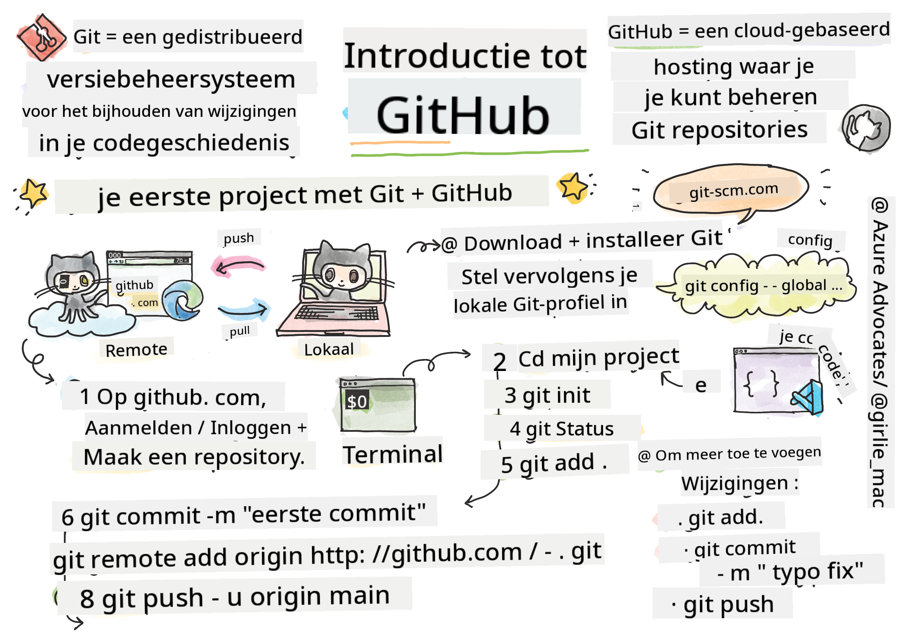
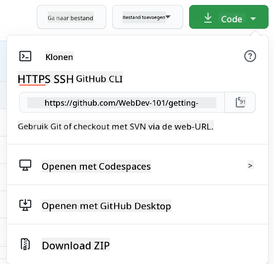

<!--
CO_OP_TRANSLATOR_METADATA:
{
  "original_hash": "361249da70432ddfd4741c917d1a6f50",
  "translation_date": "2025-08-29T01:05:39+00:00",
  "source_file": "1-getting-started-lessons/2-github-basics/README.md",
  "language_code": "nl"
}
-->
# Introductie tot GitHub

Deze les behandelt de basisprincipes van GitHub, een platform om je code te hosten en wijzigingen te beheren.


> Sketchnote door [Tomomi Imura](https://twitter.com/girlie_mac)

## Quiz voorafgaand aan de les
[Quiz voorafgaand aan de les](https://ff-quizzes.netlify.app)

## Introductie

In deze les behandelen we:

- het bijhouden van het werk dat je op je computer doet
- samenwerken aan projecten met anderen
- hoe je kunt bijdragen aan open source software

### Vereisten

Voordat je begint, moet je controleren of Git is geïnstalleerd. Typ in de terminal:  
`git --version`

Als Git niet is geïnstalleerd, [download Git](https://git-scm.com/downloads). Stel vervolgens je lokale Git-profiel in via de terminal:
* `git config --global user.name "jouw-naam"`
* `git config --global user.email "jouw-email"`

Om te controleren of Git al is geconfigureerd, kun je typen:
`git config --list`

Je hebt ook een GitHub-account nodig, een code-editor (zoals Visual Studio Code), en je moet je terminal (of: opdrachtprompt) openen.

Ga naar [github.com](https://github.com/) en maak een account aan als je dat nog niet hebt, of log in en vul je profiel in.

✅ GitHub is niet de enige code-repository ter wereld; er zijn andere, maar GitHub is de bekendste.

### Voorbereiding

Je hebt zowel een map met een codeproject op je lokale computer (laptop of pc) nodig, als een openbare repository op GitHub, die als voorbeeld zal dienen voor hoe je kunt bijdragen aan de projecten van anderen.

---

## Codebeheer

Stel dat je lokaal een map hebt met een codeproject en je wilt je voortgang gaan bijhouden met behulp van Git - het versiebeheersysteem. Sommige mensen vergelijken het gebruik van Git met het schrijven van een liefdesbrief aan je toekomstige zelf. Door je commit-berichten later terug te lezen, kun je je herinneren waarom je een bepaalde beslissing hebt genomen, of een wijziging "terugdraaien" - mits je goede "commit-berichten" schrijft.

### Taak: Maak een repository en commit code  

> Bekijk de video
> 
> [](https://www.youtube.com/watch?v=9R31OUPpxU4)

1. **Maak een repository op GitHub**. Op GitHub.com, in het tabblad repositories, of via de navigatiebalk rechtsboven, vind je de knop **new repo**.

   1. Geef je repository (map) een naam.
   1. Selecteer **create repository**.

1. **Navigeer naar je werkmap**. In je terminal, ga naar de map (ook wel directory genoemd) die je wilt gaan bijhouden. Typ:

   ```bash
   cd [name of your folder]
   ```

1. **Initialiseer een Git-repository**. Typ in je project:

   ```bash
   git init
   ```

1. **Controleer de status**. Om de status van je repository te controleren, typ:

   ```bash
   git status
   ```

   De uitvoer kan er ongeveer zo uitzien:

   ```output
   Changes not staged for commit:
   (use "git add <file>..." to update what will be committed)
   (use "git checkout -- <file>..." to discard changes in working directory)

        modified:   file.txt
        modified:   file2.txt
   ```

   Meestal vertelt een `git status`-commando je dingen zoals welke bestanden klaar zijn om _opgeslagen_ te worden in de repository of welke bestanden wijzigingen bevatten die je mogelijk wilt vastleggen.

1. **Voeg alle bestanden toe voor tracking**  
   Dit wordt ook wel het "stagen" van bestanden genoemd, of het toevoegen van bestanden aan de staging area.

   ```bash
   git add .
   ```

   Het argument `git add` plus `.` geeft aan dat al je bestanden en wijzigingen worden gevolgd.

1. **Voeg geselecteerde bestanden toe voor tracking**

   ```bash
   git add [file or folder name]
   ```

   Dit helpt ons om alleen geselecteerde bestanden toe te voegen aan de staging area wanneer we niet alle bestanden in één keer willen committen.

1. **Haal bestanden uit de staging area**

   ```bash
   git reset
   ```

   Dit commando helpt ons om alle bestanden in één keer uit de staging area te halen.

1. **Haal een specifiek bestand uit de staging area**

   ```bash
   git reset [file or folder name]
   ```

   Dit commando helpt ons om slechts één specifiek bestand uit de staging area te halen dat we niet willen opnemen in de volgende commit.

1. **Leg je werk vast**. Op dit punt heb je de bestanden toegevoegd aan een zogenaamde _staging area_. Dit is een plek waar Git je bestanden bijhoudt. Om de wijziging permanent te maken, moet je de bestanden _committen_. Dit doe je door een _commit_ te maken met het `git commit`-commando. Een _commit_ vertegenwoordigt een opslagpunt in de geschiedenis van je repository. Typ het volgende om een _commit_ te maken:

   ```bash
   git commit -m "first commit"
   ```

   Dit commit al je bestanden met het bericht "first commit". Voor toekomstige commit-berichten wil je een meer beschrijvende omschrijving geven om aan te geven wat voor soort wijziging je hebt aangebracht.

1. **Verbind je lokale Git-repository met GitHub**. Een Git-repository is handig op je computer, maar op een gegeven moment wil je een back-up van je bestanden ergens anders hebben en ook andere mensen uitnodigen om met je samen te werken aan je repository. Een geweldige plek om dit te doen is GitHub. We hebben al een repository op GitHub gemaakt, dus het enige wat we nog moeten doen is onze lokale Git-repository verbinden met GitHub. Het commando `git remote add` doet precies dat. Typ het volgende commando:

   > Let op, voordat je het commando typt, ga naar de pagina van je GitHub-repository om de repository-URL te vinden. Je gebruikt deze in het onderstaande commando. Vervang ```https://github.com/username/repository_name.git``` door je GitHub-URL.

   ```bash
   git remote add origin https://github.com/username/repository_name.git
   ```

   Dit creëert een _remote_, of verbinding, genaamd "origin" die verwijst naar de GitHub-repository die je eerder hebt gemaakt.

1. **Stuur lokale bestanden naar GitHub**. Tot nu toe heb je een _verbinding_ gemaakt tussen de lokale repository en de GitHub-repository. Laten we deze bestanden naar GitHub sturen met het volgende commando `git push`, zoals hieronder:

   > Let op, je branchnaam kan standaard anders zijn dan ```main```.

   ```bash
   git push -u origin main
   ```

   Dit stuurt je commits in je "main"-branch naar GitHub.

2. **Meer wijzigingen toevoegen**. Als je verder wilt gaan met het aanbrengen van wijzigingen en deze naar GitHub wilt pushen, hoef je alleen de volgende drie commando's te gebruiken:

   ```bash
   git add .
   git commit -m "type your commit message here"
   git push
   ```

   > Tip: Je wilt misschien ook een `.gitignore`-bestand gebruiken om te voorkomen dat bestanden die je niet wilt volgen, op GitHub verschijnen - zoals dat notitiebestand dat je in dezelfde map opslaat, maar geen plaats heeft in een openbare repository. Je kunt sjablonen voor `.gitignore`-bestanden vinden op [.gitignore templates](https://github.com/github/gitignore).

#### Commit-berichten

Een geweldig Git-commit-onderwerp voltooit de volgende zin:  
Als dit wordt toegepast, zal deze commit <jouw onderwerp hier>.

Voor het onderwerp gebruik je de gebiedende wijs in de tegenwoordige tijd: "verander" in plaats van "veranderd" of "verandert".  
Net als in het onderwerp, gebruik je in de optionele toelichting ook de gebiedende wijs in de tegenwoordige tijd. De toelichting moet de motivatie voor de wijziging bevatten en dit contrasteren met het vorige gedrag. Je legt de `waarom` uit, niet de `hoe`.

✅ Neem een paar minuten de tijd om rond te kijken op GitHub. Kun je een echt geweldig commit-bericht vinden? Kun je een heel minimaal bericht vinden? Welke informatie denk je dat het belangrijkst en nuttigst is om over te brengen in een commit-bericht?

### Taak: Samenwerken

De belangrijkste reden om dingen op GitHub te zetten, was om het mogelijk te maken samen te werken met andere ontwikkelaars.

## Samenwerken aan projecten met anderen

> Bekijk de video
>
> [](https://www.youtube.com/watch?v=bFCM-PC3cu8)

In je repository, navigeer naar `Insights > Community` om te zien hoe jouw project zich verhoudt tot de aanbevolen community-standaarden.

Hier zijn enkele dingen die je GitHub-repository kunnen verbeteren:
- **Beschrijving**. Heb je een beschrijving toegevoegd voor je project?
- **README**. Heb je een README toegevoegd? GitHub biedt richtlijnen voor het schrijven van een [README](https://docs.github.com/articles/about-readmes/?WT.mc_id=academic-77807-sagibbon).
- **Bijdragegids**. Heeft je project [bijdragegidsen](https://docs.github.com/articles/setting-guidelines-for-repository-contributors/?WT.mc_id=academic-77807-sagibbon)?
- **Gedragscode**. Een [gedragscode](https://docs.github.com/articles/adding-a-code-of-conduct-to-your-project/).
- **Licentie**. Misschien wel het belangrijkst, een [licentie](https://docs.github.com/articles/adding-a-license-to-a-repository/).

Al deze middelen zullen het onboarden van nieuwe teamleden ten goede komen. Dit zijn doorgaans de dingen waar nieuwe bijdragers naar kijken voordat ze zelfs maar naar je code kijken, om te bepalen of jouw project de juiste plek is om hun tijd aan te besteden.

✅ README-bestanden, hoewel ze tijd kosten om voor te bereiden, worden vaak verwaarloosd door drukke maintainers. Kun je een voorbeeld vinden van een bijzonder beschrijvende README? Opmerking: er zijn enkele [tools om goede READMEs te maken](https://www.makeareadme.com/) die je misschien wilt proberen.

### Taak: Code samenvoegen

Bijdragedocumenten helpen mensen bijdragen aan het project. Ze leggen uit wat voor soort bijdragen je zoekt en hoe het proces werkt. Bijdragers moeten een reeks stappen doorlopen om te kunnen bijdragen aan jouw repository op GitHub:

1. **Fork je repository**. Je wilt waarschijnlijk dat mensen je project _forken_. Forken betekent dat ze een kopie van jouw repository maken op hun GitHub-profiel.
1. **Klonen**. Vanaf daar klonen ze het project naar hun lokale computer.
1. **Maak een branch**. Je wilt dat ze een _branch_ maken voor hun werk.
1. **Focus hun wijziging op één gebied**. Vraag bijdragers om hun bijdragen op één ding tegelijk te concentreren - zo is de kans groter dat je hun werk kunt _mergen_. Stel je voor dat ze een bugfix schrijven, een nieuwe functie toevoegen en verschillende tests bijwerken - wat als je slechts 2 van de 3, of 1 van de 3 wijzigingen wilt of kunt implementeren?

✅ Stel je een situatie voor waarin branches bijzonder belangrijk zijn voor het schrijven en leveren van goede code. Aan welke gebruiksscenario's kun je denken?

> Opmerking: wees de verandering die je in de wereld wilt zien, en maak ook branches voor je eigen werk. Alle commits die je maakt, worden gemaakt op de branch waar je momenteel op "uitgecheckt" bent. Gebruik `git status` om te zien op welke branch dat is.

Laten we een workflow voor bijdragers doorlopen. Stel dat de bijdrager de repository al heeft _geforkt_ en _gekloned_, zodat ze een Git-repository hebben die klaar is om aan te werken op hun lokale computer:

1. **Maak een branch**. Gebruik het commando `git branch` om een branch te maken die de wijzigingen bevat die ze willen bijdragen:

   ```bash
   git branch [branch-name]
   ```

1. **Schakel over naar de werkbranch**. Schakel over naar de opgegeven branch en werk de werkdirectory bij met `git switch`:

   ```bash
   git switch [branch-name]
   ```

1. **Doe je werk**. Op dit punt wil je je wijzigingen toevoegen. Vergeet niet om Git hierover te informeren met de volgende commando's:

   ```bash
   git add .
   git commit -m "my changes"
   ```

   Zorg ervoor dat je je commit een goede naam geeft, zowel voor jezelf als voor de maintainer van de repository waaraan je helpt.

1. **Combineer je werk met de `main`-branch**. Op een gegeven moment ben je klaar met werken en wil je je werk combineren met dat van de `main`-branch. De `main`-branch kan ondertussen zijn gewijzigd, dus zorg ervoor dat je deze eerst bijwerkt naar de nieuwste versie met de volgende commando's:

   ```bash
   git switch main
   git pull
   ```

   Op dit punt wil je ervoor zorgen dat eventuele _conflicten_, situaties waarin Git de wijzigingen niet gemakkelijk kan _combineren_, plaatsvinden in jouw werkbranch. Voer daarom de volgende commando's uit:

   ```bash
   git switch [branch_name]
   git merge main
   ```

   Dit brengt alle wijzigingen van `main` naar jouw branch en hopelijk kun je gewoon doorgaan. Zo niet, dan zal VS Code je vertellen waar Git _in de war_ is en pas je de betreffende bestanden aan om aan te geven welke inhoud het meest accuraat is.

1. **Stuur je werk naar GitHub**. Je werk naar GitHub sturen betekent twee dingen: je branch pushen naar je repository en vervolgens een PR (Pull Request) openen.

   ```bash
   git push --set-upstream origin [branch-name]
   ```

   Het bovenstaande commando maakt de branch aan op je geforkte repository.

1. **Open een PR**. Vervolgens wil je een PR openen. Dit doe je door naar de geforkte repository op GitHub te navigeren. Je ziet een indicatie op GitHub waar wordt gevraagd of je een nieuwe PR wilt maken. Klik daarop en je wordt naar een interface geleid waar je de commit-berichttitel kunt wijzigen en een meer geschikte beschrijving kunt geven. Nu ziet de maintainer van de repository die je hebt geforkt deze PR en _met een beetje geluk_ waarderen ze het en _mergen_ ze je PR. Je bent nu een bijdrager, hoera :)

1. **Ruim op**. Het wordt als goede gewoonte beschouwd om op te ruimen nadat je succesvol een PR hebt gemerged. Je wilt zowel je lokale branch als de branch die je naar GitHub hebt gepusht opruimen. Verwijder deze eerst lokaal met het volgende commando:

   ```bash
   git branch -d [branch-name]
   ```

   Zorg ervoor dat je naar de GitHub-pagina van de geforkte repository gaat en de remote branch verwijdert die je zojuist hebt gepusht.
`Pull request` lijkt misschien een rare term, omdat je eigenlijk je wijzigingen naar het project wilt pushen. Maar de maintainer (projecteigenaar) of het kernteam moet je wijzigingen beoordelen voordat ze worden samengevoegd met de "main" branch van het project. Je vraagt dus eigenlijk om een besluit van een maintainer over je wijziging.  

Een pull request is de plek waar je de verschillen die op een branch zijn geïntroduceerd kunt vergelijken en bespreken, met reviews, opmerkingen, geïntegreerde tests en meer. Een goede pull request volgt ongeveer dezelfde regels als een commitbericht. Je kunt een verwijzing toevoegen naar een issue in de issue tracker, bijvoorbeeld wanneer je werk een issue oplost. Dit doe je door een `#` te gebruiken, gevolgd door het nummer van je issue. Bijvoorbeeld `#97`.

🤞Duimen dat alle controles slagen en de projecteigenaar(s) je wijzigingen samenvoegen met het project🤞

Werk je huidige lokale werkbranch bij met alle nieuwe commits van de bijbehorende remote branch op GitHub:

`git pull`

## Hoe bijdragen aan open source

Laten we eerst een repository (of **repo**) op GitHub vinden die je interesse heeft en waaraan je een wijziging wilt bijdragen. Je wilt de inhoud ervan naar je computer kopiëren.

✅ Een goede manier om 'beginner-vriendelijke' repos te vinden is door te [zoeken op de tag 'good-first-issue'](https://github.blog/2020-01-22-browse-good-first-issues-to-start-contributing-to-open-source/).



Er zijn verschillende manieren om code te kopiëren. Een manier is om de inhoud van de repository te "clonen" met behulp van HTTPS, SSH of de GitHub CLI (Command Line Interface). 

Open je terminal en clone de repository als volgt:
`git clone https://github.com/ProjectURL`

Om aan het project te werken, ga je naar de juiste map:
`cd ProjectURL`

Je kunt het hele project ook openen met [Codespaces](https://github.com/features/codespaces), de ingebouwde code-editor / cloudontwikkelomgeving van GitHub, of met [GitHub Desktop](https://desktop.github.com/).

Ten slotte kun je de code downloaden in een gezipte map. 

### Een paar andere interessante dingen over GitHub

Je kunt elke openbare repository op GitHub ster geven, volgen en/of "forken". Je vindt je gestar-de repositories in het menu rechtsboven. Het is als bladwijzers maken, maar dan voor code. 

Projecten hebben een issue tracker, meestal op GitHub in het tabblad "Issues", tenzij anders aangegeven, waar mensen problemen met betrekking tot het project bespreken. En in het tabblad Pull Requests bespreken en beoordelen mensen wijzigingen die in behandeling zijn.

Projecten kunnen ook discussies hebben in forums, mailinglijsten of chatkanalen zoals Slack, Discord of IRC.

✅ Kijk eens rond in je nieuwe GitHub-repo en probeer een paar dingen, zoals instellingen bewerken, informatie toevoegen aan je repo en een project maken (zoals een Kanban-bord). Er is veel te ontdekken!

---

## 🚀 Uitdaging 

Werk samen met een vriend aan elkaars code. Maak samen een project, fork code, maak branches en voeg wijzigingen samen.

## Quiz na de les
[Quiz na de les](https://ff-quizzes.netlify.app/web/en/)

## Herhaling & Zelfstudie

Lees meer over [bijdragen aan open source software](https://opensource.guide/how-to-contribute/#how-to-submit-a-contribution). 

[Git cheatsheet](https://training.github.com/downloads/github-git-cheat-sheet/).

Oefen, oefen, oefen. GitHub biedt geweldige leerpaden aan via [skills.github.com](https://skills.github.com):

- [Eerste week op GitHub](https://skills.github.com/#first-week-on-github)

Je vindt er ook meer gevorderde cursussen. 

## Opdracht 

Voltooi [de cursus Eerste week op GitHub](https://skills.github.com/#first-week-on-github)

---

**Disclaimer**:  
Dit document is vertaald met behulp van de AI-vertalingsservice [Co-op Translator](https://github.com/Azure/co-op-translator). Hoewel we streven naar nauwkeurigheid, dient u zich ervan bewust te zijn dat geautomatiseerde vertalingen fouten of onnauwkeurigheden kunnen bevatten. Het originele document in de oorspronkelijke taal moet worden beschouwd als de gezaghebbende bron. Voor kritieke informatie wordt professionele menselijke vertaling aanbevolen. Wij zijn niet aansprakelijk voor misverstanden of verkeerde interpretaties die voortvloeien uit het gebruik van deze vertaling.