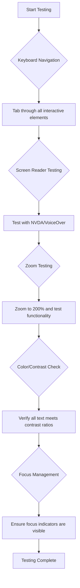
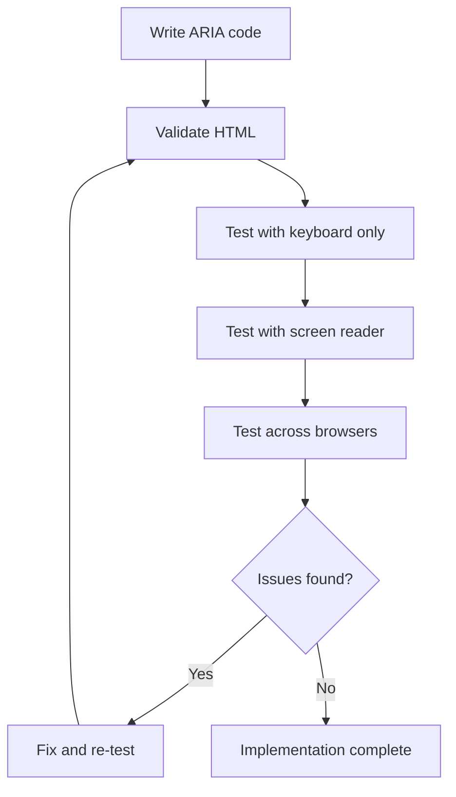

<!--
CO_OP_TRANSLATOR_METADATA:
{
  "original_hash": "90b19cde5b79b29e91babd3138cd8035",
  "translation_date": "2025-10-23T00:51:38+00:00",
  "source_file": "1-getting-started-lessons/3-accessibility/README.md",
  "language_code": "nl"
}
-->
# Toegankelijke webpagina's maken


> Sketchnote door [Tomomi Imura](https://twitter.com/girlie_mac)

## Quiz voorafgaand aan de les
[Quiz voorafgaand aan de les](https://ff-quizzes.netlify.app/web/)

> De kracht van het web zit in zijn universaliteit. Toegang voor iedereen, ongeacht een beperking, is een essentieel aspect.
>
> \- Sir Timothy Berners-Lee, W3C-directeur en uitvinder van het World Wide Web

Hier is iets dat je misschien zal verrassen: wanneer je toegankelijke websites bouwt, help je niet alleen mensen met een beperking—je maakt het web eigenlijk beter voor iedereen!

Heb je ooit die verlaagde stoepranden op straathoeken opgemerkt? Ze zijn oorspronkelijk ontworpen voor rolstoelen, maar nu helpen ze ook mensen met kinderwagens, bezorgers met karretjes, reizigers met rolkoffers en fietsers. Dat is precies hoe toegankelijke webdesign werkt—oplossingen die één groep helpen, blijken vaak iedereen te helpen. Best gaaf, toch?

In deze les gaan we onderzoeken hoe je websites kunt maken die echt voor iedereen werken, ongeacht hoe ze het web gebruiken. Je ontdekt praktische technieken die al in webstandaarden zijn ingebouwd, gaat aan de slag met testtools en ziet hoe toegankelijkheid je sites gebruiksvriendelijker maakt voor alle gebruikers.

Aan het einde van deze les heb je het vertrouwen om toegankelijkheid een natuurlijk onderdeel van je ontwikkelproces te maken. Klaar om te ontdekken hoe doordachte ontwerpkeuzes het web kunnen openen voor miljarden gebruikers? Laten we beginnen!

> Je kunt deze les volgen op [Microsoft Learn](https://docs.microsoft.com/learn/modules/web-development-101/accessibility/?WT.mc_id=academic-77807-sagibbon)!

## Begrip van hulpmiddelen voor toegankelijkheid

Voordat we gaan coderen, nemen we even de tijd om te begrijpen hoe mensen met verschillende mogelijkheden het web daadwerkelijk ervaren. Dit is niet alleen theorie—het begrijpen van deze navigatiepatronen in de echte wereld maakt je een veel betere ontwikkelaar!

Hulpmiddelen voor toegankelijkheid zijn geweldige technologieën die mensen met een beperking helpen om op verrassende manieren met websites te communiceren. Zodra je begrijpt hoe deze technologieën werken, wordt het creëren van toegankelijke webervaringen veel intuïtiever. Het is alsof je leert je code te zien door de ogen van iemand anders.

### Schermlezers

[Schermlezers](https://en.wikipedia.org/wiki/Screen_reader) zijn behoorlijk geavanceerde technologieën die digitale tekst omzetten in spraak of braille-uitvoer. Hoewel ze voornamelijk worden gebruikt door mensen met een visuele beperking, zijn ze ook erg nuttig voor gebruikers met leerstoornissen zoals dyslexie.

Ik zie een schermlezer graag als een slimme verteller die een boek voorleest. Het leest inhoud hardop voor in een logische volgorde, kondigt interactieve elementen aan zoals "knop" of "link" en biedt sneltoetsen om door een pagina te navigeren. Maar hier komt het: schermlezers kunnen alleen hun magie doen als we websites bouwen met een goede structuur en betekenisvolle inhoud. Dat is waar jij als ontwikkelaar in beeld komt!

**Populaire schermlezers op verschillende platforms:**
- **Windows**: [NVDA](https://www.nvaccess.org/about-nvda/) (gratis en het populairst), [JAWS](https://webaim.org/articles/jaws/), [Narrator](https://support.microsoft.com/windows/complete-guide-to-narrator-e4397a0d-ef4f-b386-d8ae-c172f109bdb1/?WT.mc_id=academic-77807-sagibbon) (ingebouwd)
- **macOS/iOS**: [VoiceOver](https://support.apple.com/guide/voiceover/welcome/10) (ingebouwd en zeer capabel)
- **Android**: [TalkBack](https://support.google.com/accessibility/android/answer/6283677) (ingebouwd)
- **Linux**: [Orca](https://wiki.gnome.org/Projects/Orca) (gratis en open-source)

**Hoe schermlezers webinhoud navigeren:**

Schermlezers bieden meerdere navigatiemethoden die het browsen efficiënt maken voor ervaren gebruikers:
- **Sequentieel lezen**: Leest inhoud van boven naar beneden, zoals een boek
- **Landmark-navigatie**: Spring tussen paginasecties (header, nav, main, footer)
- **Kopnavigatie**: Spring tussen koppen om de structuur van de pagina te begrijpen
- **Linklijsten**: Genereer een lijst van alle links voor snelle toegang
- **Formuliervelden**: Navigeer direct tussen invoervelden en knoppen

> 💡 **Hier is iets dat me verbaasde**: 68% van de schermlezergebruikers navigeert voornamelijk via koppen ([WebAIM Survey](https://webaim.org/projects/screenreadersurvey9/#finding)). Dit betekent dat je kopstructuur als een routekaart is voor gebruikers—als je het goed doet, help je mensen letterlijk sneller hun weg te vinden in je inhoud!

### Je testworkflow opbouwen

Goed nieuws—effectief testen op toegankelijkheid hoeft niet overweldigend te zijn! Je wilt geautomatiseerde tools combineren (ze zijn fantastisch in het opsporen van duidelijke problemen) met wat handmatig testen. Hier is een systematische aanpak die ik heb gevonden om de meeste problemen te identificeren zonder dat het je hele dag kost:

**Essentiële handmatige testworkflow:**



**Stapsgewijze testchecklist:**
1. **Toetsennavigatie**: Gebruik alleen Tab, Shift+Tab, Enter, Spatie en pijltjestoetsen
2. **Schermlezer testen**: Schakel NVDA, VoiceOver of Narrator in en navigeer met gesloten ogen
3. **Zoom testen**: Test op 200% en 400% zoomniveaus
4. **Kleurcontrast verificatie**: Controleer alle tekst en UI-componenten
5. **Focusindicator testen**: Zorg ervoor dat alle interactieve elementen zichtbare focusstatus hebben

✅ **Begin met Lighthouse**: Open de DevTools van je browser, voer een Lighthouse-toegankelijkheidsaudit uit en gebruik de resultaten om je handmatige testfocusgebieden te bepalen.

### Zoom- en vergrotingstools

Weet je hoe je soms inzoomt op je telefoon als de tekst te klein is, of je laptop scherm probeert te lezen in fel zonlicht? Veel gebruikers vertrouwen dagelijks op vergrotingstools om inhoud leesbaar te maken. Dit omvat mensen met een verminderd gezichtsvermogen, ouderen en iedereen die ooit heeft geprobeerd een website buiten te lezen.

Moderne zoomtechnologieën zijn verder geëvolueerd dan alleen dingen groter maken. Begrijpen hoe deze tools werken, helpt je om responsieve ontwerpen te maken die functioneel en aantrekkelijk blijven op elk vergrotingsniveau.

**Moderne browser zoommogelijkheden:**
- **Pagina-zoom**: Schaal alle inhoud proportioneel (tekst, afbeeldingen, lay-out) - dit is de voorkeursmethode
- **Alleen tekst-zoom**: Vergroot de lettergrootte terwijl de oorspronkelijke lay-out behouden blijft
- **Knijp-om-te-zoomen**: Ondersteuning voor mobiele gebaren voor tijdelijke vergroting
- **Browserondersteuning**: Alle moderne browsers ondersteunen zoom tot 500% zonder functionaliteit te breken

**Gespecialiseerde vergrotingssoftware:**
- **Windows**: [Vergrootglas](https://support.microsoft.com/windows/use-magnifier-to-make-things-on-the-screen-easier-to-see-414948ba-8b1c-d3bd-8615-0e5e32204198) (ingebouwd), [ZoomText](https://www.freedomscientific.com/training/zoomtext/getting-started/)
- **macOS/iOS**: [Zoom](https://www.apple.com/accessibility/mac/vision/) (ingebouwd met geavanceerde functies)

> ⚠️ **Ontwerpoverweging**: WCAG vereist dat inhoud functioneel blijft bij 200% zoom. Op dit niveau moet horizontaal scrollen minimaal zijn en moeten alle interactieve elementen toegankelijk blijven.

✅ **Test je responsieve ontwerp**: Zoom je browser in tot 200% en 400%. Past je lay-out zich soepel aan? Kun je nog steeds alle functionaliteit bereiken zonder overmatig te scrollen?

## Moderne toegankelijkheidstesttools

Nu je begrijpt hoe mensen met hulpmiddelen voor toegankelijkheid het web navigeren, laten we de tools verkennen die je helpen toegankelijke websites te bouwen en te testen.

Zie het zo: geautomatiseerde tools zijn geweldig in het opsporen van duidelijke problemen (zoals ontbrekende alt-tekst), terwijl handmatig testen je helpt ervoor te zorgen dat je site prettig aanvoelt in de echte wereld. Samen geven ze je het vertrouwen dat je sites voor iedereen werken.

### Kleurcontrast testen

Goed nieuws: kleurcontrast is een van de meest voorkomende toegankelijkheidsproblemen, maar het is ook een van de gemakkelijkste om op te lossen. Goed contrast is gunstig voor iedereen—van gebruikers met een visuele beperking tot mensen die hun telefoon proberen te lezen op het strand.

**WCAG contrastvereisten:**

| Teksttype | WCAG AA (Minimum) | WCAG AAA (Verbeterd) |
|-----------|-------------------|---------------------|
| **Normale tekst** (onder 18pt) | 4.5:1 contrastverhouding | 7:1 contrastverhouding |
| **Grote tekst** (18pt+ of 14pt+ vetgedrukt) | 3:1 contrastverhouding | 4.5:1 contrastverhouding |
| **UI-componenten** (knoppen, formulierkaders) | 3:1 contrastverhouding | 3:1 contrastverhouding |

**Essentiële testtools:**
- [Colour Contrast Analyser](https://www.tpgi.com/color-contrast-checker/) - Desktop-app met kleurkiezer
- [WebAIM Contrast Checker](https://webaim.org/resources/contrastchecker/) - Webgebaseerd met directe feedback
- [Stark](https://www.getstark.co/) - Ontwerptool plugin voor Figma, Sketch, Adobe XD
- [Accessible Colors](https://accessible-colors.com/) - Vind toegankelijke kleurenpaletten

✅ **Bouw betere kleurenpaletten**: Begin met je merk kleuren en gebruik contrastcheckers om toegankelijke variaties te creëren. Documenteer deze als toegankelijke kleurentokens in je ontwerp systeem.

### Uitgebreide toegankelijkheidsaudits

De meest effectieve toegankelijkheidstests combineren meerdere benaderingen. Geen enkele tool vangt alles, dus het opbouwen van een testroutine met verschillende methoden zorgt voor een grondige dekking.

**Browsergebaseerde tests (ingebouwd in DevTools):**
- **Chrome/Edge**: Lighthouse toegankelijkheidsaudit + Toegankelijkheidspaneel
- **Firefox**: Toegankelijkheidsinspecteur met gedetailleerde boomweergave
- **Safari**: Audit-tabblad in Web Inspector met VoiceOver-simulatie

**Professionele testextensies:**
- [axe DevTools](https://www.deque.com/axe/devtools/) - Industriestandaard geautomatiseerde tests
- [WAVE](https://wave.webaim.org/extension/) - Visuele feedback met foutmarkering
- [Accessibility Insights](https://accessibilityinsights.io/) - Microsoft's uitgebreide testpakket

**Command-line en CI/CD-integratie:**
- [axe-core](https://github.com/dequelabs/axe-core) - JavaScript-bibliotheek voor geautomatiseerde tests
- [Pa11y](https://pa11y.org/) - Command-line toegankelijkheidstesttool
- [Lighthouse CI](https://github.com/GoogleChrome/lighthouse-ci) - Geautomatiseerde toegankelijkheidsscores

> 🎯 **Testdoel**: Streef naar een Lighthouse toegankelijkheidsscore van 95+ als basis. Onthoud dat geautomatiseerde tools slechts ongeveer 30-40% van de toegankelijkheidsproblemen detecteren—handmatig testen blijft essentieel!

## Toegankelijkheid vanaf de basis opbouwen

De sleutel tot succes in toegankelijkheid is om het vanaf dag één in je basis op te nemen. Ik weet dat het verleidelijk is om te denken "Ik voeg toegankelijkheid later toe," maar dat is alsof je probeert een oprit aan een huis toe te voegen nadat het al is gebouwd. Mogelijk? Ja. Makkelijk? Niet echt.

Denk aan toegankelijkheid als het plannen van een huis—het is veel eenvoudiger om rolstoeltoegankelijkheid in je oorspronkelijke architectonische plannen op te nemen dan om alles later aan te passen.

### De POUR-principes: De basis van toegankelijkheid

De Web Content Accessibility Guidelines (WCAG) zijn opgebouwd rond vier fundamentele principes die samen het acroniem POUR vormen. Maak je geen zorgen—dit zijn geen saaie academische concepten! Het zijn eigenlijk praktische richtlijnen om inhoud te maken die voor iedereen werkt.

Zodra je de POUR-principes begrijpt, wordt het maken van toegankelijkheidsbeslissingen veel intuïtiever. Het is alsof je een mentale checklist hebt die je ontwerpkeuzes begeleidt. Laten we het opsplitsen:

**🔍 Waarneembaar**: Informatie moet op een manier worden gepresenteerd die gebruikers kunnen waarnemen via hun beschikbare zintuigen

- Bied tekstalternatieven voor niet-tekstuele inhoud (afbeeldingen, video's, audio)
- Zorg voor voldoende kleurcontrast voor alle tekst en UI-componenten
- Bied ondertiteling en transcripties voor multimedia-inhoud
- Ontwerp inhoud die functioneel blijft bij een vergroting tot 200%
- Gebruik meerdere zintuiglijke kenmerken (niet alleen kleur) om informatie over te brengen

**🎮 Bedienbaar**: Alle interfacecomponenten moeten bedienbaar zijn via beschikbare invoermethoden

- Maak alle functionaliteit toegankelijk via toetsenbordnavigatie
- Geef gebruikers voldoende tijd om inhoud te lezen en ermee te interactie te gaan
- Vermijd inhoud die aanvallen of vestibulaire stoornissen veroorzaakt
- Help gebruikers efficiënt te navigeren met duidelijke structuur en herkenningspunten
- Zorg ervoor dat interactieve elementen voldoende doelgrootte hebben (minimaal 44px)

**📖 Begrijpelijk**: Informatie en bediening van de gebruikersinterface moeten duidelijk en begrijpelijk zijn

- Gebruik duidelijke, eenvoudige taal die geschikt is voor je doelgroep
- Zorg ervoor dat inhoud op voorspelbare en consistente manieren verschijnt en werkt
- Bied duidelijke instructies en foutmeldingen voor gebruikersinvoer
- Help gebruikers fouten in formulieren te begrijpen en te corrigeren
- Organiseer inhoud met een logische leesvolgorde en informatieve hiërarchie

**💪 Robuust**: Inhoud moet betrouwbaar werken op verschillende technologieën en hulpmiddelen

- Gebruik geldige, semantische HTML als basis
- Zorg voor compatibiliteit met huidige en toekomstige hulpmiddelen
- Volg webstandaarden en best practices voor opmaak
- Test op verschillende browsers, apparaten en hulpmiddelen
- Structureer inhoud zodat deze goed functioneert, zelfs als geavanceerde functies niet worden ondersteund

## Toegankelijke visuele ontwerpen maken

Goed visueel ontwerp en toegankelijkheid gaan hand in hand. Wanneer je ontwerpt met toegankelijkheid in gedachten, ontdek je vaak dat deze beperkingen leiden tot schonere, elegantere oplossingen die alle gebruikers ten goede komen.

Laten we onderzoeken hoe je visueel aantrekkelijke ontwerpen kunt maken die werken voor iedereen, ongeacht hun visuele mogelijkheden of de omstandigheden waarin ze je inhoud bekijken.

### Kleur- en visuele toegankelijkheidsstrategieën
Kleur is een krachtig communicatiemiddel, maar het mag nooit de enige manier zijn om belangrijke informatie over te brengen. Ontwerpen voorbij kleur zorgt voor robuustere, inclusieve ervaringen die in meer situaties werken.

**Ontwerp voor verschillen in kleurenzicht:**

Ongeveer 8% van de mannen en 0,5% van de vrouwen heeft een vorm van kleurenzichtverschil (vaak "kleurenblindheid" genoemd). De meest voorkomende typen zijn:
- **Deuteranopie**: Moeite met het onderscheiden van rood en groen
- **Protanopie**: Rood lijkt minder helder
- **Tritanopie**: Moeite met blauw en geel (zeldzaam)

**Inclusieve kleurstrategieën:**

```css
/* ❌ Bad: Using only color to indicate status */
.error { color: red; }
.success { color: green; }

/* ✅ Good: Color plus icons and context */
.error {
  color: #d32f2f;
  border-left: 4px solid #d32f2f;
}
.error::before {
  content: "⚠️";
  margin-right: 8px;
}

.success {
  color: #2e7d32;
  border-left: 4px solid #2e7d32;
}
.success::before {
  content: "✅";
  margin-right: 8px;
}
```

**Verder dan basisvereisten voor contrast:**
- Test je kleurkeuzes met simulators voor kleurenblindheid
- Gebruik patronen, texturen of vormen naast kleurcodering
- Zorg ervoor dat interactieve staten herkenbaar blijven zonder kleur
- Overweeg hoe je ontwerp eruitziet in modus voor hoog contrast

✅ **Test de toegankelijkheid van je kleuren**: Gebruik tools zoals [Coblis](https://www.color-blindness.com/coblis-color-blindness-simulator/) om te zien hoe je site eruitziet voor gebruikers met verschillende soorten kleurenzicht.

### Focusindicatoren en interactieontwerp

Focusindicatoren zijn het digitale equivalent van een cursor—ze laten toetsenbordgebruikers zien waar ze zich op de pagina bevinden. Goed ontworpen focusindicatoren verbeteren de ervaring voor iedereen door interacties duidelijk en voorspelbaar te maken.

**Moderne best practices voor focusindicatoren:**

```css
/* Enhanced focus styles that work across browsers */
button:focus-visible {
  outline: 2px solid #0066cc;
  outline-offset: 2px;
  box-shadow: 0 0 0 4px rgba(0, 102, 204, 0.25);
}

/* Remove focus outline for mouse users, preserve for keyboard users */
button:focus:not(:focus-visible) {
  outline: none;
}

/* Focus-within for complex components */
.card:focus-within {
  box-shadow: 0 0 0 3px rgba(74, 144, 164, 0.5);
  border-color: #4A90A4;
}

/* Ensure focus indicators meet contrast requirements */
.custom-focus:focus-visible {
  outline: 3px solid #ffffff;
  outline-offset: 2px;
  box-shadow: 0 0 0 6px #000000;
}
```

**Vereisten voor focusindicatoren:**
- **Zichtbaarheid**: Moet een contrastverhouding van minimaal 3:1 hebben met omliggende elementen
- **Breedte**: Minimaal 2px dikte rondom het hele element
- **Blijvend zichtbaar**: Moet zichtbaar blijven totdat de focus elders naartoe gaat
- **Onderscheidend**: Moet visueel verschillen van andere UI-staten

> 💡 **Ontwerptip**: Goede focusindicatoren gebruiken vaak een combinatie van outline, box-shadow en kleurveranderingen om zichtbaarheid te garanderen op verschillende achtergronden en in verschillende contexten.

✅ **Controleer focusindicatoren**: Navigeer met de Tab-toets door je website en noteer welke elementen duidelijke focusindicatoren hebben. Zijn er elementen die moeilijk te zien zijn of helemaal ontbreken?

### Semantische HTML: De basis van toegankelijkheid

Semantische HTML is als het geven van een GPS-systeem aan hulpmiddelen voor toegankelijkheid op je website. Door de juiste HTML-elementen te gebruiken voor hun beoogde doel, geef je schermlezers, toetsenborden en andere tools een gedetailleerde routekaart om gebruikers effectief te helpen navigeren.

Hier is een analogie die echt bij mij is blijven hangen: semantische HTML is het verschil tussen een goed georganiseerde bibliotheek met duidelijke categorieën en behulpzame bordjes versus een magazijn waar boeken willekeurig verspreid liggen. Beide plekken hebben dezelfde boeken, maar waar zou jij liever iets proberen te vinden? Precies!

**Bouwstenen van een toegankelijke paginavormgeving:**

```html
<!-- Landmark elements provide page navigation structure -->
<header>
  <h1>Your Site Name</h1>
  <nav aria-label="Main navigation">
    <ul>
      <li><a href="/home">Home</a></li>
      <li><a href="/about">About</a></li>
      <li><a href="/services">Services</a></li>
    </ul>
  </nav>
</header>

<main>
  <article>
    <header>
      <h1>Article Title</h1>
      <p>Published on <time datetime="2024-10-14">October 14, 2024</time></p>
    </header>
    
    <section>
      <h2>First Section</h2>
      <p>Content that relates to this section...</p>
    </section>
    
    <section>
      <h2>Second Section</h2>
      <p>More related content...</p>
    </section>
  </article>
  
  <aside>
    <h2>Related Links</h2>
    <nav aria-label="Related articles">
      <ul>
        <li><a href="/related-1">First related article</a></li>
        <li><a href="/related-2">Second related article</a></li>
      </ul>
    </nav>
  </aside>
</main>

<footer>
  <p>&copy; 2024 Your Site Name. All rights reserved.</p>
  <nav aria-label="Footer links">
    <ul>
      <li><a href="/privacy">Privacy Policy</a></li>
      <li><a href="/contact">Contact Us</a></li>
    </ul>
  </nav>
</footer>
```

**Waarom semantische HTML toegankelijkheid transformeert:**

| Semantisch element | Doel | Voordeel voor schermlezers |
|--------------------|------|---------------------------|
| `<header>` | Koptekst van pagina of sectie | "Banner landmark" - snelle navigatie naar boven |
| `<nav>` | Navigatielinks | "Navigatie landmark" - lijst van navigatiesecties |
| `<main>` | Primaire inhoud van de pagina | "Hoofd landmark" - direct naar inhoud springen |
| `<article>` | Zelfstandige inhoud | Geeft grenzen van artikel aan |
| `<section>` | Thematische inhoudsgroepen | Biedt inhoudsstructuur |
| `<aside>` | Gerelateerde zijbalkinhoud | "Aanvullende landmark" |
| `<footer>` | Voettekst van pagina of sectie | "Contentinfo landmark" |

**Superkrachten van schermlezers met semantische HTML:**
- **Landmarknavigatie**: Spring direct tussen belangrijke paginasecties
- **Koptekstoverzichten**: Genereer een inhoudsopgave op basis van je koptekststructuur
- **Elementenlijsten**: Maak lijsten van alle links, knoppen of formulierbesturingselementen
- **Contextbewustzijn**: Begrijp relaties tussen inhoudssecties

> 🎯 **Snelle test**: Probeer je site te navigeren met een schermlezer door gebruik te maken van landmark-sneltoetsen (D voor landmark, H voor koptekst, K voor link in NVDA/JAWS). Maakt de navigatie logisch?

✅ **Controleer je semantische structuur**: Gebruik het toegankelijkheidspaneel in de ontwikkelaarstools van je browser om de toegankelijkheidsboom te bekijken en ervoor te zorgen dat je markup een logische structuur creëert.

### Kopteksthiërarchie: Een logische inhoudsopbouw creëren

Kopteksten zijn absoluut cruciaal voor toegankelijke inhoud—ze zijn als de ruggengraat die alles bij elkaar houdt. Schermlezergebruikers vertrouwen sterk op kopteksten om je inhoud te begrijpen en te navigeren. Zie het als het bieden van een inhoudsopgave voor je pagina.

**Hier is de gouden regel voor kopteksten:**
Sla nooit niveaus over. Ga altijd logisch vooruit van `<h1>` naar `<h2>` naar `<h3>`, enzovoort. Denk aan het maken van schema's op school. Het is precies hetzelfde principe—je zou niet van "I. Hoofdonderwerp" direct naar "C. Sub-subonderwerp" springen zonder een "A. Subonderwerp" ertussen, toch?

**Perfect voorbeeld van koptekststructuur:**

```html
<!-- ✅ Excellent: Logical, hierarchical progression -->
<main>
  <h1>Complete Guide to Web Accessibility</h1>
  
  <section>
    <h2>Understanding Screen Readers</h2>
    <p>Introduction to screen reader technology...</p>
    
    <h3>Popular Screen Reader Software</h3>
    <p>NVDA, JAWS, and VoiceOver comparison...</p>
    
    <h3>Testing with Screen Readers</h3>
    <p>Step-by-step testing instructions...</p>
  </section>
  
  <section>
    <h2>Color and Contrast Guidelines</h2>
    <p>Designing with sufficient contrast...</p>
    
    <h3>WCAG Contrast Requirements</h3>
    <p>Understanding the different contrast levels...</p>
    
    <h3>Testing Tools and Techniques</h3>
    <p>Tools for verifying contrast ratios...</p>
  </section>
</main>
```

```html
<!-- ❌ Problematic: Skipping levels, inconsistent structure -->
<h1>Page Title</h1>
<h3>Subsection</h3> <!-- Skipped h2 -->
<h2>This should come before h3</h2>
<h1>Another main heading?</h1> <!-- Multiple h1s -->
```

**Best practices voor kopteksten:**
- **Eén `<h1>` per pagina**: Meestal je hoofdtitel of primaire inhoudskop
- **Logische voortgang**: Sla nooit niveaus over (h1 → h2 → h3, niet h1 → h3)
- **Beschrijvende inhoud**: Maak kopteksten betekenisvol wanneer ze uit de context worden gelezen
- **Visuele styling met CSS**: Gebruik CSS voor uiterlijk, HTML-niveaus voor structuur

**Navigatiestatistieken voor schermlezers:**
- 68% van de schermlezergebruikers navigeert via kopteksten ([WebAIM Survey](https://webaim.org/projects/screenreadersurvey9/#finding))
- Gebruikers verwachten een logische koptekstopbouw
- Kopteksten bieden de snelste manier om de structuur van een pagina te begrijpen

> 💡 **Pro Tip**: Gebruik browserextensies zoals "HeadingsMap" om je koptekststructuur te visualiseren. Het zou moeten lezen als een goed georganiseerde inhoudsopgave.

✅ **Test je koptekststructuur**: Gebruik de koptekstnavigatie van een schermlezer (H-toets in NVDA) om door je kopteksten te springen. Vertelt de voortgang logisch het verhaal van je inhoud?

### Geavanceerde visuele toegankelijkheidstechnieken

Naast de basisprincipes van contrast en kleur zijn er geavanceerde technieken die helpen om echt inclusieve visuele ervaringen te creëren. Deze methoden zorgen ervoor dat je inhoud werkt in verschillende kijkomstandigheden en met hulpmiddelen voor toegankelijkheid.

**Essentiële strategieën voor visuele communicatie:**

- **Multimodale feedback**: Combineer visuele, tekstuele en soms audiocues
- **Progressieve onthulling**: Presenteer informatie in behapbare stukken
- **Consistente interactiepatronen**: Gebruik vertrouwde UI-conventies
- **Responsieve typografie**: Schaal tekst passend voor verschillende apparaten
- **Laad- en foutstatussen**: Geef duidelijke feedback voor alle gebruikersacties

**CSS-hulpmiddelen voor verbeterde toegankelijkheid:**

```css
/* Screen reader only text - visually hidden but accessible */
.sr-only {
  position: absolute;
  width: 1px;
  height: 1px;
  padding: 0;
  margin: -1px;
  overflow: hidden;
  clip: rect(0, 0, 0, 0);
  white-space: nowrap;
  border: 0;
}

/* Skip link for keyboard navigation */
.skip-link {
  position: absolute;
  top: -40px;
  left: 6px;
  background: #000000;
  color: #ffffff;
  padding: 8px 16px;
  text-decoration: none;
  border-radius: 4px;
  font-weight: bold;
  transition: top 0.3s ease;
  z-index: 1000;
}

.skip-link:focus {
  top: 6px;
}

/* Reduced motion respect */
@media (prefers-reduced-motion: reduce) {
  .skip-link {
    transition: none;
  }
  
  * {
    animation-duration: 0.01ms !important;
    animation-iteration-count: 1 !important;
    transition-duration: 0.01ms !important;
  }
}

/* High contrast mode support */
@media (prefers-contrast: high) {
  .button {
    border: 2px solid;
  }
}
```

> 🎯 **Toegankelijkheidspatroon**: De "skip link" is essentieel voor toetsenbordgebruikers. Het moet het eerste focusbare element op je pagina zijn en direct naar het hoofdinhoudsgebied springen.

✅ **Implementeer skipnavigatie**: Voeg skiplinks toe aan je pagina's en test ze door op Tab te drukken zodra de pagina laadt. Ze moeten verschijnen en je in staat stellen om naar de hoofdinhoud te springen.

## Betekenisvolle linktekst maken

Links zijn in feite de snelwegen van het web, maar slecht geschreven linktekst is als verkeersborden die alleen "Plaats" zeggen in plaats van "Centrum Chicago". Niet erg behulpzaam, toch?

Hier is iets dat me echt verbaasde toen ik het voor het eerst leerde: schermlezers kunnen alle links van een pagina extraheren en ze weergeven als één grote lijst. Stel je voor dat iemand je een directory geeft van elke link op je pagina. Zou elke link op zichzelf logisch zijn? Dat is de test die je linktekst moet doorstaan!

### Begrip van linknavigatiepatronen

Schermlezers bieden krachtige linknavigatiefuncties die afhankelijk zijn van goed geschreven linktekst:

**Linknavigatiemethoden:**
- **Sequentieel lezen**: Links worden in context gelezen als onderdeel van de inhoudsstroom
- **Linklijstgeneratie**: Alle paginalinks verzameld in een doorzoekbare directory
- **Snelle navigatie**: Spring tussen links met behulp van sneltoetsen (K in NVDA)
- **Zoekfunctionaliteit**: Vind specifieke links door gedeeltelijke tekst in te voeren

**Waarom context belangrijk is:**
Wanneer schermlezergebruikers een linklijst genereren, zien ze iets als dit:
- "Download rapport"
- "Meer informatie"
- "Klik hier"
- "Privacybeleid"
- "Klik hier"

Slechts twee van deze links bieden nuttige informatie wanneer ze uit de context worden gelezen!

> 📊 **Impact op gebruikers**: Schermlezergebruikers scannen linklijsten om snel inzicht te krijgen in de inhoud van een pagina. Generieke linktekst dwingt hen om terug te navigeren naar de context van elke link, wat hun browse-ervaring aanzienlijk vertraagt.

### Veelvoorkomende fouten in linktekst om te vermijden

Begrijpen wat niet werkt, helpt je om toegankelijkheidsproblemen in bestaande inhoud te herkennen en op te lossen.

**❌ Generieke linktekst die geen context biedt:**

```html
<!-- Meaningless when read from a link list -->
<p>Our sustainability efforts are detailed in our recent report. 
   <a href="/sustainability-2024.pdf">Click here</a> to view it.</p>

<!-- Repeated generic text throughout the page -->
<div class="article-card">
  <h3>Web Accessibility Guide</h3>
  <p>Learn the fundamentals...</p>
  <a href="/accessibility-guide">Read more</a>
</div>
<div class="article-card">
  <h3>Color Contrast Tips</h3>
  <p>Improve your design...</p>
  <a href="/color-contrast">Read more</a>
</div>

<!-- URLs as link text (difficult for screen readers to announce) -->
<p>Visit https://www.w3.org/WAI/WCAG21/quickref/ for WCAG guidelines.</p>

<!-- Vague action words -->
<a href="/contact">Go</a> | <a href="/about">See</a> | <a href="/help">View</a>
```

**Waarom deze patronen falen:**
- **"Klik hier"** vertelt gebruikers niets over de bestemming
- **"Lees meer"** herhaaldelijk gebruiken zorgt voor verwarring
- **Ruwe URL's** zijn moeilijk voor schermlezers om duidelijk uit te spreken
- **Enkele woorden** zoals "Ga" of "Zie" missen beschrijvende context

### Uitstekende linktekst schrijven

Beschrijvende linktekst is nuttig voor iedereen—gebruikers die kunnen zien, kunnen links snel scannen, en schermlezergebruikers begrijpen direct de bestemmingen.

**✅ Voorbeelden van duidelijke, beschrijvende linktekst:**

```html
<!-- Descriptive text that explains the destination -->
<p>Our comprehensive <a href="/sustainability-2024.pdf">2024 sustainability report (PDF, 2.1MB)</a> details our environmental initiatives.</p>

<!-- Specific, unique link text for each card -->
<div class="article-card">
  <h3>Web Accessibility Guide</h3>
  <p>Learn the fundamentals of inclusive design...</p>
  <a href="/accessibility-guide">Read our complete web accessibility guide</a>
</div>
<div class="article-card">
  <h3>Color Contrast Tips</h3>
  <p>Improve your design with better color choices...</p>
  <a href="/color-contrast">Explore color contrast best practices</a>
</div>

<!-- Meaningful text instead of raw URLs -->
<p>The <a href="https://www.w3.org/WAI/WCAG21/quickref/">WCAG 2.1 Quick Reference guide</a> provides comprehensive accessibility guidelines.</p>

<!-- Descriptive action links -->
<a href="/contact">Contact our support team</a> | 
<a href="/about">About our company</a> | 
<a href="/help">Get help with your account</a>
```

**Best practices voor linktekst:**
- **Wees specifiek**: "Download het kwartaalverslag" vs. "Download"
- **Vermeld bestandstype en grootte**: "(PDF, 1,2MB)" voor downloadbare bestanden
- **Geef aan of links extern openen**: "(opent in nieuw venster)" indien van toepassing
- **Gebruik actieve taal**: "Neem contact met ons op" vs. "Contactpagina"
- **Houd het beknopt**: Streef naar 2-8 woorden indien mogelijk

### Geavanceerde toegankelijkheidspatronen voor links

Soms vereisen visuele ontwerpbeperkingen of technische vereisten speciale oplossingen. Hier zijn geavanceerde technieken voor veelvoorkomende uitdagende scenario's:

**Gebruik van ARIA voor verbeterde context:**

```html
<!-- When button text must be short but needs more context -->
<a href="/report.pdf" 
   aria-label="Download 2024 annual financial report, PDF format, 2.3MB">
  Download Report
</a>

<!-- When the full context comes from surrounding content -->
<h3 id="sustainability-heading">Sustainability Initiative</h3>
<p>Our efforts to reduce environmental impact...</p>
<a href="/sustainability-details" 
   aria-labelledby="sustainability-heading"
   aria-describedby="sustainability-summary">
  Learn more
</a>
<p id="sustainability-summary">Detailed breakdown of our 2024 environmental goals and achievements</p>
```

**Bestandsformaten en externe bestemmingen aangeven:**

```html
<!-- Method 1: Include information in visible link text -->
<a href="/annual-report.pdf">
  Download our 2024 annual report (PDF, 2.3MB)
</a>

<!-- Method 2: Use screen reader-only text for file details -->
<a href="/annual-report.pdf">
  Download our 2024 annual report
  <span class="sr-only">(PDF format, 2.3MB)</span>
</a>

<!-- Method 3: External link indication -->
<a href="https://example.com" 
   target="_blank" 
   aria-describedby="external-link-warning">
  Visit external resource
</a>
<span id="external-link-warning" class="sr-only">
  (opens in new window)
</span>

<!-- Method 4: Using CSS for visual indicators -->
<a href="https://example.com" class="external-link">
  External resource
</a>
```

```css
/* Visual indicator for external links */
.external-link::after {
  content: " ↗";
  font-size: 0.8em;
  color: #666;
}

/* Screen reader announcement for external links */
.external-link::before {
  content: "External link: ";
  position: absolute;
  left: -10000px;
  width: 1px;
  height: 1px;
  overflow: hidden;
}
```

> ⚠️ **Belangrijk**: Bij gebruik van `target="_blank"` moet je gebruikers altijd informeren dat de link in een nieuw venster of tabblad opent. Onverwachte navigatiewijzigingen kunnen desoriënterend zijn.

✅ **Test de context van je links**: Gebruik de ontwikkelaarstools van je browser om een lijst van alle links op je pagina te genereren. Kun je het doel van elke link begrijpen zonder enige omringende context?

## ARIA: HTML-toegankelijkheid naar een hoger niveau tillen

[Accessible Rich Internet Applications (ARIA)](https://developer.mozilla.org/docs/Web/Accessibility/ARIA) is als een universele vertaler tussen je complexe webapplicaties en hulpmiddelen voor toegankelijkheid. Wanneer HTML alleen niet alles kan uitdrukken wat je interactieve componenten doen, komt ARIA in beeld om die hiaten op te vullen.

Ik zie ARIA graag als het toevoegen van nuttige annotaties aan je HTML—een beetje zoals regieaanwijzingen in een toneelscript die acteurs helpen hun rollen en relaties te begrijpen.

**Hier is de belangrijkste regel over ARIA**: Gebruik altijd eerst semantische HTML en voeg vervolgens ARIA toe om het te verbeteren. Zie ARIA als een kruid, niet als het hoofdgerecht. Het moet je HTML-structuur verduidelijken en verbeteren, nooit vervangen. Zorg eerst dat die basis goed is!

### Strategische implementatie van ARIA

ARIA is krachtig, maar met macht komt verantwoordelijkheid. Onjuiste ARIA kan toegankelijkheid erger maken dan helemaal geen ARIA. Hier is wanneer en hoe je het effectief kunt gebruiken:

**✅ Gebruik ARIA wanneer:**
- Het maken van aangepaste interactieve widgets (accordeons, tabbladen, carrousels)
- Het bouwen van dynamische inhoud die verandert zonder pagina te herladen
- Het bieden van extra context voor complexe UI-relaties
- Het aangeven van laadstatussen of live inhoudsupdates
- Het creëren van app-achtige interfaces met aangepaste besturingselementen

**❌ Vermijd ARIA wanneer:**
- Standaard HTML-elementen al de benodigde semantiek bieden
- Je niet zeker weet hoe je het correct implementeert
- Het informatie dupliceert die al door semantische HTML wordt geboden
- Je het niet hebt getest met echte hulpmiddelen voor toegankelijkheid

> 🎯 **ARIA Gouden Regel**: "Verander semantiek alleen als het absoluut noodzakelijk is, zorg altijd voor toetsenbordtoegankelijkheid en test met echte hulpmiddelen voor toegankelijkheid."

**De vijf categorieën van ARIA:**

1. **Rollen**: Wat is dit element? (`button`, `tab`, `dialog`)
2. **Eigenschappen**: Wat zijn de kenmerken? (`aria-required`, `aria-haspopup`)
3. **Staten**: Wat is de huidige status? (`aria-expanded`, `aria-checked`)
4. **Landmarks**: Waar bevindt het zich in de paginavormgeving? (`banner`, `navigation`, `main`)
5. **Live-regio's**: Hoe moeten wijzigingen worden aangekondigd? (`aria-live`, `aria-atomic`)

### Essentiële ARIA-patronen voor moderne webapps

Deze patronen lossen de meest voorkomende toegankelijkheidsuitdagingen op in interactieve webapplicaties:

**Elementen benoemen en beschrijven:**

```html
<!-- aria-label: Provides accessible name when visible text isn't sufficient -->
<button aria-label="Close newsletter subscription dialog">×</button>

<!-- aria-labelledby: References existing text as the accessible name -->
<section aria-labelledby="news-heading">
  <h2 id="news-heading">Latest News</h2>
  <!-- news content -->
</section>

<!-- aria-describedby: Links to additional descriptive text -->
<input type="password" 
       aria-describedby="pwd-requirements pwd-strength"
       required>
<div id="pwd-requirements">
  Password must contain at least 8 characters, including uppercase, lowercase, and numbers.
</div>
<div id="pwd-strength" aria-live="polite">
  <!-- Dynamic password strength indicator -->
</div>
```

**Live-regio's voor dynamische inhoud:**

```html
<!-- Polite announcements (don't interrupt current speech) -->
<div aria-live="polite" id="status-updates">
  <!-- Status messages appear here -->
</div>

<!-- Assertive announcements (interrupt and announce immediately) -->
<div aria-live="assertive" id="urgent-alerts">
  <!-- Error messages and critical alerts -->
</div>

<!-- Loading states with live regions -->
<button id="submit-btn" aria-describedby="loading-status">
  Submit Application
</button>
<div id="loading-status" aria-live="polite" aria-atomic="true">
  <!-- "Processing your application..." appears here -->
</div>
```

**Interactieve widgetvoorbeeld (accordeon):**

```html
<div class="accordion">
  <h3>
    <button aria-expanded="false" 
            aria-controls="panel-1" 
            id="accordion-trigger-1"
            class="accordion-trigger">
      Accessibility Guidelines
    </button>
  </h3>
  <div id="panel-1" 
       role="region"
       aria-labelledby="accordion-trigger-1" 
       hidden>
    <p>WCAG 2.1 provides comprehensive guidelines...</p>
  </div>
</div>
```

```javascript
// JavaScript to manage accordion state
function toggleAccordion(trigger) {
  const panel = document.getElementById(trigger.getAttribute('aria-controls'));
  const isExpanded = trigger.getAttribute('aria-expanded') === 'true';
  
  // Toggle states
  trigger.setAttribute('aria-expanded', !isExpanded);
  panel.hidden = isExpanded;
  
  // Announce change to screen readers
  const status = document.getElementById('status-updates');
  status.textContent = isExpanded ? 'Section collapsed' : 'Section expanded';
}
```

### Best practices voor ARIA-implementatie

ARIA is krachtig maar vereist zorgvuldige implementatie. Het volgen van deze richtlijnen helpt ervoor te zorgen dat je ARIA toegankelijkheid verbetert in plaats van belemmert:

**🛡️ Kernprincipes:**

1. **Eerst semantische HTML**: Geef altijd de voorkeur aan `<button>` boven `<div role="button">`
2. **Breek semantiek niet**: Overschrijf nooit bestaande HTML-betekenis (vermijd `<h1 role="button">`)
3. **Behoud toetsenbordtoegankelijkheid**: Alle interactieve ARIA-elementen moeten volledig toetsenbordtoegankelijk zijn
4. **Test met echte gebruikers**: ARIA-ondersteuning varieert aanzienlijk tussen hulpmiddelen voor toegankelijkheid
5. **Begin eenvoudig**: Complexe ARIA-implementaties hebben meer kans op fouten

**🔍 Testworkflow:**



**🚫 Veelvoorkomende ARIA-fouten om te vermijden:**

- **Tegenstrijdige informatie**: HTML-semantiek niet tegenspreken
- **Over-labeling**: Te veel ARIA-informatie kan gebruikers overweldigen
- **Statische ARIA**: Vergeten ARIA-statussen bij te werken wanneer inhoud verandert
- **Ongeteste implementaties**: ARIA die theoretisch werkt, maar in de praktijk faalt
- **Ontbrekende toetsenbordondersteuning**: ARIA-rollen zonder bijbehorende toetsenbordinteracties

> 💡 **Testbronnen**: Gebruik tools zoals [accessibility-checker](https://www.npmjs.com/package/accessibility-checker) voor geautomatiseerde ARIA-validatie, maar test altijd met echte schermlezers voor een volledige ervaring.

✅ **Leer van experts**: Bestudeer de [ARIA Authoring Practices Guide](https://w3c.github.io/aria-practices/) voor beproefde patronen en implementaties van complexe interactieve widgets.

## Afbeeldingen en media toegankelijk maken

Visuele en audio-inhoud zijn essentiële onderdelen van moderne webervaringen, maar ze kunnen barrières creëren als ze niet doordacht worden geïmplementeerd. Het doel is ervoor te zorgen dat de informatie en emotionele impact van je media iedereen bereiken. Zodra je het onder de knie hebt, wordt het een tweede natuur.

Verschillende soorten media vereisen verschillende toegankelijkheidsbenaderingen. Het is net als koken—je behandelt een delicate vis niet op dezelfde manier als een stevige biefstuk. Door deze verschillen te begrijpen, kun je de juiste oplossing kiezen voor elke situatie.

### Strategische toegankelijkheid van afbeeldingen

Elke afbeelding op je website heeft een doel. Door dat doel te begrijpen, kun je betere alternatieve tekst schrijven en meer inclusieve ervaringen creëren.

**De vier soorten afbeeldingen en hun strategieën voor alt-tekst:**

**Informatieve afbeeldingen** - geven belangrijke informatie weer:
```html

```

**Decoratieve afbeeldingen** - puur visueel zonder informatieve waarde:
```html

```

**Functionele afbeeldingen** - dienen als knoppen of bedieningsonderdelen:
```html
<button>
  
</button>
```

**Complexe afbeeldingen** - grafieken, diagrammen, infographics:
```html

<div id="chart-description">
  <p>Detailed description: Sales data shows a steady increase across all quarters...</p>
</div>
```

### Video- en audio-toegankelijkheid

**Vereisten voor video:**
- **Ondertiteling**: Tekstversie van gesproken inhoud en geluidseffecten
- **Audiobeschrijvingen**: Vertelling van visuele elementen voor blinde gebruikers
- **Transcripties**: Volledige tekstversie van alle audio- en visuele inhoud

```html
<video controls>
  <source src="video.mp4" type="video/mp4">
  <track kind="captions" src="captions.vtt" srclang="en" label="English">
  <track kind="descriptions" src="descriptions.vtt" srclang="en" label="Audio descriptions">
</video>
```

**Vereisten voor audio:**
- **Transcripties**: Tekstversie van alle gesproken inhoud
- **Visuele indicatoren**: Voor alleen-audio-inhoud, zorg voor visuele aanwijzingen

### Moderne technieken voor afbeeldingen

**CSS gebruiken voor decoratieve afbeeldingen:**
```css
.hero-section {
  background-image: url('decorative-hero.jpg');
  /* Decorative images in CSS don't need alt text */
}
```

**Responsieve afbeeldingen met toegankelijkheid:**
```html
<picture>
  <source media="(min-width: 800px)" srcset="large-chart.png">
  <source media="(min-width: 400px)" srcset="medium-chart.png">
  
</picture>
```

✅ **Test toegankelijkheid van afbeeldingen**: Gebruik een schermlezer om een pagina met afbeeldingen te navigeren. Krijg je voldoende informatie om de inhoud te begrijpen?

## Toetsenbordnavigatie en focusbeheer

Veel gebruikers navigeren volledig met hun toetsenbord. Dit geldt voor mensen met motorische beperkingen, ervaren gebruikers die toetsenborden sneller vinden dan muizen, en iedereen wiens muis niet meer werkt. Zorgen dat je site goed werkt met toetsenbordinvoer is essentieel en maakt je site vaak efficiënter voor iedereen.

### Essentiële toetsenbordnavigatiepatronen

**Standaard toetsenbordinteracties:**
- **Tab**: Verplaats de focus naar voren door interactieve elementen
- **Shift + Tab**: Verplaats de focus naar achteren
- **Enter**: Activeer knoppen en links
- **Spatie**: Activeer knoppen, vink selectievakjes aan
- **Pijltjestoetsen**: Navigeer binnen componentgroepen (keuzerondjes, menu's)
- **Escape**: Sluit modals, dropdowns of annuleer acties

### Beste praktijken voor focusbeheer

**Zichtbare focusindicatoren:**
```css
/* Ensure focus is always visible */
button:focus-visible {
  outline: 2px solid #4A90A4;
  outline-offset: 2px;
}

/* Custom focus styles for different components */
.card:focus-within {
  box-shadow: 0 0 0 3px rgba(74, 144, 164, 0.5);
}
```

**Skiplinks voor efficiënte navigatie:**
```html
<a href="#main-content" class="skip-link">Skip to main content</a>
<a href="#navigation" class="skip-link">Skip to navigation</a>

<nav id="navigation">
  <!-- navigation content -->
</nav>
<main id="main-content">
  <!-- main content -->
</main>
```

**Correcte tabvolgorde:**
```html
<!-- Use semantic HTML for natural tab order -->
<form>
  <label for="name">Name:</label>
  <input type="text" id="name" tabindex="0">
  
  <label for="email">Email:</label>
  <input type="email" id="email" tabindex="0">
  
  <button type="submit" tabindex="0">Submit</button>
</form>
```

### Focus vastzetten in modals

Bij het openen van modale vensters moet de focus binnen het venster worden vastgezet:

```javascript
// Modern focus trap implementation
function trapFocus(element) {
  const focusableElements = element.querySelectorAll(
    'button, [href], input, select, textarea, [tabindex]:not([tabindex="-1"])'
  );
  
  const firstElement = focusableElements[0];
  const lastElement = focusableElements[focusableElements.length - 1];

  element.addEventListener('keydown', (e) => {
    if (e.key === 'Tab') {
      if (e.shiftKey && document.activeElement === firstElement) {
        e.preventDefault();
        lastElement.focus();
      } else if (!e.shiftKey && document.activeElement === lastElement) {
        e.preventDefault();
        firstElement.focus();
      }
    }
    
    if (e.key === 'Escape') {
      closeModal();
    }
  });
  
  // Focus first element when modal opens
  firstElement.focus();
}
```

✅ **Test toetsenbordnavigatie**: Probeer je website te navigeren met alleen de Tab-toets. Kun je alle interactieve elementen bereiken? Is de focusvolgorde logisch? Zijn focusindicatoren duidelijk zichtbaar?

## Toegankelijkheid van formulieren

Formulieren zijn cruciaal voor gebruikersinteractie en vereisen speciale aandacht voor toegankelijkheid.

### Label en associatie van formulierbesturingselementen

**Elk formulierbesturingselement heeft een label nodig:**
```html
<!-- Explicit labeling (preferred) -->
<label for="username">Username:</label>
<input type="text" id="username" name="username" required>

<!-- Implicit labeling -->
<label>
  Password:
  <input type="password" name="password" required>
</label>

<!-- Using aria-label when visual label isn't desired -->
<input type="search" aria-label="Search products" placeholder="Search...">
```

### Foutafhandeling en validatie

**Toegankelijke foutmeldingen:**
```html
<label for="email">Email Address:</label>
<input type="email" id="email" name="email" 
       aria-describedby="email-error" 
       aria-invalid="true" required>
<div id="email-error" role="alert">
  Please enter a valid email address
</div>
```

**Beste praktijken voor formuliervalidatie:**
- Gebruik `aria-invalid` om ongeldige velden aan te geven
- Geef duidelijke, specifieke foutmeldingen
- Gebruik `role="alert"` voor belangrijke foutmeldingen
- Toon fouten zowel direct als bij het indienen van het formulier

### Fieldsets en groepering

**Groepeer gerelateerde formulierbesturingselementen:**
```html
<fieldset>
  <legend>Shipping Address</legend>
  <label for="street">Street Address:</label>
  <input type="text" id="street" name="street">
  
  <label for="city">City:</label>
  <input type="text" id="city" name="city">
</fieldset>

<fieldset>
  <legend>Preferred Contact Method</legend>
  <input type="radio" id="contact-email" name="contact" value="email">
  <label for="contact-email">Email</label>
  
  <input type="radio" id="contact-phone" name="contact" value="phone">
  <label for="contact-phone">Phone</label>
</fieldset>
```

## Jouw toegankelijkheidsreis: Belangrijke inzichten

Gefeliciteerd! Je hebt zojuist de basiskennis opgedaan om echt inclusieve webervaringen te creëren. Dit is behoorlijk spannend! Webtoegankelijkheid gaat niet alleen over het afvinken van compliance-vakjes—het gaat over het erkennen van de diverse manieren waarop mensen omgaan met digitale inhoud en ontwerpen voor die geweldige complexiteit.

Je maakt nu deel uit van een groeiende gemeenschap van ontwikkelaars die begrijpen dat goed ontwerp voor iedereen werkt. Welkom bij de club!

**🎯 Jouw toegankelijkheidstoolkit bevat nu:**

| Kernprincipe | Implementatie | Impact |
|--------------|---------------|--------|
| **Semantische HTML-basis** | Gebruik de juiste HTML-elementen voor hun beoogde doel | Schermlezers kunnen efficiënt navigeren, toetsenborden werken automatisch |
| **Inclusief visueel ontwerp** | Voldoende contrast, zinvol kleurgebruik, zichtbare focusindicatoren | Duidelijk voor iedereen in elke lichtomstandigheid |
| **Beschrijvende inhoud** | Zinvolle linktekst, alt-tekst, koppen | Gebruikers begrijpen inhoud zonder visuele context |
| **Toetsenbordtoegankelijkheid** | Tabvolgorde, toetsenbord sneltoetsen, focusbeheer | Motorische toegankelijkheid en efficiëntie voor ervaren gebruikers |
| **ARIA-verrijking** | Strategisch gebruik om semantische hiaten op te vullen | Complexe applicaties werken met ondersteunende technologieën |
| **Uitgebreid testen** | Geautomatiseerde tools + handmatige verificatie + testen met echte gebruikers | Problemen opsporen voordat ze gebruikers beïnvloeden |

**🚀 Jouw volgende stappen:**

1. **Integreer toegankelijkheid in je workflow**: Maak testen een natuurlijk onderdeel van je ontwikkelproces
2. **Leer van echte gebruikers**: Vraag feedback van mensen die ondersteunende technologieën gebruiken
3. **Blijf up-to-date**: Toegankelijkheidstechnieken evolueren met nieuwe technologieën en standaarden
4. **Pleiten voor inclusie**: Deel je kennis en maak toegankelijkheid een teamprioriteit

> 💡 **Onthoud**: Beperkingen door toegankelijkheid leiden vaak tot innovatieve, elegante oplossingen die iedereen ten goede komen. Rolstoelhellingen, ondertiteling en spraakbesturing begonnen allemaal als toegankelijkheidsfuncties en werden mainstream verbeteringen.

**De zakelijke voordelen zijn glashelder**: Toegankelijke websites bereiken meer gebruikers, scoren beter in zoekmachines, hebben lagere onderhoudskosten en vermijden juridische risico's. Maar eerlijk? De echte reden om om toegankelijkheid te geven gaat veel dieper. Toegankelijke websites belichamen de beste waarden van het web—openheid, inclusiviteit en het idee dat iedereen gelijke toegang tot informatie verdient.

Je bent nu uitgerust om het inclusieve web van de toekomst te bouwen. Elke toegankelijke site die je maakt, maakt het internet een gastvrijere plek voor iedereen. Dat is behoorlijk geweldig als je erover nadenkt!

## Aanvullende bronnen

Zet je leerreis over toegankelijkheid voort met deze essentiële bronnen:

**📚 Officiële standaarden en richtlijnen:**
- [WCAG 2.1 Guidelines](https://www.w3.org/WAI/WCAG21/quickref/) - De officiële toegankelijkheidsstandaard met snelle referentie
- [ARIA Authoring Practices Guide](https://w3c.github.io/aria-practices/) - Uitgebreide patronen voor interactieve widgets
- [WebAIM Guidelines](https://webaim.org/) - Praktische, gebruiksvriendelijke toegankelijkheidsrichtlijnen

**🛠️ Tools en testbronnen:**
- [axe DevTools](https://www.deque.com/axe/devtools/) - Toonaangevende toegankelijkheidstesttool
- [A11y Project Checklist](https://www.a11yproject.com/checklist/) - Stapsgewijze toegankelijkheidsverificatie
- [Accessibility Insights](https://accessibilityinsights.io/) - Microsofts uitgebreide testpakket
- [Color Oracle](https://colororacle.org/) - Simulator voor kleurenblindheid voor ontwerpcontrole

**🎓 Leren en gemeenschap:**
- [WebAIM Screen Reader Survey](https://webaim.org/projects/screenreadersurvey9/) - Voorkeuren en gedrag van echte gebruikers
- [Inclusive Components](https://inclusive-components.design/) - Moderne patronen voor toegankelijke componenten
- [A11y Coffee](https://a11y.coffee/) - Snelle toegankelijkheidstips en inzichten
- [Web Accessibility Initiative (WAI)](https://www.w3.org/WAI/) - W3C's uitgebreide toegankelijkheidsbronnen

**🎥 Praktisch leren:**
- [Accessibility Developer Guide](https://www.accessibility-developer-guide.com/) - Praktische implementatierichtlijnen
- [Deque University](https://dequeuniversity.com/) - Professionele toegankelijkheidstrainingen

## GitHub Copilot Agent Challenge 🚀

Gebruik de Agent-modus om de volgende uitdaging te voltooien:

**Beschrijving:** Maak een toegankelijk modaal dialoogvenstercomponent die correct focusbeheer, ARIA-attributen en toetsenbordnavigatiepatronen demonstreert.

**Prompt:** Bouw een complete modaal dialoogvenstercomponent met HTML, CSS en JavaScript die het volgende bevat: correct focus vastzetten, ESC-toets om te sluiten, klik buiten het venster om te sluiten, ARIA-attributen voor schermlezers en zichtbare focusindicatoren. Zorg ervoor dat de component voldoet aan de WCAG 2.1 AA-standaarden.


## 🚀 Uitdaging

Neem deze HTML en herschrijf deze zo toegankelijk mogelijk, met de strategieën die je hebt geleerd.

```html
<!DOCTYPE html>
<html lang="en">
  <head>
    <meta charset="UTF-8">
    <meta name="viewport" content="width=device-width, initial-scale=1.0">
    <title>Turtle Ipsum - The World's Premier Turtle Fan Club</title>
    <link href='../assets/style.css' rel='stylesheet' type='text/css'>
  </head>
  <body>
    <header class="site-header">
      <h1 class="site-title">Turtle Ipsum</h1>
      <p class="site-subtitle">The World's Premier Turtle Fan Club</p>
    </header>
    
    <nav class="main-nav" aria-label="Main navigation">
      <h2 class="nav-header">Resources</h2>
      <ul class="nav-list">
        <li><a href="https://www.youtube.com/watch?v=CMNry4PE93Y">"I like turtles" video</a></li>
        <li><a href="https://en.wikipedia.org/wiki/Turtle">Basic turtle information</a></li>
        <li><a href="https://en.wikipedia.org/wiki/Turtles_(chocolate)">Chocolate turtles candy</a></li>
      </ul>
    </nav>
    
    <main class="main-content">
      <article>
        <h1>Welcome to Turtle Ipsum</h1>
        <p class="intro">
          <a href="/about">Learn more about our turtle community</a> and discover fascinating facts about these amazing creatures.
        </p>
        <p class="article-text">
          Turtle ipsum dolor sit amet, consectetur adipiscing elit, sed do eiusmod tempor incididunt ut labore et dolore magna aliqua. Ut enim ad minim veniam, quis nostrud exercitation ullamco laboris nisi ut aliquip ex ea commodo consequat. Duis aute irure dolor in reprehenderit in voluptate velit esse cillum dolore eu fugiat nulla pariatur. Excepteur sint occaecat cupidatat non proident, sunt in culpa qui officia deserunt mollit anim id est laborum.
        </p>
      </article>
    </main>
    
    <footer class="footer">
      <section class="newsletter-signup">
        <h2>Stay Updated</h2>
        <button type="button" onclick="showNewsletterForm()">Sign up for turtle news</button>
      </section>
      
      <nav class="footer-nav" aria-label="Footer navigation">
        <h2>Site Pages</h2>
        <ul>
          <li><a href="../">Home</a></li>
          <li><a href="../semantic">Semantic HTML example</a></li>
        </ul>
      </nav>
      
      <p class="footer-copyright">&copy; 2024 Instrument. All rights reserved.</p>
    </footer>
  </body>
</html>
```

**Belangrijke verbeteringen aangebracht:**
- Correcte semantische HTML-structuur toegevoegd
- Koppenhiërarchie gecorrigeerd (één h1, logische volgorde)
- Zinvolle linktekst toegevoegd in plaats van "klik hier"
- Correcte ARIA-labels toegevoegd voor navigatie
- Lang-attribuut en juiste meta-tags toegevoegd
- Knop-element gebruikt voor interactieve elementen
- Voettekstinhoud gestructureerd met juiste landmarks

## Quiz na de les
[Quiz na de les](https://ff-quizzes.netlify.app/web/en/)

## Review & Zelfstudie

Veel overheden hebben wetten met betrekking tot toegankelijkheidseisen. Lees meer over de toegankelijkheidswetten in jouw eigen land. Wat wordt gedekt en wat niet? Een voorbeeld is [deze overheidswebsite](https://accessibility.blog.gov.uk/).

## Opdracht

[Analyseer een niet-toegankelijke website](assignment.md)

Credits: [Turtle Ipsum](https://github.com/Instrument/semantic-html-sample) van Instrument

---

**Disclaimer**:  
Dit document is vertaald met behulp van de AI-vertalingsservice [Co-op Translator](https://github.com/Azure/co-op-translator). Hoewel we streven naar nauwkeurigheid, dient u zich ervan bewust te zijn dat geautomatiseerde vertalingen fouten of onnauwkeurigheden kunnen bevatten. Het originele document in de oorspronkelijke taal moet worden beschouwd als de gezaghebbende bron. Voor kritieke informatie wordt professionele menselijke vertaling aanbevolen. Wij zijn niet aansprakelijk voor eventuele misverstanden of verkeerde interpretaties die voortvloeien uit het gebruik van deze vertaling.