<!--
CO_OP_TRANSLATOR_METADATA:
{
  "original_hash": "3925b6a1c31c60755eaae4d578232c25",
  "translation_date": "2025-11-04T01:55:07+00:00",
  "source_file": "10-ai-framework-project/README.md",
  "language_code": "nl"
}
-->
# AI Framework

Ooit overweldigd gevoeld bij het bouwen van AI-toepassingen vanaf nul? Je bent niet de enige! AI-frameworks zijn als een Zwitsers zakmes voor AI-ontwikkeling - krachtige tools die je tijd en moeite besparen bij het bouwen van intelligente toepassingen. Denk aan een AI-framework als een goed georganiseerde bibliotheek: het biedt vooraf gebouwde componenten, gestandaardiseerde API's en slimme abstracties, zodat je je kunt richten op het oplossen van problemen in plaats van te worstelen met implementatiedetails.

In deze les gaan we onderzoeken hoe frameworks zoals LangChain complexe AI-integratietaken kunnen omzetten in overzichtelijke, leesbare code. Je leert hoe je uitdagingen uit de praktijk kunt aanpakken, zoals het bijhouden van gesprekken, het implementeren van tool-aanroepen en het combineren van verschillende AI-modellen via één uniforme interface.

Aan het einde van deze les weet je wanneer je frameworks moet gebruiken in plaats van ruwe API-aanroepen, hoe je hun abstracties effectief kunt benutten en hoe je AI-toepassingen kunt bouwen die klaar zijn voor gebruik in de echte wereld. Laten we ontdekken wat AI-frameworks voor jouw projecten kunnen betekenen.

## ⚡ Wat je in de komende 5 minuten kunt doen

**Snelle start voor drukke ontwikkelaars**

```mermaid
flowchart LR
    A[⚡ 5 minutes] --> B[Install LangChain]
    B --> C[Create ChatOpenAI client]
    C --> D[Send first prompt]
    D --> E[See framework power]
```



- **Minuut 1**: Installeer LangChain: `pip install langchain langchain-openai`
- **Minuut 2**: Stel je GitHub-token in en importeer de ChatOpenAI-client
- **Minuut 3**: Maak een eenvoudige conversatie met systeem- en menselijke berichten
- **Minuut 4**: Voeg een basis-tool toe (zoals een optelfunctie) en ervaar AI-tool-aanroepen
- **Minuut 5**: Ervaar het verschil tussen ruwe API-aanroepen en frameworkabstractie

**Snelle testcode**:
```python
from langchain_openai import ChatOpenAI
from langchain_core.messages import SystemMessage, HumanMessage

llm = ChatOpenAI(
    api_key=os.environ["GITHUB_TOKEN"],
    base_url="https://models.github.ai/inference",
    model="openai/gpt-4o-mini"
)

response = llm.invoke([
    SystemMessage(content="You are a helpful coding assistant"),
    HumanMessage(content="Explain Python functions briefly")
])
print(response.content)
```

**Waarom dit belangrijk is**: In 5 minuten ervaar je hoe AI-frameworks complexe AI-integratie transformeren in eenvoudige methode-aanroepen. Dit is de basis die productie-AI-toepassingen aandrijft.

## Waarom kiezen voor een framework?

Dus je bent klaar om een AI-app te bouwen - geweldig! Maar hier is het ding: je hebt verschillende paden die je kunt bewandelen, en elk heeft zijn eigen voor- en nadelen. Het is een beetje zoals kiezen tussen lopen, fietsen of rijden om ergens te komen - ze brengen je allemaal naar je bestemming, maar de ervaring (en inspanning) zal totaal anders zijn.

Laten we de drie belangrijkste manieren bekijken waarop je AI in je projecten kunt integreren:

| Aanpak | Voordelen | Beste voor | Overwegingen |
|--------|-----------|------------|--------------|
| **Directe HTTP-verzoeken** | Volledige controle, geen afhankelijkheden | Eenvoudige queries, basisprincipes leren | Meer uitgebreide code, handmatige foutafhandeling |
| **SDK-integratie** | Minder boilerplate, model-specifieke optimalisatie | Toepassingen met één model | Beperkt tot specifieke providers |
| **AI-frameworks** | Uniforme API, ingebouwde abstracties | Multi-model apps, complexe workflows | Leercurve, mogelijke over-abstractie |

### Voordelen van frameworks in de praktijk


**Waarom frameworks belangrijk zijn:**
- **Verenigt** meerdere AI-providers onder één interface
- **Beheert** automatisch gespreksgeheugen
- **Biedt** kant-en-klare tools voor veelvoorkomende taken zoals embeddings en functie-aanroepen
- **Regelt** foutafhandeling en retry-logica
- **Maakt** complexe workflows leesbare methode-aanroepen

> 💡 **Pro Tip**: Gebruik frameworks bij het schakelen tussen verschillende AI-modellen of het bouwen van complexe functies zoals agents, geheugen of tool-aanroepen. Gebruik directe API's bij het leren van de basis of het bouwen van eenvoudige, gerichte toepassingen.

**Conclusie**: Zoals kiezen tussen gespecialiseerde gereedschappen van een vakman en een complete werkplaats, gaat het erom het gereedschap af te stemmen op de taak. Frameworks blinken uit in complexe, rijk uitgeruste toepassingen, terwijl directe API's goed werken voor eenvoudige gebruiksscenario's.

## 🗺️ Jouw leertraject naar AI-frameworks beheersen


**Jouw eindbestemming**: Aan het einde van deze les heb je AI-frameworkontwikkeling onder de knie en kun je geavanceerde, productieklare AI-toepassingen bouwen die concurreren met commerciële AI-assistenten.

## Introductie

In deze les leren we:

- Een veelgebruikt AI-framework te gebruiken.
- Veelvoorkomende problemen aan te pakken zoals chatgesprekken, toolgebruik, geheugen en context.
- Dit te benutten om AI-apps te bouwen.

## 🧠 Ecosysteem voor AI-frameworkontwikkeling


**Kernprincipe**: AI-frameworks abstraheren complexiteit terwijl ze krachtige abstracties bieden voor gespreksbeheer, toolintegratie en documentverwerking, waardoor ontwikkelaars geavanceerde AI-toepassingen kunnen bouwen met schone, onderhoudbare code.

## Je eerste AI-prompt

Laten we beginnen met de basis door je eerste AI-toepassing te maken die een vraag stelt en een antwoord terugkrijgt. Net zoals Archimedes het principe van verplaatsing ontdekte in zijn bad, leiden soms de eenvoudigste observaties tot de krachtigste inzichten - en frameworks maken deze inzichten toegankelijk.

### LangChain instellen met GitHub-modellen

We gaan LangChain gebruiken om verbinding te maken met GitHub-modellen, wat geweldig is omdat het je gratis toegang geeft tot verschillende AI-modellen. Het beste? Je hebt slechts een paar eenvoudige configuratieparameters nodig om aan de slag te gaan:

```python
from langchain_openai import ChatOpenAI
import os

llm = ChatOpenAI(
    api_key=os.environ["GITHUB_TOKEN"],
    base_url="https://models.github.ai/inference",
    model="openai/gpt-4o-mini",
)

# Send a simple prompt
response = llm.invoke("What's the capital of France?")
print(response.content)
```

**Laten we eens kijken wat hier gebeurt:**
- **Maakt** een LangChain-client aan met de klasse `ChatOpenAI` - dit is jouw toegangspoort tot AI!
- **Configureert** de verbinding met GitHub-modellen met jouw authenticatietoken
- **Specificeert** welk AI-model je wilt gebruiken (`gpt-4o-mini`) - zie dit als het kiezen van jouw AI-assistent
- **Stuurt** jouw vraag met de methode `invoke()` - hier gebeurt de magie
- **Haalt** het antwoord op en toont het - en voilà, je chat met AI!

> 🔧 **Installatienotitie**: Als je GitHub Codespaces gebruikt, heb je geluk - de `GITHUB_TOKEN` is al ingesteld! Werk je lokaal? Geen zorgen, je hoeft alleen een persoonlijke toegangstoken aan te maken met de juiste rechten.

**Verwachte output:**
```text
The capital of France is Paris.
```


## Conversational AI bouwen

Het eerste voorbeeld laat de basis zien, maar het is slechts een enkele uitwisseling - je stelt een vraag, krijgt een antwoord, en dat is het. In echte toepassingen wil je dat je AI onthoudt waar je het over hebt gehad, zoals hoe Watson en Holmes hun onderzoeksconversaties in de loop van de tijd opbouwden.

Hier komt LangChain bijzonder goed van pas. Het biedt verschillende berichttypen die helpen gesprekken te structureren en je AI een persoonlijkheid te geven. Je gaat chatervaringen bouwen die context en karakter behouden.

### Begrijpen van berichttypen

Denk aan deze berichttypen als verschillende "rollen" die deelnemers in een gesprek aannemen. LangChain gebruikt verschillende berichtklassen om bij te houden wie wat zegt:

| Berichttype | Doel | Voorbeeldgebruik |
|-------------|------|------------------|
| `SystemMessage` | Definieert AI-persoonlijkheid en gedrag | "Je bent een behulpzame programmeerassistent" |
| `HumanMessage` | Vertegenwoordigt gebruikersinvoer | "Leg uit hoe functies werken" |
| `AIMessage` | Slaat AI-antwoorden op | Vorige AI-antwoorden in gesprek |

### Je eerste gesprek maken

Laten we een gesprek maken waarin onze AI een specifieke rol aanneemt. We laten hem de rol van Captain Picard aannemen - een personage dat bekend staat om zijn diplomatieke wijsheid en leiderschap:

```python
messages = [
    SystemMessage(content="You are Captain Picard of the Starship Enterprise"),
    HumanMessage(content="Tell me about you"),
]
```

**Uitleg van deze gespreksopzet:**
- **Stelt** de rol en persoonlijkheid van de AI vast via `SystemMessage`
- **Geeft** de eerste gebruikersvraag via `HumanMessage`
- **Creëert** een basis voor een gesprek met meerdere beurten

De volledige code voor dit voorbeeld ziet er als volgt uit:

```python
from langchain_core.messages import HumanMessage, SystemMessage
from langchain_openai import ChatOpenAI
import os

llm = ChatOpenAI(
    api_key=os.environ["GITHUB_TOKEN"],
    base_url="https://models.github.ai/inference",
    model="openai/gpt-4o-mini",
)

messages = [
    SystemMessage(content="You are Captain Picard of the Starship Enterprise"),
    HumanMessage(content="Tell me about you"),
]


# works
response  = llm.invoke(messages)
print(response.content)
```

Je zou een resultaat moeten zien dat lijkt op:

```text
I am Captain Jean-Luc Picard, the commanding officer of the USS Enterprise (NCC-1701-D), a starship in the United Federation of Planets. My primary mission is to explore new worlds, seek out new life and new civilizations, and boldly go where no one has gone before. 

I believe in the importance of diplomacy, reason, and the pursuit of knowledge. My crew is diverse and skilled, and we often face challenges that test our resolve, ethics, and ingenuity. Throughout my career, I have encountered numerous species, grappled with complex moral dilemmas, and have consistently sought peaceful solutions to conflicts.

I hold the ideals of the Federation close to my heart, believing in the importance of cooperation, understanding, and respect for all sentient beings. My experiences have shaped my leadership style, and I strive to be a thoughtful and just captain. How may I assist you further?
```

Om de continuïteit van het gesprek te behouden (in plaats van de context elke keer opnieuw in te stellen), moet je de antwoorden blijven toevoegen aan je berichtenlijst. Net zoals mondelinge tradities verhalen door generaties heen bewaarden, bouwt deze aanpak een blijvend geheugen op:

```python
from langchain_core.messages import HumanMessage, SystemMessage
from langchain_openai import ChatOpenAI
import os

llm = ChatOpenAI(
    api_key=os.environ["GITHUB_TOKEN"],
    base_url="https://models.github.ai/inference",
    model="openai/gpt-4o-mini",
)

messages = [
    SystemMessage(content="You are Captain Picard of the Starship Enterprise"),
    HumanMessage(content="Tell me about you"),
]


# works
response  = llm.invoke(messages)

print(response.content)

print("---- Next ----")

messages.append(response)
messages.append(HumanMessage(content="Now that I know about you, I'm Chris, can I be in your crew?"))

response  = llm.invoke(messages)

print(response.content)

```

Best gaaf, toch? Wat hier gebeurt, is dat we de LLM twee keer aanroepen - eerst met alleen onze eerste twee berichten, maar daarna opnieuw met de volledige gespreksgeschiedenis. Het is alsof de AI daadwerkelijk ons gesprek volgt!

Wanneer je deze code uitvoert, krijg je een tweede antwoord dat ongeveer klinkt als:

```text
Welcome aboard, Chris! It's always a pleasure to meet those who share a passion for exploration and discovery. While I cannot formally offer you a position on the Enterprise right now, I encourage you to pursue your aspirations. We are always in need of talented individuals with diverse skills and backgrounds. 

If you are interested in space exploration, consider education and training in the sciences, engineering, or diplomacy. The values of curiosity, resilience, and teamwork are crucial in Starfleet. Should you ever find yourself on a starship, remember to uphold the principles of the Federation: peace, understanding, and respect for all beings. Your journey can lead you to remarkable adventures, whether in the stars or on the ground. Engage!
```


Ik neem dat als een misschien ;)

## Streaming antwoorden

Ooit gemerkt hoe ChatGPT zijn antwoorden in realtime lijkt te "typen"? Dat is streaming in actie. Zoals kijken naar een vaardige kalligraaf die werkt - zien hoe de karakters verschijnen streep voor streep in plaats van ineens - streaming maakt de interactie natuurlijker en biedt directe feedback.

### Streaming implementeren met LangChain

```python
from langchain_openai import ChatOpenAI
import os

llm = ChatOpenAI(
    api_key=os.environ["GITHUB_TOKEN"],
    base_url="https://models.github.ai/inference",
    model="openai/gpt-4o-mini",
    streaming=True
)

# Stream the response
for chunk in llm.stream("Write a short story about a robot learning to code"):
    print(chunk.content, end="", flush=True)
```

**Waarom streaming geweldig is:**
- **Toont** inhoud terwijl het wordt gemaakt - geen ongemakkelijk wachten meer!
- **Geeft** gebruikers het gevoel dat er daadwerkelijk iets gebeurt
- **Voelt** sneller, zelfs als het technisch gezien niet zo is
- **Laat** gebruikers beginnen met lezen terwijl de AI nog "nadenkt"

> 💡 **Tip voor gebruikerservaring**: Streaming komt echt tot zijn recht bij langere antwoorden zoals code-uitleg, creatieve teksten of gedetailleerde tutorials. Je gebruikers zullen het geweldig vinden om voortgang te zien in plaats van naar een leeg scherm te staren!

### 🎯 Pedagogische check-in: Voordelen van frameworkabstractie

**Pauze en reflectie**: Je hebt zojuist de kracht van AI-frameworkabstracties ervaren. Vergelijk wat je hebt geleerd met ruwe API-aanroepen uit eerdere lessen.

**Snelle zelfbeoordeling**:
- Kun je uitleggen hoe LangChain gespreksbeheer vereenvoudigt in vergelijking met handmatig berichten bijhouden?
- Wat is het verschil tussen de methoden `invoke()` en `stream()`, en wanneer zou je ze gebruiken?
- Hoe verbetert het berichttypesysteem van het framework de codeorganisatie?

**Connectie met de echte wereld**: De abstractiepatronen die je hebt geleerd (berichttypen, streaminginterfaces, gespreksgeheugen) worden gebruikt in elke grote AI-toepassing - van de interface van ChatGPT tot de code-assistentie van GitHub Copilot. Je beheerst dezelfde architecturale patronen die worden gebruikt door professionele AI-ontwikkelingsteams.

**Uitdaging**: Hoe zou je een frameworkabstractie ontwerpen voor het omgaan met verschillende AI-modelproviders (OpenAI, Anthropic, Google) met één interface? Overweeg de voordelen en afwegingen.

## Prompt templates

Prompt templates werken als de retorische structuren die in klassieke welsprekendheid worden gebruikt - denk aan hoe Cicero zijn spreekpatronen zou aanpassen voor verschillende doelgroepen terwijl hij dezelfde overtuigende structuur behoudt. Ze laten je herbruikbare prompts maken waarin je verschillende stukjes informatie kunt vervangen zonder alles opnieuw te schrijven. Zodra je de template hebt ingesteld, vul je gewoon de variabelen in met de benodigde waarden.

### Herbruikbare prompts maken

```python
from langchain_core.prompts import ChatPromptTemplate

# Define a template for code explanations
template = ChatPromptTemplate.from_messages([
    ("system", "You are an expert programming instructor. Explain concepts clearly with examples."),
    ("human", "Explain {concept} in {language} with a practical example for {skill_level} developers")
])

# Use the template with different values
questions = [
    {"concept": "functions", "language": "JavaScript", "skill_level": "beginner"},
    {"concept": "classes", "language": "Python", "skill_level": "intermediate"},
    {"concept": "async/await", "language": "JavaScript", "skill_level": "advanced"}
]

for question in questions:
    prompt = template.format_messages(**question)
    response = llm.invoke(prompt)
    print(f"Topic: {question['concept']}\n{response.content}\n---\n")
```

**Waarom je van templates zult houden:**
- **Houdt** je prompts consistent in je hele app
- **Geen gedoe** meer met rommelige string-concatenatie - gewoon schone, eenvoudige variabelen
- **Je AI** gedraagt zich voorspelbaar omdat de structuur hetzelfde blijft
- **Updates** zijn eenvoudig - wijzig de template één keer en het is overal aangepast

## Gestructureerde output

Ooit gefrustreerd geraakt door het proberen te ontcijferen van AI-antwoorden die als ongestructureerde tekst terugkomen? Gestructureerde output is als je AI leren een systematische aanpak te volgen, zoals Linnaeus gebruikte voor biologische classificatie - georganiseerd, voorspelbaar en gemakkelijk mee te werken. Je kunt JSON, specifieke datastructuren of elk gewenst formaat aanvragen.

### Outputschema's definiëren

```python
from langchain_core.prompts import ChatPromptTemplate
from langchain_core.output_parsers import JsonOutputParser
from pydantic import BaseModel, Field

class CodeReview(BaseModel):
    score: int = Field(description="Code quality score from 1-10")
    strengths: list[str] = Field(description="List of code strengths")
    improvements: list[str] = Field(description="List of suggested improvements")
    overall_feedback: str = Field(description="Summary feedback")

# Set up the parser
parser = JsonOutputParser(pydantic_object=CodeReview)

# Create prompt with format instructions
prompt = ChatPromptTemplate.from_messages([
    ("system", "You are a code reviewer. {format_instructions}"),
    ("human", "Review this code: {code}")
])

# Format the prompt with instructions
chain = prompt | llm | parser

# Get structured response
code_sample = """
def calculate_average(numbers):
    return sum(numbers) / len(numbers)
"""

result = chain.invoke({
    "code": code_sample,
    "format_instructions": parser.get_format_instructions()
})

print(f"Score: {result['score']}")
print(f"Strengths: {', '.join(result['strengths'])}")
```

**Waarom gestructureerde output een game-changer is:**
- **Nooit meer** raden welk formaat je terugkrijgt - het is elke keer consistent
- **Sluit** direct aan op je databases en API's zonder extra werk
- **Vangt** vreemde AI-antwoorden voordat ze je app breken
- **Maakt** je code overzichtelijker omdat je precies weet waarmee je werkt

## Tool-aanroepen

Nu komen we bij een van de krachtigste functies: tools. Dit is hoe je je AI praktische mogelijkheden geeft buiten gesprekken. Net zoals middeleeuwse gilden gespecialiseerde gereedschappen ontwikkelden voor specifieke ambachten, kun je je AI uitrusten met gerichte instrumenten. Je beschrijft welke tools beschikbaar zijn, en wanneer iemand iets vraagt dat overeenkomt, kan je AI actie ondernemen.

### Gebruik van Python

Laten we enkele tools toevoegen, zoals:

```python
from typing_extensions import Annotated, TypedDict

class add(TypedDict):
    """Add two integers."""

    # Annotations must have the type and can optionally include a default value and description (in that order).
    a: Annotated[int, ..., "First integer"]
    b: Annotated[int, ..., "Second integer"]

tools = [add]

functions = {
    "add": lambda a, b: a + b
}
```

Wat gebeurt hier? We maken een blauwdruk voor een tool genaamd `add`. Door te erven van `TypedDict` en die geavanceerde `Annotated` types te gebruiken voor `a` en `b`, geven we de LLM een duidelijk beeld van wat deze tool doet en wat hij nodig heeft. Het `functions`-woordenboek is als onze gereedschapskist - het vertelt onze code precies wat te doen wanneer de AI besluit een specifieke tool te gebruiken.

Laten we zien hoe we de LLM met deze tool aanroepen:

```python
llm = ChatOpenAI(
    api_key=os.environ["GITHUB_TOKEN"],
    base_url="https://models.github.ai/inference",
    model="openai/gpt-4o-mini",
)

llm_with_tools = llm.bind_tools(tools)
```

Hier roepen we `bind_tools` aan met onze `tools`-array en daardoor heeft de LLM `llm_with_tools` nu kennis van deze tool.

Om deze nieuwe LLM te gebruiken, kunnen we de volgende code typen:

```python
query = "What is 3 + 12?"

res = llm_with_tools.invoke(query)
if(res.tool_calls):
    for tool in res.tool_calls:
        print("TOOL CALL: ", functions[tool["name"]](../../../10-ai-framework-project/**tool["args"]))
print("CONTENT: ",res.content)
```

Nu we `invoke` aanroepen op deze nieuwe LLM, die tools heeft, kan de eigenschap `tool_calls` worden gevuld. Als dat zo is, heeft elke geïdentificeerde tool een `name` en `args`-eigenschap die aangeeft welke tool moet worden aangeroepen en met welke argumenten. De volledige code ziet er als volgt uit:

```python
from langchain_core.messages import HumanMessage, SystemMessage
from langchain_openai import ChatOpenAI
import os
from typing_extensions import Annotated, TypedDict

class add(TypedDict):
    """Add two integers."""

    # Annotations must have the type and can optionally include a default value and description (in that order).
    a: Annotated[int, ..., "First integer"]
    b: Annotated[int, ..., "Second integer"]

tools = [add]

functions = {
    "add": lambda a, b: a + b
}

llm = ChatOpenAI(
    api_key=os.environ["GITHUB_TOKEN"],
    base_url="https://models.github.ai/inference",
    model="openai/gpt-4o-mini",
)

llm_with_tools = llm.bind_tools(tools)

query = "What is 3 + 12?"

res = llm_with_tools.invoke(query)
if(res.tool_calls):
    for tool in res.tool_calls:
        print("TOOL CALL: ", functions[tool["name"]](../../../10-ai-framework-project/**tool["args"]))
print("CONTENT: ",res.content)
```

Wanneer je deze code uitvoert, zou je een output moeten zien die lijkt op:

```text
TOOL CALL:  15
CONTENT: 
```

De AI onderzocht "Wat is 3 + 12" en herkende dit als een taak voor de `add`-tool. Net zoals een ervaren bibliothecaris weet welke referentie te raadplegen op basis van het type vraag, maakte het deze beslissing op basis van de naam, beschrijving en veldspecificaties van de tool. Het resultaat van 15 komt van ons `functions`-woordenboek dat de tool uitvoert:

```python
print("TOOL CALL: ", functions[tool["name"]](../../../10-ai-framework-project/**tool["args"]))
```

### Een interessantere tool die een web-API aanroept
Het optellen van getallen illustreert het concept, maar echte tools voeren meestal complexere operaties uit, zoals het aanroepen van web-API's. Laten we ons voorbeeld uitbreiden zodat de AI inhoud van het internet ophaalt - vergelijkbaar met hoe telegraafoperators ooit verre locaties met elkaar verbonden:

```python
class joke(TypedDict):
    """Tell a joke."""

    # Annotations must have the type and can optionally include a default value and description (in that order).
    category: Annotated[str, ..., "The joke category"]

def get_joke(category: str) -> str:
    response = requests.get(f"https://api.chucknorris.io/jokes/random?category={category}", headers={"Accept": "application/json"})
    if response.status_code == 200:
        return response.json().get("value", f"Here's a {category} joke!")
    return f"Here's a {category} joke!"

functions = {
    "add": lambda a, b: a + b,
    "joke": lambda category: get_joke(category)
}

query = "Tell me a joke about animals"

# the rest of the code is the same
```

Als je deze code nu uitvoert, krijg je een antwoord dat lijkt op:

```text
TOOL CALL:  Chuck Norris once rode a nine foot grizzly bear through an automatic car wash, instead of taking a shower.
CONTENT:  
```

```mermaid
flowchart TD
    A[User Query: "Tell me a joke about animals"] --> B[LangChain Analysis]
    B --> C{Tool Available?}
    C -->|Yes| D[Select joke tool]
    C -->|No| E[Generate direct response]
    
    D --> F[Extract Parameters]
    F --> G[Call joke(category="animals")]
    G --> H[API Request to chucknorris.io]
    H --> I[Return joke content]
    I --> J[Display to user]
    
    E --> K[AI-generated response]
    K --> J
    
    subgraph "Tool Definition Layer"
        L[TypedDict Schema]
        M[Function Implementation]
        N[Parameter Validation]
    end
    
    D --> L
    F --> N
    G --> M
```

Hier is de volledige code:

```python
from langchain_openai import ChatOpenAI
import requests
import os
from typing_extensions import Annotated, TypedDict

class add(TypedDict):
    """Add two integers."""

    # Annotations must have the type and can optionally include a default value and description (in that order).
    a: Annotated[int, ..., "First integer"]
    b: Annotated[int, ..., "Second integer"]

class joke(TypedDict):
    """Tell a joke."""

    # Annotations must have the type and can optionally include a default value and description (in that order).
    category: Annotated[str, ..., "The joke category"]

tools = [add, joke]

def get_joke(category: str) -> str:
    response = requests.get(f"https://api.chucknorris.io/jokes/random?category={category}", headers={"Accept": "application/json"})
    if response.status_code == 200:
        return response.json().get("value", f"Here's a {category} joke!")
    return f"Here's a {category} joke!"

functions = {
    "add": lambda a, b: a + b,
    "joke": lambda category: get_joke(category)
}

llm = ChatOpenAI(
    api_key=os.environ["GITHUB_TOKEN"],
    base_url="https://models.github.ai/inference",
    model="openai/gpt-4o-mini",
)

llm_with_tools = llm.bind_tools(tools)

query = "Tell me a joke about animals"

res = llm_with_tools.invoke(query)
if(res.tool_calls):
    for tool in res.tool_calls:
        # print("TOOL CALL: ", tool)
        print("TOOL CALL: ", functions[tool["name"]](../../../10-ai-framework-project/**tool["args"]))
print("CONTENT: ",res.content)
```

## Embeddings en documentverwerking

Embeddings zijn een van de meest elegante oplossingen in moderne AI. Stel je voor dat je elk stuk tekst kunt omzetten in numerieke coördinaten die de betekenis ervan vastleggen. Dat is precies wat embeddings doen - ze transformeren tekst in punten in een multidimensionale ruimte waar vergelijkbare concepten samenkomen. Het is alsof je een coördinatensysteem voor ideeën hebt, vergelijkbaar met hoe Mendelejev de periodieke tabel organiseerde op basis van atomaire eigenschappen.

### Embeddings maken en gebruiken

```python
from langchain_openai import OpenAIEmbeddings
from langchain_community.vectorstores import FAISS
from langchain_community.document_loaders import TextLoader
from langchain.text_splitter import CharacterTextSplitter

# Initialize embeddings
embeddings = OpenAIEmbeddings(
    api_key=os.environ["GITHUB_TOKEN"],
    base_url="https://models.github.ai/inference",
    model="text-embedding-3-small"
)

# Load and split documents
loader = TextLoader("documentation.txt")
documents = loader.load()

text_splitter = CharacterTextSplitter(chunk_size=1000, chunk_overlap=0)
texts = text_splitter.split_documents(documents)

# Create vector store
vectorstore = FAISS.from_documents(texts, embeddings)

# Perform similarity search
query = "How do I handle user authentication?"
similar_docs = vectorstore.similarity_search(query, k=3)

for doc in similar_docs:
    print(f"Relevant content: {doc.page_content[:200]}...")
```

### Document loaders voor verschillende formaten

```python
from langchain_community.document_loaders import (
    PyPDFLoader,
    CSVLoader,
    JSONLoader,
    WebBaseLoader
)

# Load different document types
pdf_loader = PyPDFLoader("manual.pdf")
csv_loader = CSVLoader("data.csv")
json_loader = JSONLoader("config.json")
web_loader = WebBaseLoader("https://example.com/docs")

# Process all documents
all_documents = []
for loader in [pdf_loader, csv_loader, json_loader, web_loader]:
    docs = loader.load()
    all_documents.extend(docs)
```

**Wat je kunt doen met embeddings:**
- **Bouw** een zoekfunctie die echt begrijpt wat je bedoelt, niet alleen op basis van trefwoorden
- **Creëer** AI die vragen over je documenten kan beantwoorden
- **Maak** aanbevelingssystemen die echt relevante inhoud suggereren
- **Organiseer en categoriseer** je inhoud automatisch

```mermaid
flowchart LR
    A[Documents] --> B[Text Splitter]
    B --> C[Create Embeddings]
    C --> D[Vector Store]
    
    E[User Query] --> F[Query Embedding]
    F --> G[Similarity Search]
    G --> D
    D --> H[Relevant Documents]
    H --> I[AI Response]
    
    subgraph "Vector Space"
        J[Document A: [0.1, 0.8, 0.3...]]
        K[Document B: [0.2, 0.7, 0.4...]]
        L[Query: [0.15, 0.75, 0.35...]]
    end
    
    C --> J
    C --> K
    F --> L
    G --> J
    G --> K
```

## Een complete AI-toepassing bouwen

Nu gaan we alles wat je hebt geleerd integreren in een uitgebreide toepassing - een codeerassistent die vragen kan beantwoorden, tools kan gebruiken en gespreksgeheugen kan behouden. Net zoals de drukpers bestaande technologieën (losse letters, inkt, papier en druk) combineerde tot iets revolutionairs, zullen we onze AI-componenten combineren tot iets praktisch en nuttigs.

### Voorbeeld van een complete toepassing

```python
from langchain_openai import ChatOpenAI, OpenAIEmbeddings
from langchain_core.prompts import ChatPromptTemplate
from langchain_core.messages import HumanMessage, SystemMessage, AIMessage
from langchain_community.vectorstores import FAISS
from typing_extensions import Annotated, TypedDict
import os
import requests

class CodingAssistant:
    def __init__(self):
        self.llm = ChatOpenAI(
            api_key=os.environ["GITHUB_TOKEN"],
            base_url="https://models.github.ai/inference",
            model="openai/gpt-4o-mini"
        )
        
        self.conversation_history = [
            SystemMessage(content="""You are an expert coding assistant. 
            Help users learn programming concepts, debug code, and write better software.
            Use tools when needed and maintain a helpful, encouraging tone.""")
        ]
        
        # Define tools
        self.setup_tools()
    
    def setup_tools(self):
        class web_search(TypedDict):
            """Search for programming documentation or examples."""
            query: Annotated[str, "Search query for programming help"]
        
        class code_formatter(TypedDict):
            """Format and validate code snippets."""
            code: Annotated[str, "Code to format"]
            language: Annotated[str, "Programming language"]
        
        self.tools = [web_search, code_formatter]
        self.llm_with_tools = self.llm.bind_tools(self.tools)
    
    def chat(self, user_input: str):
        # Add user message to conversation
        self.conversation_history.append(HumanMessage(content=user_input))
        
        # Get AI response
        response = self.llm_with_tools.invoke(self.conversation_history)
        
        # Handle tool calls if any
        if response.tool_calls:
            for tool_call in response.tool_calls:
                tool_result = self.execute_tool(tool_call)
                print(f"🔧 Tool used: {tool_call['name']}")
                print(f"📊 Result: {tool_result}")
        
        # Add AI response to conversation
        self.conversation_history.append(response)
        
        return response.content
    
    def execute_tool(self, tool_call):
        tool_name = tool_call['name']
        args = tool_call['args']
        
        if tool_name == 'web_search':
            return f"Found documentation for: {args['query']}"
        elif tool_name == 'code_formatter':
            return f"Formatted {args['language']} code: {args['code'][:50]}..."
        
        return "Tool execution completed"

# Usage example
assistant = CodingAssistant()

print("🤖 Coding Assistant Ready! Type 'quit' to exit.\n")

while True:
    user_input = input("You: ")
    if user_input.lower() == 'quit':
        break
    
    response = assistant.chat(user_input)
    print(f"🤖 Assistant: {response}\n")
```

**Architectuur van de toepassing:**


**Belangrijke functies die we hebben geïmplementeerd:**
- **Onthoudt** je hele gesprek voor contextcontinuïteit
- **Voert acties uit** via toolaanroepen, niet alleen gesprekken
- **Volgt** voorspelbare interactiepatronen
- **Beheert** foutafhandeling en complexe workflows automatisch

### 🎯 Pedagogische Check-in: Productie AI-architectuur

**Architectuurbegrip**: Je hebt een complete AI-toepassing gebouwd die gespreksbeheer, toolaanroepen en gestructureerde workflows combineert. Dit vertegenwoordigt AI-toepassingsontwikkeling op productieniveau.

**Belangrijke concepten beheerst**:
- **Klasse-gebaseerde architectuur**: Georganiseerde, onderhoudbare AI-toepassingsstructuur
- **Toolintegratie**: Aangepaste functionaliteit buiten gesprekken
- **Geheugenbeheer**: Persistent gesprekscontext
- **Foutafhandeling**: Robuust toepassingsgedrag

**Industrieverbinding**: De architectuurpatronen die je hebt geïmplementeerd (gespreksklassen, toolsystemen, geheugenbeheer) zijn dezelfde patronen die worden gebruikt in zakelijke AI-toepassingen zoals Slack's AI-assistent, GitHub Copilot en Microsoft Copilot. Je bouwt met professionele architecturale denkwijzen.

**Reflectievraag**: Hoe zou je deze toepassing uitbreiden om meerdere gebruikers, persistente opslag of integratie met externe databases te ondersteunen? Denk na over schaalbaarheid en uitdagingen in staatbeheer.

## Opdracht: Bouw je eigen AI-gestuurde studieassistent

**Doel**: Maak een AI-toepassing die studenten helpt programmeerconcepten te leren door uitleg, codevoorbeelden en interactieve quizzen te bieden.

### Vereisten

**Kernfuncties (verplicht):**
1. **Gespreksinterface**: Implementeer een chatsysteem dat context behoudt over meerdere vragen
2. **Educatieve tools**: Maak minstens twee tools die helpen bij het leren:
   - Code-uitlegtool
   - Conceptquizgenerator
3. **Persoonlijk leren**: Gebruik systeemberichten om antwoorden aan te passen aan verschillende vaardigheidsniveaus
4. **Responsopmaak**: Implementeer gestructureerde output voor quizvragen

### Implementatiestappen

**Stap 1: Stel je omgeving in**
```bash
pip install langchain langchain-openai
```

**Stap 2: Basis chatfunctionaliteit**
- Maak een `StudyAssistant`-klasse
- Implementeer gespreksgeheugen
- Voeg persoonlijkheidsconfiguratie toe voor educatieve ondersteuning

**Stap 3: Voeg educatieve tools toe**
- **Code-uitlegger**: Breekt code op in begrijpelijke delen
- **Quizgenerator**: Maakt vragen over programmeerconcepten
- **Voortgangstracker**: Houdt bij welke onderwerpen zijn behandeld

**Stap 4: Verbeterde functies (optioneel)**
- Implementeer streamingreacties voor een betere gebruikerservaring
- Voeg documentladen toe om cursusmateriaal te integreren
- Maak embeddings voor op gelijkenis gebaseerde inhoudsophaling

### Evaluatiecriteria

| Functie | Uitstekend (4) | Goed (3) | Voldoende (2) | Moet beter (1) |
|---------|----------------|----------|---------------|----------------|
| **Gespreksflow** | Natuurlijke, contextbewuste reacties | Goede contextbehoud | Basisgesprek | Geen geheugen tussen uitwisselingen |
| **Toolintegratie** | Meerdere nuttige tools werken naadloos | 2+ tools correct geïmplementeerd | 1-2 basistools | Tools niet functioneel |
| **Codekwaliteit** | Schoon, goed gedocumenteerd, foutafhandeling | Goede structuur, enige documentatie | Basisfunctionaliteit werkt | Slechte structuur, geen foutafhandeling |
| **Educatieve waarde** | Echt nuttig voor leren, adaptief | Goede leerondersteuning | Basisuitleg | Beperkte educatieve waarde |

### Voorbeeld code structuur

```python
class StudyAssistant:
    def __init__(self, skill_level="beginner"):
        # Initialize LLM, tools, and conversation memory
        pass
    
    def explain_code(self, code, language):
        # Tool: Explain how code works
        pass
    
    def generate_quiz(self, topic, difficulty):
        # Tool: Create practice questions
        pass
    
    def chat(self, user_input):
        # Main conversation interface
        pass

# Example usage
assistant = StudyAssistant(skill_level="intermediate")
response = assistant.chat("Explain how Python functions work")
```

**Bonusuitdagingen:**
- Voeg spraakinvoer/uitvoer toe
- Implementeer een webinterface met Streamlit of Flask
- Maak een kennisbank van cursusmateriaal met embeddings
- Voeg voortgangstracking en gepersonaliseerde leerpaden toe

## 📈 Jouw AI Framework Development Meesterschap Tijdlijn


**🎓 Afstudeermijlpaal**: Je hebt met succes AI-frameworkontwikkeling onder de knie gekregen met dezelfde tools en patronen die moderne AI-toepassingen aandrijven. Deze vaardigheden vertegenwoordigen de nieuwste ontwikkelingen in AI-toepassingsontwikkeling en bereiden je voor op het bouwen van intelligente systemen op ondernemingsniveau.

**🔄 Volgende niveau capaciteiten**:
- Klaar om geavanceerde AI-architecturen te verkennen (agents, multi-agent systemen)
- Voorbereid om RAG-systemen te bouwen met vector databases
- Uitgerust om multimodale AI-toepassingen te creëren
- Basis gelegd voor schaalvergroting en optimalisatie van AI-toepassingen

## Samenvatting

🎉 Je hebt nu de basisprincipes van AI-frameworkontwikkeling onder de knie en geleerd hoe je geavanceerde AI-toepassingen kunt bouwen met LangChain. Net zoals het voltooien van een uitgebreide leertijd, heb je een aanzienlijke toolkit van vaardigheden verworven. Laten we bekijken wat je hebt bereikt.

### Wat je hebt geleerd

**Kernconcepten van het framework:**
- **Voordelen van frameworks**: Begrijpen wanneer je frameworks moet kiezen boven directe API-aanroepen
- **LangChain basisprincipes**: Het instellen en configureren van AI-modelverbindingen
- **Berichttypen**: Gebruik van `SystemMessage`, `HumanMessage` en `AIMessage` voor gestructureerde gesprekken

**Geavanceerde functies:**
- **Toolaanroepen**: Het maken en integreren van aangepaste tools voor verbeterde AI-mogelijkheden
- **Gespreksgeheugen**: Context behouden over meerdere gespreksrondes
- **Streamingreacties**: Implementeren van realtime reactieverstrekking
- **Prompttemplates**: Herbruikbare, dynamische prompts bouwen
- **Gestructureerde output**: Consistente, parseerbare AI-reacties garanderen
- **Embeddings**: Semantisch zoeken en documentverwerkingsmogelijkheden creëren

**Praktische toepassingen:**
- **Complete apps bouwen**: Meerdere functies combineren tot productieklare toepassingen
- **Foutafhandeling**: Robuust foutbeheer en validatie implementeren
- **Toolintegratie**: Aangepaste tools maken die AI-mogelijkheden uitbreiden

### Belangrijke inzichten

> 🎯 **Onthoud**: AI-frameworks zoals LangChain zijn in feite je complexiteit-verbergende, functie-rijke beste vrienden. Ze zijn perfect wanneer je gespreksgeheugen nodig hebt, tools wilt aanroepen of met meerdere AI-modellen wilt werken zonder je verstand te verliezen.

**Beslissingsframework voor AI-integratie:**


### Waar ga je vanaf hier naartoe?

**Begin nu met bouwen:**
- Neem deze concepten en bouw iets dat JOU inspireert!
- Experimenteer met verschillende AI-modellen via LangChain - het is als een speeltuin vol AI-modellen
- Maak tools die echte problemen oplossen die je tegenkomt in je werk of projecten

**Klaar voor het volgende niveau?**
- **AI Agents**: Bouw AI-systemen die complexe taken zelfstandig kunnen plannen en uitvoeren
- **RAG (Retrieval-Augmented Generation)**: Combineer AI met je eigen kennisbanken voor superkrachtige toepassingen
- **Multimodale AI**: Werk met tekst, afbeeldingen en audio samen - de mogelijkheden zijn eindeloos!
- **Productie-implementatie**: Leer hoe je je AI-apps kunt schalen en monitoren in de echte wereld

**Word lid van de community:**
- De LangChain-community is fantastisch om up-to-date te blijven en best practices te leren
- GitHub Models geeft je toegang tot geavanceerde AI-mogelijkheden - perfect om te experimenteren
- Blijf oefenen met verschillende use cases - elk project leert je iets nieuws

Je hebt nu de kennis om intelligente, conversatiegerichte toepassingen te bouwen die mensen helpen echte problemen op te lossen. Net zoals de ambachtslieden uit de Renaissance die artistieke visie combineerden met technische vaardigheid, kun je nu AI-mogelijkheden combineren met praktische toepassingen. De vraag is: wat ga jij creëren? 🚀

## GitHub Copilot Agent Uitdaging 🚀

Gebruik de Agent-modus om de volgende uitdaging te voltooien:

**Beschrijving:** Bouw een geavanceerde AI-gestuurde code review-assistent die meerdere LangChain-functies combineert, waaronder toolaanroepen, gestructureerde output en gespreksgeheugen, om uitgebreide feedback te geven op code-inzendingen.

**Prompt:** Maak een CodeReviewAssistant-klasse die implementeert:
1. Een tool voor het analyseren van codecomplexiteit en het voorstellen van verbeteringen
2. Een tool voor het controleren van code op best practices
3. Gestructureerde output met behulp van Pydantic-modellen voor een consistent reviewformaat
4. Gespreksgeheugen om reviewsessies bij te houden
5. Een hoofdchatinterface die code-inzendingen kan verwerken en gedetailleerde, uitvoerbare feedback kan geven

De assistent moet code in meerdere programmeertalen kunnen beoordelen, context behouden over meerdere code-inzendingen in een sessie en zowel samenvattende scores als gedetailleerde verbeteringssuggesties kunnen bieden.

Meer informatie over [agent mode](https://code.visualstudio.com/blogs/2025/02/24/introducing-copilot-agent-mode) hier.

---

**Disclaimer**:  
Dit document is vertaald met behulp van de AI-vertalingsservice [Co-op Translator](https://github.com/Azure/co-op-translator). Hoewel we streven naar nauwkeurigheid, dient u zich ervan bewust te zijn dat geautomatiseerde vertalingen fouten of onnauwkeurigheden kunnen bevatten. Het originele document in de oorspronkelijke taal moet worden beschouwd als de gezaghebbende bron. Voor kritieke informatie wordt professionele menselijke vertaling aanbevolen. Wij zijn niet aansprakelijk voor misverstanden of verkeerde interpretaties die voortvloeien uit het gebruik van deze vertaling.