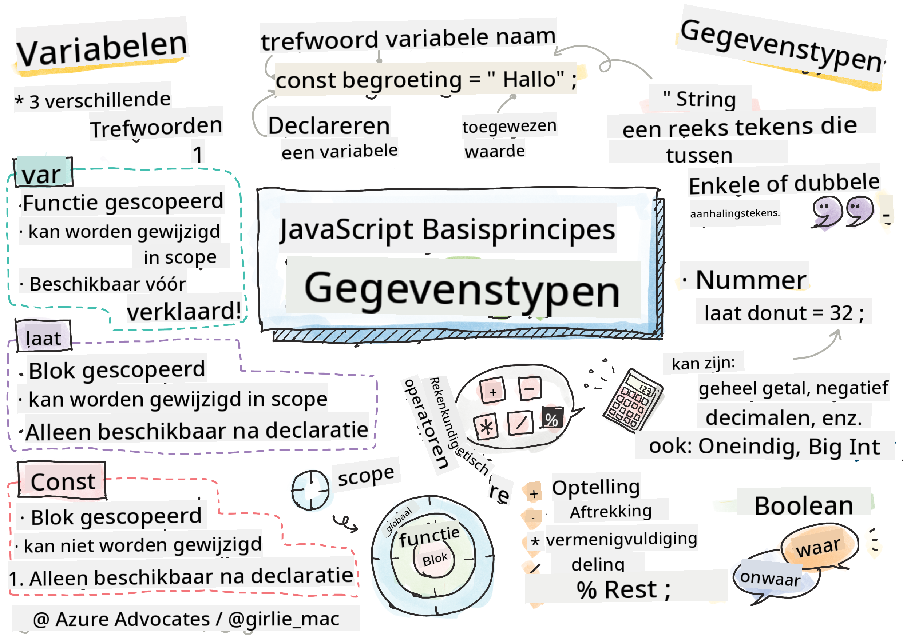

<!--
CO_OP_TRANSLATOR_METADATA:
{
  "original_hash": "fc6aef8ecfdd5b0ad2afa6e6ba52bfde",
  "translation_date": "2025-08-27T20:17:53+00:00",
  "source_file": "2-js-basics/1-data-types/README.md",
  "language_code": "nl"
}
-->
# JavaScript Basis: Gegevenstypen


> Sketchnote door [Tomomi Imura](https://twitter.com/girlie_mac)

## Quiz voor de les
[Quiz voor de les](https://ashy-river-0debb7803.1.azurestaticapps.net/quiz/7)

Deze les behandelt de basis van JavaScript, de taal die interactiviteit op het web mogelijk maakt.

> Je kunt deze les volgen op [Microsoft Learn](https://docs.microsoft.com/learn/modules/web-development-101-variables/?WT.mc_id=academic-77807-sagibbon)!

[](https://youtube.com/watch?v=JNIXfGiDWM8 "Variabelen in JavaScript")

[](https://youtube.com/watch?v=AWfA95eLdq8 "Gegevenstypen in JavaScript")

> 🎥 Klik op de afbeeldingen hierboven voor video's over variabelen en gegevenstypen

Laten we beginnen met variabelen en de gegevenstypen die ze bevatten!

## Variabelen

Variabelen slaan waarden op die je kunt gebruiken en wijzigen in je code.

Het **declareren** van een variabele heeft de volgende syntaxis **[keyword] [name]**. Het bestaat uit twee onderdelen:

- **Keyword**. Keywords kunnen `let` of `var` zijn.  

✅ Het keyword `let` werd geïntroduceerd in ES6 en geeft je variabele een zogenaamde _block scope_. Het wordt aanbevolen om `let` te gebruiken in plaats van `var`. We zullen block scopes later in meer detail behandelen.
- **De variabelenaam**, dit is een naam die je zelf kiest.

### Taak - werken met variabelen

1. **Declareer een variabele**. Laten we een variabele declareren met het keyword `let`:

    ```javascript
    let myVariable;
    ```

   `myVariable` is nu gedeclareerd met het keyword `let`. Het heeft momenteel nog geen waarde.

1. **Ken een waarde toe**. Sla een waarde op in een variabele met de `=` operator, gevolgd door de gewenste waarde.

    ```javascript
    myVariable = 123;
    ```

   > Opmerking: het gebruik van `=` in deze les betekent dat we gebruik maken van een "toewijzingsoperator", die wordt gebruikt om een waarde aan een variabele toe te wijzen. Het geeft geen gelijkheid aan.

   `myVariable` is nu *geïnitialiseerd* met de waarde 123.

1. **Refactor**. Vervang je code door de volgende instructie.

    ```javascript
    let myVariable = 123;
    ```

    Het bovenstaande wordt een _expliciete initialisatie_ genoemd wanneer een variabele wordt gedeclareerd en tegelijkertijd een waarde krijgt toegewezen.

1. **Wijzig de variabelewaarde**. Wijzig de variabelewaarde op de volgende manier:

   ```javascript
   myVariable = 321;
   ```

   Zodra een variabele is gedeclareerd, kun je de waarde op elk moment in je code wijzigen met de `=` operator en de nieuwe waarde.

   ✅ Probeer het! Je kunt JavaScript direct in je browser schrijven. Open een browservenster en ga naar Developer Tools. In de console vind je een prompt; typ `let myVariable = 123`, druk op return, en typ vervolgens `myVariable`. Wat gebeurt er? Let op, je leert meer over deze concepten in volgende lessen.

## Constanten

Declaratie en initialisatie van een constante volgen dezelfde principes als een variabele, met uitzondering van het keyword `const`. Constanten worden meestal gedeclareerd met alleen hoofdletters.

```javascript
const MY_VARIABLE = 123;
```

Constanten lijken op variabelen, met twee uitzonderingen:

- **Moet een waarde hebben**. Constanten moeten worden geïnitialiseerd, anders treedt er een fout op bij het uitvoeren van de code.
- **Referentie kan niet worden gewijzigd**. De referentie van een constante kan niet worden gewijzigd nadat deze is geïnitialiseerd, anders treedt er een fout op bij het uitvoeren van de code. Laten we naar twee voorbeelden kijken:
   - **Eenvoudige waarde**. Het volgende is NIET toegestaan:
   
      ```javascript
      const PI = 3;
      PI = 4; // not allowed
      ```
 
   - **Objectreferentie is beschermd**. Het volgende is NIET toegestaan.
   
      ```javascript
      const obj = { a: 3 };
      obj = { b: 5 } // not allowed
      ```

    - **Objectwaarde is niet beschermd**. Het volgende IS toegestaan:
    
      ```javascript
      const obj = { a: 3 };
      obj.a = 5;  // allowed
      ```

      Hierboven wijzig je de waarde van het object, maar niet de referentie zelf, wat toegestaan is.

   > Opmerking, een `const` betekent dat de referentie beschermd is tegen herassignatie. De waarde is echter niet _onveranderlijk_ en kan veranderen, vooral als het een complex construct zoals een object is.

## Gegevenstypen

Variabelen kunnen veel verschillende soorten waarden opslaan, zoals getallen en tekst. Deze verschillende soorten waarden staan bekend als de **gegevenstype**. Gegevenstypen zijn een belangrijk onderdeel van softwareontwikkeling omdat ze ontwikkelaars helpen beslissingen te nemen over hoe de code moet worden geschreven en hoe de software moet werken. Bovendien hebben sommige gegevenstypen unieke eigenschappen die helpen om extra informatie uit een waarde te halen of deze te transformeren.

✅ Gegevenstypen worden ook wel JavaScript data primitives genoemd, omdat ze de laagste niveau gegevenstypen zijn die door de taal worden geleverd. Er zijn 7 primitieve gegevenstypen: string, number, bigint, boolean, undefined, null en symbol. Neem een minuut om te visualiseren wat elk van deze primitieve typen zou kunnen vertegenwoordigen. Wat is een `zebra`? Hoe zit het met `0`? `true`?

### Getallen

In de vorige sectie was de waarde van `myVariable` een gegevenstype van het type getal.

`let myVariable = 123;`

Variabelen kunnen alle soorten getallen opslaan, inclusief decimalen of negatieve getallen. Getallen kunnen ook worden gebruikt met rekenkundige operators, behandeld in de [volgende sectie](../../../../2-js-basics/1-data-types).

### Rekenkundige operators

Er zijn verschillende soorten operators om rekenkundige functies uit te voeren, en enkele worden hier vermeld:

| Symbool | Beschrijving                                                           | Voorbeeld                        |
| ------- | ---------------------------------------------------------------------- | -------------------------------- |
| `+`     | **Optelling**: Berekent de som van twee getallen                       | `1 + 2 //verwachte antwoord is 3`   |
| `-`     | **Aftrekking**: Berekent het verschil tussen twee getallen             | `1 - 2 //verwachte antwoord is -1`  |
| `*`     | **Vermenigvuldiging**: Berekent het product van twee getallen          | `1 * 2 //verwachte antwoord is 2`   |
| `/`     | **Deling**: Berekent het quotiënt van twee getallen                    | `1 / 2 //verwachte antwoord is 0.5` |
| `%`     | **Rest**: Berekent de rest van de deling van twee getallen             | `1 % 2 //verwachte antwoord is 1`   |

✅ Probeer het! Probeer een rekenkundige operatie in de console van je browser. Verrassen de resultaten je?

### Strings

Strings zijn sets van tekens die tussen enkele of dubbele aanhalingstekens staan.

- `'Dit is een string'`
- `"Dit is ook een string"`
- `let myString = 'Dit is een stringwaarde opgeslagen in een variabele';`

Vergeet niet aanhalingstekens te gebruiken bij het schrijven van een string, anders gaat JavaScript ervan uit dat het een variabelenaam is.

### Strings formatteren

Strings zijn tekstueel en moeten van tijd tot tijd worden opgemaakt.

Om twee of meer strings te **concateneren**, of samen te voegen, gebruik je de `+` operator.

```javascript
let myString1 = "Hello";
let myString2 = "World";

myString1 + myString2 + "!"; //HelloWorld!
myString1 + " " + myString2 + "!"; //Hello World!
myString1 + ", " + myString2 + "!"; //Hello, World!

```

✅ Waarom is `1 + 1 = 2` in JavaScript, maar `'1' + '1' = 11?` Denk erover na. En wat gebeurt er met `'1' + 1`?

**Template literals** zijn een andere manier om strings op te maken, behalve dat in plaats van aanhalingstekens, de backtick wordt gebruikt. Alles wat geen platte tekst is, moet in placeholders `${ }` worden geplaatst. Dit omvat eventuele variabelen die strings kunnen zijn.

```javascript
let myString1 = "Hello";
let myString2 = "World";

`${myString1} ${myString2}!` //Hello World!
`${myString1}, ${myString2}!` //Hello, World!
```

Je kunt je opmaakdoelen bereiken met beide methoden, maar template literals respecteren eventuele spaties en regeleinden.

✅ Wanneer zou je een template literal gebruiken in plaats van een gewone string?

### Booleans

Booleans kunnen slechts twee waarden hebben: `true` of `false`. Booleans kunnen helpen beslissen welke regels code moeten worden uitgevoerd wanneer aan bepaalde voorwaarden wordt voldaan. In veel gevallen helpen [operators](../../../../2-js-basics/1-data-types) bij het instellen van de waarde van een Boolean en je zult vaak merken dat variabelen worden geïnitialiseerd of dat hun waarden worden bijgewerkt met een operator.

- `let myTrueBool = true`
- `let myFalseBool = false`

✅ Een variabele kan als 'truthy' worden beschouwd als deze evalueert naar een boolean `true`. Interessant genoeg zijn in JavaScript [alle waarden truthy tenzij ze als falsy zijn gedefinieerd](https://developer.mozilla.org/docs/Glossary/Truthy).

---

## 🚀 Uitdaging

JavaScript staat bekend om zijn verrassende manieren van omgaan met gegevenstypen. Doe wat onderzoek naar deze 'valkuilen'. Bijvoorbeeld: hoofdlettergevoeligheid kan je verrassen! Probeer dit in je console: `let age = 1; let Age = 2; age == Age` (resultaat `false` -- waarom?). Welke andere valkuilen kun je vinden?

## Quiz na de les
[Quiz na de les](https://ashy-river-0debb7803.1.azurestaticapps.net/quiz/8)

## Herhaling & Zelfstudie

Bekijk [deze lijst met JavaScript-oefeningen](https://css-tricks.com/snippets/javascript/) en probeer er een. Wat heb je geleerd?

## Opdracht

[Gegevenstypen oefenen](assignment.md)

---

**Disclaimer**:  
Dit document is vertaald met behulp van de AI-vertalingsservice [Co-op Translator](https://github.com/Azure/co-op-translator). Hoewel we streven naar nauwkeurigheid, dient u zich ervan bewust te zijn dat geautomatiseerde vertalingen fouten of onnauwkeurigheden kunnen bevatten. Het originele document in zijn oorspronkelijke taal moet worden beschouwd als de gezaghebbende bron. Voor cruciale informatie wordt professionele menselijke vertaling aanbevolen. Wij zijn niet aansprakelijk voor eventuele misverstanden of verkeerde interpretaties die voortvloeien uit het gebruik van deze vertaling.