<!--
CO_OP_TRANSLATOR_METADATA:
{
  "original_hash": "672b0bb6e8b431075f3bdb7130590d2d",
  "translation_date": "2025-11-04T01:48:19+00:00",
  "source_file": "2-js-basics/1-data-types/README.md",
  "language_code": "nl"
}
-->
# JavaScript Basisprincipes: Gegevenstypen


> Sketchnote door [Tomomi Imura](https://twitter.com/girlie_mac)


Gegevenstypen zijn een van de fundamentele concepten in JavaScript die je in elk programma tegenkomt dat je schrijft. Denk aan gegevenstypen als het archiefsysteem dat oude bibliothecarissen in Alexandrië gebruikten – ze hadden specifieke plekken voor rollen met poëzie, wiskunde en historische verslagen. JavaScript organiseert informatie op een vergelijkbare manier met verschillende categorieën voor verschillende soorten gegevens.

In deze les gaan we de kerngegevenstypen verkennen die JavaScript laten werken. Je leert hoe je met getallen, tekst, waar/onwaar-waarden omgaat en waarom het kiezen van het juiste type essentieel is voor je programma's. Deze concepten lijken in het begin misschien abstract, maar met oefening worden ze vanzelfsprekend.

Het begrijpen van gegevenstypen maakt alles in JavaScript veel duidelijker. Net zoals architecten verschillende bouwmaterialen moeten begrijpen voordat ze een kathedraal bouwen, zullen deze basisprincipes alles ondersteunen wat je in de toekomst bouwt.

## Quiz voor de les
[Quiz voor de les](https://ff-quizzes.netlify.app/web/)

Deze les behandelt de basisprincipes van JavaScript, de taal die interactiviteit op het web mogelijk maakt.

> Je kunt deze les volgen op [Microsoft Learn](https://docs.microsoft.com/learn/modules/web-development-101-variables/?WT.mc_id=academic-77807-sagibbon)!

[](https://youtube.com/watch?v=JNIXfGiDWM8 "Variabelen in JavaScript")

[](https://youtube.com/watch?v=AWfA95eLdq8 "Gegevenstypen in JavaScript")

> 🎥 Klik op de afbeeldingen hierboven voor video's over variabelen en gegevenstypen

Laten we beginnen met variabelen en de gegevenstypen die ze vullen!


## Variabelen

Variabelen zijn fundamentele bouwstenen in programmeren. Net zoals de gelabelde potten die middeleeuwse alchemisten gebruikten om verschillende stoffen op te slaan, laten variabelen je informatie opslaan en een beschrijvende naam geven zodat je er later naar kunt verwijzen. Moet je iemands leeftijd onthouden? Sla het op in een variabele genaamd `age`. Wil je de naam van een gebruiker bijhouden? Bewaar het in een variabele genaamd `userName`.

We richten ons op de moderne aanpak om variabelen te maken in JavaScript. De technieken die je hier leert, vertegenwoordigen jaren van taalontwikkeling en best practices ontwikkeld door de programmeergemeenschap.

Het maken en **declareren** van een variabele heeft de volgende syntaxis **[keyword] [name]**. Het bestaat uit twee delen:

- **Keyword**. Gebruik `let` voor variabelen die kunnen veranderen, of `const` voor waarden die hetzelfde blijven.
- **De variabelenaam**, dit is een beschrijvende naam die je zelf kiest.

✅ Het keyword `let` werd geïntroduceerd in ES6 en geeft je variabele een zogenaamde _block scope_. Het wordt aanbevolen om `let` of `const` te gebruiken in plaats van het oudere `var` keyword. We zullen block scopes later dieper behandelen.

### Taak - werken met variabelen

1. **Declareer een variabele**. Laten we beginnen met het maken van onze eerste variabele:

    ```javascript
    let myVariable;
    ```

   **Wat dit doet:**
   - Dit vertelt JavaScript om een opslaglocatie genaamd `myVariable` te maken
   - JavaScript reserveert ruimte in het geheugen voor deze variabele
   - De variabele heeft momenteel geen waarde (undefined)

2. **Geef het een waarde**. Laten we nu iets in onze variabele plaatsen:

    ```javascript
    myVariable = 123;
    ```

   **Hoe toewijzing werkt:**
   - De `=` operator wijst de waarde 123 toe aan onze variabele
   - De variabele bevat nu deze waarde in plaats van undefined
   - Je kunt deze waarde overal in je code gebruiken met `myVariable`

   > Opmerking: het gebruik van `=` in deze les betekent dat we gebruik maken van een "toewijzingsoperator", die wordt gebruikt om een waarde aan een variabele toe te wijzen. Het geeft geen gelijkheid aan.

3. **Doe het op de slimme manier**. Eigenlijk kunnen we die twee stappen combineren:

    ```javascript
    let myVariable = 123;
    ```

    **Deze aanpak is efficiënter:**
    - Je declareert de variabele en wijst een waarde toe in één statement
    - Dit is de standaardpraktijk onder ontwikkelaars
    - Het verkort de code terwijl de duidelijkheid behouden blijft

4. **Van gedachten veranderen**. Wat als we een ander nummer willen opslaan?

   ```javascript
   myVariable = 321;
   ```

   **Begrip van hernieuwde toewijzing:**
   - De variabele bevat nu 321 in plaats van 123
   - De vorige waarde wordt vervangen – variabelen slaan slechts één waarde tegelijk op
   - Deze veranderlijkheid is een belangrijk kenmerk van variabelen die met `let` zijn gedeclareerd

   ✅ Probeer het! Je kunt JavaScript direct in je browser schrijven. Open een browservenster en ga naar Developer Tools. In de console vind je een prompt; typ `let myVariable = 123`, druk op return, en typ vervolgens `myVariable`. Wat gebeurt er? Let op, je leert meer over deze concepten in volgende lessen.

### 🧠 **Variabelen Beheersingscheck: Vertrouwd raken**

**Laten we kijken hoe je je voelt over variabelen:**
- Kun je het verschil uitleggen tussen het declareren en toewijzen van een variabele?
- Wat gebeurt er als je probeert een variabele te gebruiken voordat je deze declareert?
- Wanneer zou je `let` kiezen boven `const` voor een variabele?


> **Snelle tip**: Denk aan variabelen als gelabelde opslagdozen. Je maakt de doos (`let`), stopt er iets in (`=`), en kunt later de inhoud vervangen indien nodig!

## Constanten

Soms moet je informatie opslaan die tijdens de uitvoering van het programma nooit mag veranderen. Denk aan constanten als de wiskundige principes die Euclides vaststelde in het oude Griekenland – eenmaal bewezen en gedocumenteerd, bleven ze vaststaan voor alle toekomstige referenties.

Constanten werken vergelijkbaar met variabelen, maar met een belangrijke beperking: zodra je hun waarde toewijst, kan deze niet worden gewijzigd. Deze onveranderlijkheid helpt om onbedoelde wijzigingen van kritieke waarden in je programma te voorkomen.

Declaratie en initialisatie van een constante volgen dezelfde concepten als een variabele, met uitzondering van het `const` keyword. Constanten worden meestal gedeclareerd met alleen hoofdletters.

```javascript
const MY_VARIABLE = 123;
```

**Wat deze code doet:**
- **Maakt** een constante genaamd `MY_VARIABLE` met de waarde 123
- **Gebruikt** een conventie met hoofdletters voor constanten
- **Voorkomt** toekomstige wijzigingen van deze waarde

Constanten hebben twee hoofdregels:

- **Je moet ze meteen een waarde geven** – lege constanten zijn niet toegestaan!
- **Je kunt die waarde nooit veranderen** – JavaScript geeft een foutmelding als je het probeert. Laten we zien wat ik bedoel:

   **Eenvoudige waarde** - Het volgende is NIET toegestaan:
   
      ```javascript
      const PI = 3;
      PI = 4; // niet toegestaan
      ```

   **Wat je moet onthouden:**
   - **Pogingen** om een constante opnieuw toe te wijzen veroorzaken een fout
   - **Beschermt** belangrijke waarden tegen onbedoelde wijzigingen
   - **Zorgt ervoor** dat de waarde consistent blijft in je programma
 
   **Objectreferentie is beschermd** - Het volgende is NIET toegestaan:
   
      ```javascript
      const obj = { a: 3 };
      obj = { b: 5 } // niet toegestaan
      ```

   **Begrip van deze concepten:**
   - **Voorkomt** het vervangen van het hele object door een nieuw object
   - **Beschermt** de referentie naar het originele object
   - **Behoudt** de identiteit van het object in het geheugen

    **Objectwaarde is niet beschermd** - Het volgende IS toegestaan:
    
      ```javascript
      const obj = { a: 3 };
      obj.a = 5;  // toegestaan
      ```

      **Wat hier gebeurt:**
      - **Wijzigt** de eigenschapswaarde binnen het object
      - **Behoudt** dezelfde objectreferentie
      - **Toont aan** dat de inhoud van het object kan veranderen terwijl de referentie constant blijft

   > Opmerking, een `const` betekent dat de referentie beschermd is tegen hernieuwde toewijzing. De waarde is echter niet _onveranderlijk_ en kan veranderen, vooral als het een complex construct is zoals een object.

## Gegevenstypen

JavaScript organiseert informatie in verschillende categorieën, zogenaamde gegevenstypen. Dit concept weerspiegelt hoe oude geleerden kennis categoriseerden – Aristoteles maakte onderscheid tussen verschillende soorten redeneringen, wetende dat logische principes niet uniform konden worden toegepast op poëzie, wiskunde en natuurlijke filosofie.

Gegevenstypen zijn belangrijk omdat verschillende bewerkingen werken met verschillende soorten informatie. Net zoals je geen rekenkundige bewerkingen kunt uitvoeren op iemands naam of een wiskundige vergelijking kunt alfabetiseren, vereist JavaScript het juiste gegevenstype voor elke bewerking. Dit voorkomt fouten en maakt je code betrouwbaarder.

Variabelen kunnen veel verschillende soorten waarden opslaan, zoals getallen en tekst. Deze verschillende soorten waarden staan bekend als het **gegevenstype**. Gegevenstypen zijn een belangrijk onderdeel van softwareontwikkeling omdat ze ontwikkelaars helpen beslissingen te nemen over hoe de code moet worden geschreven en hoe de software moet werken. Bovendien hebben sommige gegevenstypen unieke kenmerken die helpen om extra informatie uit een waarde te halen of te transformeren.

✅ Gegevenstypen worden ook wel JavaScript data primitives genoemd, omdat ze de laagste niveau gegevenstypen zijn die door de taal worden geleverd. Er zijn 7 primitieve gegevenstypen: string, number, bigint, boolean, undefined, null en symbol. Neem een minuut de tijd om je voor te stellen wat elk van deze primitieve typen zou kunnen vertegenwoordigen. Wat is een `zebra`? Hoe zit het met `0`? `true`?

### Getallen

Getallen zijn het meest eenvoudige gegevenstype in JavaScript. Of je nu werkt met gehele getallen zoals 42, decimalen zoals 3.14, of negatieve getallen zoals -5, JavaScript behandelt ze uniform.

Weet je nog onze variabele van eerder? Die 123 die we opsloegen was eigenlijk een gegevenstype getal:

```javascript
let myVariable = 123;
```

**Belangrijke kenmerken:**
- JavaScript herkent numerieke waarden automatisch
- Je kunt wiskundige bewerkingen uitvoeren met deze variabelen
- Geen expliciete typeverklaring is vereist

Variabelen kunnen alle soorten getallen opslaan, inclusief decimalen of negatieve getallen. Getallen kunnen ook worden gebruikt met rekenkundige operators, behandeld in de [volgende sectie](../../../../2-js-basics/1-data-types).

```mermaid
flowchart LR
    A["🔢 Numbers"] --> B["➕ Addition"]
    A --> C["➖ Subtraction"]
    A --> D["✖️ Multiplication"]
    A --> E["➗ Division"]
    A --> F["📊 Remainder %"]
    
    B --> B1["1 + 2 = 3"]
    C --> C1["5 - 3 = 2"]
    D --> D1["4 * 3 = 12"]
    E --> E1["10 / 2 = 5"]
    F --> F1["7 % 3 = 1"]
    
    style A fill:#e3f2fd
    style B fill:#e8f5e8
    style C fill:#fff3e0
    style D fill:#f3e5f5
    style E fill:#e0f2f1
    style F fill:#fce4ec
```



### Rekenkundige Operators

Rekenkundige operators stellen je in staat om wiskundige berekeningen uit te voeren in JavaScript. Deze operators volgen dezelfde principes die wiskundigen al eeuwenlang gebruiken – dezelfde symbolen die verschenen in de werken van geleerden zoals Al-Khwarizmi, die algebraïsche notatie ontwikkelde.

De operators werken zoals je zou verwachten van traditionele wiskunde: plus voor optellen, min voor aftrekken, enzovoort.

Er zijn verschillende soorten operators die je kunt gebruiken bij het uitvoeren van rekenkundige functies, en enkele worden hier vermeld:

| Symbool | Beschrijving                                                           | Voorbeeld                        |
| ------- | ---------------------------------------------------------------------- | -------------------------------- |
| `+`     | **Optellen**: Berekent de som van twee getallen                        | `1 + 2 //verwachte antwoord is 3`   |
| `-`     | **Aftrekken**: Berekent het verschil tussen twee getallen              | `1 - 2 //verwachte antwoord is -1`  |
| `*`     | **Vermenigvuldigen**: Berekent het product van twee getallen           | `1 * 2 //verwachte antwoord is 2`   |
| `/`     | **Delen**: Berekent het quotiënt van twee getallen                     | `1 / 2 //verwachte antwoord is 0.5` |
| `%`     | **Rest**: Berekent de rest van de deling van twee getallen             | `1 % 2 //verwachte antwoord is 1`   |

✅ Probeer het! Probeer een rekenkundige bewerking in de console van je browser. Verrassen de resultaten je?

### 🧮 **Rekenvaardigheden Check: Berekenen met Vertrouwen**

**Test je begrip van rekenkunde:**
- Wat is het verschil tussen `/` (delen) en `%` (rest)?
- Kun je voorspellen wat `10 % 3` oplevert? (Tip: het is niet 3,33...)
- Waarom zou de restoperator handig kunnen zijn in programmeren?


> **Inzicht uit de praktijk**: De restoperator (%) is super handig om te controleren of getallen even/oneven zijn, patronen te maken of door arrays te bladeren!

### Strings

In JavaScript wordt tekstuele data weergegeven als strings. De term "string" komt van het concept van karakters die aan elkaar worden geregen in een reeks, net zoals de manier waarop schrijvers in middeleeuwse kloosters letters met elkaar verbonden om woorden en zinnen te vormen in hun manuscripten.

Strings zijn fundamenteel voor webontwikkeling. Elk stukje tekst dat op een website wordt weergegeven – gebruikersnamen, knoplabels, foutmeldingen, inhoud – wordt behandeld als stringdata. Het begrijpen van strings is essentieel voor het maken van functionele gebruikersinterfaces.

Strings zijn reeksen van tekens die tussen enkele of dubbele aanhalingstekens staan.

```javascript
'This is a string'
"This is also a string"
let myString = 'This is a string value stored in a variable';
```

**Begrip van deze concepten:**
- **Gebruikt** ofwel enkele aanhalingstekens `'` of dubbele aanhalingstekens `"` om strings te definiëren
- **Slaat** tekstgegevens op die letters, cijfers en symbolen kunnen bevatten
- **Wijst** stringwaarden toe aan variabelen voor later gebruik
- **Vereist** aanhalingstekens om tekst te onderscheiden van variabelenamen

Onthoud dat je aanhalingstekens moet gebruiken bij het schrijven van een string, anders gaat JavaScript ervan uit dat het een variabelenaam is.

```mermaid
flowchart TD
    A["📝 Strings"] --> B["Single Quotes"]
    A --> C["Double Quotes"]
    A --> D["Template Literals"]
    
    B --> B1["'Hello World'"]
    C --> C1["\"Hello World\""]
    D --> D1["`Hello \${name}`"]
    
    E["String Operations"] --> F["Concatenation"]
    E --> G["Template Insertion"]
    E --> H["Length & Methods"]
    
    F --> F1["'Hello' + ' ' + 'World'"]
    G --> G1["`Hello \${firstName} \${lastName}`"]
    H --> H1["myString.length"]
    
    style A fill:#e3f2fd
    style E fill:#fff3e0
    style D fill:#e8f5e8
    style G fill:#e8f5e8
```



### Strings formatteren

Stringmanipulatie stelt je in staat om tekstelementen te combineren, variabelen op te nemen en dynamische inhoud te creëren die reageert op de toestand van het programma. Deze techniek stelt je in staat om tekst programmatisch te construeren.

Vaak moet je meerdere strings samenvoegen – dit proces wordt concatenatie genoemd.
Om **twee of meer strings samen te voegen**, of ze aan elkaar te koppelen, gebruik je de `+` operator.

```javascript
let myString1 = "Hello";
let myString2 = "World";

myString1 + myString2 + "!"; //HelloWorld!
myString1 + " " + myString2 + "!"; //Hello World!
myString1 + ", " + myString2 + "!"; //Hello, World!
```

**Stap voor stap, dit gebeurt er:**
- **Combineert** meerdere strings met behulp van de `+` operator
- **Voegt** strings direct samen zonder spaties in het eerste voorbeeld
- **Voegt** spaties `" "` toe tussen strings voor leesbaarheid
- **Voegt** leestekens zoals komma's toe om een correcte opmaak te creëren

✅ Waarom is `1 + 1 = 2` in JavaScript, maar `'1' + '1' = 11`? Denk er eens over na. En wat gebeurt er bij `'1' + 1`?

**Template literals** zijn een andere manier om strings te formatteren. In plaats van aanhalingstekens gebruik je backticks. Alles wat geen gewone tekst is, moet in placeholders `${ }` worden geplaatst. Dit geldt ook voor variabelen die strings kunnen zijn.

```javascript
let myString1 = "Hello";
let myString2 = "World";

`${myString1} ${myString2}!` //Hello World!
`${myString1}, ${myString2}!` //Hello, World!
```

**Laten we elk onderdeel begrijpen:**
- **Gebruikt** backticks `` ` `` in plaats van gewone aanhalingstekens om template literals te maken
- **Embedt** variabelen direct met behulp van de `${}` placeholder-syntaxis
- **Behoudt** spaties en opmaak precies zoals geschreven
- **Biedt** een overzichtelijkere manier om complexe strings met variabelen te maken

Je kunt je opmaakdoelen bereiken met beide methoden, maar template literals respecteren spaties en regelafbrekingen.

✅ Wanneer zou je een template literal gebruiken in plaats van een gewone string?

### 🔤 **Stringvaardigheidstest: Vertrouwen in Tekstmanipulatie**

**Evalueer je stringvaardigheden:**
- Kun je uitleggen waarom `'1' + '1'` gelijk is aan `'11'` in plaats van `2`?
- Welke stringmethode vind je beter leesbaar: concatenatie of template literals?
- Wat gebeurt er als je de aanhalingstekens rond een string vergeet?


> **Pro tip**: Template literals worden over het algemeen geprefereerd voor het bouwen van complexe strings omdat ze beter leesbaar zijn en multi-line strings prachtig verwerken!

### Booleans

Booleans vertegenwoordigen de eenvoudigste vorm van gegevens: ze kunnen slechts één van twee waarden bevatten – `true` of `false`. Dit binaire logicasysteem gaat terug naar het werk van George Boole, een wiskundige uit de 19e eeuw die de Booleaanse algebra ontwikkelde.

Ondanks hun eenvoud zijn booleans essentieel voor de logica in programma's. Ze stellen je code in staat om beslissingen te nemen op basis van voorwaarden – of een gebruiker is ingelogd, of een knop is ingedrukt, of aan bepaalde criteria is voldaan.

Booleans kunnen slechts twee waarden hebben: `true` of `false`. Booleans helpen bij het nemen van beslissingen over welke regels code moeten worden uitgevoerd wanneer aan bepaalde voorwaarden wordt voldaan. In veel gevallen helpen [operators](../../../../2-js-basics/1-data-types) bij het instellen van de waarde van een Boolean en je zult vaak zien dat variabelen worden geïnitialiseerd of hun waarden worden bijgewerkt met een operator.

```javascript
let myTrueBool = true;
let myFalseBool = false;
```

**In het bovenstaande hebben we:**
- **Een variabele gemaakt** die de Boolean-waarde `true` opslaat
- **Gedemonstreerd** hoe je de Boolean-waarde `false` opslaat
- **De exacte keywords** `true` en `false` gebruikt (geen aanhalingstekens nodig)
- **Deze variabelen voorbereid** voor gebruik in conditionele statements

✅ Een variabele kan als 'truthy' worden beschouwd als deze evalueert naar een Boolean `true`. Interessant genoeg zijn in JavaScript [alle waarden truthy, tenzij ze als falsy zijn gedefinieerd](https://developer.mozilla.org/docs/Glossary/Truthy).

```mermaid
flowchart LR
    A["🔘 Boolean Values"] --> B["true"]
    A --> C["false"]
    
    D["Truthy Values"] --> D1["'hello'"]
    D --> D2["42"]
    D --> D3["[]"]
    D --> D4["{}"]
    
    E["Falsy Values"] --> E1["false"]
    E --> E2["0"]
    E --> E3["''"]
    E --> E4["null"]
    E --> E5["undefined"]
    E --> E6["NaN"]
    
    style B fill:#e8f5e8
    style C fill:#ffebee
    style D fill:#e3f2fd
    style E fill:#fff3e0
```



### 🎯 **Boolean Logica Test: Besluitvormingsvaardigheden**

**Test je begrip van booleans:**
- Waarom denk je dat JavaScript "truthy" en "falsy" waarden heeft, naast alleen `true` en `false`?
- Kun je voorspellen welke van deze falsy is: `0`, `"0"`, `[]`, `"false"`?
- Hoe kunnen booleans nuttig zijn bij het controleren van de programmalogica?


> **Onthoud**: In JavaScript zijn er slechts 6 waarden die falsy zijn: `false`, `0`, `""`, `null`, `undefined` en `NaN`. Alles daarbuiten is truthy!

---

## 📊 **Samenvatting van je Data Types Toolkit**

```mermaid
graph TD
    A["🎯 JavaScript Data Types"] --> B["📦 Variables"]
    A --> C["🔢 Numbers"]
    A --> D["📝 Strings"]
    A --> E["🔘 Booleans"]
    
    B --> B1["let mutable"]
    B --> B2["const immutable"]
    
    C --> C1["42, 3.14, -5"]
    C --> C2["+ - * / %"]
    
    D --> D1["'quotes' or \\\"quotes\\\""]
    D --> D2["`template literals`"]
    
    E --> E1["true or false"]
    E --> E2["truthy vs falsy"]
    
    F["⚡ Key Concepts"] --> F1["Type matters for operations"]
    F --> F2["JavaScript is dynamically typed"]
    F --> F3["Variables can change types"]
    F --> F4["Naming is case-sensitive"]
    
    style A fill:#e3f2fd
    style B fill:#e8f5e8
    style C fill:#fff3e0
    style D fill:#f3e5f5
    style E fill:#e0f2f1
    style F fill:#fce4ec
```



## GitHub Copilot Agent Challenge 🚀

Gebruik de Agent-modus om de volgende uitdaging te voltooien:

**Beschrijving:** Maak een persoonlijke informatiebeheerder die alle JavaScript-datatypes demonstreert die je in deze les hebt geleerd, terwijl je echte datascenario's behandelt.

**Prompt:** Bouw een JavaScript-programma dat een gebruikersprofielobject maakt met: de naam van een persoon (string), leeftijd (nummer), studentstatus (boolean), favoriete kleuren als een array, en een adresobject met straat-, stad- en postcode-eigenschappen. Voeg functies toe om de profielinformatie weer te geven en individuele velden bij te werken. Zorg ervoor dat je stringconcatenatie, template literals, rekenkundige bewerkingen met de leeftijd en Boolean-logica voor de studentstatus demonstreert.

Meer informatie over [agent mode](https://code.visualstudio.com/blogs/2025/02/24/introducing-copilot-agent-mode) hier.

## 🚀 Uitdaging

JavaScript heeft enkele gedragingen die ontwikkelaars kunnen verrassen. Hier is een klassiek voorbeeld om te verkennen: probeer dit in je browserconsole te typen: `let age = 1; let Age = 2; age == Age` en observeer het resultaat. Het retourneert `false` – kun je bepalen waarom?

Dit is een van de vele JavaScript-eigenaardigheden die het waard zijn om te begrijpen. Vertrouwdheid met deze eigenaardigheden helpt je om betrouwbaardere code te schrijven en problemen effectiever op te lossen.

## Quiz na de les
[Quiz na de les](https://ff-quizzes.netlify.app)

## Review & Zelfstudie

Bekijk [deze lijst met JavaScript-oefeningen](https://css-tricks.com/snippets/javascript/) en probeer er een. Wat heb je geleerd?

## Opdracht

[Data Types Practice](assignment.md)

## 🚀 Jouw JavaScript Data Types Meesterschap Tijdlijn

### ⚡ **Wat je kunt doen in de komende 5 minuten**
- [ ] Open je browserconsole en maak 3 variabelen met verschillende datatypes
- [ ] Probeer de uitdaging: `let age = 1; let Age = 2; age == Age` en ontdek waarom het false is
- [ ] Oefen stringconcatenatie met je naam en favoriete nummer
- [ ] Test wat er gebeurt als je een nummer toevoegt aan een string

### 🎯 **Wat je in dit uur kunt bereiken**
- [ ] Maak de quiz na de les af en bekijk eventuele verwarrende concepten
- [ ] Bouw een mini-rekenmachine die twee getallen optelt, aftrekt, vermenigvuldigt en deelt
- [ ] Maak een eenvoudige naamformatter met behulp van template literals
- [ ] Verken de verschillen tussen de vergelijkingoperators `==` en `===`
- [ ] Oefen het converteren tussen verschillende datatypes

### 📅 **Jouw weeklange JavaScript basis**
- [ ] Maak de opdracht af met vertrouwen en creativiteit
- [ ] Maak een persoonlijk profielobject met alle geleerde datatypes
- [ ] Oefen met [JavaScript-oefeningen van CSS-Tricks](https://css-tricks.com/snippets/javascript/)
- [ ] Bouw een eenvoudige formuliervalidator met behulp van Boolean-logica
- [ ] Experimenteer met array- en objectdatatypes (vooruitblik op komende lessen)
- [ ] Word lid van een JavaScript-community en stel vragen over datatypes

### 🌟 **Jouw maandlange transformatie**
- [ ] Integreer kennis over datatypes in grotere programmeerprojecten
- [ ] Begrijp wanneer en waarom je elk datatype in echte toepassingen gebruikt
- [ ] Help andere beginners om de basisprincipes van JavaScript te begrijpen
- [ ] Bouw een kleine applicatie die verschillende soorten gebruikersgegevens beheert
- [ ] Verken geavanceerde datatypes zoals type coercion en strikte gelijkheid
- [ ] Draag bij aan open source JavaScript-projecten door documentatie te verbeteren

### 🧠 **Eindcontrole Data Types Meesterschap**

**Vier je JavaScript basiskennis:**
- Welk datatype heeft je het meest verrast qua gedrag?
- Hoe comfortabel voel je je bij het uitleggen van variabelen versus constanten aan een vriend?
- Wat is het meest interessante dat je hebt ontdekt over het type systeem van JavaScript?
- Welke toepassing in de echte wereld kun je je voorstellen te bouwen met deze basisprincipes?


> 💡 **Je hebt de basis gelegd!** Het begrijpen van datatypes is als het leren van het alfabet voordat je verhalen schrijft. Elk JavaScript-programma dat je ooit zult schrijven, maakt gebruik van deze fundamentele concepten. Je hebt nu de bouwstenen om interactieve websites, dynamische applicaties en echte problemen op te lossen met code. Welkom in de geweldige wereld van JavaScript! 🎉

---

**Disclaimer**:  
Dit document is vertaald met behulp van de AI-vertalingsservice [Co-op Translator](https://github.com/Azure/co-op-translator). Hoewel we streven naar nauwkeurigheid, dient u zich ervan bewust te zijn dat geautomatiseerde vertalingen fouten of onnauwkeurigheden kunnen bevatten. Het originele document in de oorspronkelijke taal moet worden beschouwd als de gezaghebbende bron. Voor kritieke informatie wordt professionele menselijke vertaling aanbevolen. Wij zijn niet aansprakelijk voor misverstanden of verkeerde interpretaties die voortvloeien uit het gebruik van deze vertaling.