<!--
CO_OP_TRANSLATOR_METADATA:
{
  "original_hash": "71f7d7dafa1c7194d79ddac87f669ff9",
  "translation_date": "2025-11-04T01:48:54+00:00",
  "source_file": "2-js-basics/2-functions-methods/README.md",
  "language_code": "nl"
}
-->
# JavaScript Basis: Methoden en Functies


> Sketchnote door [Tomomi Imura](https://twitter.com/girlie_mac)


## Quiz voor de les
[Quiz voor de les](https://ff-quizzes.netlify.app)

Het herhaaldelijk schrijven van dezelfde code is een van de meest voorkomende frustraties in programmeren. Functies lossen dit probleem op door je in staat te stellen code te verpakken in herbruikbare blokken. Denk aan functies als de gestandaardiseerde onderdelen die Henry Ford's assemblagelijn revolutionair maakten – zodra je een betrouwbaar onderdeel hebt gemaakt, kun je het overal gebruiken zonder het opnieuw te bouwen.

Functies stellen je in staat om stukjes code te bundelen zodat je ze door je hele programma kunt hergebruiken. In plaats van dezelfde logica overal te kopiëren en plakken, kun je een functie één keer maken en deze oproepen wanneer nodig. Deze aanpak houdt je code georganiseerd en maakt updates veel eenvoudiger.

In deze les leer je hoe je je eigen functies kunt maken, informatie aan hen kunt doorgeven en nuttige resultaten kunt terugkrijgen. Je ontdekt het verschil tussen functies en methoden, leert moderne syntaxisbenaderingen en ziet hoe functies met andere functies kunnen samenwerken. We bouwen deze concepten stap voor stap op.

[](https://youtube.com/watch?v=XgKsD6Zwvlc "Methoden en Functies")

> 🎥 Klik op de afbeelding hierboven voor een video over methoden en functies.

> Je kunt deze les volgen op [Microsoft Learn](https://docs.microsoft.com/learn/modules/web-development-101-functions/?WT.mc_id=academic-77807-sagibbon)!


## Functies

Een functie is een zelfstandig blok code dat een specifieke taak uitvoert. Het bevat logica die je kunt uitvoeren wanneer dat nodig is.

In plaats van dezelfde code meerdere keren in je programma te schrijven, kun je deze in een functie verpakken en die functie oproepen wanneer je hem nodig hebt. Deze aanpak houdt je code overzichtelijk en maakt updates veel eenvoudiger. Stel je de onderhoudsuitdaging voor als je logica moest wijzigen die verspreid was over 20 verschillende locaties in je codebase.

Het is essentieel om je functies beschrijvende namen te geven. Een goed gekozen naam voor een functie communiceert duidelijk het doel ervan – als je `cancelTimer()` ziet, begrijp je meteen wat het doet, net zoals een duidelijk gelabelde knop je precies vertelt wat er gebeurt als je erop klikt.

## Een functie maken en oproepen

Laten we eens kijken hoe je een functie maakt. De syntaxis volgt een consistent patroon:

```javascript
function nameOfFunction() { // function definition
 // function definition/body
}
```

Laten we dit opsplitsen:
- Het sleutelwoord `function` vertelt JavaScript "Hé, ik maak een functie!"
- `nameOfFunction` is waar je je functie een beschrijvende naam geeft
- De haakjes `()` zijn waar je parameters kunt toevoegen (daar komen we zo op terug)
- De accolades `{}` bevatten de daadwerkelijke code die wordt uitgevoerd wanneer je de functie oproept

Laten we een eenvoudige begroetingsfunctie maken om dit in actie te zien:

```javascript
function displayGreeting() {
  console.log('Hello, world!');
}
```

Deze functie print "Hello, world!" naar de console. Zodra je hem hebt gedefinieerd, kun je hem zo vaak gebruiken als nodig.

Om je functie uit te voeren (of "op te roepen"), schrijf je de naam gevolgd door haakjes. JavaScript staat je toe om je functie te definiëren vóór of nadat je hem oproept – de JavaScript-engine regelt de uitvoeringsvolgorde.

```javascript
// calling our function
displayGreeting();
```

Wanneer je deze regel uitvoert, voert het alle code binnen je `displayGreeting`-functie uit en toont "Hello, world!" in de console van je browser. Je kunt deze functie herhaaldelijk oproepen.

### 🧠 **Basisprincipes van Functies: Bouw je eerste functies**

**Laten we kijken hoe je je voelt over basisfuncties:**
- Kun je uitleggen waarom we accolades `{}` gebruiken in functiedefinities?
- Wat gebeurt er als je `displayGreeting` schrijft zonder de haakjes?
- Waarom zou je dezelfde functie meerdere keren willen oproepen?

```mermaid
flowchart TD
    A["✏️ Define Function"] --> B["📦 Package Code"]
    B --> C["🏷️ Give it a Name"]
    C --> D["📞 Call When Needed"]
    D --> E["🔄 Reuse Anywhere"]
    
    F["💡 Benefits"] --> F1["No code repetition"]
    F --> F2["Easy to maintain"]
    F --> F3["Clear organization"]
    F --> F4["Easier testing"]
    
    style A fill:#e3f2fd
    style E fill:#e8f5e8
    style F fill:#fff3e0
```



> **Opmerking:** Je hebt **methoden** gebruikt in deze lessen. `console.log()` is een methode – in wezen een functie die behoort tot het `console`-object. Het belangrijkste verschil is dat methoden aan objecten zijn gekoppeld, terwijl functies onafhankelijk staan. Veel ontwikkelaars gebruiken deze termen in informele gesprekken door elkaar.

### Beste praktijken voor functies

Hier zijn een paar tips om je te helpen geweldige functies te schrijven:

- Geef je functies duidelijke, beschrijvende namen – je toekomstige zelf zal je dankbaar zijn!
- Gebruik **camelCasing** voor namen met meerdere woorden (zoals `calculateTotal` in plaats van `calculate_total`)
- Houd elke functie gericht op het goed uitvoeren van één ding

## Informatie doorgeven aan een functie

Onze `displayGreeting`-functie is beperkt – hij kan alleen "Hello, world!" weergeven voor iedereen. Parameters stellen ons in staat om functies flexibeler en nuttiger te maken.

**Parameters** werken als plaatsvervangers waar je verschillende waarden kunt invoegen elke keer dat je de functie gebruikt. Op deze manier kan dezelfde functie met verschillende informatie werken bij elke oproep.

Je vermeldt parameters binnen de haakjes wanneer je je functie definieert, waarbij je meerdere parameters scheidt met komma's:

```javascript
function name(param, param2, param3) {

}
```

Elke parameter werkt als een plaatsvervanger – wanneer iemand je functie oproept, geven ze daadwerkelijke waarden die in deze plekken worden geplaatst.

Laten we onze begroetingsfunctie bijwerken om iemands naam te accepteren:

```javascript
function displayGreeting(name) {
  const message = `Hello, ${name}!`;
  console.log(message);
}
```

Let op hoe we backticks (`` ` ``) en `${}` gebruiken om de naam direct in ons bericht in te voegen – dit wordt een template literal genoemd, en het is een handige manier om strings te bouwen met variabelen erin verwerkt.

Nu, wanneer we onze functie oproepen, kunnen we elke naam doorgeven:

```javascript
displayGreeting('Christopher');
// displays "Hello, Christopher!" when run
```

JavaScript neemt de string `'Christopher'`, wijst deze toe aan de parameter `name`, en creëert het gepersonaliseerde bericht "Hello, Christopher!"

```mermaid
flowchart LR
    A["🎯 Function Call"] --> B["📥 Parameters"]
    B --> C["⚙️ Function Body"]
    C --> D["📤 Result"]
    
    A1["displayGreeting('Alice')"] --> A
    B1["name = 'Alice'"] --> B
    C1["Template literal\n\`Hello, \${name}!\`"] --> C
    D1["'Hello, Alice!'"] --> D
    
    E["🔄 Parameter Types"] --> E1["Strings"]
    E --> E2["Numbers"]
    E --> E3["Booleans"]
    E --> E4["Objects"]
    E --> E5["Functions"]
    
    style A fill:#e3f2fd
    style C fill:#e8f5e8
    style D fill:#fff3e0
    style E fill:#f3e5f5
```



## Standaardwaarden

Wat als we sommige parameters optioneel willen maken? Daar komen standaardwaarden goed van pas!

Stel dat we willen dat mensen het begroetingswoord kunnen aanpassen, maar als ze er geen opgeven, gebruiken we gewoon "Hello" als standaard. Je kunt standaardwaarden instellen door het gelijkheidsteken te gebruiken, net zoals bij het instellen van een variabele:

```javascript
function displayGreeting(name, salutation='Hello') {
  console.log(`${salutation}, ${name}`);
}
```

Hier is `name` nog steeds vereist, maar `salutation` heeft een reservewaarde van `'Hello'` als niemand een andere begroeting opgeeft.

Nu kunnen we deze functie op twee verschillende manieren oproepen:

```javascript
displayGreeting('Christopher');
// displays "Hello, Christopher"

displayGreeting('Christopher', 'Hi');
// displays "Hi, Christopher"
```

Bij de eerste oproep gebruikt JavaScript de standaard "Hello" omdat we geen begroeting hebben opgegeven. Bij de tweede oproep gebruikt het onze aangepaste "Hi" in plaats daarvan. Deze flexibiliteit maakt functies aanpasbaar aan verschillende situaties.

### 🎛️ **Parameters Beheersingscontrole: Functies Flexibel Maken**

**Test je begrip van parameters:**
- Wat is het verschil tussen een parameter en een argument?
- Waarom zijn standaardwaarden nuttig in echte programmeersituaties?
- Kun je voorspellen wat er gebeurt als je meer argumenten doorgeeft dan parameters?


> **Pro tip**: Standaardparameters maken je functies gebruiksvriendelijker. Gebruikers kunnen snel aan de slag met verstandige standaardwaarden, maar toch aanpassen wanneer nodig!

## Returnwaarden

Onze functies hebben tot nu toe alleen berichten naar de console geprint, maar wat als je wilt dat een functie iets berekent en je het resultaat teruggeeft?

Daar komen **returnwaarden** in beeld. In plaats van alleen iets weer te geven, kan een functie een waarde teruggeven die je kunt opslaan in een variabele of gebruiken in andere delen van je code.

Om een waarde terug te sturen, gebruik je het sleutelwoord `return` gevolgd door wat je wilt retourneren:

```javascript
return myVariable;
```

Hier is iets belangrijks: wanneer een functie een `return`-statement bereikt, stopt het onmiddellijk met uitvoeren en stuurt die waarde terug naar degene die de functie heeft opgeroepen.

Laten we onze begroetingsfunctie aanpassen om het bericht terug te geven in plaats van het te printen:

```javascript
function createGreetingMessage(name) {
  const message = `Hello, ${name}`;
  return message;
}
```

Nu, in plaats van de begroeting te printen, maakt deze functie het bericht en geeft het aan ons terug.

Om de geretourneerde waarde te gebruiken, kunnen we deze opslaan in een variabele zoals elke andere waarde:

```javascript
const greetingMessage = createGreetingMessage('Christopher');
```

Nu bevat `greetingMessage` "Hello, Christopher" en kunnen we het overal in onze code gebruiken – om het op een webpagina weer te geven, in een e-mail op te nemen, of door te geven aan een andere functie.

```mermaid
flowchart TD
    A["🔧 Function Processing"] --> B{"return statement?"}
    B -->|Yes| C["📤 Return Value"]
    B -->|No| D["📭 Return undefined"]
    
    C --> E["💾 Store in Variable"]
    C --> F["🔗 Use in Expression"]
    C --> G["📞 Pass to Function"]
    
    D --> H["⚠️ Usually not useful"]
    
    I["📋 Return Value Uses"] --> I1["Calculate results"]
    I --> I2["Validate input"]
    I --> I3["Transform data"]
    I --> I4["Create objects"]
    
    style C fill:#e8f5e8
    style D fill:#ffebee
    style I fill:#e3f2fd
```



### 🔄 **Returnwaarden Controle: Resultaten Terugkrijgen**

**Evalueer je begrip van returnwaarden:**
- Wat gebeurt er met code na een `return`-statement in een functie?
- Waarom is het vaak beter om waarden terug te geven dan alleen naar de console te printen?
- Kan een functie verschillende soorten waarden retourneren (string, nummer, boolean)?


> **Belangrijk inzicht**: Functies die waarden retourneren zijn veelzijdiger omdat de oproeper beslist wat te doen met het resultaat. Dit maakt je code modulaire en herbruikbaar!

## Functies als parameters voor functies

Functies kunnen worden doorgegeven als parameters aan andere functies. Hoewel dit concept aanvankelijk complex kan lijken, is het een krachtige functie die flexibele programmeerpatronen mogelijk maakt.

Dit patroon is super gebruikelijk wanneer je wilt zeggen "wanneer iets gebeurt, doe dan dit andere ding." Bijvoorbeeld, "wanneer de timer afloopt, voer deze code uit" of "wanneer de gebruiker op de knop klikt, roep deze functie op."

Laten we kijken naar `setTimeout`, een ingebouwde functie die een bepaalde tijd wacht en vervolgens wat code uitvoert. We moeten aangeven welke code moet worden uitgevoerd – perfect gebruik voor het doorgeven van een functie!

Probeer deze code – na 3 seconden zie je een bericht:

```javascript
function displayDone() {
  console.log('3 seconds has elapsed');
}
// timer value is in milliseconds
setTimeout(displayDone, 3000);
```

Let op hoe we `displayDone` (zonder haakjes) doorgeven aan `setTimeout`. We roepen de functie niet zelf op – we geven deze door aan `setTimeout` en zeggen "roep dit over 3 seconden op."

### Anonieme functies

Soms heb je een functie nodig voor slechts één ding en wil je hem geen naam geven. Denk erover na – als je een functie maar één keer gebruikt, waarom zou je je code vervuilen met een extra naam?

JavaScript laat je **anonieme functies** maken – functies zonder namen die je kunt definiëren waar je ze nodig hebt.

Hier is hoe we ons timervoorbeeld kunnen herschrijven met een anonieme functie:

```javascript
setTimeout(function() {
  console.log('3 seconds has elapsed');
}, 3000);
```

Dit bereikt hetzelfde resultaat, maar de functie wordt direct binnen de `setTimeout`-aanroep gedefinieerd, waardoor een aparte functiedefinitie overbodig wordt.

### Fat arrow functies

Modern JavaScript heeft een nog kortere manier om functies te schrijven, genaamd **arrow functions**. Ze gebruiken `=>` (wat eruitziet als een pijl – snap je?) en zijn super populair bij ontwikkelaars.

Arrow functions laten je het sleutelwoord `function` overslaan en meer beknopte code schrijven.

Hier is ons timervoorbeeld met een arrow function:

```javascript
setTimeout(() => {
  console.log('3 seconds has elapsed');
}, 3000);
```

De `()` is waar parameters zouden gaan (leeg in dit geval), dan komt de pijl `=>`, en ten slotte de functiebody in accolades. Dit biedt dezelfde functionaliteit met een meer beknopte syntaxis.

```mermaid
flowchart LR
    A["📝 Function Styles"] --> B["Traditional"]
    A --> C["Arrow"]
    A --> D["Anonymous"]
    
    B --> B1["function name() {}"]
    B --> B2["Hoisted"]
    B --> B3["Named"]
    
    C --> C1["const name = () => {}"]
    C --> C2["Concise syntax"]
    C --> C3["Modern style"]
    
    D --> D1["function() {}"]
    D --> D2["No name"]
    D --> D3["One-time use"]
    
    E["⏰ When to Use"] --> E1["Traditional: Reusable functions"]
    E --> E2["Arrow: Short callbacks"]
    E --> E3["Anonymous: Event handlers"]
    
    style A fill:#e3f2fd
    style B fill:#e8f5e8
    style C fill:#fff3e0
    style D fill:#f3e5f5
    style E fill:#e0f2f1
```



### Wanneer gebruik je welke strategie?

Wanneer moet je elke aanpak gebruiken? Een praktische richtlijn: als je de functie meerdere keren zult gebruiken, geef hem een naam en definieer hem apart. Als het voor één specifiek gebruik is, overweeg een anonieme functie. Zowel arrow functions als traditionele syntaxis zijn geldige keuzes, hoewel arrow functions veel voorkomen in moderne JavaScript-codebases.

### 🎨 **Functiestijlen Beheersingscontrole: Kies de juiste syntaxis**

**Test je begrip van syntaxis:**
- Wanneer zou je arrow functions verkiezen boven traditionele functiesyntaxis?
- Wat is het belangrijkste voordeel van anonieme functies?
- Kun je een situatie bedenken waarin een benoemde functie beter is dan een anonieme?


> **Moderne trend**: Arrow functions worden de standaardkeuze voor veel ontwikkelaars vanwege hun beknopte syntaxis, maar traditionele functies hebben nog steeds hun plaats!

---


## 🚀 Uitdaging

Kun je in één zin het verschil tussen functies en methoden uitleggen? Probeer het eens!

## GitHub Copilot Agent Uitdaging 🚀

Gebruik de Agent-modus om de volgende uitdaging te voltooien:

**Beschrijving:** Maak een hulpbibliotheek van wiskundige functies die verschillende functieconcepten demonstreert die in deze les zijn behandeld, inclusief parameters, standaardwaarden, returnwaarden en arrow functions.

**Prompt:** Maak een JavaScript-bestand genaamd `mathUtils.js` dat de volgende functies bevat:
1. Een functie `add` die twee parameters neemt en hun som retourneert
2. Een functie `multiply` met standaardwaarden voor parameters (de tweede parameter standaard op 1)
3. Een arrow function `square` die een getal neemt en het kwadraat retourneert
4. Een functie `calculate` die een andere functie accepteert als parameter en twee getallen, en vervolgens de functie toepast op die getallen
5. Demonstreer het oproepen van elke functie met geschikte testcases

Meer informatie over [agent mode](https://code.visualstudio.com/blogs/2025/02/24/introducing-copilot-agent-mode) hier.

## Quiz na de les
[Quiz na de les](https://ff-quizzes.netlify.app)

## Review & Zelfstudie

Het is de moeite waard om [wat meer te lezen over arrow functions](https://developer.mozilla.org/docs/Web/JavaScript/Reference/Functions/Arrow_functions), aangezien ze steeds vaker worden gebruikt in codebases. Oefen met het schrijven van een functie en herschrijf deze vervolgens met deze syntaxis.

## Opdracht

[Fun met Functies](assignment.md)

---

## 🧰 **Samenvatting van je JavaScript Functies Toolkit**

```mermaid
graph TD
    A["🎯 JavaScript Functions"] --> B["📋 Function Declaration"]
    A --> C["📥 Parameters"]
    A --> D["📤 Return Values"]
    A --> E["🎨 Modern Syntax"]
    
    B --> B1["function name() {}"]
    B --> B2["Descriptive naming"]
    B --> B3["Reusable code blocks"]
    
    C --> C1["Input data"]
    C --> C2["Default values"]
    C --> C3["Multiple parameters"]
    
    D --> D1["return statement"]
    D --> D2["Exit function"]
    D --> D3["Pass data back"]
    
    E --> E1["Arrow functions: () =>"]
    E --> E2["Anonymous functions"]
    E --> E3["Higher-order functions"]
    
    F["⚡ Key Benefits"] --> F1["Code reusability"]
    F --> F2["Better organization"]
    F --> F3["Easier testing"]
    F --> F4["Modular design"]
    
    style A fill:#e3f2fd
    style B fill:#e8f5e8
    style C fill:#fff3e0
    style D fill:#f3e5f5
    style E fill:#e0f2f1
    style F fill:#fce4ec
```



---

## 🚀 Je JavaScript Functies Beheersings Tijdlijn

### ⚡ **Wat je kunt doen in de komende 5 minuten**
- [ ] Schrijf een eenvoudige functie die je favoriete nummer retourneert
- [ ] Maak een functie met twee parameters die ze bij elkaar optelt
- [ ] Probeer een traditionele functie om te zetten naar pijlfunctie-syntaxis  
- [ ] Oefen de uitdaging: leg het verschil uit tussen functies en methoden  

### 🎯 **Wat Je Deze Uur Kunt Bereiken**  
- [ ] Maak de quiz na de les en bekijk eventuele verwarrende concepten  
- [ ] Bouw de wiskundige hulpprogrammabibliotheek uit de GitHub Copilot-uitdaging  
- [ ] Maak een functie die een andere functie als parameter gebruikt  
- [ ] Oefen het schrijven van functies met standaardparameters  
- [ ] Experimenteer met template literals in de returnwaarden van functies  

### 📅 **Jouw Week-Lange Functiebeheersing**  
- [ ] Maak de opdracht "Plezier met Functies" met creativiteit af  
- [ ] Refactor wat herhalende code die je hebt geschreven naar herbruikbare functies  
- [ ] Bouw een kleine rekenmachine met alleen functies (geen globale variabelen)  
- [ ] Oefen pijlfuncties met array-methoden zoals `map()` en `filter()`  
- [ ] Maak een verzameling hulpfuncties voor veelvoorkomende taken  
- [ ] Bestudeer hogere-orde functies en concepten van functioneel programmeren  

### 🌟 **Jouw Maand-Lange Transformatie**  
- [ ] Beheers geavanceerde functieconcepten zoals closures en scope  
- [ ] Bouw een project dat sterk gebruik maakt van functiecompositie  
- [ ] Draag bij aan open source door functiedocumentatie te verbeteren  
- [ ] Leer iemand anders over functies en verschillende syntaxisstijlen  
- [ ] Verken paradigmas van functioneel programmeren in JavaScript  
- [ ] Maak een persoonlijke bibliotheek van herbruikbare functies voor toekomstige projecten  

### 🏆 **Eindcontrole Functiekampioen**  

**Vier je beheersing van functies:**  
- Wat is de meest nuttige functie die je tot nu toe hebt gemaakt?  
- Hoe heeft het leren over functies je manier van denken over codeorganisatie veranderd?  
- Welke functiesyntaxis heeft jouw voorkeur en waarom?  
- Welk probleem uit de echte wereld zou je oplossen door een functie te schrijven?  


  
> 🎉 **Je hebt een van de krachtigste concepten in programmeren onder de knie!** Functies zijn de bouwstenen van grotere programma's. Elke applicatie die je ooit zult bouwen, zal functies gebruiken om code te organiseren, hergebruiken en structureren. Je begrijpt nu hoe je logica kunt verpakken in herbruikbare componenten, waardoor je een efficiëntere en effectievere programmeur wordt. Welkom in de wereld van modulair programmeren! 🚀  

---

**Disclaimer**:  
Dit document is vertaald met behulp van de AI-vertalingsservice [Co-op Translator](https://github.com/Azure/co-op-translator). Hoewel we streven naar nauwkeurigheid, dient u zich ervan bewust te zijn dat geautomatiseerde vertalingen fouten of onnauwkeurigheden kunnen bevatten. Het originele document in de oorspronkelijke taal moet worden beschouwd als de gezaghebbende bron. Voor kritieke informatie wordt professionele menselijke vertaling aanbevolen. Wij zijn niet aansprakelijk voor misverstanden of verkeerde interpretaties die voortvloeien uit het gebruik van deze vertaling.