<!--
CO_OP_TRANSLATOR_METADATA:
{
  "original_hash": "c688385d15dd3645e924ea0ffee8967f",
  "translation_date": "2025-11-04T01:49:56+00:00",
  "source_file": "2-js-basics/3-making-decisions/README.md",
  "language_code": "nl"
}
-->
# JavaScript Basis: Beslissingen nemen


> Sketchnote door [Tomomi Imura](https://twitter.com/girlie_mac)


Heb je je ooit afgevraagd hoe applicaties slimme beslissingen nemen? Zoals hoe een navigatiesysteem de snelste route kiest, of hoe een thermostaat bepaalt wanneer de verwarming aan moet? Dit is het fundamentele concept van besluitvorming in programmeren.

Net zoals Charles Babbage's Analytical Engine ontworpen was om verschillende reeksen operaties uit te voeren op basis van voorwaarden, moeten moderne JavaScript-programma's keuzes maken op basis van verschillende omstandigheden. Deze mogelijkheid om te vertakken en beslissingen te nemen, is wat statische code transformeert in responsieve, intelligente applicaties.

In deze les leer je hoe je conditionele logica in je programma's implementeert. We gaan conditionele statements, vergelijkingsoperatoren en logische expressies verkennen die je code in staat stellen situaties te evalueren en gepast te reageren.

## Pre-Les Quiz

[Pre-les quiz](https://ff-quizzes.netlify.app/web/quiz/11)

De mogelijkheid om beslissingen te nemen en de stroom van een programma te beheersen, is een fundamenteel aspect van programmeren. Dit gedeelte behandelt hoe je het uitvoeringspad van je JavaScript-programma's kunt controleren met behulp van Booleaanse waarden en conditionele logica.

[](https://youtube.com/watch?v=SxTp8j-fMMY "Beslissingen nemen")

> 🎥 Klik op de afbeelding hierboven voor een video over beslissingen nemen.

> Je kunt deze les volgen op [Microsoft Learn](https://docs.microsoft.com/learn/modules/web-development-101-if-else/?WT.mc_id=academic-77807-sagibbon)!


## Een korte herhaling over Booleans

Voordat we besluitvorming verkennen, laten we Booleaanse waarden uit onze vorige les opnieuw bekijken. Genoemd naar wiskundige George Boole, vertegenwoordigen deze waarden binaire toestanden – ofwel `true` of `false`. Er is geen ambiguïteit, geen middenweg.

Deze binaire waarden vormen de basis van alle computationele logica. Elke beslissing die je programma neemt, komt uiteindelijk neer op een Booleaanse evaluatie.

Het maken van Booleaanse variabelen is eenvoudig:

```javascript
let myTrueBool = true;
let myFalseBool = false;
```

Dit creëert twee variabelen met expliciete Booleaanse waarden.

✅ Booleans zijn genoemd naar de Engelse wiskundige, filosoof en logicus George Boole (1815–1864).

## Vergelijkingsoperatoren en Booleans

In de praktijk stel je zelden handmatig Booleaanse waarden in. In plaats daarvan genereer je ze door voorwaarden te evalueren: "Is dit getal groter dan dat?" of "Zijn deze waarden gelijk?"

Vergelijkingsoperatoren maken deze evaluaties mogelijk. Ze vergelijken waarden en geven Booleaanse resultaten terug op basis van de relatie tussen de operanden.

| Symbool | Beschrijving                                                                                                                                                   | Voorbeeld          |
| ------ | ------------------------------------------------------------------------------------------------------------------------------------------------------------- | ------------------ |
| `<`    | **Kleiner dan**: Vergelijkt twee waarden en geeft de Booleaanse waarde `true` terug als de waarde aan de linkerkant kleiner is dan de rechterkant              | `5 < 6 // true`    |
| `<=`   | **Kleiner dan of gelijk aan**: Vergelijkt twee waarden en geeft de Booleaanse waarde `true` terug als de waarde aan de linkerkant kleiner dan of gelijk is aan de rechterkant | `5 <= 6 // true`   |
| `>`    | **Groter dan**: Vergelijkt twee waarden en geeft de Booleaanse waarde `true` terug als de waarde aan de linkerkant groter is dan de rechterkant                | `5 > 6 // false`   |
| `>=`   | **Groter dan of gelijk aan**: Vergelijkt twee waarden en geeft de Booleaanse waarde `true` terug als de waarde aan de linkerkant groter dan of gelijk is aan de rechterkant | `5 >= 6 // false`  |
| `===`  | **Strikte gelijkheid**: Vergelijkt twee waarden en geeft de Booleaanse waarde `true` terug als de waarden aan de rechter- en linkerkant gelijk zijn EN hetzelfde datatype hebben | `5 === 6 // false` |
| `!==`  | **Ongelijkheid**: Vergelijkt twee waarden en geeft de tegenovergestelde Booleaanse waarde terug van wat een strikte gelijkheidsoperator zou teruggeven        | `5 !== 6 // true`  |

✅ Test je kennis door enkele vergelijkingen te schrijven in de console van je browser. Verrast een van de geretourneerde gegevens je?

```mermaid
flowchart LR
    A["🔢 Values"] --> B["⚖️ Comparison"]
    B --> C["✅ Boolean Result"]
    
    D["5"] --> E["< 6"]
    E --> F["true"]
    
    G["10"] --> H["=== '10'"]
    H --> I["false"]
    
    J["'hello'"] --> K["!== 'world'"]
    K --> L["true"]
    
    M["📋 Operator Types"] --> M1["Equality: === !=="]
    M --> M2["Relational: < > <= >="]
    M --> M3["Strict vs Loose"]
    
    style A fill:#e3f2fd
    style C fill:#e8f5e8
    style M fill:#fff3e0
```



### 🧠 **Vergelijkingsvaardigheidstest: Begrijpen van Booleaanse logica**

**Test je begrip van vergelijkingen:**
- Waarom denk je dat `===` (strikte gelijkheid) over het algemeen de voorkeur heeft boven `==` (losse gelijkheid)?
- Kun je voorspellen wat `5 === '5'` retourneert? En `5 == '5'`?
- Wat is het verschil tussen `!==` en `!=`?


> **Pro tip**: Gebruik altijd `===` en `!==` voor gelijkheidscontroles, tenzij je specifiek typeconversie nodig hebt. Dit voorkomt onverwacht gedrag!

## If Statement

De `if`-statement is als een vraag stellen in je code. "Als deze voorwaarde waar is, doe dan dit." Het is waarschijnlijk het belangrijkste hulpmiddel dat je zult gebruiken om beslissingen te nemen in JavaScript.

Zo werkt het:

```javascript
if (condition) {
  // Condition is true. Code in this block will run.
}
```

De voorwaarde gaat binnen de haakjes, en als het `true` is, voert JavaScript de code binnen de accolades uit. Als het `false` is, slaat JavaScript dat hele blok gewoon over.

Je zult vaak vergelijkingsoperatoren gebruiken om deze voorwaarden te creëren. Laten we een praktisch voorbeeld bekijken:

```javascript
let currentMoney = 1000;
let laptopPrice = 800;

if (currentMoney >= laptopPrice) {
  // Condition is true. Code in this block will run.
  console.log("Getting a new laptop!");
}
```

Omdat `1000 >= 800` evalueert naar `true`, wordt de code binnen het blok uitgevoerd, en wordt "Een nieuwe laptop kopen!" weergegeven in de console.

```mermaid
flowchart TD
    A["🚀 Program Start"] --> B{"💰 currentMoney >= laptopPrice?"}
    B -->|true| C["🎉 'Getting a new laptop!'"]
    B -->|false| D["⏭️ Skip code block"]
    C --> E["📋 Continue program"]
    D --> E
    
    F["📊 If Statement Structure"] --> F1["if (condition) {"]
    F1 --> F2["  // code to run if true"]
    F2 --> F3["}"]
    
    style B fill:#fff3e0
    style C fill:#e8f5e8
    style D fill:#ffebee
    style F fill:#e3f2fd
```



## If..Else Statement

Maar wat als je wilt dat je programma iets anders doet wanneer de voorwaarde `false` is? Daar komt `else` om de hoek kijken – het is als een back-upplan.

De `else`-statement geeft je een manier om te zeggen "als deze voorwaarde niet waar is, doe dan dit andere ding."

```javascript
let currentMoney = 500;
let laptopPrice = 800;

if (currentMoney >= laptopPrice) {
  // Condition is true. Code in this block will run.
  console.log("Getting a new laptop!");
} else {
  // Condition is false. Code in this block will run.
  console.log("Can't afford a new laptop, yet!");
}
```

Nu, omdat `500 >= 800` `false` is, slaat JavaScript het eerste blok over en voert het het `else`-blok uit. Je ziet "Kan nog geen nieuwe laptop betalen!" in de console.

✅ Test je begrip van deze code en de volgende code door deze uit te voeren in een browserconsole. Verander de waarden van de variabelen currentMoney en laptopPrice om de geretourneerde `console.log()` te wijzigen.

### 🎯 **If-Else Logica Check: Vertakkende paden**

**Evalueer je begrip van conditionele logica:**
- Wat gebeurt er als `currentMoney` precies gelijk is aan `laptopPrice`?
- Kun je een scenario uit het echte leven bedenken waarin if-else logica nuttig zou zijn?
- Hoe zou je dit kunnen uitbreiden om meerdere prijsklassen te behandelen?

```mermaid
flowchart TD
    A["🔍 Evaluate Condition"] --> B{"Condition True?"}
    B -->|Yes| C["📤 Execute IF block"]
    B -->|No| D["📥 Execute ELSE block"]
    
    C --> E["✅ One path taken"]
    D --> E
    
    F["🌐 Real-world Examples"] --> F1["User login status"]
    F --> F2["Age verification"]
    F --> F3["Form validation"]
    F --> F4["Game state changes"]
    
    style B fill:#fff3e0
    style C fill:#e8f5e8
    style D fill:#e3f2fd
    style F fill:#f3e5f5
```



> **Belangrijk inzicht**: If-else zorgt ervoor dat precies één pad wordt gevolgd. Dit garandeert dat je programma altijd reageert op elke voorwaarde!

## Switch Statement

Soms moet je één waarde vergelijken met meerdere opties. Hoewel je verschillende `if..else`-statements kunt koppelen, wordt deze aanpak onhandig. De `switch`-statement biedt een overzichtelijkere structuur voor het omgaan met meerdere discrete waarden.

Het concept lijkt op de mechanische schakelsystemen die in vroege telefooncentrales werden gebruikt – één invoerwaarde bepaalt welk specifiek pad de uitvoering volgt.

```javascript
switch (expression) {
  case x:
    // code block
    break;
  case y:
    // code block
    break;
  default:
    // code block
}
```

Zo is het gestructureerd:
- JavaScript evalueert de expressie één keer
- Het doorzoekt elke `case` om een match te vinden
- Wanneer het een match vindt, voert het dat codeblok uit
- De `break` vertelt JavaScript om te stoppen en de switch te verlaten
- Als geen enkele case overeenkomt, voert het het `default`-blok uit (als je er een hebt)

```javascript
// Program using switch statement for day of week
let dayNumber = 2;
let dayName;

switch (dayNumber) {
  case 1:
    dayName = "Monday";
    break;
  case 2:
    dayName = "Tuesday";
    break;
  case 3:
    dayName = "Wednesday";
    break;
  default:
    dayName = "Unknown day";
    break;
}
console.log(`Today is ${dayName}`);
```

In dit voorbeeld ziet JavaScript dat `dayNumber` `2` is, vindt de overeenkomende `case 2`, stelt `dayName` in op "Dinsdag", en breekt vervolgens uit de switch. Het resultaat? "Vandaag is het dinsdag" wordt gelogd in de console.

```mermaid
flowchart TD
    A["📥 switch(expression)"] --> B["🔍 Evaluate once"]
    B --> C{"Match case 1?"}
    C -->|Yes| D["📋 Execute case 1"]
    C -->|No| E{"Match case 2?"}
    E -->|Yes| F["📋 Execute case 2"]
    E -->|No| G{"Match case 3?"}
    G -->|Yes| H["📋 Execute case 3"]
    G -->|No| I["📋 Execute default"]
    
    D --> J["🛑 break"]
    F --> K["🛑 break"]
    H --> L["🛑 break"]
    
    J --> M["✅ Exit switch"]
    K --> M
    L --> M
    I --> M
    
    style A fill:#e3f2fd
    style B fill:#fff3e0
    style M fill:#e8f5e8
```



✅ Test je begrip van deze code en de volgende code door deze uit te voeren in een browserconsole. Verander de waarden van de variabele a om de geretourneerde `console.log()` te wijzigen.

### 🔄 **Switch Statement Vaardigheidstest: Meerdere opties**

**Test je begrip van switch:**
- Wat gebeurt er als je een `break`-statement vergeet?
- Wanneer zou je een `switch` gebruiken in plaats van meerdere `if-else`-statements?
- Waarom is de `default`-case nuttig, zelfs als je denkt dat je alle mogelijkheden hebt gedekt?


> **Best practice**: Gebruik `switch` bij het vergelijken van één variabele met meerdere specifieke waarden. Gebruik `if-else` voor bereikcontroles of complexe voorwaarden!

## Logische operatoren en Booleans

Complexe beslissingen vereisen vaak het gelijktijdig evalueren van meerdere voorwaarden. Net zoals Booleaanse algebra wiskundigen in staat stelt logische expressies te combineren, biedt programmeren logische operatoren om meerdere Booleaanse voorwaarden te verbinden.

Deze operatoren maken geavanceerde conditionele logica mogelijk door eenvoudige true/false-evaluaties te combineren.

| Symbool | Beschrijving                                                                                     | Voorbeeld                                                                 |
| ------ | ----------------------------------------------------------------------------------------------- | ----------------------------------------------------------------------- |
| `&&`   | **Logische EN**: Vergelijkt twee Booleaanse expressies. Geeft true **alleen** als beide zijden true zijn | `(5 > 3) && (5 < 10) // Beide zijden zijn true. Geeft true terug` |
| `\|\|` | **Logische OF**: Vergelijkt twee Booleaanse expressies. Geeft true als minstens één zijde true is     | `(5 > 10) \|\| (5 < 10) // Eén zijde is false, andere is true. Geeft true terug` |
| `!`    | **Logische NIET**: Geeft de tegenovergestelde waarde van een Booleaanse expressie terug             | `!(5 > 10) // 5 is niet groter dan 10, dus "!" maakt het true`         |

Deze operatoren laten je voorwaarden op nuttige manieren combineren:
- EN (`&&`) betekent dat beide voorwaarden waar moeten zijn
- OF (`||`) betekent dat minstens één voorwaarde waar moet zijn  
- NIET (`!`) keert true om naar false (en vice versa)

```mermaid
flowchart LR
    A["🔗 Logical Operators"] --> B["&& AND"]
    A --> C["|| OR"]
    A --> D["! NOT"]
    
    B --> B1["Both must be true"]
    B --> B2["true && true = true"]
    B --> B3["true && false = false"]
    
    C --> C1["At least one true"]
    C --> C2["true || false = true"]
    C --> C3["false || false = false"]
    
    D --> D1["Flips the value"]
    D --> D2["!true = false"]
    D --> D3["!false = true"]
    
    E["🌍 Real Examples"] --> E1["Age >= 18 && hasLicense"]
    E --> E2["isWeekend || isHoliday"]
    E --> E3["!isLoggedIn"]
    
    style A fill:#e3f2fd
    style B fill:#e8f5e8
    style C fill:#fff3e0
    style D fill:#f3e5f5
    style E fill:#e0f2f1
```



## Voorwaarden en beslissingen met logische operatoren

Laten we deze logische operatoren in actie zien met een realistischer voorbeeld:

```javascript
let currentMoney = 600;
let laptopPrice = 800;
let laptopDiscountPrice = laptopPrice - (laptopPrice * 0.2); // Laptop price at 20 percent off

if (currentMoney >= laptopPrice || currentMoney >= laptopDiscountPrice) {
  // Condition is true. Code in this block will run.
  console.log("Getting a new laptop!");
} else {
  // Condition is false. Code in this block will run.
  console.log("Can't afford a new laptop, yet!");
}
```

In dit voorbeeld: we berekenen een korting van 20% (640), en evalueren vervolgens of onze beschikbare middelen ofwel de volledige prijs OF de kortingsprijs dekken. Omdat 600 voldoet aan de kortingsprijsdrempel van 640, evalueert de voorwaarde naar true.

### 🧮 **Logische operatoren Check: Voorwaarden combineren**

**Test je begrip van logische operatoren:**
- In de expressie `A && B`, wat gebeurt er als A false is? Wordt B überhaupt geëvalueerd?
- Kun je een situatie bedenken waarin je alle drie de operatoren (&&, ||, !) samen nodig hebt?
- Wat is het verschil tussen `!user.isActive` en `user.isActive !== true`?


> **Prestatie tip**: JavaScript gebruikt "short-circuit evaluatie" - in `A && B`, als A false is, wordt B niet eens geëvalueerd. Maak hier gebruik van!

### Negatie-operator

Soms is het makkelijker om te denken aan wanneer iets NIET waar is. Zoals in plaats van te vragen "Is de gebruiker ingelogd?", kun je vragen "Is de gebruiker NIET ingelogd?" Het uitroepteken (`!`) operator keert de logica voor je om.

```javascript
if (!condition) {
  // runs if condition is false
} else {
  // runs if condition is true
}
```

De `!`-operator is als zeggen "het tegenovergestelde van..." – als iets `true` is, maakt `!` het `false`, en vice versa.

### Ternary Expressies

Voor eenvoudige conditionele toewijzingen biedt JavaScript de **ternary operator**. Deze beknopte syntaxis stelt je in staat een conditionele expressie in één regel te schrijven, handig wanneer je één van twee waarden moet toewijzen op basis van een voorwaarde.

```javascript
let variable = condition ? returnThisIfTrue : returnThisIfFalse;
```

Het leest als een vraag: "Is deze voorwaarde waar? Zo ja, gebruik deze waarde. Zo nee, gebruik die waarde."

Hieronder een tastbaarder voorbeeld:

```javascript
let firstNumber = 20;
let secondNumber = 10;
let biggestNumber = firstNumber > secondNumber ? firstNumber : secondNumber;
```

✅ Neem een minuut om deze code een paar keer te lezen. Begrijp je hoe deze operatoren werken?

Dit is wat deze regel zegt: "Is `firstNumber` groter dan `secondNumber`? Zo ja, zet `firstNumber` in `biggestNumber`. Zo nee, zet `secondNumber` in `biggestNumber`."

De ternary operator is gewoon een kortere manier om deze traditionele `if..else`-statement te schrijven:

```javascript
let biggestNumber;
if (firstNumber > secondNumber) {
  biggestNumber = firstNumber;
} else {
  biggestNumber = secondNumber;
}
```

Beide benaderingen leveren identieke resultaten op. De ternary operator biedt beknoptheid, terwijl de traditionele if-else structuur mogelijk beter leesbaar is voor complexe voorwaarden.


---


## 🚀 Uitdaging

Maak een programma dat eerst wordt geschreven met logische operatoren, en herschrijf het vervolgens met een ternary expressie. Wat is jouw favoriete syntaxis?

---

## GitHub Copilot Agent Uitdaging 🚀

Gebruik de Agent-modus om de volgende uitdaging te voltooien:

**Beschrijving:** Maak een uitgebreide cijfercalculator die meerdere besluitvormingsconcepten uit deze les demonstreert, inclusief if-else statements, switch statements, logische operatoren en ternary expressies.

**Prompt:** Schrijf een JavaScript-programma dat de numerieke score (0-100) van een student neemt en hun lettercijfer bepaalt met behulp van de volgende criteria:
- A: 90-100
- B: 80-89  
- C: 70-79
- D: 60-69
- F: Onder 60

Vereisten:
1. Gebruik een if-else statement om het lettercijfer te bepalen
2. Gebruik logische operatoren om te controleren of de student slaagt (cijfer >= 60) EN met onderscheiding (cijfer >= 90)
3. Gebruik een switch-statement om specifieke feedback te geven voor elk lettercijfer
4. Gebruik een ternary-operator om te bepalen of de student in aanmerking komt voor de volgende cursus (cijfer >= 70)
5. Voeg invoervalidatie toe om ervoor te zorgen dat de score tussen 0 en 100 ligt

Test je programma met verschillende scores, inclusief randgevallen zoals 59, 60, 89, 90 en ongeldige invoer.

Meer informatie over [agent mode](https://code.visualstudio.com/blogs/2025/02/24/introducing-copilot-agent-mode) vind je hier.


## Quiz na de les

[Quiz na de les](https://ff-quizzes.netlify.app/web/quiz/12)

## Review & Zelfstudie

Lees meer over de vele operatoren die beschikbaar zijn voor de gebruiker [op MDN](https://developer.mozilla.org/docs/Web/JavaScript/Reference/Operators).

Bekijk Josh Comeau's geweldige [operator lookup](https://joshwcomeau.com/operator-lookup/)!

## Opdracht

[Operatoren](assignment.md)

---

## 🧠 **Samenvatting van jouw besluitvormingsgereedschap**

```mermaid
graph TD
    A["🎯 JavaScript Decisions"] --> B["🔍 Boolean Logic"]
    A --> C["📊 Conditional Statements"]
    A --> D["🔗 Logical Operators"]
    A --> E["⚡ Advanced Patterns"]
    
    B --> B1["true/false values"]
    B --> B2["Comparison operators"]
    B --> B3["Truthiness concepts"]
    
    C --> C1["if statements"]
    C --> C2["if-else chains"]
    C --> C3["switch statements"]
    
    D --> D1["&& (AND)"]
    D --> D2["|| (OR)"]
    D --> D3["! (NOT)"]
    
    E --> E1["Ternary operator"]
    E --> E2["Short-circuit evaluation"]
    E --> E3["Complex conditions"]
    
    F["💡 Key Principles"] --> F1["Clear readable conditions"]
    F --> F2["Consistent comparison style"]
    F --> F3["Proper operator precedence"]
    F --> F4["Efficient evaluation order"]
    
    style A fill:#e3f2fd
    style B fill:#e8f5e8
    style C fill:#fff3e0
    style D fill:#f3e5f5
    style E fill:#e0f2f1
    style F fill:#fce4ec
```



---

## 🚀 Jouw JavaScript Besluitvormingsmeesterschap Tijdlijn

### ⚡ **Wat je in de komende 5 minuten kunt doen**
- [ ] Oefen met vergelijkingsoperatoren in de console van je browser
- [ ] Schrijf een eenvoudige if-else statement die je leeftijd controleert
- [ ] Probeer de uitdaging: herschrijf een if-else met een ternary-operator
- [ ] Test wat er gebeurt met verschillende "truthy" en "falsy" waarden

### 🎯 **Wat je in dit uur kunt bereiken**
- [ ] Maak de quiz na de les en bekijk eventuele verwarrende concepten
- [ ] Bouw de uitgebreide cijfercalculator uit de GitHub Copilot-uitdaging
- [ ] Maak een eenvoudige beslisboom voor een scenario uit het dagelijks leven (zoals kiezen wat je aantrekt)
- [ ] Oefen met het combineren van meerdere voorwaarden met logische operatoren
- [ ] Experimenteer met switch-statements voor verschillende toepassingen

### 📅 **Jouw weeklange logica-meesterschap**
- [ ] Voltooi de opdracht over operatoren met creatieve voorbeelden
- [ ] Bouw een mini-quizapplicatie met verschillende conditionele structuren
- [ ] Maak een formuliervalidator die meerdere invoercondities controleert
- [ ] Oefen met de oefeningen van Josh Comeau's [operator lookup](https://joshwcomeau.com/operator-lookup/)
- [ ] Refactor bestaande code om meer geschikte conditionele structuren te gebruiken
- [ ] Bestudeer short-circuit evaluatie en prestatie-implicaties

### 🌟 **Jouw transformatie van een maand**
- [ ] Beheers complexe geneste voorwaarden en behoud codeleesbaarheid
- [ ] Bouw een applicatie met geavanceerde besluitvormingslogica
- [ ] Draag bij aan open source door de conditionele logica in bestaande projecten te verbeteren
- [ ] Leer iemand anders over verschillende conditionele structuren en wanneer je ze moet gebruiken
- [ ] Verken functionele programmeerbenaderingen voor conditionele logica
- [ ] Maak een persoonlijke referentiegids voor de beste praktijken van conditionele logica

### 🏆 **Eindcontrole voor Besluitvormingskampioen**

**Vier je meesterschap in logisch denken:**
- Wat is de meest complexe besluitvormingslogica die je succesvol hebt geïmplementeerd?
- Welke conditionele structuur voelt het meest natuurlijk voor jou en waarom?
- Hoe heeft het leren over logische operatoren je probleemoplossende aanpak veranderd?
- Welke toepassing in de echte wereld zou profiteren van geavanceerde besluitvormingslogica?


> 🧠 **Je hebt de kunst van digitale besluitvorming onder de knie!** Elke interactieve applicatie vertrouwt op conditionele logica om intelligent te reageren op gebruikersacties en veranderende omstandigheden. Je begrijpt nu hoe je je programma's kunt laten denken, evalueren en passende reacties kunt kiezen. Deze logische basis zal elke dynamische applicatie die je bouwt aandrijven! 🎉

---

**Disclaimer**:  
Dit document is vertaald met behulp van de AI-vertalingsservice [Co-op Translator](https://github.com/Azure/co-op-translator). Hoewel we streven naar nauwkeurigheid, dient u zich ervan bewust te zijn dat geautomatiseerde vertalingen fouten of onnauwkeurigheden kunnen bevatten. Het originele document in de oorspronkelijke taal moet worden beschouwd als de gezaghebbende bron. Voor kritieke informatie wordt professionele menselijke vertaling aanbevolen. Wij zijn niet aansprakelijk voor eventuele misverstanden of verkeerde interpretaties die voortvloeien uit het gebruik van deze vertaling.