<!--
CO_OP_TRANSLATOR_METADATA:
{
  "original_hash": "1710a50a519a6e4a1b40a5638783018d",
  "translation_date": "2025-11-04T01:49:25+00:00",
  "source_file": "2-js-basics/4-arrays-loops/README.md",
  "language_code": "nl"
}
-->
# JavaScript Basis: Arrays en Lussen


> Sketchnote door [Tomomi Imura](https://twitter.com/girlie_mac)


## Pre-Les Quiz
[Pre-les quiz](https://ff-quizzes.netlify.app/web/quiz/13)

Heb je je ooit afgevraagd hoe websites bijhouden wat er in je winkelwagentje zit of je vriendenlijst weergeven? Dat is waar arrays en lussen van pas komen. Arrays zijn als digitale containers die meerdere stukjes informatie kunnen bevatten, terwijl lussen je in staat stellen om efficiënt met al die gegevens te werken zonder herhalende code.

Samen vormen deze twee concepten de basis voor het verwerken van informatie in je programma's. Je leert hoe je van het handmatig uitschrijven van elke stap kunt overstappen naar het maken van slimme, efficiënte code die honderden of zelfs duizenden items snel kan verwerken.

Aan het einde van deze les begrijp je hoe je complexe datataken kunt uitvoeren met slechts een paar regels code. Laten we deze essentiële programmeerconcepten verkennen.

[](https://youtube.com/watch?v=1U4qTyq02Xw "Arrays")

[](https://www.youtube.com/watch?v=Eeh7pxtTZ3k "Lussen")

> 🎥 Klik op de afbeeldingen hierboven voor video's over arrays en lussen.

> Je kunt deze les volgen op [Microsoft Learn](https://docs.microsoft.com/learn/modules/web-development-101-arrays/?WT.mc_id=academic-77807-sagibbon)!


## Arrays

Denk aan arrays als een digitale archiefkast - in plaats van één document per lade op te slaan, kun je meerdere gerelateerde items organiseren in één gestructureerde container. In programmeertermen stellen arrays je in staat om meerdere stukjes informatie in één georganiseerd pakket op te slaan.

Of je nu een fotogalerij bouwt, een takenlijst beheert of de hoogste scores in een spel bijhoudt, arrays vormen de basis voor gegevensorganisatie. Laten we eens kijken hoe ze werken.

✅ Arrays zijn overal om ons heen! Kun je een voorbeeld bedenken van een array in het echte leven, zoals een zonnepaneelarray?

### Arrays maken

Het maken van een array is super eenvoudig - gebruik gewoon vierkante haken!

```javascript
// Empty array - like an empty shopping cart waiting for items
const myArray = [];
```

**Wat gebeurt hier?**
Je hebt net een lege container gemaakt met die vierkante haken `[]`. Denk eraan als een lege boekenplank - het is klaar om te vullen met de boeken die je daar wilt organiseren.

Je kunt je array ook meteen vullen met beginwaarden:

```javascript
// Your ice cream shop's flavor menu
const iceCreamFlavors = ["Chocolate", "Strawberry", "Vanilla", "Pistachio", "Rocky Road"];

// A user's profile info (mixing different types of data)
const userData = ["John", 25, true, "developer"];

// Test scores for your favorite class
const scores = [95, 87, 92, 78, 85];
```

**Interessante dingen om op te merken:**
- Je kunt tekst, getallen of zelfs waar/onwaar waarden in dezelfde array opslaan
- Scheid elk item gewoon met een komma - simpel!
- Arrays zijn perfect om gerelateerde informatie bij elkaar te houden

```mermaid
flowchart LR
    A["📦 Arrays"] --> B["Create [ ]"]
    A --> C["Store Multiple Items"]
    A --> D["Access by Index"]
    
    B --> B1["const arr = []"]
    B --> B2["const arr = [1,2,3]"]
    
    C --> C1["Numbers"]
    C --> C2["Strings"]
    C --> C3["Booleans"]
    C --> C4["Mixed Types"]
    
    D --> D1["arr[0] = first"]
    D --> D2["arr[1] = second"]
    D --> D3["arr[2] = third"]
    
    E["📊 Array Index"] --> E1["Index 0: First"]
    E --> E2["Index 1: Second"]
    E --> E3["Index 2: Third"]
    E --> E4["Index n-1: Last"]
    
    style A fill:#e3f2fd
    style B fill:#e8f5e8
    style C fill:#fff3e0
    style D fill:#f3e5f5
    style E fill:#e0f2f1
```



### Indexering van Arrays

Hier is iets dat in het begin misschien ongebruikelijk lijkt: arrays nummeren hun items vanaf 0, niet vanaf 1. Deze nul-gebaseerde indexering heeft zijn oorsprong in hoe computergeheugen werkt - het is een programmeerconventie sinds de vroege dagen van computertalen zoals C. Elk plekje in de array krijgt zijn eigen adresnummer, een **index** genoemd.

| Index | Waarde | Beschrijving |
|-------|-------|-------------|
| 0 | "Chocolade" | Eerste element |
| 1 | "Aardbei" | Tweede element |
| 2 | "Vanille" | Derde element |
| 3 | "Pistache" | Vierde element |
| 4 | "Rocky Road" | Vijfde element |

✅ Verrast het je dat arrays beginnen bij index 0? In sommige programmeertalen beginnen indexen bij 1. Er is een interessante geschiedenis hierover, die je kunt [lezen op Wikipedia](https://en.wikipedia.org/wiki/Zero-based_numbering).

**Toegang tot Array-elementen:**

```javascript
const iceCreamFlavors = ["Chocolate", "Strawberry", "Vanilla", "Pistachio", "Rocky Road"];

// Access individual elements using bracket notation
console.log(iceCreamFlavors[0]); // "Chocolate" - first element
console.log(iceCreamFlavors[2]); // "Vanilla" - third element
console.log(iceCreamFlavors[4]); // "Rocky Road" - last element
```

**Wat gebeurt hier:**
- **Gebruikt** vierkante haaknotatie met het indexnummer om elementen te benaderen
- **Geeft** de waarde terug die op die specifieke positie in de array is opgeslagen
- **Begint** te tellen vanaf 0, waardoor het eerste element index 0 heeft

**Wijzigen van Array-elementen:**

```javascript
// Change an existing value
iceCreamFlavors[4] = "Butter Pecan";
console.log(iceCreamFlavors[4]); // "Butter Pecan"

// Add a new element at the end
iceCreamFlavors[5] = "Cookie Dough";
console.log(iceCreamFlavors[5]); // "Cookie Dough"
```

**In het bovenstaande hebben we:**
- **Gewijzigd** het element op index 4 van "Rocky Road" naar "Butter Pecan"
- **Een nieuw element toegevoegd** "Cookie Dough" op index 5
- **De lengte van de array automatisch uitgebreid** bij het toevoegen buiten de huidige grenzen

### Arraylengte en veelgebruikte methoden

Arrays hebben ingebouwde eigenschappen en methoden die het werken met gegevens veel eenvoudiger maken.

**Arraylengte vinden:**

```javascript
const iceCreamFlavors = ["Chocolate", "Strawberry", "Vanilla", "Pistachio", "Rocky Road"];
console.log(iceCreamFlavors.length); // 5

// Length updates automatically as array changes
iceCreamFlavors.push("Mint Chip");
console.log(iceCreamFlavors.length); // 6
```

**Belangrijke punten om te onthouden:**
- **Geeft** het totale aantal elementen in de array terug
- **Wordt** automatisch bijgewerkt wanneer elementen worden toegevoegd of verwijderd
- **Biedt** een dynamische telling die handig is voor lussen en validatie

**Essentiële Array-methoden:**

```javascript
const fruits = ["apple", "banana", "orange"];

// Add elements
fruits.push("grape");           // Adds to end: ["apple", "banana", "orange", "grape"]
fruits.unshift("strawberry");   // Adds to beginning: ["strawberry", "apple", "banana", "orange", "grape"]

// Remove elements
const lastFruit = fruits.pop();        // Removes and returns "grape"
const firstFruit = fruits.shift();     // Removes and returns "strawberry"

// Find elements
const index = fruits.indexOf("banana"); // Returns 1 (position of "banana")
const hasApple = fruits.includes("apple"); // Returns true
```

**Begrijp deze methoden:**
- **Voegt** elementen toe met `push()` (einde) en `unshift()` (begin)
- **Verwijdert** elementen met `pop()` (einde) en `shift()` (begin)
- **Vindt** elementen met `indexOf()` en controleert bestaan met `includes()`
- **Geeft** nuttige waarden terug zoals verwijderde elementen of positie-indexen

✅ Probeer het zelf! Gebruik de console van je browser om een array te maken en te manipuleren die je zelf hebt bedacht.

### 🧠 **Array Basiscontrole: Organiseer je gegevens**

**Test je begrip van arrays:**
- Waarom denk je dat arrays beginnen te tellen vanaf 0 in plaats van 1?
- Wat gebeurt er als je probeert toegang te krijgen tot een index die niet bestaat (zoals `arr[100]` in een array met 5 elementen)?
- Kun je drie scenario's uit het echte leven bedenken waarin arrays nuttig zouden zijn?


> **Inzicht uit de echte wereld**: Arrays zijn overal in programmeren! Sociale media feeds, winkelwagentjes, fotogalerijen, afspeellijsten - ze zijn allemaal arrays achter de schermen!

## Lussen

Denk aan de beroemde straf uit Charles Dickens' romans waar studenten herhaaldelijk regels moesten schrijven op een lei. Stel je voor dat je iemand gewoon kon instrueren om "schrijf deze zin 100 keer" en het automatisch gedaan krijgt. Dat is precies wat lussen doen voor je code.

Lussen zijn als een onvermoeibare assistent die taken zonder fouten kan herhalen. Of je nu elk item in een winkelwagentje moet controleren of alle foto's in een album moet weergeven, lussen verwerken de herhaling efficiënt.

JavaScript biedt verschillende soorten lussen om uit te kiezen. Laten we ze allemaal bekijken en begrijpen wanneer je ze moet gebruiken.

```mermaid
flowchart TD
    A["🔄 Loop Types"] --> B["For Loop"]
    A --> C["While Loop"]
    A --> D["For...of Loop"]
    A --> E["forEach Method"]
    
    B --> B1["Known iterations"]
    B --> B2["Counter-based"]
    B --> B3["for(init; condition; increment)"]
    
    C --> C1["Unknown iterations"]
    C --> C2["Condition-based"]
    C --> C3["while(condition)"]
    
    D --> D1["Modern ES6+"]
    D --> D2["Array iteration"]
    D --> D3["for(item of array)"]
    
    E --> E1["Functional style"]
    E --> E2["Array method"]
    E --> E3["array.forEach(callback)"]
    
    F["⏰ When to Use"] --> F1["For: Counting, indexes"]
    F --> F2["While: User input, searching"]
    F --> F3["For...of: Simple iteration"]
    F --> F4["forEach: Functional programming"]
    
    style A fill:#e3f2fd
    style B fill:#e8f5e8
    style C fill:#fff3e0
    style D fill:#f3e5f5
    style E fill:#e0f2f1
    style F fill:#fce4ec
```



### For-lus

De `for`-lus is als het instellen van een timer - je weet precies hoe vaak je wilt dat iets gebeurt. Het is super georganiseerd en voorspelbaar, wat het perfect maakt wanneer je met arrays werkt of dingen moet tellen.

**Structuur van een For-lus:**

| Component | Doel | Voorbeeld |
|-----------|---------|----------|
| **Initialisatie** | Stelt beginpunt in | `let i = 0` |
| **Voorwaarde** | Wanneer doorgaan | `i < 10` |
| **Increment** | Hoe bijwerken | `i++` |

```javascript
// Counting from 0 to 9
for (let i = 0; i < 10; i++) {
  console.log(`Count: ${i}`);
}

// More practical example: processing scores
const testScores = [85, 92, 78, 96, 88];
for (let i = 0; i < testScores.length; i++) {
  console.log(`Student ${i + 1}: ${testScores[i]}%`);
}
```

**Stap voor stap, wat gebeurt er:**
- **Initialiseert** de teller variabele `i` op 0 aan het begin
- **Controleert** de voorwaarde `i < 10` voor elke iteratie
- **Voert** de codeblok uit wanneer de voorwaarde waar is
- **Verhoogt** `i` met 1 na elke iteratie met `i++`
- **Stopt** wanneer de voorwaarde onwaar wordt (wanneer `i` 10 bereikt)

✅ Voer deze code uit in een browserconsole. Wat gebeurt er als je kleine wijzigingen aanbrengt in de teller, voorwaarde of iteratie-uitdrukking? Kun je het achteruit laten lopen, een aftelling maken?

### 🗓️ **For-lus Beheersingscontrole: Gecontroleerde Herhaling**

**Evalueer je begrip van for-lussen:**
- Wat zijn de drie delen van een for-lus en wat doet elk deel?
- Hoe zou je een array achteruit doorlopen?
- Wat gebeurt er als je het increment-deel (`i++`) vergeet?

```mermaid
flowchart TD
    A["🚀 Start For Loop"] --> B["Initialize: let i = 0"]
    B --> C{"Condition: i < array.length?"}
    C -->|true| D["Execute code block"]
    D --> E["Increment: i++"]
    E --> C
    C -->|false| F["✅ Exit loop"]
    
    G["📋 Common Patterns"] --> G1["for(let i=0; i<n; i++)"]
    G --> G2["for(let i=n-1; i>=0; i--)"]
    G --> G3["for(let i=0; i<arr.length; i+=2)"]
    
    style A fill:#e3f2fd
    style F fill:#e8f5e8
    style G fill:#fff3e0
```



> **Luswijsheid**: For-lussen zijn perfect wanneer je precies weet hoe vaak je iets moet herhalen. Ze zijn de meest voorkomende keuze voor arrayverwerking!

### While-lus

De `while`-lus is als zeggen "blijf dit doen totdat..." - je weet misschien niet precies hoe vaak het zal draaien, maar je weet wanneer je moet stoppen. Het is perfect voor dingen zoals een gebruiker om input vragen totdat ze geven wat je nodig hebt, of door gegevens zoeken totdat je vindt wat je zoekt.

**Kenmerken van een While-lus:**
- **Blijft** uitvoeren zolang de voorwaarde waar is
- **Vereist** handmatige beheer van eventuele tellervariabelen
- **Controleert** de voorwaarde vóór elke iteratie
- **Risico** op oneindige lussen als de voorwaarde nooit onwaar wordt

```javascript
// Basic counting example
let i = 0;
while (i < 10) {
  console.log(`While count: ${i}`);
  i++; // Don't forget to increment!
}

// More practical example: processing user input
let userInput = "";
let attempts = 0;
const maxAttempts = 3;

while (userInput !== "quit" && attempts < maxAttempts) {
  userInput = prompt(`Enter 'quit' to exit (attempt ${attempts + 1}):`);
  attempts++;
}

if (attempts >= maxAttempts) {
  console.log("Maximum attempts reached!");
}
```

**Begrijp deze voorbeelden:**
- **Beheert** de tellervariabele `i` handmatig binnen de lus
- **Verhoogt** de teller om oneindige lussen te voorkomen
- **Toont** praktisch gebruik met gebruikersinput en poginglimieten
- **Bevat** veiligheidsmechanismen om eindeloze uitvoering te voorkomen

### ♾️ **While-lus Wijsheid Controle: Voorwaarde-gebaseerde Herhaling**

**Test je begrip van while-lussen:**
- Wat is het grootste gevaar bij het gebruik van while-lussen?
- Wanneer zou je een while-lus verkiezen boven een for-lus?
- Hoe kun je oneindige lussen voorkomen?

```mermaid
flowchart LR
    A["🔄 While vs For"] --> B["While Loop"]
    A --> C["For Loop"]
    
    B --> B1["Unknown iterations"]
    B --> B2["Condition-driven"]
    B --> B3["User input, searching"]
    B --> B4["⚠️ Risk: infinite loops"]
    
    C --> C1["Known iterations"]
    C --> C2["Counter-driven"]
    C --> C3["Array processing"]
    C --> C4["✅ Safe: predictable end"]
    
    D["🛡️ Safety Tips"] --> D1["Always modify condition variable"]
    D --> D2["Include escape conditions"]
    D --> D3["Set maximum iteration limits"]
    
    style A fill:#e3f2fd
    style B fill:#fff3e0
    style C fill:#e8f5e8
    style D fill:#ffebee
```



> **Veiligheid eerst**: While-lussen zijn krachtig maar vereisen zorgvuldig beheer van de voorwaarden. Zorg er altijd voor dat je lusvoorwaarde uiteindelijk onwaar wordt!

### Moderne Alternatieven voor Lussen

JavaScript biedt moderne lus-syntaxis die je code leesbaarder en minder foutgevoelig kan maken.

**For...of-lus (ES6+):**

```javascript
const colors = ["red", "green", "blue", "yellow"];

// Modern approach - cleaner and safer
for (const color of colors) {
  console.log(`Color: ${color}`);
}

// Compare with traditional for loop
for (let i = 0; i < colors.length; i++) {
  console.log(`Color: ${colors[i]}`);
}
```

**Belangrijkste voordelen van for...of:**
- **Elimineert** indexbeheer en mogelijke off-by-one fouten
- **Biedt** directe toegang tot array-elementen
- **Verbetert** de leesbaarheid van code en vermindert syntaxiscomplexiteit

**forEach-methode:**

```javascript
const prices = [9.99, 15.50, 22.75, 8.25];

// Using forEach for functional programming style
prices.forEach((price, index) => {
  console.log(`Item ${index + 1}: $${price.toFixed(2)}`);
});

// forEach with arrow functions for simple operations
prices.forEach(price => console.log(`Price: $${price}`));
```

**Wat je moet weten over forEach:**
- **Voert** een functie uit voor elk array-element
- **Biedt** zowel elementwaarde als index als parameters
- **Kan** niet vroegtijdig worden gestopt (in tegenstelling tot traditionele lussen)
- **Geeft** undefined terug (maakt geen nieuwe array)

✅ Waarom zou je een for-lus kiezen boven een while-lus? 17K kijkers hadden dezelfde vraag op StackOverflow, en sommige van de meningen [kunnen interessant voor je zijn](https://stackoverflow.com/questions/39969145/while-loops-vs-for-loops-in-javascript).

### 🎨 **Moderne Lus-syntaxis Controle: Omarm ES6+**

**Beoordeel je begrip van moderne JavaScript:**
- Wat zijn de voordelen van `for...of` boven traditionele for-lussen?
- Wanneer zou je nog steeds traditionele for-lussen verkiezen?
- Wat is het verschil tussen `forEach` en `map`?


> **Moderne trend**: ES6+ syntaxis zoals `for...of` en `forEach` wordt steeds meer de voorkeursmethode voor array-iteratie omdat het schoner en minder foutgevoelig is!

## Lussen en Arrays

Het combineren van arrays met lussen creëert krachtige mogelijkheden voor gegevensverwerking. Deze combinatie is fundamenteel voor veel programmeertaken, van het weergeven van lijsten tot het berekenen van statistieken.

**Traditionele Array-verwerking:**

```javascript
const iceCreamFlavors = ["Chocolate", "Strawberry", "Vanilla", "Pistachio", "Rocky Road"];

// Classic for loop approach
for (let i = 0; i < iceCreamFlavors.length; i++) {
  console.log(`Flavor ${i + 1}: ${iceCreamFlavors[i]}`);
}

// Modern for...of approach
for (const flavor of iceCreamFlavors) {
  console.log(`Available flavor: ${flavor}`);
}
```

**Laten we elke aanpak begrijpen:**
- **Gebruikt** de eigenschap arraylengte om de lusgrens te bepalen
- **Benadert** elementen via index in traditionele for-lussen
- **Biedt** directe toegang tot elementen in for...of-lussen
- **Verwerkt** elk array-element precies één keer

**Praktisch voorbeeld van gegevensverwerking:**

```javascript
const studentGrades = [85, 92, 78, 96, 88, 73, 89];
let total = 0;
let highestGrade = studentGrades[0];
let lowestGrade = studentGrades[0];

// Process all grades with a single loop
for (let i = 0; i < studentGrades.length; i++) {
  const grade = studentGrades[i];
  total += grade;
  
  if (grade > highestGrade) {
    highestGrade = grade;
  }
  
  if (grade < lowestGrade) {
    lowestGrade = grade;
  }
}

const average = total / studentGrades.length;
console.log(`Average: ${average.toFixed(1)}`);
console.log(`Highest: ${highestGrade}`);
console.log(`Lowest: ${lowestGrade}`);
```

**Hoe deze code werkt:**
- **Initialiseert** trackingvariabelen voor som en extremen
- **Verwerkt** elke score met een enkele efficiënte lus
- **Accumulateert** het totaal voor gemiddelde berekening
- **Houdt** hoogste en laagste waarden bij tijdens iteratie
- **Bereken** uiteindelijke statistieken na voltooiing van de lus

✅ Experimenteer met het doorlopen van een array die je zelf hebt gemaakt in de console van je browser.

```mermaid
flowchart TD
    A["📦 Array Data"] --> B["🔄 Loop Processing"]
    B --> C["📈 Results"]
    
    A1["[85, 92, 78, 96, 88]"] --> A
    
    B --> B1["Calculate total"]
    B --> B2["Find min/max"]
    B --> B3["Count conditions"]
    B --> B4["Transform data"]
    
    C --> C1["Average: 87.8"]
    C --> C2["Highest: 96"]
    C --> C3["Passing: 5/5"]
    C --> C4["Letter grades"]
    
    D["⚡ Processing Patterns"] --> D1["Accumulation (sum)"]
    D --> D2["Comparison (min/max)"]
    D --> D3["Filtering (conditions)"]
    D --> D4["Mapping (transformation)"]
    
    style A fill:#e3f2fd
    style B fill:#fff3e0
    style C fill:#e8f5e8
    style D fill:#f3e5f5
```



---

## GitHub Copilot Agent Uitdaging 🚀

Gebruik de Agent-modus om de volgende uitdaging te voltooien:

**Beschrijving:** Bouw een uitgebreide gegevensverwerkingsfunctie die arrays en lussen combineert om een dataset te analyseren en zinvolle inzichten te genereren.

**Prompt:** Maak een functie genaamd `analyzeGrades` die een array van studentcijferobjecten (elk met naam- en score-eigenschappen) neemt en een object retourneert met statistieken, waaronder de hoogste score, laagste score, gemiddelde score, aantal studenten die geslaagd zijn (score >= 70), en een array van studentnamen die boven gemiddeld scoorden. Gebruik minstens twee verschillende soorten lussen in je oplossing.

Lees meer over [agent-modus](https://code.visualstudio.com/blogs/2025/02/24/introducing-copilot-agent-mode) hier.

## 🚀 Uitdaging
JavaScript biedt verschillende moderne array-methoden die traditionele loops kunnen vervangen voor specifieke taken. Ontdek [forEach](https://developer.mozilla.org/docs/Web/JavaScript/Reference/Global_Objects/Array/forEach), [for-of](https://developer.mozilla.org/docs/Web/JavaScript/Reference/Statements/for...of), [map](https://developer.mozilla.org/docs/Web/JavaScript/Reference/Global_Objects/Array/map), [filter](https://developer.mozilla.org/docs/Web/JavaScript/Reference/Global_Objects/Array/filter) en [reduce](https://developer.mozilla.org/docs/Web/JavaScript/Reference/Global_Objects/Array/reduce).

**Jouw uitdaging:** Refactor het voorbeeld van studentencijfers met minstens drie verschillende array-methoden. Merk op hoe veel schoner en leesbaarder de code wordt met moderne JavaScript-syntaxis.

## Quiz na de les
[Quiz na de les](https://ff-quizzes.netlify.app/web/quiz/14)

## Review & Zelfstudie

Arrays in JavaScript hebben veel methoden die erg handig zijn voor datamanipulatie. [Lees meer over deze methoden](https://developer.mozilla.org/docs/Web/JavaScript/Reference/Global_Objects/Array) en probeer er een paar uit (zoals push, pop, slice en splice) op een array die je zelf maakt.

## Opdracht

[Loop een Array](assignment.md)

---

## 📊 **Samenvatting van jouw Arrays & Loops Toolkit**

```mermaid
graph TD
    A["🎯 Arrays & Loops Mastery"] --> B["📦 Array Fundamentals"]
    A --> C["🔄 Loop Types"]
    A --> D["🔗 Data Processing"]
    A --> E["🎨 Modern Techniques"]
    
    B --> B1["Creation: [ ]"]
    B --> B2["Indexing: arr[0]"]
    B --> B3["Methods: push, pop"]
    B --> B4["Properties: length"]
    
    C --> C1["For: Known iterations"]
    C --> C2["While: Condition-based"]
    C --> C3["For...of: Direct access"]
    C --> C4["forEach: Functional"]
    
    D --> D1["Statistics calculation"]
    D --> D2["Data transformation"]
    D --> D3["Filtering & searching"]
    D --> D4["Real-time processing"]
    
    E --> E1["Arrow functions"]
    E --> E2["Method chaining"]
    E --> E3["Destructuring"]
    E --> E4["Template literals"]
    
    F["💡 Key Benefits"] --> F1["Efficient data handling"]
    F --> F2["Reduced code repetition"]
    F --> F3["Scalable solutions"]
    F --> F4["Cleaner syntax"]
    
    style A fill:#e3f2fd
    style B fill:#e8f5e8
    style C fill:#fff3e0
    style D fill:#f3e5f5
    style E fill:#e0f2f1
    style F fill:#fce4ec
```



---

## 🚀 Jouw Arrays & Loops Meesterschap Tijdlijn

### ⚡ **Wat je in de komende 5 minuten kunt doen**
- [ ] Maak een array van je favoriete films en raadpleeg specifieke elementen
- [ ] Schrijf een for-loop die telt van 1 tot 10
- [ ] Probeer de uitdaging met moderne array-methoden uit de les
- [ ] Oefen met array-indexering in de console van je browser

### 🎯 **Wat je in dit uur kunt bereiken**
- [ ] Maak de quiz na de les en bekijk eventuele moeilijke concepten opnieuw
- [ ] Bouw de uitgebreide cijferanalysator uit de GitHub Copilot-uitdaging
- [ ] Maak een eenvoudige winkelwagen die items toevoegt en verwijdert
- [ ] Oefen met het converteren tussen verschillende looptypes
- [ ] Experimenteer met array-methoden zoals `push`, `pop`, `slice` en `splice`

### 📅 **Jouw weeklange dataverwerkingsreis**
- [ ] Voltooi de "Loop een Array"-opdracht met creatieve verbeteringen
- [ ] Bouw een to-do lijst applicatie met arrays en loops
- [ ] Maak een eenvoudige statistiekcalculator voor numerieke gegevens
- [ ] Oefen met [MDN array-methoden](https://developer.mozilla.org/docs/Web/JavaScript/Reference/Global_Objects/Array)
- [ ] Bouw een fotogalerij of muziekplaylist-interface
- [ ] Verken functioneel programmeren met `map`, `filter` en `reduce`

### 🌟 **Jouw maandlange transformatie**
- [ ] Beheers geavanceerde array-bewerkingen en prestatieoptimalisatie
- [ ] Bouw een compleet datavisualisatiedashboard
- [ ] Draag bij aan open source-projecten die dataverwerking omvatten
- [ ] Leer iemand anders over arrays en loops met praktische voorbeelden
- [ ] Maak een persoonlijke bibliotheek van herbruikbare dataverwerkingsfuncties
- [ ] Verken algoritmen en datastructuren gebaseerd op arrays

### 🏆 **Eindcontrole Data Processing Kampioen**

**Vier je meesterschap over arrays en loops:**
- Wat is de meest nuttige array-bewerking die je hebt geleerd voor toepassingen in de echte wereld?
- Welk type loop voelt het meest natuurlijk voor jou en waarom?
- Hoe heeft het begrijpen van arrays en loops je aanpak voor het organiseren van gegevens veranderd?
- Welke complexe dataverwerkingstaak zou je hierna willen aanpakken?


> 📦 **Je hebt de kracht van dataorganisatie en -verwerking ontgrendeld!** Arrays en loops vormen de basis van bijna elke applicatie die je ooit zult bouwen. Van eenvoudige lijsten tot complexe data-analyse, je hebt nu de tools om informatie efficiënt en elegant te verwerken. Elke dynamische website, mobiele app en data-gedreven applicatie vertrouwt op deze fundamentele concepten. Welkom in de wereld van schaalbare dataverwerking! 🎉

---

**Disclaimer**:  
Dit document is vertaald met behulp van de AI-vertalingsservice [Co-op Translator](https://github.com/Azure/co-op-translator). Hoewel we streven naar nauwkeurigheid, dient u zich ervan bewust te zijn dat geautomatiseerde vertalingen fouten of onnauwkeurigheden kunnen bevatten. Het originele document in de oorspronkelijke taal moet worden beschouwd als de gezaghebbende bron. Voor kritieke informatie wordt professionele menselijke vertaling aanbevolen. Wij zijn niet aansprakelijk voor eventuele misverstanden of verkeerde interpretaties die voortvloeien uit het gebruik van deze vertaling.