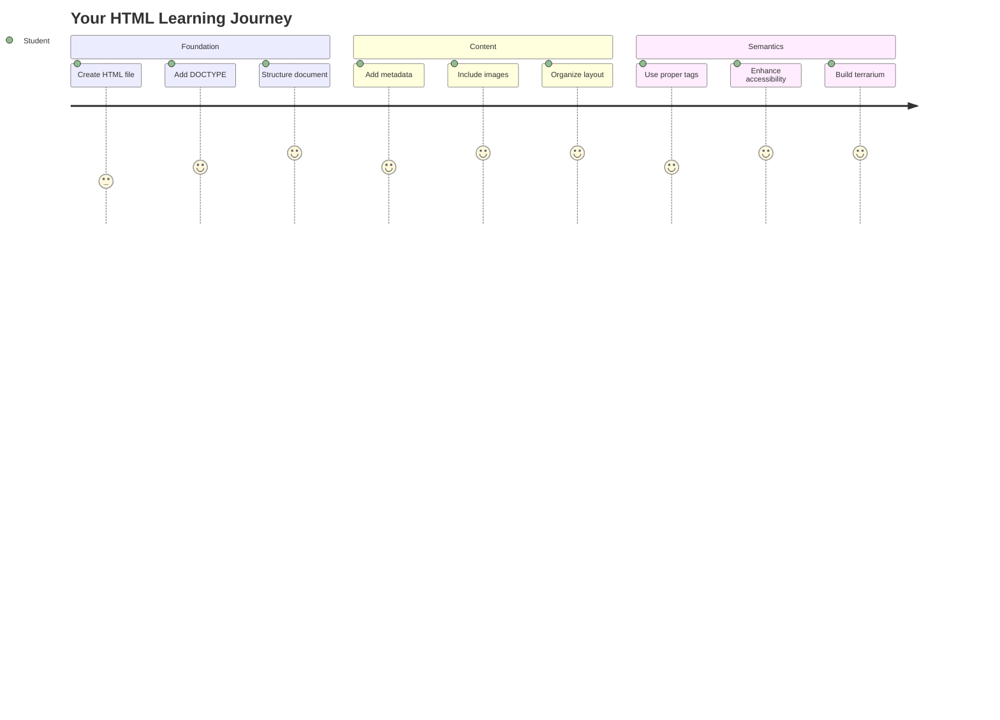
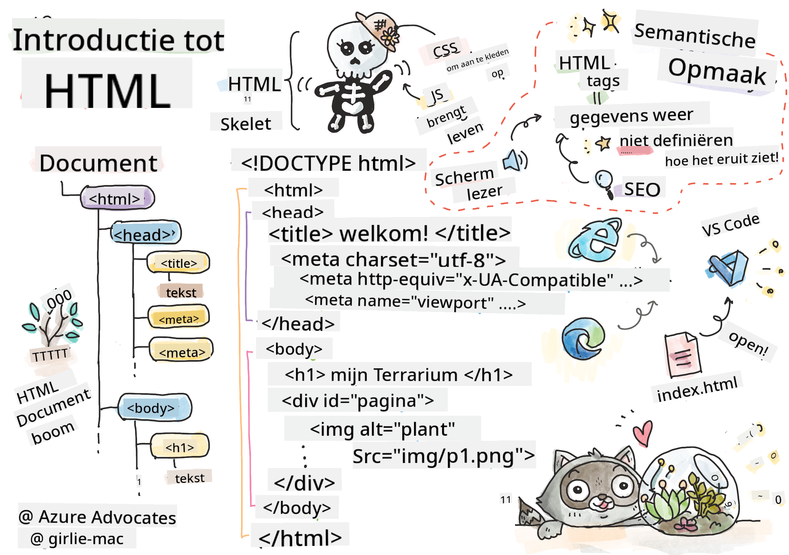
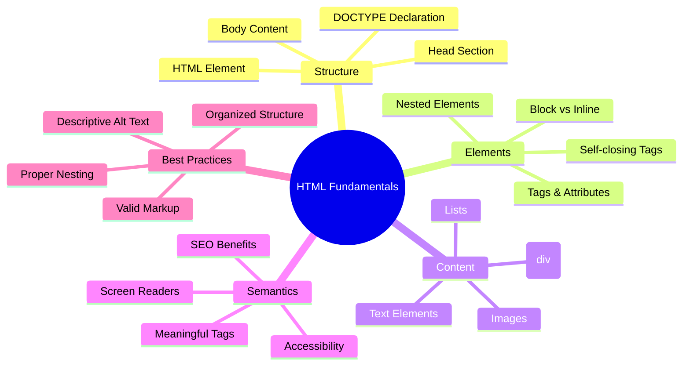
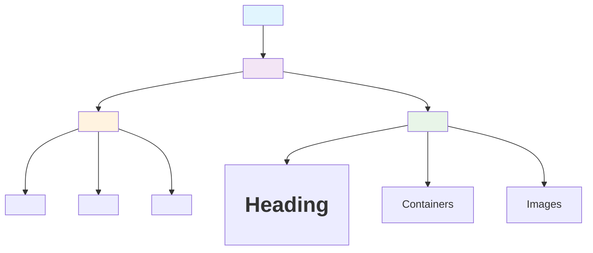
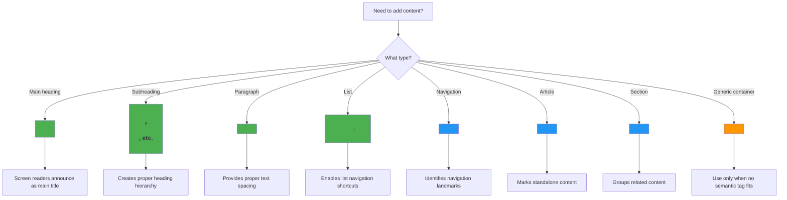
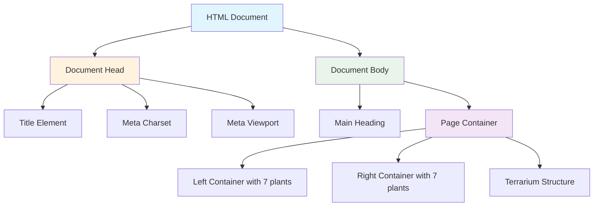
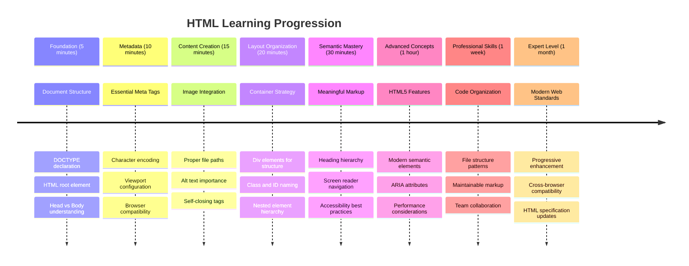

<!--
CO_OP_TRANSLATOR_METADATA:
{
  "original_hash": "3fcfa99c4897e051b558b5eaf1e8cc74",
  "translation_date": "2025-11-04T01:58:55+00:00",
  "source_file": "3-terrarium/1-intro-to-html/README.md",
  "language_code": "nl"
}
-->
# Terrarium Project Deel 1: Introductie tot HTML




> Sketchnote door [Tomomi Imura](https://twitter.com/girlie_mac)

HTML, of HyperText Markup Language, is de basis van elke website die je ooit hebt bezocht. Zie HTML als het skelet dat structuur geeft aan webpagina's – het bepaalt waar de inhoud komt, hoe het georganiseerd is en wat elk onderdeel betekent. Terwijl CSS later je HTML "aankleedt" met kleuren en lay-outs, en JavaScript het tot leven brengt met interactiviteit, biedt HTML de essentiële structuur die alles mogelijk maakt.

In deze les maak je de HTML-structuur voor een virtuele terrariuminterface. Dit praktische project leert je de fundamentele HTML-concepten terwijl je iets visueel aantrekkelijks bouwt. Je leert hoe je inhoud organiseert met semantische elementen, werkt met afbeeldingen en de basis legt voor een interactieve webapplicatie.

Aan het einde van deze les heb je een werkende HTML-pagina die plantafbeeldingen in georganiseerde kolommen weergeeft, klaar om gestyled te worden in de volgende les. Maak je geen zorgen als het er in het begin eenvoudig uitziet – dat is precies wat HTML moet doen voordat CSS de visuele afwerking toevoegt.



## Pre-Les Quiz

[Pre-les quiz](https://ff-quizzes.netlify.app/web/quiz/15)

> 📺 **Kijk en Leer**: Bekijk deze handige video-overzicht
> 
> [](https://www.youtube.com/watch?v=1TvxJKBzhyQ)

## Je Project Instellen

Voordat we in de HTML-code duiken, laten we een goede werkruimte opzetten voor je terrariumproject. Het creëren van een georganiseerde bestandsstructuur vanaf het begin is een cruciale gewoonte die je goed van pas zal komen tijdens je webontwikkelingsreis.

### Taak: Maak je Projectstructuur

Je maakt een speciale map voor je terrariumproject en voegt je eerste HTML-bestand toe. Hier zijn twee benaderingen die je kunt gebruiken:

**Optie 1: Gebruik Visual Studio Code**
1. Open Visual Studio Code
2. Klik op "File" → "Open Folder" of gebruik `Ctrl+K, Ctrl+O` (Windows/Linux) of `Cmd+K, Cmd+O` (Mac)
3. Maak een nieuwe map genaamd `terrarium` en selecteer deze
4. Klik in het Explorer-paneel op het pictogram "New File"
5. Noem je bestand `index.html`


**Optie 2: Gebruik Terminalcommando's**
```bash
mkdir terrarium
cd terrarium
touch index.html
code index.html
```

**Wat deze commando's doen:**
- **Maakt** een nieuwe map genaamd `terrarium` voor je project
- **Navigeert** naar de terrarium-map
- **Maakt** een leeg `index.html` bestand
- **Opent** het bestand in Visual Studio Code om te bewerken

> 💡 **Handige Tip**: De bestandsnaam `index.html` is speciaal in webontwikkeling. Wanneer iemand een website bezoekt, zoeken browsers automatisch naar `index.html` als de standaardpagina om weer te geven. Dit betekent dat een URL zoals `https://mysite.com/projects/` automatisch het bestand `index.html` uit de map `projects` weergeeft zonder dat de bestandsnaam in de URL hoeft te worden opgegeven.

## Begrip van HTML Documentstructuur

Elk HTML-document volgt een specifieke structuur die browsers nodig hebben om correct te begrijpen en weer te geven. Zie deze structuur als een formele brief – het heeft vereiste elementen in een bepaalde volgorde die de ontvanger (in dit geval de browser) helpen de inhoud correct te verwerken.



Laten we beginnen met het toevoegen van de essentiële basis die elk HTML-document nodig heeft.

### De DOCTYPE Declaratie en Root Element

De eerste twee regels van elk HTML-bestand dienen als de "introductie" van het document aan de browser:

```html
<!DOCTYPE html>
<html></html>
```

**Wat deze code doet:**
- **Verklaart** het documenttype als HTML5 met `<!DOCTYPE html>`
- **Creëert** het root `<html>` element dat alle pagina-inhoud bevat
- **Stelt** moderne webstandaarden in voor correcte browserweergave
- **Zorgt** voor consistente weergave op verschillende browsers en apparaten

> 💡 **VS Code Tip**: Beweeg je muis over een HTML-tag in VS Code om nuttige informatie van MDN Web Docs te zien, inclusief gebruiksvoorbeelden en browsercompatibiliteitsdetails.

> 📚 **Meer leren**: De DOCTYPE-declaratie voorkomt dat browsers "quirks mode" ingaan, wat werd gebruikt om zeer oude websites te ondersteunen. Moderne webontwikkeling gebruikt de eenvoudige `<!DOCTYPE html>` declaratie om [standaard-conforme weergave](https://developer.mozilla.org/docs/Web/HTML/Quirks_Mode_and_Standards_Mode) te garanderen.

### 🔄 **Pedagogische Check-in**
**Pauzeer en Reflecteer**: Voordat je verder gaat, zorg ervoor dat je begrijpt:
- ✅ Waarom elk HTML-document een DOCTYPE-declaratie nodig heeft
- ✅ Wat het `<html>` root element bevat
- ✅ Hoe deze structuur browsers helpt pagina's correct weer te geven

**Snelle Zelftest**: Kun je in je eigen woorden uitleggen wat "standaard-conforme weergave" betekent?

## Essentiële Documentmetadata Toevoegen

De `<head>` sectie van een HTML-document bevat cruciale informatie die browsers en zoekmachines nodig hebben, maar die bezoekers niet direct op de pagina zien. Zie het als de "achter de schermen" informatie die helpt je webpagina correct te laten werken en weer te geven op verschillende apparaten en platforms.

Deze metadata vertelt browsers hoe ze je pagina moeten weergeven, welke tekencodering ze moeten gebruiken en hoe ze met verschillende schermformaten moeten omgaan – allemaal essentieel voor het maken van professionele, toegankelijke webpagina's.

### Taak: Voeg de Documentkop Toe

Voeg deze `<head>` sectie in tussen je opening en sluitende `<html>` tags:

```html
<head>
	<title>Welcome to my Virtual Terrarium</title>
	<meta charset="utf-8" />
	<meta http-equiv="X-UA-Compatible" content="IE=edge" />
	<meta name="viewport" content="width=device-width, initial-scale=1" />
</head>
```

**Wat elk element doet:**
- **Stelt** de paginatitel in die verschijnt in browsertabs en zoekresultaten
- **Specificeert** UTF-8 tekencodering voor correcte tekstweergave wereldwijd
- **Zorgt** voor compatibiliteit met moderne versies van Internet Explorer
- **Configureert** responsief ontwerp door de viewport aan te passen aan de breedte van het apparaat
- **Regelt** het initiële zoomniveau om inhoud op natuurlijke grootte weer te geven

> 🤔 **Denk Hierover Na**: Wat zou er gebeuren als je een viewport meta tag instelt zoals deze: `<meta name="viewport" content="width=600">`? Dit zou de pagina altijd 600 pixels breed maken, waardoor responsief ontwerp wordt gebroken! Lees meer over [juiste viewport configuratie](https://developer.mozilla.org/docs/Web/HTML/Viewport_meta_tag).

## De Documentbody Opbouwen

Het `<body>` element bevat alle zichtbare inhoud van je webpagina – alles wat gebruikers zullen zien en mee interactie hebben. Terwijl de `<head>` sectie instructies gaf aan de browser, bevat de `<body>` sectie de daadwerkelijke inhoud: tekst, afbeeldingen, knoppen en andere elementen die je gebruikersinterface creëren.

Laten we de body-structuur toevoegen en begrijpen hoe HTML-tags samenwerken om betekenisvolle inhoud te creëren.

### Begrip van HTML Tag Structuur

HTML gebruikt gekoppelde tags om elementen te definiëren. De meeste tags hebben een openingstag zoals `<p>` en een sluitingstag zoals `</p>`, met inhoud ertussen: `<p>Hallo, wereld!</p>`. Dit creëert een paragraafelement met de tekst "Hallo, wereld!".

### Taak: Voeg het Body Element Toe

Werk je HTML-bestand bij om het `<body>` element op te nemen:

```html
<!DOCTYPE html>
<html>
	<head>
		<title>Welcome to my Virtual Terrarium</title>
		<meta charset="utf-8" />
		<meta http-equiv="X-UA-Compatible" content="IE=edge" />
		<meta name="viewport" content="width=device-width, initial-scale=1" />
	</head>
	<body></body>
</html>
```

**Wat deze complete structuur biedt:**
- **Stelt** het basis HTML5 documentraamwerk in
- **Bevat** essentiële metadata voor correcte browserweergave
- **Creëert** een lege body klaar voor je zichtbare inhoud
- **Volgt** moderne webontwikkelingspraktijken

Nu ben je klaar om de zichtbare elementen van je terrarium toe te voegen. We gebruiken `<div>` elementen als containers om verschillende secties van inhoud te organiseren, en `` elementen om de plantafbeeldingen weer te geven.

### Werken met Afbeeldingen en Lay-out Containers

Afbeeldingen zijn speciaal in HTML omdat ze "zelfsluitende" tags gebruiken. In tegenstelling tot elementen zoals `<p></p>` die inhoud omsluiten, bevat de `` tag alle informatie die het nodig heeft binnen de tag zelf met attributen zoals `src` voor het afbeeldingsbestandspad en `alt` voor toegankelijkheid.

Voordat je afbeeldingen aan je HTML toevoegt, moet je je projectbestanden goed organiseren door een afbeeldingenmap te maken en de plantgrafieken toe te voegen.

**Eerst, stel je afbeeldingen in:**
1. Maak een map genaamd `images` in je terrarium projectmap
2. Download de plantafbeeldingen uit de [oplossingsmap](../../../../3-terrarium/solution/images) (14 plantafbeeldingen in totaal)
3. Kopieer alle plantafbeeldingen naar je nieuwe `images` map

### Taak: Maak de Plantweergave Lay-out

Voeg nu de plantafbeeldingen georganiseerd in twee kolommen toe tussen je `<body></body>` tags:

```html
<div id="page">
	<div id="left-container" class="container">
		<div class="plant-holder">
			
		</div>
		<div class="plant-holder">
			
		</div>
		<div class="plant-holder">
			
		</div>
		<div class="plant-holder">
			
		</div>
		<div class="plant-holder">
			
		</div>
		<div class="plant-holder">
			
		</div>
		<div class="plant-holder">
			
		</div>
	</div>
	<div id="right-container" class="container">
		<div class="plant-holder">
			
		</div>
		<div class="plant-holder">
			
		</div>
		<div class="plant-holder">
			
		</div>
		<div class="plant-holder">
			
		</div>
		<div class="plant-holder">
			
		</div>
		<div class="plant-holder">
			
		</div>
		<div class="plant-holder">
			
		</div>
	</div>
</div>
```

**Stap voor stap, wat er gebeurt in deze code:**
- **Creëert** een hoofdcontainer met `id="page"` om alle inhoud te bevatten
- **Stelt** twee kolomcontainers in: `left-container` en `right-container`
- **Organiseert** 7 planten in de linker kolom en 7 planten in de rechter kolom
- **Omhult** elke plantafbeelding in een `plant-holder` div voor individuele positionering
- **Past** consistente classnamen toe voor CSS-styling in de volgende les
- **Kent** unieke ID's toe aan elke plantafbeelding voor JavaScript-interactie later
- **Bevat** correcte bestandspaden die wijzen naar de afbeeldingenmap

> 🤔 **Overweeg Dit**: Merk op dat alle afbeeldingen momenteel dezelfde alt-tekst "plant" hebben. Dit is niet ideaal voor toegankelijkheid. Gebruikers van schermlezers zouden 14 keer "plant" horen zonder te weten welke specifieke plant elke afbeelding toont. Kun je betere, meer beschrijvende alt-tekst bedenken voor elke afbeelding?

> 📝 **HTML Element Types**: `<div>` elementen zijn "block-level" en nemen de volledige breedte in, terwijl `<span>` elementen "inline" zijn en alleen de benodigde breedte innemen. Wat denk je dat er zou gebeuren als je alle `<div>` tags zou veranderen in `<span>` tags?

### 🔄 **Pedagogische Check-in**
**Structuur Begrip**: Neem een moment om je HTML-structuur te bekijken:
- ✅ Kun je de hoofdcontainers in je lay-out identificeren?
- ✅ Begrijp je waarom elke afbeelding een unieke ID heeft?
- ✅ Hoe zou je het doel van de `plant-holder` divs beschrijven?

**Visuele Inspectie**: Open je HTML-bestand in een browser. Je zou moeten zien:
- Een eenvoudige lijst van plantafbeeldingen
- Afbeeldingen georganiseerd in twee kolommen
- Eenvoudige, ongestileerde lay-out

**Onthoud**: Dit eenvoudige uiterlijk is precies hoe HTML eruit zou moeten zien voordat CSS wordt toegepast!

Met deze markup toegevoegd, verschijnen de planten op het scherm, hoewel ze er nog niet gepolijst uitzien – dat is wat CSS doet in de volgende les! Voor nu heb je een solide HTML-basis die je inhoud goed organiseert en toegankelijkheidsrichtlijnen volgt.

## Semantische HTML Gebruiken voor Toegankelijkheid

Semantische HTML betekent dat je HTML-elementen kiest op basis van hun betekenis en doel, niet alleen hun uiterlijk. Wanneer je semantische markup gebruikt, communiceer je de structuur en betekenis van je inhoud aan browsers, zoekmachines en hulpmiddelen zoals schermlezers.



Deze aanpak maakt je websites toegankelijker voor gebruikers met een beperking en helpt zoekmachines je inhoud beter te begrijpen. Het is een fundamenteel principe van moderne webontwikkeling dat betere ervaringen voor iedereen creëert.

### Een Semantische Paginatitel Toevoegen

Laten we een goede kop toevoegen aan je terrariumpagina. Voeg deze regel in direct na je openingstag `<body>`:

```html
<h1>My Terrarium</h1>
```

**Waarom semantische markup belangrijk is:**
- **Helpt** schermlezers om de pagina-structuur te navigeren en te begrijpen
- **Verbetert** zoekmachineoptimalisatie (SEO) door de inhoudshiërarchie te verduidelijken
- **Verhoogt** toegankelijkheid voor gebruikers met visuele beperkingen of cognitieve verschillen
- **Creëert** betere gebruikerservaringen op alle apparaten en platforms
- **Volgt** webstandaarden en best practices voor professionele ontwikkeling

**Voorbeelden van semantische vs. niet-semantische keuzes:**

| Doel | ✅ Semantische Keuze | ❌ Niet-Semantische Keuze |
|------|---------------------|--------------------------|
| Hoofdkop | `<h1>Titel</h1>` | `<div class="big-text">Titel</div>` |
| Navigatie | `<nav><ul><li></li></ul></nav>` | `<div class="menu"><div></div></div>` |
| Knop | `<button>Klik hier</button>` | `<span onclick="...">Klik hier</span>` |
| Artikelinhoud | `<article><p></p></article>` | `<div class="content"><div></div></div>` |

> 🎥 **Bekijk Het in Actie**: Bekijk [hoe schermlezers omgaan met webpagina's](https://www.youtube.com/watch?v=OUDV1gqs9GA) om te begrijpen waarom semantische markup cruciaal is voor toegankelijkheid. Merk op hoe een goede HTML-structuur gebruikers helpt efficiënt te navigeren.

## De Terrariumcontainer Maken

Laten we nu de HTML-structuur toevoegen voor het terrarium zelf – de glazen container waar planten uiteindelijk worden geplaatst. Dit gedeelte demonstreert een belangrijk concept: HTML biedt structuur, maar zonder CSS-styling zijn deze elementen nog niet zichtbaar.

De terrariummarkup gebruikt beschrijvende classnamen die CSS-styling intuïtief en onderhoudbaar maken in de volgende les.

### Taak: Voeg de Terrariumstructuur Toe

Voeg deze markup in boven de laatste `</div>` tag (voor de sluitingstag van de pagina-container):

```html
<div id="terrarium">
	<div class="jar-top"></div>
	<div class="jar-walls">
		<div class="jar-glossy-long"></div>
		<div class="jar-glossy-short"></div>
	</div>
	<div class="dirt"></div>
	<div class="jar-bottom"></div>
</div>
```

**Begrip van deze terrariumstructuur:**
- **Creëert** een hoofdterrariumcontainer met een unieke ID voor styling
- **Definieert** afzonderlijke elementen voor elke visuele component (bovenkant, muren, aarde, onderkant)
- **Bevat** geneste elementen voor glaseffecten (glanzende elementen)
- **Gebruikt** beschrijvende classnamen die duidelijk het doel van elk element aangeven
- **Bereidt** de structuur voor op CSS-styling die het uiterlijk van een glazen terrarium zal creëren

> 🤔 **Merk je iets op?**: Hoewel je deze markup hebt toegevoegd, zie je nog niets nieuws op de pagina! Dit illustreert perfect hoe HTML structuur biedt, terwijl CSS zorgt voor het uiterlijk. Deze `<div>`-elementen bestaan, maar hebben nog geen visuele styling – dat komt in de volgende les!



### 🔄 **Pedagogische Check-in**
**Beheersing van HTML-structuur**: Voordat je verder gaat, zorg ervoor dat je:
- ✅ Het verschil kunt uitleggen tussen HTML-structuur en visueel uiterlijk
- ✅ Semantische versus niet-semantische HTML-elementen kunt identificeren
- ✅ Kunt beschrijven hoe correcte markup de toegankelijkheid verbetert
- ✅ De volledige documentboomstructuur kunt herkennen

**Test je begrip**: Probeer je HTML-bestand te openen in een browser met JavaScript uitgeschakeld en CSS verwijderd. Dit toont je de pure semantische structuur die je hebt gecreëerd!

---

## GitHub Copilot Agent Challenge

Gebruik de Agent-modus om de volgende uitdaging te voltooien:

**Beschrijving:** Maak een semantische HTML-structuur voor een sectie over plantenverzorging die kan worden toegevoegd aan het terrariumproject.

**Prompt:** Maak een semantische HTML-sectie met een hoofdkop "Plantenverzorgingsgids", drie subsecties met koppen "Water geven", "Lichtvereisten" en "Bodemverzorging", elk met een alinea met informatie over plantenverzorging. Gebruik correcte semantische HTML-tags zoals `<section>`, `<h2>`, `<h3>` en `<p>` om de inhoud op de juiste manier te structureren.

Lees meer over [agent mode](https://code.visualstudio.com/blogs/2025/02/24/introducing-copilot-agent-mode) hier.

## HTML Geschiedenis Uitdaging

**Leren over de evolutie van het web**

HTML is aanzienlijk geëvolueerd sinds Tim Berners-Lee in 1990 de eerste webbrowser bij CERN creëerde. Sommige oudere tags zoals `<marquee>` zijn nu verouderd omdat ze niet goed werken met moderne toegankelijkheidsnormen en principes van responsief ontwerp.

**Probeer dit experiment:**
1. Omhul tijdelijk je `<h1>`-titel met een `<marquee>`-tag: `<marquee><h1>Mijn Terrarium</h1></marquee>`
2. Open je pagina in een browser en observeer het scroll-effect
3. Overweeg waarom deze tag is verouderd (hint: denk aan gebruikerservaring en toegankelijkheid)
4. Verwijder de `<marquee>`-tag en keer terug naar semantische markup

**Reflectievragen:**
- Hoe kan een scrollende titel gebruikers met visuele beperkingen of gevoeligheid voor beweging beïnvloeden?
- Welke moderne CSS-technieken kunnen vergelijkbare visuele effecten bereiken op een meer toegankelijke manier?
- Waarom is het belangrijk om huidige webstandaarden te gebruiken in plaats van verouderde elementen?

Ontdek meer over [verouderde en afgeschafte HTML-elementen](https://developer.mozilla.org/docs/Web/HTML/Element#Obsolete_and_deprecated_elements) om te begrijpen hoe webstandaarden evolueren om de gebruikerservaring te verbeteren.

## Quiz na de les

[Quiz na de les](https://ff-quizzes.netlify.app/web/quiz/16)

## Review & Zelfstudie

**Verdiep je HTML-kennis**

HTML is al meer dan 30 jaar de basis van het web en is geëvolueerd van een eenvoudige documentopmaaktaal naar een geavanceerd platform voor het bouwen van interactieve applicaties. Het begrijpen van deze evolutie helpt je moderne webstandaarden te waarderen en betere ontwikkelingsbeslissingen te nemen.

**Aanbevolen leerpaden:**

1. **HTML Geschiedenis en Evolutie**
   - Onderzoek de tijdlijn van HTML 1.0 tot HTML5
   - Ontdek waarom bepaalde tags zijn verouderd (toegankelijkheid, mobielvriendelijkheid, onderhoudbaarheid)
   - Onderzoek opkomende HTML-functies en voorstellen

2. **Semantische HTML Verdieping**
   - Bestudeer de volledige lijst van [HTML5 semantische elementen](https://developer.mozilla.org/docs/Web/HTML/Element)
   - Oefen met het identificeren wanneer je `<article>`, `<section>`, `<aside>` en `<main>` moet gebruiken
   - Leer over ARIA-attributen voor verbeterde toegankelijkheid

3. **Moderne Webontwikkeling**
   - Ontdek [het bouwen van responsieve websites](https://docs.microsoft.com/learn/modules/build-simple-website/?WT.mc_id=academic-77807-sagibbon) op Microsoft Learn
   - Begrijp hoe HTML integreert met CSS en JavaScript
   - Leer over webprestaties en SEO best practices

**Reflectievragen:**
- Welke verouderde HTML-tags heb je ontdekt en waarom zijn ze verwijderd?
- Welke nieuwe HTML-functies worden voorgesteld voor toekomstige versies?
- Hoe draagt semantische HTML bij aan webtoegankelijkheid en SEO?

### ⚡ **Wat je in de komende 5 minuten kunt doen**
- [ ] Open DevTools (F12) en inspecteer de HTML-structuur van je favoriete website
- [ ] Maak een eenvoudige HTML-bestand met basistags: `<h1>`, `<p>` en ``
- [ ] Valideer je HTML met de W3C HTML Validator online
- [ ] Probeer een opmerking toe te voegen aan je HTML met `<!-- comment -->`

### 🎯 **Wat je in dit uur kunt bereiken**
- [ ] Maak de quiz na de les af en herzie semantische HTML-concepten
- [ ] Bouw een eenvoudige webpagina over jezelf met een correcte HTML-structuur
- [ ] Experimenteer met verschillende kopniveaus en tekstopmaak-tags
- [ ] Voeg afbeeldingen en links toe om multimedia-integratie te oefenen
- [ ] Onderzoek HTML5-functies die je nog niet hebt geprobeerd

### 📅 **Jouw weeklange HTML-reis**
- [ ] Voltooi de terrariumprojectopdracht met semantische markup
- [ ] Maak een toegankelijke webpagina met ARIA-labels en rollen
- [ ] Oefen met het maken van formulieren met verschillende invoertypen
- [ ] Verken HTML5 API's zoals localStorage of geolocatie
- [ ] Bestudeer responsieve HTML-patronen en mobiel-eerst ontwerp
- [ ] Bekijk de HTML-code van andere ontwikkelaars voor best practices

### 🌟 **Jouw maandlange webbasis**
- [ ] Bouw een portfolio website die je HTML-vaardigheden laat zien
- [ ] Leer HTML-templating met een framework zoals Handlebars
- [ ] Draag bij aan open source-projecten door HTML-documentatie te verbeteren
- [ ] Beheers geavanceerde HTML-concepten zoals aangepaste elementen
- [ ] Integreer HTML met CSS-frameworks en JavaScript-bibliotheken
- [ ] Begeleid anderen die HTML-grondbeginselen leren

## 🎯 Jouw HTML-beheersingstijdlijn



### 🛠️ Samenvatting van jouw HTML-toolkit

Na het voltooien van deze les heb je nu:
- **Documentstructuur**: Complete HTML5-basis met correcte DOCTYPE
- **Semantische markup**: Betekenisvolle tags die toegankelijkheid en SEO verbeteren
- **Afbeeldingsintegratie**: Correcte bestandsorganisatie en alt-tekstpraktijken
- **Layoutcontainers**: Strategisch gebruik van divs met beschrijvende classnamen
- **Bewustzijn van toegankelijkheid**: Begrip van schermlezer-navigatie
- **Moderne standaarden**: Huidige HTML5-praktijken en kennis van verouderde tags
- **Projectbasis**: Stevige basis voor CSS-styling en JavaScript-interactiviteit

**Volgende stappen**: Jouw HTML-structuur is klaar voor CSS-styling! De semantische basis die je hebt gelegd, maakt de volgende les veel gemakkelijker te begrijpen.

## Opdracht

[Oefen je HTML: Bouw een blogmockup](assignment.md)

---

**Disclaimer**:  
Dit document is vertaald met behulp van de AI-vertalingsservice [Co-op Translator](https://github.com/Azure/co-op-translator). Hoewel we streven naar nauwkeurigheid, dient u zich ervan bewust te zijn dat geautomatiseerde vertalingen fouten of onnauwkeurigheden kunnen bevatten. Het originele document in de oorspronkelijke taal moet worden beschouwd als de gezaghebbende bron. Voor kritieke informatie wordt professionele menselijke vertaling aanbevolen. Wij zijn niet aansprakelijk voor misverstanden of verkeerde interpretaties die voortvloeien uit het gebruik van deze vertaling.