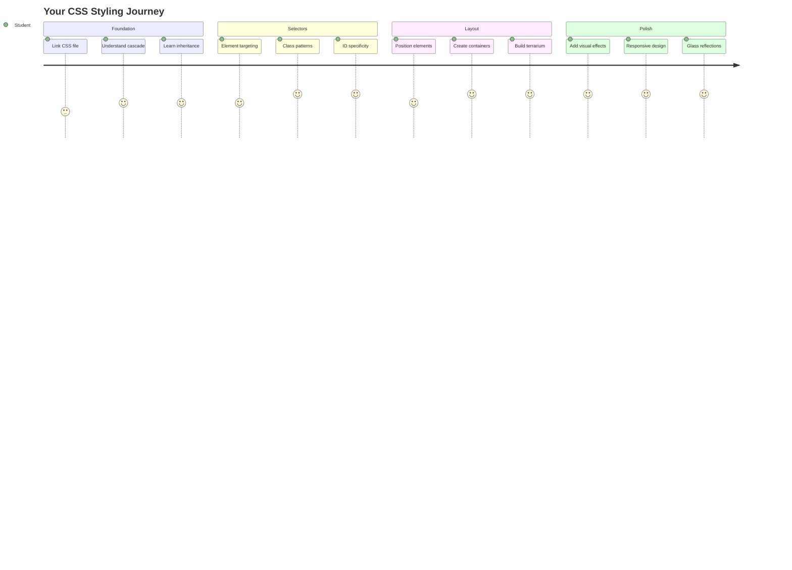
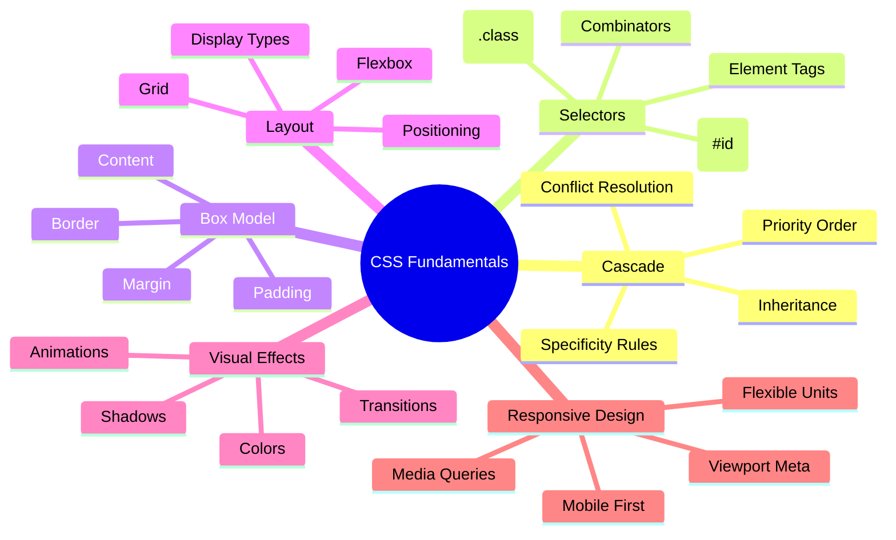
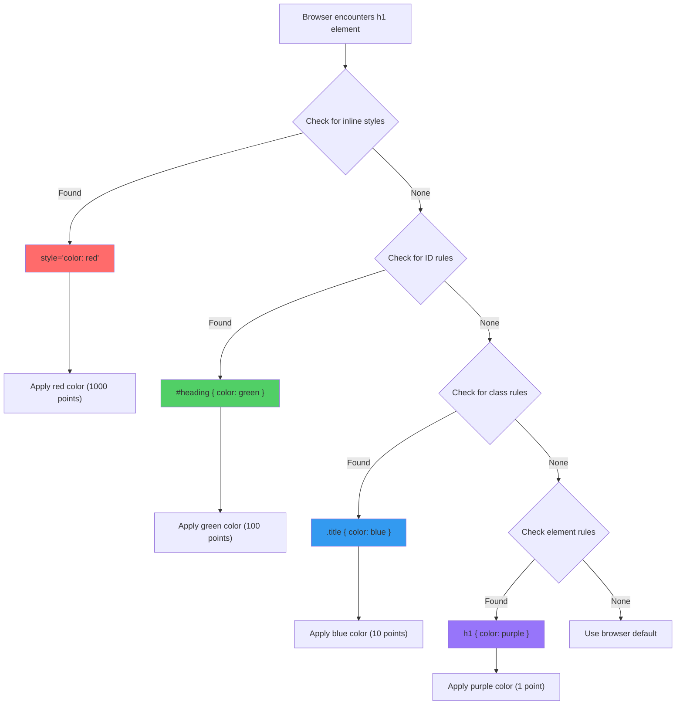
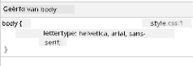
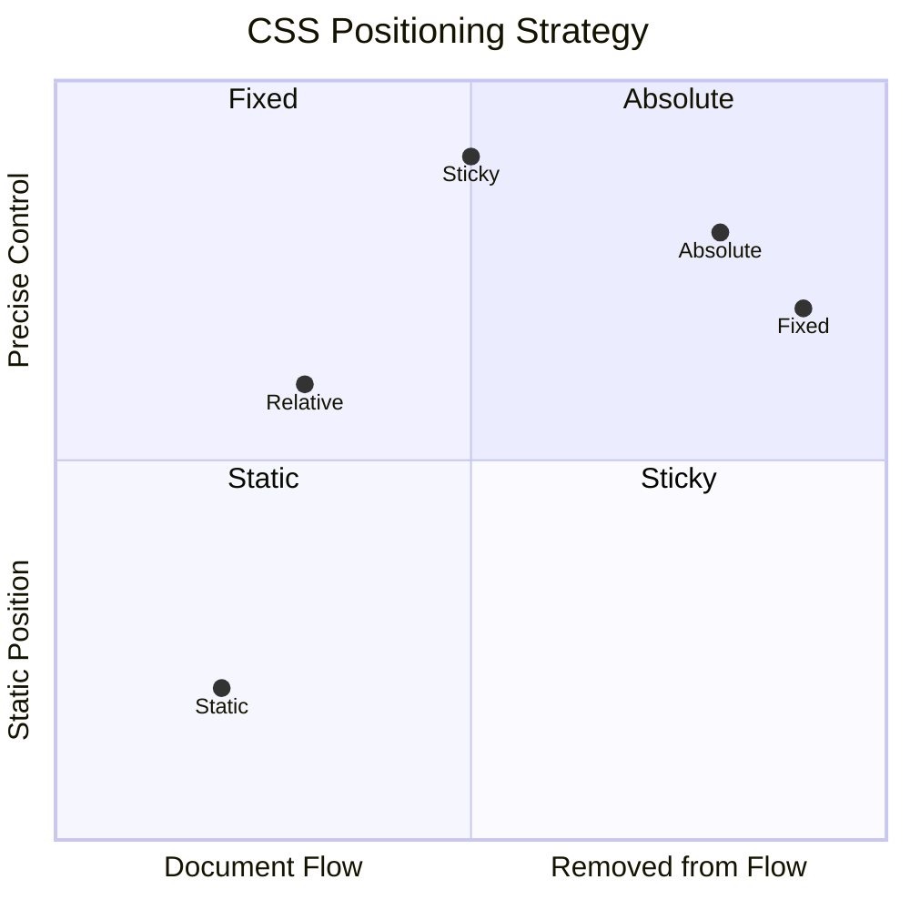
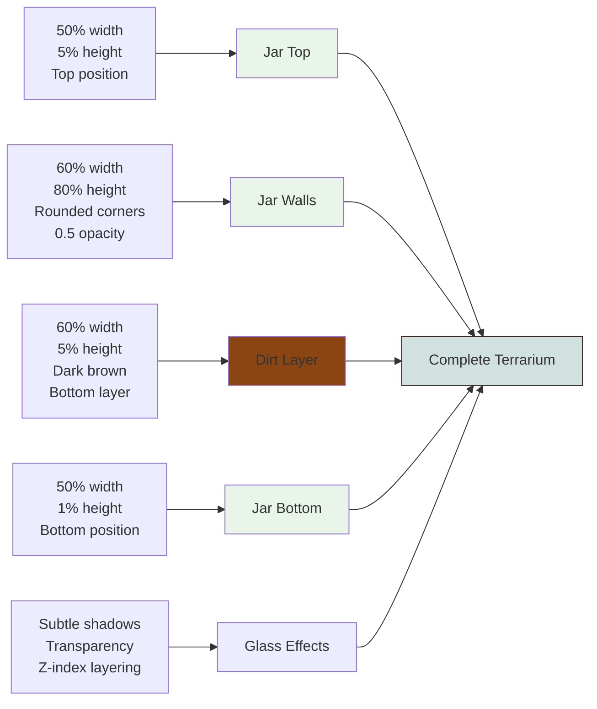
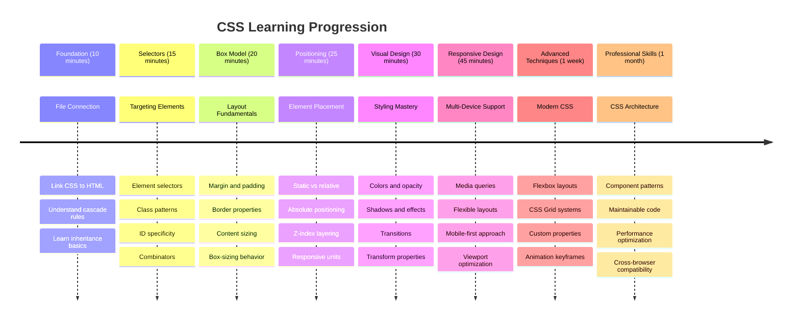

<!--
CO_OP_TRANSLATOR_METADATA:
{
  "original_hash": "e39f3a4e3bcccf94639e3af1248f8a4d",
  "translation_date": "2025-11-04T01:58:16+00:00",
  "source_file": "3-terrarium/2-intro-to-css/README.md",
  "language_code": "nl"
}
-->
# Terrarium Project Deel 2: Introductie tot CSS




> Sketchnote door [Tomomi Imura](https://twitter.com/girlie_mac)

Weet je nog hoe je HTML-terrarium er vrij basic uitzag? Met CSS transformeren we die eenvoudige structuur tot iets visueel aantrekkelijks.

Als HTML het frame van een huis is, dan is CSS alles wat het huis gezellig maakt - de verfkleuren, de inrichting, de verlichting en hoe de kamers samenkomen. Denk aan hoe het Paleis van Versailles begon als een eenvoudige jachthut, maar door aandacht voor decoratie en indeling werd omgetoverd tot een van de meest indrukwekkende gebouwen ter wereld.

Vandaag gaan we je terrarium transformeren van functioneel naar verfijnd. Je leert hoe je elementen precies positioneert, layouts laat reageren op verschillende schermformaten en visuele aantrekkingskracht creëert die websites boeiend maakt.

Aan het einde van deze les zul je zien hoe strategische CSS-styling je project aanzienlijk kan verbeteren. Laten we wat stijl toevoegen aan je terrarium.



## Pre-Lecture Quiz

[Pre-lecture quiz](https://ff-quizzes.netlify.app/web/quiz/17)

## Aan de slag met CSS

CSS wordt vaak gezien als "dingen mooi maken," maar het heeft een veel bredere functie. CSS is als de regisseur van een film - je bepaalt niet alleen hoe alles eruitziet, maar ook hoe het beweegt, reageert op interactie en zich aanpast aan verschillende situaties.

Moderne CSS is ongelooflijk krachtig. Je kunt code schrijven die automatisch layouts aanpast voor telefoons, tablets en desktopcomputers. Je kunt vloeiende animaties maken die de aandacht van gebruikers sturen waar nodig. Het resultaat kan indrukwekkend zijn wanneer alles goed samenwerkt.

> 💡 **Pro Tip**: CSS evolueert voortdurend met nieuwe functies en mogelijkheden. Controleer altijd [CanIUse.com](https://caniuse.com) om te zien of browsers de nieuwste CSS-functies ondersteunen voordat je ze in productie gebruikt.

**Dit gaan we bereiken in deze les:**
- **Creëert** een complete visuele vormgeving voor je terrarium met moderne CSS-technieken
- **Verkent** fundamentele concepten zoals de cascade, overerving en CSS-selectors
- **Implementeert** responsieve positionering en layoutstrategieën
- **Bouwt** de terrariumcontainer met CSS-vormen en styling

### Vereisten

Je moet de HTML-structuur voor je terrarium uit de vorige les hebben voltooid en klaar hebben om te stylen.

> 📺 **Videobron**: Bekijk deze handige video walkthrough
>
> [](https://www.youtube.com/watch?v=6yIdOIV9p1I)

### Je CSS-bestand instellen

Voordat we kunnen beginnen met stylen, moeten we CSS koppelen aan onze HTML. Deze koppeling vertelt de browser waar de stylinginstructies voor ons terrarium te vinden zijn.

Maak in je terrariummap een nieuw bestand genaamd `style.css` en link het in het `<head>`-gedeelte van je HTML-document:

```html
<link rel="stylesheet" href="./style.css" />
```

**Wat deze code doet:**
- **Creëert** een verbinding tussen je HTML- en CSS-bestanden
- **Vertelt** de browser om de stijlen uit `style.css` te laden en toe te passen
- **Gebruikt** het attribuut `rel="stylesheet"` om aan te geven dat dit een CSS-bestand is
- **Verwijst** naar het bestandspad met `href="./style.css"`

## De CSS Cascade begrijpen

Heb je je ooit afgevraagd waarom CSS "Cascading" Style Sheets wordt genoemd? Stijlen stromen als een waterval naar beneden en soms conflicteren ze met elkaar.

Denk aan hoe militaire bevelstructuren werken - een algemeen bevel kan zeggen "alle troepen dragen groen," maar een specifiek bevel voor jouw eenheid kan zeggen "draag ceremonieel blauw voor de ceremonie." Het meer specifieke bevel heeft voorrang. CSS volgt een vergelijkbare logica, en het begrijpen van deze hiërarchie maakt het debuggen veel eenvoudiger.

### Experimenteren met Cascade Prioriteit

Laten we de cascade in actie zien door een stijlconflict te creëren. Voeg eerst een inline stijl toe aan je `<h1>`-tag:

```html
<h1 style="color: red">My Terrarium</h1>
```

**Wat deze code doet:**
- **Past** een rode kleur direct toe op het `<h1>`-element met inline styling
- **Gebruikt** het attribuut `style` om CSS direct in de HTML in te voegen
- **Creëert** de hoogste prioriteit stijlregel voor dit specifieke element

Voeg vervolgens deze regel toe aan je `style.css`-bestand:

```css
h1 {
  color: blue;
}
```

**In het bovenstaande hebben we:**
- **Gedefinieerd** een CSS-regel die alle `<h1>`-elementen target
- **Ingesteld** dat de tekstkleur blauw is met een externe stylesheet
- **Gecreëerd** een regel met lagere prioriteit vergeleken met inline stijlen

✅ **Kennischeck**: Welke kleur wordt weergegeven in je webapp? Waarom wint die kleur? Kun je scenario's bedenken waarin je stijlen zou willen overschrijven?



> 💡 **CSS Prioriteitsvolgorde (hoogste naar laagste):**
> 1. **Inline stijlen** (style-attribuut)
> 2. **IDs** (#myId)
> 3. **Classes** (.myClass) en attributen
> 4. **Element selectors** (h1, div, p)
> 5. **Browserstandaarden**

## CSS Overerving in actie

CSS-overerving werkt als genetica - elementen erven bepaalde eigenschappen van hun ouderelementen. Als je de lettertypefamilie instelt op het body-element, gebruikt alle tekst binnenin automatisch datzelfde lettertype. Het is vergelijkbaar met hoe de kenmerkende kaaklijn van de Habsburg-familie generaties lang verscheen zonder specifiek voor elk individu te worden ingesteld.

Niet alles wordt echter geërfd. Tekststijlen zoals lettertypes en kleuren worden wel geërfd, maar layout-eigenschappen zoals marges en randen niet. Net zoals kinderen fysieke kenmerken kunnen erven, maar niet de modekeuzes van hun ouders.

### Font-overerving observeren

Laten we overerving in actie zien door een lettertypefamilie in te stellen op het `<body>`-element:

```css
body {
  font-family: 'Segoe UI', Tahoma, Geneva, Verdana, sans-serif;
}
```

**Wat hier gebeurt:**
- **Stelt** de lettertypefamilie in voor de hele pagina door het `<body>`-element te targeten
- **Gebruikt** een lettertypestack met fallback-opties voor betere browsercompatibiliteit
- **Past** moderne systeemlettertypes toe die er goed uitzien op verschillende besturingssystemen
- **Zorgt ervoor** dat alle kindelementen dit lettertype erven, tenzij specifiek overschreven

Open de ontwikkelaarstools van je browser (F12), ga naar het tabblad Elements en inspecteer je `<h1>`-element. Je zult zien dat het de lettertypefamilie van het body-element erft:



✅ **Experimenteren**: Probeer andere overerfbare eigenschappen in te stellen op `<body>` zoals `color`, `line-height` of `text-align`. Wat gebeurt er met je koptekst en andere elementen?

> 📝 **Overerfbare eigenschappen zijn onder andere**: `color`, `font-family`, `font-size`, `line-height`, `text-align`, `visibility`
>
> **Niet-overerfbare eigenschappen zijn onder andere**: `margin`, `padding`, `border`, `width`, `height`, `position`

### 🔄 **Pedagogische Check-in**
**CSS Basisbegrip**: Voordat je verder gaat met selectors, zorg ervoor dat je:
- ✅ Het verschil tussen cascade en overerving kunt uitleggen
- ✅ Kunt voorspellen welke stijl wint in een specificiteitsconflict
- ✅ Kunt identificeren welke eigenschappen van ouderelementen worden geërfd
- ✅ CSS-bestanden correct kunt koppelen aan HTML

**Snelle test**: Als je deze stijlen hebt, welke kleur zal een `<h1>` binnen een `<div class="special">` hebben?
```css
div { color: blue; }
.special { color: green; }
h1 { color: red; }
```
*Antwoord: Rood (element selector target direct h1)*

## CSS Selectors beheersen

CSS-selectors zijn jouw manier om specifieke elementen te targeten voor styling. Ze werken als het geven van precieze aanwijzingen - in plaats van te zeggen "het huis," kun je zeggen "het blauwe huis met de rode deur aan Maple Street."

CSS biedt verschillende manieren om specifiek te zijn, en de juiste selector kiezen is als het kiezen van het juiste gereedschap voor de taak. Soms moet je alle deuren in de buurt stylen, en soms slechts één specifieke deur.

### Element Selectors (Tags)

Element selectors targeten HTML-elementen op hun tagnaam. Ze zijn perfect voor het instellen van basisstijlen die breed toepasbaar zijn op je pagina:

```css
body {
  font-family: 'Segoe UI', Tahoma, Geneva, Verdana, sans-serif;
  margin: 0;
  padding: 0;
}

h1 {
  color: #3a241d;
  text-align: center;
  font-size: 2.5rem;
  margin-bottom: 1rem;
}
```

**Begrip van deze stijlen:**
- **Stelt** consistente typografie in voor de hele pagina met de `body` selector
- **Verwijdert** standaard browsermarges en -padding voor betere controle
- **Stijlt** alle koptekstelementen met kleur, uitlijning en ruimte
- **Gebruikt** `rem`-eenheden voor schaalbare, toegankelijke lettergrootte

Hoewel element selectors goed werken voor algemene styling, heb je meer specifieke selectors nodig om individuele componenten zoals de planten in je terrarium te stylen.

### ID Selectors voor unieke elementen

ID selectors gebruiken het `#`-symbool en targeten elementen met specifieke `id`-attributen. Omdat IDs uniek moeten zijn op een pagina, zijn ze perfect voor het stylen van individuele, speciale elementen zoals onze linker- en rechterplantcontainers.

Laten we de styling maken voor de zijcontainers van ons terrarium waar de planten komen te staan:

```css
#left-container {
  background-color: #f5f5f5;
  width: 15%;
  left: 0;
  top: 0;
  position: absolute;
  height: 100vh;
  padding: 1rem;
  box-sizing: border-box;
}

#right-container {
  background-color: #f5f5f5;
  width: 15%;
  right: 0;
  top: 0;
  position: absolute;
  height: 100vh;
  padding: 1rem;
  box-sizing: border-box;
}
```

**Wat deze code doet:**
- **Positioneert** containers aan de uiterste linker- en rechterrand met `absolute` positionering
- **Gebruikt** `vh` (viewport height) eenheden voor responsieve hoogte die zich aanpast aan schermgrootte
- **Past** `box-sizing: border-box` toe zodat padding wordt opgenomen in de totale breedte
- **Verwijdert** onnodige `px`-eenheden van nulwaarden voor schonere code
- **Stelt** een subtiele achtergrondkleur in die prettiger is voor de ogen dan felgrijs

✅ **Codekwaliteituitdaging**: Merk op hoe deze CSS het DRY (Don't Repeat Yourself) principe schendt. Kun je het herschrijven met zowel een ID als een class?

**Verbeterde aanpak:**
```html
<div id="left-container" class="container"></div>
<div id="right-container" class="container"></div>
```

```css
.container {
  background-color: #f5f5f5;
  width: 15%;
  top: 0;
  position: absolute;
  height: 100vh;
  padding: 1rem;
  box-sizing: border-box;
}

#left-container {
  left: 0;
}

#right-container {
  right: 0;
}
```

### Class Selectors voor herbruikbare stijlen

Class selectors gebruiken het `.`-symbool en zijn perfect wanneer je dezelfde stijlen wilt toepassen op meerdere elementen. In tegenstelling tot IDs kunnen classes herhaaldelijk worden gebruikt in je HTML, waardoor ze ideaal zijn voor consistente stylingpatronen.

In ons terrarium heeft elke plant vergelijkbare styling nodig, maar ook individuele positionering. We gebruiken een combinatie van classes voor gedeelde stijlen en IDs voor unieke positionering.

**Hier is de HTML-structuur voor elke plant:**
```html
<div class="plant-holder">
  
</div>
```

**Belangrijke elementen uitgelegd:**
- **Gebruikt** `class="plant-holder"` voor consistente containerstyling voor alle planten
- **Past** `class="plant"` toe voor gedeelde afbeeldingsstyling en gedrag
- **Bevat** unieke `id="plant1"` voor individuele positionering en JavaScript-interactie
- **Biedt** beschrijvende alt-tekst voor toegankelijkheid met schermlezers

Voeg nu deze stijlen toe aan je `style.css`-bestand:

```css
.plant-holder {
  position: relative;
  height: 13%;
  left: -0.6rem;
}

.plant {
  position: absolute;
  max-width: 150%;
  max-height: 150%;
  z-index: 2;
  transition: transform 0.3s ease;
}

.plant:hover {
  transform: scale(1.05);
}
```

**Wat deze stijlen doen:**
- **Creëert** relatieve positionering voor de plantcontainer om een positioneringscontext te creëren
- **Stelt** elke plantcontainer in op 13% hoogte, zodat alle planten verticaal passen zonder te scrollen
- **Verschuift** containers iets naar links om planten beter te centreren binnen hun containers
- **Laat** planten responsief schalen met `max-width` en `max-height` eigenschappen
- **Gebruikt** `z-index` om planten boven andere elementen in het terrarium te plaatsen
- **Voegt** een subtiel hover-effect toe met CSS-transities voor betere gebruikersinteractie

✅ **Kritisch nadenken**: Waarom hebben we zowel `.plant-holder` als `.plant` selectors nodig? Wat zou er gebeuren als we proberen slechts één te gebruiken?

> 💡 **Ontwerppatroon**: De container (`.plant-holder`) regelt layout en positionering, terwijl de inhoud (`.plant`) het uiterlijk en de schaal regelt. Deze scheiding maakt de code beter onderhoudbaar en flexibeler.

## CSS Positionering begrijpen

CSS-positionering is als het zijn van de toneelregisseur van een voorstelling - je bepaalt waar elke acteur staat en hoe ze zich over het podium bewegen. Sommige acteurs volgen de standaardopstelling, terwijl anderen specifieke positionering nodig hebben voor dramatisch effect.

Zodra je positionering begrijpt, worden veel layoutuitdagingen beheersbaar. Heb je een navigatiebalk nodig die bovenaan blijft terwijl gebruikers scrollen? Positionering regelt dat. Wil je een tooltip die op een specifieke locatie verschijnt? Dat is ook positionering.

### De vijf positioneringswaarden



| Positioneringswaarde | Gedrag | Gebruikssituatie |
|----------------------|--------|------------------|
| `static` | Standaardflow, negeert top/left/right/bottom | Normale documentlayout |
| `relative` | Gepositioneerd relatief ten opzichte van zijn normale positie | Kleine aanpassingen, creëren van positioneringscontext |
| `absolute` | Gepositioneerd relatief ten opzichte van de dichtstbijzijnde gepositioneerde voorouder | Precieze plaatsing, overlays |
| `fixed` | Gepositioneerd relatief ten opzichte van de viewport | Navigatiebalken, zwevende elementen |
| `sticky` | Wisselt tussen relatief en vast afhankelijk van scrollen | Headers die blijven plakken bij scrollen |

### Positionering in ons terrarium

Ons terrarium gebruikt een strategische combinatie van positioneringstypen om de gewenste layout te creëren:

```css
/* Container positioning */
.container {
  position: absolute; /* Removes from normal flow */
  /* ... other styles ... */
}

/* Plant holder positioning */
.plant-holder {
  position: relative; /* Creates positioning context */
  /* ... other styles ... */
}

/* Plant positioning */
.plant {
  position: absolute; /* Allows precise placement within holder */
  /* ... other styles ... */
}
```

**Begrip van de positioneringsstrategie:**
- **Absolute containers** worden uit de normale documentflow gehaald en vastgezet aan de schermranden
- **Relatieve plantcontainers** creëren een positioneringscontext terwijl ze in de documentflow blijven
- **Absolute planten** kunnen precies worden gepositioneerd binnen hun relatieve containers
- **Deze combinatie** zorgt ervoor dat planten verticaal stapelen terwijl ze individueel positioneerbaar zijn

> 🎯 **Waarom dit belangrijk is**: De `plant`-elementen hebben absolute positionering nodig om in de volgende les sleepbaar te worden. Absolute positionering haalt ze uit de normale layoutflow, waardoor sleep-en-neerzet-interacties mogelijk worden.

✅ **Experimenteren**: Probeer de positioneringswaarden te veranderen en observeer de resultaten:
- Wat gebeurt er als je `.container` verandert van `absolute` naar `relative`?
- Hoe verandert de lay-out als `.plant-holder` `absolute` gebruikt in plaats van `relative`?
- Wat gebeurt er wanneer je `.plant` naar `relative` positionering schakelt?

### 🔄 **Pedagogische Check-in**
**CSS Positionering Beheersing**: Neem een moment om je begrip te controleren:
- ✅ Kun je uitleggen waarom planten absolute positionering nodig hebben voor drag-and-drop?
- ✅ Begrijp je hoe relatieve containers een positioneringscontext creëren?
- ✅ Waarom gebruiken de zijcontainers absolute positionering?
- ✅ Wat zou er gebeuren als je helemaal geen positioneringsverklaringen gebruikt?

**Verbinden met de echte wereld**: Denk na over hoe CSS-positionering de lay-out in de echte wereld weerspiegelt:
- **Static**: Boeken op een plank (natuurlijke volgorde)
- **Relative**: Een boek iets verplaatsen maar op dezelfde plek houden
- **Absolute**: Een bladwijzer op een exacte pagina plaatsen
- **Fixed**: Een plakbriefje dat zichtbaar blijft terwijl je door de pagina's bladert

## Het bouwen van de terrarium met CSS

Nu gaan we een glazen pot bouwen met alleen CSS - geen afbeeldingen of grafische software nodig.

Het creëren van realistisch ogend glas, schaduwen en diepte-effecten met behulp van positionering en transparantie toont de visuele mogelijkheden van CSS. Deze techniek weerspiegelt hoe architecten in de Bauhaus-beweging eenvoudige geometrische vormen gebruikten om complexe, mooie structuren te maken. Zodra je deze principes begrijpt, herken je de CSS-technieken achter veel webontwerpen.



### De componenten van de glazen pot maken

Laten we de terrarium-pot stukje bij beetje bouwen. Elk onderdeel gebruikt absolute positionering en op percentages gebaseerde afmetingen voor een responsief ontwerp:

```css
.jar-walls {
  height: 80%;
  width: 60%;
  background: #d1e1df;
  border-radius: 1rem;
  position: absolute;
  bottom: 0.5%;
  left: 20%;
  opacity: 0.5;
  z-index: 1;
  box-shadow: inset 0 0 2rem rgba(0, 0, 0, 0.1);
}

.jar-top {
  width: 50%;
  height: 5%;
  background: #d1e1df;
  position: absolute;
  bottom: 80.5%;
  left: 25%;
  opacity: 0.7;
  z-index: 1;
  border-radius: 0.5rem 0.5rem 0 0;
}

.jar-bottom {
  width: 50%;
  height: 1%;
  background: #d1e1df;
  position: absolute;
  bottom: 0;
  left: 25%;
  opacity: 0.7;
  border-radius: 0 0 0.5rem 0.5rem;
}

.dirt {
  width: 60%;
  height: 5%;
  background: #3a241d;
  position: absolute;
  border-radius: 0 0 1rem 1rem;
  bottom: 1%;
  left: 20%;
  opacity: 0.7;
  z-index: -1;
}
```

**Begrip van de terrariumconstructie:**
- **Gebruikt** op percentages gebaseerde afmetingen voor schaalbaarheid op alle schermformaten
- **Positioneert** elementen absoluut om ze precies te stapelen en uit te lijnen
- **Past** verschillende waarden voor transparantie toe om het glaseffect te creëren
- **Implementeert** `z-index`-lagen zodat planten binnen de pot verschijnen
- **Voegt** subtiele box-shadow en verfijnde border-radius toe voor een realistischer uiterlijk

### Responsief ontwerp met percentages

Let op hoe alle afmetingen percentages gebruiken in plaats van vaste pixelwaarden:

**Waarom dit belangrijk is:**
- **Zorgt ervoor** dat het terrarium proportioneel schaalt op elk schermformaat
- **Behoudt** de visuele relaties tussen de potcomponenten
- **Biedt** een consistente ervaring van mobiele telefoons tot grote desktopmonitoren
- **Maakt** het ontwerp flexibel zonder de visuele lay-out te breken

### CSS-eenheden in actie

We gebruiken `rem`-eenheden voor border-radius, die schalen ten opzichte van de root-lettergrootte. Dit zorgt voor meer toegankelijke ontwerpen die rekening houden met de voorkeuren van de gebruiker. Lees meer over [CSS relatieve eenheden](https://www.w3.org/TR/css-values-3/#font-relative-lengths) in de officiële specificatie.

✅ **Visuele experimenten**: Probeer deze waarden te wijzigen en observeer de effecten:
- Verander de pottransparantie van 0.5 naar 0.8 – hoe beïnvloedt dit het glaseffect?
- Pas de kleur van de aarde aan van `#3a241d` naar `#8B4513` – wat is het visuele effect hiervan?
- Wijzig de `z-index` van de aarde naar 2 – wat gebeurt er met de lagen?

### 🔄 **Pedagogische Check-in**
**CSS Visueel Ontwerp Begrip**: Bevestig je begrip van visuele CSS:
- ✅ Hoe creëren op percentages gebaseerde afmetingen een responsief ontwerp?
- ✅ Waarom creëert transparantie het glaseffect?
- ✅ Welke rol speelt z-index bij het stapelen van elementen?
- ✅ Hoe creëren border-radius waarden de vorm van de pot?

**Ontwerpprincipe**: Let op hoe we complexe visuals bouwen uit eenvoudige vormen:
1. **Rechthoeken** → **Afgeronde rechthoeken** → **Potcomponenten**
2. **Effen kleuren** → **Transparantie** → **Glaseffect**
3. **Individuele elementen** → **Gelaagde compositie** → **3D-uitstraling**

---

## GitHub Copilot Agent Challenge 🚀

Gebruik de Agent-modus om de volgende uitdaging te voltooien:

**Beschrijving:** Maak een CSS-animatie die de terrariumplanten zachtjes heen en weer laat wiegen, waardoor een natuurlijk briesje wordt gesimuleerd. Dit helpt je om CSS-animaties, transformaties en keyframes te oefenen terwijl je de visuele aantrekkingskracht van je terrarium verbetert.

**Prompt:** Voeg CSS-keyframe-animaties toe om de planten in het terrarium zachtjes van links naar rechts te laten wiegen. Maak een wiegende animatie die elke plant lichtjes (2-3 graden) naar links en rechts draait met een duur van 3-4 seconden, en pas deze toe op de `.plant`-klasse. Zorg ervoor dat de animatie oneindig herhaalt en een easing-functie heeft voor natuurlijke beweging.

Lees meer over [agent mode](https://code.visualstudio.com/blogs/2025/02/24/introducing-copilot-agent-mode) hier.

## 🚀 Uitdaging: Glans op glas toevoegen

Klaar om je terrarium te verbeteren met realistische glans op glas? Deze techniek voegt diepte en realisme toe aan het ontwerp.

Je gaat subtiele highlights creëren die simuleren hoe licht reflecteert op glasoppervlakken. Deze aanpak is vergelijkbaar met hoe Renaissance-schilders zoals Jan van Eyck licht en reflectie gebruikten om geschilderd glas driedimensionaal te laten lijken. Dit is wat je wilt bereiken:


**Jouw uitdaging:**
- **Creëer** subtiele witte of lichtgekleurde ovale vormen voor de glans op het glas
- **Positioneer** ze strategisch aan de linkerkant van de pot
- **Pas** geschikte transparantie- en vervagingseffecten toe voor realistische lichtreflectie
- **Gebruik** `border-radius` om organische, bubbelachtige vormen te maken
- **Experimenteer** met verlopen of box-shadows voor verbeterd realisme

## Quiz na de les

[Quiz na de les](https://ff-quizzes.netlify.app/web/quiz/18)

## Breid je CSS-kennis uit

CSS kan in het begin complex lijken, maar het begrijpen van deze kernconcepten biedt een solide basis voor meer geavanceerde technieken.

**Jouw volgende CSS-leergebieden:**
- **Flexbox** - vereenvoudigt uitlijning en verdeling van elementen
- **CSS Grid** - biedt krachtige tools voor het maken van complexe lay-outs
- **CSS-variabelen** - vermindert herhaling en verbetert onderhoudbaarheid
- **Responsief ontwerp** - zorgt ervoor dat websites goed werken op verschillende schermformaten

### Interactieve leermiddelen

Oefen deze concepten met deze leuke, interactieve spellen:
- 🐸 [Flexbox Froggy](https://flexboxfroggy.com/) - Beheers Flexbox door leuke uitdagingen
- 🌱 [Grid Garden](https://codepip.com/games/grid-garden/) - Leer CSS Grid door virtuele wortels te kweken
- 🎯 [CSS Battle](https://cssbattle.dev/) - Test je CSS-vaardigheden met codeeruitdagingen

### Aanvullend leren

Voor uitgebreide CSS-basisprincipes, voltooi deze Microsoft Learn-module: [Style your HTML app with CSS](https://docs.microsoft.com/learn/modules/build-simple-website/4-css-basics/?WT.mc_id=academic-77807-sagibbon)

### ⚡ **Wat je in de komende 5 minuten kunt doen**
- [ ] Open DevTools en inspecteer CSS-stijlen op een willekeurige website met het Elementenpaneel
- [ ] Maak een eenvoudige CSS-bestand en koppel het aan een HTML-pagina
- [ ] Probeer kleuren te wijzigen met verschillende methoden: hex, RGB en benoemde kleuren
- [ ] Oefen het boxmodel door padding en margin toe te voegen aan een div

### 🎯 **Wat je in dit uur kunt bereiken**
- [ ] Voltooi de quiz na de les en herhaal de CSS-basisprincipes
- [ ] Style je HTML-pagina met lettertypen, kleuren en marges
- [ ] Maak een eenvoudige lay-out met flexbox of grid
- [ ] Experimenteer met CSS-overgangen voor vloeiende effecten
- [ ] Oefen responsief ontwerp met media queries

### 📅 **Je weeklange CSS-avontuur**
- [ ] Voltooi de terrarium-stylingopdracht met creatieve flair
- [ ] Beheers CSS Grid door een fotogalerij lay-out te maken
- [ ] Leer CSS-animaties om je ontwerpen tot leven te brengen
- [ ] Verken CSS-preprocessors zoals Sass of Less
- [ ] Bestudeer ontwerpprincipes en pas ze toe op je CSS
- [ ] Analyseer en reproduceer interessante ontwerpen die je online vindt

### 🌟 **Je maandlange ontwerpmeesterschap**
- [ ] Bouw een compleet responsief website-ontwerpsysteem
- [ ] Leer CSS-in-JS of utility-first frameworks zoals Tailwind
- [ ] Draag bij aan open source-projecten met CSS-verbeteringen
- [ ] Beheers geavanceerde CSS-concepten zoals CSS-aangepaste eigenschappen en containment
- [ ] Maak herbruikbare componentbibliotheken met modulaire CSS
- [ ] Mentor anderen die CSS leren en deel je ontwerpkennis

## 🎯 Jouw CSS-beheersingstijdlijn



### 🛠️ Samenvatting van jouw CSS-toolkit

Na het voltooien van deze les heb je nu:
- **Cascade Begrip**: Hoe stijlen erven en elkaar overschrijven
- **Selector Beheersing**: Precieze targeting met elementen, klassen en ID's
- **Positioneringsvaardigheden**: Strategische plaatsing en gelaagdheid van elementen
- **Visueel Ontwerp**: Glaseffecten, schaduwen en transparantie creëren
- **Responsieve Technieken**: Op percentages gebaseerde lay-outs die zich aanpassen aan elk scherm
- **Code Organisatie**: Schone, onderhoudbare CSS-structuur
- **Moderne Praktijken**: Gebruik van relatieve eenheden en toegankelijke ontwerpprincipes

**Volgende stappen**: Je terrarium heeft nu zowel structuur (HTML) als stijl (CSS). De laatste les voegt interactiviteit toe met JavaScript!

## Opdracht

[CSS Refactoring](assignment.md)

---

**Disclaimer**:  
Dit document is vertaald met behulp van de AI-vertalingsservice [Co-op Translator](https://github.com/Azure/co-op-translator). Hoewel we streven naar nauwkeurigheid, dient u zich ervan bewust te zijn dat geautomatiseerde vertalingen fouten of onnauwkeurigheden kunnen bevatten. Het originele document in de oorspronkelijke taal moet worden beschouwd als de gezaghebbende bron. Voor kritieke informatie wordt professionele menselijke vertaling aanbevolen. Wij zijn niet aansprakelijk voor eventuele misverstanden of verkeerde interpretaties die voortvloeien uit het gebruik van deze vertaling.