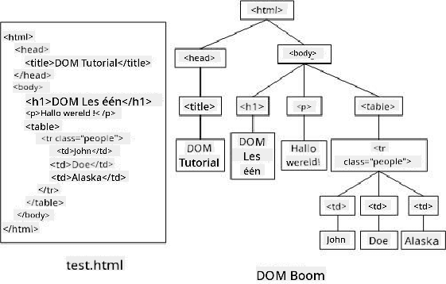

<!--
CO_OP_TRANSLATOR_METADATA:
{
  "original_hash": "30f8903a1f290e3d438dc2c70fe60259",
  "translation_date": "2025-08-27T20:07:42+00:00",
  "source_file": "3-terrarium/3-intro-to-DOM-and-closures/README.md",
  "language_code": "nl"
}
-->
# Terrarium Project Deel 3: DOM-manipulatie en een Closure


> Sketchnote door [Tomomi Imura](https://twitter.com/girlie_mac)

## Pre-Lecture Quiz

[Pre-lecture quiz](https://ashy-river-0debb7803.1.azurestaticapps.net/quiz/19)

### Introductie

Het manipuleren van de DOM, ofwel het "Document Object Model", is een belangrijk aspect van webontwikkeling. Volgens [MDN](https://developer.mozilla.org/docs/Web/API/Document_Object_Model/Introduction): "Het Document Object Model (DOM) is de gegevensrepresentatie van de objecten die de structuur en inhoud van een document op het web vormen." De uitdagingen rond DOM-manipulatie op het web hebben vaak geleid tot het gebruik van JavaScript-frameworks in plaats van vanilla JavaScript om de DOM te beheren, maar wij gaan het zelf doen!

Daarnaast introduceert deze les het idee van een [JavaScript closure](https://developer.mozilla.org/docs/Web/JavaScript/Closures), wat je kunt zien als een functie die is ingesloten door een andere functie, zodat de binnenste functie toegang heeft tot de scope van de buitenste functie.

> JavaScript closures zijn een uitgebreid en complex onderwerp. Deze les behandelt het meest basale idee: in de code van dit terrarium vind je een closure: een binnenste functie en een buitenste functie die zo zijn geconstrueerd dat de binnenste functie toegang heeft tot de scope van de buitenste functie. Voor veel meer informatie over hoe dit werkt, kun je de [uitgebreide documentatie](https://developer.mozilla.org/docs/Web/JavaScript/Closures) raadplegen.

We zullen een closure gebruiken om de DOM te manipuleren.

Zie de DOM als een boom die alle manieren vertegenwoordigt waarop een webpagina-document kan worden gemanipuleerd. Verschillende API's (Application Program Interfaces) zijn geschreven zodat programmeurs, met hun programmeertaal naar keuze, toegang hebben tot de DOM en deze kunnen bewerken, veranderen, herschikken en beheren.



> Een representatie van de DOM en de HTML-markup die hiernaar verwijst. Van [Olfa Nasraoui](https://www.researchgate.net/publication/221417012_Profile-Based_Focused_Crawler_for_Social_Media-Sharing_Websites)

In deze les zullen we ons interactieve terrariumproject voltooien door de JavaScript te maken waarmee een gebruiker de planten op de pagina kan manipuleren.

### Vereisten

Je moet de HTML en CSS voor je terrarium al hebben gebouwd. Aan het einde van deze les kun je de planten in en uit het terrarium verplaatsen door ze te slepen.

### Taak

Maak in je terrariummap een nieuw bestand genaamd `script.js`. Importeer dat bestand in de `<head>`-sectie:

```html
	<script src="./script.js" defer></script>
```

> Opmerking: gebruik `defer` bij het importeren van een extern JavaScript-bestand in het HTML-bestand, zodat de JavaScript pas wordt uitgevoerd nadat het HTML-bestand volledig is geladen. Je kunt ook het `async`-attribuut gebruiken, waarmee het script wordt uitgevoerd terwijl het HTML-bestand wordt geparsed, maar in ons geval is het belangrijk dat de HTML-elementen volledig beschikbaar zijn voor het slepen voordat we het sleep-script laten uitvoeren.
---

## De DOM-elementen

Het eerste wat je moet doen, is referenties maken naar de elementen die je wilt manipuleren in de DOM. In ons geval zijn dat de 14 planten die momenteel in de zijbalken wachten.

### Taak

```html
dragElement(document.getElementById('plant1'));
dragElement(document.getElementById('plant2'));
dragElement(document.getElementById('plant3'));
dragElement(document.getElementById('plant4'));
dragElement(document.getElementById('plant5'));
dragElement(document.getElementById('plant6'));
dragElement(document.getElementById('plant7'));
dragElement(document.getElementById('plant8'));
dragElement(document.getElementById('plant9'));
dragElement(document.getElementById('plant10'));
dragElement(document.getElementById('plant11'));
dragElement(document.getElementById('plant12'));
dragElement(document.getElementById('plant13'));
dragElement(document.getElementById('plant14'));
```

Wat gebeurt hier? Je verwijst naar het document en zoekt in de DOM naar een element met een specifieke Id. Weet je nog dat je in de eerste les over HTML individuele Id's gaf aan elke plantafbeelding (`id="plant1"`)? Nu ga je gebruik maken van die inspanning. Nadat je elk element hebt geïdentificeerd, geef je dat item door aan een functie genaamd `dragElement` die je zo meteen gaat bouwen. Zo wordt het element in de HTML sleepbaar, of zal dat binnenkort zijn.

✅ Waarom verwijzen we naar elementen via Id? Waarom niet via hun CSS-klasse? Je kunt terugkijken naar de vorige les over CSS om deze vraag te beantwoorden.

---

## De Closure

Nu ben je klaar om de `dragElement` closure te maken, een buitenste functie die een binnenste functie of functies insluit (in ons geval zullen we er drie hebben).

Closures zijn handig wanneer één of meer functies toegang nodig hebben tot de scope van een buitenste functie. Hier is een voorbeeld:

```javascript
function displayCandy(){
	let candy = ['jellybeans'];
	function addCandy(candyType) {
		candy.push(candyType)
	}
	addCandy('gumdrops');
}
displayCandy();
console.log(candy)
```

In dit voorbeeld omringt de functie `displayCandy` een functie die een nieuw type snoep toevoegt aan een array die al bestaat in de functie. Als je deze code zou uitvoeren, zou de `candy` array niet gedefinieerd zijn, omdat het een lokale variabele is (lokaal voor de closure).

✅ Hoe kun je de `candy` array toegankelijk maken? Probeer deze buiten de closure te plaatsen. Op deze manier wordt de array globaal, in plaats van alleen beschikbaar te blijven binnen de lokale scope van de closure.

### Taak

Onder de elementdeclaraties in `script.js`, maak een functie:

```javascript
function dragElement(terrariumElement) {
	//set 4 positions for positioning on the screen
	let pos1 = 0,
		pos2 = 0,
		pos3 = 0,
		pos4 = 0;
	terrariumElement.onpointerdown = pointerDrag;
}
```

`dragElement` krijgt zijn `terrariumElement` object van de declaraties bovenaan het script. Vervolgens stel je enkele lokale posities in op `0` voor het object dat aan de functie wordt doorgegeven. Dit zijn de lokale variabelen die zullen worden gemanipuleerd voor elk element terwijl je sleep- en neerzetfunctionaliteit binnen de closure toevoegt aan elk element. Het terrarium zal worden gevuld met deze gesleepte elementen, dus de applicatie moet bijhouden waar ze worden geplaatst.

Daarnaast wordt het `terrariumElement` dat aan deze functie wordt doorgegeven een `pointerdown`-event toegewezen, wat deel uitmaakt van de [web API's](https://developer.mozilla.org/docs/Web/API) die zijn ontworpen om te helpen bij DOM-beheer. `onpointerdown` wordt geactiveerd wanneer een knop wordt ingedrukt, of in ons geval, een sleepbaar element wordt aangeraakt. Deze event handler werkt zowel op [web- als mobiele browsers](https://caniuse.com/?search=onpointerdown), met enkele uitzonderingen.

✅ De [event handler `onclick`](https://developer.mozilla.org/docs/Web/API/GlobalEventHandlers/onclick) heeft veel meer ondersteuning cross-browser; waarom zou je deze hier niet gebruiken? Denk na over het exacte type scherminteractie dat je hier probeert te creëren.

---

## De Pointerdrag-functie

Het `terrariumElement` is klaar om rondgesleept te worden; wanneer het `onpointerdown`-event wordt geactiveerd, wordt de functie `pointerDrag` aangeroepen. Voeg die functie toe direct onder deze regel: `terrariumElement.onpointerdown = pointerDrag;`:

### Taak 

```javascript
function pointerDrag(e) {
	e.preventDefault();
	console.log(e);
	pos3 = e.clientX;
	pos4 = e.clientY;
}
```

Er gebeuren verschillende dingen. Ten eerste voorkom je dat de standaardevents die normaal plaatsvinden bij pointerdown optreden door `e.preventDefault();` te gebruiken. Op deze manier heb je meer controle over het gedrag van de interface.

> Kom terug naar deze regel wanneer je het scriptbestand volledig hebt gebouwd en probeer het zonder `e.preventDefault()` - wat gebeurt er?

Ten tweede, open `index.html` in een browservenster en inspecteer de interface. Wanneer je op een plant klikt, kun je zien hoe het 'e'-event wordt vastgelegd. Verdiep je in het event om te zien hoeveel informatie wordt verzameld door één pointerdown-event!  

Vervolgens stel je de lokale variabelen `pos3` en `pos4` in op e.clientX. Je kunt de `e`-waarden vinden in het inspectiepaneel. Deze waarden leggen de x- en y-coördinaten van de plant vast op het moment dat je erop klikt of deze aanraakt. Je hebt gedetailleerde controle nodig over het gedrag van de planten terwijl je ze klikt en sleept, dus je houdt hun coördinaten bij.

✅ Wordt het duidelijker waarom deze hele app is gebouwd met één grote closure? Als dat niet zo was, hoe zou je dan de scope behouden voor elk van de 14 sleepbare planten?

Voltooi de initiële functie door nog twee pointerevent-manipulaties toe te voegen onder `pos4 = e.clientY`:

```html
document.onpointermove = elementDrag;
document.onpointerup = stopElementDrag;
```
Nu geef je aan dat je wilt dat de plant wordt meegesleept met de pointer terwijl je deze beweegt, en dat het sleepgebaar stopt wanneer je de plant deselecteert. `onpointermove` en `onpointerup` maken allemaal deel uit van dezelfde API als `onpointerdown`. De interface zal nu fouten geven omdat je de functies `elementDrag` en `stopElementDrag` nog niet hebt gedefinieerd, dus bouw die vervolgens uit.

## De functies elementDrag en stopElementDrag

Je voltooit je closure door nog twee interne functies toe te voegen die bepalen wat er gebeurt wanneer je een plant sleept en stopt met slepen. Het gedrag dat je wilt is dat je op elk moment een plant kunt slepen en deze overal op het scherm kunt plaatsen. Deze interface is vrij flexibel (er is bijvoorbeeld geen dropzone) zodat je je terrarium precies kunt ontwerpen zoals je wilt door planten toe te voegen, te verwijderen en te verplaatsen.

### Taak

Voeg de functie `elementDrag` toe direct na de sluitende accolade van `pointerDrag`:

```javascript
function elementDrag(e) {
	pos1 = pos3 - e.clientX;
	pos2 = pos4 - e.clientY;
	pos3 = e.clientX;
	pos4 = e.clientY;
	console.log(pos1, pos2, pos3, pos4);
	terrariumElement.style.top = terrariumElement.offsetTop - pos2 + 'px';
	terrariumElement.style.left = terrariumElement.offsetLeft - pos1 + 'px';
}
```
In deze functie bewerk je veel van de initiële posities 1-4 die je als lokale variabelen in de buitenste functie hebt ingesteld. Wat gebeurt hier?

Terwijl je sleept, wijs je `pos1` opnieuw toe door deze gelijk te maken aan `pos3` (die je eerder hebt ingesteld als `e.clientX`) minus de huidige waarde van `e.clientX`. Je voert een soortgelijke bewerking uit op `pos2`. Vervolgens stel je `pos3` en `pos4` opnieuw in op de nieuwe x- en y-coördinaten van het element. Je kunt deze wijzigingen volgen in de console terwijl je sleept. Vervolgens manipuleer je de css-stijl van de plant om de nieuwe positie in te stellen op basis van de nieuwe posities van `pos1` en `pos2`, waarbij je de bovenste en linker x- en y-coördinaten van de plant berekent op basis van de vergelijking van de offset met deze nieuwe posities.

> `offsetTop` en `offsetLeft` zijn CSS-eigenschappen die de positie van een element instellen op basis van die van zijn ouder; de ouder kan elk element zijn dat niet als `static` is gepositioneerd. 

Al deze herberekening van positionering stelt je in staat om het gedrag van het terrarium en zijn planten nauwkeurig af te stemmen.

### Taak 

De laatste taak om de interface te voltooien is het toevoegen van de functie `stopElementDrag` na de sluitende accolade van `elementDrag`:

```javascript
function stopElementDrag() {
	document.onpointerup = null;
	document.onpointermove = null;
}
```

Deze kleine functie reset de `onpointerup`- en `onpointermove`-events zodat je de voortgang van je plant opnieuw kunt starten door deze opnieuw te slepen, of een nieuwe plant kunt beginnen te slepen.

✅ Wat gebeurt er als je deze events niet op null instelt?

Nu heb je je project voltooid!

🥇Gefeliciteerd! Je hebt je prachtige terrarium afgemaakt. 

---

## 🚀Uitdaging

Voeg een nieuwe event handler toe aan je closure om iets extra's met de planten te doen; bijvoorbeeld, dubbelklik op een plant om deze naar voren te brengen. Wees creatief!

## Post-Lecture Quiz

[Post-lecture quiz](https://ashy-river-0debb7803.1.azurestaticapps.net/quiz/20)

## Review & Zelfstudie

Hoewel het slepen van elementen over het scherm triviaal lijkt, zijn er veel manieren om dit te doen en veel valkuilen, afhankelijk van het effect dat je zoekt. Er is zelfs een volledige [drag and drop API](https://developer.mozilla.org/docs/Web/API/HTML_Drag_and_Drop_API) die je kunt proberen. We hebben deze API niet gebruikt in deze module omdat het effect dat we wilden enigszins anders was, maar probeer deze API op je eigen project en kijk wat je kunt bereiken.

Vind meer informatie over pointerevents in de [W3C-documentatie](https://www.w3.org/TR/pointerevents1/) en op [MDN web docs](https://developer.mozilla.org/docs/Web/API/Pointer_events).

Controleer altijd browsermogelijkheden met [CanIUse.com](https://caniuse.com/).

## Opdracht

[Werk nog wat meer met de DOM](assignment.md)

---

**Disclaimer**:  
Dit document is vertaald met behulp van de AI-vertalingsservice [Co-op Translator](https://github.com/Azure/co-op-translator). Hoewel we streven naar nauwkeurigheid, dient u zich ervan bewust te zijn dat geautomatiseerde vertalingen fouten of onnauwkeurigheden kunnen bevatten. Het originele document in de oorspronkelijke taal moet worden beschouwd als de gezaghebbende bron. Voor cruciale informatie wordt professionele menselijke vertaling aanbevolen. Wij zijn niet aansprakelijk voor eventuele misverstanden of verkeerde interpretaties die voortvloeien uit het gebruik van deze vertaling.