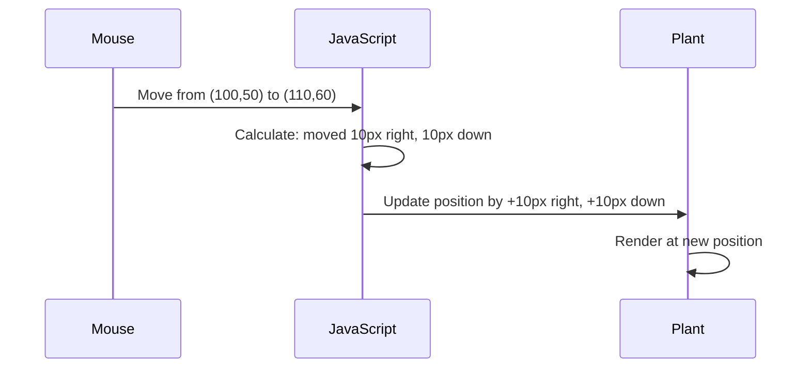

<!--
CO_OP_TRANSLATOR_METADATA:
{
  "original_hash": "bc93f6285423033ebf5b8abeb5282888",
  "translation_date": "2025-10-23T00:56:49+00:00",
  "source_file": "3-terrarium/3-intro-to-DOM-and-closures/README.md",
  "language_code": "nl"
}
-->
# Terrarium Project Deel 3: DOM-manipulatie en JavaScript Closures


> Sketchnote door [Tomomi Imura](https://twitter.com/girlie_mac)

Welkom bij een van de meest boeiende aspecten van webontwikkeling - interactief maken! Het Document Object Model (DOM) is als een brug tussen je HTML en JavaScript, en vandaag gaan we het gebruiken om je terrarium tot leven te brengen. Toen Tim Berners-Lee de eerste webbrowser creëerde, stelde hij zich een web voor waar documenten dynamisch en interactief konden zijn - het DOM maakt die visie mogelijk.

We gaan ook JavaScript closures verkennen, wat in het begin misschien intimiderend klinkt. Zie closures als het creëren van "geheugenpockets" waarin je functies belangrijke informatie kunnen onthouden. Het is alsof elke plant in je terrarium zijn eigen gegevensrecord heeft om zijn positie bij te houden. Aan het einde van deze les begrijp je hoe natuurlijk en nuttig ze zijn.

Dit is wat we gaan bouwen: een terrarium waarin gebruikers planten overal kunnen slepen en neerzetten waar ze willen. Je leert de technieken voor DOM-manipulatie die alles aandrijven, van drag-and-drop bestandsuploads tot interactieve games. Laten we je terrarium tot leven brengen.

## Quiz voor de les

[Quiz voor de les](https://ff-quizzes.netlify.app/web/quiz/19)

## Het DOM begrijpen: Jouw toegangspoort tot interactieve webpagina's

Het Document Object Model (DOM) is hoe JavaScript communiceert met je HTML-elementen. Wanneer je browser een HTML-pagina laadt, creëert het een gestructureerde representatie van die pagina in het geheugen - dat is het DOM. Zie het als een stamboom waarin elk HTML-element een familielid is dat JavaScript kan benaderen, wijzigen of herschikken.

DOM-manipulatie transformeert statische pagina's in interactieve websites. Elke keer dat je een knop van kleur ziet veranderen bij het hoveren, inhoud ziet bijwerken zonder de pagina te verversen, of elementen kunt verslepen, is dat het werk van DOM-manipulatie.


> Een weergave van het DOM en de HTML-markup die ernaar verwijst. Van [Olfa Nasraoui](https://www.researchgate.net/publication/221417012_Profile-Based_Focused_Crawler_for_Social_Media-Sharing_Websites)

**Wat maakt het DOM krachtig:**
- **Biedt** een gestructureerde manier om elk element op je pagina te benaderen
- **Maakt** dynamische inhoudsupdates mogelijk zonder pagina-verversingen
- **Reageert** in real-time op gebruikersinteracties zoals klikken en slepen
- **Creëert** de basis voor moderne interactieve webapplicaties

## JavaScript Closures: Georganiseerde, krachtige code creëren

Een [JavaScript closure](https://developer.mozilla.org/docs/Web/JavaScript/Closures) is als het geven van een functie zijn eigen privéwerkruimte met blijvend geheugen. Denk aan hoe de vinken van Darwin op de Galápagos-eilanden elk gespecialiseerde snavels ontwikkelden op basis van hun specifieke omgeving - closures werken op een vergelijkbare manier, door gespecialiseerde functies te creëren die hun specifieke context "onthouden", zelfs nadat hun ouderfunctie is voltooid.

In ons terrarium helpen closures elke plant om onafhankelijk zijn eigen positie te onthouden. Dit patroon komt veel voor in professionele JavaScript-ontwikkeling en is een waardevol concept om te begrijpen.

> 💡 **Closures begrijpen**: Closures zijn een belangrijk onderwerp in JavaScript, en veel ontwikkelaars gebruiken ze jarenlang voordat ze alle theoretische aspecten volledig begrijpen. Vandaag richten we ons op praktische toepassing - je zult zien dat closures vanzelf ontstaan terwijl we onze interactieve functies bouwen. Het begrip zal zich ontwikkelen naarmate je ziet hoe ze echte problemen oplossen.


> Een weergave van het DOM en de HTML-markup die ernaar verwijst. Van [Olfa Nasraoui](https://www.researchgate.net/publication/221417012_Profile-Based_Focused_Crawler_for_Social_Media-Sharing_Websites)

In deze les zullen we ons interactieve terrariumproject voltooien door de JavaScript te maken waarmee een gebruiker de planten op de pagina kan manipuleren.

## Voordat we beginnen: Voorbereiden op succes

Je hebt je HTML- en CSS-bestanden nodig van de vorige terrariumlessen - we gaan dat statische ontwerp interactief maken. Als je voor het eerst meedoet, biedt het voltooien van die lessen eerst belangrijke context.

Dit is wat we gaan bouwen:
- **Soepel slepen en neerzetten** voor alle terrariumplanten
- **Coördinaten bijhouden** zodat planten hun posities onthouden
- **Een complete interactieve interface** met vanilla JavaScript
- **Schone, georganiseerde code** met closure-patronen

## Je JavaScript-bestand instellen

Laten we het JavaScript-bestand maken dat je terrarium interactief maakt.

**Stap 1: Maak je scriptbestand**

Maak in je terrariummap een nieuw bestand genaamd `script.js`.

**Stap 2: Koppel de JavaScript aan je HTML**

Voeg deze script-tag toe aan de `<head>`-sectie van je `index.html`-bestand:

```html
<script src="./script.js" defer></script>
```

**Waarom het `defer`-attribuut belangrijk is:**
- **Zorgt ervoor** dat je JavaScript wacht tot alle HTML is geladen
- **Voorkomt** fouten waarbij JavaScript zoekt naar elementen die nog niet klaar zijn
- **Garandeert** dat al je plantelementen beschikbaar zijn voor interactie
- **Biedt** betere prestaties dan scripts onderaan de pagina plaatsen

> ⚠️ **Belangrijke opmerking**: Het `defer`-attribuut voorkomt veelvoorkomende timingproblemen. Zonder dit kan JavaScript proberen toegang te krijgen tot HTML-elementen voordat ze geladen zijn, wat fouten veroorzaakt.

---

## JavaScript verbinden met je HTML-elementen

Voordat we elementen sleepbaar kunnen maken, moet JavaScript ze in het DOM lokaliseren. Zie dit als een bibliotheekcatalogussysteem - zodra je het catalogusnummer hebt, kun je precies het boek vinden dat je nodig hebt en toegang krijgen tot alle inhoud.

We gebruiken de methode `document.getElementById()` om deze verbindingen te maken. Het is als een nauwkeurig archiveringssysteem - je geeft een ID op en het lokaliseert precies het element dat je nodig hebt in je HTML.

### Sleepfunctionaliteit inschakelen voor alle planten

Voeg deze code toe aan je `script.js`-bestand:

```javascript
// Enable drag functionality for all 14 plants
dragElement(document.getElementById('plant1'));
dragElement(document.getElementById('plant2'));
dragElement(document.getElementById('plant3'));
dragElement(document.getElementById('plant4'));
dragElement(document.getElementById('plant5'));
dragElement(document.getElementById('plant6'));
dragElement(document.getElementById('plant7'));
dragElement(document.getElementById('plant8'));
dragElement(document.getElementById('plant9'));
dragElement(document.getElementById('plant10'));
dragElement(document.getElementById('plant11'));
dragElement(document.getElementById('plant12'));
dragElement(document.getElementById('plant13'));
dragElement(document.getElementById('plant14'));
```

**Wat deze code doet:**
- **Lokaliseert** elk plantelement in het DOM met behulp van zijn unieke ID
- **Haalt** een JavaScript-referentie op naar elk HTML-element
- **Geeft** elk element door aan een `dragElement`-functie (die we hierna maken)
- **Bereidt** elke plant voor op drag-and-drop interactie
- **Verbindt** je HTML-structuur met JavaScript-functionaliteit

> 🎯 **Waarom IDs gebruiken in plaats van klassen?** IDs bieden unieke identificatoren voor specifieke elementen, terwijl CSS-klassen zijn ontworpen voor het stylen van groepen elementen. Wanneer JavaScript individuele elementen moet manipuleren, bieden IDs de precisie en prestaties die we nodig hebben.

> 💡 **Pro Tip**: Merk op hoe we `dragElement()` voor elke plant afzonderlijk aanroepen. Deze aanpak zorgt ervoor dat elke plant zijn eigen onafhankelijke sleepgedrag krijgt, wat essentieel is voor een soepele gebruikersinteractie.

---

## De Drag Element Closure bouwen

Nu gaan we het hart van onze sleepfunctionaliteit creëren: een closure die het sleepgedrag voor elke plant beheert. Deze closure bevat meerdere interne functies die samenwerken om muisbewegingen bij te houden en elementposities bij te werken.

Closures zijn perfect voor deze taak omdat ze ons in staat stellen "privé"-variabelen te creëren die blijven bestaan tussen functieaanroepen, waardoor elke plant zijn eigen onafhankelijke coördinatenvolgsysteem krijgt.

### Closures begrijpen met een eenvoudig voorbeeld

Laat me closures demonstreren met een eenvoudig voorbeeld dat het concept illustreert:

```javascript
function createCounter() {
    let count = 0; // This is like a private variable
    
    function increment() {
        count++; // The inner function remembers the outer variable
        return count;
    }
    
    return increment; // We're giving back the inner function
}

const myCounter = createCounter();
console.log(myCounter()); // 1
console.log(myCounter()); // 2
```

**Wat er gebeurt in dit closure-patroon:**
- **Creëert** een privé `count`-variabele die alleen binnen deze closure bestaat
- **De interne functie** kan die externe variabele benaderen en wijzigen (het closure-mechanisme)
- **Wanneer we de interne functie retourneren**, behoudt deze zijn verbinding met die privégegevens
- **Zelfs nadat** `createCounter()` is voltooid, blijft `count` bestaan en onthoudt zijn waarde

### Waarom closures perfect zijn voor sleepfunctionaliteit

Voor ons terrarium moet elke plant zijn huidige positiecoördinaten onthouden. Closures bieden de perfecte oplossing:

**Belangrijke voordelen voor ons project:**
- **Behoudt** privépositievariabelen voor elke plant afzonderlijk
- **Bewaart** coördinatengegevens tussen sleepgebeurtenissen
- **Voorkomt** variabele conflicten tussen verschillende sleepbare elementen
- **Creëert** een schone, georganiseerde code-structuur

> 🎯 **Leerdoel**: Je hoeft niet meteen elk aspect van closures te beheersen. Richt je op hoe ze ons helpen om code te organiseren en de status te behouden voor onze sleepfunctionaliteit.

### De dragElement-functie maken

Laten we nu de hoofdfunctie bouwen die alle sleep-logica zal afhandelen. Voeg deze functie toe onder je plantelementdeclaraties:

```javascript
function dragElement(terrariumElement) {
    // Initialize position tracking variables
    let pos1 = 0,  // Previous mouse X position
        pos2 = 0,  // Previous mouse Y position  
        pos3 = 0,  // Current mouse X position
        pos4 = 0;  // Current mouse Y position
    
    // Set up the initial drag event listener
    terrariumElement.onpointerdown = pointerDrag;
}
```

**Begrijpen van het positievolgsysteem:**
- **`pos1` en `pos2`**: Bewaren het verschil tussen oude en nieuwe muisposities
- **`pos3` en `pos4`**: Volgen de huidige muiscoördinaten
- **`terrariumElement`**: Het specifieke plantelement dat we sleepbaar maken
- **`onpointerdown`**: De gebeurtenis die wordt geactiveerd wanneer de gebruiker begint te slepen

**Hoe het closure-patroon werkt:**
- **Creëert** privépositievariabelen voor elk plantelement
- **Behoudt** deze variabelen gedurende de sleepcyclus
- **Zorgt ervoor** dat elke plant zijn eigen coördinaten onafhankelijk bijhoudt
- **Biedt** een schone interface via de `dragElement`-functie

### Waarom pointer-events gebruiken?

Je vraagt je misschien af waarom we `onpointerdown` gebruiken in plaats van het meer bekende `onclick`. Hier is de reden:

| Type gebeurtenis | Beste voor | Het nadeel |
|------------------|------------|------------|
| `onclick` | Eenvoudige knopklikken | Kan geen slepen afhandelen (alleen klikken en loslaten) |
| `onpointerdown` | Zowel muis als aanraking | Moderner, maar tegenwoordig goed ondersteund |
| `onmousedown` | Alleen desktopmuis | Laat mobiele gebruikers in de kou staan |

**Waarom pointer-events perfect zijn voor wat we bouwen:**
- **Werkt uitstekend** of iemand nu een muis, vinger of zelfs een stylus gebruikt
- **Voelt hetzelfde** op een laptop, tablet of telefoon
- **Handelt** de daadwerkelijke sleepbeweging af (niet alleen klikken en klaar)
- **Creëert** een soepele ervaring die gebruikers verwachten van moderne webapps

> 💡 **Toekomstbestendig**: Pointer-events zijn de moderne manier om gebruikersinteracties af te handelen. In plaats van aparte code te schrijven voor muis en aanraking, krijg je beide gratis. Best handig, toch?

---

## De pointerDrag-functie: Het begin van een sleepbeweging vastleggen

Wanneer een gebruiker op een plant drukt (met een muisklik of aanraking), komt de `pointerDrag`-functie in actie. Deze functie legt de initiële coördinaten vast en stelt het sleepsysteem in.

Voeg deze functie toe binnen je `dragElement`-closure, direct na de regel `terrariumElement.onpointerdown = pointerDrag;`:

```javascript
function pointerDrag(e) {
    // Prevent default browser behavior (like text selection)
    e.preventDefault();
    
    // Capture the initial mouse/touch position
    pos3 = e.clientX;  // X coordinate where drag started
    pos4 = e.clientY;  // Y coordinate where drag started
    
    // Set up event listeners for the dragging process
    document.onpointermove = elementDrag;
    document.onpointerup = stopElementDrag;
}
```

**Stap voor stap, wat er gebeurt:**
- **Voorkomt** standaard browsergedrag dat het slepen kan verstoren
- **Registreert** de exacte coördinaten waar de gebruiker het sleepgebaar begon
- **Stelt** gebeurtenislisteners in voor de voortgaande sleepbeweging
- **Bereidt** het systeem voor om muis/vingerbewegingen over het hele document bij te houden

### Begrijpen van gebeurtenispreventie

De regel `e.preventDefault()` is cruciaal voor soepel slepen:

**Zonder preventie kunnen browsers:**
- **Tekst selecteren** bij het slepen over de pagina
- **Contextmenu's activeren** bij rechtsklik-slepen
- **Interfereren** met ons aangepaste sleepgedrag
- **Visuele artefacten creëren** tijdens de sleepbewerking

> 🔍 **Experiment**: Probeer na het voltooien van deze les de regel `e.preventDefault()` te verwijderen en kijk hoe dit de sleepervaring beïnvloedt. Je zult snel begrijpen waarom deze regel essentieel is!

### Coördinatenvolgsysteem

De eigenschappen `e.clientX` en `e.clientY` geven ons nauwkeurige muis/aanraakcoördinaten:

| Eigenschap | Wat het meet | Gebruik |
|------------|--------------|---------|
| `clientX` | Horizontale positie ten opzichte van het viewport | Volgen van links-rechts beweging |
| `clientY` | Verticale positie ten opzichte van het viewport | Volgen van boven-onder beweging |

**Begrijpen van deze coördinaten:**
- **Biedt** pixel-perfecte positioneringsinformatie
- **Update** in real-time terwijl de gebruiker zijn pointer beweegt
- **Blijft** consistent op verschillende schermgroottes en zoomniveaus
- **Maakt** soepele, responsieve sleepinteracties mogelijk

### Document-niveau gebeurtenislisteners instellen

Let op hoe we de verplaats- en stopgebeurtenissen aan het hele `document` koppelen, niet alleen aan het plantelement:

```javascript
document.onpointermove = elementDrag;
document.onpointerup = stopElementDrag;
```

**Waarom koppelen aan het document:**
- **Blijft** beweging volgen, zelfs wanneer de muis het plantelement verlaat
- **Voorkomt** onderbreking van het slepen als de gebruiker snel beweegt
- **Biedt** soepel slepen over het hele scherm
- **Handelt** randgevallen af waarbij de cursor buiten het browservenster beweegt

> ⚡ **Prestatie-opmerking**: We zullen deze document-niveau listeners opruimen wanneer het slepen stopt om geheugenlekken en prestatieproblemen te voorkomen.

## Het sleepsysteem voltooien: Beweging en opruiming

Nu voegen we de twee resterende functies toe die de daadwerkelijke sleepbeweging afhandelen en de opruiming wanneer het slepen stopt. Deze functies werken samen om een soepele, responsieve plantbeweging in je terrarium te creëren.

### De elementDrag-functie: Beweging volgen

Voeg de `elementDrag`-functie toe direct na de sluitende accolade van `pointerDrag`:

```javascript
function elementDrag(e) {
    // Calculate the distance moved since the last event
    pos1 = pos3 - e.clientX;  // Horizontal distance moved
    pos2 = pos4 - e.clientY;  // Vertical distance moved
    
    // Update the current position tracking
    pos3 = e.clientX;  // New current X position
    pos4 = e.clientY;  // New current Y position
    
    // Apply the movement to the element's position
    terrariumElement.style.top = (terrariumElement.offsetTop - pos2) + 'px';
    terrariumElement.style.left = (terrariumElement.offsetLeft - pos1) + 'px';
}
```

**Begrijpen van de coördinatenwiskunde:**
- **`pos1` en `pos2`**: Berekenen hoeveel de muis is verplaatst sinds de laatste update
- **`pos3` en `pos4`**: Bewaren de huidige muispositie voor de volgende berekening  
- **`offsetTop` en `offsetLeft`**: Ophalen van de huidige positie van het element op de pagina  
- **Aftreklogica**: Verplaatst het element met dezelfde afstand als de muis heeft bewogen  

**Hier is de berekening van de beweging uitgelegd:**  
1. **Meet** het verschil tussen de oude en nieuwe muisposities  
2. **Bereken** hoeveel het element moet bewegen op basis van de muisbeweging  
3. **Update** de CSS-positie-eigenschappen van het element in real-time  
4. **Bewaar** de nieuwe positie als basis voor de volgende bewegingsberekening  

### Visuele weergave van de wiskunde  


  

### De stopElementDrag-functie: Opruimen  

Voeg de opruimfunctie toe na de sluitende accolade van `elementDrag`:  

```javascript
function stopElementDrag() {
    // Remove the document-level event listeners
    document.onpointerup = null;
    document.onpointermove = null;
}
```
  

**Waarom opruimen belangrijk is:**  
- **Voorkomt** geheugenlekken door achterblijvende event listeners  
- **Stopt** het sleepgedrag wanneer de gebruiker de plant loslaat  
- **Maakt het mogelijk** om andere elementen onafhankelijk te slepen  
- **Reset** het systeem voor de volgende sleepactie  

**Wat er gebeurt zonder opruimen:**  
- Event listeners blijven actief, zelfs nadat het slepen is gestopt  
- Prestaties verslechteren doordat ongebruikte listeners zich opstapelen  
- Onverwacht gedrag bij interactie met andere elementen  
- Browserbronnen worden verspild aan onnodige eventverwerking  

### Begrip van CSS-positie-eigenschappen  

Ons sleepmechanisme manipuleert twee belangrijke CSS-eigenschappen:  

| Eigenschap | Wat het regelt | Hoe we het gebruiken |  
|------------|----------------|-----------------------|  
| `top`      | Afstand vanaf de bovenrand | Verticale positionering tijdens het slepen |  
| `left`     | Afstand vanaf de linker rand | Horizontale positionering tijdens het slepen |  

**Belangrijke inzichten over offset-eigenschappen:**  
- **`offsetTop`**: Huidige afstand vanaf de bovenkant van het gepositioneerde bovenliggende element  
- **`offsetLeft`**: Huidige afstand vanaf de linkerkant van het gepositioneerde bovenliggende element  
- **Positioneringscontext**: Deze waarden zijn relatief ten opzichte van de dichtstbijzijnde gepositioneerde voorouder  
- **Real-time updates**: Wijzigingen worden onmiddellijk doorgevoerd wanneer we de CSS-eigenschappen aanpassen  

> 🎯 **Ontwerpfilosofie**: Dit sleepmechanisme is bewust flexibel – er zijn geen "drop zones" of beperkingen. Gebruikers kunnen planten overal plaatsen, waardoor ze volledige creatieve controle hebben over hun terrariumontwerp.  

## Alles samenbrengen: Jouw complete sleepmechanisme  

Gefeliciteerd! Je hebt zojuist een geavanceerd sleep-en-neerzet-systeem gebouwd met vanilla JavaScript. Jouw complete `dragElement`-functie bevat nu een krachtige closure die het volgende beheert:  

**Wat jouw closure bereikt:**  
- **Beheert** privépositievariabelen voor elke plant onafhankelijk  
- **Behandelt** de volledige sleepcyclus van begin tot eind  
- **Biedt** vloeiende, responsieve beweging over het hele scherm  
- **Ruimt** bronnen correct op om geheugenlekken te voorkomen  
- **Creëert** een intuïtieve, creatieve interface voor terrariumontwerp  

### Test jouw interactieve terrarium  

Test nu jouw interactieve terrarium! Open je `index.html`-bestand in een webbrowser en probeer de functionaliteit:  

1. **Klik en houd vast** op een plant om te beginnen met slepen  
2. **Beweeg je muis of vinger** en zie hoe de plant soepel meebeweegt  
3. **Laat los** om de plant op zijn nieuwe positie neer te zetten  
4. **Experimenteer** met verschillende arrangementen om de interface te verkennen  

🥇 **Prestatie**: Je hebt een volledig interactieve webapplicatie gemaakt met kernconcepten die professionele ontwikkelaars dagelijks gebruiken. Die sleep-en-neerzet-functionaliteit maakt gebruik van dezelfde principes als achter bestanduploads, kanbanborden en vele andere interactieve interfaces.  

  

---  

## GitHub Copilot Agent Challenge 🚀  

Gebruik de Agent-modus om de volgende uitdaging te voltooien:  

**Beschrijving:** Breid het terrariumproject uit door een resetfunctionaliteit toe te voegen die alle planten terugbrengt naar hun oorspronkelijke posities met vloeiende animaties.  

**Prompt:** Maak een resetknop die, wanneer erop wordt geklikt, alle planten terug naar hun oorspronkelijke zijbalkposities animeert met behulp van CSS-transities. De functie moet de oorspronkelijke posities opslaan wanneer de pagina wordt geladen en de planten soepel terug naar die posities laten bewegen binnen 1 seconde wanneer de resetknop wordt ingedrukt.  

Meer informatie over [agent mode](https://code.visualstudio.com/blogs/2025/02/24/introducing-copilot-agent-mode) vind je hier.  

## 🚀 Extra uitdaging: Breid je vaardigheden uit  

Klaar om je terrarium naar een hoger niveau te tillen? Probeer deze verbeteringen te implementeren:  

**Creatieve uitbreidingen:**  
- **Dubbelklik** op een plant om deze naar voren te brengen (z-index manipulatie)  
- **Voeg visuele feedback toe**, zoals een subtiele gloed bij het zweven over planten  
- **Implementeer grenzen** om te voorkomen dat planten buiten het terrarium worden gesleept  
- **Maak een opsla-functie** die plantposities onthoudt met behulp van localStorage  
- **Voeg geluidseffecten toe** voor het oppakken en plaatsen van planten  

> 💡 **Leermogelijkheid**: Elk van deze uitdagingen leert je nieuwe aspecten van DOM-manipulatie, event handling en gebruikerservaringontwerp.  

## Post-Lecture Quiz  

[Post-lecture quiz](https://ff-quizzes.netlify.app/web/quiz/20)  

## Review & Zelfstudie: Verdiep je begrip  

Je hebt de basisprincipes van DOM-manipulatie en closures onder de knie, maar er is altijd meer te ontdekken! Hier zijn enkele paden om je kennis en vaardigheden uit te breiden.  

### Alternatieve benaderingen voor sleep-en-neerzet  

We hebben pointer events gebruikt voor maximale flexibiliteit, maar webontwikkeling biedt meerdere benaderingen:  

| Benadering | Beste voor | Leerwaarde |  
|------------|------------|-------------|  
| [HTML Drag and Drop API](https://developer.mozilla.org/docs/Web/API/HTML_Drag_and_Drop_API) | Bestanduploads, formele sleepzones | Begrip van native browsermogelijkheden |  
| [Touch Events](https://developer.mozilla.org/docs/Web/API/Touch_events) | Mobiele specifieke interacties | Mobielgerichte ontwikkelingspatronen |  
| CSS `transform`-eigenschappen | Vloeiende animaties | Technieken voor prestatieoptimalisatie |  

### Geavanceerde onderwerpen over DOM-manipulatie  

**Volgende stappen in je leertraject:**  
- **Event delegation**: Efficiënt omgaan met events voor meerdere elementen  
- **Intersection Observer**: Detecteren wanneer elementen het viewport binnenkomen of verlaten  
- **Mutation Observer**: Observeren van wijzigingen in de DOM-structuur  
- **Web Components**: Herbruikbare, ingekapselde UI-elementen maken  
- **Virtual DOM-concepten**: Begrijpen hoe frameworks DOM-updates optimaliseren  

### Essentiële bronnen voor verdere studie  

**Technische documentatie:**  
- [MDN Pointer Events Guide](https://developer.mozilla.org/docs/Web/API/Pointer_events) - Uitgebreide pointer event referentie  
- [W3C Pointer Events Specification](https://www.w3.org/TR/pointerevents1/) - Officiële standaarden documentatie  
- [JavaScript Closures Deep Dive](https://developer.mozilla.org/docs/Web/JavaScript/Closures) - Geavanceerde closure patronen  

**Browsercompatibiliteit:**  
- [CanIUse.com](https://caniuse.com/) - Controleer functieondersteuning in verschillende browsers  
- [MDN Browser Compatibility Data](https://github.com/mdn/browser-compat-data) - Gedetailleerde compatibiliteitsinformatie  

**Oefenmogelijkheden:**  
- **Bouw** een puzzelspel met vergelijkbare sleepmechanismen  
- **Creëer** een kanbanbord met sleep-en-neerzet taakbeheer  
- **Ontwerp** een fotogalerij met versleepbare foto-indelingen  
- **Experimenteer** met aanraakgebaren voor mobiele interfaces  

> 🎯 **Leerstrategie**: De beste manier om deze concepten te versterken is door te oefenen. Probeer variaties van versleepbare interfaces te bouwen – elk project leert je iets nieuws over gebruikersinteractie en DOM-manipulatie.  

## Opdracht  

[Werk nog wat meer met de DOM](assignment.md)  

---

**Disclaimer**:  
Dit document is vertaald met behulp van de AI-vertalingsservice [Co-op Translator](https://github.com/Azure/co-op-translator). Hoewel we streven naar nauwkeurigheid, dient u zich ervan bewust te zijn dat geautomatiseerde vertalingen fouten of onnauwkeurigheden kunnen bevatten. Het originele document in de oorspronkelijke taal moet worden beschouwd als de gezaghebbende bron. Voor kritieke informatie wordt professionele menselijke vertaling aanbevolen. Wij zijn niet aansprakelijk voor misverstanden of verkeerde interpretaties die voortvloeien uit het gebruik van deze vertaling.