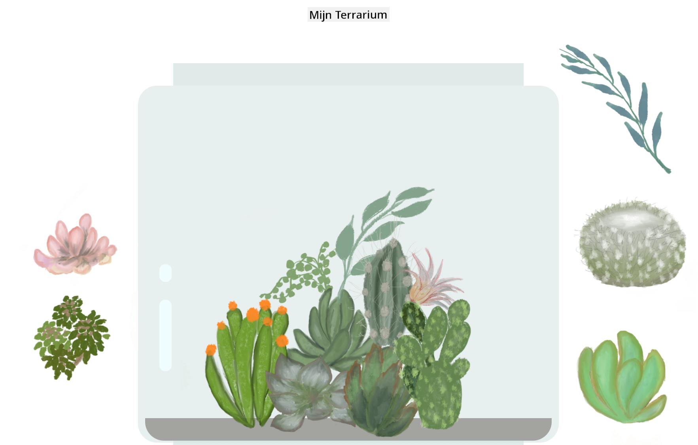

<!--
CO_OP_TRANSLATOR_METADATA:
{
  "original_hash": "7965cd2bc5dc92ad888dc4c6ab2ab70a",
  "translation_date": "2025-08-27T20:04:52+00:00",
  "source_file": "3-terrarium/README.md",
  "language_code": "nl"
}
-->
# Mijn Terrarium: Een project om te leren over HTML, CSS en DOM-manipulatie met JavaScript 🌵🌱

Een kleine drag-and-drop code-meditatie. Met een beetje HTML, JS en CSS kun je een webinterface bouwen, deze stylen en zelfs meerdere interacties naar keuze toevoegen.

# Lessen

1. [Introductie tot HTML](./1-intro-to-html/README.md)
2. [Introductie tot CSS](./2-intro-to-css/README.md)
3. [Introductie tot DOM en JS Closures](./3-intro-to-DOM-and-closures/README.md)

## Credits

Geschreven met ♥️ door [Jen Looper](https://www.twitter.com/jenlooper)

Het terrarium gemaakt via CSS is geïnspireerd door Jakub Mandra's glazen pot [codepen](https://codepen.io/Rotarepmi/pen/rjpNZY).

De illustraties zijn met de hand getekend door [Jen Looper](http://jenlooper.com) met behulp van Procreate.

## Publiceer je Terrarium

Je kunt je terrarium op het web publiceren met behulp van Azure Static Web Apps.

1. Fork deze repository

2. Druk op deze knop

3. Doorloop de wizard om je app te maken. Zorg ervoor dat je de app-root instelt op ofwel `/solution` of de root van je codebase. Er is geen API in deze app, dus daar hoef je je geen zorgen over te maken. Een GitHub-map wordt aangemaakt in je geforkte repository die Azure Static Web Apps' buildservices helpt om je app te bouwen en te publiceren naar een nieuwe URL.

---

**Disclaimer**:  
Dit document is vertaald met behulp van de AI-vertalingsservice [Co-op Translator](https://github.com/Azure/co-op-translator). Hoewel we streven naar nauwkeurigheid, dient u zich ervan bewust te zijn dat geautomatiseerde vertalingen fouten of onnauwkeurigheden kunnen bevatten. Het originele document in zijn oorspronkelijke taal moet worden beschouwd als de gezaghebbende bron. Voor kritieke informatie wordt professionele menselijke vertaling aanbevolen. Wij zijn niet aansprakelijk voor misverstanden of verkeerde interpretaties die voortvloeien uit het gebruik van deze vertaling.