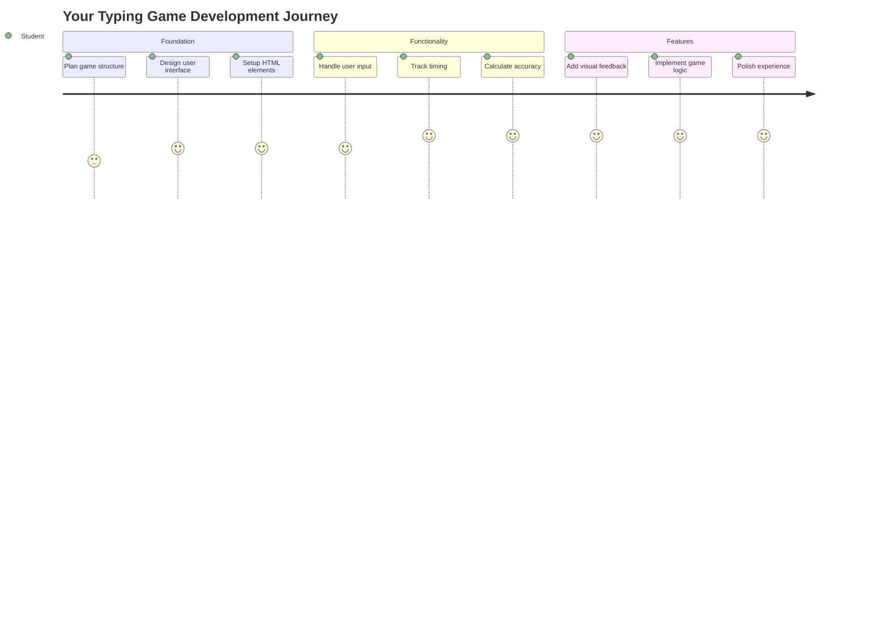
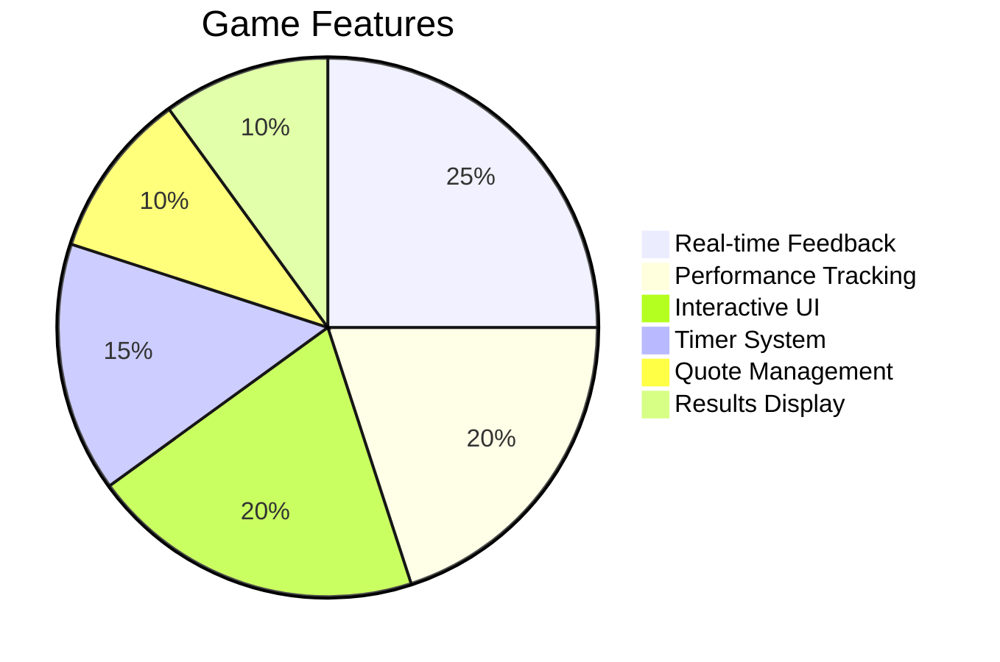
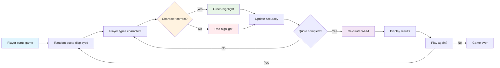
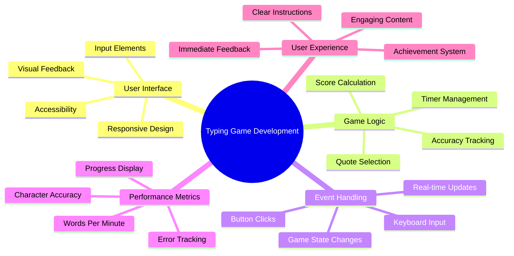
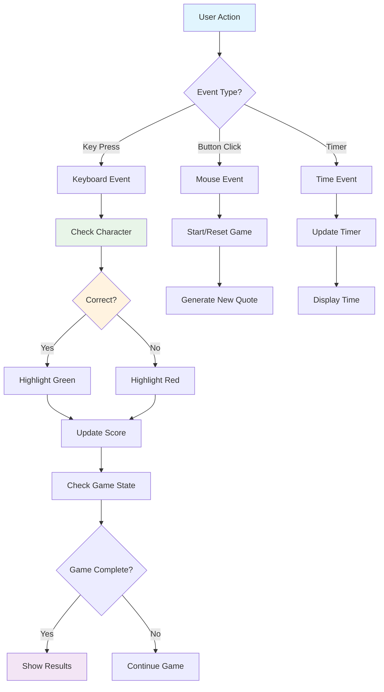
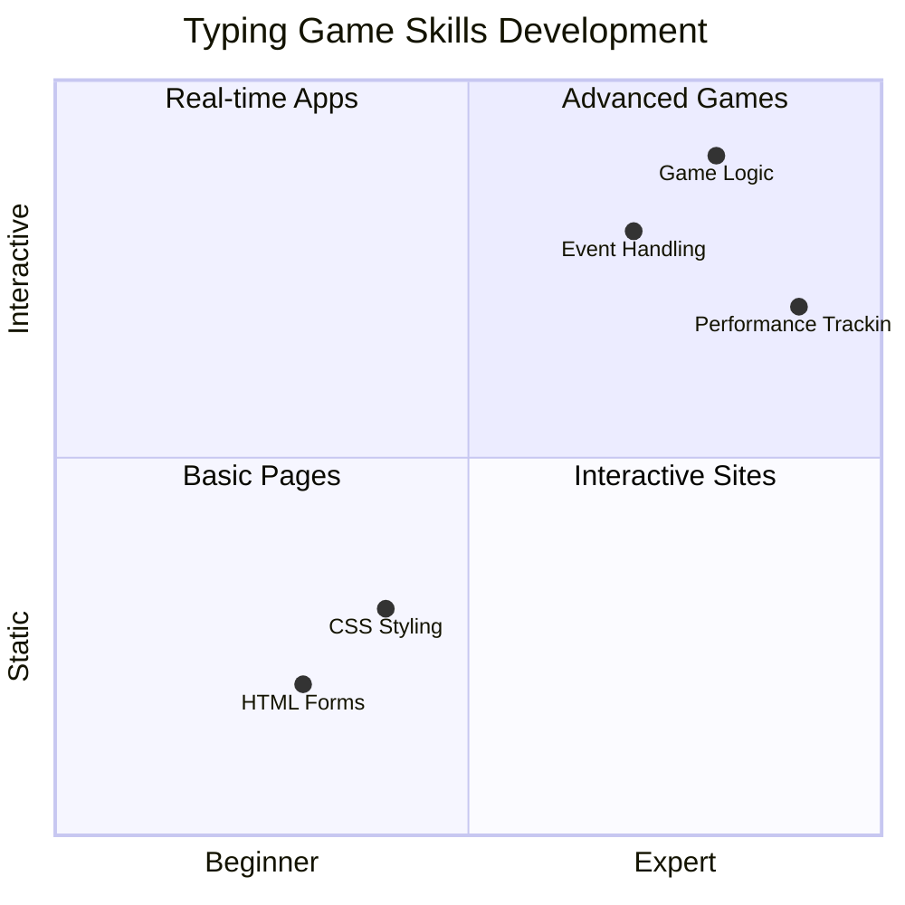
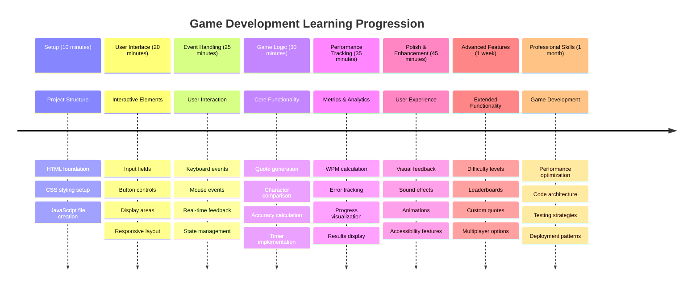

<!--
CO_OP_TRANSLATOR_METADATA:
{
  "original_hash": "efa2ab875b8bb5a7883816506da6b6d2",
  "translation_date": "2025-11-04T02:03:03+00:00",
  "source_file": "4-typing-game/README.md",
  "language_code": "nl"
}
-->
# Event-Driven Programming - Bouw een Typing Game

## Introductie

Hier is iets wat elke ontwikkelaar weet, maar waar zelden over gesproken wordt: snel kunnen typen is een superkracht! 🚀 Denk er eens over na - hoe sneller je je ideeën van je brein naar je code-editor kunt krijgen, hoe meer je creativiteit kan stromen. Het is alsof je een directe verbinding hebt tussen je gedachten en het scherm.

Wil je weten wat een van de beste manieren is om deze vaardigheid te verbeteren? Je raadt het al - we gaan een spel bouwen!

> Laten we samen een geweldige typing game maken!

Klaar om al die JavaScript-, HTML- en CSS-vaardigheden die je hebt geleerd in de praktijk te brengen? We gaan een typing game bouwen die je uitdaagt met willekeurige citaten van de legendarische detective [Sherlock Holmes](https://en.wikipedia.org/wiki/Sherlock_Holmes). Het spel houdt bij hoe snel en nauwkeurig je kunt typen - en geloof me, het is verslavender dan je denkt!

## Wat Je Moet Weten

Voordat we beginnen, zorg ervoor dat je bekend bent met deze concepten (maak je geen zorgen als je een snelle opfrisser nodig hebt - dat overkomt ons allemaal!):

- Tekstinvoer en knoppen maken
- CSS en stijlen instellen met klassen  
- Basisprincipes van JavaScript
  - Een array maken
  - Een willekeurig getal genereren
  - De huidige tijd ophalen

Als een van deze onderwerpen een beetje roestig aanvoelt, is dat helemaal prima! Soms is de beste manier om je kennis te versterken door in een project te duiken en dingen onderweg uit te zoeken.

### 🔄 **Pedagogische Check-in**
**Basisbeoordeling**: Zorg ervoor dat je begrijpt:
- ✅ Hoe HTML-formulieren en invoerelementen werken
- ✅ CSS-klassen en dynamische styling
- ✅ JavaScript event listeners en handlers
- ✅ Array-manipulatie en willekeurige selectie
- ✅ Tijdmeting en berekeningen

**Snelle Zelftest**: Kun je uitleggen hoe deze concepten samenwerken in een interactief spel?
- **Events** worden geactiveerd wanneer gebruikers met elementen interageren
- **Handlers** verwerken die events en updaten de spelstatus
- **CSS** biedt visuele feedback voor gebruikersacties
- **Timing** maakt prestatiemeting en spelvoortgang mogelijk

## Laten We Dit Bouwen!

[Een typing game maken met event-driven programming](./typing-game/README.md)

### ⚡ **Wat Je Binnen 5 Minuten Kunt Doen**
- [ ] Open je browserconsole en probeer toetsenbordevents te luisteren met `addEventListener`
- [ ] Maak een eenvoudige HTML-pagina met een invoerveld en test het detecteren van typen
- [ ] Oefen met stringmanipulatie door getypte tekst te vergelijken met doeltekst
- [ ] Experimenteer met `setTimeout` om timingfuncties te begrijpen

### 🎯 **Wat Je Binnen Een Uur Kunt Bereiken**
- [ ] Voltooi de quiz na de les en begrijp event-driven programming
- [ ] Bouw een basisversie van de typing game met woordvalidatie
- [ ] Voeg visuele feedback toe voor correct en foutief typen
- [ ] Implementeer een eenvoudig scoresysteem gebaseerd op snelheid en nauwkeurigheid
- [ ] Style je spel met CSS om het visueel aantrekkelijk te maken

### 📅 **Je Week-Lange Game Ontwikkeling**
- [ ] Voltooi de volledige typing game met alle functies en afwerking
- [ ] Voeg moeilijkheidsniveaus toe met verschillende woordcomplexiteit
- [ ] Implementeer gebruikersstatistieken (WPM, nauwkeurigheid over tijd)
- [ ] Maak geluidseffecten en animaties voor een betere gebruikerservaring
- [ ] Zorg dat je spel mobiel-responsief is voor touch-apparaten
- [ ] Deel je spel online en verzamel feedback van gebruikers

### 🌟 **Je Maand-Lange Interactieve Ontwikkeling**
- [ ] Bouw meerdere spellen die verschillende interactiepatronen verkennen
- [ ] Leer over game loops, statusbeheer en prestatieoptimalisatie
- [ ] Draag bij aan open source game development projecten
- [ ] Beheers geavanceerde timingconcepten en vloeiende animaties
- [ ] Maak een portfolio met verschillende interactieve applicaties
- [ ] Begeleid anderen die geïnteresseerd zijn in game development en gebruikersinteractie

## 🎯 Je Typing Game Meesterschap Tijdlijn

### 🛠️ Samenvatting van Je Game Ontwikkeling Toolkit

Na het voltooien van dit project, beheers je:
- **Event-Driven Programming**: Responsieve gebruikersinterfaces die reageren op input
- **Real-Time Feedback**: Directe visuele en prestatie-updates
- **Prestatiemeting**: Nauwkeurige timing- en scoresystemen
- **Game State Management**: Beheersen van applicatiestroom en gebruikerservaring
- **Interactief Ontwerp**: Creëren van boeiende, verslavende gebruikerservaringen
- **Moderne Web APIs**: Gebruik maken van browsermogelijkheden voor rijke interacties
- **Toegankelijkheidspatronen**: Inclusief ontwerp voor alle gebruikers

**Toepassingen in de echte wereld**: Deze vaardigheden zijn direct toepasbaar op:
- **Webapplicaties**: Elke interactieve interface of dashboard
- **Educatieve Software**: Leerplatforms en vaardigheidsbeoordelingstools
- **Productiviteitstools**: Teksteditors, IDE's en samenwerkingssoftware
- **Gamingindustrie**: Browsergames en interactieve entertainment
- **Mobiele Ontwikkeling**: Touch-gebaseerde interfaces en gebarenbeheer

**Volgende Niveau**: Je bent klaar om geavanceerde game frameworks, real-time multiplayer systemen of complexe interactieve applicaties te verkennen!

## Credits

Geschreven met ♥️ door [Christopher Harrison](http://www.twitter.com/geektrainer)

---

**Disclaimer**:  
Dit document is vertaald met behulp van de AI-vertalingsservice [Co-op Translator](https://github.com/Azure/co-op-translator). Hoewel we streven naar nauwkeurigheid, dient u zich ervan bewust te zijn dat geautomatiseerde vertalingen fouten of onnauwkeurigheden kunnen bevatten. Het originele document in de oorspronkelijke taal moet worden beschouwd als de gezaghebbende bron. Voor kritieke informatie wordt professionele menselijke vertaling aanbevolen. Wij zijn niet aansprakelijk voor misverstanden of verkeerde interpretaties die voortvloeien uit het gebruik van deze vertaling.