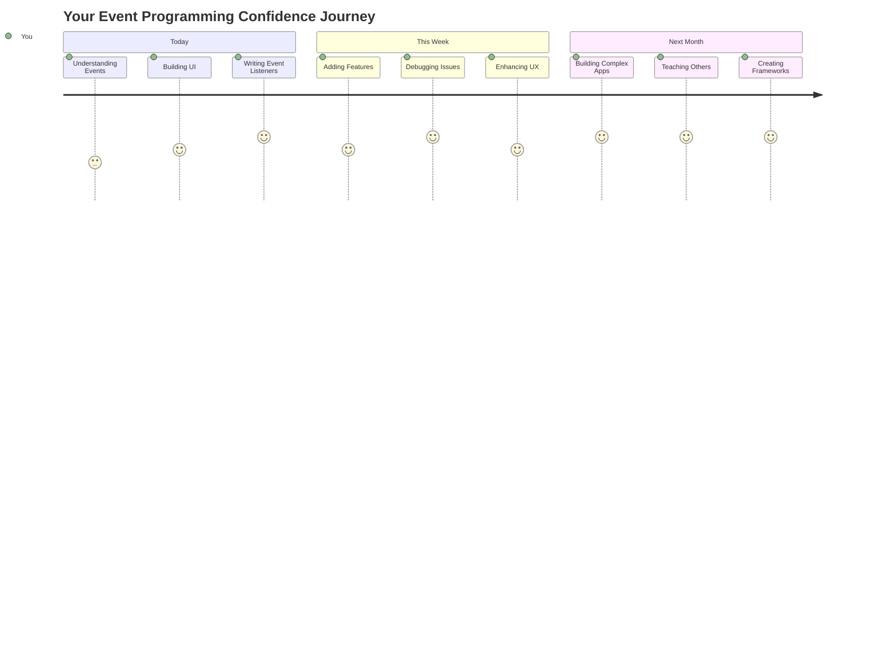

<!--
CO_OP_TRANSLATOR_METADATA:
{
  "original_hash": "da8bc72041a2bb3826a54654ee1a8844",
  "translation_date": "2025-11-04T02:03:14+00:00",
  "source_file": "4-typing-game/typing-game/README.md",
  "language_code": "nl"
}
-->
# Een spel maken met behulp van events

Heb je je ooit afgevraagd hoe websites weten wanneer je op een knop klikt of tekst typt in een tekstvak? Dat is de magie van event-driven programmeren! Wat is een betere manier om deze essentiële vaardigheid te leren dan door iets nuttigs te bouwen - een typ-snelheidsspel dat reageert op elke toetsaanslag die je maakt.

Je zult uit eerste hand zien hoe webbrowsers "praten" met je JavaScript-code. Elke keer dat je klikt, typt of je muis beweegt, stuurt de browser kleine berichten (we noemen ze events) naar je code, en jij bepaalt hoe je daarop reageert!

Tegen de tijd dat we klaar zijn, heb je een echt typ-spel gebouwd dat je snelheid en nauwkeurigheid bijhoudt. Nog belangrijker is dat je de fundamentele concepten begrijpt die elke interactieve website aandrijven die je ooit hebt gebruikt. Laten we beginnen!

## Quiz voorafgaand aan de les

[Quiz voorafgaand aan de les](https://ff-quizzes.netlify.app/web/quiz/21)

## Event-driven programmeren

Denk eens aan je favoriete app of website - wat zorgt ervoor dat het levendig en responsief aanvoelt? Het draait allemaal om hoe het reageert op wat jij doet! Elke tik, klik, veeg of toetsaanslag creëert wat we een "event" noemen, en daar gebeurt de echte magie van webontwikkeling.

Wat programmeren voor het web zo interessant maakt, is dat we nooit weten wanneer iemand op die knop zal klikken of begint te typen in een tekstvak. Misschien klikken ze meteen, wachten ze vijf minuten, of klikken ze helemaal niet! Door deze onvoorspelbaarheid moeten we anders nadenken over hoe we onze code schrijven.

In plaats van code te schrijven die van boven naar beneden loopt zoals een recept, schrijven we code die geduldig wacht tot er iets gebeurt. Het is vergelijkbaar met hoe telegraafoperators in de 19e eeuw bij hun machines zaten, klaar om te reageren zodra er een bericht binnenkwam.

Dus wat is precies een "event"? Simpel gezegd, het is iets dat gebeurt! Wanneer je op een knop klikt - dat is een event. Wanneer je een letter typt - dat is een event. Wanneer je je muis beweegt - dat is weer een event.

Event-driven programmeren stelt ons in staat om onze code in te stellen om te luisteren en te reageren. We maken speciale functies, genaamd **event listeners**, die geduldig wachten op specifieke gebeurtenissen en in actie komen wanneer ze plaatsvinden.

Denk aan event listeners als een deurbel voor je code. Je stelt de deurbel in (`addEventListener()`), vertelt wat voor geluid hij moet horen (zoals een 'klik' of 'toetsaanslag'), en specificeert wat er moet gebeuren wanneer iemand aanbelt (jouw aangepaste functie).

**Zo werken event listeners:**
- **Luisteren** naar specifieke gebruikersacties zoals klikken, toetsaanslagen of muisbewegingen
- **Voeren uit** jouw aangepaste code wanneer het gespecificeerde event plaatsvindt
- **Reageren** onmiddellijk op gebruikersinteracties, wat zorgt voor een naadloze ervaring
- **Behandelen** meerdere events op hetzelfde element met verschillende listeners

> **NOTE:** Het is de moeite waard om te benadrukken dat er verschillende manieren zijn om event listeners te maken. Je kunt anonieme functies gebruiken of benoemde functies maken. Je kunt verschillende snelkoppelingen gebruiken, zoals het instellen van de `click`-eigenschap, of `addEventListener()` gebruiken. In onze oefening gaan we ons richten op `addEventListener()` en anonieme functies, omdat dit waarschijnlijk de meest gebruikte techniek is onder webontwikkelaars. Het is ook de meest flexibele, omdat `addEventListener()` werkt voor alle events en de eventnaam als parameter kan worden opgegeven.

### Veelvoorkomende events

Hoewel webbrowsers tientallen verschillende events bieden waar je naar kunt luisteren, vertrouwen de meeste interactieve applicaties op slechts een handvol essentiële events. Het begrijpen van deze kern-events geeft je de basis om geavanceerde gebruikersinteracties te bouwen.

Er zijn [tientallen events](https://developer.mozilla.org/docs/Web/Events) beschikbaar waar je naar kunt luisteren bij het maken van een applicatie. In principe roept alles wat een gebruiker op een pagina doet een event op, wat je veel mogelijkheden geeft om ervoor te zorgen dat ze de ervaring krijgen die je wenst. Gelukkig heb je meestal maar een klein aantal events nodig. Hier zijn een paar veelvoorkomende (inclusief de twee die we zullen gebruiken bij het maken van ons spel):

| Event | Beschrijving | Veelvoorkomende toepassingen |
|-------|--------------|------------------------------|
| `click` | De gebruiker heeft ergens op geklikt | Knoppen, links, interactieve elementen |
| `contextmenu` | De gebruiker heeft met de rechtermuisknop geklikt | Aangepaste rechtermuisklikmenu's |
| `select` | De gebruiker heeft tekst gemarkeerd | Tekstbewerking, kopieeracties |
| `input` | De gebruiker heeft tekst ingevoerd | Formuliervalidatie, realtime zoeken |

**Begrip van deze eventtypes:**
- **Wordt geactiveerd** wanneer gebruikers interactie hebben met specifieke elementen op je pagina
- **Biedt** gedetailleerde informatie over de actie van de gebruiker via event-objecten
- **Maakt** het mogelijk om responsieve, interactieve webapplicaties te maken
- **Werkt** consistent op verschillende browsers en apparaten

## Het spel maken

Nu je begrijpt hoe events werken, laten we die kennis in de praktijk brengen door iets nuttigs te bouwen. We gaan een typ-snelheidsspel maken dat event handling demonstreert en je helpt een belangrijke ontwikkelaarsvaardigheid te ontwikkelen.

We gaan een spel maken om te ontdekken hoe events werken in JavaScript. Ons spel zal de typvaardigheid van een speler testen, wat een van de meest onderschatte vaardigheden is die alle ontwikkelaars zouden moeten hebben. Leuk feitje: het QWERTY-toetsenbord dat we vandaag gebruiken, werd eigenlijk ontworpen in de jaren 1870 voor typemachines - en goede typvaardigheden zijn nog steeds net zo waardevol voor programmeurs vandaag de dag! De algemene flow van het spel ziet er als volgt uit:


**Zo werkt ons spel:**
- **Start** wanneer de speler op de startknop klikt en een willekeurige quote weergeeft
- **Volgt** de typvoortgang van de speler woord voor woord in realtime
- **Markeert** het huidige woord om de focus van de speler te begeleiden
- **Geeft** directe visuele feedback bij typfouten
- **Bereken** en toont de totale tijd wanneer de quote is voltooid

Laten we ons spel bouwen en meer leren over events!

### Bestandsstructuur

Voordat we beginnen met coderen, laten we ons organiseren! Een schone bestandsstructuur vanaf het begin bespaart je later hoofdpijn en maakt je project professioneler. 😊

We houden het simpel met slechts drie bestanden: `index.html` voor de structuur van onze pagina, `script.js` voor alle logica van ons spel, en `style.css` om alles er geweldig uit te laten zien. Dit is de klassieke trio die de meeste websites aandrijft!

**Maak een nieuwe map voor je werk door een console- of terminalvenster te openen en het volgende commando in te voeren:**

```bash
# Linux or macOS
mkdir typing-game && cd typing-game

# Windows
md typing-game && cd typing-game
```

**Wat deze commando's doen:**
- **Maakt** een nieuwe map genaamd `typing-game` voor je projectbestanden
- **Navigeert** automatisch naar de nieuw aangemaakte map
- **Creëert** een schone werkruimte voor je spelontwikkeling

**Open Visual Studio Code:**

```bash
code .
```

**Dit commando:**
- **Start** Visual Studio Code in de huidige map
- **Opent** je projectmap in de editor
- **Biedt** toegang tot alle ontwikkeltools die je nodig hebt

**Voeg drie bestanden toe aan de map in Visual Studio Code met de volgende namen:**
- `index.html` - Bevat de structuur en inhoud van je spel
- `script.js` - Behandelt alle spel-logica en event listeners
- `style.css` - Definieert het visuele uiterlijk en de styling

## Maak de gebruikersinterface

Laten we nu het podium bouwen waar alle actie van ons spel zal plaatsvinden! Denk hieraan als het ontwerpen van het bedieningspaneel van een ruimteschip - we moeten ervoor zorgen dat alles wat onze spelers nodig hebben precies daar is waar ze het verwachten.

Laten we uitzoeken wat ons spel eigenlijk nodig heeft. Als je een typ-spel zou spelen, wat zou je dan op het scherm willen zien? Hier is wat we nodig hebben:

| UI-element | Doel | HTML-element |
|------------|------|-------------|
| Quote-weergave | Toont de tekst om te typen | `<p>` met `id="quote"` |
| Berichtgebied | Geeft status- en succesberichten weer | `<p>` met `id="message"` |
| Tekstinvoer | Waar spelers de quote typen | `<input>` met `id="typed-value"` |
| Startknop | Start het spel | `<button>` met `id="start"` |

**Begrip van de UI-structuur:**
- **Organiseert** inhoud logisch van boven naar beneden
- **Kent** unieke ID's toe aan elementen voor JavaScript-targeting
- **Biedt** een duidelijke visuele hiërarchie voor een betere gebruikerservaring
- **Bevat** semantische HTML-elementen voor toegankelijkheid

Elk van deze elementen heeft ID's nodig zodat we ermee kunnen werken in onze JavaScript. We zullen ook verwijzingen toevoegen naar de CSS- en JavaScript-bestanden die we gaan maken.

Maak een nieuw bestand genaamd `index.html`. Voeg de volgende HTML toe:

```html
<!-- inside index.html -->
<html>
<head>
  <title>Typing game</title>
  <link rel="stylesheet" href="style.css">
</head>
<body>
  <h1>Typing game!</h1>
  <p>Practice your typing skills with a quote from Sherlock Holmes. Click **start** to begin!</p>
  <p id="quote"></p> <!-- This will display our quote -->
  <p id="message"></p> <!-- This will display any status messages -->
  <div>
    <input type="text" aria-label="current word" id="typed-value" /> <!-- The textbox for typing -->
    <button type="button" id="start">Start</button> <!-- To start the game -->
  </div>
  <script src="script.js"></script>
</body>
</html>
```

**Wat deze HTML-structuur bereikt:**
- **Linkt** de CSS-stylesheet in de `<head>` voor styling
- **Creëert** een duidelijke kop en instructies voor gebruikers
- **Stelt** tijdelijke alinea's in met specifieke ID's voor dynamische inhoud
- **Bevat** een invoerveld met toegankelijkheidsattributen
- **Biedt** een startknop om het spel te starten
- **Laadt** het JavaScript-bestand aan het einde voor optimale prestaties

### Start de applicatie

Je applicatie regelmatig testen tijdens de ontwikkeling helpt je om problemen vroegtijdig op te sporen en je voortgang in realtime te zien. Live Server is een onmisbare tool die je browser automatisch vernieuwt wanneer je wijzigingen opslaat, wat de ontwikkeling veel efficiënter maakt.

Het is altijd het beste om iteratief te ontwikkelen om te zien hoe dingen eruitzien. Laten we onze applicatie starten. Er is een geweldige extensie voor Visual Studio Code genaamd [Live Server](https://marketplace.visualstudio.com/items?itemName=ritwickdey.LiveServer&WT.mc_id=academic-77807-sagibbon) die zowel je applicatie lokaal host als de browser vernieuwt telkens wanneer je bestanden opslaat.

**Installeer [Live Server](https://marketplace.visualstudio.com/items?itemName=ritwickdey.LiveServer&WT.mc_id=academic-77807-sagibbon) door de link te volgen en op Installeren te klikken:**

**Wat er gebeurt tijdens de installatie:**
- **Opent** je browser om Visual Studio Code te starten
- **Leidt** je door het installatieproces van de extensie
- **Kan vereisen** dat je Visual Studio Code opnieuw start om de installatie te voltooien

**Eenmaal geïnstalleerd, klik in Visual Studio Code op Ctrl-Shift-P (of Cmd-Shift-P) om de commandopalet te openen:**

**Begrip van de commandopalet:**
- **Biedt** snelle toegang tot alle VS Code-commando's
- **Zoekt** commando's terwijl je typt
- **Biedt** sneltoetsen voor snellere ontwikkeling

**Typ "Live Server: Open with Live Server":**

**Wat Live Server doet:**
- **Start** een lokale ontwikkelserver voor je project
- **Vernieuwt** automatisch de browser wanneer je bestanden opslaat
- **Serveert** je bestanden vanaf een lokale URL (meestal `localhost:5500`)

**Open een browser en navigeer naar `https://localhost:5500`:**

Je zou nu de pagina moeten zien die je hebt gemaakt! Laten we wat functionaliteit toevoegen.

## Voeg de CSS toe

Laten we nu zorgen dat alles er goed uitziet! Visuele feedback is cruciaal geweest voor gebruikersinterfaces sinds de vroege dagen van computers. In de jaren 80 ontdekten onderzoekers dat directe visuele feedback de prestaties van gebruikers aanzienlijk verbetert en fouten vermindert. Dat is precies wat we gaan creëren.

Ons spel moet glashelder zijn over wat er gebeurt. Spelers moeten onmiddellijk weten welk woord ze moeten typen, en als ze een fout maken, moeten ze dat meteen zien. Laten we wat eenvoudige maar effectieve styling maken:

Maak een nieuw bestand genaamd `style.css` en voeg de volgende syntax toe.

```css
/* inside style.css */
.highlight {
  background-color: yellow;
}

.error {
  background-color: lightcoral;
  border: red;
}
```

**Begrip van deze CSS-klassen:**
- **Markeert** het huidige woord met een gele achtergrond voor duidelijke visuele begeleiding
- **Signaleert** typfouten met een licht koraalkleurige achtergrond
- **Biedt** directe feedback zonder de typflow van de gebruiker te verstoren
- **Gebruikt** contrasterende kleuren voor toegankelijkheid en duidelijke visuele communicatie

✅ Als het gaat om CSS kun je je pagina indelen zoals je wilt. Neem wat tijd en maak de pagina aantrekkelijker:

- Kies een ander lettertype
- Geef de koppen kleur
- Pas de grootte van items aan

## JavaScript

Hier wordt het interessant! 🎉 We hebben onze HTML-structuur en onze CSS-styling, maar op dit moment is ons spel als een mooie auto zonder motor. JavaScript wordt die motor - het is wat alles daadwerkelijk laat werken en reageert op wat spelers doen.

Hier zie je je creatie tot leven komen. We gaan dit stap voor stap aanpakken zodat niets overweldigend aanvoelt:

| Stap | Doel | Wat je leert |
|------|------|-------------|
| [Maak de constanten](../../../../4-typing-game/typing-game) | Stel quotes en DOM-referenties in | Variabelbeheer en DOM-selectie |
| [Event listener om het spel te starten](../../../../4-typing-game/typing-game) | Behandel spelinitialisatie | Event handling en UI-updates |
| [Event listener voor typen](../../../../4-typing-game/typing-game) | Verwerk gebruikersinvoer in realtime | Invoervalidatie en dynamische feedback |

**Deze gestructureerde aanpak helpt je:**
- **Organiseer** je code in logische, beheersbare secties
- **Bouw** functionaliteit stapsgewijs voor eenvoudiger debugging
- **Begrijp** hoe verschillende delen van je applicatie samenwerken
- **Creëer** herbruikbare patronen voor toekomstige projecten

Maar eerst, maak een nieuw bestand genaamd `script.js`.

### Voeg de constanten toe

Voordat we in actie komen, laten we al onze bronnen verzamelen! Net zoals NASA-missiecontrole al hun monitoringsystemen instelt vóór de lancering, is het veel gemakkelijker als je alles voorbereid en klaar hebt. Dit bespaart ons van later dingen zoeken en helpt typfouten te voorkomen.

Hier is wat we eerst moeten instellen:

| Gegevenstype | Doel | Voorbeeld |
|--------------|------|----------|
| Array van citaten | Bewaar alle mogelijke citaten voor het spel | `['Citaat 1', 'Citaat 2', ...]` |
| Woordenarray | Breek het huidige citaat op in afzonderlijke woorden | `['Wanneer', 'je', 'hebt', ...]` |
| Woordenindex | Houd bij welk woord de speler aan het typen is | `0, 1, 2, 3...` |
| Starttijd | Bereken de verstreken tijd voor de score | `Date.now()` |

**We hebben ook referenties naar onze UI-elementen nodig:**
| Element | ID | Doel |
|---------|----|------|
| Tekstinvoer | `typed-value` | Waar spelers typen |
| Citaatweergave | `quote` | Toont het citaat om te typen |
| Berichtgebied | `message` | Geeft statusupdates weer |

```javascript
// inside script.js
// all of our quotes
const quotes = [
    'When you have eliminated the impossible, whatever remains, however improbable, must be the truth.',
    'There is nothing more deceptive than an obvious fact.',
    'I ought to know by this time that when a fact appears to be opposed to a long train of deductions it invariably proves to be capable of bearing some other interpretation.',
    'I never make exceptions. An exception disproves the rule.',
    'What one man can invent another can discover.',
    'Nothing clears up a case so much as stating it to another person.',
    'Education never ends, Watson. It is a series of lessons, with the greatest for the last.',
];
// store the list of words and the index of the word the player is currently typing
let words = [];
let wordIndex = 0;
// the starting time
let startTime = Date.now();
// page elements
const quoteElement = document.getElementById('quote');
const messageElement = document.getElementById('message');
const typedValueElement = document.getElementById('typed-value');
```

**Wat deze setup-code bereikt:**
- **Slaat** een array van Sherlock Holmes-citaten op met `const`, omdat de citaten niet veranderen
- **Initialiseert** trackingvariabelen met `let`, omdat deze waarden tijdens het spel worden bijgewerkt
- **Vastleggen** van referenties naar DOM-elementen met `document.getElementById()` voor efficiënte toegang
- **Legt** de basis voor alle spelfunctionaliteit met duidelijke, beschrijvende variabelnamen
- **Organiseert** gerelateerde gegevens en elementen logisch voor eenvoudigere codeonderhoud

✅ Voeg meer citaten toe aan je spel

> 💡 **Pro Tip**: We kunnen de elementen op elk gewenst moment in de code ophalen met `document.getElementById()`. Omdat we deze elementen regelmatig gaan gebruiken, vermijden we typfouten met stringliteralen door constanten te gebruiken. Frameworks zoals [Vue.js](https://vuejs.org/) of [React](https://reactjs.org/) kunnen je helpen om je code beter te centraliseren.
>
**Waarom deze aanpak zo goed werkt:**
- **Voorkomt** spelfouten bij het meerdere keren verwijzen naar elementen
- **Verbetert** de leesbaarheid van de code met beschrijvende constante namen
- **Maakt** betere ondersteuning door IDE mogelijk met autocomplete en foutcontrole
- **Vergemakkelijkt** refactoring als element-ID's later veranderen

Neem een minuut de tijd om een video te bekijken over het gebruik van `const`, `let` en `var`.

[](https://youtube.com/watch?v=JNIXfGiDWM8 "Soorten variabelen")

> 🎥 Klik op de afbeelding hierboven voor een video over variabelen.

### Startlogica toevoegen

Hier komt alles samen! 🚀 Je staat op het punt je eerste echte event listener te schrijven, en er is iets heel bevredigends aan om je code te zien reageren op een klik op een knop.

Denk er eens over na: ergens zal een speler op die "Start"-knop klikken, en jouw code moet er klaar voor zijn. We hebben geen idee wanneer ze zullen klikken - misschien meteen, misschien na een kop koffie - maar wanneer ze dat doen, komt jouw spel tot leven.

Wanneer de gebruiker op `start` klikt, moeten we een citaat selecteren, de gebruikersinterface instellen en de tracking voor het huidige woord en de tijd instellen. Hieronder staat de JavaScript die je moet toevoegen; we bespreken het direct na het scriptblok.

```javascript
// at the end of script.js
document.getElementById('start').addEventListener('click', () => {
  // get a quote
  const quoteIndex = Math.floor(Math.random() * quotes.length);
  const quote = quotes[quoteIndex];
  // Put the quote into an array of words
  words = quote.split(' ');
  // reset the word index for tracking
  wordIndex = 0;

  // UI updates
  // Create an array of span elements so we can set a class
  const spanWords = words.map(function(word) { return `<span>${word} </span>`});
  // Convert into string and set as innerHTML on quote display
  quoteElement.innerHTML = spanWords.join('');
  // Highlight the first word
  quoteElement.childNodes[0].className = 'highlight';
  // Clear any prior messages
  messageElement.innerText = '';

  // Setup the textbox
  // Clear the textbox
  typedValueElement.value = '';
  // set focus
  typedValueElement.focus();
  // set the event handler

  // Start the timer
  startTime = new Date().getTime();
});
```

**Laten we de code in logische secties opsplitsen:**

**📊 Woordtracking Setup:**
- **Selecteert** een willekeurig citaat met behulp van `Math.floor()` en `Math.random()` voor variatie
- **Converteert** het citaat naar een array van afzonderlijke woorden met behulp van `split(' ')`
- **Reset** de `wordIndex` naar 0, omdat spelers beginnen met het eerste woord
- **Bereidt** de spelstatus voor op een nieuwe ronde

**🎨 UI Setup en Weergave:**
- **Creëert** een array van `<span>`-elementen, waarbij elk woord wordt omhuld voor individuele opmaak
- **Voegt** de span-elementen samen tot een enkele string voor efficiënte DOM-updating
- **Markeert** het eerste woord door de CSS-klasse `highlight` toe te voegen
- **Leegt** eventuele eerdere spelberichten om een schone lei te bieden

**⌨️ Voorbereiding tekstvak:**
- **Leegt** eventuele bestaande tekst in het invoerveld
- **Zet de focus** op het tekstvak zodat spelers meteen kunnen beginnen met typen
- **Bereidt** het invoergebied voor op de nieuwe spelsessie

**⏱️ Timer Initialisatie:**
- **Legt** de huidige tijdstempel vast met behulp van `new Date().getTime()`
- **Maakt** nauwkeurige berekening van typsnelheid en voltooiingstijd mogelijk
- **Start** de prestatietracking voor de spelsessie

### Typelogica toevoegen

Hier gaan we het hart van ons spel aanpakken! Maak je geen zorgen als dit in het begin veel lijkt - we lopen door elk onderdeel heen, en aan het einde zul je zien hoe logisch het allemaal is.

Wat we hier bouwen is behoorlijk geavanceerd: elke keer dat iemand een letter typt, controleert onze code wat ze hebben getypt, geeft feedback en beslist wat er vervolgens moet gebeuren. Het lijkt op hoe vroege tekstverwerkers zoals WordStar in de jaren '70 realtime feedback gaven aan typisten.

```javascript
// at the end of script.js
typedValueElement.addEventListener('input', () => {
  // Get the current word
  const currentWord = words[wordIndex];
  // get the current value
  const typedValue = typedValueElement.value;

  if (typedValue === currentWord && wordIndex === words.length - 1) {
    // end of sentence
    // Display success
    const elapsedTime = new Date().getTime() - startTime;
    const message = `CONGRATULATIONS! You finished in ${elapsedTime / 1000} seconds.`;
    messageElement.innerText = message;
  } else if (typedValue.endsWith(' ') && typedValue.trim() === currentWord) {
    // end of word
    // clear the typedValueElement for the new word
    typedValueElement.value = '';
    // move to the next word
    wordIndex++;
    // reset the class name for all elements in quote
    for (const wordElement of quoteElement.childNodes) {
      wordElement.className = '';
    }
    // highlight the new word
    quoteElement.childNodes[wordIndex].className = 'highlight';
  } else if (currentWord.startsWith(typedValue)) {
    // currently correct
    // highlight the next word
    typedValueElement.className = '';
  } else {
    // error state
    typedValueElement.className = 'error';
  }
});
```

**Begrijpen van de typelogica:**

Deze functie gebruikt een watervalaanpak, waarbij voorwaarden worden gecontroleerd van meest specifiek naar meest algemeen. Laten we elk scenario opsplitsen:


**🏁 Citaat Voltooid (Scenario 1):**
- **Controleert** of de getypte waarde overeenkomt met het huidige woord EN we bij het laatste woord zijn
- **Bereken** de verstreken tijd door de starttijd af te trekken van de huidige tijd
- **Converteert** milliseconden naar seconden door te delen door 1.000
- **Geeft** een felicitatiebericht weer met de voltooiingstijd

**✅ Woord Voltooid (Scenario 2):**
- **Detecteert** woordvoltooiing wanneer invoer eindigt met een spatie
- **Valideert** dat de bijgesneden invoer exact overeenkomt met het huidige woord
- **Leegt** het invoerveld voor het volgende woord
- **Gaat verder** naar het volgende woord door `wordIndex` te verhogen
- **Werk** visuele markering bij door alle klassen te verwijderen en het nieuwe woord te markeren

**📝 Typen in Voortgang (Scenario 3):**
- **Verifieert** dat het huidige woord begint met wat tot nu toe is getypt
- **Verwijdert** eventuele foutopmaak om te laten zien dat de invoer correct is
- **Laat** doorgaan met typen zonder onderbreking

**❌ Foutstatus (Scenario 4):**
- **Activeert** wanneer getypte tekst niet overeenkomt met het verwachte woordbegin
- **Past** fout-CSS-klasse toe om onmiddellijke visuele feedback te geven
- **Helpt** spelers snel fouten te identificeren en te corrigeren

## Test je applicatie

Kijk wat je hebt bereikt! 🎉 Je hebt zojuist een echt werkend typenspel vanaf nul gebouwd met event-driven programmering. Neem even de tijd om dat te waarderen - dit is geen kleinigheid!

Nu komt de testfase! Werkt het zoals verwacht? Hebben we iets gemist? Hier is het ding: als iets niet meteen perfect werkt, is dat helemaal normaal. Zelfs ervaren ontwikkelaars vinden regelmatig bugs in hun code. Het hoort allemaal bij het ontwikkelproces!

Klik op `start` en begin met typen! Het zou een beetje moeten lijken op de animatie die we eerder zagen.


**Wat te testen in je applicatie:**
- **Controleert** dat klikken op Start een willekeurig citaat weergeeft
- **Bevestigt** dat typen het huidige woord correct markeert
- **Controleert** dat foutopmaak verschijnt bij verkeerd typen
- **Zorgt ervoor** dat het voltooien van woorden de markering correct laat doorgaan
- **Test** dat het voltooien van het citaat het voltooiingsbericht met tijd weergeeft

**Veelvoorkomende tips voor het debuggen:**
- **Controleer** de browserconsole (F12) op JavaScript-fouten
- **Verifieer** dat alle bestandsnamen exact overeenkomen (hoofdlettergevoelig)
- **Zorg ervoor** dat Live Server correct werkt en ververst
- **Test** verschillende citaten om te verifiëren dat de willekeurige selectie werkt

---

## GitHub Copilot Agent Uitdaging 🎮

Gebruik de Agent-modus om de volgende uitdaging te voltooien:

**Beschrijving:** Breid het typenspel uit door een moeilijkheidssysteem te implementeren dat het spel aanpast op basis van de prestaties van de speler. Deze uitdaging helpt je om geavanceerde event handling, data-analyse en dynamische UI-updates te oefenen.

**Prompt:** Maak een moeilijkheidsaanpassingssysteem voor het typenspel dat:
1. De typsnelheid (woorden per minuut) en nauwkeurigheidspercentage van de speler bijhoudt
2. Automatisch aanpast naar drie moeilijkheidsniveaus: Makkelijk (eenvoudige citaten), Gemiddeld (huidige citaten), Moeilijk (complexe citaten met interpunctie)
3. Het huidige moeilijkheidsniveau en de statistieken van de speler weergeeft in de UI
4. Een streak-teller implementeert die de moeilijkheid verhoogt na 3 opeenvolgende goede prestaties
5. Visuele feedback (kleuren, animaties) toevoegt om moeilijkheidsveranderingen aan te geven

Voeg de benodigde HTML-elementen, CSS-stijlen en JavaScript-functies toe om deze functie te implementeren. Zorg voor een goede foutafhandeling en zorg ervoor dat het spel toegankelijk blijft met geschikte ARIA-labels.

Lees meer over [agent mode](https://code.visualstudio.com/blogs/2025/02/24/introducing-copilot-agent-mode) hier.

## 🚀 Uitdaging

Klaar om je typenspel naar een hoger niveau te tillen? Probeer deze geavanceerde functies te implementeren om je begrip van event handling en DOM-manipulatie te verdiepen:

**Voeg meer functionaliteit toe:**

| Functie | Beschrijving | Vaardigheden die je oefent |
|---------|-------------|---------------------------|
| **Invoercontrole** | Schakel de `input` event listener uit na voltooiing en schakel deze weer in wanneer op de knop wordt geklikt | Eventbeheer en statuscontrole |
| **UI-statusbeheer** | Schakel het tekstvak uit wanneer de speler het citaat voltooit | Manipulatie van DOM-eigenschappen |
| **Modale Dialoog** | Toon een modale dialoog met het succesbericht | Geavanceerde UI-patronen en toegankelijkheid |
| **High Score Systeem** | Bewaar highscores met behulp van `localStorage` | Browseropslag-API's en gegevenspersistentie |

**Implementatietips:**
- **Onderzoek** `localStorage.setItem()` en `localStorage.getItem()` voor permanente opslag
- **Oefen** het dynamisch toevoegen en verwijderen van event listeners
- **Verken** HTML-dialogelementen of CSS-modellen
- **Overweeg** toegankelijkheid bij het uitschakelen en inschakelen van formulierbesturingselementen

## Quiz na de les

[Quiz na de les](https://ff-quizzes.netlify.app/web/quiz/22)

---

## 🚀 Jouw Typenspel Meesterschap Tijdlijn

### ⚡ **Wat je in de komende 5 minuten kunt doen**
- [ ] Test je typenspel met verschillende citaten om ervoor te zorgen dat het soepel werkt
- [ ] Experimenteer met de CSS-styling - probeer de markering en foutkleuren te wijzigen
- [ ] Open de DevTools van je browser (F12) en bekijk de Console tijdens het spelen
- [ ] Daag jezelf uit om een citaat zo snel mogelijk te voltooien

### ⏰ **Wat je in dit uur kunt bereiken**
- [ ] Voeg meer citaten toe aan de array (misschien uit je favoriete boeken of films)
- [ ] Implementeer het high score-systeem met localStorage uit de uitdagingsectie
- [ ] Maak een woorden-per-minuut calculator die na elk spel wordt weergegeven
- [ ] Voeg geluidseffecten toe voor correct typen, fouten en voltooiing

### 📅 **Jouw Avontuur van een Week**
- [ ] Bouw een multiplayer-versie waarin vrienden zij aan zij kunnen concurreren
- [ ] Maak verschillende moeilijkheidsniveaus met verschillende citaatcomplexiteit
- [ ] Voeg een voortgangsbalk toe die laat zien hoeveel van het citaat is voltooid
- [ ] Implementeer gebruikersaccounts met persoonlijke statistiektracking
- [ ] Ontwerp aangepaste thema's en laat gebruikers hun voorkeurstyling kiezen

### 🗓️ **Jouw Transformatie van een Maand**
- [ ] Maak een typecursus met lessen die geleidelijk de juiste vingerplaatsing leren
- [ ] Bouw analytics die laten zien welke letters of woorden de meeste fouten veroorzaken
- [ ] Voeg ondersteuning toe voor verschillende talen en toetsenbordindelingen
- [ ] Integreer met educatieve API's om citaten uit literatuurdatabases te halen
- [ ] Publiceer je verbeterde typenspel zodat anderen het kunnen gebruiken en ervan kunnen genieten

### 🎯 **Eindreflectie Check-in**

**Voordat je verder gaat, neem een moment om te vieren:**
- Wat was het meest bevredigende moment tijdens het bouwen van dit spel?
- Hoe voel je je over event-driven programmering nu vergeleken met toen je begon?
- Wat is één functie die je enthousiast maakt om toe te voegen om dit spel uniek te maken?
- Hoe zou je de concepten van event handling kunnen toepassen op andere projecten?



> 🌟 **Onthoud**: Je hebt zojuist een van de kernconcepten onder de knie gekregen die elke interactieve website en applicatie aandrijft. Event-driven programmering is wat het web levendig en responsief maakt. Elke keer dat je een dropdownmenu ziet, een formulier dat valideert terwijl je typt, of een spel dat reageert op je klikken, begrijp je nu de magie erachter. Je leert niet alleen coderen - je leert ervaringen creëren die intuïtief en boeiend aanvoelen! 🎉

---

## Review & Zelfstudie

Lees meer over [alle beschikbare events](https://developer.mozilla.org/docs/Web/Events) voor ontwikkelaars via de webbrowser en overweeg de scenario's waarin je elk zou gebruiken.

## Opdracht

[Maak een nieuw typenspel](assignment.md)

---

**Disclaimer**:  
Dit document is vertaald met behulp van de AI-vertalingsservice [Co-op Translator](https://github.com/Azure/co-op-translator). Hoewel we streven naar nauwkeurigheid, dient u zich ervan bewust te zijn dat geautomatiseerde vertalingen fouten of onnauwkeurigheden kunnen bevatten. Het originele document in de oorspronkelijke taal moet worden beschouwd als de gezaghebbende bron. Voor kritieke informatie wordt professionele menselijke vertaling aanbevolen. Wij zijn niet aansprakelijk voor misverstanden of verkeerde interpretaties die voortvloeien uit het gebruik van deze vertaling.