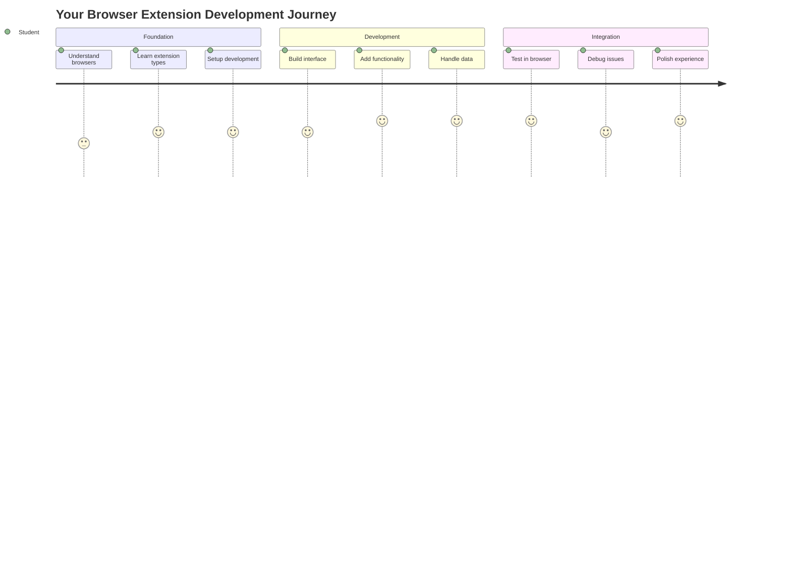
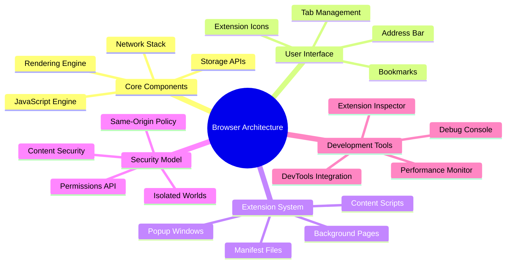
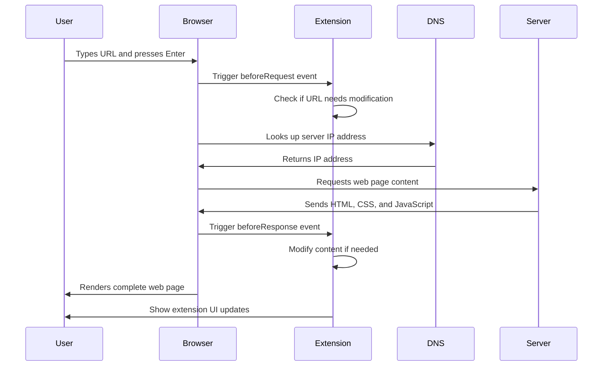
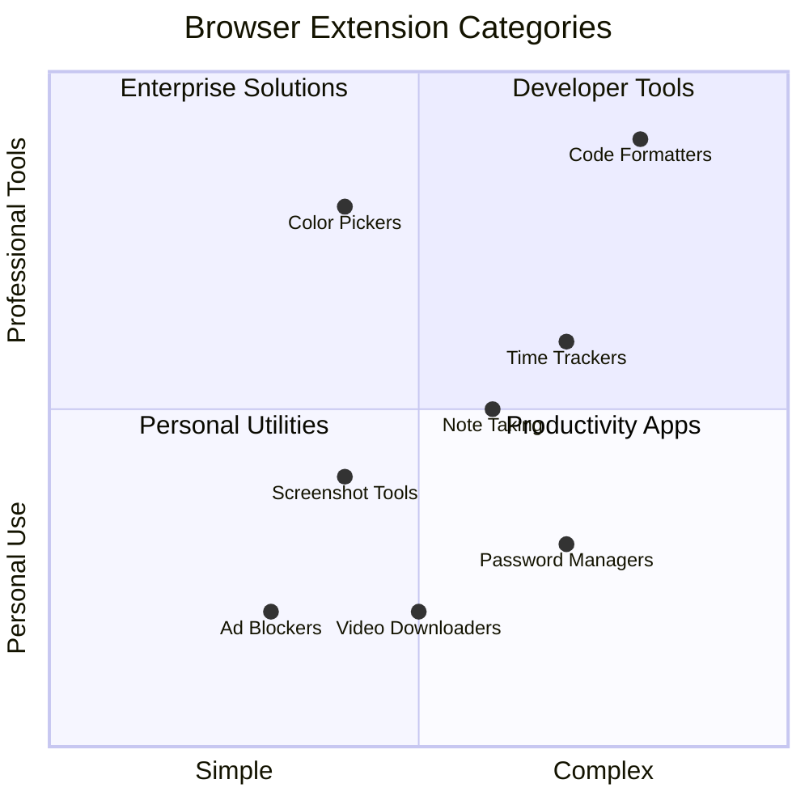
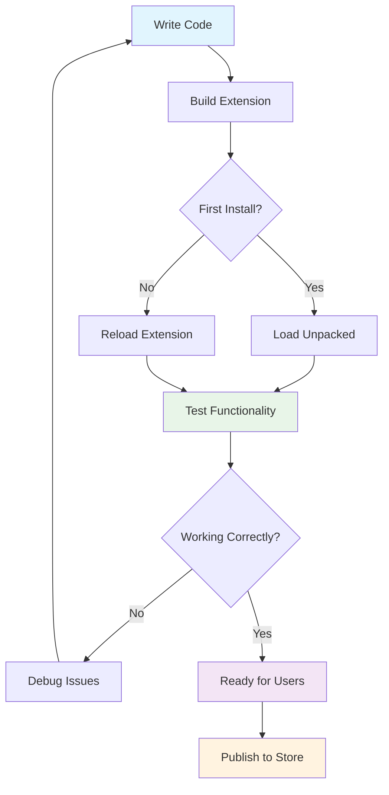
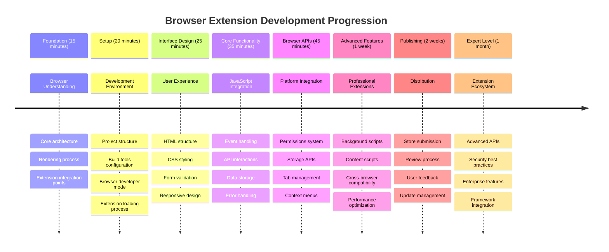

<!--
CO_OP_TRANSLATOR_METADATA:
{
  "original_hash": "00aa85715e1efd4930c17a23e3012e69",
  "translation_date": "2025-11-04T02:08:40+00:00",
  "source_file": "5-browser-extension/1-about-browsers/README.md",
  "language_code": "nl"
}
-->
# Browser Extensie Project Deel 1: Alles over Browsers




> Sketchnote door [Wassim Chegham](https://dev.to/wassimchegham/ever-wondered-what-happens-when-you-type-in-a-url-in-an-address-bar-in-a-browser-3dob)

## Pre-Les Quiz

[Pre-les quiz](https://ff-quizzes.netlify.app/web/quiz/23)

### Introductie

Browserextensies zijn mini-applicaties die je webbrowserervaring verbeteren. Net zoals Tim Berners-Lee's oorspronkelijke visie van een interactieve web, breiden extensies de mogelijkheden van de browser uit voorbij het simpel bekijken van documenten. Van wachtwoordmanagers die je accounts veilig houden tot kleurkiezers die ontwerpers helpen perfecte tinten te vinden, extensies lossen dagelijkse browse-uitdagingen op.

Voordat we je eerste extensie gaan bouwen, is het belangrijk om te begrijpen hoe browsers werken. Net zoals Alexander Graham Bell geluidstransmissie moest begrijpen voordat hij de telefoon uitvond, zal kennis van browserfundamenten je helpen extensies te maken die naadloos integreren met bestaande browsersystemen.

Aan het einde van deze les begrijp je de architectuur van browsers en ben je begonnen met het bouwen van je eerste extensie.



## Begrip van Web Browsers

Een webbrowser is in wezen een geavanceerde documentvertaler. Wanneer je "google.com" in de adresbalk typt, voert de browser een complexe reeks operaties uit - het opvragen van inhoud van servers wereldwijd, en vervolgens het parseren en weergeven van die code in de interactieve webpagina's die je ziet.

Dit proces weerspiegelt hoe de eerste webbrowser, WorldWideWeb, werd ontworpen door Tim Berners-Lee in 1990 om hyperlinked documenten toegankelijk te maken voor iedereen.

✅ **Een beetje geschiedenis**: De eerste browser heette 'WorldWideWeb' en werd in 1990 gemaakt door Sir Timothy Berners-Lee.


> Enkele vroegtijdige browsers, via [Karen McGrane](https://www.slideshare.net/KMcGrane/week-4-ixd-history-personal-computing)

### Hoe Browsers Webinhoud Verwerken

Het proces tussen het invoeren van een URL en het zien van een webpagina omvat verschillende gecoördineerde stappen die binnen enkele seconden plaatsvinden:



**Wat dit proces bereikt:**
- **Vertaalt** de mens-leesbare URL naar een server IP-adres via DNS-lookup
- **Legt** een veilige verbinding met de webserver via HTTP- of HTTPS-protocollen
- **Vraagt** de specifieke webpagina-inhoud op van de server
- **Ontvangt** HTML-markup, CSS-styling en JavaScript-code van de server
- **Geeft** alle inhoud weer in de interactieve webpagina die je ziet

### Kernfuncties van Browsers

Moderne browsers bieden talrijke functies die ontwikkelaars van extensies kunnen benutten:

| Functie | Doel | Mogelijkheden voor extensies |
|---------|---------|------------------------|
| **Rendering Engine** | Geeft HTML, CSS en JavaScript weer | Inhoudsmodificatie, stylinginjectie |
| **JavaScript Engine** | Voert JavaScript-code uit | Aangepaste scripts, API-interacties |
| **Lokale Opslag** | Slaat gegevens lokaal op | Gebruikersvoorkeuren, gecachte gegevens |
| **Netwerkstack** | Behandelt webverzoeken | Verzoekmonitoring, data-analyse |
| **Beveiligingsmodel** | Beschermt gebruikers tegen schadelijke inhoud | Inhoudsfiltering, beveiligingsverbeteringen |

**Begrip van deze functies helpt je:**
- **Identificeren** waar je extensie de meeste waarde kan toevoegen
- **Kiezen** van de juiste browser-API's voor de functionaliteit van je extensie
- **Ontwerpen** van extensies die efficiënt werken met browsersystemen
- **Zorgen** dat je extensie voldoet aan de beveiligingsrichtlijnen van de browser

### Overwegingen bij Cross-Browser Ontwikkeling

Verschillende browsers implementeren standaarden met kleine variaties, vergelijkbaar met hoe verschillende programmeertalen hetzelfde algoritme anders kunnen verwerken. Chrome, Firefox en Safari hebben elk unieke kenmerken waarmee ontwikkelaars rekening moeten houden tijdens de ontwikkeling van extensies.

> 💡 **Pro Tip**: Gebruik [caniuse.com](https://www.caniuse.com) om te controleren welke webtechnologieën worden ondersteund door verschillende browsers. Dit is van onschatbare waarde bij het plannen van de functies van je extensie!

**Belangrijke overwegingen voor extensieontwikkeling:**
- **Test** je extensie op Chrome, Firefox en Edge browsers
- **Pas aan** aan verschillende browserextensie-API's en manifestformaten
- **Behandel** variërende prestatiekenmerken en beperkingen
- **Bied** alternatieven voor browser-specifieke functies die mogelijk niet beschikbaar zijn

✅ **Analytics Inzicht**: Je kunt bepalen welke browsers je gebruikers prefereren door analysepakketten te installeren in je webontwikkelingsprojecten. Deze gegevens helpen je prioriteiten te stellen welke browsers je eerst moet ondersteunen.

## Begrip van Browserextensies

Browserextensies lossen veelvoorkomende browse-uitdagingen op door functionaliteit direct toe te voegen aan de browserinterface. In plaats van aparte applicaties of complexe workflows te vereisen, bieden extensies directe toegang tot tools en functies.

Dit concept weerspiegelt hoe vroege computerpioniers zoals Douglas Engelbart zich voorstelden menselijke capaciteiten te vergroten met technologie - extensies vergroten de basisfunctionaliteit van je browser.



**Populaire extensiecategorieën en hun voordelen:**
- **Productiviteitstools**: Takenbeheerders, notitie-apps en tijdtrackers die je helpen georganiseerd te blijven
- **Beveiligingsverbeteringen**: Wachtwoordmanagers, adblockers en privacytools die je gegevens beschermen
- **Ontwikkelaarstools**: Codeformatters, kleurkiezers en debugginghulpmiddelen die ontwikkeling stroomlijnen
- **Inhoudsverbetering**: Leesmodi, videodownloaders en screenshottools die je webervaring verbeteren

✅ **Reflectievraag**: Wat zijn je favoriete browserextensies? Welke specifieke taken voeren ze uit en hoe verbeteren ze je browse-ervaring?

### 🔄 **Pedagogische Check-in**
**Begrip van Browserarchitectuur**: Voordat je doorgaat naar extensieontwikkeling, zorg ervoor dat je:
- ✅ Uitleg kunt geven over hoe browsers webverzoeken verwerken en inhoud weergeven
- ✅ De belangrijkste componenten van browserarchitectuur kunt identificeren
- ✅ Begrijpt hoe extensies integreren met browserfunctionaliteit
- ✅ Het beveiligingsmodel herkent dat gebruikers beschermt

**Snelle Zelftest**: Kun je het pad traceren van het typen van een URL tot het zien van een webpagina?
1. **DNS-lookup** zet URL om naar IP-adres
2. **HTTP-verzoek** haalt inhoud op van de server
3. **Parsing** verwerkt HTML, CSS en JavaScript
4. **Rendering** toont de uiteindelijke webpagina
5. **Extensies** kunnen inhoud op meerdere stappen aanpassen

## Extensies Installeren en Beheren

Het begrijpen van het installatieproces van extensies helpt je de gebruikerservaring te anticiperen wanneer mensen je extensie installeren. Het installatieproces is gestandaardiseerd in moderne browsers, met kleine variaties in interfaceontwerp.


> **Belangrijk**: Zorg ervoor dat je ontwikkelaarsmodus inschakelt en extensies van andere winkels toestaat bij het testen van je eigen extensies.

### Installatieproces voor Ontwikkelingsextensies

Wanneer je je eigen extensies ontwikkelt en test, volg je deze workflow:



```bash
# Step 1: Build your extension
npm run build
```

**Wat deze opdracht bereikt:**
- **Compileert** je broncode naar browserklare bestanden
- **Bundelt** JavaScript-modules in geoptimaliseerde pakketten
- **Genereert** de uiteindelijke extensiebestanden in de `/dist` map
- **Bereidt** je extensie voor op installatie en testen

**Stap 2: Navigeer naar Browserextensies**
1. **Open** de extensiebeheerpagina van je browser
2. **Klik** op de knop "Instellingen en meer" (het `...`-icoon) rechtsboven
3. **Selecteer** "Extensies" in het dropdownmenu

**Stap 3: Laad je Extensie**
- **Voor nieuwe installaties**: Kies `load unpacked` en selecteer je `/dist` map
- **Voor updates**: Klik op `reload` naast je al geïnstalleerde extensie
- **Voor testen**: Schakel "Ontwikkelaarsmodus" in om toegang te krijgen tot extra debuggingfuncties

### Installatie van Productie-extensies

> ✅ **Opmerking**: Deze ontwikkelingsinstructies zijn specifiek voor extensies die je zelf bouwt. Om gepubliceerde extensies te installeren, bezoek je de officiële browserextensiewinkels zoals de [Microsoft Edge Add-ons store](https://microsoftedge.microsoft.com/addons/Microsoft-Edge-Extensions-Home).

**Begrip van het verschil:**
- **Ontwikkelingsinstallaties** laten je niet-gepubliceerde extensies testen tijdens ontwikkeling
- **Winkelinstallaties** bieden gecontroleerde, gepubliceerde extensies met automatische updates
- **Sideloading** maakt installatie van extensies buiten officiële winkels mogelijk (vereist ontwikkelaarsmodus)

## Je Carbon Footprint Extensie Bouwen

We gaan een browserextensie maken die de CO2-voetafdruk van het energieverbruik in jouw regio weergeeft. Dit project demonstreert essentiële concepten van extensieontwikkeling terwijl het een praktische tool voor milieubewustzijn creëert.

Deze aanpak volgt het principe van "leren door te doen" dat effectief is gebleken sinds de onderwijstheorieën van John Dewey - technische vaardigheden combineren met zinvolle toepassingen in de echte wereld.

### Projectvereisten

Voordat we beginnen met ontwikkelen, verzamelen we de benodigde middelen en afhankelijkheden:

**Vereiste API-toegang:**
- **[CO2 Signal API key](https://www.co2signal.com/)**: Voer je e-mailadres in om je gratis API-sleutel te ontvangen
- **[Regiocode](http://api.electricitymap.org/v3/zones)**: Vind je regiocode met behulp van de [Electricity Map](https://www.electricitymap.org/map) (bijvoorbeeld, Boston gebruikt 'US-NEISO')

**Ontwikkelingstools:**
- **[Node.js en NPM](https://www.npmjs.com)**: Pakketbeheerder voor het installeren van projectafhankelijkheden
- **[Starter code](../../../../5-browser-extension/start)**: Download de `start` map om te beginnen met ontwikkelen

✅ **Meer leren**: Verbeter je vaardigheden in pakketbeheer met deze [uitgebreide Learn module](https://docs.microsoft.com/learn/modules/create-nodejs-project-dependencies/?WT.mc_id=academic-77807-sagibbon)

### Begrip van de Projectstructuur

Het begrijpen van de projectstructuur helpt om ontwikkelingswerk efficiënt te organiseren. Net zoals de Bibliotheek van Alexandrië was georganiseerd voor gemakkelijke kennisopslag, maakt een goed gestructureerde codebase ontwikkeling efficiënter:

```
project-root/
├── dist/                    # Built extension files
│   ├── manifest.json        # Extension configuration
│   ├── index.html           # User interface markup
│   ├── background.js        # Background script functionality
│   └── main.js              # Compiled JavaScript bundle
├── src/                     # Source development files
│   └── index.js             # Your main JavaScript code
├── package.json             # Project dependencies and scripts
└── webpack.config.js        # Build configuration
```

**Wat elk bestand doet:**
- **`manifest.json`**: **Definieert** extensiemetadata, permissies en startpunten
- **`index.html`**: **Creëert** de gebruikersinterface die verschijnt wanneer gebruikers op je extensie klikken
- **`background.js`**: **Behandelt** achtergrondtaken en browsergebeurtenisluisteraars
- **`main.js`**: **Bevat** de uiteindelijke gebundelde JavaScript na het bouwproces
- **`src/index.js`**: **Bevat** je belangrijkste ontwikkelingscode die wordt gecompileerd naar `main.js`

> 💡 **Organisatietip**: Bewaar je API-sleutel en regiocode in een veilige notitie voor gemakkelijke referentie tijdens ontwikkeling. Je hebt deze waarden nodig om de functionaliteit van je extensie te testen.

✅ **Beveiligingsopmerking**: Sla nooit API-sleutels of gevoelige inloggegevens op in je code repository. We laten je zien hoe je deze veilig kunt beheren in de volgende stappen.

## De Extensie Interface Maken

Nu gaan we de componenten van de gebruikersinterface bouwen. De extensie gebruikt een tweeschermbenadering: een configuratiescherm voor de eerste setup en een resultatenpagina voor het weergeven van gegevens.

Dit volgt het principe van progressieve onthulling dat sinds de vroege dagen van computerinterfaceontwerp wordt gebruikt - informatie en opties in een logische volgorde onthullen om gebruikers niet te overweldigen.

### Overzicht van Extensie Weergaven

**Setup Weergave** - Configuratie voor eerste gebruik:


**Resultaten Weergave** - Weergave van CO2-voetafdrukgegevens:


### Het Configuratieformulier Bouwen

Het setupformulier verzamelt gebruikersconfiguratiegegevens tijdens het eerste gebruik. Zodra het is geconfigureerd, blijven deze gegevens opgeslagen in de browser voor toekomstige sessies.

In het bestand `/dist/index.html`, voeg deze formulierstructuur toe:

```html
<form class="form-data" autocomplete="on">
    <div>
        <h2>New? Add your Information</h2>
    </div>
    <div>
        <label for="region">Region Name</label>
        <input type="text" id="region" required class="region-name" />
    </div>
    <div>
        <label for="api">Your API Key from tmrow</label>
        <input type="text" id="api" required class="api-key" />
    </div>
    <button class="search-btn">Submit</button>
</form>
```

**Wat dit formulier doet:**
- **Creëert** een semantische formulierstructuur met correcte labels en input-associaties
- **Activeert** browser-autocomplete functionaliteit voor een verbeterde gebruikerservaring
- **Vereist** dat beide velden worden ingevuld voordat het formulier wordt ingediend met behulp van het `required` attribuut
- **Organiseert** invoervelden met beschrijvende klassenamen voor eenvoudige styling en JavaScript targeting
- **Biedt** duidelijke instructies voor gebruikers die de extensie voor het eerst instellen

### De Resultatenweergave Bouwen

Maak vervolgens het resultatengebied dat de CO2-voetafdrukgegevens zal tonen. Voeg deze HTML onder het formulier toe:

```html
<div class="result">
    <div class="loading">loading...</div>
    <div class="errors"></div>
    <div class="data"></div>
    <div class="result-container">
        <p><strong>Region: </strong><span class="my-region"></span></p>
        <p><strong>Carbon Usage: </strong><span class="carbon-usage"></span></p>
        <p><strong>Fossil Fuel Percentage: </strong><span class="fossil-fuel"></span></p>
    </div>
    <button class="clear-btn">Change region</button>
</div>
```

**Wat deze structuur biedt:**
- **`loading`**: **Toont** een laadbericht terwijl API-gegevens worden opgehaald
- **`errors`**: **Geeft** foutmeldingen weer als API-oproepen mislukken of gegevens ongeldig zijn
- **`data`**: **Bevat** ruwe gegevens voor debugging tijdens ontwikkeling
- **`result-container`**: **Presenteert** geformatteerde CO2-voetafdrukinformatie aan gebruikers
- **`clear-btn`**: **Stelt** gebruikers in staat hun regio te wijzigen en de extensie opnieuw te configureren

### Het Instellen van het Bouwproces

Laten we nu de projectafhankelijkheden installeren en het bouwproces testen:

```bash
npm install
```

**Wat dit installatieproces bereikt:**
- **Downloadt** Webpack en andere ontwikkelingsafhankelijkheden gespecificeerd in `package.json`
- **Configureert** de bouwtoolketen voor het compileren van moderne JavaScript
- **Bereidt** de ontwikkelomgeving voor extensiebouw en testen
- **Activeert** codebundeling, optimalisatie en cross-browser compatibiliteitsfuncties

> 💡 **Inzicht in het Bouwproces**: Webpack bundelt je broncode van `/src/index.js` naar `/dist/main.js`. Dit proces optimaliseert je code voor productie en zorgt voor browsercompatibiliteit.

### Je Voortgang Testen

Op dit punt kun je je extensie testen:
1. **Voer** het build-commando uit om je code te compileren  
2. **Laad** de extensie in je browser via de ontwikkelaarsmodus  
3. **Controleer** of het formulier correct wordt weergegeven en er professioneel uitziet  
4. **Controleer** of alle formulieronderdelen goed zijn uitgelijnd en functioneren  

**Wat je hebt bereikt:**  
- **Gebouwd** de basis HTML-structuur voor je extensie  
- **Gemaakt** zowel configuratie- als resultaatinterfaces met correcte semantische opmaak  
- **Opgezet** een moderne ontwikkelworkflow met tools die in de industrie worden gebruikt  
- **Voorbereid** de basis voor het toevoegen van interactieve JavaScript-functionaliteit  

### 🔄 **Pedagogische Check-in**  
**Voortgang in extensieontwikkeling**: Controleer je begrip voordat je verder gaat:  
- ✅ Kun je het doel van elk bestand in de projectstructuur uitleggen?  
- ✅ Begrijp je hoe het build-proces je broncode transformeert?  
- ✅ Waarom scheiden we configuratie en resultaten in verschillende UI-secties?  
- ✅ Hoe ondersteunt de formulierstructuur zowel bruikbaarheid als toegankelijkheid?  

**Begrip van ontwikkelworkflow**: Je zou nu in staat moeten zijn om:  
1. **HTML en CSS aanpassen** voor de interface van je extensie  
2. **Het build-commando uitvoeren** om je wijzigingen te compileren  
3. **De extensie herladen** in je browser om updates te testen  
4. **Problemen oplossen** met behulp van de ontwikkelaarstools van je browser  

Je hebt de eerste fase van browserextensie-ontwikkeling voltooid. Net zoals de gebroeders Wright eerst aerodynamica moesten begrijpen voordat ze konden vliegen, bereidt het begrijpen van deze basisconcepten je voor op het bouwen van meer complexe interactieve functies in de volgende les.  

## GitHub Copilot Agent Challenge 🚀  

Gebruik de Agent-modus om de volgende uitdaging te voltooien:  

**Beschrijving:** Verbeter de browserextensie door formuliervalidatie en gebruikersfeedback toe te voegen om de gebruikerservaring te verbeteren bij het invoeren van API-sleutels en regiocodes.  

**Prompt:** Maak JavaScript-validatiefuncties die controleren of het API-sleutelveld minstens 20 tekens bevat en of de regiocode het juiste formaat heeft (zoals 'US-NEISO'). Voeg visuele feedback toe door de randkleuren van invoervelden te veranderen naar groen voor geldige invoer en rood voor ongeldige invoer. Voeg ook een toggle-functie toe om de API-sleutel te tonen/verbergen voor beveiligingsdoeleinden.  

Meer informatie over [agent mode](https://code.visualstudio.com/blogs/2025/02/24/introducing-copilot-agent-mode) vind je hier.  

## 🚀 Uitdaging  

Bekijk een browserextensiewinkel en installeer er een in je browser. Je kunt de bestanden op interessante manieren onderzoeken. Wat ontdek je?  

## Post-Les Quiz  

[Post-les quiz](https://ff-quizzes.netlify.app/web/quiz/24)  

## Review & Zelfstudie  

In deze les heb je iets geleerd over de geschiedenis van de webbrowser; neem de tijd om meer te leren over hoe de uitvinders van het World Wide Web het gebruik ervan voor ogen hadden door meer te lezen over de geschiedenis. Enkele nuttige sites zijn:  

[De geschiedenis van webbrowsers](https://www.mozilla.org/firefox/browsers/browser-history/)  

[Geschiedenis van het web](https://webfoundation.org/about/vision/history-of-the-web/)  

[Een interview met Tim Berners-Lee](https://www.theguardian.com/technology/2019/mar/12/tim-berners-lee-on-30-years-of-the-web-if-we-dream-a-little-we-can-get-the-web-we-want)  

### ⚡ **Wat je in de komende 5 minuten kunt doen**  
- [ ] Open de extensiepagina van Chrome/Edge (chrome://extensions) en verken wat je hebt geïnstalleerd  
- [ ] Bekijk het Netwerk-tabblad in de ontwikkelaarstools van je browser terwijl je een webpagina laadt  
- [ ] Probeer de broncode van een pagina te bekijken (Ctrl+U) om de HTML-structuur te zien  
- [ ] Inspecteer een willekeurig webpagina-element en wijzig de CSS in de ontwikkelaarstools  

### 🎯 **Wat je in een uur kunt bereiken**  
- [ ] Maak de post-les quiz en begrijp de basisprincipes van browsers  
- [ ] Maak een eenvoudige manifest.json-bestand voor een browserextensie  
- [ ] Bouw een simpele "Hello World"-extensie die een pop-up toont  
- [ ] Test het laden van je extensie in ontwikkelaarsmodus  
- [ ] Verken de documentatie voor browserextensies van je doelbrowser  

### 📅 **Je weeklange extensiereis**  
- [ ] Maak een functionele browserextensie met echte bruikbaarheid  
- [ ] Leer over content scripts, achtergrondscripts en pop-up interacties  
- [ ] Beheers browser-API's zoals opslag, tabbladen en berichtenuitwisseling  
- [ ] Ontwerp gebruiksvriendelijke interfaces voor je extensie  
- [ ] Test je extensie op verschillende websites en scenario's  
- [ ] Publiceer je extensie in de extensiewinkel van de browser  

### 🌟 **Je maandlange browserontwikkelingsreis**  
- [ ] Bouw meerdere extensies die verschillende gebruikersproblemen oplossen  
- [ ] Leer geavanceerde browser-API's en beveiligingspraktijken  
- [ ] Draag bij aan open source browserextensieprojecten  
- [ ] Beheers cross-browser compatibiliteit en progressieve verbetering  
- [ ] Maak ontwikkeltools en sjablonen voor extensies voor anderen  
- [ ] Word een expert in browserextensies die andere ontwikkelaars helpt  

## 🎯 Jouw tijdlijn naar meesterschap in browserextensies  


  
### 🛠️ Samenvatting van je extensieontwikkeltoolkit  

Na het voltooien van deze les heb je nu:  
- **Kennis van browserarchitectuur**: Begrip van rendering engines, beveiligingsmodellen en extensie-integratie  
- **Ontwikkelomgeving**: Moderne toolchain met Webpack, NPM en debuggingmogelijkheden  
- **UI/UX Basis**: Semantische HTML-structuur met progressieve onthullingspatronen  
- **Beveiligingsbewustzijn**: Begrip van browsermachtigingen en veilige ontwikkelpraktijken  
- **Cross-browser concepten**: Kennis van compatibiliteitsoverwegingen en testmethoden  
- **API-integratie**: Basis voor het werken met externe gegevensbronnen  
- **Professionele workflow**: Ontwikkel- en testprocedures volgens de standaard in de industrie  

**Toepassingen in de echte wereld**: Deze vaardigheden zijn direct toepasbaar op:  
- **Webontwikkeling**: Single-page applicaties en progressieve webapps  
- **Desktopapplicaties**: Electron en webgebaseerde desktopsoftware  
- **Mobiele ontwikkeling**: Hybride apps en webgebaseerde mobiele oplossingen  
- **Enterprise tools**: Interne productiviteitsapplicaties en workflowautomatisering  
- **Open Source**: Bijdragen aan browserextensieprojecten en webstandaarden  

**Volgende niveau**: Je bent klaar om interactieve functionaliteit toe te voegen, te werken met browser-API's en extensies te maken die echte gebruikersproblemen oplossen!  

## Opdracht  

[Restyle je extensie](assignment.md)  

---

**Disclaimer**:  
Dit document is vertaald met behulp van de AI-vertalingsservice [Co-op Translator](https://github.com/Azure/co-op-translator). Hoewel we streven naar nauwkeurigheid, dient u zich ervan bewust te zijn dat geautomatiseerde vertalingen fouten of onnauwkeurigheden kunnen bevatten. Het originele document in de oorspronkelijke taal moet worden beschouwd als de gezaghebbende bron. Voor kritieke informatie wordt professionele menselijke vertaling aanbevolen. Wij zijn niet aansprakelijk voor misverstanden of verkeerde interpretaties die voortvloeien uit het gebruik van deze vertaling.