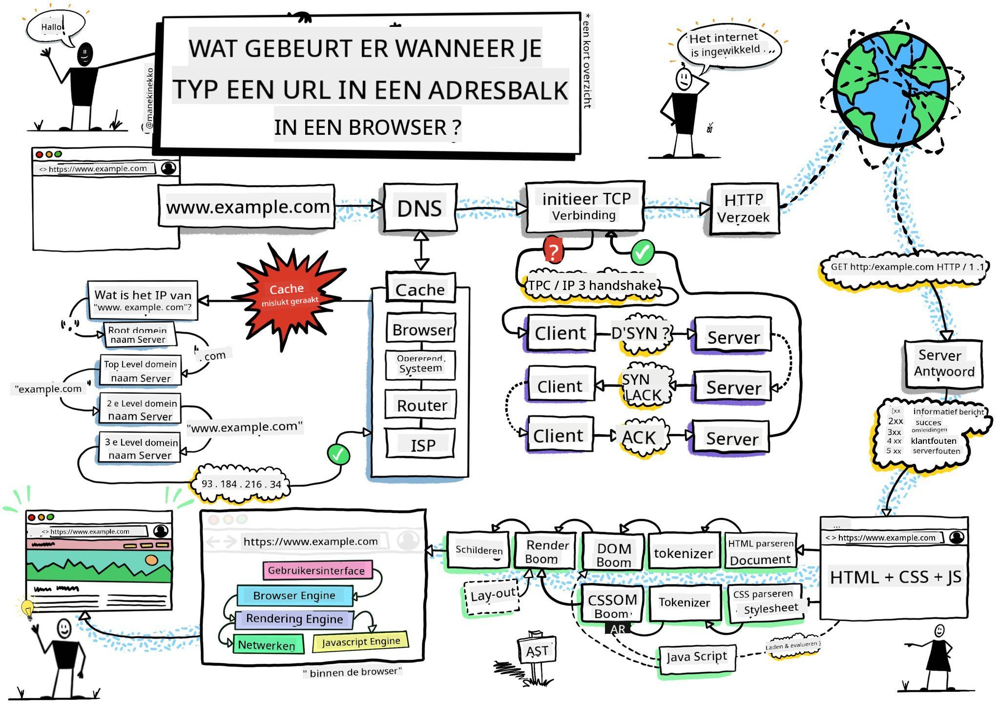
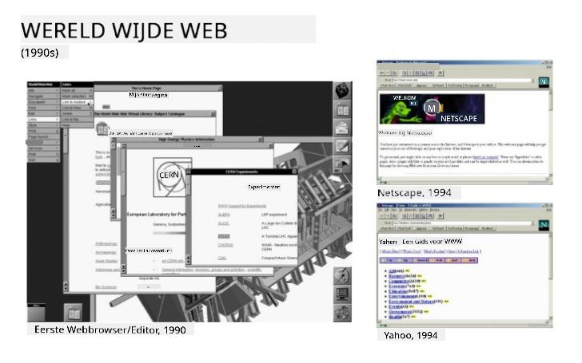
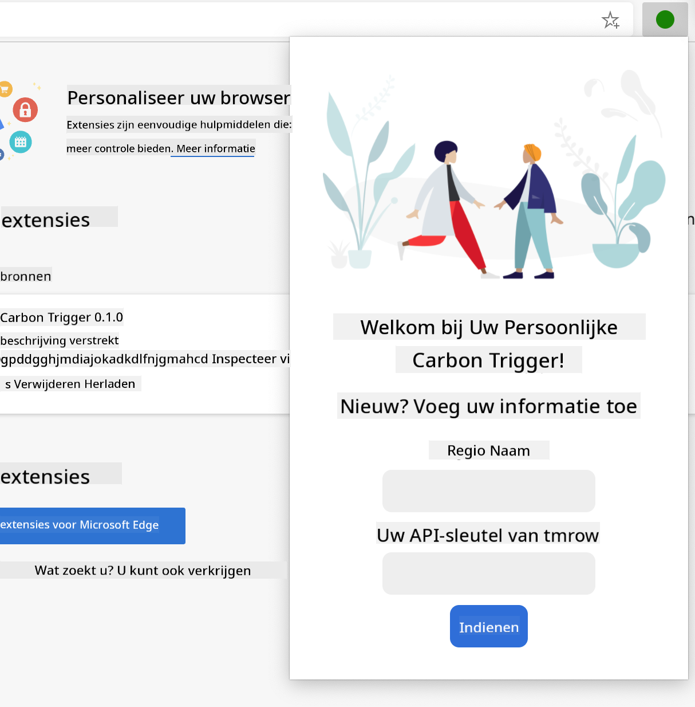
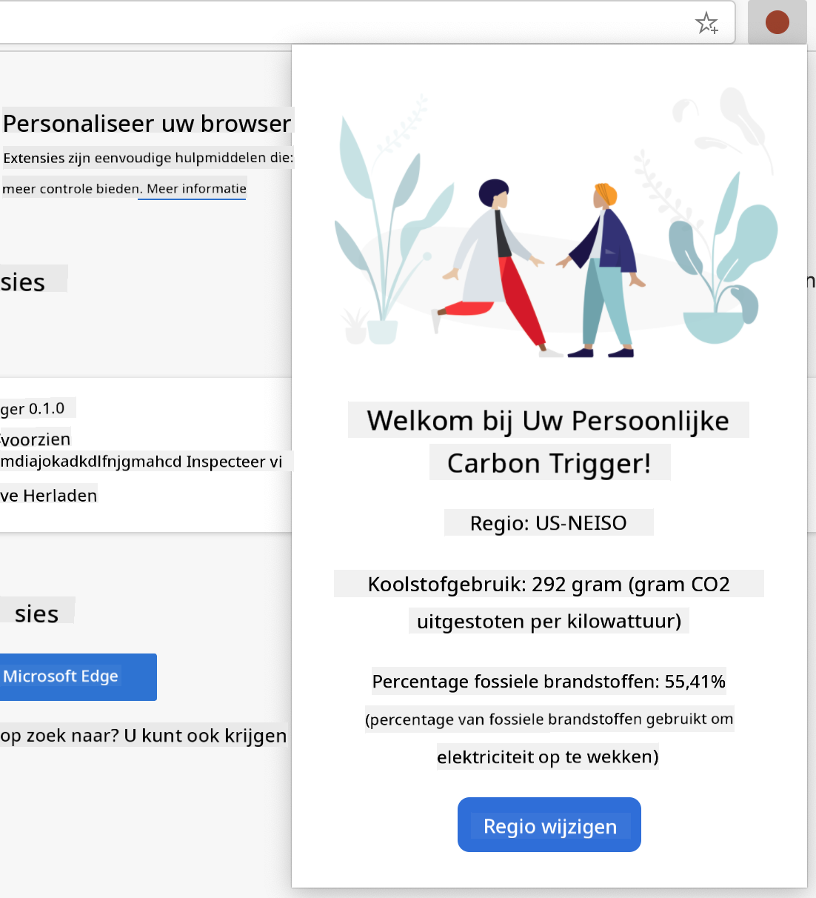

<!--
CO_OP_TRANSLATOR_METADATA:
{
  "original_hash": "0bb55e0b98600afab801eea115228873",
  "translation_date": "2025-08-27T20:47:12+00:00",
  "source_file": "5-browser-extension/1-about-browsers/README.md",
  "language_code": "nl"
}
-->
# Browser Extensie Project Deel 1: Alles over Browsers


> Sketchnote door [Wassim Chegham](https://dev.to/wassimchegham/ever-wondered-what-happens-when-you-type-in-a-url-in-an-address-bar-in-a-browser-3dob)

## Pre-Les Quiz

[Pre-les quiz](https://ashy-river-0debb7803.1.azurestaticapps.net/quiz/23)

### Introductie

Browserextensies voegen extra functionaliteit toe aan een browser. Maar voordat je er een gaat bouwen, is het handig om eerst wat te leren over hoe browsers werken.

### Over de browser

In deze serie lessen leer je hoe je een browserextensie bouwt die werkt op Chrome, Firefox en Edge browsers. In dit deel ontdek je hoe browsers werken en zet je de basis op voor de elementen van de browserextensie.

Maar wat is een browser precies? Het is een softwaretoepassing waarmee een eindgebruiker inhoud van een server kan ophalen en deze kan weergeven op webpagina's.

✅ Een beetje geschiedenis: de eerste browser heette 'WorldWideWeb' en werd in 1990 gemaakt door Sir Timothy Berners-Lee.


> Enkele vroege browsers, via [Karen McGrane](https://www.slideshare.net/KMcGrane/week-4-ixd-history-personal-computing)

Wanneer een gebruiker verbinding maakt met het internet via een URL (Uniform Resource Locator) adres, meestal via Hypertext Transfer Protocol met een `http` of `https` adres, communiceert de browser met een webserver en haalt een webpagina op.

Op dat moment toont de rendering engine van de browser de pagina op het apparaat van de gebruiker, zoals een mobiele telefoon, desktop of laptop.

Browsers hebben ook de mogelijkheid om inhoud te cachen, zodat deze niet elke keer opnieuw van de server hoeft te worden opgehaald. Ze kunnen de geschiedenis van de browse-activiteit van een gebruiker bijhouden, 'cookies' opslaan, kleine stukjes data die informatie bevatten over de activiteit van een gebruiker, en meer.

Een belangrijk punt om te onthouden over browsers is dat ze niet allemaal hetzelfde zijn! Elke browser heeft zijn sterke en zwakke punten, en een professionele webontwikkelaar moet begrijpen hoe webpagina's goed kunnen presteren in verschillende browsers. Dit omvat het omgaan met kleine schermen zoals die van een mobiele telefoon, evenals een gebruiker die offline is.

Een zeer handige website die je waarschijnlijk zou moeten bookmarken in de browser die je verkiest, is [caniuse.com](https://www.caniuse.com). Wanneer je webpagina's bouwt, is het erg nuttig om de lijsten met ondersteunde technologieën van caniuse te gebruiken, zodat je je gebruikers optimaal kunt ondersteunen.

✅ Hoe kun je zien welke browsers het populairst zijn bij de gebruikers van je website? Controleer je analytics - je kunt verschillende analysetools installeren als onderdeel van je webontwikkelingsproces, en deze zullen je vertellen welke browsers het meest worden gebruikt door de verschillende populaire browsers.

## Browserextensies

Waarom zou je een browserextensie willen bouwen? Het is een handige toevoeging aan je browser wanneer je snel toegang nodig hebt tot taken die je vaak herhaalt. Bijvoorbeeld, als je vaak kleuren moet controleren op verschillende webpagina's waarmee je interacteert, kun je een kleurkiezer-browserextensie installeren. Als je moeite hebt om wachtwoorden te onthouden, kun je een wachtwoordbeheer-browserextensie gebruiken.

Browserextensies zijn ook leuk om te ontwikkelen. Ze beheren meestal een beperkt aantal taken die ze goed uitvoeren.

✅ Wat zijn jouw favoriete browserextensies? Welke taken voeren ze uit?

### Extensies installeren

Voordat je begint met bouwen, kijk eens naar het proces van het bouwen en implementeren van een browserextensie. Hoewel elke browser enigszins verschilt in hoe ze deze taak beheren, is het proces vergelijkbaar op Chrome en Firefox met dit voorbeeld op Edge:


> Opmerking: Zorg ervoor dat je de ontwikkelaarsmodus inschakelt en extensies van andere winkels toestaat.

In essentie zal het proces zijn:

- bouw je extensie met `npm run build` 
- navigeer in de browser naar het extensiepaneel via de knop "Instellingen en meer" (het `...` icoon) rechtsboven
- als het een nieuwe installatie is, kies `load unpacked` om een nieuwe extensie te uploaden vanuit de buildmap (in ons geval is dat `/dist`) 
- of klik op `reload` als je de al geïnstalleerde extensie opnieuw laadt

✅ Deze instructies hebben betrekking op extensies die je zelf bouwt; om extensies te installeren die zijn uitgebracht in de browserextensiewinkel die bij elke browser hoort, moet je naar die [winkels](https://microsoftedge.microsoft.com/addons/Microsoft-Edge-Extensions-Home) navigeren en de extensie van je keuze installeren.

### Aan de slag

Je gaat een browserextensie bouwen die de CO2-voetafdruk van jouw regio weergeeft, inclusief het energieverbruik en de bron van de energie. De extensie zal een formulier hebben dat een API-sleutel verzamelt zodat je toegang hebt tot de API van CO2 Signal.

**Je hebt nodig:**

- [een API-sleutel](https://www.co2signal.com/); voer je e-mailadres in het vak op deze pagina in en er wordt een sleutel naar je verzonden
- de [code voor jouw regio](http://api.electricitymap.org/v3/zones) die overeenkomt met de [Electricity Map](https://www.electricitymap.org/map) (in Boston gebruik ik bijvoorbeeld 'US-NEISO').
- de [startcode](../../../../5-browser-extension/start). Download de `start` map; je zult code in deze map voltooien.
- [NPM](https://www.npmjs.com) - NPM is een pakketbeheerder; installeer het lokaal en de pakketten die in je `package.json` bestand staan, worden geïnstalleerd voor gebruik door je webasset

✅ Leer meer over pakketbeheer in deze [uitstekende Learn module](https://docs.microsoft.com/learn/modules/create-nodejs-project-dependencies/?WT.mc_id=academic-77807-sagibbon)

Neem even de tijd om de codebase te bekijken:

dist
    -|manifest.json (standaardinstellingen hier)
    -|index.html (front-end HTML markup hier)
    -|background.js (achtergrond JS hier)
    -|main.js (gebouwde JS)
src
    -|index.js (jouw JS code komt hier)

✅ Zodra je je API-sleutel en regiocode bij de hand hebt, sla deze ergens op in een notitie voor toekomstig gebruik.

### Bouw de HTML voor de extensie

Deze extensie heeft twee weergaven. Eén om de API-sleutel en regiocode te verzamelen:



En de tweede om het koolstofgebruik van de regio weer te geven:



Laten we beginnen met het bouwen van de HTML voor het formulier en het stylen met CSS.

In de `/dist` map bouw je een formulier en een resultaatgebied. In het `index.html` bestand vul je het afgebakende formuliergebied in:

```HTML
<form class="form-data" autocomplete="on">
	<div>
		<h2>New? Add your Information</h2>
	</div>
	<div>
		<label for="region">Region Name</label>
		<input type="text" id="region" required class="region-name" />
	</div>
	<div>
		<label for="api">Your API Key from tmrow</label>
		<input type="text" id="api" required class="api-key" />
	</div>
	<button class="search-btn">Submit</button>
</form>	
```
Dit is het formulier waar je opgeslagen informatie wordt ingevoerd en opgeslagen in de lokale opslag.

Maak vervolgens het resultaatgebied; voeg onder de laatste form-tag enkele divs toe:

```HTML
<div class="result">
	<div class="loading">loading...</div>
	<div class="errors"></div>
	<div class="data"></div>
	<div class="result-container">
		<p><strong>Region: </strong><span class="my-region"></span></p>
		<p><strong>Carbon Usage: </strong><span class="carbon-usage"></span></p>
		<p><strong>Fossil Fuel Percentage: </strong><span class="fossil-fuel"></span></p>
	</div>
	<button class="clear-btn">Change region</button>
</div>
```
Op dit punt kun je een build proberen. Zorg ervoor dat je de pakketafhankelijkheden van deze extensie installeert:

```
npm install
```

Deze opdracht gebruikt npm, de Node Package Manager, om webpack te installeren voor het buildproces van je extensie. Webpack is een bundelaar die code compileert. Je kunt de output van dit proces bekijken door te kijken in `/dist/main.js` - je ziet dat de code is gebundeld.

Voor nu zou de extensie moeten bouwen en, als je deze in Edge implementeert als extensie, zie je een formulier netjes weergegeven.

Gefeliciteerd, je hebt de eerste stappen gezet richting het bouwen van een browserextensie. In de volgende lessen maak je het functioneler en nuttiger.

---

## 🚀 Uitdaging

Bekijk een browserextensiewinkel en installeer er een in je browser. Je kunt de bestanden op interessante manieren onderzoeken. Wat ontdek je?

## Post-Les Quiz

[Post-les quiz](https://ashy-river-0debb7803.1.azurestaticapps.net/quiz/24)

## Review & Zelfstudie

In deze les heb je een beetje geleerd over de geschiedenis van de webbrowser; neem de tijd om meer te leren over hoe de uitvinders van het World Wide Web het gebruik ervan voor ogen hadden door meer te lezen over de geschiedenis. Enkele nuttige sites zijn:

[De geschiedenis van webbrowsers](https://www.mozilla.org/firefox/browsers/browser-history/)

[Geschiedenis van het web](https://webfoundation.org/about/vision/history-of-the-web/)

[Een interview met Tim Berners-Lee](https://www.theguardian.com/technology/2019/mar/12/tim-berners-lee-on-30-years-of-the-web-if-we-dream-a-little-we-can-get-the-web-we-want)

## Opdracht 

[Restyle je extensie](assignment.md)

---

**Disclaimer**:  
Dit document is vertaald met behulp van de AI-vertalingsservice [Co-op Translator](https://github.com/Azure/co-op-translator). Hoewel we streven naar nauwkeurigheid, dient u zich ervan bewust te zijn dat geautomatiseerde vertalingen fouten of onnauwkeurigheden kunnen bevatten. Het originele document in zijn oorspronkelijke taal moet worden beschouwd als de gezaghebbende bron. Voor cruciale informatie wordt professionele menselijke vertaling aanbevolen. Wij zijn niet aansprakelijk voor eventuele misverstanden of verkeerde interpretaties die voortvloeien uit het gebruik van deze vertaling.