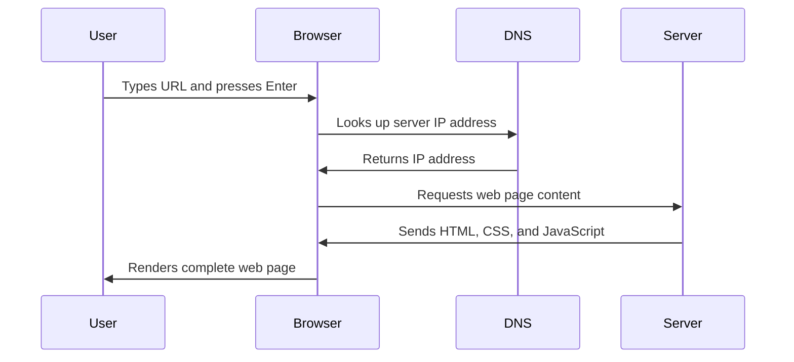

<!--
CO_OP_TRANSLATOR_METADATA:
{
  "original_hash": "33a875c522f237a2026e4653240dfc07",
  "translation_date": "2025-10-23T01:08:12+00:00",
  "source_file": "5-browser-extension/1-about-browsers/README.md",
  "language_code": "nl"
}
-->
# Browser Extensie Project Deel 1: Alles over Browsers


> Sketchnote door [Wassim Chegham](https://dev.to/wassimchegham/ever-wondered-what-happens-when-you-type-in-a-url-in-an-address-bar-in-a-browser-3dob)

## Pre-Lecture Quiz

[Pre-lecture quiz](https://ff-quizzes.netlify.app/web/quiz/23)

### Introductie

Browserextensies zijn mini-applicaties die je webbrowserervaring verbeteren. Net zoals Tim Berners-Lee's oorspronkelijke visie van een interactieve web, breiden extensies de mogelijkheden van de browser uit voorbij het simpelweg bekijken van documenten. Van wachtwoordmanagers die je accounts beveiligen tot kleurkiezers die ontwerpers helpen perfecte tinten te vinden, extensies lossen alledaagse browse-uitdagingen op.

Voordat we je eerste extensie gaan bouwen, is het belangrijk om te begrijpen hoe browsers werken. Net zoals Alexander Graham Bell geluidsoverdracht moest begrijpen voordat hij de telefoon uitvond, zal kennis van de basisprincipes van browsers je helpen extensies te maken die naadloos integreren met bestaande browsersystemen.

Aan het einde van deze les begrijp je de architectuur van browsers en ben je begonnen met het bouwen van je eerste extensie.

## Begrip van Web Browsers

Een webbrowser is in wezen een geavanceerde documentvertaler. Wanneer je "google.com" in de adresbalk typt, voert de browser een complexe reeks bewerkingen uit - het opvragen van inhoud van servers wereldwijd, en vervolgens het parseren en weergeven van die code in de interactieve webpagina's die je ziet.

Dit proces weerspiegelt hoe de eerste webbrowser, WorldWideWeb, werd ontworpen door Tim Berners-Lee in 1990 om hyperlinked documenten toegankelijk te maken voor iedereen.

✅ **Een beetje geschiedenis**: De eerste browser heette 'WorldWideWeb' en werd in 1990 gecreëerd door Sir Timothy Berners-Lee.


> Enkele vroege browsers, via [Karen McGrane](https://www.slideshare.net/KMcGrane/week-4-ixd-history-personal-computing)

### Hoe Browsers Webinhoud Verwerken

Het proces tussen het invoeren van een URL en het zien van een webpagina omvat verschillende gecoördineerde stappen die binnen enkele seconden plaatsvinden:



**Wat dit proces bereikt:**
- **Vertaalt** de mens-leesbare URL naar een server IP-adres via DNS-lookup
- **Stelt** een veilige verbinding met de webserver in via HTTP- of HTTPS-protocollen
- **Vraagt** de specifieke webpagina-inhoud op van de server
- **Ontvangt** HTML-markup, CSS-styling en JavaScript-code van de server
- **Rendert** alle inhoud tot de interactieve webpagina die je ziet

### Kernfuncties van Browsers

Moderne browsers bieden tal van functies die ontwikkelaars van extensies kunnen benutten:

| Functie | Doel | Mogelijkheden voor extensies |
|---------|---------|------------------------|
| **Rendering Engine** | Geeft HTML, CSS en JavaScript weer | Inhoudsmodificatie, stylinginjectie |
| **JavaScript Engine** | Voert JavaScript-code uit | Aangepaste scripts, API-interacties |
| **Lokale opslag** | Slaat gegevens lokaal op | Gebruikersvoorkeuren, gecachte gegevens |
| **Netwerkstack** | Behandelt webverzoeken | Verzoekmonitoring, data-analyse |
| **Beveiligingsmodel** | Beschermt gebruikers tegen schadelijke inhoud | Inhoudsfiltering, beveiligingsverbeteringen |

**Het begrijpen van deze functies helpt je:**
- **Identificeren** waar je extensie de meeste waarde kan toevoegen
- **Kiezen** van de juiste browser-API's voor de functionaliteit van je extensie
- **Ontwerpen** van extensies die efficiënt werken met browsersystemen
- **Zorgen** dat je extensie voldoet aan de beste beveiligingspraktijken van de browser

### Overwegingen voor Cross-Browser Ontwikkeling

Verschillende browsers implementeren standaarden met kleine variaties, vergelijkbaar met hoe verschillende programmeertalen hetzelfde algoritme anders kunnen verwerken. Chrome, Firefox en Safari hebben elk unieke kenmerken waarmee ontwikkelaars rekening moeten houden bij het ontwikkelen van extensies.

> 💡 **Pro Tip**: Gebruik [caniuse.com](https://www.caniuse.com) om te controleren welke webtechnologieën worden ondersteund door verschillende browsers. Dit is van onschatbare waarde bij het plannen van de functies van je extensie!

**Belangrijke overwegingen voor extensieontwikkeling:**
- **Test** je extensie op Chrome, Firefox en Edge browsers
- **Pas aan** aan verschillende browserextensie-API's en manifestformaten
- **Behandel** variërende prestatiekenmerken en beperkingen
- **Voorzie** in alternatieven voor browserspecifieke functies die mogelijk niet beschikbaar zijn

✅ **Analytics Inzicht**: Je kunt bepalen welke browsers je gebruikers prefereren door analysetools te installeren in je webontwikkelingsprojecten. Deze gegevens helpen je prioriteiten te stellen welke browsers je eerst moet ondersteunen.

## Begrip van Browserextensies

Browserextensies lossen veelvoorkomende browse-uitdagingen op door functionaliteit direct toe te voegen aan de browserinterface. In plaats van aparte applicaties of complexe workflows te vereisen, bieden extensies directe toegang tot tools en functies.

Dit concept weerspiegelt hoe vroege computerpioniers zoals Douglas Engelbart zich voorstelden dat technologie menselijke capaciteiten zou kunnen vergroten - extensies vergroten de basisfunctionaliteit van je browser.

**Populaire extensiecategorieën en hun voordelen:**
- **Productiviteitstools**: Takenbeheerders, notitie-apps en tijdtrackers die je helpen georganiseerd te blijven
- **Beveiligingsverbeteringen**: Wachtwoordmanagers, adblockers en privacytools die je gegevens beschermen
- **Ontwikkelaarstools**: Codeformatters, kleurkiezers en debugginghulpmiddelen die ontwikkeling stroomlijnen
- **Inhoudsverbetering**: Leesmodi, videodownloaders en screenshottools die je webervaring verbeteren

✅ **Reflectievraag**: Wat zijn jouw favoriete browserextensies? Welke specifieke taken voeren ze uit en hoe verbeteren ze jouw browse-ervaring?

## Extensies Installeren en Beheren

Het begrijpen van het installatieproces van extensies helpt je de gebruikerservaring te anticiperen wanneer mensen jouw extensie installeren. Het installatieproces is gestandaardiseerd in moderne browsers, met kleine variaties in interfaceontwerp.


> **Belangrijk**: Zorg ervoor dat je ontwikkelaarsmodus inschakelt en extensies van andere winkels toestaat bij het testen van je eigen extensies.

### Installatieproces voor Ontwikkelingsextensies

Wanneer je je eigen extensies ontwikkelt en test, volg je deze workflow:

```bash
# Step 1: Build your extension
npm run build
```

**Wat deze opdracht bereikt:**
- **Compileert** je broncode tot browserklare bestanden
- **Bundelt** JavaScript-modules in geoptimaliseerde pakketten
- **Genereert** de uiteindelijke extensiebestanden in de `/dist` map
- **Bereidt** je extensie voor op installatie en testen

**Stap 2: Navigeer naar Browserextensies**
1. **Open** de extensiebeheerpagina van je browser
2. **Klik** op de knop "Instellingen en meer" (het `...` icoon) rechtsboven
3. **Selecteer** "Extensies" in het dropdownmenu

**Stap 3: Laad je extensie**
- **Voor nieuwe installaties**: Kies `load unpacked` en selecteer je `/dist` map
- **Voor updates**: Klik op `reload` naast je al geïnstalleerde extensie
- **Voor testen**: Schakel "Ontwikkelaarsmodus" in om toegang te krijgen tot extra debuggingfuncties

### Productie Extensie Installatie

> ✅ **Let op**: Deze ontwikkelinstructies zijn specifiek voor extensies die je zelf bouwt. Om gepubliceerde extensies te installeren, bezoek je de officiële browserextensiewinkels zoals de [Microsoft Edge Add-ons store](https://microsoftedge.microsoft.com/addons/Microsoft-Edge-Extensions-Home).

**Het verschil begrijpen:**
- **Ontwikkelingsinstallaties** stellen je in staat om niet-gepubliceerde extensies te testen tijdens de ontwikkeling
- **Winkelinstallaties** bieden gecontroleerde, gepubliceerde extensies met automatische updates
- **Sideloading** maakt installatie van extensies buiten officiële winkels mogelijk (vereist ontwikkelaarsmodus)

## Je CO2-voetafdruk Extensie Bouwen

We gaan een browserextensie maken die de CO2-voetafdruk van het energieverbruik in jouw regio weergeeft. Dit project demonstreert essentiële concepten van extensieontwikkeling terwijl het een praktische tool voor milieubewustzijn creëert.

Deze aanpak volgt het principe van "leren door te doen" dat effectief is gebleken sinds de onderwijstheorieën van John Dewey - het combineren van technische vaardigheden met zinvolle toepassingen in de echte wereld.

### Projectvereisten

Voordat we beginnen met ontwikkelen, verzamelen we de benodigde bronnen en afhankelijkheden:

**Vereiste API-toegang:**
- **[CO2 Signal API key](https://www.co2signal.com/)**: Voer je e-mailadres in om je gratis API-sleutel te ontvangen
- **[Regiocode](http://api.electricitymap.org/v3/zones)**: Vind je regiocode met behulp van de [Electricity Map](https://www.electricitymap.org/map) (bijvoorbeeld, Boston gebruikt 'US-NEISO')

**Ontwikkelingstools:**
- **[Node.js en NPM](https://www.npmjs.com)**: Pakketbeheerder voor het installeren van projectafhankelijkheden
- **[Starter code](../../../../5-browser-extension/start)**: Download de `start` map om te beginnen met ontwikkelen

✅ **Meer leren**: Verbeter je vaardigheden in pakketbeheer met deze [uitgebreide Learn module](https://docs.microsoft.com/learn/modules/create-nodejs-project-dependencies/?WT.mc_id=academic-77807-sagibbon)

### Begrip van de Projectstructuur

Het begrijpen van de projectstructuur helpt om ontwikkelingswerk efficiënt te organiseren. Net zoals de Bibliotheek van Alexandrië was georganiseerd voor gemakkelijke kennisopslag, maakt een goed gestructureerde codebase ontwikkeling efficiënter:

```
project-root/
├── dist/                    # Built extension files
│   ├── manifest.json        # Extension configuration
│   ├── index.html           # User interface markup
│   ├── background.js        # Background script functionality
│   └── main.js              # Compiled JavaScript bundle
└── src/                     # Source development files
    └── index.js             # Your main JavaScript code
```

**Wat elk bestand doet:**
- **`manifest.json`**: **Definieert** extensiemetadata, permissies en startpunten
- **`index.html`**: **Creëert** de gebruikersinterface die verschijnt wanneer gebruikers op je extensie klikken
- **`background.js`**: **Behandelt** achtergrondtaken en browsergebeurtenissen
- **`main.js`**: **Bevat** de uiteindelijke gebundelde JavaScript na het bouwproces
- **`src/index.js`**: **Bevat** je belangrijkste ontwikkelingscode die wordt gecompileerd tot `main.js`

> 💡 **Organisatietip**: Bewaar je API-sleutel en regiocode in een veilige notitie voor eenvoudige referentie tijdens de ontwikkeling. Je hebt deze waarden nodig om de functionaliteit van je extensie te testen.

✅ **Beveiligingsnotitie**: Sla nooit API-sleutels of gevoelige inloggegevens op in je code repository. We laten je zien hoe je deze veilig kunt beheren in de volgende stappen.

## De Extensie Interface Maken

Nu gaan we de gebruikersinterfacecomponenten bouwen. De extensie gebruikt een tweeschermbenadering: een configuratiescherm voor de eerste setup en een resultatenpagina voor het weergeven van gegevens.

Dit volgt het principe van progressieve onthulling dat sinds de vroege dagen van computergebruik wordt toegepast - informatie en opties worden in een logische volgorde onthuld om gebruikers niet te overweldigen.

### Overzicht van Extensie Weergaven

**Setup Weergave** - Configuratie voor eerste gebruik:


**Resultaten Weergave** - Weergave van CO2-voetafdrukgegevens:


### Het Configuratieformulier Bouwen

Het setupformulier verzamelt gebruikersconfiguratiegegevens tijdens het eerste gebruik. Zodra het is geconfigureerd, blijven deze gegevens opgeslagen in de browser voor toekomstige sessies.

Voeg deze formulierstructuur toe in het bestand `/dist/index.html`:

```html
<form class="form-data" autocomplete="on">
    <div>
        <h2>New? Add your Information</h2>
    </div>
    <div>
        <label for="region">Region Name</label>
        <input type="text" id="region" required class="region-name" />
    </div>
    <div>
        <label for="api">Your API Key from tmrow</label>
        <input type="text" id="api" required class="api-key" />
    </div>
    <button class="search-btn">Submit</button>
</form>
```

**Wat dit formulier bereikt:**
- **Creëert** een semantische formulierstructuur met correcte labels en inputassociaties
- **Schakelt** browser-autocomplete functionaliteit in voor een verbeterde gebruikerservaring
- **Vereist** dat beide velden worden ingevuld voordat het formulier wordt ingediend met behulp van het `required` attribuut
- **Organiseert** inputs met beschrijvende klassenamen voor eenvoudige styling en JavaScript targeting
- **Biedt** duidelijke instructies voor gebruikers die de extensie voor de eerste keer instellen

### Het Resultaatweergave Bouwen

Maak vervolgens het resultatengebied dat de CO2-voetafdrukgegevens zal tonen. Voeg deze HTML toe onder het formulier:

```html
<div class="result">
    <div class="loading">loading...</div>
    <div class="errors"></div>
    <div class="data"></div>
    <div class="result-container">
        <p><strong>Region: </strong><span class="my-region"></span></p>
        <p><strong>Carbon Usage: </strong><span class="carbon-usage"></span></p>
        <p><strong>Fossil Fuel Percentage: </strong><span class="fossil-fuel"></span></p>
    </div>
    <button class="clear-btn">Change region</button>
</div>
```

**Wat deze structuur biedt:**
- **`loading`**: **Toont** een laadbericht terwijl API-gegevens worden opgehaald
- **`errors`**: **Geeft** foutmeldingen weer als API-aanroepen mislukken of gegevens ongeldig zijn
- **`data`**: **Bevat** ruwe gegevens voor debugging tijdens ontwikkeling
- **`result-container`**: **Presenteert** geformatteerde CO2-voetafdrukinformatie aan gebruikers
- **`clear-btn`**: **Maakt** het mogelijk voor gebruikers om hun regio te wijzigen en de extensie opnieuw in te stellen

### Het Bouwproces Instellen

Laten we nu de projectafhankelijkheden installeren en het bouwproces testen:

```bash
npm install
```

**Wat dit installatieproces bereikt:**
- **Downloadt** Webpack en andere ontwikkelingsafhankelijkheden gespecificeerd in `package.json`
- **Configureert** de bouwtoolchain voor het compileren van moderne JavaScript
- **Bereidt** de ontwikkelomgeving voor op het bouwen en testen van extensies
- **Schakelt** codebundeling, optimalisatie en cross-browser compatibiliteitsfuncties in

> 💡 **Inzicht in het Bouwproces**: Webpack bundelt je broncode van `/src/index.js` naar `/dist/main.js`. Dit proces optimaliseert je code voor productie en zorgt voor browsercompatibiliteit.

### Je Voortgang Testen

Op dit punt kun je je extensie testen:

1. **Voer** de bouwopdracht uit om je code te compileren
2. **Laad** de extensie in je browser met behulp van de ontwikkelaarsmodus
3. **Controleer** of het formulier correct wordt weergegeven en er professioneel uitziet
4. **Controleer** of alle formelementen correct zijn uitgelijnd en functioneel

**Wat je hebt bereikt:**
- **Gebouwd** de fundamentele HTML-structuur voor je extensie
- **Gecreëerd** zowel configuratie- als resultateninterfaces met correcte semantische markup
- **Ingesteld** een moderne ontwikkelworkflow met industriestandaard tools
- **Voorbereid** de basis voor het toevoegen van interactieve JavaScript-functionaliteit

Je hebt de eerste fase van browserextensieontwikkeling voltooid. Net zoals de gebroeders Wright eerst aerodynamica moesten begrijpen voordat ze konden vliegen, bereidt het begrijpen van deze fundamentele concepten je voor op het bouwen van meer complexe interactieve functies in de volgende les.

## GitHub Copilot Agent Uitdaging 🚀

Gebruik de Agent-modus om de volgende uitdaging te voltooien:
**Beschrijving:** Verbeter de browserextensie door formuliervalidatie en gebruikersfeedback toe te voegen om de gebruikerservaring te verbeteren bij het invoeren van API-sleutels en regiocodes.

**Opdracht:** Maak JavaScript-validatiefuncties die controleren of het API-sleutelsveld minimaal 20 tekens bevat en of de regiocode het juiste formaat heeft (zoals 'US-NEISO'). Voeg visuele feedback toe door de randkleuren van invoervelden te veranderen naar groen voor geldige invoer en rood voor ongeldige invoer. Voeg ook een schakeloptie toe om de API-sleutel te tonen/verbergen voor beveiligingsdoeleinden.

Lees meer over [agent mode](https://code.visualstudio.com/blogs/2025/02/24/introducing-copilot-agent-mode) hier.

## 🚀 Uitdaging

Bekijk een browserextensiewinkel en installeer er een op je browser. Je kunt de bestanden op interessante manieren onderzoeken. Wat ontdek je?

## Quiz na de les

[Quiz na de les](https://ff-quizzes.netlify.app/web/quiz/24)

## Review & Zelfstudie

In deze les heb je iets geleerd over de geschiedenis van de webbrowser; neem de tijd om meer te leren over hoe de uitvinders van het World Wide Web het gebruik ervan voor ogen hadden door meer te lezen over de geschiedenis ervan. Enkele nuttige sites zijn:

[De geschiedenis van webbrowsers](https://www.mozilla.org/firefox/browsers/browser-history/)

[Geschiedenis van het web](https://webfoundation.org/about/vision/history-of-the-web/)

[Een interview met Tim Berners-Lee](https://www.theguardian.com/technology/2019/mar/12/tim-berners-lee-on-30-years-of-the-web-if-we-dream-a-little-we-can-get-the-web-we-want)

## Opdracht 

[Restyle je extensie](assignment.md)

---

**Disclaimer**:  
Dit document is vertaald met behulp van de AI-vertalingsservice [Co-op Translator](https://github.com/Azure/co-op-translator). Hoewel we streven naar nauwkeurigheid, dient u zich ervan bewust te zijn dat geautomatiseerde vertalingen fouten of onnauwkeurigheden kunnen bevatten. Het originele document in de oorspronkelijke taal moet worden beschouwd als de gezaghebbende bron. Voor kritieke informatie wordt professionele menselijke vertaling aanbevolen. Wij zijn niet aansprakelijk voor eventuele misverstanden of verkeerde interpretaties die voortvloeien uit het gebruik van deze vertaling.