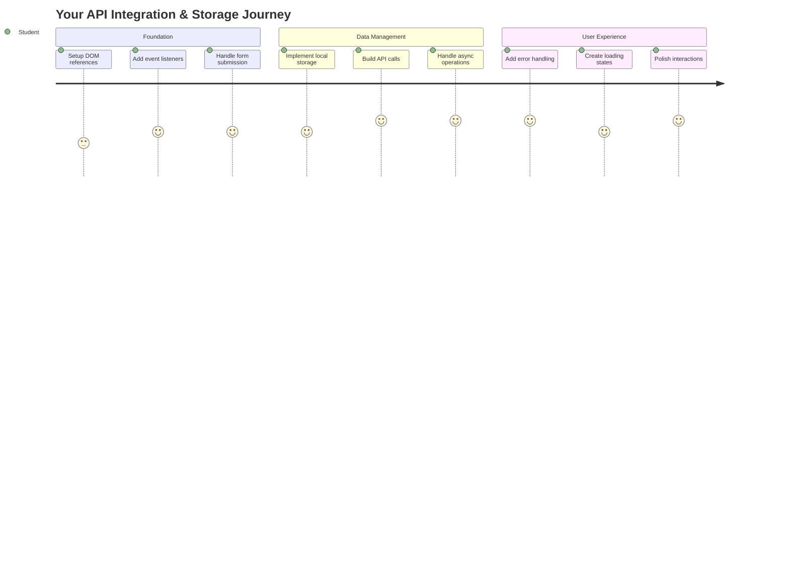
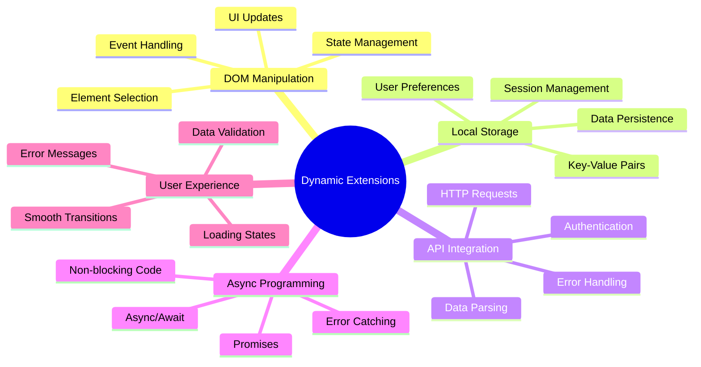
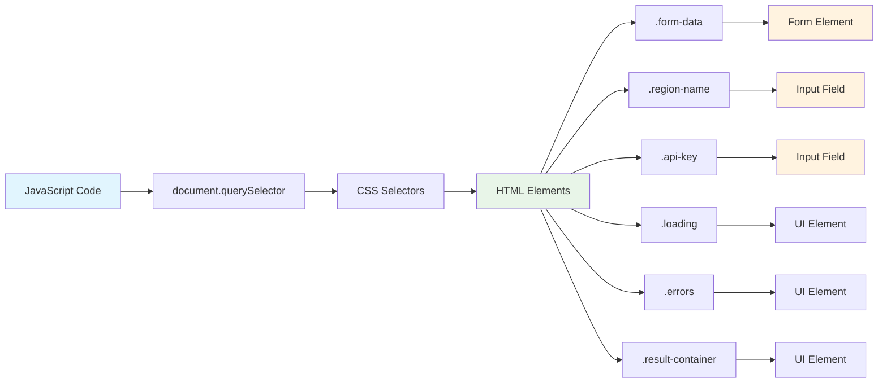
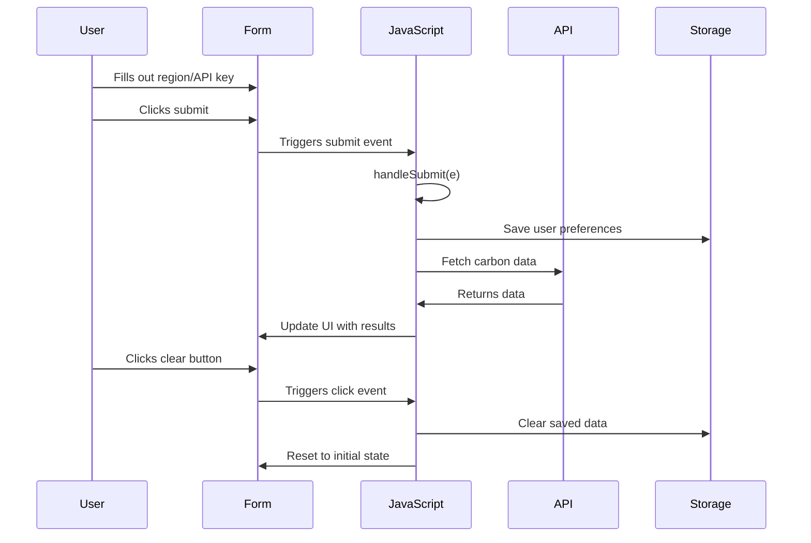
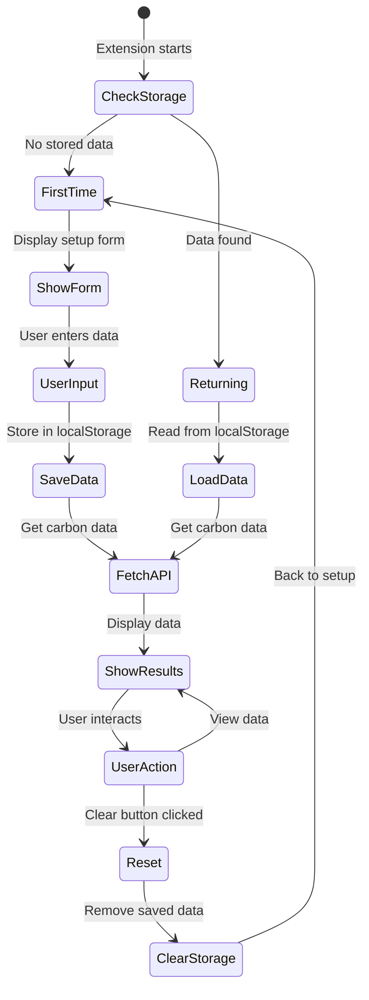
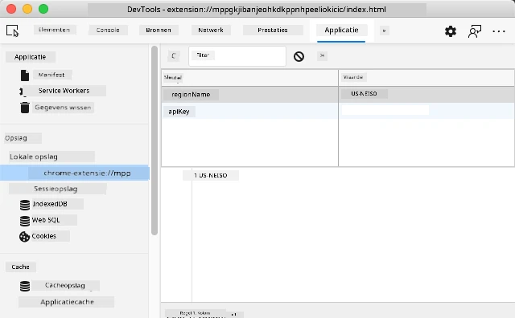
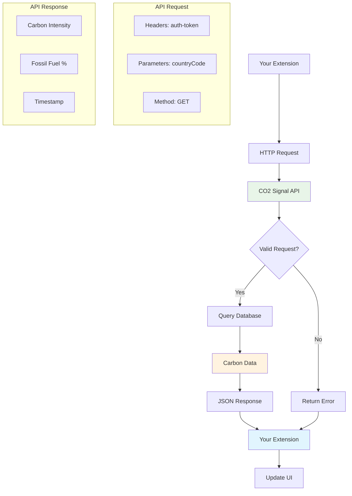
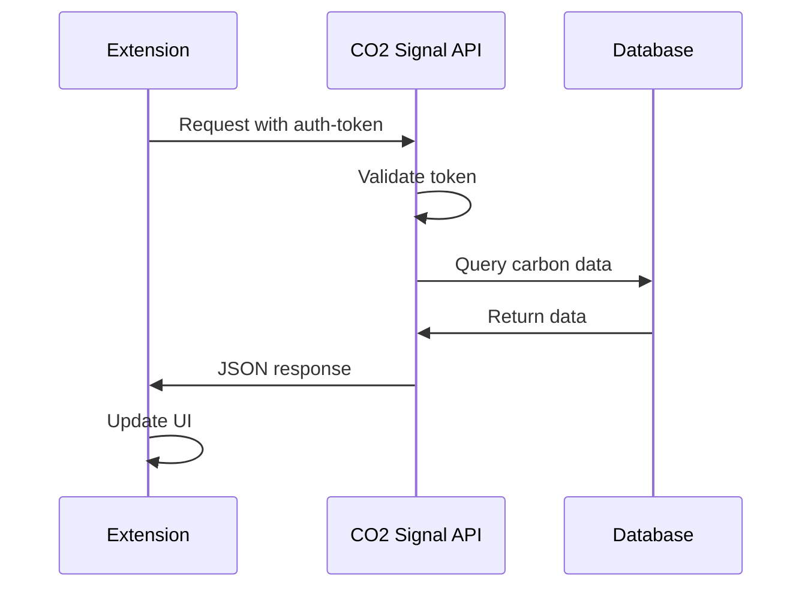
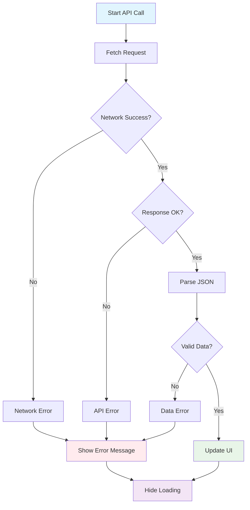
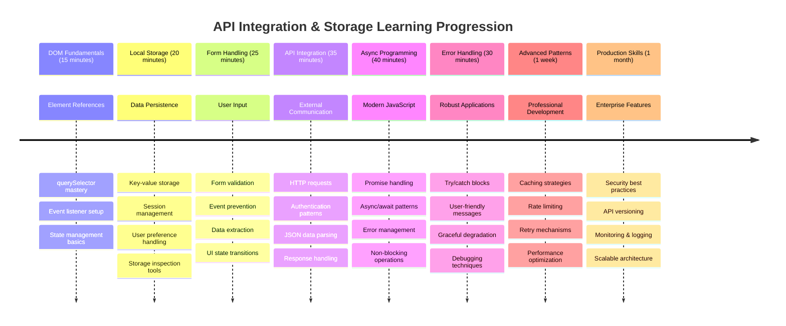

<!--
CO_OP_TRANSLATOR_METADATA:
{
  "original_hash": "2b6203a48c48d8234e0948353b47d84e",
  "translation_date": "2025-11-04T02:08:08+00:00",
  "source_file": "5-browser-extension/2-forms-browsers-local-storage/README.md",
  "language_code": "nl"
}
-->
# Browserextensieproject Deel 2: Een API aanroepen, gebruik Local Storage



## Pre-lezing Quiz

[Pre-lezing quiz](https://ff-quizzes.netlify.app/web/quiz/25)

## Introductie

Weet je nog die browserextensie die je bent begonnen te bouwen? Op dit moment heb je een mooi uitziend formulier, maar het is in feite statisch. Vandaag gaan we het tot leven brengen door het te verbinden met echte data en het geheugen te geven.

Denk aan de Apollo-missiecontrolecomputers - ze toonden niet alleen vaste informatie. Ze communiceerden voortdurend met ruimtevaartuigen, werkten bij met telemetriegegevens en onthielden kritieke missieparameters. Dat is het soort dynamisch gedrag dat we vandaag gaan bouwen. Jouw extensie zal verbinding maken met het internet, echte milieugegevens ophalen en jouw instellingen onthouden voor de volgende keer.

API-integratie klinkt misschien ingewikkeld, maar het is eigenlijk gewoon je code leren communiceren met andere diensten. Of je nu weergegevens, sociale mediafeeds of informatie over de ecologische voetafdruk ophaalt zoals we vandaag gaan doen, het draait allemaal om het leggen van deze digitale verbindingen. We zullen ook onderzoeken hoe browsers informatie kunnen bewaren - vergelijkbaar met hoe bibliotheken kaartcatalogi hebben gebruikt om te onthouden waar boeken thuishoren.

Aan het einde van deze les heb je een browserextensie die echte gegevens ophaalt, gebruikersvoorkeuren opslaat en een soepele ervaring biedt. Laten we beginnen!



✅ Volg de genummerde segmenten in de juiste bestanden om te weten waar je jouw code moet plaatsen.

## Stel de elementen in die je in de extensie wilt manipuleren

Voordat je JavaScript de interface kan manipuleren, heeft het referenties naar specifieke HTML-elementen nodig. Denk eraan als een telescoop die op bepaalde sterren gericht moet worden - voordat Galileo de manen van Jupiter kon bestuderen, moest hij Jupiter zelf lokaliseren en erop focussen.

In je `index.js`-bestand maken we `const`-variabelen die referenties vastleggen naar elk belangrijk formelement. Dit is vergelijkbaar met hoe wetenschappers hun apparatuur labelen - in plaats van elke keer door het hele laboratorium te zoeken, kunnen ze direct toegang krijgen tot wat ze nodig hebben.



```javascript
// form fields
const form = document.querySelector('.form-data');
const region = document.querySelector('.region-name');
const apiKey = document.querySelector('.api-key');

// results
const errors = document.querySelector('.errors');
const loading = document.querySelector('.loading');
const results = document.querySelector('.result-container');
const usage = document.querySelector('.carbon-usage');
const fossilfuel = document.querySelector('.fossil-fuel');
const myregion = document.querySelector('.my-region');
const clearBtn = document.querySelector('.clear-btn');
```

**Wat deze code doet:**
- **Vastleggen** van formelementen met behulp van `document.querySelector()` en CSS-klasse-selectors
- **Creëren** van referenties naar invoervelden voor de regio-naam en API-sleutel
- **Legt verbindingen** met resultaatweergeven elementen voor gegevens over koolstofgebruik
- **Instellen** van toegang tot UI-elementen zoals laadindicatoren en foutmeldingen
- **Opslaan** van elke elementreferentie in een `const`-variabele voor eenvoudig hergebruik in je code

## Voeg event listeners toe

Nu gaan we ervoor zorgen dat jouw extensie reageert op gebruikersacties. Event listeners zijn de manier waarop jouw code gebruikersinteracties monitort. Denk aan ze als de operators in vroege telefooncentrales - ze luisterden naar inkomende oproepen en verbonden de juiste circuits wanneer iemand een verbinding wilde maken.



```javascript
form.addEventListener('submit', (e) => handleSubmit(e));
clearBtn.addEventListener('click', (e) => reset(e));
init();
```

**Begrijp deze concepten:**
- **Voegt** een submit listener toe aan het formulier die wordt geactiveerd wanneer gebruikers op Enter drukken of op verzenden klikken
- **Verbindt** een kliklistener met de knop 'wissen' om het formulier te resetten
- **Geeft** het event-object `(e)` door aan handlerfuncties voor extra controle
- **Roept** de `init()`-functie onmiddellijk aan om de initiële staat van jouw extensie in te stellen

✅ Let op de korte pijlfunctie-syntaxis die hier wordt gebruikt. Deze moderne JavaScript-aanpak is overzichtelijker dan traditionele functie-expressies, maar beide werken even goed!

### 🔄 **Pedagogische Check-in**
**Begrip van Event Handling**: Voordat je verder gaat met initialisatie, zorg ervoor dat je:
- ✅ Kunt uitleggen hoe `addEventListener` gebruikersacties verbindt met JavaScript-functies
- ✅ Begrijpt waarom we het event-object `(e)` doorgeven aan handlerfuncties
- ✅ Het verschil herkent tussen `submit`- en `click`-events
- ✅ Kunt beschrijven wanneer de `init()`-functie wordt uitgevoerd en waarom

**Snelle zelftest**: Wat zou er gebeuren als je `e.preventDefault()` vergeet bij een formulierinzending?
*Antwoord: De pagina zou opnieuw laden, waardoor alle JavaScript-status verloren gaat en de gebruikerservaring wordt onderbroken.*

## Bouw de initialisatie- en resetfuncties

Laten we de initialisatielogica voor jouw extensie maken. De `init()`-functie is als het navigatiesysteem van een schip dat zijn instrumenten controleert - het bepaalt de huidige staat en past de interface dienovereenkomstig aan. Het controleert of iemand jouw extensie eerder heeft gebruikt en laadt hun eerdere instellingen.

De `reset()`-functie biedt gebruikers een frisse start - vergelijkbaar met hoe wetenschappers hun instrumenten resetten tussen experimenten om schone gegevens te garanderen.

```javascript
function init() {
	// Check if user has previously saved API credentials
	const storedApiKey = localStorage.getItem('apiKey');
	const storedRegion = localStorage.getItem('regionName');

	// Set extension icon to generic green (placeholder for future lesson)
	// TODO: Implement icon update in next lesson

	if (storedApiKey === null || storedRegion === null) {
		// First-time user: show the setup form
		form.style.display = 'block';
		results.style.display = 'none';
		loading.style.display = 'none';
		clearBtn.style.display = 'none';
		errors.textContent = '';
	} else {
		// Returning user: load their saved data automatically
		displayCarbonUsage(storedApiKey, storedRegion);
		results.style.display = 'none';
		form.style.display = 'none';
		clearBtn.style.display = 'block';
	}
}

function reset(e) {
	e.preventDefault();
	// Clear stored region to allow user to choose a new location
	localStorage.removeItem('regionName');
	// Restart the initialization process
	init();
}
```

**Wat hier gebeurt:**
- **Haalt** opgeslagen API-sleutel en regio op uit de lokale opslag van de browser
- **Controleert** of dit een nieuwe gebruiker is (geen opgeslagen gegevens) of een terugkerende gebruiker
- **Toont** het instelformulier voor nieuwe gebruikers en verbergt andere interface-elementen
- **Laadt** automatisch opgeslagen gegevens voor terugkerende gebruikers en toont de resetoptie
- **Beheert** de gebruikersinterface-status op basis van beschikbare gegevens

**Belangrijke concepten over Local Storage:**
- **Bewaren** van gegevens tussen browsersessies (in tegenstelling tot session storage)
- **Opslaan** van gegevens als sleutel-waardeparen met behulp van `getItem()` en `setItem()`
- **Geeft** `null` terug wanneer er geen gegevens bestaan voor een bepaalde sleutel
- **Biedt** een eenvoudige manier om gebruikersvoorkeuren en instellingen te onthouden

> 💡 **Begrip van Browseropslag**: [LocalStorage](https://developer.mozilla.org/docs/Web/API/Window/localStorage) is als het geven van persistent geheugen aan jouw extensie. Denk aan hoe de oude Bibliotheek van Alexandrië rollen opsloeg - informatie bleef beschikbaar, zelfs wanneer geleerden vertrokken en terugkwamen.
>
> **Belangrijke kenmerken:**
> - **Bewaren** van gegevens, zelfs nadat je jouw browser sluit
> - **Overleeft** computerherstarts en browsercrashes
> - **Biedt** aanzienlijke opslagruimte voor gebruikersvoorkeuren
> - **Directe toegang** zonder netwerkvertragingen

> **Belangrijke opmerking**: Jouw browserextensie heeft zijn eigen geïsoleerde lokale opslag die gescheiden is van reguliere webpagina's. Dit biedt veiligheid en voorkomt conflicten met andere websites.

Je kunt jouw opgeslagen gegevens bekijken door de ontwikkelaarstools van de browser te openen (F12), naar het tabblad **Application** te gaan en de sectie **Local Storage** uit te vouwen.





> ⚠️ **Beveiligingsoverweging**: In productie-applicaties brengt het opslaan van API-sleutels in LocalStorage beveiligingsrisico's met zich mee, omdat JavaScript toegang heeft tot deze gegevens. Voor leerdoeleinden werkt deze aanpak prima, maar echte applicaties zouden veilige server-side opslag moeten gebruiken voor gevoelige inloggegevens.

## Verwerk formulierinzendingen

Nu gaan we behandelen wat er gebeurt wanneer iemand jouw formulier indient. Standaard laden browsers de pagina opnieuw wanneer formulieren worden ingediend, maar we zullen dit gedrag onderscheppen om een soepelere ervaring te creëren.

Deze aanpak weerspiegelt hoe missiecontrole omgaat met communicatie met ruimtevaartuigen - in plaats van het hele systeem opnieuw in te stellen voor elke transmissie, behouden ze een continue werking terwijl ze nieuwe informatie verwerken.

Maak een functie die het formulierinzendingsevenement vastlegt en de invoer van de gebruiker extraheert:

```javascript
function handleSubmit(e) {
	e.preventDefault();
	setUpUser(apiKey.value, region.value);
}
```

**In het bovenstaande hebben we:**
- **Voorkomt** het standaardgedrag van formulierinzending dat de pagina zou verversen
- **Extraheert** gebruikersinvoergegevens uit de API-sleutel- en regio-velden
- **Geeft** de formuliergegevens door aan de `setUpUser()`-functie voor verwerking
- **Behoudt** single-page applicatiegedrag door paginaherlaadacties te vermijden

✅ Onthoud dat jouw HTML-formuliervelden het attribuut `required` bevatten, zodat de browser automatisch valideert dat gebruikers zowel de API-sleutel als de regio opgeven voordat deze functie wordt uitgevoerd.

## Stel gebruikersvoorkeuren in

De `setUpUser`-functie is verantwoordelijk voor het opslaan van de inloggegevens van de gebruiker en het starten van de eerste API-aanroep. Dit zorgt voor een soepele overgang van de setup naar het weergeven van resultaten.

```javascript
function setUpUser(apiKey, regionName) {
	// Save user credentials for future sessions
	localStorage.setItem('apiKey', apiKey);
	localStorage.setItem('regionName', regionName);
	
	// Update UI to show loading state
	loading.style.display = 'block';
	errors.textContent = '';
	clearBtn.style.display = 'block';
	
	// Fetch carbon usage data with user's credentials
	displayCarbonUsage(apiKey, regionName);
}
```

**Stap voor stap, hier gebeurt het volgende:**
- **Slaat** de API-sleutel en regio-naam op in de lokale opslag voor toekomstig gebruik
- **Toont** een laadindicator om gebruikers te informeren dat gegevens worden opgehaald
- **Verwijdert** eventuele eerdere foutmeldingen van het scherm
- **Toont** de knop 'wissen' zodat gebruikers hun instellingen later kunnen resetten
- **Start** de API-aanroep om echte gegevens over koolstofgebruik op te halen

Deze functie creëert een naadloze gebruikerservaring door zowel gegevensopslag als updates van de gebruikersinterface in één gecoördineerde actie te beheren.

## Toon gegevens over koolstofgebruik

Nu gaan we jouw extensie verbinden met externe gegevensbronnen via API's. Dit transformeert jouw extensie van een standalone tool naar iets dat toegang heeft tot realtime informatie van over het hele internet.

**Begrip van API's**

[API's](https://www.webopedia.com/TERM/A/API.html) zijn hoe verschillende applicaties met elkaar communiceren. Denk aan ze als het telegraafsysteem dat in de 19e eeuw verre steden met elkaar verbond - operators stuurden verzoeken naar verre stations en ontvingen antwoorden met de gevraagde informatie. Elke keer dat je sociale media controleert, een spraakassistent een vraag stelt of een bezorgapp gebruikt, faciliteren API's deze gegevensuitwisselingen.



**Belangrijke concepten over REST API's:**
- **REST** staat voor 'Representational State Transfer'
- **Gebruikt** standaard HTTP-methoden (GET, POST, PUT, DELETE) om met gegevens te communiceren
- **Geeft** gegevens terug in voorspelbare formaten, meestal JSON
- **Biedt** consistente, URL-gebaseerde eindpunten voor verschillende soorten verzoeken

✅ De [CO2 Signal API](https://www.co2signal.com/) die we gaan gebruiken, biedt realtime gegevens over koolstofintensiteit van elektriciteitsnetten wereldwijd. Dit helpt gebruikers de milieueffecten van hun elektriciteitsgebruik te begrijpen!

> 💡 **Begrip van Asynchrone JavaScript**: Het [`async`-trefwoord](https://developer.mozilla.org/docs/Web/JavaScript/Reference/Statements/async_function) stelt jouw code in staat om meerdere operaties tegelijkertijd te verwerken. Wanneer je gegevens van een server opvraagt, wil je niet dat jouw hele extensie vastloopt - dat zou zijn alsof luchtverkeersleiding alle operaties stopt terwijl ze wachten op een reactie van één vliegtuig.
>
> **Belangrijke voordelen:**
> - **Behoudt** de responsiviteit van de extensie terwijl gegevens worden geladen
> - **Staat toe** dat andere code blijft uitvoeren tijdens netwerkverzoeken
> - **Verbetert** de leesbaarheid van code in vergelijking met traditionele callback-patronen
> - **Maakt** een elegante foutafhandeling mogelijk bij netwerkproblemen

Hier is een korte video over `async`:

[](https://youtube.com/watch?v=YwmlRkrxvkk "Async en Await voor het beheren van promises")

> 🎥 Klik op de afbeelding hierboven voor een video over async/await.

### 🔄 **Pedagogische Check-in**
**Begrip van Asynchrone Programmering**: Voordat je verder gaat met de API-functie, zorg ervoor dat je begrijpt:
- ✅ Waarom we `async/await` gebruiken in plaats van de hele extensie te blokkeren
- ✅ Hoe `try/catch`-blokken netwerkfouten elegant afhandelen
- ✅ Het verschil tussen synchrone en asynchrone operaties
- ✅ Waarom API-aanroepen kunnen mislukken en hoe je die fouten afhandelt

**Real-World Connectie**: Overweeg deze dagelijkse asynchrone voorbeelden:
- **Eten bestellen**: Je wacht niet in de keuken - je krijgt een bon en gaat door met andere activiteiten
- **E-mails verzenden**: Jouw e-mailapp bevriest niet tijdens het verzenden - je kunt meer e-mails opstellen
- **Webpagina's laden**: Afbeeldingen laden geleidelijk terwijl je de tekst al kunt lezen

**API Authenticatiestroom**:


Maak de functie om gegevens over koolstofgebruik op te halen en weer te geven:

```javascript
// Modern fetch API approach (no external dependencies needed)
async function displayCarbonUsage(apiKey, region) {
	try {
		// Fetch carbon intensity data from CO2 Signal API
		const response = await fetch('https://api.co2signal.com/v1/latest', {
			method: 'GET',
			headers: {
				'auth-token': apiKey,
				'Content-Type': 'application/json'
			},
			// Add query parameters for the specific region
			...new URLSearchParams({ countryCode: region }) && {
				url: `https://api.co2signal.com/v1/latest?countryCode=${region}`
			}
		});

		// Check if the API request was successful
		if (!response.ok) {
			throw new Error(`API request failed: ${response.status}`);
		}

		const data = await response.json();
		const carbonData = data.data;

		// Calculate rounded carbon intensity value
		const carbonIntensity = Math.round(carbonData.carbonIntensity);

		// Update the user interface with fetched data
		loading.style.display = 'none';
		form.style.display = 'none';
		myregion.textContent = region.toUpperCase();
		usage.textContent = `${carbonIntensity} grams (grams CO₂ emitted per kilowatt hour)`;
		fossilfuel.textContent = `${carbonData.fossilFuelPercentage.toFixed(2)}% (percentage of fossil fuels used to generate electricity)`;
		results.style.display = 'block';

		// TODO: calculateColor(carbonIntensity) - implement in next lesson

	} catch (error) {
		console.error('Error fetching carbon data:', error);
		
		// Show user-friendly error message
		loading.style.display = 'none';
		results.style.display = 'none';
		errors.textContent = 'Sorry, we couldn\'t fetch data for that region. Please check your API key and region code.';
	}
}
```

**Wat hier gebeurt:**
- **Gebruikt** de moderne `fetch()`-API in plaats van externe bibliotheken zoals Axios voor een schonere, afhankelijkheidsvrije code
- **Implementeert** correcte foutcontrole met `response.ok` om API-fouten vroegtijdig te detecteren
- **Behandelt** asynchrone operaties met `async/await` voor een meer leesbare codeflow
- **Authenticeert** met de CO2 Signal API via de `auth-token`-header
- **Parseert** JSON-reactiegegevens en extraheert informatie over koolstofintensiteit
- **Werk bij** meerdere UI-elementen met geformatteerde milieugegevens
- **Biedt** gebruiksvriendelijke foutmeldingen wanneer API-aanroepen mislukken

**Belangrijke moderne JavaScript-concepten die worden gedemonstreerd:**
- **Template literals** met `${}`-syntaxis voor schone stringformattering
- **Foutafhandeling** met try/catch-blokken voor robuuste applicaties
- **Async/await**-patroon voor het elegant afhandelen van netwerkverzoeken
- **Object destructuring** om specifieke gegevens uit API-reacties te halen
- **Method chaining** voor meerdere DOM-manipulaties

✅ Deze functie demonstreert verschillende belangrijke webontwikkelingsconcepten - communiceren met externe servers, authenticatie afhandelen, gegevens verwerken, interfaces bijwerken en fouten elegant afhandelen. Dit zijn fundamentele vaardigheden die professionele ontwikkelaars regelmatig gebruiken.



### 🔄 **Pedagogische Check-in**
**Volledig systeembegrip**: Controleer jouw beheersing van de hele flow:
- ✅ Hoe DOM-referenties JavaScript in staat stellen de interface te beheren
- ✅ Waarom lokale opslag zorgt voor persistentie tussen browsersessies
- ✅ Hoe async/await API-aanroepen maakt zonder de extensie te bevriezen
- ✅ Wat er gebeurt wanneer API-aanroepen mislukken en hoe fouten worden afgehandeld
- ✅ Waarom gebruikerservaring laadstatussen en foutmeldingen omvat

🎉 **Wat je hebt bereikt:** Je hebt een browserextensie gemaakt die:
- **Verbindt** met het internet en echte milieugegevens ophaalt
- **Bewaren** gebruikersinstellingen tussen sessies
- **Afhandelen** fouten elegant in plaats van te crashen
- **Biedt** een soepele, professionele gebruikerservaring

Test jouw werk door `npm run build` uit te voeren en jouw extensie in de browser te vernieuwen. Je hebt nu een functionele tracker voor de ecologische voetafdruk. De volgende les voegt dynamische pictogramfunctionaliteit toe om de extensie compleet te maken.

---

## GitHub Copilot Agent Challenge 🚀

Gebruik de Agent-modus om de volgende uitdaging te voltooien:
**Beschrijving:** Verbeter de browserextensie door foutafhandeling en gebruikerservaring te verbeteren. Deze uitdaging helpt je oefenen met het werken met API's, lokale opslag en DOM-manipulatie met moderne JavaScript-patronen.

**Opdracht:** Maak een verbeterde versie van de functie displayCarbonUsage die het volgende bevat: 1) Een retry-mechanisme voor mislukte API-aanroepen met exponentiële backoff, 2) Invoervalidatie voor de regiocode voordat de API-aanroep wordt gedaan, 3) Een laadanimatie met voortgangsindicatoren, 4) Caching van API-responses in localStorage met vervaltijdstempels (cache voor 30 minuten), en 5) Een functie om historische gegevens van eerdere API-aanroepen weer te geven. Voeg ook correcte TypeScript-stijl JSDoc-commentaar toe om alle functieparameters en returntypes te documenteren.

Lees meer over [agent mode](https://code.visualstudio.com/blogs/2025/02/24/introducing-copilot-agent-mode) hier.

## 🚀 Uitdaging

Vergroot je begrip van API's door de rijkdom aan browsergebaseerde API's te verkennen die beschikbaar zijn voor webontwikkeling. Kies een van deze browser-API's en bouw een kleine demonstratie:

- [Geolocation API](https://developer.mozilla.org/docs/Web/API/Geolocation_API) - Verkrijg de huidige locatie van de gebruiker
- [Notification API](https://developer.mozilla.org/docs/Web/API/Notifications_API) - Verstuur desktopmeldingen
- [HTML Drag and Drop API](https://developer.mozilla.org/docs/Web/API/HTML_Drag_and_Drop_API) - Maak interactieve sleepinterfaces
- [Web Storage API](https://developer.mozilla.org/docs/Web/API/Web_Storage_API) - Geavanceerde technieken voor lokale opslag
- [Fetch API](https://developer.mozilla.org/docs/Web/API/Fetch_API) - Moderne alternatieven voor XMLHttpRequest

**Onderzoeksvragen om te overwegen:**
- Welke problemen in de echte wereld lost deze API op?
- Hoe gaat de API om met fouten en randgevallen?
- Welke beveiligingsaspecten zijn belangrijk bij het gebruik van deze API?
- Hoe breed wordt deze API ondersteund door verschillende browsers?

Na je onderzoek, identificeer welke kenmerken een API gebruiksvriendelijk en betrouwbaar maken.

## Quiz na de les

[Quiz na de les](https://ff-quizzes.netlify.app/web/quiz/26)

## Review & Zelfstudie

Je hebt in deze les geleerd over LocalStorage en API's, beide zeer nuttig voor de professionele webontwikkelaar. Kun je bedenken hoe deze twee dingen samenwerken? Denk na over hoe je een website zou ontwerpen die items opslaat om te worden gebruikt door een API.

### ⚡ **Wat je in de komende 5 minuten kunt doen**
- [ ] Open het tabblad Toepassing in DevTools en verken localStorage op een willekeurige website
- [ ] Maak een eenvoudig HTML-formulier en test formuliervalidatie in de browser
- [ ] Probeer gegevens op te slaan en op te halen met localStorage in de browserconsole
- [ ] Inspecteer de gegevens die worden verzonden via een formulier met het Netwerk-tabblad

### 🎯 **Wat je in dit uur kunt bereiken**
- [ ] Maak de quiz na de les af en begrijp de concepten van formulierverwerking
- [ ] Bouw een browserextensieformulier dat gebruikersvoorkeuren opslaat
- [ ] Implementeer client-side formuliervalidatie met behulpzame foutmeldingen
- [ ] Oefen met het gebruik van de chrome.storage API voor gegevenspersistentie in extensies
- [ ] Maak een gebruikersinterface die reageert op opgeslagen gebruikersinstellingen

### 📅 **Wat je in een week kunt bereiken**
- [ ] Maak een volledig uitgeruste browserextensie met formulierfunctionaliteit
- [ ] Beheers verschillende opslagopties: lokaal, synchronisatie en sessieopslag
- [ ] Implementeer geavanceerde formulierfuncties zoals autocomplete en validatie
- [ ] Voeg import/exportfunctionaliteit toe voor gebruikersgegevens
- [ ] Test je extensie grondig in verschillende browsers
- [ ] Verfijn de gebruikerservaring en foutafhandeling van je extensie

### 🌟 **Wat je in een maand kunt bereiken**
- [ ] Bouw complexe applicaties met verschillende browseropslag-API's
- [ ] Leer over offline-first ontwikkelingspatronen
- [ ] Draag bij aan open source-projecten die gegevenspersistentie omvatten
- [ ] Beheers privacygerichte ontwikkeling en naleving van de AVG
- [ ] Maak herbruikbare bibliotheken voor formulierverwerking en gegevensbeheer
- [ ] Deel kennis over web-API's en extensieontwikkeling

## 🎯 Jouw tijdlijn voor meesterschap in extensieontwikkeling



### 🛠️ Samenvatting van jouw Full-Stack Development Toolkit

Na het voltooien van deze les heb je nu:
- **DOM-beheersing**: Precieze targeting en manipulatie van elementen
- **Opslagexpertise**: Persistente gegevensbeheer met localStorage
- **API-integratie**: Real-time gegevens ophalen en authenticatie
- **Async-programmering**: Niet-blokkerende operaties met moderne JavaScript
- **Foutafhandeling**: Robuuste applicaties die fouten gracieus afhandelen
- **Gebruikerservaring**: Laadstatussen, validatie en soepele interacties
- **Moderne patronen**: fetch API, async/await en ES6+ functies

**Professionele vaardigheden opgedaan**: Je hebt patronen geïmplementeerd die worden gebruikt in:
- **Webapplicaties**: Single-page apps met externe gegevensbronnen
- **Mobiele ontwikkeling**: API-gedreven apps met offline mogelijkheden
- **Desktopsoftware**: Electron-apps met persistente opslag
- **Enterprise-systemen**: Authenticatie, caching en foutafhandeling
- **Moderne frameworks**: React/Vue/Angular gegevensbeheerpatronen

**Volgende niveau**: Je bent klaar om geavanceerde onderwerpen te verkennen zoals cachingstrategieën, real-time WebSocket-verbindingen of complexe statusbeheer!

## Opdracht

[Adopteer een API](assignment.md)

---

**Disclaimer**:  
Dit document is vertaald met behulp van de AI-vertalingsservice [Co-op Translator](https://github.com/Azure/co-op-translator). Hoewel we streven naar nauwkeurigheid, dient u zich ervan bewust te zijn dat geautomatiseerde vertalingen fouten of onnauwkeurigheden kunnen bevatten. Het originele document in de oorspronkelijke taal moet worden beschouwd als de gezaghebbende bron. Voor kritieke informatie wordt professionele menselijke vertaling aanbevolen. Wij zijn niet aansprakelijk voor eventuele misverstanden of verkeerde interpretaties die voortvloeien uit het gebruik van deze vertaling.