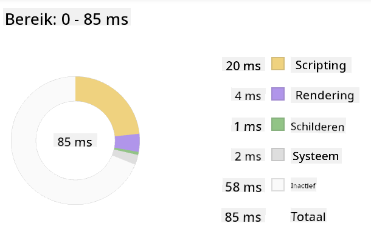
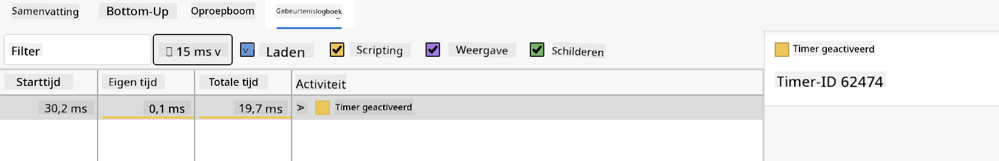

<!--
CO_OP_TRANSLATOR_METADATA:
{
  "original_hash": "49b58721a71cfda824e2f3e1f46908c6",
  "translation_date": "2025-08-29T00:56:05+00:00",
  "source_file": "5-browser-extension/3-background-tasks-and-performance/README.md",
  "language_code": "nl"
}
-->
# Browserextensieproject Deel 3: Leer over Achtergrondtaken en Prestaties

## Quiz vóór de les

[Quiz vóór de les](https://ff-quizzes.netlify.app/web/quiz/27)

### Introductie

In de laatste twee lessen van deze module heb je geleerd hoe je een formulier en een weergavegebied kunt maken voor gegevens die worden opgehaald van een API. Dit is een zeer standaard manier om een webaanwezigheid te creëren. Je hebt zelfs geleerd hoe je gegevens asynchroon kunt ophalen. Je browserextensie is bijna klaar.

Het enige wat nog moet gebeuren, is het beheren van enkele achtergrondtaken, zoals het verversen van de kleur van het pictogram van de extensie. Dit is een goed moment om te bespreken hoe de browser dit soort taken beheert. Laten we nadenken over deze browsertaken in de context van de prestaties van je webassets terwijl je ze bouwt.

## Basisprincipes van Webprestaties

> "Websiteprestaties gaan over twee dingen: hoe snel de pagina laadt en hoe snel de code op de pagina wordt uitgevoerd." -- [Zack Grossbart](https://www.smashingmagazine.com/2012/06/javascript-profiling-chrome-developer-tools/)

Het onderwerp hoe je je websites razendsnel kunt maken op allerlei apparaten, voor allerlei gebruikers, in allerlei situaties, is niet verrassend enorm uitgebreid. Hier zijn enkele punten om in gedachten te houden terwijl je een standaard webproject of een browserextensie bouwt.

Het eerste wat je moet doen om ervoor te zorgen dat je site efficiënt werkt, is gegevens verzamelen over de prestaties. De eerste plek om dit te doen is in de ontwikkelaarstools van je webbrowser. In Edge kun je de knop "Instellingen en meer" selecteren (het pictogram met de drie stippen rechtsboven in de browser), vervolgens naar Meer Hulpmiddelen > Ontwikkelaarstools navigeren en het tabblad Prestaties openen. Je kunt ook de sneltoetsen `Ctrl` + `Shift` + `I` op Windows of `Option` + `Command` + `I` op Mac gebruiken om de ontwikkelaarstools te openen.

Het tabblad Prestaties bevat een Profileringstool. Open een website (bijvoorbeeld [https://www.microsoft.com](https://www.microsoft.com/?WT.mc_id=academic-77807-sagibbon)) en klik op de knop 'Opnemen', ververs vervolgens de site. Stop de opname op elk moment en je kunt de routines zien die worden gegenereerd om de site te 'scripten', 'renderen' en 'tekenen':


✅ Bezoek de [Microsoft-documentatie](https://docs.microsoft.com/microsoft-edge/devtools-guide/performance/?WT.mc_id=academic-77807-sagibbon) over het tabblad Prestaties in Edge.

> Tip: om een nauwkeurige meting van de opstarttijd van je website te krijgen, wis je de cache van je browser.

Selecteer elementen van de profiel-tijdlijn om in te zoomen op gebeurtenissen die plaatsvinden terwijl je pagina laadt.

Krijg een momentopname van de prestaties van je pagina door een deel van de profiel-tijdlijn te selecteren en naar het samenvattingspaneel te kijken:



Controleer het gebeurtenislogboekpaneel om te zien of een gebeurtenis langer dan 15 ms duurde:



✅ Maak kennis met je profiler! Open de ontwikkelaarstools op deze site en kijk of er knelpunten zijn. Wat is het langzaamst ladende asset? Het snelst?

## Profileringscontroles

Over het algemeen zijn er enkele "probleemgebieden" waar elke webontwikkelaar op moet letten bij het bouwen van een site om vervelende verrassingen te voorkomen wanneer het tijd is om naar productie te gaan.

**Assetgroottes**: Het web is de afgelopen jaren 'zwaarder' en daardoor trager geworden. Een deel van dit gewicht heeft te maken met het gebruik van afbeeldingen.

✅ Bekijk het [Internetarchief](https://httparchive.org/reports/page-weight) voor een historisch overzicht van paginagewicht en meer.

Een goede praktijk is ervoor te zorgen dat je afbeeldingen zijn geoptimaliseerd en worden geleverd in het juiste formaat en de juiste resolutie voor je gebruikers.

**DOM-traversals**: De browser moet zijn Document Object Model bouwen op basis van de code die je schrijft, dus het is in het belang van goede paginaprestaties om je tags minimaal te houden en alleen te gebruiken en te stylen wat de pagina nodig heeft. In dit opzicht kan overtollige CSS die aan een pagina is gekoppeld worden geoptimaliseerd; stijlen die alleen op één pagina nodig zijn, hoeven bijvoorbeeld niet in het hoofdstijlblad te worden opgenomen.

**JavaScript**: Elke JavaScript-ontwikkelaar moet letten op 'render-blocking'-scripts die moeten worden geladen voordat de rest van de DOM kan worden doorlopen en naar de browser kan worden getekend. Overweeg het gebruik van `defer` met je inline scripts (zoals gedaan in de Terrarium-module).

✅ Probeer enkele sites op een [Site Speed Test-website](https://www.webpagetest.org/) om meer te leren over de gebruikelijke controles die worden uitgevoerd om de prestaties van een site te bepalen.

Nu je een idee hebt van hoe de browser de assets rendert die je naar hem stuurt, laten we kijken naar de laatste paar dingen die je moet doen om je extensie te voltooien:

### Maak een functie om kleur te berekenen

Werk in `/src/index.js` en voeg een functie genaamd `calculateColor()` toe na de reeks `const`-variabelen die je hebt ingesteld om toegang te krijgen tot de DOM:

```JavaScript
function calculateColor(value) {
	let co2Scale = [0, 150, 600, 750, 800];
	let colors = ['#2AA364', '#F5EB4D', '#9E4229', '#381D02', '#381D02'];

	let closestNum = co2Scale.sort((a, b) => {
		return Math.abs(a - value) - Math.abs(b - value);
	})[0];
	console.log(value + ' is closest to ' + closestNum);
	let num = (element) => element > closestNum;
	let scaleIndex = co2Scale.findIndex(num);

	let closestColor = colors[scaleIndex];
	console.log(scaleIndex, closestColor);

	chrome.runtime.sendMessage({ action: 'updateIcon', value: { color: closestColor } });
}
```

Wat gebeurt hier? Je geeft een waarde door (de koolstofintensiteit) van de API-aanroep die je in de vorige les hebt voltooid, en vervolgens bereken je hoe dicht de waarde bij de index in de kleurenarray ligt. Vervolgens stuur je die dichtstbijzijnde kleurwaarde naar de chrome runtime.

De chrome.runtime heeft [een API](https://developer.chrome.com/extensions/runtime) die allerlei achtergrondtaken afhandelt, en je extensie maakt hier gebruik van:

> "Gebruik de chrome.runtime API om de achtergrondpagina op te halen, details over het manifest te retourneren en te luisteren naar en te reageren op gebeurtenissen in de levenscyclus van de app of extensie. Je kunt deze API ook gebruiken om het relatieve pad van URL's om te zetten naar volledig gekwalificeerde URL's."

✅ Als je deze browserextensie ontwikkelt voor Edge, kan het je verrassen dat je een chrome API gebruikt. De nieuwere Edge-browserversies draaien op de Chromium-browserengine, dus je kunt deze tools gebruiken.

> Opmerking: als je een browserextensie wilt profileren, start je de ontwikkelaarstools vanuit de extensie zelf, omdat deze zijn eigen aparte browserinstantie is.

### Stel een standaardkleur voor het pictogram in

Stel nu in de `init()`-functie het pictogram in op een generieke groene kleur door opnieuw de `updateIcon`-actie van chrome aan te roepen:

```JavaScript
chrome.runtime.sendMessage({
	action: 'updateIcon',
		value: {
			color: 'green',
		},
});
```

### Roep de functie aan, voer de oproep uit

Roep vervolgens de functie die je zojuist hebt gemaakt aan door deze toe te voegen aan de belofte die wordt geretourneerd door de C02Signal API:

```JavaScript
//let CO2...
calculateColor(CO2);
```

En voeg ten slotte in `/dist/background.js` de luisteraar toe voor deze achtergrondactie-aanroepen:

```JavaScript
chrome.runtime.onMessage.addListener(function (msg, sender, sendResponse) {
	if (msg.action === 'updateIcon') {
		chrome.browserAction.setIcon({ imageData: drawIcon(msg.value) });
	}
});
//borrowed from energy lollipop extension, nice feature!
function drawIcon(value) {
	let canvas = document.createElement('canvas');
	let context = canvas.getContext('2d');

	context.beginPath();
	context.fillStyle = value.color;
	context.arc(100, 100, 50, 0, 2 * Math.PI);
	context.fill();

	return context.getImageData(50, 50, 100, 100);
}
```

In deze code voeg je een luisteraar toe voor alle berichten die naar de backend-taakbeheerder worden gestuurd. Als het 'updateIcon' wordt genoemd, wordt de volgende code uitgevoerd om een pictogram van de juiste kleur te tekenen met behulp van de Canvas API.

✅ Je leert meer over de Canvas API in de [Space Game-lessen](../../6-space-game/2-drawing-to-canvas/README.md).

Bouw nu je extensie opnieuw (`npm run build`), ververs en start je extensie, en kijk hoe de kleur verandert. Is het een goed moment om een boodschap te doen of de afwas te doen? Nu weet je het!

Gefeliciteerd, je hebt een nuttige browserextensie gebouwd en meer geleerd over hoe de browser werkt en hoe je de prestaties ervan kunt profileren.

---

## 🚀 Uitdaging

Onderzoek enkele open source-websites die al lang bestaan en kijk op basis van hun GitHub-geschiedenis of je kunt bepalen hoe ze in de loop der jaren zijn geoptimaliseerd voor prestaties, als dat al is gebeurd. Wat is het meest voorkomende pijnpunt?

## Quiz na de les

[Quiz na de les](https://ff-quizzes.netlify.app/web/quiz/28)

## Herziening & Zelfstudie

Overweeg je aan te melden voor een [prestatie-nieuwsbrief](https://perf.email/).

Onderzoek enkele manieren waarop browsers webprestaties meten door de prestatietabbladen in hun webtools te bekijken. Zie je grote verschillen?

## Opdracht

[Analyseer een site op prestaties](assignment.md)

---

**Disclaimer**:  
Dit document is vertaald met behulp van de AI-vertalingsservice [Co-op Translator](https://github.com/Azure/co-op-translator). Hoewel we streven naar nauwkeurigheid, dient u zich ervan bewust te zijn dat geautomatiseerde vertalingen fouten of onnauwkeurigheden kunnen bevatten. Het originele document in de oorspronkelijke taal moet worden beschouwd als de gezaghebbende bron. Voor kritieke informatie wordt professionele menselijke vertaling aanbevolen. Wij zijn niet aansprakelijk voor misverstanden of verkeerde interpretaties die voortvloeien uit het gebruik van deze vertaling.