# Browserextensieproject Deel 3: Leer over Achtergrondtaken en Prestaties

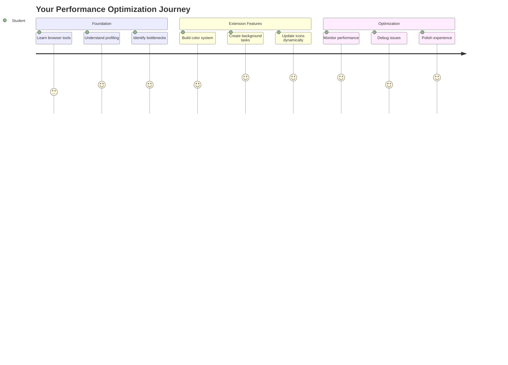

Heb je je ooit afgevraagd waarom sommige browserextensies snel en responsief aanvoelen, terwijl andere traag lijken? Het geheim zit in wat er achter de schermen gebeurt. Terwijl gebruikers door de interface van je extensie klikken, is er een hele wereld van achtergrondprocessen die stilletjes gegevens ophalen, pictogrammen bijwerken en systeembronnen beheren.

Dit is onze laatste les in de browserextensiereeks, en we gaan ervoor zorgen dat jouw CO2-voetafdruktracker soepel werkt. Je voegt dynamische pictogramupdates toe en leert hoe je prestatieproblemen kunt opsporen voordat ze echte problemen worden. Het is alsof je een raceauto afstemt - kleine optimalisaties kunnen een enorm verschil maken in hoe alles draait.

Tegen de tijd dat we klaar zijn, heb je een gepolijste extensie en begrijp je de prestatieprincipes die goede webapps onderscheiden van geweldige. Laten we duiken in de wereld van browseroptimalisatie.

## Pre-Lecture Quiz

[Pre-lecture quiz](https://ff-quizzes.netlify.app/web/quiz/27)

### Introductie

In onze vorige lessen heb je een formulier gebouwd, verbonden met een API en asynchrone gegevensophaling aangepakt. Je extensie begint al mooi vorm te krijgen.

Nu moeten we de laatste puntjes op de i zetten - zoals het laten veranderen van de kleur van het extensiepictogram op basis van de CO2-gegevens. Dit doet me denken aan hoe NASA elk systeem op het Apollo-ruimtevaartuig moest optimaliseren. Ze konden zich geen verspilde cycli of geheugen veroorloven omdat levens afhankelijk waren van prestaties. Hoewel onze browserextensie niet zo kritisch is, gelden dezelfde principes - efficiënte code zorgt voor betere gebruikerservaringen.

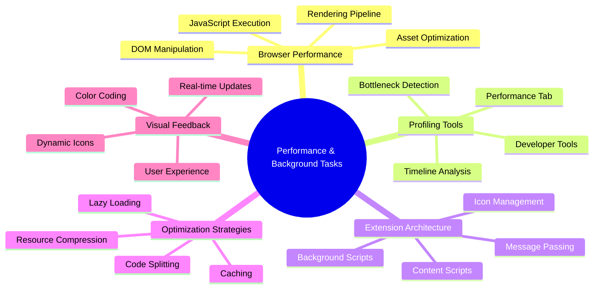

## Basisprincipes van Webprestaties

Wanneer je code efficiënt draait, kunnen mensen het verschil echt *voelen*. Je kent dat moment wel wanneer een pagina direct laadt of een animatie soepel verloopt? Dat is goede prestatie aan het werk.

Prestaties gaan niet alleen over snelheid - het gaat om het creëren van webervaringen die natuurlijk aanvoelen in plaats van haperend en frustrerend. In de vroege dagen van de informatica hield Grace Hopper een nanoseconde (een stukje draad van ongeveer een voet lang) op haar bureau om te laten zien hoe ver licht reist in één miljardste van een seconde. Het was haar manier om uit te leggen waarom elke microseconde telt in de informatica. Laten we de detectiehulpmiddelen verkennen die je helpen uit te zoeken wat dingen vertraagt.

> "Websiteprestaties gaan over twee dingen: hoe snel de pagina laadt, en hoe snel de code erop draait." -- [Zack Grossbart](https://www.smashingmagazine.com/2012/06/javascript-profiling-chrome-developer-tools/)

Het onderwerp hoe je je websites razendsnel maakt op allerlei apparaten, voor allerlei gebruikers, in allerlei situaties, is begrijpelijkerwijs uitgebreid. Hier zijn enkele punten om in gedachten te houden terwijl je een standaard webproject of een browserextensie bouwt.

De eerste stap in het optimaliseren van je site is begrijpen wat er daadwerkelijk onder de motorkap gebeurt. Gelukkig heeft je browser krachtige detectiehulpmiddelen ingebouwd.

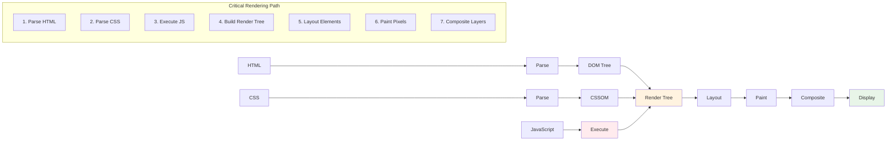

Om Developer Tools in Edge te openen, klik je op die drie puntjes rechtsboven, ga dan naar Meer Hulpmiddelen > Developer Tools. Of gebruik de sneltoets: `Ctrl` + `Shift` + `I` op Windows of `Option` + `Command` + `I` op Mac. Zodra je daar bent, klik je op het tabblad Prestaties - hier ga je je onderzoek doen.

**Hier is je toolkit voor prestatieonderzoek:**
- **Open** Developer Tools (je zult deze constant gebruiken als ontwikkelaar!)
- **Ga naar** het tabblad Prestaties - zie het als de fitnesstracker van je webapp
- **Druk op** die Opnemen-knop en bekijk je pagina in actie
- **Bestudeer** de resultaten om te zien wat dingen vertraagt

Laten we dit uitproberen. Open een website (Microsoft.com werkt goed hiervoor) en klik op die 'Opnemen'-knop. Vernieuw nu de pagina en bekijk hoe de profiler alles vastlegt wat er gebeurt. Wanneer je stopt met opnemen, zie je een gedetailleerde uitsplitsing van hoe de browser de site 'script', 'rendert' en 'schildert'. Het doet me denken aan hoe de missiecontrole elk systeem monitort tijdens een raketlancering - je krijgt realtime gegevens over precies wat er gebeurt en wanneer.

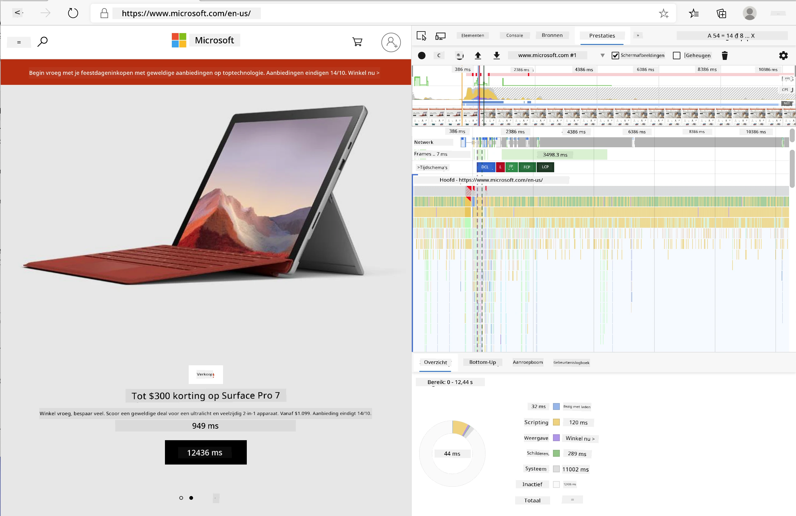

✅ De [Microsoft Documentatie](https://docs.microsoft.com/microsoft-edge/devtools-guide/performance/?WT.mc_id=academic-77807-sagibbon) heeft veel meer details als je dieper wilt duiken.

> Pro tip: Wis je browsercache voordat je test om te zien hoe je site presteert voor nieuwe bezoekers - dit is meestal heel anders dan bij herhaalde bezoeken!

Selecteer elementen van de profieltijdlijn om in te zoomen op gebeurtenissen die plaatsvinden terwijl je pagina laadt.

Krijg een momentopname van de prestaties van je pagina door een deel van de profieltijdlijn te selecteren en naar het samenvattingspaneel te kijken:

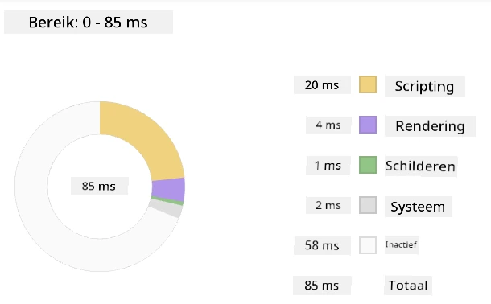

Controleer het Event Log-paneel om te zien of een gebeurtenis langer dan 15 ms duurde:

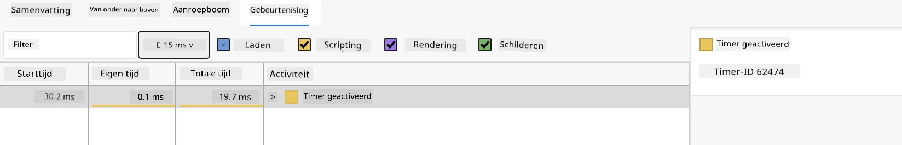

✅ Leer je profiler kennen! Open de ontwikkelaarstools op deze site en kijk of er knelpunten zijn. Wat is het langzaamst ladende bestand? Het snelste?

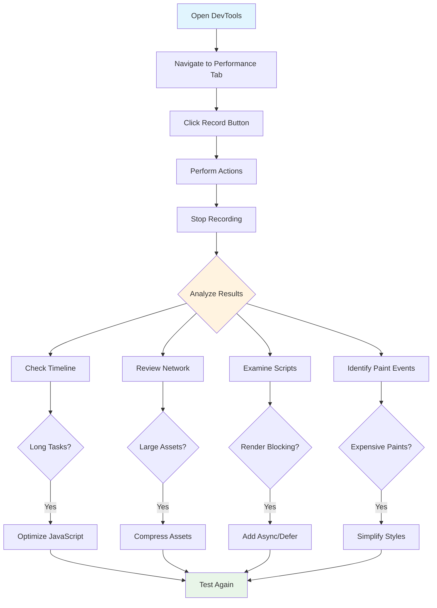

## Waarop te letten bij profileren

Het uitvoeren van de profiler is slechts het begin - de echte vaardigheid is weten wat die kleurrijke grafieken je eigenlijk vertellen. Maak je geen zorgen, je zult leren ze te lezen. Ervaren ontwikkelaars hebben geleerd de waarschuwingssignalen te herkennen voordat ze volledige problemen worden.

Laten we het hebben over de gebruikelijke verdachten - de prestatieproblemen die vaak in webprojecten sluipen. Net zoals Marie Curie zorgvuldig de stralingsniveaus in haar lab moest monitoren, moeten wij letten op bepaalde patronen die op problemen wijzen. Deze vroegtijdig opsporen bespaart jou (en je gebruikers) veel frustratie.

**Bestandsgroottes**: Websites zijn door de jaren heen "zwaarder" geworden, en veel van dat extra gewicht komt van afbeeldingen. Het is alsof we steeds meer in onze digitale koffers hebben gestopt.

✅ Bekijk het [Internet Archive](https://httparchive.org/reports/page-weight) om te zien hoe paginagroottes in de loop van de tijd zijn gegroeid - het is behoorlijk onthullend.

**Hier is hoe je je bestanden geoptimaliseerd houdt:**
- **Comprimeer** die afbeeldingen! Moderne formaten zoals WebP kunnen bestandsgroottes drastisch verkleinen
- **Lever** de juiste afbeeldingsgrootte voor elk apparaat - geen enorme desktopafbeeldingen naar telefoons sturen
- **Minimaliseer** je CSS en JavaScript - elke byte telt
- **Gebruik** lazy loading zodat afbeeldingen alleen worden gedownload wanneer gebruikers er daadwerkelijk naartoe scrollen

**DOM-traversals**: De browser moet zijn Document Object Model bouwen op basis van de code die je schrijft, dus het is in het belang van goede paginaprestaties om je tags minimaal te houden, alleen te gebruiken en te stylen wat de pagina nodig heeft. Overmatig CSS dat aan een pagina is gekoppeld, kan bijvoorbeeld worden geoptimaliseerd; stijlen die alleen op één pagina nodig zijn, hoeven niet in het hoofdstijlblad te worden opgenomen.

**Belangrijke strategieën voor DOM-optimalisatie:**
- **Minimaliseer** het aantal HTML-elementen en nestingsniveaus
- **Verwijder** ongebruikte CSS-regels en consolideer stijlen efficiënt
- **Organiseer** CSS om alleen te laden wat nodig is voor elke pagina
- **Structureer** HTML semantisch voor betere browserparsing

**JavaScript**: Elke JavaScript-ontwikkelaar moet letten op 'render-blocking' scripts die moeten worden geladen voordat de rest van de DOM kan worden doorlopen en naar de browser kan worden geschilderd. Overweeg het gebruik van `defer` met je inline scripts (zoals gedaan in de Terrarium-module).

**Moderne JavaScript-optimalisatietechnieken:**
- **Gebruik** het `defer`-attribuut om scripts te laden na DOM-parsing
- **Implementeer** code splitting om alleen noodzakelijke JavaScript te laden
- **Pas** lazy loading toe voor niet-kritieke functionaliteit
- **Minimaliseer** het gebruik van zware bibliotheken en frameworks waar mogelijk

✅ Probeer enkele sites op een [Site Speed Test website](https://www.webpagetest.org/) om meer te leren over de gebruikelijke controles die worden uitgevoerd om de prestaties van een site te bepalen.

### 🔄 **Pedagogische Check-in**
**Begrip van Prestaties**: Voordat je extensiefuncties bouwt, zorg ervoor dat je:
- ✅ De kritieke renderpad van HTML naar pixels kunt uitleggen
- ✅ Veelvoorkomende prestatieknelpunten in webapplicaties kunt identificeren
- ✅ Browserontwikkelaarstools kunt gebruiken om paginaprestaties te profileren
- ✅ Begrijpt hoe bestandsgrootte en DOM-complexiteit snelheid beïnvloeden

**Snelle Zelftest**: Wat gebeurt er als je render-blocking JavaScript hebt?
*Antwoord: De browser moet het script downloaden en uitvoeren voordat het verder kan gaan met het parseren van HTML en het renderen van de pagina*

**Impact van Prestaties in de Praktijk**:
- **100ms vertraging**: Gebruikers merken de vertraging
- **1 seconde vertraging**: Gebruikers beginnen hun focus te verliezen
- **3+ seconden**: 40% van de gebruikers verlaat de pagina
- **Mobiele netwerken**: Prestaties zijn nog belangrijker

Nu je een idee hebt van hoe de browser de assets rendert die je naar hem stuurt, laten we kijken naar de laatste paar dingen die je moet doen om je extensie af te maken:

### Maak een functie om kleur te berekenen

Nu gaan we een functie maken die numerieke gegevens omzet in betekenisvolle kleuren. Denk aan een verkeerslichtsysteem - groen voor schone energie, rood voor hoge CO2-intensiteit.

Deze functie neemt de CO2-gegevens van onze API en bepaalt welke kleur het beste de milieueffecten vertegenwoordigt. Het is vergelijkbaar met hoe wetenschappers kleurcodering gebruiken in warmtekaarten om complexe gegevenspatronen te visualiseren - van oceaantemperaturen tot stervorming. Laten we dit toevoegen aan `/src/index.js`, direct na die `const`-variabelen die we eerder hebben ingesteld:

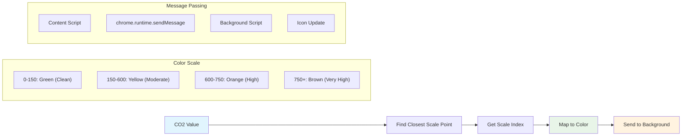

```javascript
function calculateColor(value) {
	// Define CO2 intensity scale (grams per kWh)
	const co2Scale = [0, 150, 600, 750, 800];
	// Corresponding colors from green (clean) to dark brown (high carbon)
	const colors = ['#2AA364', '#F5EB4D', '#9E4229', '#381D02', '#381D02'];

	// Find the closest scale value to our input
	const closestNum = co2Scale.sort((a, b) => {
		return Math.abs(a - value) - Math.abs(b - value);
	})[0];
	
	console.log(`${value} is closest to ${closestNum}`);
	
	// Find the index for color mapping
	const num = (element) => element > closestNum;
	const scaleIndex = co2Scale.findIndex(num);

	const closestColor = colors[scaleIndex];
	console.log(scaleIndex, closestColor);

	// Send color update message to background script
	chrome.runtime.sendMessage({ action: 'updateIcon', value: { color: closestColor } });
}
```

**Laten we deze slimme kleine functie opsplitsen:**
- **Stelt** twee arrays in - één voor CO2-niveaus, een andere voor kleuren (groen = schoon, bruin = vervuild!)
- **Vindt** de dichtstbijzijnde match met onze werkelijke CO2-waarde met behulp van een handige array-sortering
- **Haalt** de bijpassende kleur op met de findIndex()-methode
- **Stuurt** een bericht naar het achtergrondscript van Chrome met onze gekozen kleur
- **Gebruikt** template literals (die backticks) voor schonere stringopmaak
- **Houdt** alles georganiseerd met const-declaraties

De `chrome.runtime` [API](https://developer.chrome.com/extensions/runtime) is als het zenuwstelsel van je extensie - het regelt alle communicatie en taken achter de schermen:

> "Gebruik de chrome.runtime API om de achtergrondpagina op te halen, details over de manifest terug te geven en te luisteren naar en te reageren op gebeurtenissen in de levenscyclus van de app of extensie. Je kunt deze API ook gebruiken om de relatieve pad van URL's om te zetten naar volledig gekwalificeerde URL's."

**Waarom de Chrome Runtime API zo handig is:**
- **Laat** verschillende delen van je extensie met elkaar communiceren
- **Regelt** achtergrondwerk zonder de gebruikersinterface te bevriezen
- **Beheert** de levenscyclusgebeurtenissen van je extensie
- **Maakt** berichtenuitwisseling tussen scripts super eenvoudig

✅ Als je deze browserextensie voor Edge ontwikkelt, kan het je verrassen dat je een chrome API gebruikt. De nieuwere Edge-browserversies draaien op de Chromium-browserengine, dus je kunt deze tools benutten.

```mermaid
architecture-beta
    group browser(logos:chrome)[Browser]
    
    service popup(logos:html5)[Popup UI] in browser
    service content(logos:javascript)[Content Script] in browser
    service background(database)[Background Script] in browser
    service api(logos:api)[External API] in browser
    
    popup:R -- L:content
    content:R -- L:background
    background:T -- B:api
    content:T -- B:api
    
    junction junctionCenter in browser
    popup:R -- L:junctionCenter
    junctionCenter:R -- L:background
```

> **Pro Tip**: Als je een browserextensie wilt profileren, start de ontwikkelaarstools vanuit de extensie zelf, aangezien dit een aparte browserinstantie is. Dit geeft je toegang tot extensiespecifieke prestatiestatistieken.

### Stel een standaardkleur voor het pictogram in

Voordat we echte gegevens gaan ophalen, laten we onze extensie een startpunt geven. Niemand houdt van een leeg of kapot ogend pictogram. We beginnen met een groene kleur zodat gebruikers weten dat de extensie werkt vanaf het moment dat ze deze installeren.

In je `init()`-functie, laten we dat standaard groene pictogram instellen:

```javascript
chrome.runtime.sendMessage({
	action: 'updateIcon',
	value: {
		color: 'green',
	},
});
```

**Wat deze initialisatie bereikt:**
- **Stelt** een neutrale groene kleur in als de standaardstatus
- **Biedt** onmiddellijke visuele feedback wanneer de extensie wordt geladen
- **Legt** het communicatiepatroon met het achtergrondscript vast
- **Zorgt ervoor** dat gebruikers een functionele extensie zien voordat gegevens worden geladen

### Roep de functie aan, voer de oproep uit

Nu gaan we alles verbinden zodat wanneer er nieuwe CO2-gegevens binnenkomen, je pictogram automatisch wordt bijgewerkt met de juiste kleur. Het is alsof je de laatste schakeling in een elektronisch apparaat aansluit - ineens werken alle afzonderlijke componenten als één systeem.

Voeg deze regel toe direct nadat je de CO2-gegevens van de API hebt ontvangen:

```javascript
// After retrieving CO2 data from the API
// let CO2 = data.data[0].intensity.actual;
calculateColor(CO2);
```

**Wat deze integratie bereikt:**
- **Verbindt** de API-gegevensstroom met het visuele indicatorensysteem
- **Activeert** pictogramupdates automatisch wanneer nieuwe gegevens binnenkomen
- **Zorgt voor** realtime visuele feedback op basis van de huidige CO2-intensiteit
- **Handhaaft** de scheiding van verantwoordelijkheden tussen gegevensophaling en weergavelogica

En tot slot, voeg in `/dist/background.js` de listener toe voor deze achtergrondactieoproepen:

```javascript
// Listen for messages from the content script
chrome.runtime.onMessage.addListener(function (msg, sender, sendResponse) {
	if (msg.action === 'updateIcon') {
		chrome.action.setIcon({ imageData: drawIcon(msg.value) });
	}
});

// Draw dynamic icon using Canvas API
// Borrowed from energy lollipop extension - nice feature!
function drawIcon(value) {
	// Create an offscreen canvas for better performance
	const canvas = new OffscreenCanvas(200, 200);
	const context = canvas.getContext('2d');

	// Draw a colored circle representing carbon intensity
	context.beginPath();
	context.fillStyle = value.color;
	context.arc(100, 100, 50, 0, 2 * Math.PI);
	context.fill();

	// Return the image data for the browser icon
	return context.getImageData(50, 50, 100, 100);
}
```

**Wat dit achtergrondscript doet:**
- **Luistert** naar berichten van je hoofdscript (zoals een receptionist die telefoontjes aanneemt)
- **Verwerkt** die 'updateIcon'-verzoeken om je werkbalkpictogram te wijzigen
- **Creëert** nieuwe pictogrammen on-the-fly met behulp van de Canvas API
- **Tekent** een eenvoudige gekleurde cirkel die de huidige CO2-intensiteit weergeeft
- **Werk je** browserwerkbalk bij met het nieuwe pictogram
- **Gebruikt** OffscreenCanvas voor soepele prestaties (geen UI-blokkering)

✅ Je leert meer over de Canvas API in de [Space Game-lessen](../../6-space-game/2-drawing-to-canvas/README.md).

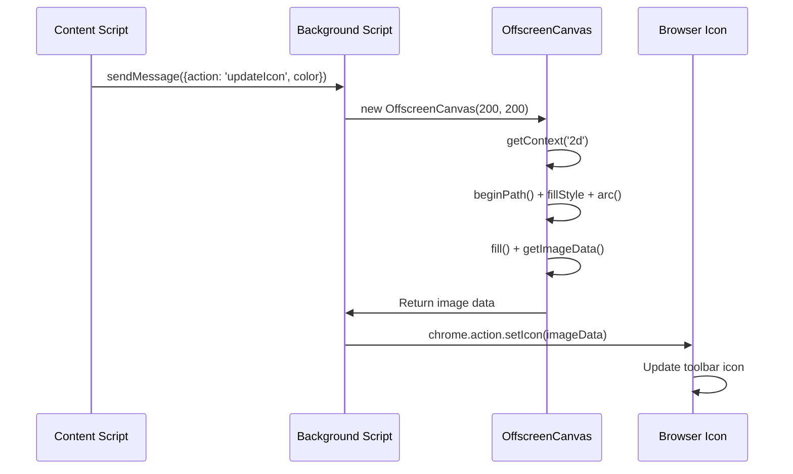

### 🔄 **Pedagogische Check-in**
**Volledig Begrip van Extensie**: Controleer je beheersing van het hele systeem:
- ✅ Hoe werkt berichtenuitwisseling tussen verschillende extensiescripts?
- ✅ Waarom gebruiken we OffscreenCanvas in plaats van reguliere Canvas voor prestaties?
- ✅ Welke rol speelt de Chrome Runtime API in de architectuur van extensies?
- ✅ Hoe vertaalt het kleurberekeningsalgoritme data naar visuele feedback?

**Prestatieoverwegingen**: Je extensie toont nu:
- **Efficiënte berichtgeving**: Duidelijke communicatie tussen scriptcontexten
- **Geoptimaliseerde rendering**: OffscreenCanvas voorkomt blokkering van de UI
- **Realtime updates**: Dynamische pictogramwijzigingen op basis van live data
- **Geheugenbeheer**: Correct opruimen en omgaan met resources

**Tijd om je extensie te testen:**
- **Bouw** alles met `npm run build`
- **Herlaad** je extensie in de browser (vergeet deze stap niet)
- **Open** je extensie en kijk hoe het pictogram van kleur verandert
- **Controleer** hoe het reageert op echte koolstofdata van over de hele wereld

Nu weet je in één oogopslag of het een goed moment is voor die lading wasgoed of dat je beter kunt wachten op schonere energie. Je hebt zojuist iets echt nuttigs gebouwd en tegelijkertijd geleerd over browserprestaties.

## GitHub Copilot Agent Challenge 🚀

Gebruik de Agent-modus om de volgende uitdaging te voltooien:

**Beschrijving:** Verbeter de prestatiemonitoring van de browserextensie door een functie toe te voegen die laadtijden van verschillende componenten van de extensie bijhoudt en weergeeft.

**Prompt:** Maak een prestatiemonitoringsysteem voor de browserextensie dat de tijd meet en logt die nodig is om CO2-data van de API op te halen, kleuren te berekenen en het pictogram bij te werken. Voeg een functie genaamd `performanceTracker` toe die de Performance API gebruikt om deze operaties te meten en de resultaten met tijdstempels en duurmetingen in de browserconsole weer te geven.

Meer informatie over [agent mode](https://code.visualstudio.com/blogs/2025/02/24/introducing-copilot-agent-mode) vind je hier.

## 🚀 Uitdaging

Hier is een interessante speurtocht: kies een paar open source websites die al jaren bestaan (denk aan Wikipedia, GitHub of Stack Overflow) en duik in hun commitgeschiedenis. Kun je zien waar ze prestatieverbeteringen hebben aangebracht? Welke problemen bleven zich voordoen?

**Je onderzoeksaanpak:**
- **Zoek** in commitberichten naar woorden zoals "optimaliseren," "prestatie," of "sneller"
- **Bekijk** patronen - blijven ze dezelfde soorten problemen oplossen?
- **Identificeer** de veelvoorkomende oorzaken die websites vertragen
- **Deel** wat je ontdekt - andere ontwikkelaars leren van echte voorbeelden

## Quiz na de les

[Quiz na de les](https://ff-quizzes.netlify.app/web/quiz/28)

## Review & Zelfstudie

Overweeg je aan te melden voor een [prestatie-nieuwsbrief](https://perf.email/)

Onderzoek enkele manieren waarop browsers webprestaties meten door de prestatietabbladen in hun webtools te bekijken. Vind je grote verschillen?

### ⚡ **Wat je in de komende 5 minuten kunt doen**
- [ ] Open de browser Taakbeheer (Shift+Esc in Chrome) om het resourcegebruik van extensies te zien
- [ ] Gebruik de prestatietab in DevTools om de prestaties van webpagina's op te nemen en te analyseren
- [ ] Controleer de extensiepagina van de browser om te zien welke extensies invloed hebben op de opstarttijd
- [ ] Probeer extensies tijdelijk uit te schakelen om prestatieverschillen te zien

### 🎯 **Wat je in een uur kunt bereiken**
- [ ] Maak de quiz na de les en begrijp prestatieconcepten
- [ ] Implementeer een achtergrondscript voor je browserextensie
- [ ] Leer browser.alarms te gebruiken voor efficiënte achtergrondtaken
- [ ] Oefen met berichtuitwisseling tussen content scripts en achtergrondscripts
- [ ] Meet en optimaliseer het resourcegebruik van je extensie

### 📅 **Je weeklange prestatiereis**
- [ ] Voltooi een hoogpresterende browserextensie met achtergrondfunctionaliteit
- [ ] Beheers service workers en moderne extensiearchitectuur
- [ ] Implementeer efficiënte datasynchronisatie- en cachingstrategieën
- [ ] Leer geavanceerde foutopsporingstechnieken voor extensieprestaties
- [ ] Optimaliseer je extensie voor zowel functionaliteit als resource-efficiëntie
- [ ] Maak uitgebreide tests voor prestatiescenario's van extensies

### 🌟 **Je maandlange optimalisatiemeesterschap**
- [ ] Bouw browserextensies van ondernemingsniveau met optimale prestaties
- [ ] Leer over Web Workers, Service Workers en moderne webprestaties
- [ ] Draag bij aan open source projecten gericht op prestatieoptimalisatie
- [ ] Beheers browserinternals en geavanceerde foutopsporingstechnieken
- [ ] Maak prestatiemonitoringtools en handleidingen voor best practices
- [ ] Word een prestatie-expert die helpt webapplicaties te optimaliseren

## 🎯 Je tijdlijn voor browserextensie-meesterschap

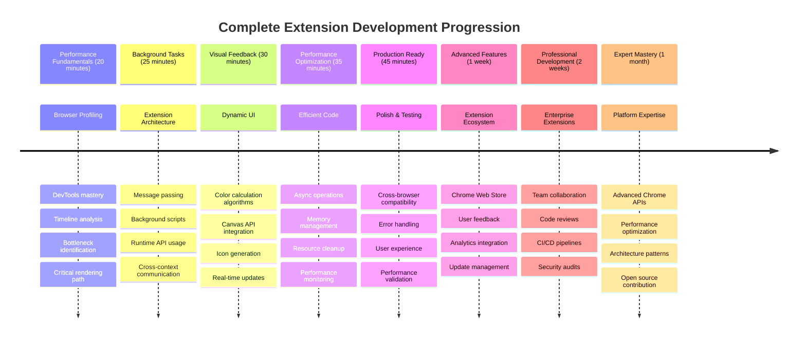

### 🛠️ Je complete toolkit voor extensieontwikkeling

Na het voltooien van deze trilogie heb je nu beheerst:
- **Browserarchitectuur**: Diepgaand begrip van hoe extensies integreren met browsersystemen
- **Prestatieprofilering**: Vermogen om knelpunten te identificeren en op te lossen met ontwikkelaarstools
- **Asynchrone programmering**: Moderne JavaScript-patronen voor responsieve, niet-blokkerende operaties
- **API-integratie**: Externe data ophalen met authenticatie en foutafhandeling
- **Visueel ontwerp**: Dynamische UI-updates en Canvas-gebaseerde grafische generatie
- **Berichtuitwisseling**: Inter-script communicatie in extensiearchitecturen
- **Gebruikerservaring**: Laadstatussen, foutafhandeling en intuïtieve interacties
- **Productievaardigheden**: Testen, debuggen en optimaliseren voor echte implementatie

**Toepassingen in de echte wereld**: Je vaardigheden in extensieontwikkeling zijn direct toepasbaar op:
- **Progressive Web Apps**: Vergelijkbare architectuur en prestatiepatronen
- **Electron Desktop Apps**: Cross-platform applicaties met webtechnologieën
- **Mobiele hybride apps**: Cordova/PhoneGap-ontwikkeling met web-API's
- **Webapplicaties voor bedrijven**: Complexe dashboards en productiviteitstools
- **Chrome DevTools-extensies**: Geavanceerde ontwikkelaarstools en foutopsporing
- **Web-API-integratie**: Elke applicatie die communiceert met externe services

**Professionele impact**: Je kunt nu:
- **Bouwen** productieklare browserextensies van concept tot implementatie
- **Optimaliseren** webapplicatieprestaties met behulp van industriestandaard profilingtools
- **Architectuur ontwerpen** schaalbare systemen met een goede scheiding van verantwoordelijkheden
- **Debuggen** complexe asynchrone operaties en cross-context communicatie
- **Bijdragen** aan open source extensieprojecten en browserstandaarden

**Volgende niveau kansen**:
- **Chrome Web Store-ontwikkelaar**: Publiceer extensies voor miljoenen gebruikers
- **Webprestatie-ingenieur**: Specialiseer in optimalisatie en gebruikerservaring
- **Browserplatformontwikkelaar**: Draag bij aan de ontwikkeling van browserengines
- **Extensieraamwerkmaker**: Bouw tools die andere ontwikkelaars helpen
- **Developer Relations**: Deel kennis door middel van onderwijs en contentcreatie

🌟 **Prestatie ontgrendeld**: Je hebt een complete, functionele browserextensie gebouwd die professionele ontwikkelingspraktijken en moderne webstandaarden demonstreert!

## Opdracht

[Analyseer een site op prestaties](assignment.md)

---

**Disclaimer**:  
Dit document is vertaald met behulp van de AI-vertalingsservice [Co-op Translator](https://github.com/Azure/co-op-translator). Hoewel we streven naar nauwkeurigheid, dient u zich ervan bewust te zijn dat geautomatiseerde vertalingen fouten of onnauwkeurigheden kunnen bevatten. Het originele document in de oorspronkelijke taal moet worden beschouwd als de gezaghebbende bron. Voor kritieke informatie wordt professionele menselijke vertaling aanbevolen. Wij zijn niet aansprakelijk voor eventuele misverstanden of verkeerde interpretaties die voortvloeien uit het gebruik van deze vertaling.