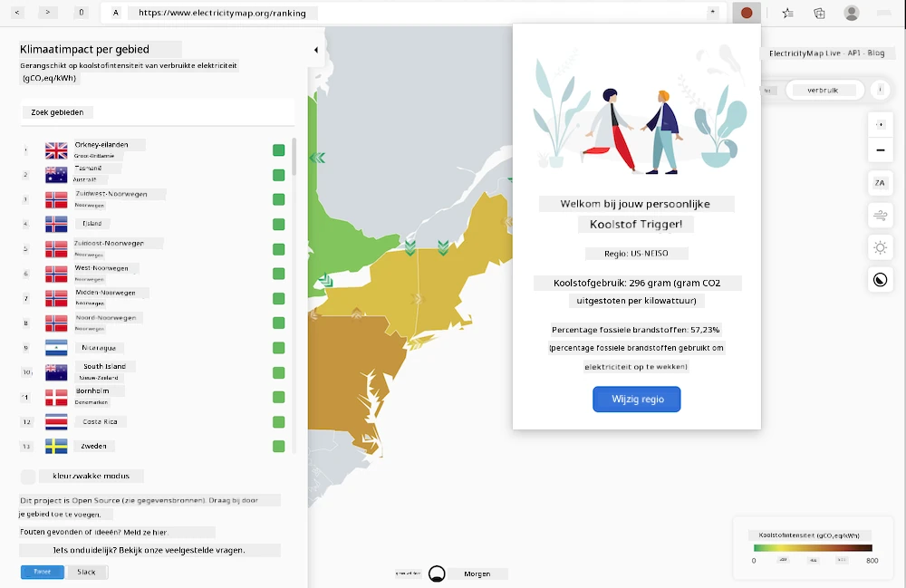

# Carbon Trigger Browserextensie: Voltooide Code

Met behulp van de CO2 Signal API van tmrow om het elektriciteitsverbruik te volgen, maak je een browserextensie zodat je direct in je browser een herinnering kunt krijgen over het elektriciteitsverbruik in jouw regio. Het gebruik van deze ad-hoc extensie helpt je om je activiteiten te beoordelen op basis van deze informatie.



## Aan de slag

Je moet [npm](https://npmjs.com) geïnstalleerd hebben. Download een kopie van deze code naar een map op je computer.

Installeer alle vereiste pakketten:

```
npm install
```

Bouw de extensie met webpack

```
npm run build
```

Om de extensie op Edge te installeren, gebruik je het menu met de 'drie puntjes' in de rechterbovenhoek van de browser om het Extensies-paneel te vinden. Selecteer daar 'Uitgepakte extensie laden' om een nieuwe extensie te laden. Open de map 'dist' wanneer daarom wordt gevraagd, en de extensie wordt geladen. Om de extensie te gebruiken, heb je een API-sleutel nodig voor de CO2 Signal API ([verkrijg er hier een via e-mail](https://www.co2signal.com/) - voer je e-mailadres in het veld op deze pagina in) en de [code voor jouw regio](http://api.electricitymap.org/v3/zones) die overeenkomt met de [Electricity Map](https://www.electricitymap.org/map) (in Boston gebruik ik bijvoorbeeld 'US-NEISO').


Zodra de API-sleutel en de regio zijn ingevoerd in de extensie-interface, zou het gekleurde puntje in de extensiebalk van de browser moeten veranderen om het energieverbruik in jouw regio weer te geven. Dit geeft je een indicatie van welke energie-intensieve activiteiten op dat moment geschikt zijn. Het concept achter dit 'puntensysteem' is geïnspireerd door de [Energy Lollipop extensie](https://energylollipop.com/) voor emissies in Californië.

---

**Disclaimer**:  
Dit document is vertaald met behulp van de AI-vertalingsservice [Co-op Translator](https://github.com/Azure/co-op-translator). Hoewel we ons inzetten voor nauwkeurigheid, dient u zich ervan bewust te zijn dat geautomatiseerde vertalingen fouten of onnauwkeurigheden kunnen bevatten. Het originele document in zijn oorspronkelijke taal moet worden beschouwd als de gezaghebbende bron. Voor cruciale informatie wordt professionele menselijke vertaling aanbevolen. Wij zijn niet aansprakelijk voor eventuele misverstanden of verkeerde interpretaties die voortvloeien uit het gebruik van deze vertaling.