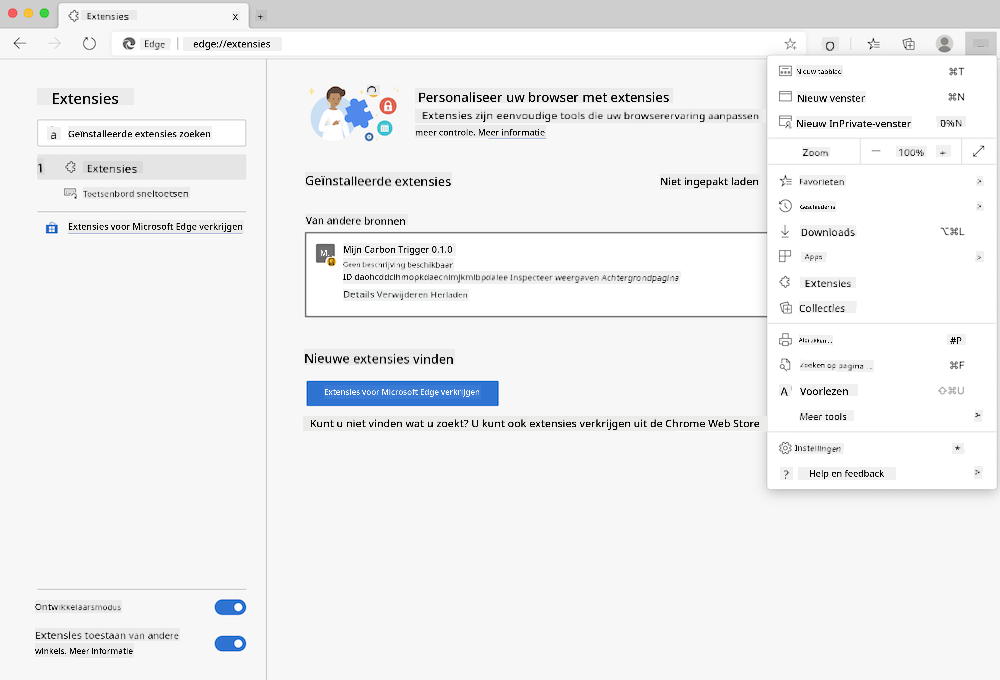

<!--
CO_OP_TRANSLATOR_METADATA:
{
  "original_hash": "3f5e6821e0febccfc5d05e7c944d9e3d",
  "translation_date": "2025-08-27T20:54:25+00:00",
  "source_file": "5-browser-extension/solution/translation/README.ja.md",
  "language_code": "nl"
}
-->
# Carbon Trigger Browser-extensie: Voltooide Code

Bouw een browserextensie die, met behulp van de CO2 Signal API van tmrow, het energieverbruik in jouw regio bijhoudt en dit als een herinnering op je browser weergeeft. Door deze extensie ad-hoc te gebruiken, kun je je activiteiten baseren op deze informatie.


## Aan de slag

Je moet [npm](https://npmjs.com) geïnstalleerd hebben. Download een kopie van deze code naar een map op je computer.

Installeer alle benodigde pakketten.

```
npm install
```

Bouw de extensie met webpack.

```
npm run build
```

Om de extensie in Edge te installeren, ga je naar het "drie stippen"-menu rechtsboven in de browser en zoek je het paneel "Extensies". Kies daar "Load Unpacked" en laad de nieuwe extensie. Wanneer je wordt gevraagd, open je de "dist"-map om de extensie te laden. Om de extensie te gebruiken, heb je een API-sleutel van de CO2 Signal API nodig ([hier via e-mail verkrijgen](https://www.co2signal.com/) - voer je e-mailadres in het vak op die pagina in) en een [code voor jouw regio](http://api.electricitymap.org/v3/zones) die overeenkomt met de [Electricity Map](https://www.electricitymap.org/map) (bijvoorbeeld, voor Boston gebruik je 'US-NEISO').



Wanneer je de API-sleutel en regio invoert in de extensie-interface, verandert de gekleurde stip die in de extensiebalk van je browser wordt weergegeven. Deze stip weerspiegelt het energieverbruik in jouw regio en geeft aan welke activiteiten geschikt zijn op basis van het energieverbruik. Het concept van dit "stip"-systeem is geïnspireerd door de [Energy Lollipop extension](https://energylollipop.com/) voor emissies in Californië.

---

**Disclaimer**:  
Dit document is vertaald met behulp van de AI-vertalingsservice [Co-op Translator](https://github.com/Azure/co-op-translator). Hoewel we streven naar nauwkeurigheid, dient u zich ervan bewust te zijn dat geautomatiseerde vertalingen fouten of onnauwkeurigheden kunnen bevatten. Het originele document in de oorspronkelijke taal moet worden beschouwd als de gezaghebbende bron. Voor cruciale informatie wordt professionele menselijke vertaling aanbevolen. Wij zijn niet aansprakelijk voor misverstanden of verkeerde interpretaties die voortvloeien uit het gebruik van deze vertaling.