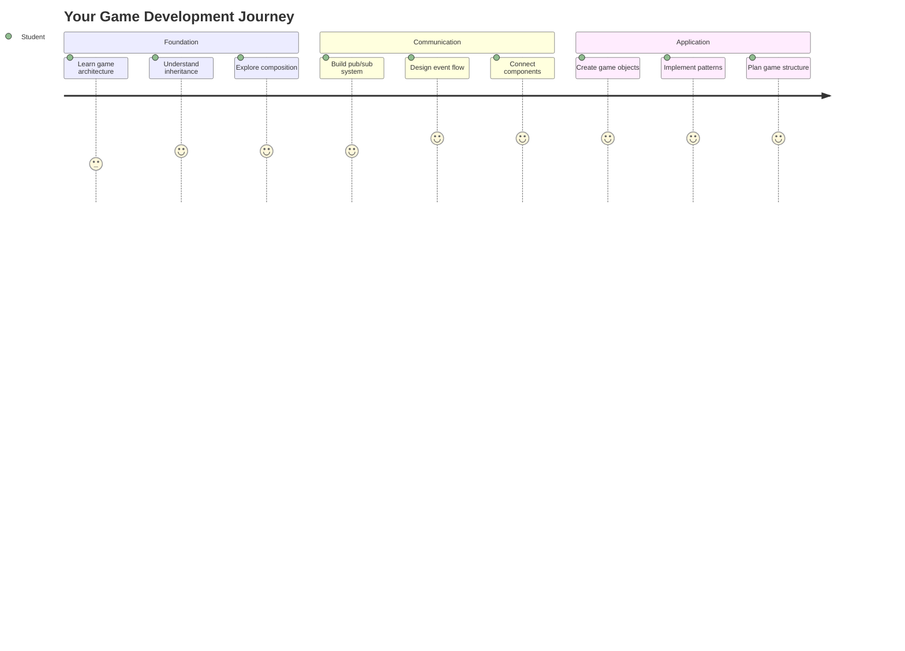
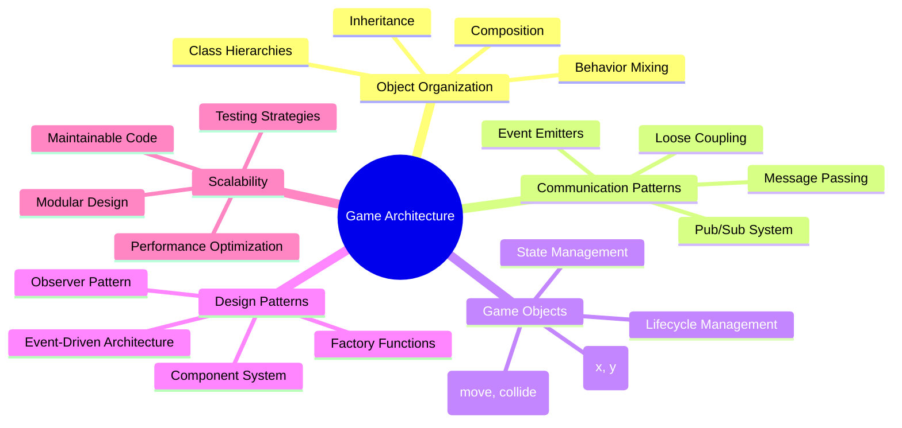
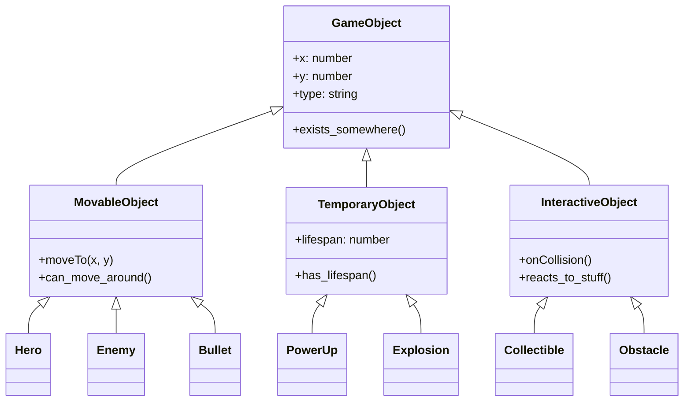
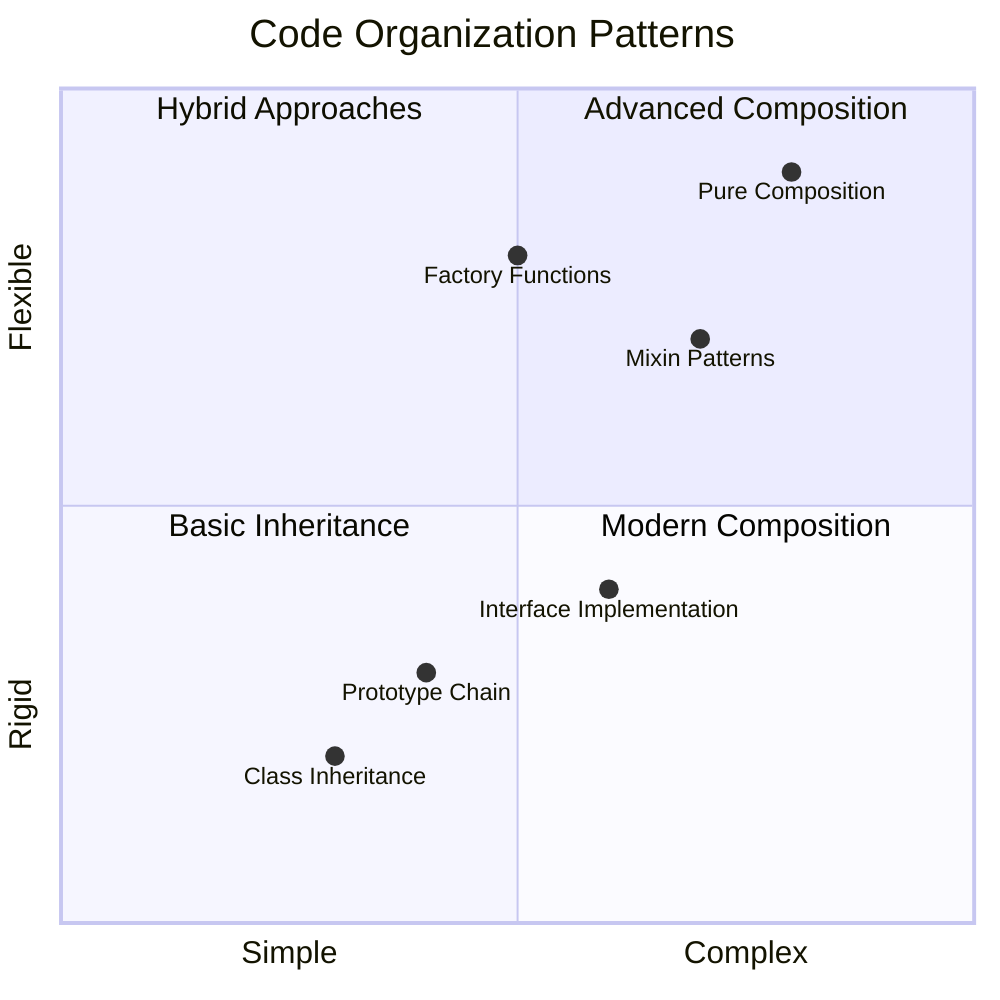
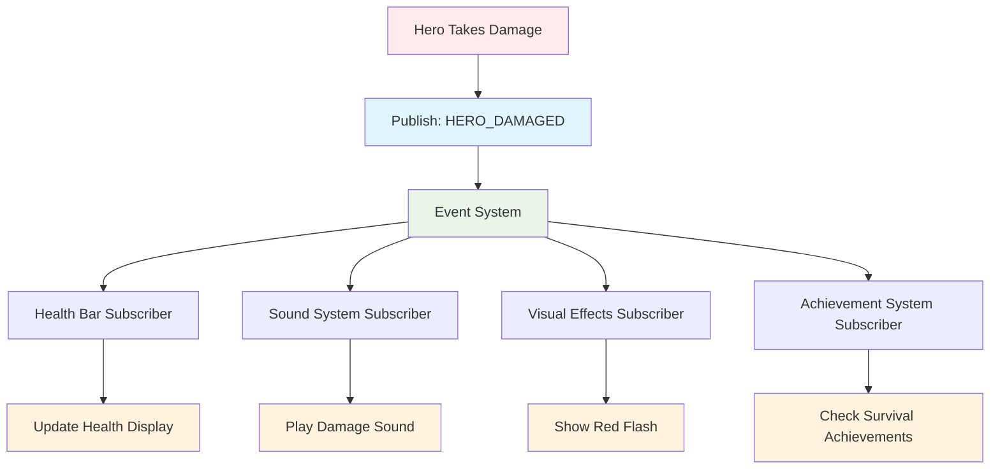
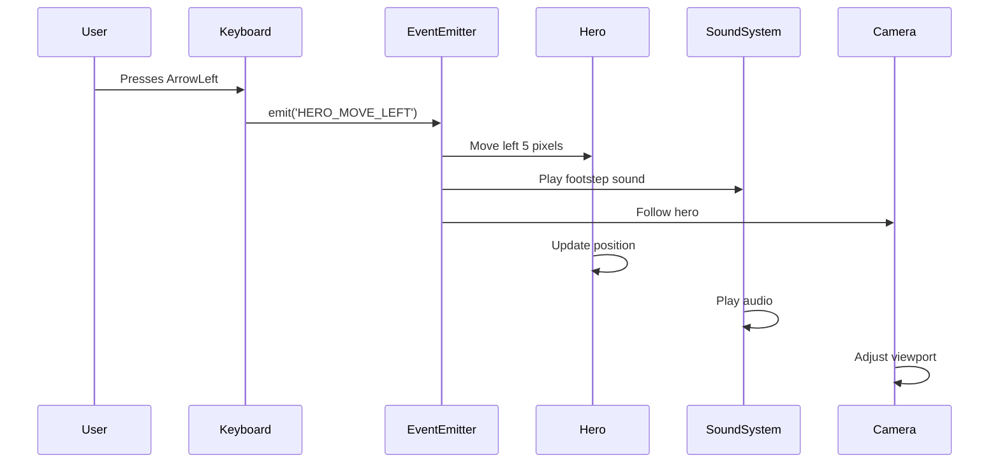
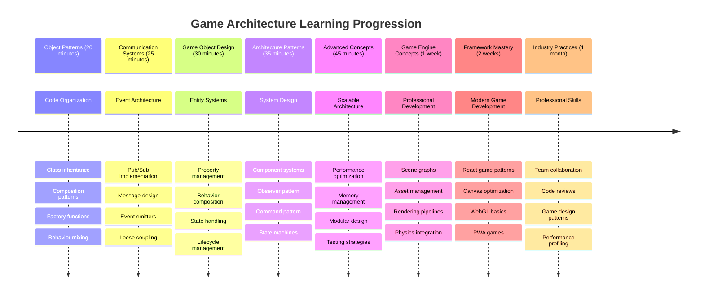

# Bouw een Ruimtespel Deel 1: Introductie




Net zoals NASA's missiecontrole meerdere systemen coördineert tijdens een lancering, gaan wij een ruimtespel bouwen dat laat zien hoe verschillende onderdelen van een programma naadloos kunnen samenwerken. Terwijl je iets maakt dat je daadwerkelijk kunt spelen, leer je essentiële programmeerconcepten die toepasbaar zijn op elk softwareproject.

We gaan twee fundamentele benaderingen verkennen om code te organiseren: overerving en compositie. Dit zijn niet alleen academische concepten – het zijn dezelfde patronen die alles aandrijven, van videogames tot banksystemen. We implementeren ook een communicatiesysteem genaamd pub/sub, dat werkt als de communicatienetwerken die in ruimtevaartuigen worden gebruikt, zodat verschillende componenten informatie kunnen delen zonder afhankelijkheden te creëren.

Aan het einde van deze serie begrijp je hoe je applicaties kunt bouwen die schaalbaar en flexibel zijn – of je nu games, webapplicaties of andere softwaresystemen ontwikkelt.



## Quiz voor de les

[Quiz voor de les](https://ff-quizzes.netlify.app/web/quiz/29)

## Overerving en Compositie in Game Development

Naarmate projecten complexer worden, wordt het organiseren van code cruciaal. Wat begint als een eenvoudige script kan moeilijk te onderhouden worden zonder een goede structuur – net zoals de Apollo-missies zorgvuldige coördinatie vereisten tussen duizenden componenten.

We gaan twee fundamentele benaderingen verkennen om code te organiseren: overerving en compositie. Elk heeft zijn eigen voordelen, en door beide te begrijpen kun je de juiste aanpak kiezen voor verschillende situaties. We demonstreren deze concepten via ons ruimtespel, waarin helden, vijanden, power-ups en andere objecten efficiënt moeten samenwerken.

✅ Een van de meest beroemde programmeerboeken ooit geschreven gaat over [design patterns](https://en.wikipedia.org/wiki/Design_Patterns).

In elk spel heb je `game objects` – de interactieve elementen die je spelwereld bevolken. Helden, vijanden, power-ups en visuele effecten zijn allemaal game objects. Elk bevindt zich op specifieke schermcoördinaten met behulp van `x` en `y` waarden, vergelijkbaar met het plotten van punten op een coördinatenvlak.

Ondanks hun visuele verschillen delen deze objecten vaak fundamenteel gedrag:

- **Ze bestaan ergens** – Elk object heeft x- en y-coördinaten zodat het spel weet waar het getekend moet worden
- **Veel kunnen bewegen** – Helden rennen, vijanden achtervolgen, kogels vliegen over het scherm
- **Ze hebben een levensduur** – Sommige blijven voor altijd, andere (zoals explosies) verschijnen kort en verdwijnen
- **Ze reageren op dingen** – Wanneer dingen botsen, worden power-ups verzameld, gezondheidsbalken bijgewerkt

✅ Denk aan een spel zoals Pac-Man. Kun je de vier hierboven genoemde objecttypes identificeren in dit spel?



### Gedrag uitdrukken via Code

Nu je begrijpt welk gedrag game objects gemeen hebben, gaan we onderzoeken hoe je dit gedrag kunt implementeren in JavaScript. Je kunt objectgedrag uitdrukken via methoden die zijn gekoppeld aan klassen of individuele objecten, en er zijn verschillende benaderingen om uit te kiezen.

**De Klasse-gebaseerde Benadering**

Klassen en overerving bieden een gestructureerde aanpak om game objects te organiseren. Net zoals het taxonomische classificatiesysteem ontwikkeld door Carl Linnaeus, begin je met een basisklasse die gemeenschappelijke eigenschappen bevat, en maak je gespecialiseerde klassen die deze basisprincipes erven terwijl ze specifieke mogelijkheden toevoegen.

✅ Overerving is een belangrijk concept om te begrijpen. Lees meer in [MDN's artikel over overerving](https://developer.mozilla.org/docs/Web/JavaScript/Inheritance_and_the_prototype_chain).

Hier is hoe je game objects kunt implementeren met klassen en overerving:

```javascript
// Step 1: Create the base GameObject class
class GameObject {
  constructor(x, y, type) {
    this.x = x;
    this.y = y;
    this.type = type;
  }
}
```

**Laten we dit stap voor stap uitleggen:**
- We maken een basis sjabloon die elk game object kan gebruiken
- De constructor slaat op waar het object is (`x`, `y`) en wat voor soort ding het is
- Dit wordt de basis waarop al je game objects zullen voortbouwen

```javascript
// Step 2: Add movement capability through inheritance
class Movable extends GameObject {
  constructor(x, y, type) {
    super(x, y, type); // Call parent constructor
  }

  // Add the ability to move to a new position
  moveTo(x, y) {
    this.x = x;
    this.y = y;
  }
}
```

**In het bovenstaande hebben we:**
- **Uitgebreid** de GameObject-klasse om bewegingsfunctionaliteit toe te voegen
- **Aangeroepen** de ouderconstructor met `super()` om geërfde eigenschappen te initialiseren
- **Toegevoegd** een `moveTo()`-methode die de positie van het object bijwerkt

```javascript
// Step 3: Create specific game object types
class Hero extends Movable {
  constructor(x, y) {
    super(x, y, 'Hero'); // Set type automatically
  }
}

class Tree extends GameObject {
  constructor(x, y) {
    super(x, y, 'Tree'); // Trees don't need movement
  }
}

// Step 4: Use your game objects
const hero = new Hero(0, 0);
hero.moveTo(5, 5); // Hero can move!

const tree = new Tree(10, 15);
// tree.moveTo() would cause an error - trees can't move
```

**Begrijpen van deze concepten:**
- **Creëert** gespecialiseerde objecttypes die passend gedrag erven
- **Toont** hoe overerving selectieve functie-inclusie mogelijk maakt
- **Laat zien** dat helden kunnen bewegen terwijl bomen stil blijven staan
- **Illustreert** hoe de klassenhiërarchie ongepaste acties voorkomt

✅ Neem een paar minuten om een Pac-Man held (Inky, Pinky of Blinky bijvoorbeeld) opnieuw te bedenken en hoe deze in JavaScript zou worden geschreven.

**De Compositie-benadering**

Compositie volgt een modulaire ontwerpfilosofie, vergelijkbaar met hoe ingenieurs ruimtevaartuigen ontwerpen met verwisselbare componenten. In plaats van te erven van een ouderklasse, combineer je specifieke gedragingen om objecten te creëren met precies de functionaliteit die ze nodig hebben. Deze aanpak biedt flexibiliteit zonder rigide hiërarchische beperkingen.

```javascript
// Step 1: Create base behavior objects
const gameObject = {
  x: 0,
  y: 0,
  type: ''
};

const movable = {
  moveTo(x, y) {
    this.x = x;
    this.y = y;
  }
};
```

**Wat deze code doet:**
- **Definieert** een basis `gameObject` met positie- en type-eigenschappen
- **Creëert** een apart `movable` gedrag-object met bewegingsfunctionaliteit
- **Scheidt** verantwoordelijkheden door positiegegevens en bewegingslogica onafhankelijk te houden

```javascript
// Step 2: Compose objects by combining behaviors
const movableObject = { ...gameObject, ...movable };

// Step 3: Create factory functions for different object types
function createHero(x, y) {
  return {
    ...movableObject,
    x,
    y,
    type: 'Hero'
  };
}

function createStatic(x, y, type) {
  return {
    ...gameObject,
    x,
    y,
    type
  };
}
```

**In het bovenstaande hebben we:**
- **Gecombineerd** basisobjecteigenschappen met bewegingsgedrag met behulp van spread-syntax
- **Gecreëerd** fabrieksfuncties die aangepaste objecten retourneren
- **Mogelijk gemaakt** flexibele objectcreatie zonder rigide klassenhiërarchieën
- **Toegestaan** dat objecten precies het gedrag hebben dat ze nodig hebben

```javascript
// Step 4: Create and use your composed objects
const hero = createHero(10, 10);
hero.moveTo(5, 5); // Works perfectly!

const tree = createStatic(0, 0, 'Tree');
// tree.moveTo() is undefined - no movement behavior was composed
```

**Belangrijke punten om te onthouden:**
- **Componeren** objecten door gedragingen te mixen in plaats van ze te erven
- **Biedt** meer flexibiliteit dan rigide overervingshiërarchieën
- **Maakt** het mogelijk dat objecten precies de functies hebben die ze nodig hebben
- **Gebruikt** moderne JavaScript spread-syntax voor schone objectcombinatie
```

**Which Pattern Should You Choose?**

**Which Pattern Should You Choose?**



> 💡 **Pro Tip**: Beide patronen hebben hun plaats in moderne JavaScript-ontwikkeling. Klassen werken goed voor duidelijk gedefinieerde hiërarchieën, terwijl compositie uitblinkt wanneer je maximale flexibiliteit nodig hebt.
> 
**Hier is wanneer je elke aanpak gebruikt:**
- **Kies** overerving wanneer je duidelijke "is-een"-relaties hebt (een Held *is-een* Beweegbaar object)
- **Selecteer** compositie wanneer je "heeft-een"-relaties nodig hebt (een Held *heeft* bewegingsmogelijkheden)
- **Overweeg** de voorkeuren van je team en projectvereisten
- **Onthoud** dat je beide benaderingen kunt mixen in dezelfde applicatie

### 🔄 **Pedagogische Check-in**
**Begrip van Objectorganisatie**: Voordat je doorgaat naar communicatiepatronen, zorg ervoor dat je:
- ✅ Het verschil tussen overerving en compositie kunt uitleggen
- ✅ Kunt identificeren wanneer je klassen versus fabrieksfuncties gebruikt
- ✅ Begrijpt hoe het `super()`-sleutelwoord werkt in overerving
- ✅ De voordelen van elke aanpak voor gameontwikkeling herkent

**Snelle Zelftest**: Hoe zou je een Vliegende Vijand maken die zowel kan bewegen als vliegen?
- **Overervingsaanpak**: `class FlyingEnemy extends Movable`
- **Compositieaanpak**: `{ ...movable, ...flyable, ...gameObject }`

**Echte Wereld Connectie**: Deze patronen verschijnen overal:
- **React Componenten**: Props (compositie) versus klasse-overerving
- **Game Engines**: Entity-component systemen gebruiken compositie
- **Mobiele Apps**: UI-frameworks gebruiken vaak overervingshiërarchieën

## Communicatiepatronen: Het Pub/Sub Systeem

Naarmate applicaties complexer worden, wordt het beheren van communicatie tussen componenten een uitdaging. Het publish-subscribe patroon (pub/sub) lost dit probleem op met principes die vergelijkbaar zijn met radiouitzendingen – één zender kan meerdere ontvangers bereiken zonder te weten wie er luistert.

Denk aan wat er gebeurt wanneer een held schade oploopt: de gezondheidsbalk wordt bijgewerkt, geluidseffecten spelen af, visuele feedback verschijnt. In plaats van het held-object direct aan deze systemen te koppelen, stelt pub/sub de held in staat om een "schade opgelopen"-bericht uit te zenden. Elk systeem dat moet reageren kan zich abonneren op dit berichttype en dienovereenkomstig reageren.

✅ **Pub/Sub** staat voor 'publish-subscribe'



### Begrijpen van de Pub/Sub Architectuur

Het pub/sub patroon houdt verschillende delen van je applicatie losjes gekoppeld, wat betekent dat ze kunnen samenwerken zonder direct afhankelijk van elkaar te zijn. Deze scheiding maakt je code beter onderhoudbaar, testbaar en flexibel voor veranderingen.

**De belangrijkste spelers in pub/sub:**
- **Berichten** – Eenvoudige tekstlabels zoals `'PLAYER_SCORED'` die beschrijven wat er is gebeurd (plus eventuele extra info)
- **Publishers** – De objecten die roepen "Er is iets gebeurd!" naar iedereen die luistert
- **Subscribers** – De objecten die zeggen "Ik geef om dat evenement" en reageren wanneer het gebeurt
- **Event System** – De tussenpersoon die ervoor zorgt dat berichten bij de juiste luisteraars komen

### Een Event System bouwen

Laten we een eenvoudig maar krachtig event system maken dat deze concepten demonstreert:

```javascript
// Step 1: Create the EventEmitter class
class EventEmitter {
  constructor() {
    this.listeners = {}; // Store all event listeners
  }
  
  // Register a listener for a specific message type
  on(message, listener) {
    if (!this.listeners[message]) {
      this.listeners[message] = [];
    }
    this.listeners[message].push(listener);
  }
  
  // Send a message to all registered listeners
  emit(message, payload = null) {
    if (this.listeners[message]) {
      this.listeners[message].forEach(listener => {
        listener(message, payload);
      });
    }
  }
}
```

**Wat hier gebeurt:**
- **Creëert** een centraal event management systeem met een eenvoudige klasse
- **Slaat** luisteraars op in een object georganiseerd per berichttype
- **Registreert** nieuwe luisteraars met de `on()`-methode
- **Zend** berichten uit naar alle geïnteresseerde luisteraars met `emit()`
- **Ondersteunt** optionele gegevenspayloads om relevante informatie door te geven

### Alles samenvoegen: Een Praktisch Voorbeeld

Oké, laten we dit in actie zien! We bouwen een eenvoudig bewegingssysteem dat laat zien hoe schoon en flexibel pub/sub kan zijn:

```javascript
// Step 1: Define your message types
const Messages = {
  HERO_MOVE_LEFT: 'HERO_MOVE_LEFT',
  HERO_MOVE_RIGHT: 'HERO_MOVE_RIGHT',
  ENEMY_SPOTTED: 'ENEMY_SPOTTED'
};

// Step 2: Create your event system and game objects
const eventEmitter = new EventEmitter();
const hero = createHero(0, 0);
```

**Wat deze code doet:**
- **Definieert** een constantenobject om typefouten in berichtnamen te voorkomen
- **Creëert** een event emitter instantie om alle communicatie af te handelen
- **Initialiseert** een held-object op de startpositie

```javascript
// Step 3: Set up event listeners (subscribers)
eventEmitter.on(Messages.HERO_MOVE_LEFT, () => {
  hero.moveTo(hero.x - 5, hero.y);
  console.log(`Hero moved to position: ${hero.x}, ${hero.y}`);
});

eventEmitter.on(Messages.HERO_MOVE_RIGHT, () => {
  hero.moveTo(hero.x + 5, hero.y);
  console.log(`Hero moved to position: ${hero.x}, ${hero.y}`);
});
```

**In het bovenstaande hebben we:**
- **Geregistreerd** event listeners die reageren op bewegingsberichten
- **Bijgewerkt** de positie van de held op basis van de bewegingsrichting
- **Toegevoegd** console logging om de positie van de held bij te houden
- **Gescheiden** de bewegingslogica van de invoerafhandeling

```javascript
// Step 4: Connect keyboard input to events (publishers)
window.addEventListener('keydown', (event) => {
  switch(event.key) {
    case 'ArrowLeft':
      eventEmitter.emit(Messages.HERO_MOVE_LEFT);
      break;
    case 'ArrowRight':
      eventEmitter.emit(Messages.HERO_MOVE_RIGHT);
      break;
  }
});
```

**Begrijpen van deze concepten:**
- **Verbindt** toetsenbordinvoer met game events zonder strakke koppeling
- **Maakt mogelijk** dat het invoersysteem indirect communiceert met game objects
- **Laat toe** dat meerdere systemen reageren op dezelfde toetsenbordevents
- **Maakt** het eenvoudig om toetsbindingen te wijzigen of nieuwe invoermethoden toe te voegen



> 💡 **Pro Tip**: Het mooie van dit patroon is flexibiliteit! Je kunt eenvoudig geluidseffecten, schermschudden of deeltjeseffecten toevoegen door simpelweg meer event listeners toe te voegen – je hoeft de bestaande toetsenbord- of bewegingscode niet te wijzigen.
> 
**Hier is waarom je van deze aanpak zult houden:**
- Nieuwe functies toevoegen wordt super eenvoudig – luister gewoon naar de events die je interesseren
- Meerdere dingen kunnen reageren op hetzelfde event zonder elkaar in de weg te zitten
- Testen wordt veel eenvoudiger omdat elk onderdeel onafhankelijk werkt
- Wanneer iets kapot gaat, weet je precies waar je moet zoeken

### Waarom Pub/Sub effectief schaalt

Het pub/sub patroon behoudt eenvoud terwijl applicaties complexer worden. Of je nu tientallen vijanden beheert, dynamische UI-updates of geluidssystemen, het patroon verwerkt toenemende schaal zonder architecturale wijzigingen. Nieuwe functies integreren in het bestaande event system zonder de bestaande functionaliteit te beïnvloeden.

> ⚠️ **Veelgemaakte fout**: Maak niet te vroeg te veel specifieke berichttypes. Begin met brede categorieën en verfijn ze naarmate de behoeften van je spel duidelijker worden.
> 
**Beste praktijken om te volgen:**
- **Groepeert** gerelateerde berichten in logische categorieën
- **Gebruikt** beschrijvende namen die duidelijk aangeven wat er is gebeurd
- **Houdt** berichtpayloads eenvoudig en gefocust
- **Documenteert** je berichttypes voor samenwerking binnen het team

### 🔄 **Pedagogische Check-in**
**Begrip van Event-Driven Architectuur**: Controleer je begrip van het volledige systeem:
- ✅ Hoe voorkomt het pub/sub patroon strakke koppeling tussen componenten?
- ✅ Waarom is het eenvoudiger om nieuwe functies toe te voegen met event-driven architectuur?
- ✅ Welke rol speelt de EventEmitter in de communicatiestroom?
- ✅ Hoe voorkomen berichtconstanten bugs en verbeteren ze de onderhoudbaarheid?

**Ontwerpuitdaging**: Hoe zou je deze spelscenario's afhandelen met pub/sub?
1. **Vijand sterft**: Update score, speel geluid, spawn power-up, verwijder van scherm
2. **Level voltooid**: Stop muziek, toon UI, sla voortgang op, laad volgend level
3. **Power-up verzameld**: Verbeter vaardigheden, update UI, speel effect, start timer

**Professionele Connectie**: Dit patroon verschijnt in:
- **Frontend Frameworks**: React/Vue event systemen
- **Backend Services**: Microservice communicatie
- **Game Engines**: Unity's event systeem
- **Mobiele Ontwikkeling**: iOS/Android notificatiesystemen

---

## GitHub Copilot Agent Uitdaging 🚀

Gebruik de Agent-modus om de volgende uitdaging te voltooien:

**Beschrijving:** Maak een eenvoudig game object systeem met zowel overerving als het pub/sub patroon. Je implementeert een basisgame waarin verschillende objecten via events kunnen communiceren zonder direct van elkaar te weten.

**Prompt:** Maak een JavaScript game systeem met de volgende vereisten: 1) Maak een basis GameObject klasse met x, y coördinaten en een type eigenschap. 2) Maak een Hero klasse die GameObject uitbreidt en kan bewegen. 3) Maak een Enemy klasse die GameObject uitbreidt en de held kan achtervolgen. 4) Implementeer een EventEmitter klasse voor het pub/sub patroon. 5) Stel event listeners in zodat wanneer de held beweegt, nabije vijanden een 'HERO_MOVED' event ontvangen en hun positie bijwerken om naar de held toe te bewegen. Voeg console.log statements toe om de communicatie tussen objecten te tonen.

Meer leren over [agent mode](https://code.visualstudio.com/blogs/2025/02/24/introducing-copilot-agent-mode) hier.

## 🚀 Uitdaging
Overweeg hoe het pub-sub patroon de game-architectuur kan verbeteren. Identificeer welke componenten evenementen moeten uitzenden en hoe het systeem daarop moet reageren. Ontwerp een gameconcept en breng de communicatiepatronen tussen de componenten in kaart.

## Quiz na de les

[Quiz na de les](https://ff-quizzes.netlify.app/web/quiz/30)

## Review & Zelfstudie

Leer meer over Pub/Sub door [er meer over te lezen](https://docs.microsoft.com/azure/architecture/patterns/publisher-subscriber/?WT.mc_id=academic-77807-sagibbon).

### ⚡ **Wat je in de komende 5 minuten kunt doen**
- [ ] Open een willekeurig HTML5-spel online en inspecteer de code met DevTools
- [ ] Maak een eenvoudige HTML5 Canvas-element en teken een basisvorm
- [ ] Probeer `setInterval` te gebruiken om een eenvoudige animatielus te maken
- [ ] Verken de Canvas API-documentatie en probeer een tekenmethode

### 🎯 **Wat je in een uur kunt bereiken**
- [ ] Maak de quiz na de les en begrijp de concepten van gameontwikkeling
- [ ] Stel de structuur van je gameproject op met HTML-, CSS- en JavaScript-bestanden
- [ ] Maak een basis game-lus die continu bijwerkt en rendert
- [ ] Teken je eerste game-sprites op het canvas
- [ ] Implementeer basis asset-loading voor afbeeldingen en geluiden

### 📅 **Je weeklange gamecreatie**
- [ ] Voltooi het volledige ruimte-spel met alle geplande functies
- [ ] Voeg gepolijste graphics, geluidseffecten en vloeiende animaties toe
- [ ] Implementeer gamestaten (startscherm, gameplay, game over)
- [ ] Maak een score-systeem en volg de voortgang van de speler
- [ ] Zorg ervoor dat je game responsief en toegankelijk is op verschillende apparaten
- [ ] Deel je game online en verzamel feedback van spelers

### 🌟 **Je maandlange gameontwikkeling**
- [ ] Bouw meerdere games waarin je verschillende genres en mechanismen verkent
- [ ] Leer een gameontwikkelingsframework zoals Phaser of Three.js
- [ ] Draag bij aan open source gameontwikkelingsprojecten
- [ ] Beheers geavanceerde gameprogrammeerpatronen en optimalisatie
- [ ] Maak een portfolio waarin je je vaardigheden in gameontwikkeling toont
- [ ] Begeleid anderen die geïnteresseerd zijn in gameontwikkeling en interactieve media

## 🎯 Je tijdlijn voor meesterschap in gameontwikkeling



### 🛠️ Samenvatting van je toolkit voor game-architectuur

Na het voltooien van deze les heb je nu:
- **Beheersing van ontwerpprincipes**: Begrip van de afwegingen tussen overerving en compositie
- **Event-gedreven architectuur**: Pub/sub implementatie voor schaalbare communicatie
- **Objectgeoriënteerd ontwerp**: Klassenhiërarchieën en gedragscompositie
- **Moderne JavaScript**: Factory functies, spread syntax en ES6+ patronen
- **Schaalbare architectuur**: Losse koppeling en modulaire ontwerpprincipes
- **Basis van gameontwikkeling**: Entity-systemen en componentpatronen
- **Professionele patronen**: Industriestandaard benaderingen voor codeorganisatie

**Toepassingen in de echte wereld**: Deze patronen zijn direct toepasbaar op:
- **Frontend Frameworks**: React/Vue componentarchitectuur en state management
- **Backend Services**: Microservice-communicatie en event-gedreven systemen
- **Mobiele ontwikkeling**: iOS/Android app-architectuur en notificatiesystemen
- **Game Engines**: Unity, Unreal en webgebaseerde gameontwikkeling
- **Enterprise Software**: Event sourcing en ontwerp van gedistribueerde systemen
- **API Design**: RESTful services en realtime communicatie

**Verworven professionele vaardigheden**: Je kunt nu:
- **Ontwerpen** schaalbare softwarearchitecturen met bewezen patronen
- **Implementeren** event-gedreven systemen die complexe interacties afhandelen
- **Kiezen** geschikte strategieën voor codeorganisatie in verschillende scenario's
- **Debuggen** en onderhouden van los gekoppelde systemen
- **Communiceren** technische beslissingen met behulp van industriestandaard terminologie

**Volgende niveau**: Je bent klaar om deze patronen in een echte game te implementeren, geavanceerde onderwerpen in gameontwikkeling te verkennen, of deze architecturale concepten toe te passen op webapplicaties!

🌟 **Prestatie Ontgrendeld**: Je hebt fundamentele softwarearchitectuurpatronen onder de knie die alles aandrijven, van eenvoudige games tot complexe bedrijfssystemen!

## Opdracht

[Mock een game](assignment.md)

---

**Disclaimer**:  
Dit document is vertaald met behulp van de AI-vertalingsservice [Co-op Translator](https://github.com/Azure/co-op-translator). Hoewel we streven naar nauwkeurigheid, dient u zich ervan bewust te zijn dat geautomatiseerde vertalingen fouten of onnauwkeurigheden kunnen bevatten. Het originele document in de oorspronkelijke taal moet worden beschouwd als de gezaghebbende bron. Voor kritieke informatie wordt professionele menselijke vertaling aanbevolen. Wij zijn niet aansprakelijk voor eventuele misverstanden of verkeerde interpretaties die voortvloeien uit het gebruik van deze vertaling.