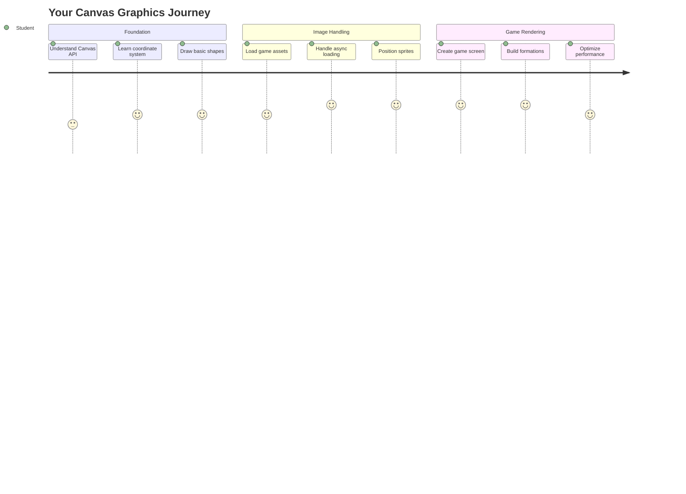
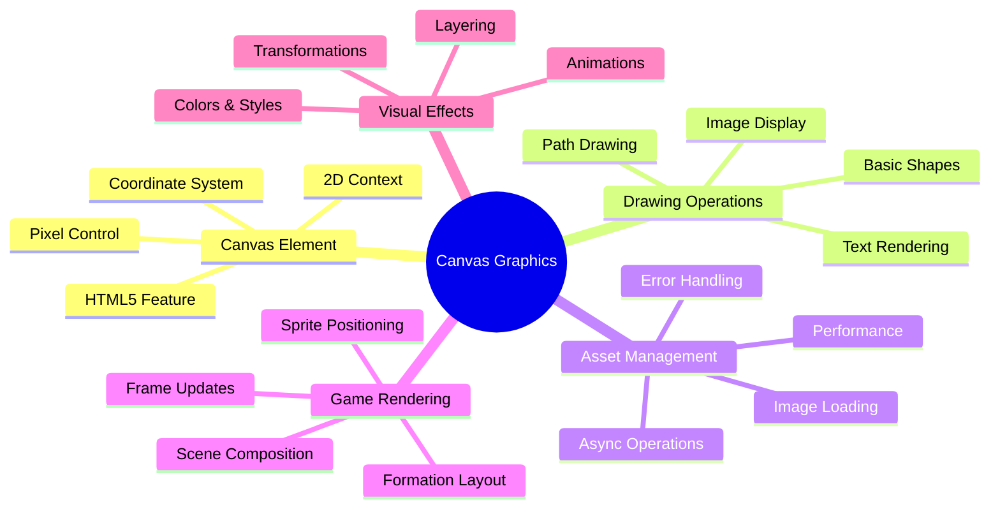
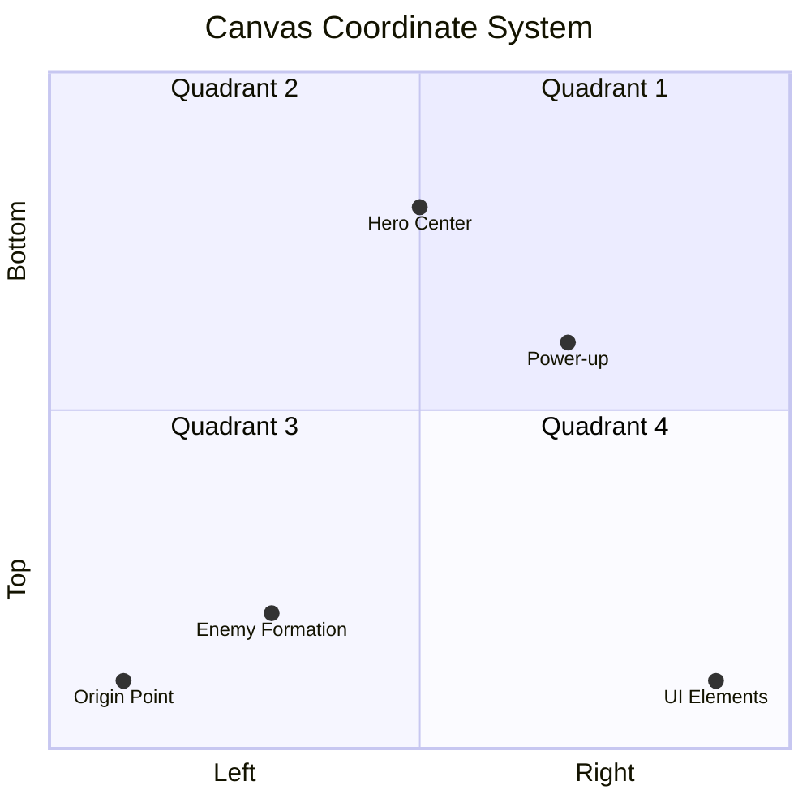
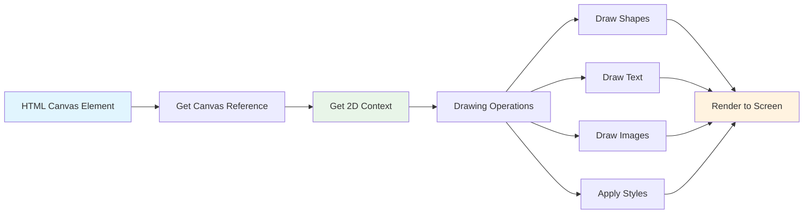
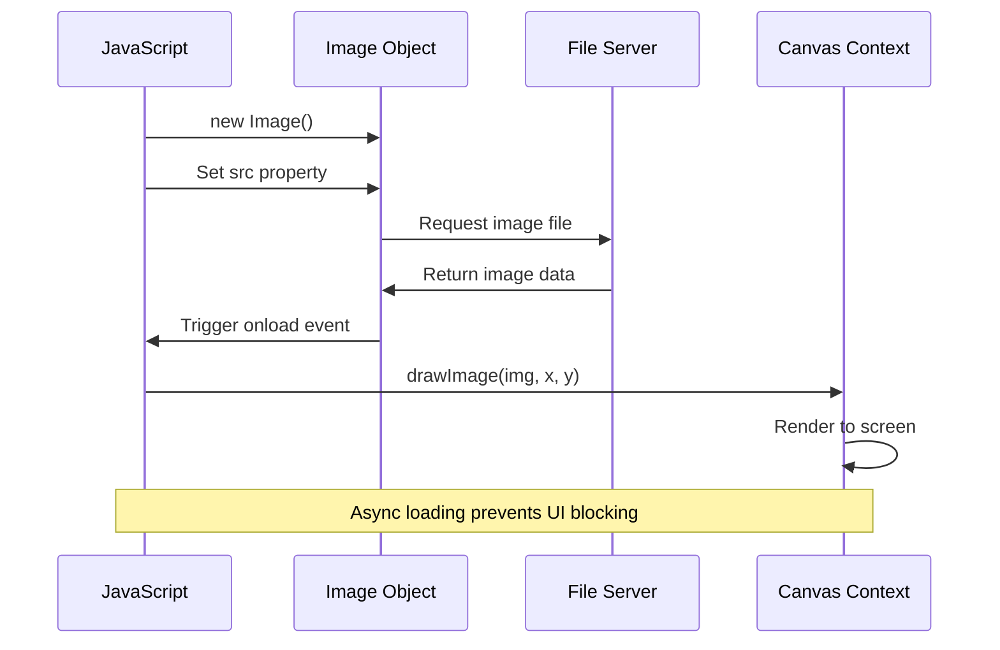
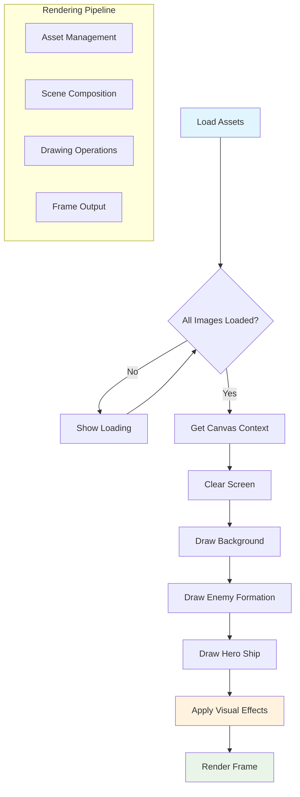
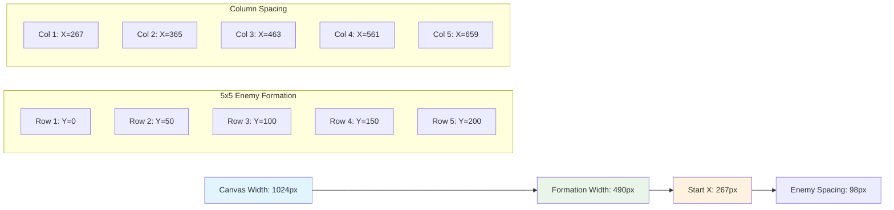
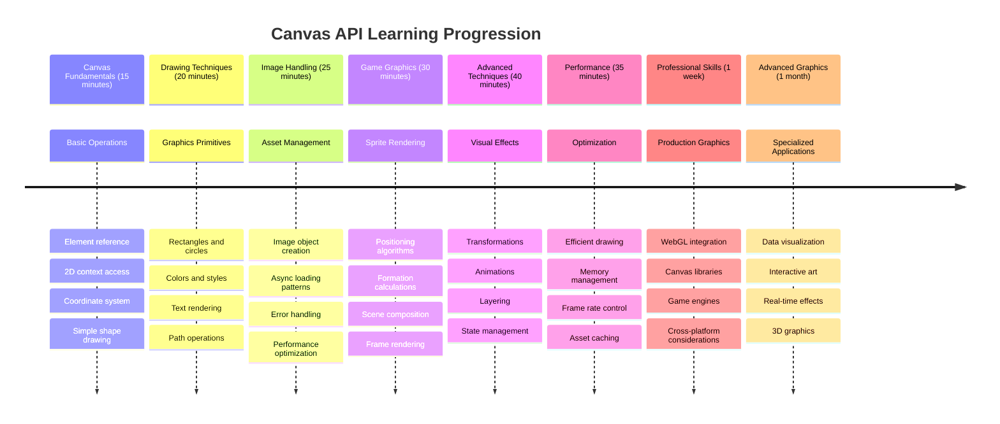

<!--
CO_OP_TRANSLATOR_METADATA:
{
  "original_hash": "7994743c5b21fdcceb36307916ef249a",
  "translation_date": "2025-11-04T02:04:47+00:00",
  "source_file": "6-space-game/2-drawing-to-canvas/README.md",
  "language_code": "nl"
}
-->
# Bouw een Ruimtespel Deel 2: Teken Held en Monsters op Canvas



De Canvas API is een van de krachtigste functies in webontwikkeling om dynamische, interactieve graphics direct in je browser te maken. In deze les transformeren we dat lege HTML `<canvas>`-element in een spelwereld vol helden en monsters. Zie de canvas als je digitale tekenbord waar code visueel wordt.

We bouwen voort op wat je in de vorige les hebt geleerd en duiken nu in de visuele aspecten. Je leert hoe je spel-sprites laadt en weergeeft, elementen nauwkeurig positioneert en de visuele basis voor je ruimtespel creëert. Dit slaat de brug tussen statische webpagina's en dynamische, interactieve ervaringen.

Aan het einde van deze les heb je een complete spelscène met je heldenschip correct gepositioneerd en vijandelijke formaties klaar voor de strijd. Je begrijpt hoe moderne spellen graphics in browsers renderen en krijgt vaardigheden om je eigen interactieve visuele ervaringen te creëren. Laten we canvasgraphics verkennen en je ruimtespel tot leven brengen!



## Pre-Lecture Quiz

[Pre-lecture quiz](https://ff-quizzes.netlify.app/web/quiz/31)

## De Canvas

Wat is precies dit `<canvas>`-element? Het is de HTML5-oplossing voor het maken van dynamische graphics en animaties in webbrowsers. In tegenstelling tot gewone afbeeldingen of video's die statisch zijn, geeft de canvas je pixel-niveau controle over alles wat op het scherm verschijnt. Dit maakt het perfect voor spellen, datavisualisaties en interactieve kunst. Zie het als een programmeerbaar tekenoppervlak waar JavaScript je penseel wordt.

Standaard ziet een canvas-element eruit als een lege, transparante rechthoek op je pagina. Maar daar ligt de potentie! De echte kracht komt naar voren wanneer je JavaScript gebruikt om vormen te tekenen, afbeeldingen te laden, animaties te maken en dingen te laten reageren op gebruikersinteracties. Het is vergelijkbaar met hoe de pioniers van computergraphics bij Bell Labs in de jaren '60 elke pixel moesten programmeren om de eerste digitale animaties te maken.

✅ Lees [meer over de Canvas API](https://developer.mozilla.org/docs/Web/API/Canvas_API) op MDN.

Hier is hoe het meestal wordt gedeclareerd, als onderdeel van de body van de pagina:

```html
<canvas id="myCanvas" width="200" height="100"></canvas>
```

**Wat doet deze code:**
- **Stelt** het `id`-attribuut in zodat je dit specifieke canvas-element in JavaScript kunt refereren
- **Definieert** de `width` in pixels om de horizontale grootte van de canvas te bepalen
- **Bepaalt** de `height` in pixels om de verticale afmetingen van de canvas vast te stellen

## Eenvoudige Geometrie Tekenen

Nu je weet wat het canvas-element is, laten we verkennen hoe je er daadwerkelijk op kunt tekenen! De canvas gebruikt een coördinatensysteem dat je misschien herkent van wiskundeles, maar er is één belangrijke twist specifiek voor computergraphics.

De canvas gebruikt Cartesiaanse coördinaten met een x-as (horizontaal) en y-as (verticaal) om alles wat je tekent te positioneren. Maar hier is het belangrijkste verschil: in tegenstelling tot het coördinatensysteem uit de wiskundeles begint het oorsprongspunt `(0,0)` in de linkerbovenhoek, waarbij x-waarden toenemen als je naar rechts gaat en y-waarden toenemen als je naar beneden gaat. Deze aanpak stamt uit de vroege computerschermen waar elektronenstralen van boven naar beneden scanden, waardoor de linkerbovenhoek het natuurlijke startpunt werd.




> Afbeelding van [MDN](https://developer.mozilla.org/docs/Web/API/Canvas_API/Tutorial/Drawing_shapes)

Om op het canvas-element te tekenen, volg je hetzelfde drie-stappenproces dat de basis vormt van alle canvasgraphics. Zodra je dit een paar keer hebt gedaan, wordt het een tweede natuur:



1. **Verkrijg een referentie** naar je Canvas-element vanuit de DOM (net als elk ander HTML-element)
2. **Verkrijg de 2D-rendercontext** – dit biedt alle tekenmethoden
3. **Begin met tekenen!** Gebruik de ingebouwde methoden van de context om je graphics te maken

Zo ziet dit eruit in code:

```javascript
// Step 1: Get the canvas element
const canvas = document.getElementById("myCanvas");

// Step 2: Get the 2D rendering context
const ctx = canvas.getContext("2d");

// Step 3: Set fill color and draw a rectangle
ctx.fillStyle = 'red';
ctx.fillRect(0, 0, 200, 200); // x, y, width, height
```

**Laten we dit stap voor stap uitleggen:**
- We **pakken** ons canvas-element met zijn ID en slaan het op in een variabele
- We **verkrijgen** de 2D-rendercontext – dit is onze toolkit vol tekenmethoden
- We **vertellen** de canvas dat we dingen willen vullen met rood via de `fillStyle`-eigenschap
- We **tekenen** een rechthoek beginnend in de linkerbovenhoek (0,0) die 200 pixels breed en hoog is

✅ De Canvas API richt zich voornamelijk op 2D-vormen, maar je kunt ook 3D-elementen tekenen op een website; hiervoor kun je de [WebGL API](https://developer.mozilla.org/docs/Web/API/WebGL_API) gebruiken.

Je kunt allerlei dingen tekenen met de Canvas API zoals:

- **Geometrische vormen**, we hebben al laten zien hoe je een rechthoek tekent, maar er is nog veel meer dat je kunt tekenen.
- **Tekst**, je kunt tekst tekenen met elk gewenst lettertype en kleur.
- **Afbeeldingen**, je kunt een afbeelding tekenen op basis van een afbeeldingsbestand zoals een .jpg of .png.

✅ Probeer het! Je weet hoe je een rechthoek tekent, kun je een cirkel op een pagina tekenen? Bekijk enkele interessante Canvas-tekeningen op CodePen. Hier is een [bijzonder indrukwekkend voorbeeld](https://codepen.io/dissimulate/pen/KrAwx).

### 🔄 **Pedagogische Check-in**
**Canvas Basisbegrip**: Voordat je doorgaat naar het laden van afbeeldingen, zorg ervoor dat je:
- ✅ Uitleg kunt geven over hoe het coördinatensysteem van de canvas verschilt van wiskundige coördinaten
- ✅ Het drie-stappenproces voor canvas-tekenbewerkingen begrijpt
- ✅ Kunt identificeren wat de 2D-rendercontext biedt
- ✅ Kunt beschrijven hoe fillStyle en fillRect samenwerken

**Snelle Zelftest**: Hoe zou je een blauwe cirkel tekenen op positie (100, 50) met een straal van 25?
```javascript
ctx.fillStyle = 'blue';
ctx.beginPath();
ctx.arc(100, 50, 25, 0, 2 * Math.PI);
ctx.fill();
```

**Canvas Tekenmethoden die je nu kent**:
- **fillRect()**: Tekent gevulde rechthoeken
- **fillStyle**: Stelt kleuren en patronen in
- **beginPath()**: Start nieuwe tekenpaden
- **arc()**: Maakt cirkels en krommen

## Een Afbeeldingsbestand Laden en Tekenen

Eenvoudige vormen tekenen is handig om te beginnen, maar de meeste spellen hebben echte afbeeldingen nodig! Sprites, achtergronden en texturen geven spellen hun visuele aantrekkingskracht. Afbeeldingen laden en weergeven op de canvas werkt anders dan het tekenen van geometrische vormen, maar het is eenvoudig zodra je het proces begrijpt.

We moeten een `Image`-object maken, ons afbeeldingsbestand laden (dit gebeurt asynchroon, wat betekent "op de achtergrond"), en het vervolgens op de canvas tekenen zodra het klaar is. Deze aanpak zorgt ervoor dat je afbeeldingen correct worden weergegeven zonder je applicatie te blokkeren tijdens het laden.



### Basis Afbeeldingsladen

```javascript
const img = new Image();
img.src = 'path/to/my/image.png';
img.onload = () => {
  // Image loaded and ready to be used
  console.log('Image loaded successfully!');
};
```

**Wat gebeurt er in deze code:**
- We **maken** een gloednieuw Image-object om onze sprite of textuur vast te houden
- We **vertellen** welk afbeeldingsbestand moet worden geladen door het bronpad in te stellen
- We **luisteren** naar het laad-evenement zodat we precies weten wanneer de afbeelding klaar is om te gebruiken

### Een Betere Manier om Afbeeldingen te Laden

Hier is een robuustere manier om afbeeldingen te laden die professionele ontwikkelaars vaak gebruiken. We wikkelen het laden van afbeeldingen in een Promise-gebaseerde functie – deze aanpak, populair geworden toen JavaScript Promises standaard werden in ES6, maakt je code overzichtelijker en behandelt fouten op een elegante manier:

```javascript
function loadAsset(path) {
  return new Promise((resolve, reject) => {
    const img = new Image();
    img.src = path;
    img.onload = () => {
      resolve(img);
    };
    img.onerror = () => {
      reject(new Error(`Failed to load image: ${path}`));
    };
  });
}

// Modern usage with async/await
async function initializeGame() {
  try {
    const heroImg = await loadAsset('hero.png');
    const monsterImg = await loadAsset('monster.png');
    // Images are now ready to use
  } catch (error) {
    console.error('Failed to load game assets:', error);
  }
}
```

**Wat we hier hebben gedaan:**
- **Alle logica voor het laden van afbeeldingen** in een Promise gewikkeld zodat we het beter kunnen beheren
- **Foutafhandeling toegevoegd** die ons daadwerkelijk vertelt wanneer er iets misgaat
- **Moderne async/await-syntaxis gebruikt** omdat het veel leesbaarder is
- **Try/catch-blokken opgenomen** om eventuele laadproblemen elegant af te handelen

Zodra je afbeeldingen zijn geladen, is het eigenlijk vrij eenvoudig om ze op de canvas te tekenen:

```javascript
async function renderGameScreen() {
  try {
    // Load game assets
    const heroImg = await loadAsset('hero.png');
    const monsterImg = await loadAsset('monster.png');

    // Get canvas and context
    const canvas = document.getElementById("myCanvas");
    const ctx = canvas.getContext("2d");

    // Draw images to specific positions
    ctx.drawImage(heroImg, canvas.width / 2, canvas.height / 2);
    ctx.drawImage(monsterImg, 0, 0);
  } catch (error) {
    console.error('Failed to render game screen:', error);
  }
}
```

**Laten we dit stap voor stap uitleggen:**
- We **laden** zowel onze held- als monsterafbeeldingen op de achtergrond met await
- We **pakken** ons canvas-element en verkrijgen die 2D-rendercontext die we nodig hebben
- We **positioneren** de heldenafbeelding precies in het midden met wat snelle coördinatenberekeningen
- We **plaatsen** de monsterafbeelding in de linkerbovenhoek om onze vijandelijke formatie te starten
- We **vangen** eventuele fouten op die kunnen optreden tijdens het laden of renderen



## Nu is het Tijd om je Spel te Bouwen

Nu gaan we alles samenvoegen om de visuele basis van je ruimtespel te creëren. Je hebt een solide begrip van canvas-basisprincipes en technieken voor het laden van afbeeldingen, dus dit praktische gedeelte zal je begeleiden bij het bouwen van een complete spelscherm met correct gepositioneerde sprites.

### Wat te Bouwen

Je gaat een webpagina maken met een Canvas-element. Het moet een zwart scherm van `1024*768` weergeven. We hebben je twee afbeeldingen gegeven:

- Heldenschip

   

- 5*5 monster

   

### Aanbevolen stappen om te beginnen met ontwikkelen

Vind de startbestanden die voor je zijn gemaakt in de submap `your-work`. De structuur van je project zou het volgende moeten bevatten:

```bash
your-work/
├── assets/
│   ├── enemyShip.png
│   └── player.png
├── index.html
├── app.js
└── package.json
```

**Wat je hebt om mee te werken:**
- **Spelsprites** staan in de map `assets/` zodat alles georganiseerd blijft
- **Je hoofd-HTML-bestand** zet het canvas-element op en maakt alles klaar
- **Een JavaScript-bestand** waarin je al je magische spelrendering schrijft
- **Een package.json** die een ontwikkelserver instelt zodat je lokaal kunt testen

Open deze map in Visual Studio Code om te beginnen met ontwikkelen. Je hebt een lokale ontwikkelomgeving nodig met Visual Studio Code, NPM en Node.js geïnstalleerd. Als je `npm` nog niet hebt ingesteld op je computer, [hier lees je hoe je het installeert](https://www.npmjs.com/get-npm).

Start je ontwikkelserver door naar de map `your-work` te navigeren:

```bash
cd your-work
npm start
```

**Dit commando doet een paar coole dingen:**
- **Start** een lokale server op `http://localhost:5000` zodat je je spel kunt testen
- **Serveert** al je bestanden correct zodat je browser ze goed kan laden
- **Houdt je bestanden in de gaten** voor wijzigingen zodat je soepel kunt ontwikkelen
- **Geeft je** een professionele ontwikkelomgeving om alles te testen

> 💡 **Let op**: Je browser toont in eerste instantie een lege pagina – dat is normaal! Terwijl je code toevoegt, vernieuw je je browser om je wijzigingen te zien. Deze iteratieve ontwikkelaanpak is vergelijkbaar met hoe NASA de Apollo-geleidingscomputer bouwde – elke component testen voordat deze in het grotere systeem wordt geïntegreerd.

### Code Toevoegen

Voeg de benodigde code toe aan `your-work/app.js` om de volgende taken te voltooien:

1. **Teken een canvas met zwarte achtergrond**
   > 💡 **Hoe**: Zoek de TODO in `/app.js` en voeg slechts twee regels toe. Stel `ctx.fillStyle` in op zwart, gebruik vervolgens `ctx.fillRect()` beginnend bij (0,0) met de afmetingen van je canvas. Simpel!

2. **Laad speltexturen**
   > 💡 **Hoe**: Gebruik `await loadAsset()` om je speler- en vijandafbeeldingen te laden. Sla ze op in variabelen zodat je ze later kunt gebruiken. Onthoud – ze verschijnen pas als je ze daadwerkelijk tekent!

3. **Teken het heldenschip in de midden-onder positie**
   > 💡 **Hoe**: Gebruik `ctx.drawImage()` om je held te positioneren. Voor de x-coördinaat kun je `canvas.width / 2 - 45` proberen om het te centreren, en voor de y-coördinaat gebruik je `canvas.height - canvas.height / 4` om het in het onderste gebied te plaatsen.

4. **Teken een 5×5 formatie van vijandelijke schepen**
   > 💡 **Hoe**: Zoek de functie `createEnemies` en stel een geneste lus in. Je moet wat wiskunde doen voor de afstand en positionering, maar maak je geen zorgen – ik laat je precies zien hoe!

Eerst stel je constanten in voor een juiste lay-out van de vijandelijke formatie:

```javascript
const ENEMY_TOTAL = 5;
const ENEMY_SPACING = 98;
const FORMATION_WIDTH = ENEMY_TOTAL * ENEMY_SPACING;
const START_X = (canvas.width - FORMATION_WIDTH) / 2;
const STOP_X = START_X + FORMATION_WIDTH;
```

**Laten we uitleggen wat deze constanten doen:**
- We **stellen** 5 vijanden per rij en kolom in (een mooie 5×5 raster)
- We **definiëren** hoeveel ruimte we tussen vijanden plaatsen zodat ze niet te dicht op elkaar staan
- We **berekenen** hoe breed onze hele formatie zal zijn
- We **bepalen** waar te beginnen en te eindigen zodat de formatie gecentreerd lijkt



Vervolgens maak je geneste lussen om de vijandelijke formatie te tekenen:

```javascript
for (let x = START_X; x < STOP_X; x += ENEMY_SPACING) {
  for (let y = 0; y < 50 * 5; y += 50) {
    ctx.drawImage(enemyImg, x, y);
  }
}
```

**Wat deze geneste lus doet:**
- De buitenste lus **beweegt** van links naar rechts over onze formatie
- De binnenste lus **gaat** van boven naar beneden om nette rijen te maken
- We **tekenen** elke vijandelijke sprite op de exacte x,y-coördinaten die we hebben berekend
- Alles blijft **gelijkmatig verdeeld** zodat het er professioneel en georganiseerd uitziet

### 🔄 **Pedagogische Check-in**
**Beheersing van Spelrendering**: Controleer je begrip van het complete renderingssysteem:
- ✅ Hoe voorkomt asynchroon laden van afbeeldingen dat de gebruikersinterface blokkeert tijdens het opstarten van het spel?
- ✅ Waarom berekenen we de posities van vijandelijke formaties met constanten in plaats van hardcoderen?
- ✅ Welke rol speelt de 2D-rendercontext in tekenbewerkingen?
- ✅ Hoe creëren geneste lussen georganiseerde sprite-formaties?

**Prestatieoverwegingen**: Je spel demonstreert nu:
- **Efficiënt laden van assets**: Promise-gebaseerd beheer van afbeeldingen
- **Georganiseerde rendering**: Gestructureerde tekenbewerkingen
- **Wiskundige positionering**: Berekende plaatsing van sprites
- **Foutafhandeling**: Elegante afhandeling van fouten

**Concepten van Visueel Programmeren**: Je hebt geleerd:
- **Coördinatensystemen**: Wiskunde vertalen naar schermposities  
- **Spritebeheer**: Laden en weergeven van spelgrafieken  
- **Formatie-algoritmen**: Wiskundige patronen voor georganiseerde lay-outs  
- **Async-operaties**: Moderne JavaScript voor een soepele gebruikerservaring  

## Resultaat  

Het eindresultaat zou er zo uit moeten zien:  

  

## Oplossing  

Probeer het eerst zelf op te lossen, maar als je vastloopt, bekijk dan een [oplossing](../../../../6-space-game/2-drawing-to-canvas/solution/app.js).  

---

## GitHub Copilot Agent Challenge 🚀  

Gebruik de Agent-modus om de volgende uitdaging te voltooien:  

**Beschrijving:** Verbeter je ruimtegame-canvas door visuele effecten en interactieve elementen toe te voegen met behulp van de Canvas API-technieken die je hebt geleerd.  

**Prompt:** Maak een nieuw bestand genaamd `enhanced-canvas.html` met een canvas dat geanimeerde sterren op de achtergrond weergeeft, een pulserende gezondheidsbalk voor het heldenschip, en vijandelijke schepen die langzaam naar beneden bewegen. Voeg JavaScript-code toe die twinkelende sterren tekent met willekeurige posities en opaciteit, een gezondheidsbalk implementeert die van kleur verandert op basis van het gezondheidsniveau (groen > geel > rood), en de vijandelijke schepen animeert om met verschillende snelheden naar beneden te bewegen.  

Meer informatie over [agent-modus](https://code.visualstudio.com/blogs/2025/02/24/introducing-copilot-agent-mode) vind je hier.  

## 🚀 Uitdaging  

Je hebt geleerd over tekenen met de 2D-georiënteerde Canvas API; bekijk de [WebGL API](https://developer.mozilla.org/docs/Web/API/WebGL_API) en probeer een 3D-object te tekenen.  

## Quiz na de les  

[Quiz na de les](https://ff-quizzes.netlify.app/web/quiz/32)  

## Review & Zelfstudie  

Leer meer over de Canvas API door [erover te lezen](https://developer.mozilla.org/docs/Web/API/Canvas_API).  

### ⚡ **Wat je in de komende 5 minuten kunt doen**  
- [ ] Open de browserconsole en maak een canvas-element met `document.createElement('canvas')`  
- [ ] Probeer een rechthoek te tekenen met `fillRect()` op een canvascontext  
- [ ] Experimenteer met verschillende kleuren met behulp van de eigenschap `fillStyle`  
- [ ] Teken een eenvoudige cirkel met de methode `arc()`  

### 🎯 **Wat je in dit uur kunt bereiken**  
- [ ] Voltooi de quiz na de les en begrijp de basisprincipes van canvas  
- [ ] Maak een canvas-tekenapplicatie met meerdere vormen en kleuren  
- [ ] Implementeer afbeeldingsladen en sprite-rendering voor je game  
- [ ] Bouw een eenvoudige animatie die objecten over het canvas beweegt  
- [ ] Oefen canvas-transformaties zoals schalen, roteren en vertalen  

### 📅 **Je weeklange Canvas-reis**  
- [ ] Voltooi de ruimtegame met gepolijste grafieken en sprite-animaties  
- [ ] Beheers geavanceerde canvas-technieken zoals verlopen, patronen en compositing  
- [ ] Maak interactieve visualisaties met canvas voor datarepresentatie  
- [ ] Leer over canvas-optimalisatietechnieken voor een soepele prestatie  
- [ ] Bouw een teken- of schilderapplicatie met verschillende tools  
- [ ] Verken creatieve codeerpatronen en generatieve kunst met canvas  

### 🌟 **Je maandlange grafische meesterschap**  
- [ ] Bouw complexe visuele applicaties met Canvas 2D en WebGL  
- [ ] Leer grafische programmeerconcepten en shader-basisprincipes  
- [ ] Draag bij aan open source grafische bibliotheken en visualisatietools  
- [ ] Beheers prestatieoptimalisatie voor grafisch-intensieve applicaties  
- [ ] Maak educatieve content over canvas-programmering en computergraphics  
- [ ] Word een expert in grafische programmering die anderen helpt visuele ervaringen te creëren  

## 🎯 Je Canvas Graphics Mastery Tijdlijn  


  
### 🛠️ Samenvatting van je Canvas Graphics Toolkit  

Na het voltooien van deze les heb je nu:  
- **Canvas API Meesterschap**: Volledig begrip van 2D-grafische programmering  
- **Coördinatenwiskunde**: Precieze positionering en lay-outalgoritmen  
- **Assetbeheer**: Professioneel laden van afbeeldingen en foutafhandeling  
- **Rendering-pijplijn**: Gestructureerde aanpak voor scènecompositie  
- **Spelgrafieken**: Sprite-positionering en formatieberekeningen  
- **Async-programmering**: Moderne JavaScript-patronen voor soepele prestaties  
- **Visuele programmering**: Wiskundige concepten vertalen naar schermgrafieken  

**Toepassingen in de echte wereld**: Je Canvas-vaardigheden zijn direct toepasbaar op:  
- **Datavisualisatie**: Grafieken, diagrammen en interactieve dashboards  
- **Spelontwikkeling**: 2D-games, simulaties en interactieve ervaringen  
- **Digitale kunst**: Creatieve codering en generatieve kunstprojecten  
- **UI/UX-ontwerp**: Aangepaste grafieken en interactieve elementen  
- **Educatieve software**: Visuele leertools en simulaties  
- **Webapplicaties**: Dynamische grafieken en realtime-visualisaties  

**Professionele vaardigheden opgedaan**: Je kunt nu:  
- **Bouwen** van aangepaste grafische oplossingen zonder externe bibliotheken  
- **Optimaliseren** van renderingprestaties voor soepele gebruikerservaringen  
- **Debuggen** van complexe visuele problemen met browserontwikkeltools  
- **Ontwerpen** van schaalbare grafische systemen met wiskundige principes  
- **Integreren** van Canvas-grafieken met moderne webapplicatieframeworks  

**Canvas API-methoden die je hebt beheerst**:  
- **Elementbeheer**: getElementById, getContext  
- **Tekenbewerkingen**: fillRect, drawImage, fillStyle  
- **Assetladen**: Afbeeldingsobjecten, Promise-patronen  
- **Wiskundige positionering**: Coördinatenberekeningen, formatie-algoritmen  

**Volgende niveau**: Je bent klaar om animatie, gebruikersinteractie, botsingsdetectie toe te voegen of WebGL te verkennen voor 3D-grafieken!  

🌟 **Prestatie Ontgrendeld**: Je hebt een compleet spelrenderingssysteem gebouwd met fundamentele Canvas API-technieken!  

## Opdracht  

[Speel met de Canvas API](assignment.md)  

---

**Disclaimer**:  
Dit document is vertaald met behulp van de AI-vertalingsservice [Co-op Translator](https://github.com/Azure/co-op-translator). Hoewel we streven naar nauwkeurigheid, dient u zich ervan bewust te zijn dat geautomatiseerde vertalingen fouten of onnauwkeurigheden kunnen bevatten. Het originele document in de oorspronkelijke taal moet worden beschouwd als de gezaghebbende bron. Voor kritieke informatie wordt professionele menselijke vertaling aanbevolen. Wij zijn niet aansprakelijk voor misverstanden of verkeerde interpretaties die voortvloeien uit het gebruik van deze vertaling.