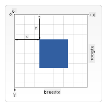

<!--
CO_OP_TRANSLATOR_METADATA:
{
  "original_hash": "41be8d35e7f30aa9dad10773c35e89c4",
  "translation_date": "2025-08-27T20:24:58+00:00",
  "source_file": "6-space-game/2-drawing-to-canvas/README.md",
  "language_code": "nl"
}
-->
# Bouw een Ruimtespel Deel 2: Teken Held en Monsters op Canvas

## Pre-Lecture Quiz

[Pre-lecture quiz](https://ashy-river-0debb7803.1.azurestaticapps.net/quiz/31)

## Het Canvas

Het canvas is een HTML-element dat standaard geen inhoud heeft; het is een leeg vlak. Je moet er zelf op tekenen om er iets aan toe te voegen.

✅ Lees [meer over de Canvas API](https://developer.mozilla.org/docs/Web/API/Canvas_API) op MDN.

Hier is hoe het meestal wordt gedeclareerd, als onderdeel van de body van de pagina:

```html
<canvas id="myCanvas" width="200" height="100"></canvas>
```

Hierboven stellen we de `id`, `width` en `height` in.

- `id`: stel dit in zodat je er een referentie naar kunt verkrijgen wanneer je ermee wilt werken.
- `width`: dit is de breedte van het element.
- `height`: dit is de hoogte van het element.

## Eenvoudige geometrie tekenen

Het canvas gebruikt een cartesiaans coördinatensysteem om dingen te tekenen. Het gebruikt dus een x-as en y-as om uit te drukken waar iets zich bevindt. De locatie `0,0` is de positie linksboven en rechtsonder is wat je hebt ingesteld als de BREEDTE en HOOGTE van het canvas.

  
> Afbeelding van [MDN](https://developer.mozilla.org/docs/Web/API/Canvas_API/Tutorial/Drawing_shapes)

Om op het canvas-element te tekenen, moet je de volgende stappen doorlopen:

1. **Verkrijg een referentie** naar het Canvas-element.  
2. **Verkrijg een referentie** naar het Context-element dat op het canvas-element zit.  
3. **Voer een tekenoperatie uit** met behulp van het context-element.  

De code voor bovenstaande stappen ziet er meestal zo uit:

```javascript
// draws a red rectangle
//1. get the canvas reference
canvas = document.getElementById("myCanvas");

//2. set the context to 2D to draw basic shapes
ctx = canvas.getContext("2d");

//3. fill it with the color red
ctx.fillStyle = 'red';

//4. and draw a rectangle with these parameters, setting location and size
ctx.fillRect(0,0, 200, 200) // x,y,width, height
```

✅ De Canvas API richt zich voornamelijk op 2D-vormen, maar je kunt ook 3D-elementen tekenen op een website; hiervoor kun je de [WebGL API](https://developer.mozilla.org/docs/Web/API/WebGL_API) gebruiken.

Je kunt allerlei dingen tekenen met de Canvas API, zoals:

- **Geometrische vormen**, we hebben al laten zien hoe je een rechthoek tekent, maar er is nog veel meer dat je kunt tekenen.  
- **Tekst**, je kunt tekst tekenen met elk gewenst lettertype en kleur.  
- **Afbeeldingen**, je kunt een afbeelding tekenen op basis van een afbeeldingsbestand zoals een .jpg of .png.  

✅ Probeer het! Je weet hoe je een rechthoek tekent, kun je een cirkel tekenen op een pagina? Bekijk enkele interessante Canvas-tekeningen op CodePen. Hier is een [bijzonder indrukwekkend voorbeeld](https://codepen.io/dissimulate/pen/KrAwx).

## Een afbeeldingsbestand laden en tekenen

Je laadt een afbeeldingsbestand door een `Image`-object te maken en de `src`-eigenschap in te stellen. Vervolgens luister je naar het `load`-event om te weten wanneer het klaar is om te worden gebruikt. De code ziet er als volgt uit:

### Bestand laden

```javascript
const img = new Image();
img.src = 'path/to/my/image.png';
img.onload = () => {
  // image loaded and ready to be used
}
```

### Laadpatroon voor bestanden

Het wordt aanbevolen om het bovenstaande in een construct zoals deze te verpakken, zodat het gemakkelijker te gebruiken is en je alleen probeert het te manipuleren wanneer het volledig is geladen:

```javascript
function loadAsset(path) {
  return new Promise((resolve) => {
    const img = new Image();
    img.src = path;
    img.onload = () => {
      // image loaded and ready to be used
      resolve(img);
    }
  })
}

// use like so

async function run() {
  const heroImg = await loadAsset('hero.png')
  const monsterImg = await loadAsset('monster.png')
}

```

Om spelassets op een scherm te tekenen, zou je code er als volgt uitzien:

```javascript
async function run() {
  const heroImg = await loadAsset('hero.png')
  const monsterImg = await loadAsset('monster.png')

  canvas = document.getElementById("myCanvas");
  ctx = canvas.getContext("2d");
  ctx.drawImage(heroImg, canvas.width/2,canvas.height/2);
  ctx.drawImage(monsterImg, 0,0);
}
```

## Nu is het tijd om je spel te gaan bouwen

### Wat te bouwen

Je gaat een webpagina bouwen met een Canvas-element. Het moet een zwart scherm renderen van `1024*768`. We hebben je twee afbeeldingen gegeven:

- Heldenschip  

   

- 5*5 monster  

   

### Aanbevolen stappen om te beginnen met ontwikkelen

Vind de bestanden die voor je zijn aangemaakt in de submap `your-work`. Het zou het volgende moeten bevatten:

```bash
-| assets
  -| enemyShip.png
  -| player.png
-| index.html
-| app.js
-| package.json
```

Open een kopie van deze map in Visual Studio Code. Je moet een lokale ontwikkelomgeving hebben ingesteld, bij voorkeur met Visual Studio Code met NPM en Node geïnstalleerd. Als je `npm` niet hebt ingesteld op je computer, [hier is hoe je dat doet](https://www.npmjs.com/get-npm).

Start je project door naar de map `your_work` te navigeren:

```bash
cd your-work
npm start
```

Hiermee wordt een HTTP-server gestart op het adres `http://localhost:5000`. Open een browser en voer dat adres in. Het is nu een lege pagina, maar dat zal veranderen.

> Opmerking: om wijzigingen op je scherm te zien, vernieuw je je browser.

### Code toevoegen

Voeg de benodigde code toe aan `your-work/app.js` om het onderstaande op te lossen:

1. **Teken** een canvas met zwarte achtergrond  
   > tip: voeg twee regels toe onder de juiste TODO in `/app.js`, waarbij je het `ctx`-element instelt op zwart en de boven/links-coördinaten op 0,0 en de hoogte en breedte gelijk aan die van het canvas.  
2. **Laad** texturen  
   > tip: voeg de speler- en vijandafbeeldingen toe met behulp van `await loadTexture` en geef het afbeeldingspad door. Je ziet ze nog niet op het scherm!  
3. **Teken** de held in het midden van het scherm in de onderste helft  
   > tip: gebruik de `drawImage` API om heroImg op het scherm te tekenen, waarbij je `canvas.width / 2 - 45` en `canvas.height - canvas.height / 4)` instelt.  
4. **Teken** 5*5 monsters  
   > tip: Nu kun je de code om vijanden op het scherm te tekenen deblokkeren. Ga vervolgens naar de functie `createEnemies` en bouw deze uit.  

   Stel eerst enkele constanten in:

    ```javascript
    const MONSTER_TOTAL = 5;
    const MONSTER_WIDTH = MONSTER_TOTAL * 98;
    const START_X = (canvas.width - MONSTER_WIDTH) / 2;
    const STOP_X = START_X + MONSTER_WIDTH;
    ```

    Maak vervolgens een lus om de array van monsters op het scherm te tekenen:

    ```javascript
    for (let x = START_X; x < STOP_X; x += 98) {
        for (let y = 0; y < 50 * 5; y += 50) {
          ctx.drawImage(enemyImg, x, y);
        }
      }
    ```

## Resultaat

Het eindresultaat zou er als volgt uit moeten zien:


## Oplossing

Probeer het eerst zelf op te lossen, maar als je vastloopt, bekijk dan een [oplossing](../../../../6-space-game/2-drawing-to-canvas/solution/app.js).

---

## 🚀 Uitdaging

Je hebt geleerd over tekenen met de 2D-georiënteerde Canvas API; bekijk de [WebGL API](https://developer.mozilla.org/docs/Web/API/WebGL_API) en probeer een 3D-object te tekenen.

## Post-Lecture Quiz

[Post-lecture quiz](https://ashy-river-0debb7803.1.azurestaticapps.net/quiz/32)

## Review & Zelfstudie

Leer meer over de Canvas API door [erover te lezen](https://developer.mozilla.org/docs/Web/API/Canvas_API).

## Opdracht

[Speel met de Canvas API](assignment.md)

---

**Disclaimer**:  
Dit document is vertaald met behulp van de AI-vertalingsservice [Co-op Translator](https://github.com/Azure/co-op-translator). Hoewel we streven naar nauwkeurigheid, dient u zich ervan bewust te zijn dat geautomatiseerde vertalingen fouten of onnauwkeurigheden kunnen bevatten. Het originele document in de oorspronkelijke taal moet worden beschouwd als de gezaghebbende bron. Voor cruciale informatie wordt professionele menselijke vertaling aanbevolen. Wij zijn niet aansprakelijk voor misverstanden of verkeerde interpretaties die voortvloeien uit het gebruik van deze vertaling.