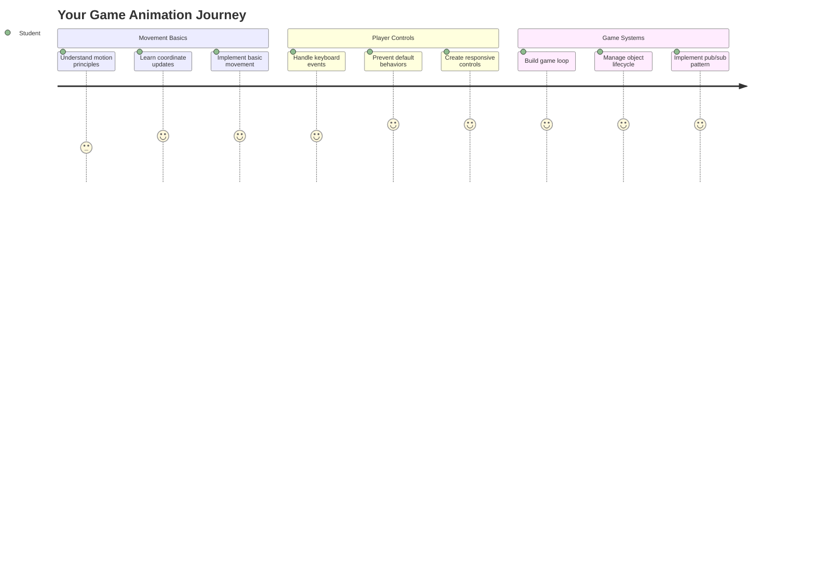
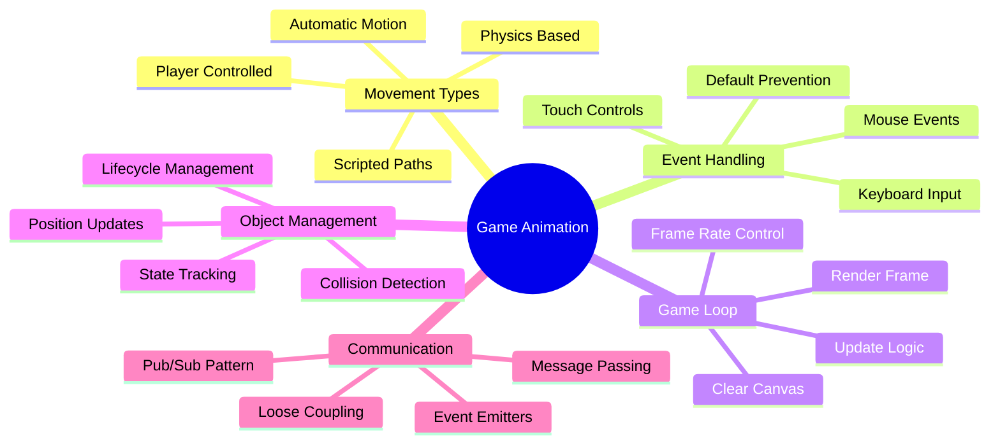
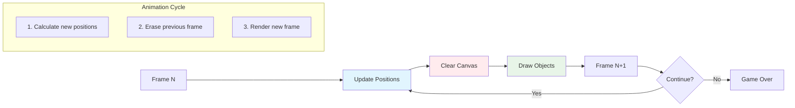
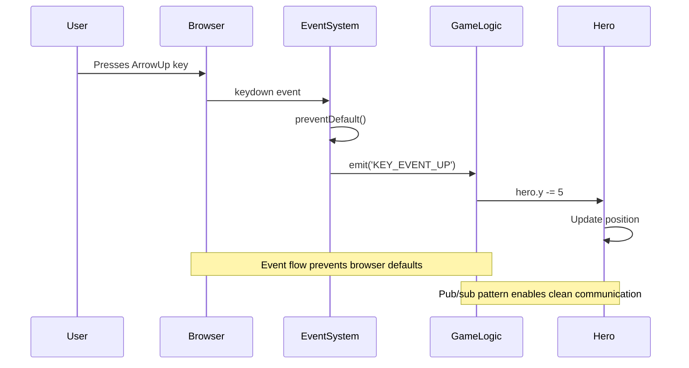
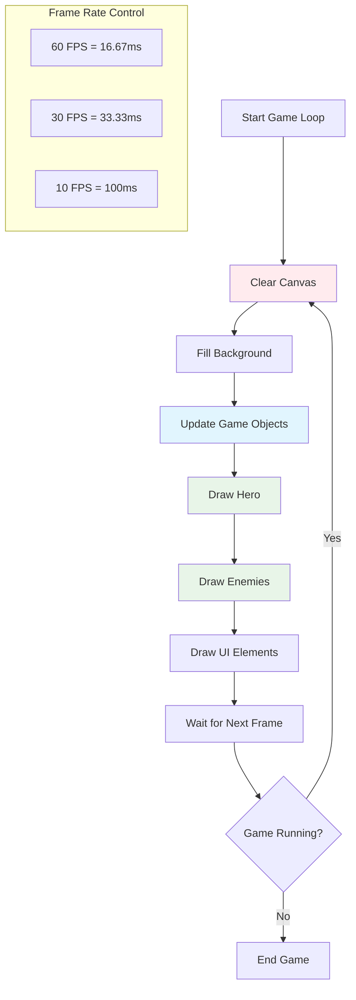
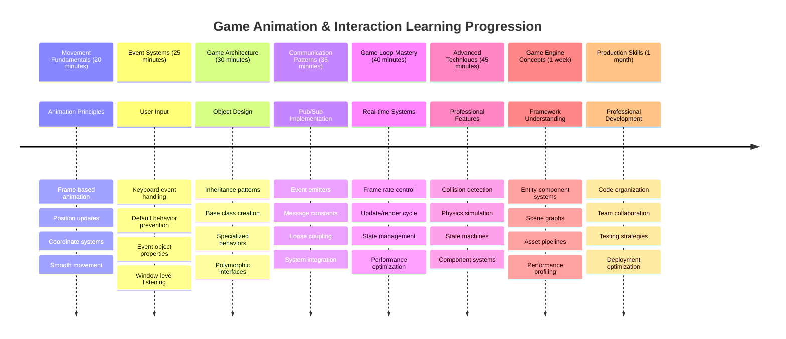

<!--
CO_OP_TRANSLATOR_METADATA:
{
  "original_hash": "8c55a2bd4bc0ebe4c88198fd563a9e09",
  "translation_date": "2025-11-04T02:04:02+00:00",
  "source_file": "6-space-game/3-moving-elements-around/README.md",
  "language_code": "nl"
}
-->
# Bouw een Ruimtespel Deel 3: Beweging Toevoegen



Denk aan je favoriete games – wat ze boeiend maakt, is niet alleen de mooie graphics, maar ook hoe alles beweegt en reageert op jouw acties. Op dit moment is je ruimtespel als een prachtig schilderij, maar we gaan beweging toevoegen om het tot leven te brengen.

Toen NASA-ingenieurs de stuurcomputer voor de Apollo-missies programmeerden, stonden ze voor een vergelijkbare uitdaging: hoe zorg je ervoor dat een ruimtevaartuig reageert op pilootinvoer terwijl het automatisch koerscorrecties uitvoert? De principes die we vandaag leren, weerspiegelen diezelfde concepten – het beheren van door spelers gecontroleerde bewegingen naast automatische systeemgedragingen.

In deze les leer je hoe je ruimteschepen soepel over het scherm laat glijden, laat reageren op spelerscommando's en vloeiende bewegingspatronen creëert. We splitsen alles op in beheersbare concepten die logisch op elkaar voortbouwen.

Aan het einde kunnen spelers hun heldenschip over het scherm laten vliegen terwijl vijandelijke schepen boven hun hoofd patrouilleren. Nog belangrijker, je begrijpt de kernprincipes die bewegingssystemen in games aandrijven.



## Pre-Lecture Quiz

[Pre-lecture quiz](https://ff-quizzes.netlify.app/web/quiz/33)

## Beweging in Games Begrijpen

Games komen tot leven wanneer dingen beginnen te bewegen, en er zijn fundamenteel twee manieren waarop dit gebeurt:

- **Door spelers gecontroleerde beweging**: Wanneer je een toets indrukt of met je muis klikt, beweegt er iets. Dit is de directe verbinding tussen jou en de gamewereld.
- **Automatische beweging**: Wanneer de game zelf besluit dingen te bewegen – zoals die vijandelijke schepen die over het scherm moeten patrouilleren, ongeacht wat jij doet.

Objecten op een computerscherm laten bewegen is eenvoudiger dan je denkt. Herinner je die x- en y-coördinaten uit de wiskundeles? Dat is precies waar we hier mee werken. Toen Galileo in 1610 de manen van Jupiter volgde, deed hij in wezen hetzelfde – posities over tijd plotten om bewegingspatronen te begrijpen.

Dingen op het scherm bewegen is als het maken van een flipboekanimatie – je moet deze drie eenvoudige stappen volgen:



1. **Update de positie** – Verander waar je object moet zijn (bijvoorbeeld 5 pixels naar rechts bewegen)
2. **Wis het oude frame** – Maak het scherm leeg zodat je geen spookachtige sporen ziet
3. **Teken het nieuwe frame** – Plaats je object op zijn nieuwe plek

Doe dit snel genoeg, en voilà! Je hebt vloeiende beweging die natuurlijk aanvoelt voor spelers.

Zo kan het eruitzien in code:

```javascript
// Set the hero's location
hero.x += 5;
// Clear the rectangle that hosts the hero
ctx.clearRect(0, 0, canvas.width, canvas.height);
// Redraw the game background and hero
ctx.fillRect(0, 0, canvas.width, canvas.height);
ctx.fillStyle = "black";
ctx.drawImage(heroImg, hero.x, hero.y);
```

**Wat deze code doet:**
- **Update** de x-coördinaat van de held met 5 pixels om horizontaal te bewegen
- **Wist** het hele canvasgebied om het vorige frame te verwijderen
- **Vult** het canvas met een zwarte achtergrondkleur
- **Tekent** de afbeelding van de held op zijn nieuwe positie

✅ Kun je een reden bedenken waarom het herhaaldelijk opnieuw tekenen van je held meerdere frames per seconde prestatiekosten kan veroorzaken? Lees meer over [alternatieven voor dit patroon](https://developer.mozilla.org/en-US/docs/Web/API/Canvas_API/Tutorial/Optimizing_canvas).

## Toetsenbordgebeurtenissen afhandelen

Hier verbinden we spelersinvoer met acties in de game. Wanneer iemand op de spatiebalk drukt om een laser af te vuren of een pijltoets indrukt om een asteroïde te ontwijken, moet je game die invoer detecteren en erop reageren.

Toetsenbordgebeurtenissen vinden plaats op het niveau van het venster, wat betekent dat je hele browservenster luistert naar die toetsaanslagen. Muisclicks daarentegen kunnen worden gekoppeld aan specifieke elementen (zoals het klikken op een knop). Voor ons ruimtespel richten we ons op toetsenbordbediening, omdat dat spelers dat klassieke arcadegevoel geeft.

Dit doet me denken aan hoe telegraafoperators in de 19e eeuw morsecode-invoer moesten vertalen naar betekenisvolle berichten – we doen iets soortgelijks, toetsaanslagen vertalen naar gamecommando's.

Om een gebeurtenis af te handelen, moet je de `addEventListener()`-methode van het venster gebruiken en deze voorzien van twee invoerparameters. De eerste parameter is de naam van de gebeurtenis, bijvoorbeeld `keyup`. De tweede parameter is de functie die moet worden uitgevoerd als gevolg van de gebeurtenis.

Hier is een voorbeeld:

```javascript
window.addEventListener('keyup', (evt) => {
  // evt.key = string representation of the key
  if (evt.key === 'ArrowUp') {
    // do something
  }
});
```

**Wat hier gebeurt:**
- **Luistert** naar toetsenbordgebeurtenissen op het hele venster
- **Vangt** het gebeurtenisobject dat informatie bevat over welke toets is ingedrukt
- **Controleert** of de ingedrukte toets overeenkomt met een specifieke toets (in dit geval de pijl omhoog)
- **Voert** code uit wanneer aan de voorwaarde wordt voldaan

Voor toetsgebeurtenissen zijn er twee eigenschappen op het gebeurtenisobject die je kunt gebruiken om te zien welke toets is ingedrukt:

- `key` - dit is een stringrepresentatie van de ingedrukte toets, bijvoorbeeld `'ArrowUp'`
- `keyCode` - dit is een numerieke representatie, bijvoorbeeld `37`, wat overeenkomt met `ArrowLeft`

✅ Manipulatie van toetsgebeurtenissen is nuttig buiten gameontwikkeling. Kun je andere toepassingen bedenken voor deze techniek?



### Speciale toetsen: een waarschuwing!

Sommige toetsen hebben ingebouwde browsergedragingen die je game kunnen verstoren. Pijltoetsen scrollen de pagina en de spatiebalk springt naar beneden – gedragingen die je niet wilt wanneer iemand probeert zijn ruimteschip te besturen.

We kunnen deze standaardgedragingen voorkomen en onze game de invoer laten afhandelen. Dit is vergelijkbaar met hoe vroege computerprogrammeurs systeemonderbrekingen moesten overschrijven om aangepaste gedragingen te creëren – we doen dit alleen op browserniveau. Zo werkt het:

```javascript
const onKeyDown = function (e) {
  console.log(e.keyCode);
  switch (e.keyCode) {
    case 37:
    case 39:
    case 38:
    case 40: // Arrow keys
    case 32:
      e.preventDefault();
      break; // Space
    default:
      break; // do not block other keys
  }
};

window.addEventListener('keydown', onKeyDown);
```

**Wat deze preventiecode doet:**
- **Controleert** op specifieke toetscodes die ongewenst browsergedrag kunnen veroorzaken
- **Voorkomt** de standaard browseractie voor pijltoetsen en spatiebalk
- **Laat** andere toetsen normaal functioneren
- **Gebruikt** `e.preventDefault()` om het ingebouwde gedrag van de browser te stoppen

### 🔄 **Pedagogische Check-in**
**Begrip van gebeurtenisafhandeling**: Voordat je doorgaat naar automatische beweging, zorg ervoor dat je:
- ✅ Het verschil kunt uitleggen tussen `keydown` en `keyup` gebeurtenissen
- ✅ Begrijpt waarom we standaard browsergedragingen voorkomen
- ✅ Kunt beschrijven hoe gebeurtenislisteners gebruikersinvoer verbinden met gamelogica
- ✅ Kunt identificeren welke toetsen mogelijk interfereren met gamebediening

**Snelle zelftest**: Wat zou er gebeuren als je het standaardgedrag voor pijltoetsen niet voorkomt?
*Antwoord: De browser zou de pagina scrollen, wat de beweging in de game verstoort*

**Architectuur van het gebeurtenissysteem**: Je begrijpt nu:
- **Luisteren op vensterniveau**: Gebeurtenissen vastleggen op browserniveau
- **Eigenschappen van het gebeurtenisobject**: `key` strings versus `keyCode` nummers
- **Voorkomen van standaardgedrag**: Ongewenste browsergedragingen stoppen
- **Conditionele logica**: Reageren op specifieke toetscombinaties

## Door de game geïnduceerde beweging

Laten we nu praten over objecten die bewegen zonder spelersinvoer. Denk aan vijandelijke schepen die over het scherm cruisen, kogels die in rechte lijnen vliegen, of wolken die op de achtergrond drijven. Deze autonome beweging maakt je gamewereld levendig, zelfs wanneer niemand de bediening aanraakt.

We gebruiken de ingebouwde timers van JavaScript om posities op regelmatige intervallen bij te werken. Dit concept is vergelijkbaar met hoe slingerklokken werken – een regelmatig mechanisme dat consistente, getimede acties triggert. Zo eenvoudig kan het zijn:

```javascript
const id = setInterval(() => {
  // Move the enemy on the y axis
  enemy.y += 10;
}, 100);
```

**Wat deze bewegingscode doet:**
- **Creëert** een timer die elke 100 milliseconden draait
- **Update** de y-coördinaat van de vijand met 10 pixels elke keer
- **Slaat** het interval-ID op zodat we het later kunnen stoppen indien nodig
- **Beweegt** de vijand automatisch naar beneden op het scherm

## De gameloop

Hier is het concept dat alles samenbrengt – de gameloop. Als je game een film was, zou de gameloop de filmprojector zijn, die frame na frame laat zien, zo snel dat alles soepel lijkt te bewegen.

Elke game heeft een van deze loops die op de achtergrond draait. Het is een functie die alle gameobjecten bijwerkt, het scherm opnieuw tekent en dit proces continu herhaalt. Dit houdt je held, alle vijanden, eventuele lasers die rondvliegen – de hele gamestatus bij.

Dit concept doet me denken aan hoe vroege filmanimators zoals Walt Disney personages frame voor frame moesten tekenen om de illusie van beweging te creëren. Wij doen hetzelfde, alleen met code in plaats van potloden.

Zo kan een gameloop er in code uitzien:



```javascript
const gameLoopId = setInterval(() => {
  function gameLoop() {
    ctx.clearRect(0, 0, canvas.width, canvas.height);
    ctx.fillStyle = "black";
    ctx.fillRect(0, 0, canvas.width, canvas.height);
    drawHero();
    drawEnemies();
    drawStaticObjects();
  }
  gameLoop();
}, 200);
```

**Begrip van de structuur van de gameloop:**
- **Wist** het hele canvas om het vorige frame te verwijderen
- **Vult** de achtergrond met een effen kleur
- **Tekent** alle gameobjecten op hun huidige posities
- **Herhaalt** dit proces elke 200 milliseconden om vloeiende animatie te creëren
- **Beheert** de framerate door de intervaltijd te regelen

## Verder met het Ruimtespel

Nu gaan we beweging toevoegen aan de statische scène die je eerder hebt gebouwd. We gaan het transformeren van een screenshot naar een interactieve ervaring. We werken dit stap voor stap uit om ervoor te zorgen dat elk onderdeel voortbouwt op het vorige.

Pak de code van waar we in de vorige les zijn gebleven (of begin met de code in de [Part II- starter](../../../../6-space-game/3-moving-elements-around/your-work) map als je een frisse start nodig hebt).

**Wat we vandaag gaan bouwen:**
- **Heldbediening**: Pijltoetsen zullen je ruimteschip over het scherm sturen
- **Vijandelijke beweging**: Die buitenaardse schepen zullen hun aanval beginnen

Laten we beginnen met het implementeren van deze functies.

## Aanbevolen stappen

Vind de bestanden die voor je zijn aangemaakt in de `your-work` submap. Het zou het volgende moeten bevatten:

```bash
-| assets
  -| enemyShip.png
  -| player.png
-| index.html
-| app.js
-| package.json
```

Je start je project in de `your-work` map door te typen:

```bash
cd your-work
npm start
```

**Wat dit commando doet:**
- **Navigeert** naar je projectmap
- **Start** een HTTP-server op adres `http://localhost:5000`
- **Serveert** je gamebestanden zodat je ze in een browser kunt testen

Het bovenstaande start een HTTP-server op adres `http://localhost:5000`. Open een browser en voer dat adres in, op dit moment zou het de held en alle vijanden moeten weergeven; niets beweegt – nog niet!

### Code toevoegen

1. **Voeg toegewijde objecten toe** voor `hero`, `enemy` en `game object`, ze moeten `x` en `y` eigenschappen hebben. (Herinner je het gedeelte over [Inheritance or composition](../README.md)).

   *TIP* `game object` moet degene zijn met `x` en `y` en de mogelijkheid om zichzelf op een canvas te tekenen.

   > **Tip**: Begin met het toevoegen van een nieuwe `GameObject` klasse met zijn constructor zoals hieronder beschreven, en teken het vervolgens op het canvas:

    ```javascript
    class GameObject {
      constructor(x, y) {
        this.x = x;
        this.y = y;
        this.dead = false;
        this.type = "";
        this.width = 0;
        this.height = 0;
        this.img = undefined;
      }
    
      draw(ctx) {
        ctx.drawImage(this.img, this.x, this.y, this.width, this.height);
      }
    }
    ```

    **Begrip van deze basisklasse:**
    - **Definieert** gemeenschappelijke eigenschappen die alle gameobjecten delen (positie, grootte, afbeelding)
    - **Bevat** een `dead` vlag om bij te houden of het object moet worden verwijderd
    - **Biedt** een `draw()` methode die het object op het canvas weergeeft
    - **Stelt** standaardwaarden in voor alle eigenschappen die kindklassen kunnen overschrijven

    ```mermaid
    classDiagram
        class GameObject {
            +x: number
            +y: number
            +dead: boolean
            +type: string
            +width: number
            +height: number
            +img: Image
            +draw(ctx)
        }
        
        class Hero {
            +speed: number
            +type: "Hero"
            +width: 98
            +height: 75
        }
        
        class Enemy {
            +type: "Enemy"
            +width: 98
            +height: 50
            +setInterval()
        }
        
        GameObject <|-- Hero
        GameObject <|-- Enemy
        
        class EventEmitter {
            +listeners: object
            +on(message, listener)
            +emit(message, payload)
        }
    ```

    Breid nu deze `GameObject` uit om de `Hero` en `Enemy` te maken:
    
    ```javascript
    class Hero extends GameObject {
      constructor(x, y) {
        super(x, y);
        this.width = 98;
        this.height = 75;
        this.type = "Hero";
        this.speed = 5;
      }
    }
    ```

    ```javascript
    class Enemy extends GameObject {
      constructor(x, y) {
        super(x, y);
        this.width = 98;
        this.height = 50;
        this.type = "Enemy";
        const id = setInterval(() => {
          if (this.y < canvas.height - this.height) {
            this.y += 5;
          } else {
            console.log('Stopped at', this.y);
            clearInterval(id);
          }
        }, 300);
      }
    }
    ```

    **Belangrijke concepten in deze klassen:**
    - **Erft** van `GameObject` met behulp van het `extends` sleutelwoord
    - **Roept** de ouderconstructor aan met `super(x, y)`
    - **Stelt** specifieke afmetingen en eigenschappen in voor elk type object
    - **Implementeert** automatische beweging voor vijanden met behulp van `setInterval()`

2. **Voeg toetsgebeurtenis-handlers toe** om toetsnavigatie af te handelen (beweeg de held omhoog/omlaag links/rechts)

   *ONTHOUD* het is een cartesiaans systeem, linksboven is `0,0`. Vergeet ook niet code toe te voegen om *standaardgedrag* te stoppen.

   > **Tip**: Maak je `onKeyDown` functie en koppel deze aan het venster:

   ```javascript
   const onKeyDown = function (e) {
     console.log(e.keyCode);
     // Add the code from the lesson above to stop default behavior
     switch (e.keyCode) {
       case 37:
       case 39:
       case 38:
       case 40: // Arrow keys
       case 32:
         e.preventDefault();
         break; // Space
       default:
         break; // do not block other keys
     }
   };

   window.addEventListener("keydown", onKeyDown);
   ```
    
   **Wat deze gebeurtenishandler doet:**
   - **Luistert** naar keydown-gebeurtenissen op het hele venster
   - **Logt** de toetscode om je te helpen debuggen welke toetsen worden ingedrukt
   - **Voorkomt** standaard browsergedrag voor pijltoetsen en spatiebalk
   - **Laat** andere toetsen normaal functioneren
   
   Controleer op dit punt je browserconsole en bekijk de geregistreerde toetsaanslagen. 

3. **Implementeer** het [Pub sub pattern](../README.md), dit houdt je code schoon terwijl je de resterende delen volgt.

   Het Publish-Subscribe patroon helpt je code te organiseren door gebeurtenisdetectie te scheiden van gebeurtenisafhandeling. Dit maakt je code meer modulair en gemakkelijker te onderhouden.

   Om dit laatste deel te doen, kun je:

   1. **Voeg een gebeurtenislistener toe** aan het venster:

       ```javascript
       window.addEventListener("keyup", (evt) => {
         if (evt.key === "ArrowUp") {
           eventEmitter.emit(Messages.KEY_EVENT_UP);
         } else if (evt.key === "ArrowDown") {
           eventEmitter.emit(Messages.KEY_EVENT_DOWN);
         } else if (evt.key === "ArrowLeft") {
           eventEmitter.emit(Messages.KEY_EVENT_LEFT);
         } else if (evt.key === "ArrowRight") {
           eventEmitter.emit(Messages.KEY_EVENT_RIGHT);
         }
       });
       ```

   **Wat dit gebeurtenissysteem doet:**
   - **Detecteert** toetsenbordinvoer en zet dit om in aangepaste gamegebeurtenissen
   - **Scheidt** invoerdetectie van gamelogica
   - **Maakt** het gemakkelijk om later bedieningselementen te wijzigen zonder de gamecode te beïnvloeden
   - **Staat toe** dat meerdere systemen reageren op dezelfde invoer

   ```mermaid
   flowchart TD
       A["Keyboard Input"] --> B["Window Event Listener"]
       B --> C["Event Emitter"]
       C --> D["KEY_EVENT_UP"]
       C --> E["KEY_EVENT_DOWN"]
       C --> F["KEY_EVENT_LEFT"]
       C --> G["KEY_EVENT_RIGHT"]
       
       D --> H["Hero Movement"]
       D --> I["Sound System"]
       D --> J["Visual Effects"]
       
       E --> H
       F --> H
       G --> H
       
       style A fill:#e1f5fe
       style C fill:#e8f5e8
       style H fill:#fff3e0
   ```

   2. **Maak een EventEmitter klasse** om berichten te publiceren en erop te abonneren:

       ```javascript
       class EventEmitter {
         constructor() {
           this.listeners = {};
         }
       
         on(message, listener) {
           if (!this.listeners[message]) {
             this.listeners[message] = [];
           }
           this.listeners[message].push(listener);
         }
       
   3. **Voeg constanten toe** en stel de EventEmitter in:

       ```javascript
       const Messages = {
         KEY_EVENT_UP: "KEY_EVENT_UP",
         KEY_EVENT_DOWN: "KEY_EVENT_DOWN",
         KEY_EVENT_LEFT: "KEY_EVENT_LEFT",
         KEY_EVENT_RIGHT: "KEY_EVENT_RIGHT",
       };
       
       let heroImg, 
           enemyImg, 
           laserImg,
           canvas, ctx, 
           gameObjects = [], 
           hero, 
           eventEmitter = new EventEmitter();
       ```

   **Begrip van de setup:**
   - **Definieert** berichtconstanten om typfouten te vermijden en refactoring te vergemakkelijken
   - **Declareert** variabelen voor afbeeldingen, canvascontext en gamestatus
   - **Creëert** een globale event emitter voor het pub-sub systeem
   - **Initialiseert** een array om alle game-objecten op te slaan

   4. **Initialiseer het spel**

       ```javascript
       function initGame() {
         gameObjects = [];
         createEnemies();
         createHero();
       
         eventEmitter.on(Messages.KEY_EVENT_UP, () => {
           hero.y -= 5;
         });
       
         eventEmitter.on(Messages.KEY_EVENT_DOWN, () => {
           hero.y += 5;
         });
       
         eventEmitter.on(Messages.KEY_EVENT_LEFT, () => {
           hero.x -= 5;
         });
       
4. **Stel de game loop in**

   Herstructureer de `window.onload` functie om het spel te initialiseren en een game loop op een goed interval in te stellen. Je voegt ook een laserstraal toe:

    ```javascript
    window.onload = async () => {
      canvas = document.getElementById("canvas");
      ctx = canvas.getContext("2d");
      heroImg = await loadTexture("assets/player.png");
      enemyImg = await loadTexture("assets/enemyShip.png");
      laserImg = await loadTexture("assets/laserRed.png");
    
      initGame();
      const gameLoopId = setInterval(() => {
        ctx.clearRect(0, 0, canvas.width, canvas.height);
        ctx.fillStyle = "black";
        ctx.fillRect(0, 0, canvas.width, canvas.height);
        drawGameObjects(ctx);
      }, 100);
    };
    ```

   **Begrijpen van de game setup:**
   - **Wacht** tot de pagina volledig is geladen voordat het spel start
   - **Haalt** het canvas-element en de 2D-rendering context op
   - **Laadt** alle afbeeldingsassets asynchroon met behulp van `await`
   - **Start** de game loop met intervallen van 100ms (10 FPS)
   - **Leegt** en tekent het hele scherm opnieuw bij elke frame

5. **Voeg code toe** om vijanden op een bepaald interval te laten bewegen

    Herstructureer de `createEnemies()` functie om de vijanden te creëren en ze toe te voegen aan de nieuwe gameObjects klasse:

    ```javascript
    function createEnemies() {
      const MONSTER_TOTAL = 5;
      const MONSTER_WIDTH = MONSTER_TOTAL * 98;
      const START_X = (canvas.width - MONSTER_WIDTH) / 2;
      const STOP_X = START_X + MONSTER_WIDTH;
    
      for (let x = START_X; x < STOP_X; x += 98) {
        for (let y = 0; y < 50 * 5; y += 50) {
          const enemy = new Enemy(x, y);
          enemy.img = enemyImg;
          gameObjects.push(enemy);
        }
      }
    }
    ```

    **Wat de vijandcreatie doet:**
    - **Bereken** posities om vijanden in het midden van het scherm te plaatsen
    - **Creëert** een raster van vijanden met behulp van geneste loops
    - **Wijst** de vijandafbeelding toe aan elk vijandobject
    - **Voegt** elke vijand toe aan de globale game-objecten array
    
    en voeg een `createHero()` functie toe om een soortgelijk proces voor de held uit te voeren.
    
    ```javascript
    function createHero() {
      hero = new Hero(
        canvas.width / 2 - 45,
        canvas.height - canvas.height / 4
      );
      hero.img = heroImg;
      gameObjects.push(hero);
    }
    ```

    **Wat de heldcreatie doet:**
    - **Positioneert** de held onderaan in het midden van het scherm
    - **Wijst** de heldafbeelding toe aan het heldobject
    - **Voegt** de held toe aan de game-objecten array voor rendering

    en tot slot, voeg een `drawGameObjects()` functie toe om te beginnen met tekenen:

    ```javascript
    function drawGameObjects(ctx) {
      gameObjects.forEach(go => go.draw(ctx));
    }
    ```

    **Begrijpen van de tekenfunctie:**
    - **Itereert** door alle game-objecten in de array
    - **Roept** de `draw()` methode aan op elk object
    - **Geeft** de canvas context door zodat objecten zichzelf kunnen renderen

    ### 🔄 **Pedagogische Check-in**
    **Volledig begrip van het gamesysteem**: Controleer je beheersing van de hele architectuur:
    - ✅ Hoe maakt overerving het mogelijk dat Hero en Enemy gemeenschappelijke GameObject-eigenschappen delen?
    - ✅ Waarom maakt het pub/sub patroon je code beter onderhoudbaar?
    - ✅ Welke rol speelt de game loop bij het creëren van vloeiende animatie?
    - ✅ Hoe verbinden event listeners gebruikersinvoer met het gedrag van game-objecten?

    **Systeemintegratie**: Je spel demonstreert nu:
    - **Objectgeoriënteerd ontwerp**: Basisklassen met gespecialiseerde overerving
    - **Event-gedreven architectuur**: Pub/sub patroon voor losse koppeling
    - **Animatieframework**: Game loop met consistente frame-updates
    - **Invoerbeheer**: Toetsenbordgebeurtenissen met standaardpreventie
    - **Assetbeheer**: Afbeeldingsladen en sprite-rendering

    **Professionele patronen**: Je hebt geïmplementeerd:
    - **Scheiding van verantwoordelijkheden**: Invoer, logica en rendering gescheiden
    - **Polymorfisme**: Alle game-objecten delen een gemeenschappelijke tekeninterface
    - **Berichtpassing**: Schone communicatie tussen componenten
    - **Resourcebeheer**: Efficiënt sprite- en animatiebeheer

    Je vijanden zouden nu moeten beginnen met het aanvallen van je heldenruimteschip!
      }
    }
    ```
    
    and add a `createHero()` function to do a similar process for the hero.
    
    ```javascript
    function createHero() {
      hero = new Hero(
        canvas.width / 2 - 45,
        canvas.height - canvas.height / 4
      );
      hero.img = heroImg;
      gameObjects.push(hero);
    }
    ```

    en tot slot, voeg een `drawGameObjects()` functie toe om te beginnen met tekenen:

    ```javascript
    function drawGameObjects(ctx) {
      gameObjects.forEach(go => go.draw(ctx));
    }
    ```

    Je vijanden zouden nu moeten beginnen met het aanvallen van je heldenruimteschip!

---

## GitHub Copilot Agent Challenge 🚀

Hier is een uitdaging die de afwerking van je spel zal verbeteren: het toevoegen van grenzen en vloeiende besturing. Op dit moment kan je held van het scherm vliegen en voelt de beweging misschien schokkerig aan.

**Jouw missie:** Laat je ruimteschip realistischer aanvoelen door schermgrenzen en vloeiende beweging te implementeren. Dit lijkt op hoe NASA's vluchtcontrolesystemen voorkomen dat ruimtevaartuigen veilige operationele parameters overschrijden.

**Wat je moet bouwen:** Maak een systeem dat je heldenruimteschip op het scherm houdt en zorg dat de besturing soepel aanvoelt. Wanneer spelers een pijltjestoets ingedrukt houden, moet het schip continu glijden in plaats van in discrete stappen bewegen. Overweeg visuele feedback toe te voegen wanneer het schip de schermgrenzen bereikt – misschien een subtiel effect om de rand van het speelgebied aan te geven.

Meer informatie over [agent mode](https://code.visualstudio.com/blogs/2025/02/24/introducing-copilot-agent-mode) vind je hier.

## 🚀 Uitdaging

Codeorganisatie wordt steeds belangrijker naarmate projecten groeien. Je hebt misschien gemerkt dat je bestand vol raakt met functies, variabelen en klassen die allemaal door elkaar staan. Dit doet me denken aan hoe de ingenieurs die de Apollo-missie code organiseerden duidelijke, onderhoudbare systemen moesten creëren waar meerdere teams tegelijkertijd aan konden werken.

**Jouw missie:**
Denk als een softwarearchitect. Hoe zou je je code organiseren zodat je (of een teamgenoot) over zes maanden begrijpt wat er gebeurt? Zelfs als alles voorlopig in één bestand blijft, kun je een betere organisatie creëren:

- **Groeperen van gerelateerde functies** met duidelijke commentaarheaders
- **Scheiding van verantwoordelijkheden** - houd game-logica gescheiden van rendering
- **Consistente naamgeving** gebruiken voor variabelen en functies
- **Modules of namespaces maken** om verschillende aspecten van je spel te organiseren
- **Documentatie toevoegen** die het doel van elke hoofdsectie uitlegt

**Reflectievragen:**
- Welke delen van je code zijn het moeilijkst te begrijpen als je er later op terugkomt?
- Hoe kun je je code organiseren om het gemakkelijker te maken voor iemand anders om bij te dragen?
- Wat zou er gebeuren als je nieuwe functies zoals power-ups of verschillende soorten vijanden wilt toevoegen?

## Quiz na de les

[Quiz na de les](https://ff-quizzes.netlify.app/web/quiz/34)

## Review & Zelfstudie

We hebben alles vanaf nul opgebouwd, wat geweldig is om te leren, maar hier is een klein geheim – er zijn enkele geweldige JavaScript-frameworks die veel van het zware werk voor je kunnen doen. Zodra je je comfortabel voelt met de basis die we hebben behandeld, is het de moeite waard om [te ontdekken wat er beschikbaar is](https://github.com/collections/javascript-game-engines).

Zie frameworks als een goed gevulde gereedschapskist in plaats van elk gereedschap met de hand te maken. Ze kunnen veel van die uitdagingen op het gebied van codeorganisatie oplossen waar we het over hadden, en bieden bovendien functies die weken zouden kosten om zelf te bouwen.

**Dingen die de moeite waard zijn om te verkennen:**
- Hoe game-engines code organiseren – je zult versteld staan van de slimme patronen die ze gebruiken
- Prestatie-trucs om canvasgames soepel te laten draaien  
- Moderne JavaScript-functies die je code schoner en beter onderhoudbaar maken
- Verschillende benaderingen om game-objecten en hun relaties te beheren

## 🎯 Jouw tijdlijn voor meesterschap in game-animatie



### 🛠️ Samenvatting van je game-ontwikkelingsgereedschapskist

Na het voltooien van deze les, heb je nu beheerst:
- **Animatieprincipes**: Beweging op basis van frames en vloeiende overgangen
- **Event-gedreven programmeren**: Toetsenbordinvoerbeheer met correcte eventafhandeling
- **Objectgeoriënteerd ontwerp**: Overervingshiërarchieën en polymorfe interfaces
- **Communicatiepatronen**: Pub/sub architectuur voor onderhoudbare code
- **Game loop architectuur**: Real-time update- en rendercycli
- **Invoersystemen**: Gebruikerscontrole mapping met standaardgedragspreventie
- **Assetbeheer**: Sprite laden en efficiënte rendertechnieken

### ⚡ **Wat je in de komende 5 minuten kunt doen**
- [ ] Open de browserconsole en probeer `addEventListener('keydown', console.log)` om toetsenbordgebeurtenissen te zien
- [ ] Maak een eenvoudig div-element en beweeg het rond met pijltjestoetsen
- [ ] Experimenteer met `setInterval` om continue beweging te creëren
- [ ] Probeer standaardgedrag te voorkomen met `event.preventDefault()`

### 🎯 **Wat je in dit uur kunt bereiken**
- [ ] Voltooi de quiz na de les en begrijp event-gedreven programmeren
- [ ] Bouw het bewegende heldenruimteschip met volledige toetsenbordbesturing
- [ ] Implementeer vloeiende bewegingspatronen voor vijanden
- [ ] Voeg grenzen toe om te voorkomen dat game-objecten het scherm verlaten
- [ ] Maak basisbotsingsdetectie tussen game-objecten

### 📅 **Jouw weeklange animatiereis**
- [ ] Voltooi het volledige ruimtespel met gepolijste beweging en interacties
- [ ] Voeg geavanceerde bewegingspatronen toe zoals bochten, versnelling en fysica
- [ ] Implementeer vloeiende overgangen en easing functies
- [ ] Maak deeltjeseffecten en visuele feedbacksystemen
- [ ] Optimaliseer de gameprestaties voor vloeiende 60fps gameplay
- [ ] Voeg mobiele touch-besturing en responsief ontwerp toe

### 🌟 **Jouw maandlange interactieve ontwikkeling**
- [ ] Bouw complexe interactieve applicaties met geavanceerde animatiesystemen
- [ ] Leer animatielibraries zoals GSAP of maak je eigen animatie-engine
- [ ] Draag bij aan open source game-ontwikkeling en animatieprojecten
- [ ] Beheers prestatieoptimalisatie voor grafisch intensieve applicaties
- [ ] Maak educatieve content over game-ontwikkeling en animatie
- [ ] Bouw een portfolio met geavanceerde interactieve programmeervaardigheden

**Toepassingen in de echte wereld**: Je game-animatievaardigheden zijn direct toepasbaar op:
- **Interactieve webapplicaties**: Dynamische dashboards en real-time interfaces
- **Datavisualisatie**: Geanimeerde grafieken en interactieve graphics
- **Educatieve software**: Interactieve simulaties en leertools
- **Mobiele ontwikkeling**: Touch-gebaseerde games en gebarenbeheer
- **Desktopapplicaties**: Electron-apps met vloeiende animaties
- **Webanimaties**: CSS- en JavaScript-animatielibraries

**Verworven professionele vaardigheden**: Je kunt nu:
- **Architectuur ontwerpen** voor event-gedreven systemen die schaalbaar zijn
- **Vloeiende animaties implementeren** met wiskundige principes
- **Complexe interactiesystemen debuggen** met browserontwikkelaarstools
- **Gameprestaties optimaliseren** voor verschillende apparaten en browsers
- **Onderhoudbare code structuren ontwerpen** met bewezen patronen

**Beheerde game-ontwikkelingsconcepten**:
- **Frame rate management**: Begrip van FPS en tijdsbeheer
- **Invoerbeheer**: Cross-platform toetsenbord- en eventsystemen
- **Objectlevenscyclus**: Patronen voor creatie, update en vernietiging
- **Statussynchronisatie**: Consistente gamestatus tussen frames
- **Eventarchitectuur**: Losgekoppelde communicatie tussen gamesystemen

**Volgende niveau**: Je bent klaar om botsingsdetectie, scoresystemen, geluidseffecten toe te voegen of moderne game-frameworks zoals Phaser of Three.js te verkennen!

🌟 **Prestatie ontgrendeld**: Je hebt een compleet interactief gamesysteem gebouwd met professionele architectuurpatronen!

## Opdracht

[Commentaar op je code](assignment.md)

---

**Disclaimer**:  
Dit document is vertaald met behulp van de AI-vertalingsservice [Co-op Translator](https://github.com/Azure/co-op-translator). Hoewel we streven naar nauwkeurigheid, dient u zich ervan bewust te zijn dat geautomatiseerde vertalingen fouten of onnauwkeurigheden kunnen bevatten. Het originele document in de oorspronkelijke taal moet worden beschouwd als de gezaghebbende bron. Voor kritieke informatie wordt professionele menselijke vertaling aanbevolen. Wij zijn niet aansprakelijk voor misverstanden of verkeerde interpretaties die voortvloeien uit het gebruik van deze vertaling.