# Bouw een Ruimtespel Deel 4: Een Laser Toevoegen en Botsingen Detecteren


## Quiz voor de les

[Quiz voor de les](https://ff-quizzes.netlify.app/web/quiz/35)

Denk aan het moment in Star Wars toen Luke's protonentorpedo's de uitlaatpoort van de Death Star raakten. Die precieze botsingsdetectie veranderde het lot van de melkweg! In games werkt botsingsdetectie op dezelfde manier - het bepaalt wanneer objecten met elkaar interageren en wat er daarna gebeurt.

In deze les voeg je laserwapens toe aan je ruimtenspel en implementeer je botsingsdetectie. Net zoals NASA's missieplanners de trajecten van ruimtevaartuigen berekenen om puin te vermijden, leer je te detecteren wanneer spelobjecten elkaar kruisen. We splitsen dit op in beheersbare stappen die op elkaar voortbouwen.

Aan het einde heb je een werkend gevechtssysteem waarin lasers vijanden vernietigen en botsingen spelgebeurtenissen activeren. Dezezelfde botsingsprincipes worden gebruikt in alles, van fysicasimulaties tot interactieve webinterfaces.


✅ Doe wat onderzoek naar het allereerste computerspel ooit geschreven. Wat was de functionaliteit ervan?

## Botsingsdetectie

Botsingsdetectie werkt zoals de nabijheidssensoren op de Apollo maanmodule - het controleert constant afstanden en geeft waarschuwingen wanneer objecten te dicht bij elkaar komen. In games bepaalt dit systeem wanneer objecten met elkaar interageren en wat er daarna moet gebeuren.

De aanpak die we zullen gebruiken behandelt elk spelobject als een rechthoek, vergelijkbaar met hoe luchtverkeersleidingssystemen vereenvoudigde geometrische vormen gebruiken om vliegtuigen te volgen. Deze rechthoekige methode lijkt misschien eenvoudig, maar is computationeel efficiënt en werkt goed voor de meeste spelscenario's.

### Rechthoekrepresentatie

Elk spelobject heeft coördinaten nodig, vergelijkbaar met hoe de Mars Pathfinder rover zijn locatie op het Martiaanse oppervlak in kaart bracht. Hier is hoe we deze grenscoördinaten definiëren:

```mermaid
flowchart TD
    A["🎯 Game Object"] --> B["📍 Position (x, y)"]
    A --> C["📏 Dimensions (width, height)"]
    
    B --> D["Top: y"]
    B --> E["Left: x"]
    
    C --> F["Bottom: y + height"]
    C --> G["Right: x + width"]
    
    D --> H["🔲 Rectangle Bounds"]
    E --> H
    F --> H
    G --> H
    
    H --> I["Collision Detection Ready"]
    
    style A fill:#e3f2fd
    style H fill:#e8f5e8
    style I fill:#fff3e0
```



```javascript
rectFromGameObject() {
  return {
    top: this.y,
    left: this.x,
    bottom: this.y + this.height,
    right: this.x + this.width
  }
}
```

**Laten we dit opsplitsen:**
- **Bovenrand**: Dat is waar je object verticaal begint (zijn y-positie)
- **Linkerrand**: Waar het horizontaal begint (zijn x-positie)
- **Onderkant**: Tel de hoogte op bij de y-positie - nu weet je waar het eindigt!
- **Rechterrand**: Tel de breedte op bij de x-positie - en je hebt de volledige grens.

### Intersectie-algoritme

Het detecteren van rechthoekige intersecties gebruikt logica die vergelijkbaar is met hoe de Hubble Space Telescope bepaalt of hemellichamen elkaar overlappen in zijn gezichtsveld. Het algoritme controleert op scheiding:

```mermaid
flowchart LR
    A["Rectangle 1"] --> B{"Separation Tests"}
    C["Rectangle 2"] --> B
    
    B --> D["R2 left > R1 right?"]
    B --> E["R2 right < R1 left?"]
    B --> F["R2 top > R1 bottom?"]
    B --> G["R2 bottom < R1 top?"]
    
    D --> H{"Any True?"}
    E --> H
    F --> H
    G --> H
    
    H -->|Yes| I["❌ No Collision"]
    H -->|No| J["✅ Collision Detected"]
    
    style B fill:#e3f2fd
    style I fill:#ffebee
    style J fill:#e8f5e8
```



```javascript
function intersectRect(r1, r2) {
  return !(r2.left > r1.right ||
    r2.right < r1.left ||
    r2.top > r1.bottom ||
    r2.bottom < r1.top);
}
```

**De scheidingstest werkt zoals radarsystemen:**
- Ligt rechthoek 2 volledig rechts van rechthoek 1?
- Ligt rechthoek 2 volledig links van rechthoek 1?
- Ligt rechthoek 2 volledig onder rechthoek 1?
- Ligt rechthoek 2 volledig boven rechthoek 1?

Als geen van deze voorwaarden waar is, moeten de rechthoeken overlappen. Deze aanpak weerspiegelt hoe radaroperators bepalen of twee vliegtuigen op veilige afstand van elkaar zijn.

## Objectlevenscycli beheren

Wanneer een laser een vijand raakt, moeten beide objecten uit het spel worden verwijderd. Het direct verwijderen van objecten tijdens een loop kan echter crashes veroorzaken - een les die op de harde manier werd geleerd in vroege computersystemen zoals de Apollo Guidance Computer. In plaats daarvan gebruiken we een "markeren voor verwijdering"-aanpak die objecten veilig verwijdert tussen frames.


Hier is hoe we iets markeren voor verwijdering:

```javascript
// Mark object for removal
enemy.dead = true;
```

**Waarom deze aanpak werkt:**
- We markeren het object als "dood" maar verwijderen het niet meteen
- Dit laat het huidige spelframe veilig eindigen
- Geen crashes door het proberen te gebruiken van iets dat al weg is!

Filter vervolgens gemarkeerde objecten uit voordat de volgende rendercyclus begint:

```javascript
gameObjects = gameObjects.filter(go => !go.dead);
```

**Wat dit filteren doet:**
- Maakt een nieuwe lijst met alleen de "levende" objecten
- Verwijdert alles wat als dood is gemarkeerd
- Houdt je spel soepel draaiend
- Voorkomt geheugenproblemen door opgehoopte vernietigde objecten

## Lasermechanica implementeren

Laserprojectielen in games werken volgens hetzelfde principe als fotontorpedo's in Star Trek - het zijn discrete objecten die in rechte lijnen bewegen totdat ze iets raken. Elke keer dat je op de spatiebalk drukt, wordt er een nieuw laserobject gemaakt dat over het scherm beweegt.

Om dit te laten werken, moeten we een paar verschillende onderdelen coördineren:

**Belangrijke componenten om te implementeren:**
- **Creëer** laserobjecten die vanuit de positie van de held worden gegenereerd
- **Verwerk** toetsenbordinvoer om lasercreatie te activeren
- **Beheer** laserbeweging en levenscyclus
- **Implementeer** visuele weergave voor de laserprojectielen

## Vuursnelheid regelen

Onbeperkte vuursnelheden zouden de game-engine overweldigen en het spel te gemakkelijk maken. Echte wapensystemen hebben vergelijkbare beperkingen - zelfs de phasers van de USS Enterprise hadden tijd nodig om op te laden tussen schoten.

We implementeren een cooldown-systeem dat snel vuren voorkomt terwijl de bediening responsief blijft:


```javascript
class Cooldown {
  constructor(time) {
    this.cool = false;
    setTimeout(() => {
      this.cool = true;
    }, time);
  }
}

class Weapon {
  constructor() {
    this.cooldown = null;
  }
  
  fire() {
    if (!this.cooldown || this.cooldown.cool) {
      // Create laser projectile
      this.cooldown = new Cooldown(500);
    } else {
      // Weapon is still cooling down
    }
  }
}
```

**Hoe de cooldown werkt:**
- Bij aanmaak begint het wapen "heet" (kan nog niet vuren)
- Na de time-outperiode wordt het "koel" (klaar om te vuren)
- Voor het vuren controleren we: "Is het wapen koel?"
- Dit voorkomt spam-klikken terwijl de bediening responsief blijft

✅ Raadpleeg les 1 in de ruimtenspelserie om jezelf te herinneren aan cooldowns.

## Het botsingssysteem bouwen

Je breidt je bestaande ruimtenspelcode uit om een botsingsdetectiesysteem te maken. Net zoals het geautomatiseerde botsingsvermijdingssysteem van het International Space Station, zal je spel continu objectposities monitoren en reageren op intersecties.

Startend vanaf de code van je vorige les, voeg je botsingsdetectie toe met specifieke regels die de interactie tussen objecten bepalen.

> 💡 **Pro Tip**: De lasersprite is al opgenomen in je assets-map en wordt in je code verwezen, klaar voor implementatie.

### Botsingsregels om te implementeren

**Spelmechanica om toe te voegen:**
1. **Laser raakt vijand**: Vijandobject wordt vernietigd wanneer het wordt geraakt door een laserprojectiel
2. **Laser raakt schermgrens**: Laser wordt verwijderd wanneer het de bovenrand van het scherm bereikt
3. **Vijand en held botsen**: Beide objecten worden vernietigd wanneer ze elkaar kruisen
4. **Vijand bereikt onderkant**: Game over conditie wanneer vijanden de onderkant van het scherm bereiken

### 🔄 **Pedagogische Check-in**
**Basis van Botsingsdetectie**: Zorg ervoor dat je begrijpt:
- ✅ Hoe rechthoekige grenzen botsingszones definiëren
- ✅ Waarom scheidingstesten efficiënter zijn dan intersectieberekeningen
- ✅ Het belang van objectlevenscyclusbeheer in spelloops
- ✅ Hoe event-gedreven systemen botsingsreacties coördineren

**Snelle Zelftest**: Wat zou er gebeuren als je objecten direct verwijdert in plaats van ze te markeren?
*Antwoord: Directe verwijdering tijdens een loop kan crashes veroorzaken of objecten overslaan in iteratie*

**Begrip van Fysica**: Je begrijpt nu:
- **Coördinatensystemen**: Hoe positie en afmetingen grenzen creëren
- **Intersectielogica**: Wiskundige principes achter botsingsdetectie
- **Prestatieoptimalisatie**: Waarom efficiënte algoritmes belangrijk zijn in real-time systemen
- **Geheugenbeheer**: Veilige objectlevenscycluspatronen voor stabiliteit

## Je ontwikkelomgeving instellen

Goed nieuws - we hebben al het meeste voorbereid voor je! Alle spelassets en basisstructuur wachten in de `your-work` submap, klaar om de coole botsingsfuncties toe te voegen.

### Projectstructuur

```bash
-| assets
  -| enemyShip.png
  -| player.png
  -| laserRed.png
-| index.html
-| app.js
-| package.json
```

**Begrip van de bestandsstructuur:**
- **Bevat** alle sprite-afbeeldingen die nodig zijn voor de spelobjecten
- **Bevat** het hoofd-HTML-document en het JavaScript-applicatiebestand
- **Biedt** pakketconfiguratie voor lokale ontwikkelserver

### De ontwikkelserver starten

Navigeer naar je projectmap en start de lokale server:

```bash
cd your-work
npm start
```

**Deze opdrachtreeks:**
- **Wijzigt** de map naar je werkprojectmap
- **Start** een lokale HTTP-server op `http://localhost:5000`
- **Serveert** je spelbestanden voor testen en ontwikkeling
- **Maakt** live ontwikkeling mogelijk met automatische herlaadfunctie

Open je browser en navigeer naar `http://localhost:5000` om je huidige spelstatus te zien met de held en vijanden weergegeven op het scherm.

### Stapsgewijze implementatie

Net zoals de systematische aanpak die NASA gebruikte om het Voyager-ruimtevaartuig te programmeren, implementeren we botsingsdetectie methodisch, waarbij we elke component stap voor stap bouwen.


#### 1. Voeg rechthoekige botsingsgrenzen toe

Laten we eerst onze spelobjecten leren hoe ze hun grenzen kunnen beschrijven. Voeg deze methode toe aan je `GameObject` klasse:

```javascript
rectFromGameObject() {
    return {
      top: this.y,
      left: this.x,
      bottom: this.y + this.height,
      right: this.x + this.width,
    };
  }
```

**Deze methode bereikt:**
- **Creëert** een rechthoekobject met precieze grenscoördinaten
- **Bereken** onder- en rechterranden met positie plus afmetingen
- **Retourneert** een object dat klaar is voor botsingsdetectie-algoritmes
- **Biedt** een gestandaardiseerde interface voor alle spelobjecten

#### 2. Implementeer intersectiedetectie

Laten we nu onze botsingsdetective maken - een functie die kan vertellen wanneer twee rechthoeken overlappen:

```javascript
function intersectRect(r1, r2) {
  return !(
    r2.left > r1.right ||
    r2.right < r1.left ||
    r2.top > r1.bottom ||
    r2.bottom < r1.top
  );
}
```

**Dit algoritme werkt door:**
- **Test** vier scheidingsvoorwaarden tussen rechthoeken
- **Retourneert** `false` als een scheidingsvoorwaarde waar is
- **Geeft aan** botsing wanneer er geen scheiding is
- **Gebruikt** negatielogica voor efficiënte intersectietesten

#### 3. Implementeer lasersysteem

Hier wordt het spannend! Laten we het lasersysteem opzetten.

##### Berichtconstanten

Laten we eerst enkele berichttypen definiëren zodat verschillende delen van ons spel met elkaar kunnen communiceren:

```javascript
KEY_EVENT_SPACE: "KEY_EVENT_SPACE",
COLLISION_ENEMY_LASER: "COLLISION_ENEMY_LASER",
COLLISION_ENEMY_HERO: "COLLISION_ENEMY_HERO",
```

**Deze constanten bieden:**
- **Standaardiseert** evenementnamen in de hele applicatie
- **Maakt** consistente communicatie tussen spelsystemen mogelijk
- **Voorkomt** typefouten bij het registreren van event handlers

##### Toetsenbordinvoer verwerken

Voeg spatiebalkdetectie toe aan je toetsenbordeventlistener:

```javascript
} else if(evt.keyCode === 32) {
  eventEmitter.emit(Messages.KEY_EVENT_SPACE);
}
```

**Deze invoerhandler:**
- **Detecteert** spatiebalkdrukken met keyCode 32
- **Verzendt** een gestandaardiseerd evenementbericht
- **Maakt** ontkoppelde vuurlogica mogelijk

##### Eventlistener instellen

Registreer vuurgedrag in je `initGame()` functie:

```javascript
eventEmitter.on(Messages.KEY_EVENT_SPACE, () => {
 if (hero.canFire()) {
   hero.fire();
 }
});
```

**Deze eventlistener:**
- **Reageert** op spatiebalkevents
- **Controleert** de status van de vuur-cooldown
- **Activeert** lasercreatie wanneer toegestaan

Voeg botsingsverwerking toe voor laser-vijandinteracties:

```javascript
eventEmitter.on(Messages.COLLISION_ENEMY_LASER, (_, { first, second }) => {
  first.dead = true;
  second.dead = true;
});
```

**Deze botsingshandler:**
- **Ontvangt** botsingsevenementgegevens met beide objecten
- **Markeert** beide objecten voor verwijdering
- **Zorgt** voor juiste opruiming na botsing

#### 4. Maak de Laser klasse

Implementeer een laserprojectiel dat omhoog beweegt en zijn eigen levenscyclus beheert:

```javascript
class Laser extends GameObject {
  constructor(x, y) {
    super(x, y);
    this.width = 9;
    this.height = 33;
    this.type = 'Laser';
    this.img = laserImg;
    
    let id = setInterval(() => {
      if (this.y > 0) {
        this.y -= 15;
      } else {
        this.dead = true;
        clearInterval(id);
      }
    }, 100);
  }
}
```

**Deze klasse-implementatie:**
- **Breidt** GameObject uit om basisfunctionaliteit te erven
- **Stelt** geschikte afmetingen in voor de lasersprite
- **Creëert** automatische opwaartse beweging met `setInterval()`
- **Beheert** zelfvernietiging bij het bereiken van de bovenkant van het scherm
- **Beheert** zijn eigen animatietiming en opruiming

#### 5. Implementeer botsingsdetectiesysteem

Maak een uitgebreid botsingsdetectiefunctie:

```javascript
function updateGameObjects() {
  const enemies = gameObjects.filter(go => go.type === 'Enemy');
  const lasers = gameObjects.filter(go => go.type === "Laser");
  
  // Test laser-enemy collisions
  lasers.forEach((laser) => {
    enemies.forEach((enemy) => {
      if (intersectRect(laser.rectFromGameObject(), enemy.rectFromGameObject())) {
        eventEmitter.emit(Messages.COLLISION_ENEMY_LASER, {
          first: laser,
          second: enemy,
        });
      }
    });
  });

  // Remove destroyed objects
  gameObjects = gameObjects.filter(go => !go.dead);
}
```

**Dit botsingssysteem:**
- **Filtert** spelobjecten op type voor efficiënte testen
- **Test** elke laser tegen elke vijand op intersecties
- **Verzendt** botsingsevenementen wanneer intersecties worden gedetecteerd
- **Ruimt** vernietigde objecten op na botsingsverwerking

> ⚠️ **Belangrijk**: Voeg `updateGameObjects()` toe aan je hoofdspel-loop in `window.onload` om botsingsdetectie mogelijk te maken.

#### 6. Voeg cooldownsysteem toe aan Hero klasse

Verbeter de Hero klasse met vuurmechanica en snelheidsbeperking:

```javascript
class Hero extends GameObject {
  constructor(x, y) {
    super(x, y);
    this.width = 99;
    this.height = 75;
    this.type = "Hero";
    this.speed = { x: 0, y: 0 };
    this.cooldown = 0;
  }
  
  fire() {
    gameObjects.push(new Laser(this.x + 45, this.y - 10));
    this.cooldown = 500;

    let id = setInterval(() => {
      if (this.cooldown > 0) {
        this.cooldown -= 100;
      } else {
        clearInterval(id);
      }
    }, 200);
  }
  
  canFire() {
    return this.cooldown === 0;
  }
}
```

**Begrip van de verbeterde Hero klasse:**
- **Initialiseert** cooldown-timer op nul (klaar om te vuren)
- **Creëert** laserobjecten gepositioneerd boven het heldenschip
- **Stelt** cooldownperiode in om snel vuren te voorkomen
- **Vermindert** cooldown-timer met interval-gebaseerde updates
- **Biedt** vuurstatuscontrole via `canFire()` methode

### 🔄 **Pedagogische Check-in**
**Volledig Systeembegrip**: Controleer je beheersing van het botsingssysteem:
- ✅ Hoe maken rechthoekige grenzen efficiënte botsingsdetectie mogelijk?
- ✅ Waarom is objectlevenscyclusbeheer cruciaal voor spelstabiliteit?
- ✅ Hoe voorkomt het cooldownsysteem prestatieproblemen?
- ✅ Welke rol speelt event-gedreven architectuur in botsingsverwerking?

**Systeemintegratie**: Je botsingsdetectie demonstreert:
- **Wiskundige Precisie**: Rechthoekige intersectie-algoritmes
- **Prestatieoptimalisatie**: Efficiënte botsingstestpatronen
- **Geheugenbeheer**: Veilige objectcreatie en -verwijdering
- **Eventcoördinatie**: Ontkoppelde systeemcommunicatie
- **Real-time Verwerking**: Frame-gebaseerde updatecycli

**Professionele Patronen**: Je hebt geïmplementeerd:
- **Scheiding van Concern**: Fysica, rendering en invoer gescheiden
- **Objectgeoriënteerd Ontwerp**: Overerving en polymorfisme
- **Staatbeheer**: Objectlevenscyclus en spelstatus bijhouden
- **Prestatieoptimalisatie**: Efficiënte algoritmes voor real-time gebruik

### Je implementatie testen

Je ruimtenspel heeft nu volledige botsingsdetectie en gevechtsmechanica. 🚀 Test deze nieuwe mogelijkheden:
- **Navigeer** met pijltjestoetsen om bewegingscontrole te verifiëren
- **Vuur lasers** met de spatiebalk - merk op hoe de cooldown spam-klikken voorkomt
- **Observeer botsingen** wanneer lasers vijanden raken, wat verwijdering activeert
- **Controleer opruiming** terwijl vernietigde objecten verdwijnen uit het spel

Je hebt met succes een botsingsdetectiesysteem geïmplementeerd met dezelfde wiskundige principes die ruimtevaartuignavigatie en robotica begeleiden.

### ⚡ **Wat Je Binnen 5 Minuten Kunt Doen**
- [ ] Open browser DevTools en stel breakpoints in je botsingsdetectiefunctie
- [ ] Probeer de snelheid van de laser of de beweging van de vijand te wijzigen om botsingseffecten te zien
- [ ] Experimenteer met verschillende cooldownwaarden om vuursnelheden te testen
- [ ] Voeg `console.log` statements toe om botsingsevenementen in realtime te volgen

### 🎯 **Wat Je Deze Uur Kunt Bereiken**
- [ ] Maak de quiz na de les en begrijp botsingsdetectie-algoritmes
- [ ] Voeg visuele effecten toe, zoals explosies bij botsingen
- [ ] Implementeer verschillende soorten projectielen met uiteenlopende eigenschappen
- [ ] Creëer power-ups die tijdelijk de vaardigheden van de speler verbeteren
- [ ] Voeg geluidseffecten toe om botsingen bevredigender te maken

### 📅 **Jouw Weeklange Programmeren met Fysica**
- [ ] Voltooi het volledige ruimtegame met verfijnde botsingssystemen
- [ ] Implementeer geavanceerde botsingsvormen naast rechthoeken (cirkels, polygonen)
- [ ] Voeg deeltjesystemen toe voor realistische explosie-effecten
- [ ] Creëer complexe vijandgedragingen met botsingsvermijding
- [ ] Optimaliseer botsingsdetectie voor betere prestaties met veel objecten
- [ ] Voeg fysicasimulaties toe zoals momentum en realistische beweging

### 🌟 **Jouw Maandlange Meesterschap in Gamefysica**
- [ ] Bouw games met geavanceerde fysica-engines en realistische simulaties
- [ ] Leer 3D-botsingsdetectie en ruimtelijke partitioneringsalgoritmes
- [ ] Draag bij aan open source fysica-bibliotheken en game-engines
- [ ] Beheers prestatieoptimalisatie voor grafisch intensieve applicaties
- [ ] Creëer educatieve content over gamefysica en botsingsdetectie
- [ ] Bouw een portfolio met geavanceerde programmeervaardigheden in fysica

## 🎯 Jouw Tijdlijn voor Meesterschap in Botsingsdetectie


### 🛠️ Samenvatting van Jouw Toolkit voor Gamefysica

Na het voltooien van deze les, heb je nu beheerst:
- **Botsingswiskunde**: Algoritmes voor rechthoekintersecties en coördinatensystemen
- **Prestatieoptimalisatie**: Efficiënte botsingsdetectie voor realtime toepassingen
- **Objectlevenscyclusbeheer**: Veilige patronen voor creatie, updates en vernietiging
- **Event-gedreven architectuur**: Losgekoppelde systemen voor botsingsreacties
- **Game Loop-integratie**: Frame-gebaseerde fysica-updates en rendercoördinatie
- **Invoersystemen**: Responsieve bediening met snelheidsbeperking en feedback
- **Geheugenbeheer**: Efficiënte objectpooling en opruimstrategieën

**Toepassingen in de echte wereld**: Jouw vaardigheden in botsingsdetectie zijn direct toepasbaar op:
- **Interactieve simulaties**: Wetenschappelijke modellering en educatieve tools
- **Gebruikersinterfaceontwerp**: Sleep-en-plaats interacties en aanrakingdetectie
- **Datavisualisatie**: Interactieve grafieken en klikbare elementen
- **Mobiele ontwikkeling**: Herkenning van aanraakgebaren en botsingsafhandeling
- **Robotica-programmering**: Padplanning en obstakelvermijding
- **Computergraphics**: Ray tracing en ruimtelijke algoritmes

**Professionele Vaardigheden Verworven**: Je kunt nu:
- **Ontwerpen** van efficiënte algoritmes voor realtime botsingsdetectie
- **Implementeren** van fysicasystemen die schaalbaar zijn met objectcomplexiteit
- **Debuggen** van complexe interactiesystemen met wiskundige principes
- **Optimaliseren** van prestaties voor verschillende hardware en browsermogelijkheden
- **Architectuur ontwerpen** voor onderhoudbare gamesystemen met bewezen ontwerpprincipes

**Beheerde Concepten in Gameontwikkeling**:
- **Fysicasimulatie**: Realtime botsingsdetectie en -reactie
- **Prestatie-engineering**: Geoptimaliseerde algoritmes voor interactieve toepassingen
- **Eventsystemen**: Losgekoppelde communicatie tussen gamecomponenten
- **Objectbeheer**: Efficiënte levenscycluspatronen voor dynamische inhoud
- **Invoerafhandeling**: Responsieve bediening met passende feedback

**Volgende Niveau**: Je bent klaar om geavanceerde fysica-engines zoals Matter.js te verkennen, 3D-botsingsdetectie te implementeren of complexe deeltjesystemen te bouwen!

🌟 **Prestatie Ontgrendeld**: Je hebt een compleet interactiesysteem gebaseerd op fysica gebouwd met professionele botsingsdetectie!

## GitHub Copilot Agent Uitdaging 🚀

Gebruik de Agent-modus om de volgende uitdaging te voltooien:

**Beschrijving:** Verbeter het botsingsdetectiesysteem door power-ups te implementeren die willekeurig verschijnen en tijdelijke vaardigheden bieden wanneer ze door het heldenschip worden verzameld.

**Prompt:** Maak een PowerUp-klasse die GameObject uitbreidt en implementeer botsingsdetectie tussen de held en power-ups. Voeg ten minste twee soorten power-ups toe: één die de vuursnelheid verhoogt (vermindert cooldown) en een andere die een tijdelijk schild creëert. Voeg spawn-logica toe die power-ups op willekeurige intervallen en posities genereert.

---


## 🚀 Uitdaging

Voeg een explosie toe! Bekijk de game-assets in [de Space Art repo](../../../../6-space-game/solution/spaceArt/readme.txt) en probeer een explosie toe te voegen wanneer de laser een alien raakt.

## Quiz na de les

[Quiz na de les](https://ff-quizzes.netlify.app/web/quiz/36)

## Review & Zelfstudie

Experimenteer met de intervallen in je game tot nu toe. Wat gebeurt er als je ze verandert? Lees meer over [JavaScript timing events](https://www.freecodecamp.org/news/javascript-timing-events-settimeout-and-setinterval/).

## Opdracht

[Verken botsingen](assignment.md)

---

**Disclaimer**:  
Dit document is vertaald met behulp van de AI-vertalingsservice [Co-op Translator](https://github.com/Azure/co-op-translator). Hoewel we streven naar nauwkeurigheid, dient u zich ervan bewust te zijn dat geautomatiseerde vertalingen fouten of onnauwkeurigheden kunnen bevatten. Het originele document in de oorspronkelijke taal moet worden beschouwd als de gezaghebbende bron. Voor kritieke informatie wordt professionele menselijke vertaling aanbevolen. Wij zijn niet aansprakelijk voor eventuele misverstanden of verkeerde interpretaties die voortvloeien uit het gebruik van deze vertaling.