<!--
CO_OP_TRANSLATOR_METADATA:
{
  "original_hash": "2ed9145a16cf576faa2a973dff84d099",
  "translation_date": "2025-11-04T02:07:06+00:00",
  "source_file": "6-space-game/5-keeping-score/README.md",
  "language_code": "nl"
}
-->
# Bouw een Ruimtespel Deel 5: Punten en Levens


## Quiz voor de les

[Quiz voor de les](https://ff-quizzes.netlify.app/web/quiz/37)

Klaar om je ruimtespel echt als een spel te laten voelen? Laten we punten en levens toevoegen - de kernmechanieken die vroege arcadespellen zoals Space Invaders transformeerden van eenvoudige demonstraties naar verslavend entertainment. Dit is waar je spel echt speelbaar wordt.


## Tekst op het scherm tekenen - De stem van je spel

Om je score weer te geven, moeten we leren hoe we tekst op het canvas kunnen renderen. De `fillText()`-methode is je belangrijkste hulpmiddel hiervoor - dezelfde techniek die in klassieke arcadespellen werd gebruikt om scores en statusinformatie weer te geven.


Je hebt volledige controle over het uiterlijk van de tekst:

```javascript
ctx.font = "30px Arial";
ctx.fillStyle = "red";
ctx.textAlign = "right";
ctx.fillText("show this on the screen", 0, 0);
```

✅ Duik dieper in [tekst toevoegen aan een canvas](https://developer.mozilla.org/docs/Web/API/Canvas_API/Tutorial/Drawing_text) - je zult verrast zijn hoe creatief je kunt zijn met lettertypen en stijlen!

## Levens - Meer dan alleen een getal

In gameontwerp vertegenwoordigt een "leven" de foutmarge van de speler. Dit concept gaat terug tot flipperkasten, waar je meerdere ballen kreeg om mee te spelen. In vroege videogames zoals Asteroids gaven levens spelers de ruimte om risico's te nemen en van fouten te leren.

```mermaid
flowchart TD
    A["🎮 Player Action"] --> B{"Risk Assessment"}
    
    B --> C["High Risk, High Reward"]
    B --> D["Safe Strategy"]
    
    C --> E{"Outcome"}
    D --> F["Steady Progress"]
    
    E -->|Success| G["🏆 Big Points"]
    E -->|Failure| H["💔 Lose Life"]
    
    H --> I{"Lives Remaining?"}
    I -->|Yes| J["🔄 Try Again"]
    I -->|No| K["💀 Game Over"]
    
    J --> B
    G --> B
    F --> B
    
    style C fill:#ffebee
    style D fill:#e8f5e8
    style G fill:#e3f2fd
    style H fill:#fff3e0
```



Visuele weergave is enorm belangrijk - het tonen van scheepsiconen in plaats van alleen "Levens: 3" zorgt voor directe visuele herkenning, vergelijkbaar met hoe vroege arcade-kasten iconografie gebruikten om over taalbarrières heen te communiceren.

## Het beloningssysteem van je spel bouwen

Nu gaan we de kernfeedbacksystemen implementeren die spelers betrokken houden:


- **Puntensysteem**: Elk vernietigd vijandelijk schip levert 100 punten op (ronde getallen zijn gemakkelijker voor spelers om mentaal te berekenen). De score wordt weergegeven in de linkerbenedenhoek.
- **Leventeller**: Je held begint met drie levens - een standaard die door vroege arcadespellen werd vastgesteld om uitdaging en speelbaarheid in balans te brengen. Elke botsing met een vijand kost één leven. We tonen de resterende levens in de rechterbenedenhoek met scheepsiconen .

## Laten we beginnen met bouwen!

Stel eerst je werkruimte in. Navigeer naar de bestanden in je `your-work` submap. Je zou deze bestanden moeten zien:

```bash
-| assets
  -| enemyShip.png
  -| player.png
  -| laserRed.png
-| index.html
-| app.js
-| package.json
```

Om je spel te testen, start je de ontwikkelserver vanuit de map `your_work`:

```bash
cd your-work
npm start
```

Dit start een lokale server op `http://localhost:5000`. Open dit adres in je browser om je spel te zien. Test de besturing met de pijltjestoetsen en probeer vijanden neer te schieten om te controleren of alles werkt.

```mermaid
flowchart TD
    A["1. Asset Loading"] --> B["2. Game Variables"]
    B --> C["3. Collision Detection"]
    C --> D["4. Hero Enhancement"]
    D --> E["5. Display Functions"]
    E --> F["6. Event Handlers"]
    
    G["Life Icon Image"] --> A
    H["Score & Lives Tracking"] --> B
    I["Hero-Enemy Intersections"] --> C
    J["Points & Life Methods"] --> D
    K["Text & Icon Rendering"] --> E
    L["Reward & Penalty Logic"] --> F
    
    F --> M["🎮 Complete Game"]
    
    style A fill:#e3f2fd
    style B fill:#e8f5e8
    style C fill:#fff3e0
    style D fill:#f3e5f5
    style E fill:#e0f2f1
    style F fill:#fce4ec
    style M fill:#e1f5fe
```



### Tijd om te coderen!

1. **Pak de visuele assets die je nodig hebt**. Kopieer het `life.png`-bestand uit de map `solution/assets/` naar je `your-work` map. Voeg vervolgens de lifeImg toe aan je window.onload functie:

    ```javascript
    lifeImg = await loadTexture("assets/life.png");
    ```

1. Vergeet niet om de `lifeImg` toe te voegen aan je lijst met assets:

    ```javascript
    let heroImg,
    ...
    lifeImg,
    ...
    eventEmitter = new EventEmitter();
    ```
  
2. **Stel je spelvariabelen in**. Voeg wat code toe om je totale score (beginnend bij 0) en resterende levens (beginnend bij 3) bij te houden. We zullen deze op het scherm weergeven zodat spelers altijd weten waar ze staan.

3. **Implementeer botsingsdetectie**. Breid je `updateGameObjects()`-functie uit om te detecteren wanneer vijanden botsen met je held:

    ```javascript
    enemies.forEach(enemy => {
        const heroRect = hero.rectFromGameObject();
        if (intersectRect(heroRect, enemy.rectFromGameObject())) {
          eventEmitter.emit(Messages.COLLISION_ENEMY_HERO, { enemy });
        }
      })
    ```

4. **Voeg levens- en puntentracking toe aan je held**. 
   1. **Initialiseer de tellers**. Onder `this.cooldown = 0` in je `Hero`-klasse, stel je levens en punten in:

        ```javascript
        this.life = 3;
        this.points = 0;
        ```

   1. **Toon deze waarden aan de speler**. Maak functies om deze waarden op het scherm te tekenen:

        ```javascript
        function drawLife() {
          // TODO, 35, 27
          const START_POS = canvas.width - 180;
          for(let i=0; i < hero.life; i++ ) {
            ctx.drawImage(
              lifeImg, 
              START_POS + (45 * (i+1) ), 
              canvas.height - 37);
          }
        }
        
        function drawPoints() {
          ctx.font = "30px Arial";
          ctx.fillStyle = "red";
          ctx.textAlign = "left";
          drawText("Points: " + hero.points, 10, canvas.height-20);
        }
        
        function drawText(message, x, y) {
          ctx.fillText(message, x, y);
        }

        ```

   1. **Koppel alles aan je spelcyclus**. Voeg deze functies toe aan je window.onload functie direct na `updateGameObjects()`:

        ```javascript
        drawPoints();
        drawLife();
        ```

### 🔄 **Pedagogische Check-in**
**Begrip van gameontwerp**: Voordat je consequenties implementeert, zorg ervoor dat je begrijpt:
- ✅ Hoe visuele feedback de spelstatus aan spelers communiceert
- ✅ Waarom consistente plaatsing van UI-elementen de bruikbaarheid verbetert
- ✅ De psychologie achter puntwaarden en levensbeheer
- ✅ Hoe tekstweergave op canvas verschilt van HTML-tekst

**Snelle zelftest**: Waarom gebruiken arcadespellen meestal ronde getallen voor puntwaarden?
*Antwoord: Ronde getallen zijn gemakkelijker voor spelers om mentaal te berekenen en creëren bevredigende psychologische beloningen*

**Principes van gebruikerservaring**: Je past nu toe:
- **Visuele hiërarchie**: Belangrijke informatie prominent gepositioneerd
- **Directe feedback**: Updates in realtime op acties van de speler
- **Cognitieve belasting**: Eenvoudige, duidelijke informatiepresentatie
- **Emotioneel ontwerp**: Iconen en kleuren die een verbinding met de speler creëren

1. **Implementeer spelconsequenties en beloningen**. Nu gaan we de feedbacksystemen toevoegen die de acties van de speler betekenisvol maken:

   1. **Botsingen kosten levens**. Elke keer dat je held tegen een vijand botst, verlies je een leven.
   
      Voeg deze methode toe aan je `Hero`-klasse:

        ```javascript
        decrementLife() {
          this.life--;
          if (this.life === 0) {
            this.dead = true;
          }
        }
        ```

   2. **Vijanden neerschieten levert punten op**. Elke succesvolle treffer levert 100 punten op, wat directe positieve feedback geeft voor nauwkeurig schieten.

      Breid je Hero-klasse uit met deze incrementeermethode:
    
        ```javascript
          incrementPoints() {
            this.points += 100;
          }
        ```

        Verbind nu deze functies met je botsingsevenementen:

        ```javascript
        eventEmitter.on(Messages.COLLISION_ENEMY_LASER, (_, { first, second }) => {
           first.dead = true;
           second.dead = true;
           hero.incrementPoints();
        })

        eventEmitter.on(Messages.COLLISION_ENEMY_HERO, (_, { enemy }) => {
           enemy.dead = true;
           hero.decrementLife();
        });
        ```

✅ Nieuwsgierig naar andere spellen gebouwd met JavaScript en Canvas? Ga op ontdekking - je zult versteld staan van wat er mogelijk is!

Na het implementeren van deze functies, test je je spel om het complete feedbacksysteem in actie te zien. Je zou levensiconen in de rechterbenedenhoek moeten zien, je score in de linkerbenedenhoek, en zien hoe botsingen levens verminderen terwijl succesvolle schoten je score verhogen.

Je spel heeft nu de essentiële mechanieken die vroege arcadespellen zo boeiend maakten - duidelijke doelen, directe feedback en betekenisvolle consequenties voor acties van de speler.

### 🔄 **Pedagogische Check-in**
**Volledig Game Design Systeem**: Controleer je beheersing van spelersfeedbacksystemen:
- ✅ Hoe creëren puntensystemen motivatie en betrokkenheid bij spelers?
- ✅ Waarom is visuele consistentie belangrijk voor UI-ontwerp?
- ✅ Hoe balanceert het levenssysteem uitdaging met spelersbehoud?
- ✅ Welke rol speelt directe feedback in het creëren van bevredigende gameplay?

**Systeemintegratie**: Je feedbacksysteem demonstreert:
- **Gebruikerservaringontwerp**: Duidelijke visuele communicatie en informatiehiërarchie
- **Event-Driven Architectuur**: Responsieve updates op acties van de speler
- **State Management**: Het bijhouden en weergeven van dynamische spelgegevens
- **Canvasbeheersing**: Tekstweergave en spritepositionering
- **Gamepsychologie**: Begrip van spelersmotivatie en betrokkenheid

**Professionele Patronen**: Je hebt geïmplementeerd:
- **MVC Architectuur**: Scheiding van spel logica, data en presentatie
- **Observer Pattern**: Event-gedreven updates voor veranderingen in spelstatus
- **Componentontwerp**: Herbruikbare functies voor weergave en logica
- **Prestatieoptimalisatie**: Efficiënte rendering in spelcycli

### ⚡ **Wat je in de komende 5 minuten kunt doen**
- [ ] Experimenteer met verschillende lettergroottes en kleuren voor de scoreweergave
- [ ] Probeer de puntwaarden te veranderen en zie hoe dit de gameplay beïnvloedt
- [ ] Voeg console.log statements toe om bij te houden wanneer punten en levens veranderen
- [ ] Test randgevallen zoals het opraken van levens of het behalen van hoge scores

### 🎯 **Wat je dit uur kunt bereiken**
- [ ] Voltooi de quiz na de les en begrijp de psychologie van gameontwerp
- [ ] Voeg geluidseffecten toe voor het scoren en verliezen van levens
- [ ] Implementeer een hoogscoresysteem met behulp van localStorage
- [ ] Creëer verschillende puntwaarden voor verschillende vijandtypes
- [ ] Voeg visuele effecten toe zoals schermschudden bij het verliezen van een leven

### 📅 **Je weeklange gameontwerpreis**
- [ ] Voltooi het volledige ruimtespel met verfijnde feedbacksystemen
- [ ] Implementeer geavanceerde puntensystemen zoals combomultipliers
- [ ] Voeg prestaties en ontgrendelbare content toe
- [ ] Creëer moeilijkheidsprogressie en balanceringssystemen
- [ ] Ontwerp gebruikersinterfaces voor menu's en game-over schermen
- [ ] Bestudeer andere spellen om betrokkenheidsmechanismen te begrijpen

### 🌟 **Je maandlange gameontwikkelingsmeesterschap**
- [ ] Bouw complete spellen met geavanceerde progressiesystemen
- [ ] Leer game-analyse en het meten van spelersgedrag
- [ ] Draag bij aan open source gameontwikkelingsprojecten
- [ ] Beheers geavanceerde gameontwerppatronen en monetisatie
- [ ] Creëer educatieve content over gameontwerp en gebruikerservaring
- [ ] Bouw een portfolio met gameontwerp- en ontwikkelingsvaardigheden

## 🎯 Je Game Design Meesterschap Tijdlijn


### 🛠️ Samenvatting van je Game Design Toolkit

Na het voltooien van deze les, heb je nu beheersing over:
- **Spelerspsychologie**: Begrip van motivatie, risico/beloning en betrokkenheidsloops
- **Visuele communicatie**: Effectief UI-ontwerp met tekst, iconen en lay-out
- **Feedbacksystemen**: Realtime respons op acties van de speler en game-evenementen
- **State Management**: Efficiënt bijhouden en weergeven van dynamische spelgegevens
- **Canvas Tekstweergave**: Professionele tekstweergave met styling en positionering
- **Eventintegratie**: Gebruikersacties koppelen aan betekenisvolle spelconsequenties
- **Gamebalans**: Moeilijkheidscurves en spelersprogressiesystemen ontwerpen

**Toepassingen in de echte wereld**: Je gameontwerpvaardigheden zijn direct toepasbaar op:
- **Gebruikersinterfaceontwerp**: Het creëren van boeiende en intuïtieve interfaces
- **Productontwikkeling**: Begrip van gebruikersmotivatie en feedbackloops
- **Educatieve technologie**: Gamificatie en betrokkenheid bij leren
- **Datavisualisatie**: Complexe informatie toegankelijk en boeiend maken
- **Mobiele app-ontwikkeling**: Retentiemechanismen en gebruikerservaringontwerp
- **Marketingtechnologie**: Begrip van gebruikersgedrag en conversieoptimalisatie

**Verworven professionele vaardigheden**: Je kunt nu:
- **Ontwerpen** van gebruikerservaringen die gebruikers motiveren en betrekken
- **Implementeren** van feedbacksystemen die gebruikersgedrag effectief sturen
- **Balanceren** van uitdaging en toegankelijkheid in interactieve systemen
- **Creëren** van visuele communicatie die werkt voor verschillende gebruikersgroepen
- **Analyseren** van gebruikersgedrag en itereren op ontwerpverbeteringen

**Beheersing van gameontwikkelingsconcepten**:
- **Spelersmotivatie**: Begrip van wat betrokkenheid en retentie drijft
- **Visueel ontwerp**: Duidelijke, aantrekkelijke en functionele interfaces creëren
- **Systeemintegratie**: Meerdere spelsystemen verbinden voor een samenhangende ervaring
- **Prestatieoptimalisatie**: Efficiënte rendering en state management
- **Toegankelijkheid**: Ontwerpen voor verschillende vaardigheidsniveaus en spelersbehoeften

**Volgende niveau**: Je bent klaar om geavanceerde gameontwerppatronen te verkennen, analysesystemen te implementeren of game-monetisatie en spelersretentiestrategieën te bestuderen!

🌟 **Prestatie Ontgrendeld**: Je hebt een compleet spelersfeedbacksysteem gebouwd met professionele gameontwerpprincipes!

---

## GitHub Copilot Agent Uitdaging 🚀

Gebruik de Agent-modus om de volgende uitdaging te voltooien:

**Beschrijving:** Verbeter het puntensysteem van het ruimtespel door een hoogscorefunctie te implementeren met permanente opslag en bonuspuntmechanismen.

**Prompt:** Maak een hoogscoresysteem dat de beste score van de speler opslaat in localStorage. Voeg bonuspunten toe voor opeenvolgende vijandelijke kills (combosysteem) en implementeer verschillende puntwaarden voor verschillende vijandtypes. Voeg een visuele indicator toe wanneer de speler een nieuwe hoogscore behaalt en toon de huidige hoogscore op het scherm van het spel.


## 🚀 Uitdaging

Je hebt nu een functioneel spel met punten en levens. Overweeg welke extra functies de spelerservaring kunnen verbeteren.

## Quiz na de les

[Quiz na de les](https://ff-quizzes.netlify.app/web/quiz/38)

## Review & Zelfstudie

Wil je meer ontdekken? Onderzoek verschillende benaderingen van puntensystemen en levenssystemen in games. Er zijn fascinerende game-engines zoals [PlayFab](https://playfab.com) die scores, ranglijsten en spelersprogressie beheren. Hoe zou het integreren van zoiets je spel naar een hoger niveau kunnen tillen?

## Opdracht

[Bouw een punten-spel](assignment.md)

---

**Disclaimer**:  
Dit document is vertaald met behulp van de AI-vertalingsservice [Co-op Translator](https://github.com/Azure/co-op-translator). Hoewel we streven naar nauwkeurigheid, dient u zich ervan bewust te zijn dat geautomatiseerde vertalingen fouten of onnauwkeurigheden kunnen bevatten. Het originele document in de oorspronkelijke taal moet worden beschouwd als de gezaghebbende bron. Voor kritieke informatie wordt professionele menselijke vertaling aanbevolen. Wij zijn niet aansprakelijk voor eventuele misverstanden of verkeerde interpretaties die voortvloeien uit het gebruik van deze vertaling.