<!--
CO_OP_TRANSLATOR_METADATA:
{
  "original_hash": "a4b78043f4d64bf3ee24e0689b8b391d",
  "translation_date": "2025-11-04T02:05:22+00:00",
  "source_file": "6-space-game/6-end-condition/README.md",
  "language_code": "nl"
}
-->
# Bouw een Ruimtespel Deel 6: Einde en Herstart


  
Elke geweldige game heeft duidelijke eindvoorwaarden en een soepel herstartmechanisme nodig. Je hebt een indrukwekkend ruimtespel gebouwd met beweging, gevechten en scores - nu is het tijd om de laatste stukjes toe te voegen die het compleet maken.

Je spel loopt momenteel oneindig door, net zoals de Voyager-sondes die NASA in 1977 lanceerde - nog steeds reizend door de ruimte decennia later. Hoewel dat prima is voor ruimteverkenning, hebben games gedefinieerde eindpunten nodig om een bevredigende ervaring te creëren.

Vandaag implementeren we de juiste win/verliesvoorwaarden en een herstartsysteem. Aan het einde van deze les heb je een gepolijst spel dat spelers kunnen voltooien en opnieuw kunnen spelen, net zoals de klassieke arcadespellen die het medium hebben gedefinieerd.


  
## Pre-Les Quiz

[Pre-les quiz](https://ff-quizzes.netlify.app/web/quiz/39)

## Begrijpen van Eindvoorwaarden in Games

Wanneer moet je spel eindigen? Deze fundamentele vraag heeft het ontwerp van games gevormd sinds het vroege arcade-tijdperk. Pac-Man eindigt wanneer je wordt gepakt door geesten of alle stippen hebt verzameld, terwijl Space Invaders eindigt wanneer aliens de bodem bereiken of je ze allemaal vernietigt.

Als maker van het spel bepaal jij de voorwaarden voor overwinning en nederlaag. Voor ons ruimtespel zijn hier bewezen benaderingen die zorgen voor boeiende gameplay:

```mermaid
flowchart TD
    A["🎮 Game Start"] --> B{"Check Conditions"}
    
    B --> C["Enemy Count"]
    B --> D["Hero Lives"]
    B --> E["Score Threshold"]
    B --> F["Level Progress"]
    
    C --> C1{"Enemies = 0?"}
    D --> D1{"Lives = 0?"}
    E --> E1{"Score ≥ Target?"}
    F --> F1{"Objectives Complete?"}
    
    C1 -->|Yes| G["🏆 Victory"]
    D1 -->|Yes| H["💀 Defeat"]
    E1 -->|Yes| G
    F1 -->|Yes| G
    
    C1 -->|No| B
    D1 -->|No| B
    E1 -->|No| B
    F1 -->|No| B
    
    G --> I["🔄 Restart Option"]
    H --> I
    
    style G fill:#e8f5e8
    style H fill:#ffebee
    style I fill:#e3f2fd
```


  
- **`N` Vijandelijke schepen zijn vernietigd**: Het is vrij gebruikelijk dat je een spel in verschillende niveaus verdeelt en dat je `N` vijandelijke schepen moet vernietigen om een niveau te voltooien.  
- **Je schip is vernietigd**: Er zijn zeker spellen waarin je verliest als je schip wordt vernietigd. Een andere veelvoorkomende aanpak is het concept van levens. Elke keer dat je schip wordt vernietigd, verlies je een leven. Zodra alle levens verloren zijn, verlies je het spel.  
- **Je hebt `N` punten verzameld**: Een andere veelvoorkomende eindvoorwaarde is dat je punten verzamelt. Hoe je punten krijgt, is aan jou, maar het is vrij gebruikelijk om punten toe te kennen aan verschillende activiteiten zoals het vernietigen van een vijandelijk schip of het verzamelen van items die worden *gedropt* wanneer ze worden vernietigd.  
- **Voltooi een niveau**: Dit kan verschillende voorwaarden omvatten, zoals `X` vijandelijke schepen vernietigd, `Y` punten verzameld of misschien dat een specifiek item is verzameld.  

## Implementeren van Herstartfunctionaliteit in Games

Goede games moedigen herhaalbaarheid aan door een soepel herstartsysteem. Wanneer spelers een spel voltooien (of verliezen), willen ze vaak meteen opnieuw proberen - of het nu is om hun score te verbeteren of hun prestaties te verbeteren.


  
Tetris is hier een perfect voorbeeld van: wanneer je blokken de top bereiken, kun je direct een nieuw spel starten zonder door complexe menu's te navigeren. We bouwen een vergelijkbaar herstartsysteem dat de spelstatus netjes reset en spelers snel weer in actie brengt.

✅ **Reflectie**: Denk aan de spellen die je hebt gespeeld. Onder welke voorwaarden eindigen ze, en hoe word je aangespoord om opnieuw te starten? Wat maakt een herstartervaring soepel versus frustrerend?

## Wat Je Gaat Bouwen

Je implementeert de laatste functies die je project transformeren tot een complete game-ervaring. Deze elementen onderscheiden gepolijste spellen van eenvoudige prototypes.

**Dit voegen we vandaag toe:**

1. **Overwinningsvoorwaarde**: Vernietig alle vijanden en krijg een gepaste viering (je hebt het verdiend!)  
2. **Verliesvoorwaarde**: Geen levens meer en een nederlaagscherm onder ogen zien  
3. **Herstartmechanisme**: Druk op Enter om meteen opnieuw te beginnen - want één spel is nooit genoeg  
4. **Statusbeheer**: Een schone lei elke keer - geen achtergebleven vijanden of rare glitches van het vorige spel  

## Aan de Slag

Laten we je ontwikkelomgeving voorbereiden. Je zou alle bestanden van je ruimtespel uit de vorige lessen klaar moeten hebben.

**Je project zou er ongeveer zo uit moeten zien:**

```bash
-| assets
  -| enemyShip.png
  -| player.png
  -| laserRed.png
  -| life.png
-| index.html
-| app.js
-| package.json
```
  
**Start je ontwikkelserver:**

```bash
cd your-work
npm start
```
  
**Deze opdracht:**
- Draait een lokale server op `http://localhost:5000`  
- Serveert je bestanden correct  
- Vernieuwt automatisch wanneer je wijzigingen aanbrengt  

Open `http://localhost:5000` in je browser en controleer of je spel werkt. Je zou moeten kunnen bewegen, schieten en interactie hebben met vijanden. Zodra dit bevestigd is, kunnen we doorgaan met de implementatie.

> 💡 **Pro Tip**: Om waarschuwingen in Visual Studio Code te vermijden, declareer `gameLoopId` bovenaan je bestand als `let gameLoopId;` in plaats van het te declareren binnen de `window.onload` functie. Dit volgt moderne JavaScript-variabele declaratie best practices.


  
## Implementatiestappen

### Stap 1: Maak Functies voor het Bijhouden van Eindvoorwaarden

We hebben functies nodig om te controleren wanneer het spel moet eindigen. Net zoals sensoren op het International Space Station voortdurend kritieke systemen monitoren, zullen deze functies continu de spelstatus controleren.

```javascript
function isHeroDead() {
  return hero.life <= 0;
}

function isEnemiesDead() {
  const enemies = gameObjects.filter((go) => go.type === "Enemy" && !go.dead);
  return enemies.length === 0;
}
```
  
**Wat er achter de schermen gebeurt:**
- **Controleert** of onze held geen levens meer heeft (au!)  
- **Telt** hoeveel vijanden nog leven en actief zijn  
- **Geeft** `true` terug wanneer het slagveld vrij is van vijanden  
- **Gebruikt** eenvoudige true/false-logica om het overzichtelijk te houden  
- **Filtert** door alle spelobjecten om de overlevenden te vinden  

### Stap 2: Update Eventhandlers voor Eindvoorwaarden

Nu verbinden we deze conditiecontroles met het evenementen-systeem van het spel. Elke keer dat er een botsing plaatsvindt, evalueert het spel of dit een eindvoorwaarde activeert. Dit zorgt voor directe feedback bij kritieke gebeurtenissen in het spel.


  
```javascript
eventEmitter.on(Messages.COLLISION_ENEMY_LASER, (_, { first, second }) => {
    first.dead = true;
    second.dead = true;
    hero.incrementPoints();

    if (isEnemiesDead()) {
      eventEmitter.emit(Messages.GAME_END_WIN);
    }
});

eventEmitter.on(Messages.COLLISION_ENEMY_HERO, (_, { enemy }) => {
    enemy.dead = true;
    hero.decrementLife();
    if (isHeroDead())  {
      eventEmitter.emit(Messages.GAME_END_LOSS);
      return; // loss before victory
    }
    if (isEnemiesDead()) {
      eventEmitter.emit(Messages.GAME_END_WIN);
    }
});

eventEmitter.on(Messages.GAME_END_WIN, () => {
    endGame(true);
});
  
eventEmitter.on(Messages.GAME_END_LOSS, () => {
  endGame(false);
});
```
  
**Wat hier gebeurt:**
- **Laser raakt vijand**: Beide verdwijnen, je krijgt punten, en we controleren of je hebt gewonnen  
- **Vijand raakt jou**: Je verliest een leven, en we controleren of je nog in leven bent  
- **Slimme volgorde**: We controleren eerst op verlies (niemand wil winnen en verliezen tegelijk!)  
- **Directe reacties**: Zodra er iets belangrijks gebeurt, weet het spel ervan  

### Stap 3: Voeg Nieuwe Berichtconstanten Toe

Je moet nieuwe berichttypes toevoegen aan je `Messages` constant object. Deze constanten helpen consistentie te behouden en voorkomen typefouten in je evenementen-systeem.

```javascript
GAME_END_LOSS: "GAME_END_LOSS",
GAME_END_WIN: "GAME_END_WIN",
```
  
**In het bovenstaande hebben we:**
- **Toegevoegd** constanten voor spel-einde evenementen om consistentie te behouden  
- **Gebruikt** beschrijvende namen die duidelijk het doel van het evenement aangeven  
- **Gevolgd** de bestaande naamgevingsconventie voor berichttypes  

### Stap 4: Implementeer Herstartbediening

Nu voeg je toetsenbordbediening toe waarmee spelers het spel kunnen herstarten. De Enter-toets is een logische keuze, omdat deze vaak wordt geassocieerd met het bevestigen van acties en het starten van nieuwe spellen.

**Voeg Enter-toetsdetectie toe aan je bestaande keydown eventlistener:**

```javascript
else if(evt.key === "Enter") {
   eventEmitter.emit(Messages.KEY_EVENT_ENTER);
}
```
  
**Voeg de nieuwe berichtconstante toe:**

```javascript
KEY_EVENT_ENTER: "KEY_EVENT_ENTER",
```
  
**Wat je moet weten:**
- **Breidt** je bestaande toetsenbord-eventhandling systeem uit  
- **Gebruikt** de Enter-toets als herstarttrigger voor een intuïtieve gebruikerservaring  
- **Stuurt** een aangepast evenement uit waar andere delen van je spel naar kunnen luisteren  
- **Behoudt** hetzelfde patroon als je andere toetsenbordbedieningen  

### Stap 5: Maak het Berichtweergavesysteem

Je spel moet resultaten duidelijk communiceren naar spelers. We maken een berichtensysteem dat overwinnings- en verliesstatussen weergeeft met kleurgecodeerde tekst, vergelijkbaar met de terminalinterfaces van vroege computersystemen waar groen succes aangaf en rood fouten signaleerde.

**Maak de `displayMessage()` functie:**

```javascript
function displayMessage(message, color = "red") {
  ctx.font = "30px Arial";
  ctx.fillStyle = color;
  ctx.textAlign = "center";
  ctx.fillText(message, canvas.width / 2, canvas.height / 2);
}
```
  
**Stap voor stap, wat er gebeurt:**
- **Stelt** de lettergrootte en -familie in voor duidelijke, leesbare tekst  
- **Past** een kleurparameter toe met "rood" als standaard voor waarschuwingen  
- **Centreert** de tekst horizontaal en verticaal op het canvas  
- **Gebruikt** moderne JavaScript standaardparameters voor flexibele kleuropties  
- **Benut** de canvas 2D-context voor directe tekstweergave  

**Maak de `endGame()` functie:**

```javascript
function endGame(win) {
  clearInterval(gameLoopId);

  // Set a delay to ensure any pending renders complete
  setTimeout(() => {
    ctx.clearRect(0, 0, canvas.width, canvas.height);
    ctx.fillStyle = "black";
    ctx.fillRect(0, 0, canvas.width, canvas.height);
    if (win) {
      displayMessage(
        "Victory!!! Pew Pew... - Press [Enter] to start a new game Captain Pew Pew",
        "green"
      );
    } else {
      displayMessage(
        "You died !!! Press [Enter] to start a new game Captain Pew Pew"
      );
    }
  }, 200)  
}
```
  
**Wat deze functie doet:**
- **Bevriest** alles op zijn plaats - geen bewegende schepen of lasers meer  
- **Neemt** een kleine pauze (200ms) om het laatste frame te laten tekenen  
- **Maakt** het scherm schoon en schildert het zwart voor dramatisch effect  
- **Toont** verschillende berichten voor winnaars en verliezers  
- **Kleurcodeert** het nieuws - groen voor goed, rood voor... nou ja, niet zo goed  
- **Vertelt** spelers precies hoe ze weer kunnen beginnen  

### 🔄 **Pedagogische Check-in**  
**Spelstatusbeheer**: Voordat je resetfunctionaliteit implementeert, zorg ervoor dat je begrijpt:  
- ✅ Hoe eindvoorwaarden duidelijke gameplaydoelen creëren  
- ✅ Waarom visuele feedback essentieel is voor spelersbegrip  
- ✅ Het belang van goede opruiming om geheugenlekken te voorkomen  
- ✅ Hoe event-driven architectuur schone statusovergangen mogelijk maakt  

**Snelle Zelftest**: Wat zou er gebeuren als je geen eventlisteners zou verwijderen tijdens een reset?  
*Antwoord: Geheugenlekken en dubbele eventhandlers die onvoorspelbaar gedrag veroorzaken*

**Game Design Principes**: Je implementeert nu:  
- **Duidelijke Doelen**: Spelers weten precies wat succes en falen definieert  
- **Directe Feedback**: Spelstatuswijzigingen worden onmiddellijk gecommuniceerd  
- **Gebruikerscontrole**: Spelers kunnen opnieuw starten wanneer ze er klaar voor zijn  
- **Systeem Betrouwbaarheid**: Goede opruiming voorkomt bugs en prestatieproblemen  

### Stap 6: Implementeer Resetfunctionaliteit in het Spel

Het resetsysteem moet de huidige spelstatus volledig opruimen en een nieuwe spelsessie initialiseren. Dit zorgt ervoor dat spelers een frisse start krijgen zonder achtergebleven gegevens van het vorige spel.

**Maak de `resetGame()` functie:**

```javascript
function resetGame() {
  if (gameLoopId) {
    clearInterval(gameLoopId);
    eventEmitter.clear();
    initGame();
    gameLoopId = setInterval(() => {
      ctx.clearRect(0, 0, canvas.width, canvas.height);
      ctx.fillStyle = "black";
      ctx.fillRect(0, 0, canvas.width, canvas.height);
      drawPoints();
      drawLife();
      updateGameObjects();
      drawGameObjects(ctx);
    }, 100);
  }
}
```
  
**Laten we elk onderdeel begrijpen:**
- **Controleert** of er momenteel een game loop actief is voordat je reset  
- **Maakt** de bestaande game loop leeg om alle huidige spelactiviteit te stoppen  
- **Verwijdert** alle eventlisteners om geheugenlekken te voorkomen  
- **Initialiseert** de spelstatus opnieuw met nieuwe objecten en variabelen  
- **Start** een nieuwe game loop met alle essentiële spel functies  
- **Behoudt** hetzelfde 100ms-interval voor consistente spelprestaties  

**Voeg de Enter-toets eventhandler toe aan je `initGame()` functie:**

```javascript
eventEmitter.on(Messages.KEY_EVENT_ENTER, () => {
  resetGame();
});
```
  
**Voeg de `clear()` methode toe aan je EventEmitter klasse:**

```javascript
clear() {
  this.listeners = {};
}
```
  
**Belangrijke punten om te onthouden:**
- **Verbindt** de Enter-toetsdruk met de resetfunctionaliteit van het spel  
- **Registreert** deze eventlistener tijdens de initialisatie van het spel  
- **Biedt** een schone manier om alle eventlisteners te verwijderen bij het resetten  
- **Voorkomt** geheugenlekken door eventhandlers tussen spellen te wissen  
- **Reset** het listeners-object naar een lege staat voor nieuwe initialisatie  

## Gefeliciteerd! 🎉  

👽 💥 🚀 Je hebt met succes een compleet spel vanaf de basis opgebouwd. Net zoals de programmeurs die de eerste videogames in de jaren '70 creëerden, heb je regels code omgezet in een interactieve ervaring met juiste spelmechanica en gebruikersfeedback. 🚀 💥 👽  

**Je hebt bereikt:**
- **Geïmplementeerd** volledige win- en verliesvoorwaarden met gebruikersfeedback  
- **Gemaakt** een naadloos herstartsysteem voor doorlopende gameplay  
- **Ontworpen** duidelijke visuele communicatie voor spelstatussen  
- **Beheerd** complexe spelstatusovergangen en opruiming  
- **Samengevoegd** alle componenten tot een samenhangend, speelbaar spel  

### 🔄 **Pedagogische Check-in**  
**Volledig Spelontwikkelingssysteem**: Vier je beheersing van de volledige spelontwikkelingscyclus:  
- ✅ Hoe creëren eindvoorwaarden bevredigende spelerservaringen?  
- ✅ Waarom is goed statusbeheer cruciaal voor spelstabiliteit?  
- ✅ Hoe verbetert visuele feedback het begrip van spelers?  
- ✅ Welke rol speelt het herstartsysteem in spelersbehoud?  

**Systeembeheersing**: Je complete spel demonstreert:  
- **Full-Stack Spelontwikkeling**: Van graphics tot invoer tot statusbeheer  
- **Professionele Architectuur**: Event-driven systemen met goede opruiming  
- **Gebruikerservaring Ontwerp**: Duidelijke feedback en intuïtieve bediening  
- **Prestatieoptimalisatie**: Efficiënte rendering en geheugenbeheer  
- **Polijsten en Volledigheid**: Alle details die een spel af maken  

**Industrieklare Vaardigheden**: Je hebt geïmplementeerd:  
- **Game Loop Architectuur**: Real-time systemen met consistente prestaties  
- **Event-Driven Programmeren**: Losgekoppelde systemen die effectief schalen  
- **Statusbeheer**: Complexe gegevensverwerking en levenscyclusbeheer  
- **Gebruikersinterface Ontwerp**: Duidelijke communicatie en responsieve bediening  
- **Testen en Debuggen**: Iteratieve ontwikkeling en probleemoplossing  

### ⚡ **Wat Je Binnen 5 Minuten Kunt Doen**
- [ ] Speel je complete spel en test alle overwinnings- en verliesvoorwaarden  
- [ ] Experimenteer met verschillende parameters voor eindvoorwaarden  
- [ ] Probeer console.log statements toe te voegen om spelstatuswijzigingen te volgen  
- [ ] Deel je spel met vrienden en verzamel feedback  

### 🎯 **Wat Je Binnen Een Uur Kunt Bereiken**
- [ ] Voltooi de post-les quiz en reflecteer op je spelontwikkelingsreis  
- [ ] Voeg audio-effecten toe voor overwinnings- en verliesstatussen  
- [ ] Implementeer aanvullende eindvoorwaarden zoals tijdslimieten of bonusdoelen  
- [ ] Maak verschillende moeilijkheidsniveaus met variërende aantallen vijanden  
- [ ] Polijst de visuele presentatie met betere lettertypen en kleuren  

### 📅 **Je Weeklange Spelontwikkelingsmeesterschap**
- [ ] Voltooi het verbeterde ruimtespel met meerdere niveaus en progressie  
- [ ] Voeg geavanceerde functies toe zoals power-ups, verschillende vijandtypes en speciale wapens  
- [ ] Maak een highscore-systeem met permanente opslag  
- [ ] Ontwerp gebruikersinterfaces voor menu's, instellingen en spelopties  
- [ ] Optimaliseer prestaties voor verschillende apparaten en browsers  
- [ ] Zet je spel online en deel het met de community  
### 🌟 **Je Maandlange Carrière in Game Development**
- [ ] Bouw meerdere complete games en verken verschillende genres en mechanismen
- [ ] Leer geavanceerde game development frameworks zoals Phaser of Three.js
- [ ] Draag bij aan open source game development projecten
- [ ] Bestudeer principes van game design en spelerspsychologie
- [ ] Maak een portfolio dat je vaardigheden in game development laat zien
- [ ] Maak contact met de game development community en blijf leren

## 🎯 Jouw Complete Game Development Meesterschap Tijdlijn


### 🛠️ Samenvatting van Jouw Complete Game Development Toolkit

Na het voltooien van deze volledige ruimtegame-serie, heb je nu beheerst:
- **Game Architectuur**: Event-driven systemen, game loops en state management
- **Grafische Programmering**: Canvas API, sprite rendering en visuele effecten
- **Inputsystemen**: Toetsenbordbediening, botsingsdetectie en responsieve besturing
- **Game Design**: Spelersfeedback, progressiesystemen en betrokkenheidsmechanismen
- **Prestatieoptimalisatie**: Efficiënt renderen, geheugenbeheer en frameratecontrole
- **Gebruikerservaring**: Duidelijke communicatie, intuïtieve besturing en afwerkingsdetails
- **Professionele Patronen**: Schone code, debuggingtechnieken en projectorganisatie

**Toepassingen in de echte wereld**: Jouw vaardigheden in game development zijn direct toepasbaar op:
- **Interactieve Webapplicaties**: Dynamische interfaces en real-time systemen
- **Datavisualisatie**: Geanimeerde grafieken en interactieve graphics
- **Educatieve Technologie**: Gamificatie en boeiende leerervaringen
- **Mobiele Ontwikkeling**: Touch-gebaseerde interacties en prestatieoptimalisatie
- **Simulatiesoftware**: Fysica-engines en real-time modellering
- **Creatieve Industrieën**: Interactieve kunst, entertainment en digitale ervaringen

**Verworven Professionele Vaardigheden**: Je kunt nu:
- **Architect** complexe interactieve systemen vanaf nul
- **Debug** real-time applicaties met systematische benaderingen
- **Optimaliseer** prestaties voor soepele gebruikerservaringen
- **Ontwerp** boeiende gebruikersinterfaces en interactiepatronen
- **Samenwerken** effectief aan technische projecten met goede codeorganisatie

**Beheerde Game Development Concepten**:
- **Real-time Systemen**: Game loops, frameratebeheer en prestaties
- **Event-Driven Architectuur**: Losgekoppelde systemen en berichtverwerking
- **State Management**: Complexe gegevensverwerking en levenscyclusbeheer
- **Gebruikersinterfaceprogrammering**: Canvas graphics en responsief ontwerp
- **Game Design Theorie**: Spelerspsychologie en betrokkenheidsmechanismen

**Volgende Niveau**: Je bent klaar om geavanceerde game frameworks, 3D graphics, multiplayer systemen te verkennen of over te stappen naar professionele rollen in game development!

🌟 **Prestatie Ontgrendeld**: Je hebt een volledige reis in game development voltooid en een interactieve ervaring van professionele kwaliteit vanaf nul gebouwd!

**Welkom in de game development community!** 🎮✨

## GitHub Copilot Agent Uitdaging 🚀

Gebruik de Agent-modus om de volgende uitdaging te voltooien:

**Beschrijving:** Verbeter de ruimtegame door een level progressiesysteem te implementeren met toenemende moeilijkheidsgraad en bonusfuncties.

**Prompt:** Maak een multi-level ruimtegame systeem waarin elk level meer vijandelijke schepen heeft met verhoogde snelheid en gezondheid. Voeg een scorevermenigvuldiger toe die toeneemt met elk level, en implementeer power-ups (zoals snelvuur of schild) die willekeurig verschijnen wanneer vijanden worden vernietigd. Voeg een level voltooiingsbonus toe en toon het huidige level op het scherm naast de bestaande score en levens.

Meer informatie over [agent mode](https://code.visualstudio.com/blogs/2025/02/24/introducing-copilot-agent-mode) vind je hier.

## 🚀 Optionele Uitdaging voor Verbetering

**Voeg Audio Toe aan Je Game**: Verhoog je gameplay-ervaring door geluidseffecten toe te voegen! Overweeg audio toe te voegen voor:

- **Laser schoten** wanneer de speler vuurt
- **Vernietiging van vijanden** wanneer schepen worden geraakt
- **Schade aan de held** wanneer de speler geraakt wordt
- **Overwinningsmuziek** wanneer het spel gewonnen is
- **Verliesgeluid** wanneer het spel verloren is

**Voorbeeld van audio-implementatie:**

```javascript
// Create audio objects
const laserSound = new Audio('assets/laser.wav');
const explosionSound = new Audio('assets/explosion.wav');

// Play sounds during game events
function playLaserSound() {
  laserSound.currentTime = 0; // Reset to beginning
  laserSound.play();
}
```

**Wat je moet weten:**
- **Maakt** Audio-objecten voor verschillende geluidseffecten
- **Reset** de `currentTime` om snelle geluidseffecten mogelijk te maken
- **Behandelt** autoplay-beleid van browsers door geluiden te activeren via gebruikersinteracties
- **Beheert** audiovolume en timing voor een betere game-ervaring

> 💡 **Leerbron**: Verken deze [audio sandbox](https://www.w3schools.com/jsref/tryit.asp?filename=tryjsref_audio_play) om meer te leren over het implementeren van audio in JavaScript-games.

## Quiz na de Les

[Quiz na de les](https://ff-quizzes.netlify.app/web/quiz/40)

## Review & Zelfstudie

Je opdracht is om een nieuw voorbeeldspel te maken, dus verken enkele interessante games om te zien wat voor soort spel je zou kunnen bouwen.

## Opdracht

[Maak een Voorbeeldspel](assignment.md)

---

**Disclaimer**:  
Dit document is vertaald met behulp van de AI-vertalingsservice [Co-op Translator](https://github.com/Azure/co-op-translator). Hoewel we streven naar nauwkeurigheid, dient u zich ervan bewust te zijn dat geautomatiseerde vertalingen fouten of onnauwkeurigheden kunnen bevatten. Het originele document in de oorspronkelijke taal moet worden beschouwd als de gezaghebbende bron. Voor kritieke informatie wordt professionele menselijke vertaling aanbevolen. Wij zijn niet aansprakelijk voor eventuele misverstanden of verkeerde interpretaties die voortvloeien uit het gebruik van deze vertaling.